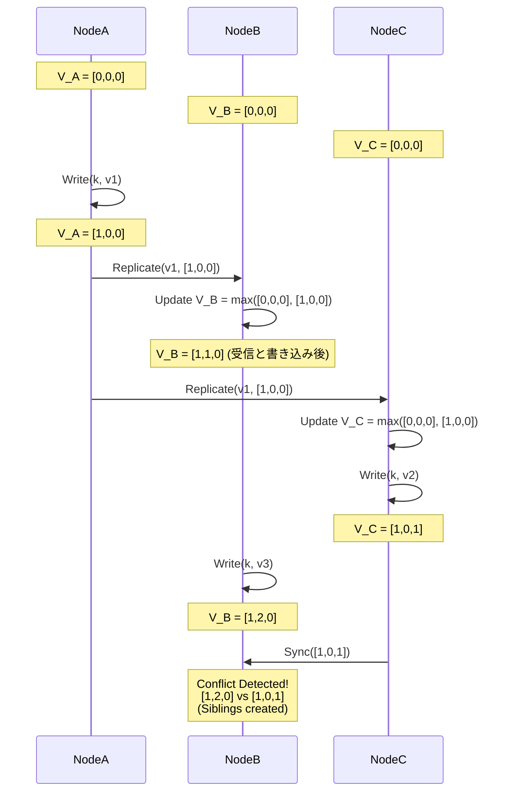

# Vector ClocksとCRDTs - 分散データ競合解決の芸術

## エグゼクティブサマリー (Executive Summary)

グローバル規模で障害に強いクラウドストレージを作ろうとする競争の中で、Amazon DynamoDB(初期のアーキテクチャ)やBasho Riakのような先駆的なプラットフォームは、ある選択をした。強い一貫性(Strong Consistency)を手放してでも、稼働率99.999%クラスの可用性を取りにいったのだ。この判断が導く先は結果整合性(Eventual Consistency)の世界であり、そこでは分散したサーバー群が互いに独立・非同期に書き込みを受け付けることになる。

しかしこの自由には代償がある。**データの競合**だ。海底ケーブルが切れている間に、米国と欧州の2つのデータセンターで別々のユーザーが同じドキュメントを編集したとしたら、ネットワークが復旧したときシステムはどちらのバージョンを正とすべきか、どうやって判断するのか。

本稿ではこの問題を解く2つの数学的な道具、**Vector Clocks(ベクタークロック)**と**CRDT(Conflict-free Replicated Data Type)**を掘り下げる。Leslie Lamportの「happens-before」理論から、実際のハードウェアのマイクロアーキテクチャまで見ていくことで、データベースが遅延と分岐(divergence)をどう扱っているかの全体像を描く。

**問題提起 (Problem Statement):**
中央集権的な分散ロックに頼らずに、分散ネットワーク上でデータの整合性と因果関係(causality)の順序をどう維持するか。ロックはそれ自体がパフォーマンスのボトルネックになる。必要なのは、データが安全に分岐したあと、情報を失うことなく自動的かつ決定論的にマージできるアルゴリズムだ。

**教訓と得られた知識 (Lessons Learned):**
1. **時間は絶対的なものではない。** 物理時計(wall-clock)だけを頼りに、どのイベントが先に起きたかを判定することはできない。Vector Clocksは「論理時間」という別の物差しを与えてくれる。
2. **アプリケーション任せか、自動化か。** Vector Clocksは競合を検知するだけで、解決の責任をアプリケーション層に投げる。一方CRDTは、交換則・結合則・冪等則という数学的な性質を利用して、競合そのものを自動でマージしてしまう、一歩踏み込んだアプローチだ。
3. **ゴミの圧力と状態空間の肥大化。** これらの分散アルゴリズムは決して安くない。CRDTのTombstone(墓石)やVector Clocksのリストは、うまく刈り込む(pruning)仕組みがなければどこまでも膨らんでいく。

---

## 因果関係とVector Clocksの基礎

競合を扱うには、まずシステムがイベントの順序を理解できなければならない。1978年、Leslie Lamportは$\rightarrow$と表記される**「happens-before」**関係を定義した。
- イベント$a$が$b$より先に起きるなら($a \rightarrow b$)、$a$から$b$への情報の流れ、つまり因果関係が存在する。
- $a \rightarrow b$でも$b \rightarrow a$でもないなら、2つのイベントは**並行(concurrent)**であり、$a \parallel b$と書く。競合が生まれるのはまさにこの瞬間だ。

### Vector Clocksの動作メカニズム

$N$台のノードからなるシステムでのVector Clockは、$N$個の整数を並べたベクトル$V$として表現される。
更新ルールは次の通り。
1. 初期状態ではすべての$V_i[j] = 0$。
2. イベント(書き込み)を実行する前に、ノード$i$は自分の要素をインクリメントする: $V_i[i] \leftarrow V_i[i] + 1$。
3. メッセージ送信時、ノードは自分の$V_i$を添付する。
4. メッセージ受信時、ノード$j$は自分のベクトルと受信したベクトルをMax演算でマージする: $\forall k, V_j[k] \leftarrow \max(V_j[k], V_m[k])$。そのあと$V_j[j]$をインクリメントする。

**競合をどう検知するか:**
ベクトル$V_A$、$V_B$を持つ2つのデータバージョン$A$、$B$を比較するとき、
- $\forall k, V_A[k] \le V_B[k]$なら、$A$は$B$の祖先であり、$A$を$B$で安全に上書きできる。
- $V_A \not\le V_B$かつ$V_B \not\le V_A$なら、両者は**並行**、つまり分岐している。Dynamoのようなシステムは両方のバージョン(Siblingと呼ぶ)をそのまま保存してクライアントに返し、マージの判断はクライアント側に委ねる(Amazonのショッピングカートのマージロジックが典型例だ)。



### 状態空間が肥大化する問題

Vector Clocksの一番の弱点は、構造そのものが膨張していくことだ。数千台規模のクラスターでは、Vector Clockの長さも数千要素に達する。この巨大なメタデータを毎回の読み書きに付けて回すと、ネットワーク帯域を食いつぶし、CPUキャッシュもずたずたになる。
Amazonはこれに対処するため**Pruning Algorithm**を採用した。Vector Clockを`(NodeID, Counter, Timestamp)`のリストに圧縮し、上限を超えたら最も古いNodeIDから切り捨てる。ただしこの方法には副作用があり、因果関係の履歴が失われることで、本来は順序が明確な2つの書き込みを誤って競合と判定してしまう**偽陽性**が発生する。

---

## CRDT: 数学的に自動マージする仕組み(Basho Riak)

Vector Clockが競合解決をアプリケーション層に投げっぱなしにするのに対し、**CRDT(Conflict-free Replicated Data Type)**はそれをデータベース層で根本的に片付けてしまう。Basho Riakではこれがコア技術として採用されている。

分散代数の観点で言うと、CvRDT(状態ベース)型のCRDTでは、マージ関数$m(x,y)$、つまり$x \sqcup y$が**結び半束(join-semilattice)**を構成する必要がある。この関数は次の3つの法則を満たさなければならない。
1. **交換則:** $x \sqcup y = y \sqcup x$。ネットワークパケットがどんな順番で届いても結果は変わらない。
2. **結合則:** $(x \sqcup y) \sqcup z = x \sqcup (y \sqcup z)$。データがどんな経路を通ってルーティングされても、最終的には同じ状態に収束する。
3. **冪等則:** $x \sqcup x = x$。ネットワークがループしてTCP再送で同じパケットが100回届いても、データが壊れることはない。

### OR-Set(Observed-Remove Set)構造の中身

異なる大陸にいる複数の人が要素$E$を追加(Add)したり削除(Remove)したりしても競合が起きない集合構造を、どう設計すればいいのか。

CRDTはこれをOR-Setで解決する。要素$E$を追加するたびに、単に$E$を保存するのではなく、一意の**UUID(タグ)**を付与する。内部状態は`(E, タグ)`のペアの集合になる。
- **米国が$E$を追加:** `(E, tag_US)`
- **欧州が$E$を追加:** `(E, tag_EU)`
同期すると、状態は`{ (E, tag_US), (E, tag_EU) }`に収束する。$E$は存在すると判定される。

欧州側が$E$を削除しても、メモリから物理的に消えるわけではない。`(E, tag_EU)`が**Tombstone Set**(墓石の集合)に移されるだけだ。
米国と再同期すると、`(E, tag_EU)`が削除済みだとわかるが、`(E, tag_US)`はまだ生きている。結果として$E$は画面に表示され続ける。タグによる厳密な識別のおかげで、「本来消えているはずのものが幻のように残る」現象は起きない。

```cpp
#include <iostream>
#include <set>
#include <string>
#include <algorithm>

// 低レベルOR-Set CRDTアーキテクチャのシミュレーション
struct Element {
    std::string value;
    std::string tag;
    bool operator<(const Element& other) const {
        if (value != other.value) return value < other.value;
        return tag < other.tag;
    }
};

class ORSet {
private:
    std::set<Element> add_set;
    std::set<Element> tombstone_set; // 墓石の集合

    std::string generate_tag() {
        static int counter = 0;
        return "uuid_" + std::to_string(++counter);
    }

public:
    void add(const std::string& val) {
        add_set.insert({val, generate_tag()});
    }

    void remove(const std::string& val) {
        // 観察されているすべてのタグをtombstoneに移動
        for (const auto& elem : add_set) {
            if (elem.value == val) tombstone_set.insert(elem);
        }
    }

    bool contains(const std::string& val) const {
        for (const auto& elem : add_set) {
            // add_set内に存在し、かつtombstone_setに入っていない場合に存在する
            if (elem.value == val && tombstone_set.find(elem) == tombstone_set.end()) {
                return true;
            }
        }
        return false;
    }

    // 結び半束 (Join Semilattice) 演算: 冪等則、交換則、結合則
    void merge(const ORSet& other) {
        std::set<Element> new_add;
        std::set_union(add_set.begin(), add_set.end(),
                       other.add_set.begin(), other.add_set.end(),
                       std::inserter(new_add, new_add.begin()));
        add_set = new_add;

        std::set<Element> new_tomb;
        std::set_union(tombstone_set.begin(), tombstone_set.end(),
                       other.tombstone_set.begin(), other.tombstone_set.end(),
                       std::inserter(new_tomb, new_tomb.begin()));
        tombstone_set = new_tomb;
    }
};
```

---

## マイクロアーキテクチャ、メモリ管理、LSM-Treeとの統合

CRDTの理論自体は美しいが、実際の物理ハードウェア上で動かすと、キャッシュとガベージコレクションに関する頭の痛い問題が出てくる。

### NUMAとFalse Sharing

マルチコアのNUMA環境では、数百のスレッドが毎秒数千件のトランザクションを処理する。スレッドがCRDTにデータを書き込むとき、Tombstoneの数やVector Clockのメタデータを抱えたCRDTのサイズは、しばしば標準的なL1キャッシュラインである64バイトを超えてしまう。
1回の書き込みが他のすべてのCPUのキャッシュラインを無効化し、最悪のケースでは**False Sharing**や**キャッシュラインの競合**を招く。

これを避ける方法が**Thread-Local State Shards**だ。各CPUスレッドは自分のローカルRAM上に独立したCRDTを持ち、他スレッドとメモリを共有せず、Mutexロックも使わない。一定周期(例えば5msごと)で、バックグラウンドスレッドがすべてのローカルシャードを走査し、高速なCompare-and-Swap(CAS)命令を使ってCRDTのマージ関数$m(x,y)$を呼び出す。

### LSM-TreeのBlock I/O層へのマージ関数の統合

OR-Set CRDTの最大の弱点は、Tombstoneがそのままでは消えないことだ。放っておけばRAMやディスクがあふれてクラッシュする。
Riakのアーキテクチャはここに巧妙な解決策を持ち込んだ。CRDTのマージ関数を**Log-Structured Merge-tree(LSM-tree)**の物理ストレージ層の奥深くに埋め込んだのだ。

LSM-tree(LevelDBやRocksDBなど)は定期的にCompaction(ディスク上のSSTableファイルのマージと圧縮)を行う。Compactorが2つのSSTableファイルを走査するとき、単純に新しいバージョンで古いバージョンを上書きするのではなく、CRDTの$\sqcup$(Join)関数がそこに組み込まれる。
このI/Oブロック層の走査中、Compactorは全体を見渡せる立場にある。あるTombstoneがクラスター内のすべての物理ノードに安全に伝播したと確認できれば(Epoch-based Reclamationなどの手法を使う)、そのTombstoneをディスクから永久に消し去る。この仕組みのおかげで、トランザクションを処理しているCPUスレッドを一切邪魔することなく、ストレージ容量が透過的に回復していく(ゼロオーバーヘッドのガベージコレクション)。

---

## 結論

Vector ClocksとCRDTは、純粋に抽象的な代数の定理が、実際のハードウェアの中に組み込まれて動くという、システム設計の面白さをよく示す例だ。

これらはCAP定理が示す限界を実質的にすり抜け、ノイズの多いネットワーク環境で真実の断片があちこちに飛び散っても、最終的には矛盾のない一つの全体像へと収束するデータベースを実現している。この仕組みを理解しておくことは、現代のクラウドネイティブなシステムを運用するうえで欠かせない知識だ。
