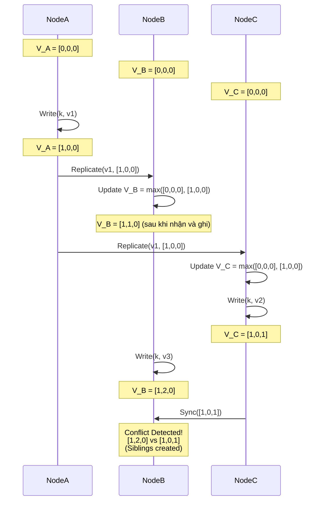

# Vector Clocks và CRDTs - Nghệ Thuật Giải Quyết Xung Đột Dữ Liệu Phân Tán

## Tóm tắt Điều hành (Executive Summary)

Trong cuộc đua xây dựng hệ thống lưu trữ đám mây chịu lỗi ở quy mô toàn cầu, những nền tảng đi trước như Amazon DynamoDB (kiến trúc gốc) hay Basho Riak đã đưa ra một lựa chọn rõ ràng: đánh đổi tính nhất quán mạnh (strong consistency) để lấy tính khả dụng gần như tuyệt đối, đạt chuẩn uptime 99.999%. Lựa chọn này đẩy hệ thống vào địa hạt của tính nhất quán cuối cùng (eventual consistency), nơi các máy chủ phân tán được phép nhận ghi độc lập và bất đồng bộ với nhau.

Nhưng sự tự do đó có giá của nó: **xung đột trạng thái dữ liệu**. Giả sử hai người dùng cùng sửa một tài liệu ở hai trung tâm dữ liệu khác nhau — Mỹ và châu Âu chẳng hạn — trong lúc tuyến cáp quang biển bị đứt. Khi mạng nối lại, hệ thống dựa vào đâu để biết phiên bản nào mới là đúng?

Bài viết này đi vào hai công cụ toán học then chốt để giải bài toán đó: **Vector Clocks** (đồng hồ vector) và **CRDT** (Conflict-free Replicated Data Type). Từ lý thuyết "happens-before" của Leslie Lamport cho tới tận vi kiến trúc phần cứng, ta sẽ thấy cách các cơ sở dữ liệu thực sự xử lý độ trễ và sự phân kỳ dữ liệu.

**Vấn đề cốt lõi (Problem Statement):**
Làm sao giữ được tính toàn vẹn dữ liệu và thứ tự nhân quả (causality) trên một mạng phân tán mà không cần dựa vào khóa tập trung? Khóa phân tán tự nó đã là một điểm nghẽn hiệu năng. Cái cần có là những thuật toán phi tập trung, cho phép dữ liệu phân kỳ một cách an toàn rồi sau đó tự hợp nhất lại theo cách tất định, không làm mất thông tin.

**Bài học và Kiến thức rút ra (Lessons Learned):**
1. **Thời gian không phải là tuyệt đối.** Không thể chỉ dựa vào đồng hồ vật lý (wall-clock) để xác định sự kiện nào xảy ra trước. Vector Clocks cho một khung tham chiếu khác: thời gian logic.
2. **Đẩy trách nhiệm cho ứng dụng, hay tự động hóa.** Vector Clocks chỉ phát hiện xung đột rồi đẩy việc giải quyết cho tầng ứng dụng. CRDT đi xa hơn — nhờ các tính chất giao hoán, kết hợp, lũy đẳng, nó tự động hợp nhất mọi xung đột mà không cần con người can thiệp.
3. **Áp lực rác và không gian trạng thái phình to.** Các thuật toán phân tán này không hề rẻ về bộ nhớ. Tombstone của CRDT hay danh sách Vector Clocks có thể phình vô hạn nếu không có cơ chế cắt tỉa (pruning) hợp lý.

---

## Mối Quan Hệ Nhân Quả và Nền Tảng Của Vector Clocks

Muốn xử lý xung đột, hệ thống trước hết phải hiểu được thứ tự các sự kiện. Năm 1978, Leslie Lamport định nghĩa quan hệ **"happens-before"**, ký hiệu $\rightarrow$.
- Nếu sự kiện $a$ xảy ra trước $b$ ($a \rightarrow b$), có một luồng thông tin (hay quan hệ nhân quả) đi từ $a$ sang $b$.
- Nếu không có $a \rightarrow b$ và cũng không có $b \rightarrow a$, hai sự kiện được gọi là **đồng thời (concurrent)**, viết $a \parallel b$. Đây chính xác là lúc xung đột có thể nảy sinh.

### Cơ Chế Vận Hành Của Vector Clocks

Trong một hệ thống có $N$ nút, Vector Clock là một vector $V$ gồm $N$ số nguyên.
Quy tắc cập nhật như sau:
1. Ban đầu mọi $V_i[j] = 0$.
2. Trước khi thực hiện một sự kiện ghi, nút $i$ tăng phần tử cục bộ: $V_i[i] \leftarrow V_i[i] + 1$.
3. Khi gửi tin, nút đính kèm $V_i$ của mình.
4. Khi nhận tin, nút $j$ hợp nhất vector của nó với vector nhận được bằng phép Max: $\forall k, V_j[k] \leftarrow \max(V_j[k], V_m[k])$, rồi tăng $V_j[j]$.

**Cách phát hiện xung đột:**
So sánh hai phiên bản dữ liệu $A$ và $B$ (với vector $V_A$, $V_B$):
- Nếu $\forall k, V_A[k] \le V_B[k]$: $A$ là tiền thân của $B$, hệ thống có thể ghi đè $A$ bằng $B$ một cách an toàn.
- Nếu $V_A \not\le V_B$ và $V_B \not\le V_A$: hai phiên bản **đồng thời** — chúng đã phân kỳ. Các hệ thống như Dynamo sẽ giữ lại cả hai (gọi là Sibling) và trả về cho client, để client tự quyết định cách gộp chúng (giỏ hàng Amazon là ví dụ kinh điển).



### Khi Không Gian Trạng Thái Phình To Mất Kiểm Soát

Nhược điểm rõ nhất của Vector Clocks là cấu trúc cứ phình lên theo thời gian. Trong một cụm hàng nghìn máy chủ, mỗi Vector Clock cũng dài hàng nghìn phần tử. Kèm theo lượng metadata khổng lồ này vào mỗi lần đọc/ghi sẽ ngốn sạch băng thông mạng và làm nát CPU cache.
Amazon xử lý vấn đề này bằng **thuật toán cắt tỉa (pruning)**: Vector Clock được nén lại thành danh sách `(NodeID, Counter, Timestamp)`, và khi vượt quá giới hạn cho phép, các NodeID cũ nhất sẽ bị loại bỏ. Cái giá phải trả là **dương tính giả** — vì mất một phần lịch sử nhân quả, hệ thống có thể nhầm hai bản ghi vốn tuần tự thành xung đột.

---

## CRDT: Nghệ Thuật Tự Hợp Nhất Bằng Toán Học (Basho Riak)

Nếu Vector Clock chỉ dừng ở việc phát hiện xung đột rồi đẩy trách nhiệm giải quyết cho tầng ứng dụng, thì **CRDT (Conflict-free Replicated Data Type)** giải quyết vấn đề tận gốc, ngay tại tầng cơ sở dữ liệu. Đây là công nghệ lõi trong Basho Riak.

Xét về đại số phân tán, các CRDT loại CvRDT (dựa trên trạng thái) yêu cầu hàm hợp nhất $m(x,y)$, hay $x \sqcup y$, phải tạo thành một **nửa dàn liên kết (join-semilattice)**. Hàm này bắt buộc phải thỏa ba tính chất sau:
1. **Giao hoán:** $x \sqcup y = y \sqcup x$ — gói tin mạng đến theo thứ tự nào cũng cho cùng một kết quả.
2. **Kết hợp:** $(x \sqcup y) \sqcup z = x \sqcup (y \sqcup z)$ — dữ liệu đi qua bất kỳ nhánh định tuyến nào cũng hội tụ về cùng một trạng thái.
3. **Lũy đẳng:** $x \sqcup x = x$ — dù mạng bị lặp gói (TCP retransmission gửi cùng một gói 100 lần), dữ liệu vẫn không bị hỏng.

### Mổ Xẻ Cấu Trúc OR-Set (Observed-Remove Set)

Làm sao thiết kế một cấu trúc tập hợp cho phép nhiều người ở các châu lục khác nhau thêm và xóa phần tử $E$ mà không gây xung đột?

CRDT giải quyết việc này bằng OR-Set. Mỗi lần thêm phần tử $E$, hệ thống không chỉ lưu giá trị $E$ mà còn gắn thêm một **UUID (tag)** duy nhất. Trạng thái nội bộ là một tập các cặp `(E, tag)`.
- **Mỹ thêm $E$:** `(E, tag_US)`
- **Châu Âu thêm $E$:** `(E, tag_EU)`
Khi đồng bộ, trạng thái hội tụ về `{ (E, tag_US), (E, tag_EU) }` — phần tử $E$ được coi là tồn tại.

Nếu châu Âu xóa $E$, dữ liệu không thực sự biến mất khỏi bộ nhớ mà `(E, tag_EU)` chỉ được chuyển vào **tập hợp mộ (tombstone set)**.
Khi đồng bộ lại với Mỹ, hệ thống thấy `(E, tag_EU)` đã bị đánh dấu xóa, nhưng `(E, tag_US)` vẫn còn nguyên. Kết quả là $E$ vẫn hiển thị. Nhờ cơ chế định danh chặt chẽ bằng tag, hiện tượng "bóng ma" — dữ liệu lẽ ra đã xóa nhưng vẫn xuất hiện lại — hoàn toàn không xảy ra.

```cpp
#include <iostream>
#include <set>
#include <string>
#include <algorithm>

// Mô phỏng kiến trúc OR-Set CRDT Cấp Thấp
struct Element {
    std::string value;
    std::string tag;
    bool operator<(const Element& other) const {
        if (value != other.value) return value < other.value;
        return tag < other.tag;
    }
};

class ORSet {
private:
    std::set<Element> add_set;
    std::set<Element> tombstone_set; // Tập hợp mộ

    std::string generate_tag() {
        static int counter = 0;
        return "uuid_" + std::to_string(++counter);
    }

public:
    void add(const std::string& val) {
        add_set.insert({val, generate_tag()});
    }

    void remove(const std::string& val) {
        // Chuyển mọi tag đang được quan sát vào tombstone
        for (const auto& elem : add_set) {
            if (elem.value == val) tombstone_set.insert(elem);
        }
    }

    bool contains(const std::string& val) const {
        for (const auto& elem : add_set) {
            // Tồn tại nếu nằm trong add_set và chưa vào tombstone_set
            if (elem.value == val && tombstone_set.find(elem) == tombstone_set.end()) {
                return true;
            }
        }
        return false;
    }

    // Phép Join Semilattice: Lũy đẳng, Giao hoán, Kết hợp
    void merge(const ORSet& other) {
        std::set<Element> new_add;
        std::set_union(add_set.begin(), add_set.end(),
                       other.add_set.begin(), other.add_set.end(),
                       std::inserter(new_add, new_add.begin()));
        add_set = new_add;

        std::set<Element> new_tomb;
        std::set_union(tombstone_set.begin(), tombstone_set.end(),
                       other.tombstone_set.begin(), other.tombstone_set.end(),
                       std::inserter(new_tomb, new_tomb.begin()));
        tombstone_set = new_tomb;
    }
};
```

---

## Kiến Trúc Vi Mô, Quản Lý Bộ Nhớ và Sự Kết Hợp Với LSM-Tree

Lý thuyết CRDT rất đẹp trên giấy, nhưng khi chạy trên phần cứng thật, nó kéo theo không ít vấn đề đau đầu về cache CPU và chu kỳ dọn rác.

### Bức Tường NUMA và False Sharing

Trong môi trường đa nhân NUMA, hàng trăm luồng xử lý hàng nghìn giao dịch mỗi giây. Khi một luồng ghi dữ liệu vào CRDT, kích thước của nó — cộng dồn nhiều tombstone và metadata Vector Clock — thường vượt quá 64 byte, tức lớn hơn một cache line L1 chuẩn.
Một lần ghi như vậy làm vô hiệu hóa cache line ở mọi CPU khác, gây ra hiện tượng **false sharing** và tranh chấp cache line ở mức tồi tệ nhất.

Cách xử lý là dùng **Thread-Local State Shards**: mỗi luồng CPU giữ một bản CRDT riêng trên RAM cục bộ của nó, không chia sẻ bộ nhớ với luồng khác, không cần mutex. Theo chu kỳ (ví dụ mỗi 5ms), một luồng nền sẽ quét qua toàn bộ các mảnh cục bộ này và gọi hàm hợp nhất CRDT $m(x,y)$ bằng các lệnh nguyên tử Compare-and-Swap (CAS) tốc độ cao.

### Đưa Hàm Merge CRDT Xuống Tầng Block I/O Của LSM-Tree

Điểm yếu lớn nhất của OR-Set CRDT là các tombstone không tự biến mất. Nếu bỏ mặc, cơ sở dữ liệu sớm muộn cũng sập vì tràn RAM hoặc đĩa.
Kiến trúc Riak giải quyết việc này khá tinh tế: đẩy hàm hợp nhất CRDT xuống tận tầng lưu trữ vật lý của **Log-Structured Merge-tree (LSM-tree)**.

LSM-tree (như LevelDB, RocksDB) định kỳ chạy compaction — trộn và nén các file SSTable trên đĩa. Khi bộ nén (compactor) quét qua hai file SSTable, thay vì chỉ đơn giản ghi đè bản mới lên bản cũ, nó nhúng luôn hàm $\sqcup$ (Join) của CRDT vào quá trình đó.
Trong lúc quét sâu ở tầng I/O block này, compactor có cái nhìn toàn cục. Nếu xác nhận được một tombstone đã đồng bộ an toàn tới mọi node vật lý trong cụm (dùng kỹ thuật epoch-based reclamation), nó sẽ xóa vĩnh viễn tombstone đó khỏi đĩa. Cơ chế này giải phóng dung lượng lưu trữ gần như trong suốt, không hề làm gián đoạn các luồng CPU đang xử lý giao dịch — một dạng garbage collection gần như không tốn chi phí.

---

## Tổng Kết

Vector Clocks và CRDT là một minh chứng đẹp cho nghệ thuật thiết kế hệ thống: những định lý đại số trừu tượng được đưa thẳng vào lõi của các cỗ máy phần cứng thực tế.

Chúng giúp vượt qua giới hạn của định lý CAP, cho phép vận hành những cơ sở dữ liệu mà ở đó các mảnh dữ liệu có thể tạm thời tản ra nhiều hướng trong một mạng lưới đầy nhiễu loạn, nhưng cuối cùng vẫn luôn hội tụ về một bức tranh nhất quán và trọn vẹn. Hiểu rõ cơ chế này là điều kiện gần như bắt buộc để vận hành các hệ thống cloud-native hiện đại mà không có điểm chết.
