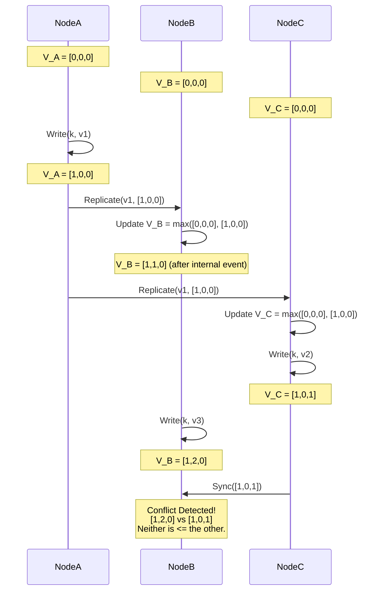

# 28: Vector Clocks và CRDTs: Giải quyết xung đột trong DynamoDB/Riak

Trong các hệ thống phân tán quy mô toàn cầu, việc duy trì tính nhất quán của dữ liệu khi phải đối mặt với độ trễ mạng, phân mảnh mạng (network partitions) và các lỗi phần cứng là một bài toán nền tảng của khoa học máy tính. Theo định lý CAP do Eric Brewer đề xuất, một hệ thống dữ liệu phân tán không thể đồng thời đảm bảo ba thuộc tính: Nhất quán (Consistency), Khả dụng (Availability) và Chống chịu phân mảnh (Partition Tolerance). Trong bối cảnh các dịch vụ đám mây yêu cầu độ sẵn sàng cao, các hệ thống cơ sở dữ liệu như Amazon DynamoDB (trong kiến trúc gốc của Dynamo) và Basho Riak đã chủ động đánh đổi tính nhất quán mạnh (strong consistency) để đổi lấy tính khả dụng cao, dẫn đến sự ra đời của mô hình nhất quán cuối cùng (eventual consistency). Tuy nhiên, việc cho phép các bản sao dữ liệu (replicas) nhận các thao tác ghi độc lập dẫn đến nguy cơ xung đột dữ liệu trạng thái. Để giải quyết vấn đề này mà không cần đến cơ chế khóa phân tán tốn kém hoặc một bộ định tuyến trung tâm, các kỹ sư và nhà nghiên cứu đã áp dụng các cấu trúc toán học tinh vi như Đồng hồ Vector (Vector Clocks) và Kiểu dữ liệu Nhân bản Không Xung đột (Conflict-free Replicated Data Types - CRDTs). Những công cụ này cung cấp nền tảng lý thuyết vững chắc cho việc xác định trật tự nhân quả (causal ordering) và hợp nhất trạng thái (state merging) một cách tất định, giúp hệ thống tự động dung hòa các phiên bản dữ liệu phân kỳ mà không cần sự can thiệp thủ công từ phía người dùng, đảm bảo tính toàn vẹn ở mức vi mô. Bài viết này sẽ đi sâu vào phân tích kiến trúc vi mô, cấu trúc toán học, thuật toán hợp nhất, cơ chế quản lý bộ nhớ của hệ điều hành và các giới hạn phần cứng trong việc triển khai Vector Clocks và CRDTs trong các hệ thống lưu trữ phân tán hiện đại.

## Phân tích Kỹ thuật Chuyên sâu về Vector Clocks trong DynamoDB

Đồng hồ Vector (Vector Clocks) là một cấu trúc dữ liệu và thuật toán được thiết kế để tạo ra một trật tự cục bộ (partial ordering) của các sự kiện trong một hệ thống phân tán, dựa trên khái niệm quan hệ "xảy ra trước" (happens-before relation) do Leslie Lamport khởi xướng. Về mặt toán học, quan hệ happens-before, ký hiệu là $\rightarrow$, là một quan hệ bắc cầu khép kín áp dụng trên tập hợp các sự kiện. Nếu sự kiện $a$ xảy ra trước sự kiện $b$ ($a \rightarrow b$), thì có một luồng thông tin nhân quả từ $a$ đến $b$. Nếu không có $a \rightarrow b$ và cũng không có $b \rightarrow a$, thì hai sự kiện được gọi là đồng thời (concurrent), ký hiệu là $a \parallel b$. Một Vector Clock trong một hệ thống có $N$ nút (nodes) là một mảng hoặc một vector $V$ gồm $N$ số nguyên. Mỗi nút $P_i$ duy trì một Vector Clock cục bộ $V_i$. Các quy tắc cập nhật trạng thái của $V_i$ được định nghĩa cực kỳ nghiêm ngặt: ban đầu, mọi $V_i[j] = 0$ cho mọi $j \in \{1, \dots, N\}$. Trước khi thực hiện bất kỳ sự kiện cục bộ nào (như thao tác ghi cơ sở dữ liệu), nút $P_i$ phải tăng bộ đếm của chính nó: $V_i[i] \leftarrow V_i[i] + 1$. Khi $P_i$ gửi một tin nhắn $m$ đến một nút khác, nó đính kèm bản sao của vector clock hiện tại vào tin nhắn, tạo thành một tuple $(m, V_i)$. Khi nút $P_j$ nhận được tin nhắn $(m, V_m)$, nó sẽ cập nhật vector clock của chính nó bằng cách hợp nhất với vector clock của tin nhắn thông qua hàm lấy giá trị lớn nhất cho từng thành phần: $\forall k \in \{1, \dots, N\}, V_j[k] \leftarrow \max(V_j[k], V_m[k])$. Cuối cùng, $P_j$ ghi nhận sự kiện nhận tin nhắn bằng cách tăng bộ đếm của mình: $V_j[j] \leftarrow V_j[j] + 1$. Kiến trúc của Amazon Dynamo ban đầu áp dụng cơ chế này cho mỗi đối tượng dữ liệu được lưu trữ, trong đó mỗi phiên bản của một dữ liệu được gắn một vector clock đại diện cho lịch sử cập nhật của nó. Khi một yêu cầu đọc chạm tới nhiều bản sao và trả về các vector clock khác nhau, hệ thống có thể so sánh chúng để phát hiện xem một phiên bản có kế thừa trực tiếp từ phiên bản kia hay không. Việc so sánh hai vector clock $V$ và $V'$ được xác định như sau: $V \le V'$ khi và chỉ khi $\forall i, V[i] \le V'[i]$. Hơn nữa, $V < V'$ nếu $V \le V'$ và tồn tại ít nhất một $k$ sao cho $V[k] < V'[k]$. Nếu điều này đúng, hệ thống kết luận phiên bản mang $V$ là tiền thân của phiên bản mang $V'$ và tự động loại bỏ phiên bản cũ. Ngược lại, nếu cả $V \not\le V'$ và $V' \not\le V$, hai phiên bản này được coi là phân kỳ (divergent) do thao tác ghi đồng thời tại các nút khác nhau, và hệ thống, theo triết lý "always writeable" của Dynamo, sẽ lưu trữ cả hai phiên bản (gọi là anh em - siblings) và nhường quyền quyết định dung hòa (reconciliation) lại cho lớp ứng dụng (application layer).



Một trong những rào cản kỹ thuật khốc liệt nhất khi triển khai Vector Clocks ở quy mô cụm hàng nghìn máy chủ là hiện tượng bùng nổ không gian trạng thái (state space explosion). Khi số lượng máy chủ tham gia phục vụ một khóa dữ liệu tăng lên do thay đổi cấu trúc cụm (membership changes) hoặc thay thế phần cứng, kích thước của Vector Clock sẽ phình to tuyến tính theo số lượng định danh các nút. Trong môi trường I/O với độ trễ cực thấp (ultra-low latency), việc nối thêm hàng chục byte metadata vào mỗi thao tác đọc/ghi sẽ dẫn đến suy thoái hiệu suất bộ nhớ đệm (cache degradation) nghiêm trọng và bão hòa băng thông mạng (network bandwidth saturation). Các kiến trúc sư hệ thống tại Amazon đã phải áp dụng các thuật toán cắt tỉa (pruning algorithms) tinh vi, trong đó một Vector Clock thực chất được lưu trữ dưới dạng một danh sách các cặp $(NodeID, Counter, Timestamp)$. Khi kích thước của vector vượt quá một ngưỡng giới hạn nhất định (ví dụ: 10 phần tử), hệ thống sẽ chủ động thực hiện cắt tỉa bằng cách loại bỏ các cặp có $Timestamp$ cũ nhất. Tuy nhiên, thao tác cắt tỉa này không phải là miễn phí về mặt toán học; nó có nguy cơ tạo ra các vector clock bị mất thông tin lịch sử (loss of causality information), dẫn đến hiện tượng dương tính giả (false positives) trong phát hiện xung đột—tức là hai phiên bản thực chất có quan hệ nhân quả nhưng hệ thống lại nhận diện sai thành xung đột do phần thông tin giao nhau đã bị cắt đi. Việc triển khai các thuật toán thao tác vector clock thường được viết bằng các ngôn ngữ hệ thống bậc thấp như C++ hoặc Rust để tối ưu hóa bộ nhớ CPU và sử dụng các tập lệnh SIMD (Single Instruction, Multiple Data) nhằm thực hiện phép toán $\max()$ trên toàn bộ mảng dữ liệu trong một chu kỳ xung nhịp máy tính.

```rust
#[derive(Clone, Debug, PartialEq, Eq)]
pub struct VectorClock {
    pub entries: std::collections::BTreeMap<String, u64>,
}

pub enum Relation {
    HappensBefore,
    HappensAfter,
    Concurrent,
    Equal,
}

impl VectorClock {
    pub fn new() -> Self {
        VectorClock { entries: std::collections::BTreeMap::new() }
    }

    pub fn increment(&mut self, node_id: &str) {
        let count = self.entries.entry(node_id.to_string()).or_insert(0);
        *count += 1;
    }

    pub fn merge(&mut self, other: &VectorClock) {
        for (k, v) in &other.entries {
            let count = self.entries.entry(k.clone()).or_insert(0);
            *count = std::cmp::max(*count, *v);
        }
    }

    pub fn compare(&self, other: &VectorClock) -> Relation {
        let mut is_less = false;
        let mut is_greater = false;

        let all_keys: std::collections::HashSet<_> = self.entries.keys()
            .chain(other.entries.keys()).collect();

        for key in all_keys {
            let val_self = self.entries.get(key).unwrap_or(&0);
            let val_other = other.entries.get(key).unwrap_or(&0);

            if val_self < val_other {
                is_less = true;
            } else if val_self > val_other {
                is_greater = true;
            }
            
            if is_less && is_greater {
                return Relation::Concurrent;
            }
        }

        if is_less { Relation::HappensBefore }
        else if is_greater { Relation::HappensAfter }
        else { Relation::Equal }
    }
}
```

## Cấu trúc Dữ liệu CRDT và Cơ chế Toán học Ứng dụng trong Riak

Trong khi Vector Clocks chỉ cung cấp một cơ chế để phát hiện sự kiện đồng thời và giao phó việc giải quyết xung đột cho ứng dụng, Kiểu dữ liệu Nhân bản Không Xung đột (CRDTs - Conflict-free Replicated Data Types) mang đến một bước tiến mang tính cách mạng bằng cách tự động dung hòa trạng thái một cách toán học mà không cần sự can thiệp của con người. Basho Riak đã áp dụng sâu sắc CRDTs vào trong hệ lõi của mình để hỗ trợ các bộ đếm phân tán (distributed counters), tập hợp (sets), và bản đồ (maps) có khả năng tự hội tụ. CRDTs được chia làm hai loại chính: CRDT dựa trên trạng thái (CvRDT - Convergent Replicated Data Type) và CRDT dựa trên thao tác (CmRDT - Commutative Replicated Data Type). Trong kiến trúc lưu trữ vô trạng thái (stateless replica architecture) với sự phân tán địa lý, CvRDT thường được ưu tiên vì chúng không yêu cầu một kênh truyền tải đảm bảo thứ tự (ordered delivery channel) như CmRDT. Về mặt toán học đại số, một CvRDT được xác định bởi một tuple $(S, \le, s_0, q, u, m)$, trong đó $S$ là một nửa dàn liên kết (join-semilattice) biểu diễn toàn bộ không gian trạng thái, $\le$ là một quan hệ trật tự cục bộ tương thích trên $S$, $s_0$ là trạng thái khởi tạo, $q$ là hàm truy vấn không thay đổi trạng thái, $u$ là hàm cập nhật thay đổi trạng thái sao cho trạng thái mới luôn tiến hóa theo chiều hướng đi lên trên $\le$, và quan trọng nhất là $m: S \times S \rightarrow S$, hàm hợp nhất trạng thái. Hàm hợp nhất $m$, còn được gọi là phép toán join (ký hiệu là $\sqcup$), phải tìm ra giới hạn trên nhỏ nhất (Least Upper Bound - LUB) của hai trạng thái. Để hệ thống đảm bảo tính hội tụ bền vững (strong eventual consistency), toán tử $\sqcup$ phải tuyệt đối tuân thủ ba tiên đề đại số khắt khe: Giao hoán (Commutativity) $\forall x, y \in S: x \sqcup y = y \sqcup x$; Kết hợp (Associativity) $\forall x, y, z \in S: (x \sqcup y) \sqcup z = x \sqcup (y \sqcup z)$; và Lũy đẳng (Idempotency) $\forall x \in S: x \sqcup x = x$. Chính nhờ sự giao hoán và kết hợp mà các bản tin đồng bộ hóa có thể đến đích theo bất kỳ thứ tự nào và thông qua các lộ trình định tuyến khác nhau mà vẫn đảm bảo cùng một kết quả hội tụ tại mọi nút. Tính lũy đẳng giải quyết triệt để vấn đề mất tin nhắn và giao hàng lặp lại (at-least-once delivery) trong các giao thức mạng như TCP/UDP trong môi trường chịu độ trễ hoặc lỗi đường truyền.

Một minh chứng hình thái tinh xảo của CRDT là cấu trúc OR-Set (Observed-Remove Set), một cấu trúc dữ liệu cho phép thêm và xóa các phần tử trong môi trường phân tán mà không gặp rắc rối với hiện tượng "bóng ma" (phantom items) thường thấy ở các hệ thống không đồng bộ. Trong OR-Set, mỗi thao tác thêm (Add) một phần tử $e$ sẽ tạo ra một định danh duy nhất toàn cục (Unique Tag), thường là một UUID (Universally Unique Identifier) kết hợp với một dấu thời gian logic. Trạng thái bên trong của một OR-Set là một tập hợp các cặp $(e, tag)$. Khi người dùng thực hiện thao tác xóa (Remove) phần tử $e$, hệ thống sẽ tìm tất cả các thẻ (tags) hiện đang được quan sát liên kết với $e$ tại replica cục bộ và lưu trữ chúng vào một tập hợp mộ (tombstone set) riêng biệt. Nếu tại cùng một thời điểm, một bản sao ở trung tâm dữ liệu Bắc Mỹ thêm $e$ và một bản sao ở trung tâm dữ liệu Châu Âu cũng thêm $e$, chúng sẽ tạo ra hai cặp $(e, tag_1)$ và $(e, tag_2)$. Khi hai replica đồng bộ trạng thái thông qua hàm merge (sử dụng phép hợp tập hợp $A \cup B$), kết quả sẽ chứa cả hai thẻ. Nếu ngay sau đó, người dùng ở Châu Âu xóa $e$, tập hợp mộ sẽ chứa $(e, tag_2)$. Trong lần đồng bộ tiếp theo, phần tử $e$ vẫn được coi là tồn tại trong OR-Set vì trạng thái hiện tại là $(e, tag_1)$ vẫn chưa bị xóa (tức là $tag_1$ không nằm trong tập hợp mộ). Sự phức tạp toán học này hoàn toàn ẩn giấu khỏi người dùng cuối, nhưng lại đòi hỏi một hệ thống cấp phát và giải phóng bộ nhớ (memory allocation) cực kỳ tinh vi ở tầng cơ sở dữ liệu để tránh rò rỉ vùng nhớ do sự tích lũy của các thẻ tombstone theo thời gian, đặc biệt là trong các hệ thống rác (garbage-collected) nhạy cảm với độ trễ (latency spikes). Thuật toán tối ưu hóa thông qua cơ chế vạch kỷ nguyên (epoch-based reclamation) hoặc Dotted Version Vectors (DVV) đã được giới thiệu để nén các thông tin siêu dữ liệu (metadata) khổng lồ này, giới hạn sự phát triển của không gian trạng thái ở mức độ tuyến tính theo số lượng tác nhân hoạt động thay vì tuyến tính theo số lượng toàn bộ thao tác hệ thống lịch sử.

```cpp
#include <iostream>
#include <set>
#include <string>
#include <tuple>
#include <algorithm>

struct Element {
    std::string value;
    std::string tag;
    
    bool operator<(const Element& other) const {
        if (value != other.value) return value < other.value;
        return tag < other.tag;
    }
};

class ORSet {
private:
    std::set<Element> add_set;
    std::set<Element> remove_set;

    std::string generate_tag() {
        static int counter = 0;
        return "tag_" + std::to_string(++counter); // Simplified UUID
    }

public:
    void add(const std::string& val) {
        add_set.insert({val, generate_tag()});
    }

    void remove(const std::string& val) {
        for (const auto& elem : add_set) {
            if (elem.value == val) {
                remove_set.insert(elem);
            }
        }
    }

    bool contains(const std::string& val) const {
        for (const auto& elem : add_set) {
            if (elem.value == val && remove_set.find(elem) == remove_set.end()) {
                return true;
            }
        }
        return false;
    }

    void merge(const ORSet& other) {
        std::set<Element> new_add_set;
        std::set_union(add_set.begin(), add_set.end(),
                       other.add_set.begin(), other.add_set.end(),
                       std::inserter(new_add_set, new_add_set.begin()));
        add_set = new_add_set;

        std::set<Element> new_remove_set;
        std::set_union(remove_set.begin(), remove_set.end(),
                       other.remove_set.begin(), other.remove_set.end(),
                       std::inserter(new_remove_set, new_remove_set.begin()));
        remove_set = new_remove_set;
    }
};
```

## Giao tiếp Phần cứng, Quản lý Bộ nhớ và Tối ưu hóa Hiệu suất Cấp thấp

Việc triển khai các hệ thống dựa trên Vector Clocks và CRDTs không chỉ là một thách thức về lý thuyết toán học mà còn là một bài toán hóc búa về kiến trúc máy tính ở mức thấp (low-level computer architecture). Trong một nút Riak hoặc DynamoDB xử lý hàng trăm nghìn giao dịch mỗi giây (TPS), sự can thiệp của phần cứng và hệ điều hành đóng vai trò tối quan trọng. Bất kỳ sự cập nhật nào lên CRDT hay Vector Clock đều đòi hỏi các hoạt động ghi liên tục vào bộ nhớ chính (RAM). Khi dữ liệu này được chia sẻ qua nhiều luồng (threads) của CPU chạy trên kiến trúc NUMA (Non-Uniform Memory Access), hiện tượng tranh chấp dòng cache (cache line bouncing hay false sharing) trở thành nút thắt cổ chai lớn nhất. Mỗi cấu trúc dữ liệu CRDT có thể chiếm vài trăm byte đến vài kilobyte, làm vỡ giới hạn độ dài của các dòng cache (thường là 64 byte trên các vi kiến trúc x86_64). Do đó, thao tác ghi của một luồng tại một lõi vật lý có thể lập tức làm vô hiệu hóa (invalidate) toàn bộ dòng bộ nhớ đệm tại các lõi L1/L2 của các CPU khác, ép buộc một quá trình nạp lại từ bộ nhớ chính (main memory fetch) hoặc từ bộ đệm L3 cực kỳ tốn thời gian. Để xoa dịu vấn đề này, các mô đun cốt lõi xử lý CRDTs thường áp dụng các cấu trúc dữ liệu phân tán theo luồng cục bộ (thread-local state shards), trong đó mỗi luồng duy trì một phần vi mô của CRDT và sử dụng hàm hợp nhất $\sqcup$ một cách bất đồng bộ để chắp vá dữ liệu vào bản sao toàn cục mà không sử dụng các khóa độc quyền (mutexes) nặng nề, thay vào đó khai thác triệt để các lệnh so sánh và hoán đổi vô hướng nguyên tử (atomic Compare-and-Swap - CAS) từ tập lệnh vi xử lý.


Hơn thế nữa, một yếu tố cực kỳ then chốt trong kỹ thuật hệ thống là chi phí tuần tự hóa mạng (network serialization overhead) và quản lý I/O trên ổ đĩa. Khi hệ thống thực hiện luân chuyển trạng thái CvRDTs giữa các trung tâm dữ liệu ở các múi giờ khác nhau, một lượng lớn siêu dữ liệu metadata phải được đóng gói. Nếu sử dụng các định dạng như JSON, chu kỳ CPU tiêu tốn cho việc phân tích cú pháp (parsing) sẽ bào mòn hoàn toàn thông lượng (throughput) mạng. Thay vào đó, các cơ sở dữ liệu thường ứng dụng Google Protocol Buffers hoặc FlatBuffers để ánh xạ trực tiếp cấu trúc không gian bộ nhớ (zero-copy memory mapping) vào giao diện mạng (Network Interface Card - NIC) sử dụng công nghệ Kernel Bypass (như DPDK), loại bỏ sự chuyển ngữ cảnh tốn kém sang không gian nhân hệ điều hành (user-to-kernel context switch). Trên bình diện lưu trữ, cấu trúc Log-Structured Merge-tree (LSM-tree) đóng vai trò làm nền tảng động lực cho Riak (thông qua LevelDB hoặc Bitcask). Sự thú vị nằm ở chỗ, thao tác hợp nhất CRDT ($m(x, y)$) về mặt tự nhiên tương đương một cách hoàn hảo với tiến trình Compaction của LSM-tree. Trong quá trình trộn các tệp SSTable (Sorted String Table) trên ổ cứng SSD/NVMe, các trình thu gom rác bộ nhớ (garbage collectors) không chỉ vứt bỏ các dữ liệu ghi đè cũ, mà còn kích hoạt mã hệ thống thực thi hàm hợp nhất các trạng thái phân kỳ của CRDT trực tiếp ở cấp độ block I/O của thiết bị lưu trữ, do đó vừa tiết kiệm chi phí IOPS trên đĩa vừa khôi phục được không gian siêu dữ liệu tombstone một cách minh bạch. Tóm lại, Vector Clocks và CRDTs là bằng chứng vĩ đại cho nghệ thuật kết hợp các định lý toán học trừu tượng thuần túy vào những cỗ máy phần cứng thô ráp, kiến tạo ra những cỗ máy dữ liệu khổng lồ với khả năng tự phục hồi mà không phụ thuộc vào bất kỳ sự giả định hoàn hảo nào của thế giới vật lý phân tán.

## SEO Keywords
- Kiến trúc DynamoDB
- Basho Riak CRDTs
- Xung đột dữ liệu phân tán (Distributed Data Conflicts)
- Hệ thống phân tán (Distributed Systems)
- Đồng hồ Vector (Vector Clocks)
- Conflict-free Replicated Data Types
- Eventual Consistency
- Thuật toán hợp nhất (Merge algorithms)
- Kiến trúc NUMA và tối ưu hóa bộ nhớ
- Log-Structured Merge-tree compaction
