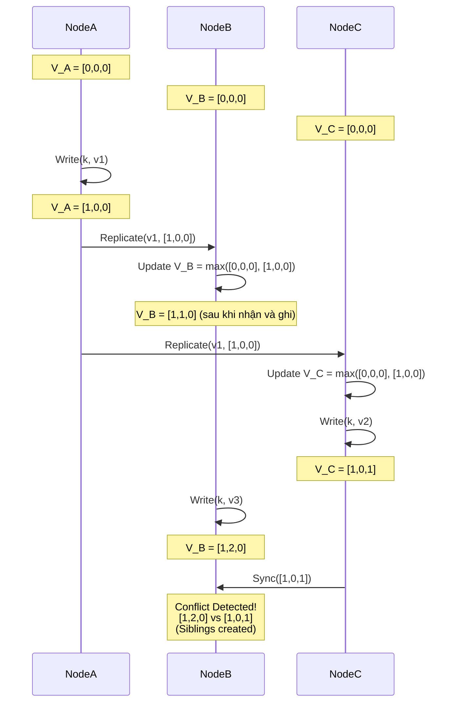

# Vector Clocks và CRDTs - Nghệ Thuật Giải Quyết Xung Đột Dữ Liệu Phân Tán

## Tóm tắt Điều hành (Executive Summary)

Khi các hãng công nghệ lớn chạy đua xây dựng hệ lưu trữ đám mây chịu lỗi ở quy mô toàn cầu, những cái tên đi đầu như Amazon DynamoDB (bản thiết kế gốc) hay Basho Riak đã đưa ra một đánh đổi dứt khoát: bỏ tính nhất quán mạnh để lấy tính khả dụng gần như tuyệt đối, ở mức uptime 99.999%. Con đường này dẫn thẳng tới tính nhất quán cuối cùng (eventual consistency) — nơi các máy chủ phân tán nhận ghi độc lập, không đồng bộ với nhau.

Cái giá của sự tự do đó là **xung đột dữ liệu**. Hình dung hai người dùng cùng sửa một tài liệu ở hai trung tâm dữ liệu khác nhau, chẳng hạn Mỹ và châu Âu, đúng lúc tuyến cáp quang biển giữa hai nơi bị đứt. Khi kết nối trở lại, hệ thống phải dựa vào cơ chế nào để quyết định phiên bản nào đúng?

Bài viết đi vào hai công cụ toán học trung tâm giải quyết bài toán này: **Vector Clocks** và **CRDT** (Conflict-free Replicated Data Type). Xuất phát từ lý thuyết "happens-before" của Leslie Lamport, đi tới tận vi kiến trúc phần cứng, ta sẽ thấy rõ cách các cơ sở dữ liệu thực tế xử lý độ trễ và tình trạng dữ liệu phân kỳ.

**Vấn đề cốt lõi (Problem Statement):**
Làm sao giữ được tính toàn vẹn dữ liệu cùng thứ tự nhân quả trên một mạng phân tán, mà không phải dựa vào cơ chế khóa tập trung — thứ luôn trở thành điểm nghẽn hiệu năng? Câu trả lời cần một lớp thuật toán phi tập trung, cho phép dữ liệu phân kỳ an toàn rồi tự hợp nhất lại theo cách tất định, không đánh mất thông tin nào.

**Bài học và Kiến thức rút ra (Lessons Learned):**
1. **Thời gian không tuyệt đối.** Đồng hồ vật lý (wall-clock) không đủ để xác định sự kiện nào xảy ra trước. Vector Clocks cho một cách nhìn khác: thời gian logic.
2. **Giao việc cho ứng dụng, hay để hệ thống tự lo.** Vector Clocks chỉ dừng ở việc phát hiện xung đột, còn giải quyết thì đẩy lên tầng ứng dụng. CRDT tiến thêm một bước: dựa vào các tính chất giao hoán, kết hợp, lũy đẳng, nó tự động gộp mọi xung đột mà không cần con người tham gia.
3. **Cái giá của rác và trạng thái phình to.** Không thuật toán phân tán nào miễn phí về bộ nhớ. Tombstone của CRDT hay danh sách Vector Clocks có thể phình lên vô hạn nếu thiếu cơ chế cắt tỉa hợp lý.

---

## Mối Quan Hệ Nhân Quả và Nền Tảng Của Vector Clocks

Để xử lý xung đột, hệ thống trước hết cần một cách hiểu thứ tự các sự kiện. Năm 1978, Leslie Lamport đưa ra quan hệ **"happens-before"**, ký hiệu $\rightarrow$.
- Nếu $a$ xảy ra trước $b$ ($a \rightarrow b$), có một luồng thông tin — hoặc quan hệ nhân quả — đi từ $a$ tới $b$.
- Nếu không tồn tại $a \rightarrow b$ lẫn $b \rightarrow a$, hai sự kiện được coi là **đồng thời**, ký hiệu $a \parallel b$. Đây chính là lúc xung đột có thể xuất hiện.

### Cơ Chế Vận Hành Của Vector Clocks

Với một hệ $N$ nút, Vector Clock là một vector $V$ gồm $N$ số nguyên.
Quy tắc cập nhật:
1. Ban đầu mọi $V_i[j] = 0$.
2. Trước một sự kiện ghi, nút $i$ tăng phần tử của chính nó: $V_i[i] \leftarrow V_i[i] + 1$.
3. Khi gửi tin, nút gửi kèm $V_i$.
4. Khi nhận tin, nút $j$ gộp vector của mình với vector nhận được theo phép Max: $\forall k, V_j[k] \leftarrow \max(V_j[k], V_m[k])$, rồi tăng $V_j[j]$.

**Phát hiện xung đột thế nào:**
So sánh hai phiên bản $A$, $B$ với vector $V_A$, $V_B$:
- Nếu $\forall k, V_A[k] \le V_B[k]$: $A$ là tiền thân của $B$, có thể ghi đè $A$ bằng $B$ an toàn.
- Nếu $V_A \not\le V_B$ và $V_B \not\le V_A$: hai bản là **đồng thời**, đã phân kỳ khỏi nhau. Những hệ thống như Dynamo giữ cả hai bản (gọi là Sibling) rồi trả về client, để client quyết định cách gộp lại — giỏ hàng Amazon là một ví dụ hay được nhắc tới.



### Khi Không Gian Trạng Thái Tự Phình Lên

Nhược điểm rõ nhất của Vector Clocks nằm ở việc cấu trúc cứ lớn dần. Với cụm hàng nghìn máy chủ, mỗi Vector Clock cũng dài tới hàng nghìn phần tử. Gánh thêm khối metadata đó vào mọi lần đọc/ghi sẽ nuốt sạch băng thông mạng và làm nát CPU cache.
Amazon giải quyết bằng **thuật toán cắt tỉa**: nén Vector Clock thành danh sách `(NodeID, Counter, Timestamp)`, và khi vượt ngưỡng cho phép thì loại bỏ các NodeID cũ nhất trước. Đổi lại, cách này gây ra **dương tính giả** — vì mất một phần lịch sử nhân quả, hệ thống có thể coi hai bản ghi vốn tuần tự là xung đột.

---

## CRDT: Hợp Nhất Tự Động Bằng Toán Học (Basho Riak)

Vector Clock dừng lại ở việc phát hiện xung đột rồi giao cho tầng ứng dụng xử lý. **CRDT (Conflict-free Replicated Data Type)** đi xa hơn: giải quyết luôn tận gốc ở tầng cơ sở dữ liệu. Đây là công nghệ lõi của Basho Riak.

Về mặt đại số phân tán, các CRDT dạng CvRDT (dựa trên trạng thái) đòi hỏi hàm hợp nhất $m(x,y)$, hay $x \sqcup y$, phải tạo thành một **nửa dàn liên kết (join-semilattice)**, tức phải thỏa ba tính chất:
1. **Giao hoán:** $x \sqcup y = y \sqcup x$ — thứ tự gói tin đến không ảnh hưởng đến kết quả cuối.
2. **Kết hợp:** $(x \sqcup y) \sqcup z = x \sqcup (y \sqcup z)$ — dữ liệu đi qua nhánh định tuyến nào cũng hội tụ về cùng trạng thái.
3. **Lũy đẳng:** $x \sqcup x = x$ — dù mạng lặp gói (TCP gửi lại cùng một gói cả trăm lần), dữ liệu vẫn không hỏng.

### Cấu Trúc OR-Set (Observed-Remove Set) Hoạt Động Ra Sao

Làm sao thiết kế một tập hợp cho phép nhiều người ở nhiều châu lục thêm và xóa phần tử $E$ mà không phát sinh xung đột?

Câu trả lời của CRDT là OR-Set. Mỗi lần thêm $E$, hệ thống không chỉ lưu giá trị mà còn gắn một **UUID (tag)** riêng biệt. Trạng thái là một tập các cặp `(E, tag)`.
- **Mỹ thêm $E$:** `(E, tag_US)`
- **Châu Âu thêm $E$:** `(E, tag_EU)`
Sau khi đồng bộ, trạng thái hội tụ thành `{ (E, tag_US), (E, tag_EU) }` — $E$ được coi là tồn tại.

Khi châu Âu xóa $E$, dữ liệu không bị xóa khỏi bộ nhớ ngay mà `(E, tag_EU)` được chuyển vào **tập hợp mộ (tombstone set)**.
Đồng bộ lại với Mỹ, hệ thống nhận ra `(E, tag_EU)` đã bị đánh dấu xóa, nhưng `(E, tag_US)` vẫn sống. Vậy nên $E$ vẫn hiển thị bình thường. Nhờ định danh chặt chẽ bằng tag, hiện tượng "hồi sinh ma" — dữ liệu tưởng đã xóa lại quay về — không xảy ra.

```cpp
#include <iostream>
#include <set>
#include <string>
#include <algorithm>

// Mô phỏng kiến trúc OR-Set CRDT Cấp Thấp
struct Element {
    std::string value;
    std::string tag;
    bool operator<(const Element& other) const {
        if (value != other.value) return value < other.value;
        return tag < other.tag;
    }
};

class ORSet {
private:
    std::set<Element> add_set;
    std::set<Element> tombstone_set; // Tập hợp mộ

    std::string generate_tag() {
        static int counter = 0;
        return "uuid_" + std::to_string(++counter);
    }

public:
    void add(const std::string& val) {
        add_set.insert({val, generate_tag()});
    }

    void remove(const std::string& val) {
        // Chuyển mọi tag đang được quan sát vào tombstone
        for (const auto& elem : add_set) {
            if (elem.value == val) tombstone_set.insert(elem);
        }
    }

    bool contains(const std::string& val) const {
        for (const auto& elem : add_set) {
            // Tồn tại nếu nằm trong add_set và chưa vào tombstone_set
            if (elem.value == val && tombstone_set.find(elem) == tombstone_set.end()) {
                return true;
            }
        }
        return false;
    }

    // Phép Join Semilattice: Lũy đẳng, Giao hoán, Kết hợp
    void merge(const ORSet& other) {
        std::set<Element> new_add;
        std::set_union(add_set.begin(), add_set.end(),
                       other.add_set.begin(), other.add_set.end(),
                       std::inserter(new_add, new_add.begin()));
        add_set = new_add;

        std::set<Element> new_tomb;
        std::set_union(tombstone_set.begin(), tombstone_set.end(),
                       other.tombstone_set.begin(), other.tombstone_set.end(),
                       std::inserter(new_tomb, new_tomb.begin()));
        tombstone_set = new_tomb;
    }
};
```

---

## Kiến Trúc Vi Mô, Quản Lý Bộ Nhớ, và Điểm Chạm Với LSM-Tree

Lý thuyết CRDT rất gọn gàng, nhưng đưa nó chạy trên phần cứng thật lại kéo theo không ít vấn đề về cache CPU và dọn rác.

### Bức Tường NUMA và False Sharing

Trong môi trường đa nhân NUMA, hàng trăm luồng cùng xử lý hàng nghìn giao dịch mỗi giây. Khi một luồng ghi vào CRDT, kích thước của nó — cộng dồn nhiều tombstone và metadata Vector Clock — thường vượt quá 64 byte, tức lớn hơn một cache line L1 tiêu chuẩn.
Một thao tác ghi như vậy làm vô hiệu hóa cache line trên mọi CPU khác, gây ra **false sharing** và tranh chấp cache line ở mức tệ nhất có thể.

Cách khắc phục là **Thread-Local State Shards**: mỗi luồng CPU giữ một bản CRDT riêng trên RAM cục bộ, không chia sẻ bộ nhớ, không dùng mutex. Theo chu kỳ (chẳng hạn mỗi 5ms), một luồng nền quét toàn bộ các mảnh cục bộ và gọi hàm hợp nhất CRDT $m(x,y)$ bằng lệnh nguyên tử Compare-and-Swap (CAS) rất nhanh.

### Gắn Hàm Merge CRDT Vào Tầng Block I/O Của LSM-Tree

Điểm yếu lớn nhất của OR-Set CRDT là tombstone không tự biến mất. Bỏ mặc, cơ sở dữ liệu sớm muộn cũng tràn RAM hoặc đĩa và sập.
Riak xử lý việc này bằng một cách khá khéo: đẩy hàm hợp nhất CRDT xuống tận tầng lưu trữ vật lý của **Log-Structured Merge-tree (LSM-tree)**.

LSM-tree (như LevelDB, RocksDB) định kỳ chạy compaction — trộn và nén các file SSTable trên đĩa. Khi compactor quét qua hai file SSTable, thay vì chỉ ghi đè bản mới lên bản cũ, nó nhúng luôn hàm $\sqcup$ (Join) của CRDT vào bước này.
Trong lúc quét sâu ở tầng I/O block, compactor có cái nhìn toàn cục về dữ liệu. Nếu xác nhận một tombstone đã đồng bộ an toàn tới mọi node vật lý trong cụm (dùng epoch-based reclamation), nó xóa vĩnh viễn tombstone đó khỏi đĩa. Nhờ vậy dung lượng lưu trữ được giải phóng gần như trong suốt, không làm gián đoạn các luồng CPU đang xử lý giao dịch.

---

## Tổng Kết

Vector Clocks và CRDT cho thấy một điều thú vị trong thiết kế hệ thống: những định lý đại số trừu tượng hoàn toàn có thể chạy thẳng trong lõi của phần cứng thực tế.

Chúng giúp vượt qua giới hạn của định lý CAP, cho phép vận hành những cơ sở dữ liệu mà ở đó dữ liệu có thể tạm thời tản ra nhiều hướng trong một mạng lưới đầy nhiễu, nhưng cuối cùng vẫn hội tụ về một trạng thái nhất quán, trọn vẹn. Nắm được cơ chế này gần như là điều kiện cần để vận hành các hệ thống cloud-native hiện đại mà không có điểm chết.
