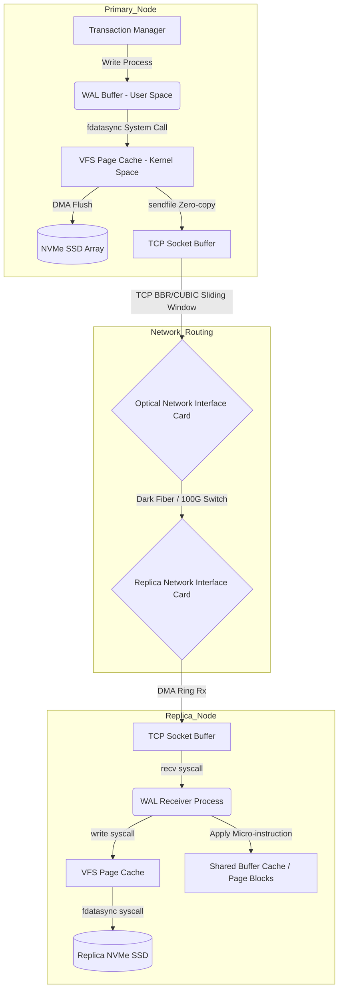

# Logical vs. Physical Replication: Dissecting Data Flow at the Kernel Level

## Introduction

Sooner or later, every distributed database team runs into the same question: how do you keep replicas in sync without saturating the network or pegging every CPU core on the box? There are two competing answers, and they represent genuinely different trade-offs — **physical replication** and **logical replication**. The logical vs physical replication debate shows up in almost every production database team eventually, usually right after something goes wrong at scale.

This article doesn't stop at the high-level "what" — it goes down into kernel memory, NVMe disk structures, CPU microarchitecture, and the TCP/IP stack to explain how data actually moves from a primary node to its replicas, and why the two approaches perform so differently once you push real load through them.

**The problem in one sentence:** how do you move gigabytes of data per second between servers without crashing the network or exhausting the CPU? Physical replication gets you close to raw hardware speed (zero-copy DMA) but ties you tightly to a specific OS and database binary layout. Logical replication buys you flexibility — filtering, cross-platform replication — at the cost of a real "computation tax" for decoding, plus the risk of running out of memory. Get this architectural choice wrong under high load, and the system doesn't just slow down, it falls over.

**What you'll take away from this:**
1. **Physical replication wins on raw throughput.** By skipping the CPU almost entirely (kernel bypass, `sendfile()`/`splice()`), it streams bytes from RAM to the NIC at essentially $O(1)$ cost per byte.
2. **Logical replication pays a real computation tax.** Decoding the WAL stream back into rows means the CPU has to parse raw bytes, which blows out L1/L2 instruction-cache hit rates and forces the allocation of large in-memory reorder buffers.
3. **Replication lag follows queuing theory.** Because logical apply is fundamentally single-threaded, lag behaves like an M/M/1 queue — and that queue can blow up fast if the primary writes faster than the replica can apply.

---

## Physical Replication: Block-Level Synchronization

Physical replication is conceptually simple: copy the exact binary content of memory pages (8KB pages) or WAL files from source to destination, byte for byte, with no interpretation in between.

### The LSN (Log Sequence Number)

Physical replication relies on a monotonically increasing identifier — the **LSN** — that acts as the absolute physical coordinate of a record inside the log file. It's defined recursively:

$$LSN_{i+1} = LSN_{i} + \Delta_{size}(Record_{i}) + \sigma(alignment)$$

Here $\sigma(alignment)$ is a small rounding term that pads each record to an 8- or 16-byte boundary, which keeps the CPU's data bus happy. The LSN sequence gives you an unbreakable happens-before ordering: a replica can simply apply bytes at the matching offset on its own disk, no interpretation required.

### Zero-Copy Transfer and Kernel-Level Plumbing

The real advantage of physical replication is that it can skip user space almost entirely. In a traditional I/O path, data crosses four separate buffers: disk → kernel page cache → user buffer → socket buffer. Every hop costs a copy.

Physical replication avoids most of that using **zero-copy DMA** via `sendfile()` or `splice()` on Linux:

- The WAL stream is DMA-loaded straight from the NVMe SSD into the page cache (kernel space).
- `sendfile()` tells the NIC to pull data directly out of the page cache and push it onto the wire.
- The CPU barely touches it — it never spends a cycle reading the actual byte content.

The latency for a synchronous commit collapses to a simple sum of physical delays:

$$T_{sync\_commit} = T_{local\_flush} + T_{network\_RTT} + T_{remote\_flush} + T_{ack}$$

Notice CPU time doesn't appear anywhere in that equation. It's bounded by disk latency and network round-trip time, full stop.

### Bandwidth Limits and TCP (BBR/CUBIC)

Once write throughput climbs past roughly 1000 MB/s, the bottleneck shifts from the SSD to the TCP/IP stack itself. If packets start dropping, you get **head-of-line blocking**, and throughput craters even though the underlying hardware is fine.

To ride out these hiccups, the system keeps a ring buffer of unacknowledged WAL segments — `wal_keep_size` in PostgreSQL is the knob for this. The minimum safe size is governed by the bandwidth-delay product:

$$BDP = C \times RTT$$

If that ring buffer overflows before the replica catches up, the replication slot is broken for good, and the replica has no option but a full re-sync from scratch.



---

## Logical Replication: Inside the Logical Decoding Pipeline

Where physical replication just moves bytes blindly, logical replication has to act like a translator. It reads raw physical byte blocks back out, takes them apart, and reconstructs them as plain SQL statements — INSERT, UPDATE, DELETE.

That's exactly what makes it useful for the cases physical replication can't handle: replicating from PostgreSQL to MySQL, moving data from an x86_64 server to an ARM box, or replicating just the `users` table while skipping `logs` entirely.

### The Computational Cost at the Microarchitecture Level

That flexibility isn't free — it costs real CPU cycles at the microarchitecture level. To decode gigabytes of raw WAL, the decoder has to look up MVCC (Multi-Version Concurrency Control) metadata just to figure out what a given tuple even looks like.

That means billions of small parsing operations, over data that's constantly changing shape. The working set doesn't stay resident in L1/L2 cache, so you get a steady stream of instruction and data cache misses — and CPU throughput on this path drops noticeably compared to the physical path.

### The Reorder Buffer

The hardest algorithmic problem in logical decoding is the **reorder buffer**. Inside a single WAL stream, records from many transactions are interleaved — something like `Tx1_Start`, `Tx2_Start`, `Tx1_Insert`, `Tx2_Update`, `Tx1_Commit`.

But logical replication still has to preserve atomicity. It can't emit any part of `Tx1` until it actually sees `Tx1`'s `Commit`. So the decoder builds an in-memory hash map that holds the full working set of every open transaction — `Tx1`, `Tx2`, and anything else in flight — until each one commits.

When the total size of in-flight transactions exceeds the memory budget (say, a single transaction that updates 10 million rows), the system has to fall back to a **spill-to-disk** path.

```cpp
template <typename DataType>
class HighlyConcurrentReorderBuffer {
private:
    std::unordered_map<TransactionId, std::vector<LogicalTupleChange>> active_inflight_txns;
    std::atomic<size_t> current_memory_footprint{0};
    const size_t HARD_MEMORY_LIMIT = 1024 * 1024 * 512; // 512 MB Threshold

    // Rescues the system from an Out-Of-Memory catastrophe via Spill-to-Disk
    void evict_to_disk_spill(TransactionId victim_xid) {
        int fd = create_anonymous_temp_file(victim_xid);
        size_t stream_size = active_inflight_txns[victim_xid].size() * sizeof(LogicalTupleChange);
        
        // Zero-copy Mapped I/O allocation
        void* virtual_mapped_mem = mmap(nullptr, stream_size, PROT_WRITE, MAP_SHARED, fd, 0);
        memcpy(virtual_mapped_mem, active_inflight_txns[victim_xid].data(), stream_size);
        
        // Force flush to disk
        msync(virtual_mapped_mem, stream_size, MS_ASYNC);
        active_inflight_txns[victim_xid].clear();
        munmap(virtual_mapped_mem, stream_size);
        current_memory_footprint.fetch_sub(stream_size, std::memory_order_release);
    }
};
```

The expensive part happens when `COMMIT` finally arrives: the system has to run an **external merge sort** across whatever's still in RAM and whatever already got spilled to disk. That means a burst of random read/write I/O right when you'd rather the disk be quiet.

---

## Queuing Theory and Replication Lag

The biggest structural problem on the replica side of logical replication is that apply is single-threaded. The primary might be writing with 64 CPU cores in parallel, but the replica applies logical SQL statements using a **single apply worker**, because that's the only way to safely preserve foreign-key ordering.

This turns replication lag into a textbook M/M/1 queuing problem. Using the Pollaczek–Khinchine formula, the expected queue length $L_q$ — which is essentially your replication lag — is:

$$L_q = \frac{\rho^2 + \rho^2 C_s^2}{2(1 - \rho)} \quad \text{where the load factor is} \quad \rho = \frac{\lambda_{total}}{\mu_{apply}}$$

As $\lambda_{total}$ (the rate the primary produces changes) approaches $\mu_{apply}$ (the rate the replica can apply them), $\rho \to 1$, and the formula tells you exactly what you'd expect: $L_q$ blows up toward infinity. This isn't a tuning problem you can fix with more RAM — it's a hard physical limit of single-threaded apply. Left unchecked, replicas can drift by hours unless something applies backpressure to slow the primary down.

Physical replication sidesteps this entirely. Since it doesn't care about SQL semantics or foreign keys, the WAL apply process can hand off page modifications to dozens of worker threads in parallel, each one independently patching its own 8KB block in memory. As long as memory barriers are respected (and NUMA false sharing is avoided), physical replication scales out on the replica side almost linearly.

---

## Conclusion

Logical and physical replication aren't just two implementations of the same idea — they represent two different bets about what matters more.

- **Logical replication** buys you freedom: it decouples data from the underlying hardware and format, and it's what makes hybrid-cloud setups, CDC (Change Data Capture), and streaming pipelines possible. The price is CPU overhead, memory pressure from the reorder buffer, and a hard ceiling on throughput imposed by single-threaded apply.
- **Physical replication** is loyal to the byte layout of the primary, nothing more. In exchange, you get near-hardware-limit throughput, minimal CPU overhead, and disaster-recovery behavior that scales with disk bandwidth rather than SQL complexity.

Understanding where each one breaks down — and why — is what lets you actually operate a database cluster handling millions of transactions per second instead of just watching the dashboards.

---
