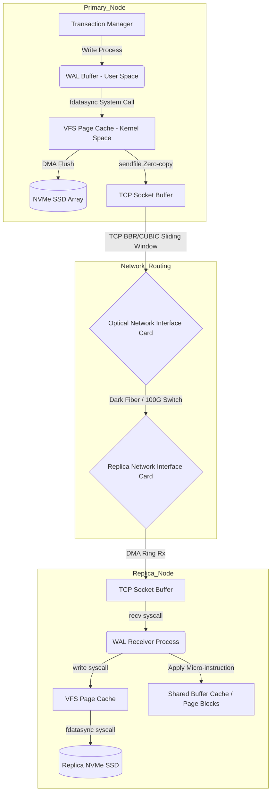

# Logical vs. Physical Replication - カーネルレベルのデータストリームの解剖

## エグゼクティブサマリー (Executive Summary)

分散データベースや大規模なストレージアーキテクチャで高い一貫性と可用性を両立させようとすると、どうしてもノード間の同期(レプリケーション)をどう設計するかという問題に行き当たる。この領域には長らく二つの流派がある。**物理レプリケーション(Physical Replication)**と**論理レプリケーション(Logical Replication)**だ。多くのプロダクションデータベースチームは、遅かれ早かれこの論理レプリケーションと物理レプリケーションの選択に向き合うことになる。

本稿はアプリケーション表面の話にとどまらず、カーネルメモリ、NVMeディスクの構造、CPUのマイクロアーキテクチャ、TCP/IPプロトコルといったスタックの深いところまで潜り、プライマリノードからレプリカへデータが実際にどう流れていくのかを追う。

**問題の核心 (Problem Statement):**
ネットワークを飽和させることなく、またCPUを使い切ることもなく、毎秒数ギガバイトのデータをサーバー間で同期するにはどうすればいいか。物理レプリケーションを選べばゼロコピーDMAでハードウェアの限界に近い速度が出せるが、その代わり特定のOSやデータベースのバイナリ構造に強く縛られる。論理レプリケーションを選べば柔軟性(フィルタリング、異なるアーキテクチャ間のレプリケーション)を得られるが、デコードのための計算コストという税金を払うことになり、メモリ枯渇のリスクも背負い込む。高負荷下でこの選択を誤ると、システムはただ遅くなるだけでは済まず、実際に倒れる。

**教訓と得られる知識 (Lessons Learned):**
1. **物理レプリケーションはスループットで圧勝する。** CPUをほぼ完全にバイパスし(カーネルバイパス、`sendfile()`/`splice()`)、RAMからNICへほぼ$O(1)$のコストでバイトを流し続けられる。
2. **論理レプリケーションには実質的な計算税がかかる。** WALストリームを行データに戻すデコード処理はCPUに生バイトの構文解析を強いるため、L1/L2の命令キャッシュヒット率が落ち、巨大なreorder bufferの確保も必要になる。
3. **レプリケーション遅延は待ち行列理論に従う。** 論理レプリケーションの適用処理は本質的にシングルスレッドなので、遅延はM/M/1キューのように振る舞う。プライマリの書き込み速度がレプリカの適用速度を上回れば、このキューは一気に膨れ上がる。

---

## Physical Replication: ブロック単位の同期

物理レプリケーションの発想はシンプルだ。メモリページ(8KBページ)やWALファイルのバイナリ内容を、解釈を一切挟まずにそのままバイト単位でソースからターゲットへコピーする。

### LSN (Log Sequence Number) という座標系

物理レプリケーションは単調増加する識別子である**LSN**に依存する。これはログファイル内のレコードの絶対的な物理座標として機能し、再帰的に次のように定義される。
$$LSN_{i+1} = LSN_{i} + \Delta_{size}(Record_{i}) + \sigma(alignment)$$
ここで$\sigma(alignment)$は各レコードを8バイトや16バイト境界に揃えるための小さな丸め項で、CPUのデータバスの都合に合わせたものだ。このLSNの並びは崩れない「happens-before」の順序を保証してくれる。レプリカは自分のディスク上の対応するオフセットにバイトをそのまま適用するだけでよく、解釈は一切不要だ。

### ゼロコピー転送とカーネル内部の配線

物理レプリケーションの本当の強みは、ユーザー空間をほぼ完全に迂回できる点にある。従来のI/Oパスでは、データはディスク、カーネルページキャッシュ、ユーザーバッファ、ソケットバッファという4つのバッファをまたぐ。ホップのたびにコピーが発生する。

物理レプリケーションはLinuxの`sendfile()`や`splice()`による**ゼロコピーDMA**でこれをほぼ回避する。
- WALストリームはNVMe SSDからページキャッシュ(カーネル空間)へDMAで直接ロードされる。
- `sendfile()`はNICに命令を出し、ページキャッシュから直接データを引き出して回線に送り出す。
- CPUはほとんど触れない。実際のバイト内容を読むために1サイクルも使わない。

同期コミットの遅延は、物理的な遅延の単純な足し算に収まる。
$$T_{sync\_commit} = T_{local\_flush} + T_{network\_RTT} + T_{remote\_flush} + T_{ack}$$
この式のどこにもCPU時間が出てこない点に注目してほしい。ディスクの遅延とネットワークのRTTだけで決まる、それだけだ。

### 帯域幅の限界とTCP (BBR/CUBIC)

書き込みスループットがおよそ1000 MB/sを超えると、ボトルネックはSSDからTCP/IPスタック自体へと移る。パケットロスが起きれば**head-of-line blocking**が発生し、ハードウェア自体は問題なくてもスループットは急落する。

こうした揺らぎを吸収するため、システムは未確認のWALセグメントを保持するリングバッファを持つ(PostgreSQLでは`wal_keep_size`がこれにあたる)。安全な最小サイズは帯域幅遅延積によって決まる。
$$BDP = C \times RTT$$
レプリカが追いつく前にこのリングバッファが溢れると、レプリケーションスロットは復旧不能になり、レプリカは最初からの完全な再同期を強いられる。



---

## Logical Replication: デコードパイプラインの内側

物理レプリケーションが何も考えずにバイトを転送するだけなのに対し、論理レプリケーションは翻訳者のような役割を担う。生のバイトブロックを読み出し、分解し、INSERT・UPDATE・DELETEといった素のSQL文として再構築する。

この性質こそが、物理レプリケーションでは対応できないケースを可能にする。PostgreSQLからMySQLへのレプリケーション、x86_64サーバーからARMサーバーへのデータ移動、あるいは`logs`テーブルを無視して`users`テーブルだけをレプリケートする、といった用途だ。

### マイクロアーキテクチャレベルでの計算コスト

この柔軟性はタダでは手に入らない。マイクロアーキテクチャレベルで実際のCPUサイクルを消費する。数ギガバイトの生WALをデコードするには、あるタプルがどんな形をしているかを知るためだけにMVCC(多版同時実行制御)のメタデータを都度参照しなければならない。

つまり、絶えず形を変えるデータに対して数十億回もの小さな構文解析処理が走ることになる。作業対象がL1/L2キャッシュに収まりきらないため、命令キャッシュとデータキャッシュのミスが途切れなく発生し、このパスでのCPUスループットは物理レプリケーションに比べて明らかに落ちる。

### Reorder Bufferという難所

論理デコードにおける最も厄介なアルゴリズム上の課題が**reorder buffer**だ。一本のWALストリームの中では複数のトランザクションのレコードが入り乱れている。例えば`Tx1_Start`、`Tx2_Start`、`Tx1_Insert`、`Tx2_Update`、`Tx1_Commit`といった具合だ。

それでも論理レプリケーションは原子性を守らなければならない。`Tx1`の`Commit`を実際に見るまで、`Tx1`のどの部分も外に出すことはできない。そのためデコーダーは、進行中のすべてのトランザクション — `Tx1`も`Tx2`もそれ以外も — の作業データ全体を、コミットされるまで保持するインメモリのハッシュマップを構築する。

進行中トランザクションの合計サイズがメモリ予算を超えると(たとえば1000万行を更新する単一トランザクションなど)、システムは**ディスクへのスピル**という手段に頼らざるを得なくなる。

```cpp
template <typename DataType>
class HighlyConcurrentReorderBuffer {
private:
    std::unordered_map<TransactionId, std::vector<LogicalTupleChange>> active_inflight_txns;
    std::atomic<size_t> current_memory_footprint{0};
    const size_t HARD_MEMORY_LIMIT = 1024 * 1024 * 512; // 512 MB Threshold

    // システムをOut-Of-Memoryの災害からSpill-to-Diskで救う
    void evict_to_disk_spill(TransactionId victim_xid) {
        int fd = create_anonymous_temp_file(victim_xid);
        size_t stream_size = active_inflight_txns[victim_xid].size() * sizeof(LogicalTupleChange);
        
        // Zero-copy Mapped I/Oを割り当てる
        void* virtual_mapped_mem = mmap(nullptr, stream_size, PROT_WRITE, MAP_SHARED, fd, 0);
        memcpy(virtual_mapped_mem, active_inflight_txns[victim_xid].data(), stream_size);
        
        // ディスクへのフラッシュを強制する
        msync(virtual_mapped_mem, stream_size, MS_ASYNC);
        active_inflight_txns[victim_xid].clear();
        munmap(virtual_mapped_mem, stream_size);
        current_memory_footprint.fetch_sub(stream_size, std::memory_order_release);
    }
};
```
本当にコストがかかるのは`COMMIT`が届いた瞬間だ。RAMに残っているデータとすでにディスクに逃がしたデータの両方にまたがって**外部マージソート**を実行しなければならない。つまり、本来ディスクを静かにしておきたいタイミングで、ランダムな読み書きI/Oのバーストが発生する。

---

## 待ち行列理論とレプリケーション遅延

論理レプリケーションのレプリカ側が抱える最大の構造的問題は、適用処理がシングルスレッドだという点だ。プライマリは64コアを並列に使って書き込みをこなせるかもしれないが、レプリカは外部キーの順序を安全に守るために、たった**一つの適用ワーカー**でSQL文を実行するしかない。

これによりレプリケーション遅延は典型的なM/M/1待ち行列問題になる。Pollaczek-Khinchine式を使うと、期待されるキュー長 $L_q$ — これがそのままレプリケーション遅延に相当する — は次のようになる。
$$L_q = \frac{\rho^2 + \rho^2 C_s^2}{2(1 - \rho)} \quad \text{ここで負荷変数} \quad \rho = \frac{\lambda_{total}}{\mu_{apply}}$$

$\lambda_{total}$(プライマリが変更を生成する速度)が$\mu_{apply}$(レプリカがそれを適用できる速度)に近づくと$\rho \to 1$となり、式が示す通り$L_q$は無限大に向かって発散する。これはRAMを増やせば解決するようなチューニングの問題ではなく、シングルスレッド適用が持つ物理的な限界そのものだ。何らかの形でプライマリの書き込みを抑えるバックプレッシャーをかけない限り、レプリカは何時間分もの遅延を抱えることになりかねない。

物理レプリケーションはこの問題自体を回避する。SQLの意味論や外部キーを気にする必要がないため、WAL適用プロセスはページの変更を何十ものワーカースレッドに並列に振り分け、それぞれが独立して自分の8KBブロックをメモリ上で書き換えていける。メモリバリアが正しく守られ、NUMAのfalse sharingが避けられている限り、物理レプリケーションはレプリカ側でほぼ線形にスケールする。

---

## 結論

論理レプリケーションと物理レプリケーションは、同じ問題への二つの実装というより、何を優先するかについての二つの異なる賭け方だと考えたほうがいい。

- **論理レプリケーション**は自由を買う。データを下層のハードウェアやフォーマットから切り離し、ハイブリッドクラウド構成、CDC(Change Data Capture)、ストリーミングパイプラインを可能にする。その代償がCPUオーバーヘッド、reorder bufferによるメモリ圧迫、そしてシングルスレッド適用が課すスループットの上限だ。
- **物理レプリケーション**はプライマリのバイト配置に忠実であること、それ以外は求めない。その見返りとして、ハードウェアの限界に近いスループット、最小限のCPUオーバーヘッド、そしてSQLの複雑さではなくディスク帯域幅に比例して伸びる災害復旧性能を得られる。

それぞれがどこで、なぜ破綻するのかを理解しておくことが、ダッシュボードを眺めるだけでなく、毎秒数百万トランザクションを処理するデータベースクラスターを実際に運用するための前提になる。
