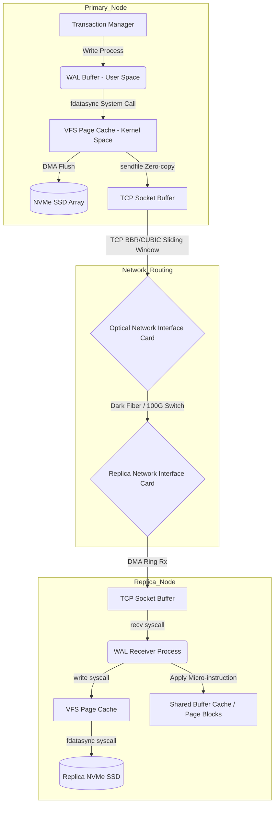

# Logical vs. Physical Replication - Giải Phẫu Luồng Dữ Liệu Ở Cấp Độ Hạt Nhân

## Tóm tắt Điều hành (Executive Summary)

Trong các hệ quản trị cơ sở dữ liệu phân tán và kiến trúc lưu trữ quy mô lớn, giữ được tính nhất quán và độ sẵn sàng cao đòi hỏi một cơ chế đồng bộ hóa (replication) đủ tinh vi giữa các node. Ngành này từ lâu đã chia thành hai trường phái: **sao chép vật lý (physical replication)** và **sao chép logic (logical replication)**. Gần như mọi đội ngũ vận hành cơ sở dữ liệu ở quy mô lớn sớm muộn cũng phải đối mặt với lựa chọn logical replication hay physical replication này.

Bài viết này không dừng ở bề mặt ứng dụng mà đi thẳng vào các tầng thấp nhất của hệ thống: bộ nhớ hạt nhân, cấu trúc đĩa NVMe, vi kiến trúc CPU, và giao thức TCP/IP, để xem dữ liệu thực sự di chuyển thế nào từ node nguồn (primary) sang các node đích (replica).

**Vấn đề cốt lõi (Problem Statement):**
Làm sao đồng bộ hàng gigabyte dữ liệu mỗi giây giữa các máy chủ mà không làm sập mạng hay vắt kiệt CPU? Chọn sao chép vật lý, ta có tốc độ gần chạm giới hạn phần cứng (nhờ zero-copy DMA), nhưng đổi lại bị trói chặt vào cấu trúc nhị phân của một hệ điều hành và phiên bản cơ sở dữ liệu cụ thể. Chọn sao chép logic, ta có sự linh hoạt — lọc dữ liệu, sao chép giữa các nền tảng khác nhau — nhưng phải trả một khoản "thuế tính toán" thực sự cho việc giải mã, cùng nguy cơ tràn bộ nhớ. Chọn sai kiến trúc này khi tải cao, hệ thống không chỉ chậm đi mà có thể sụp hẳn.

**Bài học và Kiến thức rút ra (Lessons Learned):**
1. **Sao chép vật lý thắng tuyệt đối về thông lượng.** Bằng cách gần như bỏ qua hoàn toàn CPU (kernel bypass, `sendfile()`/`splice()`), nó truyền byte từ RAM ra card mạng với chi phí gần như $O(1)$.
2. **Sao chép logic phải trả thuế tính toán thật.** Giải mã luồng WAL trở lại thành các hàng đòi hỏi CPU phân tích cú pháp byte thô, làm giảm tỷ lệ cache hit ở L1/L2 và buộc hệ thống cấp phát các reorder buffer khổng lồ trong bộ nhớ.
3. **Độ trễ đồng bộ tuân theo lý thuyết hàng đợi.** Vì việc áp dụng thay đổi ở phía logic về bản chất là đơn luồng, độ trễ hành xử giống một hàng đợi M/M/1 — và hàng đợi này có thể phình to rất nhanh nếu primary ghi nhanh hơn tốc độ replica áp dụng kịp.

---

## Physical Replication: Đồng Bộ Hóa Ở Cấp Độ Khối

Ý tưởng của sao chép vật lý khá đơn giản: sao y nguyên nội dung nhị phân của các trang bộ nhớ (8KB) hoặc các file WAL từ nguồn sang đích, từng byte một, không có bất kỳ diễn giải nào ở giữa.

### Khái Niệm LSN (Log Sequence Number)

Sao chép vật lý dựa vào một định danh tăng đơn điệu gọi là **LSN**, đóng vai trò tọa độ vật lý tuyệt đối của một bản ghi trong file log. Nó được định nghĩa đệ quy:
$$LSN_{i+1} = LSN_{i} + \Delta_{size}(Record_{i}) + \sigma(alignment)$$
Trong đó $\sigma(alignment)$ là một số hạng làm tròn nhỏ, đệm mỗi bản ghi vào ranh giới 8 hoặc 16 byte để giữ cho bus dữ liệu của CPU hoạt động trơn tru. Chuỗi LSN tạo ra một thứ tự happens-before không thể bị phá vỡ: replica chỉ cần áp dụng byte vào đúng offset tương ứng trên đĩa của nó, không cần diễn giải gì thêm.

### Truyền Zero-Copy và Hệ Thống Ống Dẫn Cấp Kernel

Lợi thế thực sự của sao chép vật lý là khả năng bỏ qua gần như hoàn toàn user space. Trong đường đi I/O truyền thống, dữ liệu phải qua bốn vùng đệm riêng biệt: đĩa, page cache của kernel, buffer người dùng, buffer socket. Mỗi bước nhảy đều tốn một lần sao chép.

Sao chép vật lý tránh được phần lớn chi phí đó nhờ **zero-copy DMA** thông qua `sendfile()` hoặc `splice()` trên Linux:
- Luồng WAL được DMA nạp thẳng từ NVMe SSD vào page cache (không gian kernel).
- `sendfile()` ra lệnh cho NIC lấy dữ liệu trực tiếp từ page cache và đẩy lên đường truyền.
- CPU gần như không đụng tới nó — không tốn một chu kỳ nào để đọc nội dung byte thực sự.

Độ trễ của một lần commit đồng bộ gói gọn thành tổng các độ trễ vật lý:
$$T_{sync\_commit} = T_{local\_flush} + T_{network\_RTT} + T_{remote\_flush} + T_{ack}$$
Chú ý rằng thời gian CPU không xuất hiện ở đâu trong phương trình này. Nó chỉ bị giới hạn bởi độ trễ đĩa và thời gian khứ hồi của mạng, không hơn không kém.

### Giới Hạn Băng Thông và TCP (BBR/CUBIC)

Khi thông lượng ghi vượt qua khoảng 1000 MB/s, điểm nghẽn chuyển từ SSD sang chính ngăn xếp TCP/IP. Nếu gói tin bắt đầu rớt, hiện tượng **head-of-line blocking** xuất hiện, và thông lượng lao dốc dù phần cứng bên dưới vẫn hoàn toàn ổn.

Để chịu đựng những trục trặc này, hệ thống giữ một ring buffer chứa các đoạn WAL chưa được xác nhận — `wal_keep_size` trong PostgreSQL chính là tham số điều chỉnh việc này. Kích thước an toàn tối thiểu được quyết định bởi tích của băng thông và độ trễ:
$$BDP = C \times RTT$$
Nếu ring buffer này tràn trước khi replica kịp bắt kịp, replication slot coi như hỏng vĩnh viễn, và replica không còn lựa chọn nào khác ngoài đồng bộ lại từ đầu.



---

## Logical Replication: Bên Trong Pipeline Giải Mã Logic

Nếu sao chép vật lý chỉ đơn thuần chuyển byte một cách mù quáng, sao chép logic phải đóng vai trò một người phiên dịch. Nó đọc lại các khối byte vật lý thô, tách chúng ra, rồi dựng lại thành các câu lệnh SQL thuần túy — INSERT, UPDATE, DELETE.

Chính đặc điểm này khiến nó hữu ích cho những trường hợp mà sao chép vật lý bó tay: sao chép từ PostgreSQL sang MySQL, chuyển dữ liệu từ máy chủ x86_64 sang máy ARM, hoặc chỉ sao chép mỗi bảng `users` trong khi bỏ qua hoàn toàn bảng `logs`.

### Chi Phí Tính Toán Ở Cấp Độ Vi Kiến Trúc

Sự linh hoạt đó không miễn phí — nó tiêu tốn những chu kỳ CPU thực sự ở tầng vi kiến trúc. Để giải mã hàng gigabyte WAL thô, bộ giải mã phải tra cứu metadata MVCC (Multi-Version Concurrency Control) chỉ để biết một tuple cụ thể trông như thế nào.

Điều đó có nghĩa là hàng tỷ phép phân tích cú pháp nhỏ, trên dữ liệu liên tục thay đổi hình dạng. Tập dữ liệu đang xử lý không thể nằm gọn trong cache L1/L2, nên xảy ra một chuỗi liên tục cache miss cả về lệnh lẫn dữ liệu — và thông lượng CPU trên đường đi này giảm rõ rệt so với sao chép vật lý.

### Reorder Buffer

Bài toán thuật toán khó nhất trong giải mã logic là **reorder buffer**. Trong một luồng WAL duy nhất, các bản ghi của nhiều giao dịch đan xen vào nhau — kiểu như `Tx1_Start`, `Tx2_Start`, `Tx1_Insert`, `Tx2_Update`, `Tx1_Commit`.

Nhưng sao chép logic vẫn phải giữ tính nguyên tử. Nó không thể phát ra bất kỳ phần nào của `Tx1` cho tới khi thực sự thấy lệnh `Commit` của `Tx1`. Vì vậy bộ giải mã phải dựng một hash map trong bộ nhớ, giữ toàn bộ dữ liệu làm việc của mọi giao dịch đang mở — `Tx1`, `Tx2`, và bất kỳ giao dịch nào khác đang diễn ra — cho đến khi từng giao dịch commit.

Khi tổng kích thước các giao dịch đang xử lý vượt quá ngân sách bộ nhớ cho phép (chẳng hạn một giao dịch duy nhất cập nhật 10 triệu hàng), hệ thống buộc phải chuyển sang cơ chế **tràn ra đĩa (spill-to-disk)**.

```cpp
template <typename DataType>
class HighlyConcurrentReorderBuffer {
private:
    std::unordered_map<TransactionId, std::vector<LogicalTupleChange>> active_inflight_txns;
    std::atomic<size_t> current_memory_footprint{0};
    const size_t HARD_MEMORY_LIMIT = 1024 * 1024 * 512; // 512 MB Threshold

    // Cứu vớt hệ thống khỏi thảm họa Out-Of-Memory bằng Spill-to-Disk
    void evict_to_disk_spill(TransactionId victim_xid) {
        int fd = create_anonymous_temp_file(victim_xid);
        size_t stream_size = active_inflight_txns[victim_xid].size() * sizeof(LogicalTupleChange);
        
        // Cấp phát Zero-copy Mapped I/O
        void* virtual_mapped_mem = mmap(nullptr, stream_size, PROT_WRITE, MAP_SHARED, fd, 0);
        memcpy(virtual_mapped_mem, active_inflight_txns[victim_xid].data(), stream_size);
        
        // Ép xả xuống đĩa
        msync(virtual_mapped_mem, stream_size, MS_ASYNC);
        active_inflight_txns[victim_xid].clear();
        munmap(virtual_mapped_mem, stream_size);
        current_memory_footprint.fetch_sub(stream_size, std::memory_order_release);
    }
};
```

Phần tốn kém nhất xảy ra ngay khi `COMMIT` cuối cùng tới: hệ thống phải chạy một phép **external merge sort** giữa những gì còn ở RAM và những gì đã bị đẩy ra đĩa. Đó là một đợt I/O đọc/ghi ngẫu nhiên dồn dập, đúng vào lúc ta muốn đĩa được yên tĩnh nhất.

---

## Lý Thuyết Hàng Đợi và Độ Trễ Đồng Bộ

Vấn đề cấu trúc lớn nhất ở phía replica trong sao chép logic là việc áp dụng thay đổi vốn chạy đơn luồng. Primary có thể đang ghi song song bằng 64 lõi CPU, nhưng replica lại chỉ dùng **một worker áp dụng duy nhất** để thực thi các câu lệnh SQL logic — đó là cách duy nhất để giữ đúng thứ tự ràng buộc khóa ngoại một cách an toàn.

Điều này biến độ trễ đồng bộ thành một bài toán hàng đợi M/M/1 kinh điển. Dùng công thức Pollaczek-Khinchine, độ dài hàng đợi kỳ vọng $L_q$ — về cơ bản chính là độ trễ đồng bộ — được tính:
$$L_q = \frac{\rho^2 + \rho^2 C_s^2}{2(1 - \rho)} \quad \text{với hệ số tải} \quad \rho = \frac{\lambda_{total}}{\mu_{apply}}$$

Khi $\lambda_{total}$ (tốc độ primary sinh ra thay đổi) tiến gần tới $\mu_{apply}$ (tốc độ replica áp dụng được), $\rho \to 1$, và công thức cho ra đúng điều ta lo ngại: $L_q$ tiến tới vô cực. Đây không phải vấn đề có thể xử lý bằng cách thêm RAM — đó là giới hạn vật lý cứng của cơ chế áp dụng đơn luồng. Nếu không có gì tạo áp lực ngược (backpressure) để làm chậm primary lại, replica có thể trôi lệch hàng giờ đồng hồ.

Sao chép vật lý né hoàn toàn vấn đề này. Vì không quan tâm đến ngữ nghĩa SQL hay khóa ngoại, tiến trình áp dụng WAL có thể giao việc sửa đổi trang cho hàng chục worker thread chạy song song, mỗi thread độc lập vá khối 8KB của riêng nó trong bộ nhớ. Miễn là các memory barrier được tôn trọng (và tránh được false sharing trên NUMA), sao chép vật lý có thể mở rộng ở phía replica gần như tuyến tính.

---

## Tổng Kết

Sao chép logic và sao chép vật lý không đơn thuần là hai cách hiện thực hóa cùng một ý tưởng — chúng đại diện cho hai cách đặt cược khác nhau về điều gì thực sự quan trọng.

- **Sao chép logic** mang lại tự do: nó tách dữ liệu khỏi phần cứng và định dạng bên dưới, và chính điều đó mở đường cho các mô hình hybrid-cloud, CDC (Change Data Capture), và các pipeline streaming. Cái giá phải trả là chi phí CPU, áp lực bộ nhớ từ reorder buffer, và một trần thông lượng cứng do cơ chế áp dụng đơn luồng áp đặt.
- **Sao chép vật lý** trung thành với cách bố trí byte của primary, không hơn không kém. Đổi lại, ta có thông lượng gần chạm giới hạn phần cứng, chi phí CPU tối thiểu, và khả năng khôi phục sau thảm họa tỷ lệ thuận với băng thông đĩa chứ không phải độ phức tạp của SQL.

Hiểu rõ mỗi mô hình sụp đổ ở đâu — và vì sao — mới là điều giúp ta thực sự vận hành được một cụm cơ sở dữ liệu xử lý hàng triệu giao dịch mỗi giây, thay vì chỉ ngồi nhìn dashboard.
