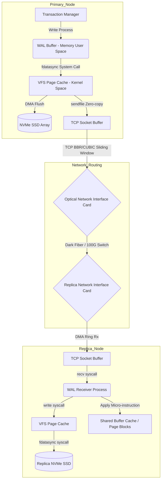
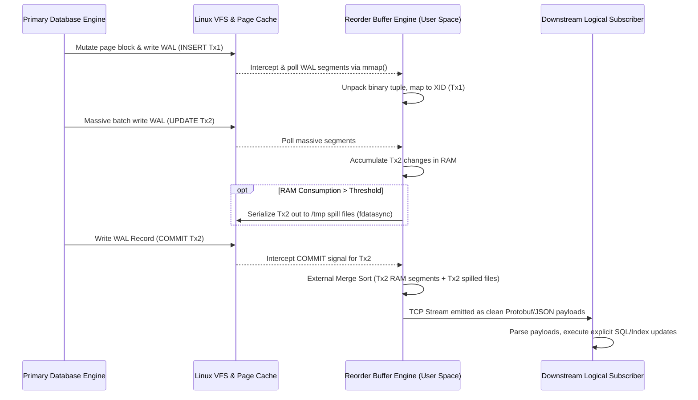

# 29: Logical vs. Physical Replication: Phân tích cơ chế stream dữ liệu

Trong các hệ thống quản trị cơ sở dữ liệu phân tán và kiến trúc lưu trữ dữ liệu quy mô lớn, việc duy trì tính nhất quán và độ sẵn sàng cao đòi hỏi một cơ chế đồng bộ hóa dữ liệu tinh vi giữa các node tham gia vào cụm. Hai trường phái kiến trúc thống trị trong lĩnh vực này là sao chép vật lý (physical replication) và sao chép logic (logical replication), mỗi phương pháp mang một hệ hình (paradigm) riêng biệt về cách thức tổ chức, truyền tải và tái tạo trạng thái dữ liệu. Trái ngược với các phương thức truyền tải dữ liệu ở mức ứng dụng, sao chép dữ liệu cơ sở dữ liệu hoạt động ở các tầng thấp của ngăn xếp hệ thống, can thiệp trực tiếp vào bộ nhớ hạt nhân (kernel memory), cấu trúc đĩa và giao thức mạng. Khảo luận này sẽ đi sâu vào kiến trúc vi mô, các giới hạn phần cứng, cấu trúc giải thuật và mô hình quản lý bộ nhớ hệ điều hành liên quan đến hai kỹ thuật sao chép này. Sự khác biệt cốt lõi không chỉ nằm ở định dạng dữ liệu được truyền tải mà còn ở cách hệ điều hành phân bổ I/O, cách đơn vị xử lý trung tâm (CPU) tiêu thụ chu kỳ lệnh cho quá trình giải mã, và cách hệ thống mạng phản ứng với các đặc tuyến tải (load profiles) hoàn toàn trái ngược nhau. Bằng việc phân tích các tiến trình hệ thống ở cấp độ system call, quản lý page cache và các mô hình toán học của độ trễ đồng bộ, chúng ta có thể làm rõ những đặc tính động học của luồng dữ liệu (data stream) xuyên suốt hành trình từ nút nguồn (primary) đến các nút đích (replicas).

## Kiến trúc vi mô của quá trình sao chép vật lý và quản lý bộ nhớ hạt nhân

Physical replication vận hành dựa trên nguyên lý đồng bộ hóa mức khối (block-level synchronization), trong đó nội dung nhị phân chính xác của các trang bộ nhớ (memory pages) hoặc các tệp nhật ký ghi trước (Write-Ahead Logging - WAL) được sao chép từ nút nguồn sang nút đích một cách nguyên trạng. Phương pháp này đảm bảo sự đồng nhất ở mức byte giữa các ổ đĩa của các máy chủ cơ sở dữ liệu, loại bỏ hoàn toàn độ phức tạp của việc diễn giải cú pháp ngữ nghĩa logic. Trong kiến trúc vật lý, hệ thống sử dụng một định danh đơn điệu tăng gọi là Log Sequence Number (LSN) để lập bản đồ vị trí vật lý của một bản ghi (record) trong tập tin nhật ký. Về mặt toán học, giá trị LSN của một bản ghi tiếp theo được định nghĩa qua một hàm đệ quy cơ bản:

$$LSN_{i+1} = LSN_{i} + \Delta_{size}(Record_{i}) + \sigma(alignment)$$

trong đó $\sigma(alignment)$ là hệ số làm tròn byte thường được cố định ở các ranh giới 8-byte hoặc 16-byte nhằm tối ưu hóa chu kỳ truy xuất bộ nhớ thông qua các đường truyền dữ liệu (data bus) của CPU. Sự chặt chẽ của biến thiên LSN thiết lập một cấu trúc trật tự thời gian (happens-before relationship) không thể bị phá vỡ giữa các nút phân tán.

Tại tầng hệ điều hành, luồng dữ liệu của bản ghi WAL vật lý được tối ưu hóa cực đoan thông qua kỹ thuật truyền bộ nhớ không sao chép (zero-copy memory transfer). Khi một tiến trình gửi dữ liệu (WAL sender process) được khởi tạo, thay vì sử dụng cơ chế đọc-ghi thông thường (yêu cầu sao chép dữ liệu từ page cache của kernel space sang bộ đệm của user space rồi lại sao chép ngược xuống socket buffer của network stack), hệ điều hành Linux ưu tiên sử dụng system call `sendfile()` hoặc `splice()`. Kỹ thuật zero-copy này thiết lập một cấu trúc truy cập bộ nhớ trực tiếp (Direct Memory Access - DMA), cho phép vi điều khiển giao diện mạng (NIC) lấy dữ liệu trực tiếp từ các trang bộ đệm hệ thống (system page cache) mà CPU không cần phải can thiệp chu kỳ lệnh để sao chép khối dữ liệu. Quá trình này tiết kiệm đáng kể số lượng context switch giữa kernel mode và user mode, làm giảm bớt sức ép lên Instruction Translation Lookaside Buffer (iTLB) và bảo toàn tính toàn vẹn của L1/L2 data cache trên bộ vi xử lý. Động học của hệ thống ở đây phụ thuộc rất lớn vào thông lượng đường truyền (network bandwidth) và độ trễ truy xuất của thiết bị lưu trữ cục bộ. Phương trình tính toán thời gian đáp ứng đồng bộ (synchronous commit latency) có thể được khái quát dưới dạng:

$$T_{sync\_commit} = T_{local\_wal\_flush} + T_{network\_RTT} + T_{remote\_wal\_flush} + T_{ack\_processing}$$

trong đó $T_{local\_wal\_flush}$ và $T_{remote\_wal\_flush}$ phụ thuộc trực tiếp vào thời gian system call `fdatasync()` hoặc `O_DIRECT` hoàn tất việc xả dữ liệu từ bộ nhớ DRAM hệ thống xuống bề mặt vật lý của mảng lưu trữ NVMe SSD.

Sự tương tác phần cứng đối với physical replication bộc lộ một số giới hạn vật lý rõ rệt. Khi tốc độ sinh WAL từ primary database tiến gần đến giới hạn thông lượng I/O tuyến tính của thiết bị lưu trữ (ví dụ, vượt qua ngưỡng 5000 MB/s trên cấu hình NVMe PCIe Gen 4x4 đa phân luồng), nút nghẽn cổ chai dịch chuyển tức thời từ bus lưu trữ sang ngăn xếp TCP/IP của nhân hệ điều hành. Các tham số cửa sổ trượt (sliding window) của giao thức TCP, kết hợp với các thuật toán kiểm soát tắc nghẽn động lực học như BBR (Bottleneck Bandwidth and Round-trip propagation time) hoặc CUBIC, trở thành nhân tố định hình biên độ trễ của luồng stream. Nếu xảy ra hiện tượng mất gói tin (packet loss) trong kiến trúc vật lý tốc độ cực cao, hiện tượng head-of-line blocking (tắc nghẽn tại đầu hàng đợi) trong giao thức TCP sẽ gây ra một khoảng gián đoạn cực đại, buộc hệ cơ sở dữ liệu phải dựa vào bộ đệm vòng (ring buffer) nội bộ để chứa các phân đoạn WAL chưa được xác nhận. Dung lượng tối ưu cực hạn của bộ đệm này bị giới hạn chặt chẽ bởi Product của Băng thông và Độ trễ mạng (Bandwidth-Delay Product - BDP), được tính toán bằng công thức:

$$BDP = C \times RTT$$

trong đó $C$ là dung lượng kênh truyền tính theo bit/s và $RTT$ là thời gian phản hồi tín hiệu theo chiều đi và về (Round Trip Time). Nếu bộ đệm vòng (thường được cấu hình giới hạn kích thước vùng không gian qua `wal_keep_size`) bị tràn trước khi tín hiệu phản hồi từ nút đích xác nhận thành công, tiến trình sao chép sẽ bị gián đoạn trầm trọng và rơi vào trạng thái fallback, buộc hệ thống phải sao chép tệp nhật ký gián tiếp qua Archive Node, làm tổn hại nghiêm trọng SLA (Service Level Agreement).



## Động học và giải thuật giải mã trong sao chép logic

Trong khi sao chép vật lý tập trung vào dịch chuyển cấu trúc nhị phân ở tầng vi mô đĩa cứng, sao chép logic (logical replication) theo đuổi một mô hình tinh tế và tốn kém tài nguyên tính toán hơn nhiều thông qua việc kiến tạo lại (reconstruct) ngữ nghĩa của các luồng giao dịch dựa trên dữ liệu nhật ký thô. Lõi kỹ thuật của kiến trúc này là quá trình giải mã logic (logical decoding pipeline), một bộ phân tích cú pháp ở mức thấp có nhiệm vụ trích xuất những chỉ thị DML (Data Manipulation Language) tinh khiết từ tập hợp các byte WAL vốn được tổ chức theo cấu trúc heap-page-update vật lý. Thay vì truyền bản sao nguyên trạng của cấu trúc khối đĩa xuống socket mạng, primary node sẽ khởi chạy một tiến trình giải mã để sàng lọc ra các sự kiện của bảng cơ sở dữ liệu (ví dụ: thao tác gán giá trị mới cho một hàng dữ liệu cụ thể), mã hóa lại thành một dạng biểu diễn trừu tượng độc lập với kiến trúc phần cứng (như JSON, Protobuf hoặc định dạng nhị phân tuỳ chỉnh) trước khi thiết lập stream dữ liệu. Việc này tạo ra tính linh hoạt vượt trội, cho phép thiết lập cầu nối sao chép liên thông giữa các hệ thống không đồng nhất về kiến trúc máy tính (ví dụ từ x86_64 sang ARM64), khác biệt phiên bản động cơ lưu trữ (storage engine versions), hoặc thậm chí chọn lọc phân mảnh dữ liệu (chỉ đồng bộ một tập hợp con các bảng biểu thiết yếu).

Sự linh hoạt kiến trúc này đi kèm với một khoản thuế tính toán (computational tax) khổng lồ ở tầng vi kiến trúc bộ vi xử lý (Micro-architecture). Do thuật toán giải mã phải lội ngược dòng đọc lại luồng WAL và hiểu sâu sắc định dạng lưu trữ nội bộ (internal storage formats, tuple structures, MVCC snapshot mapping), CPU phải tiêu tốn một số lượng khổng lồ chu kỳ máy cho tác vụ parsing, dẫn đến hiện tượng bùng nổ Instruction Cache Misses. Thách thức thuật toán cốt tủy lớn nhất trong quá trình giải mã là việc triển khai và tối ưu hóa bộ đệm sắp xếp lại giao dịch (Reorder Buffer). Do các hệ thống RDBMS hiện đại xử lý đồng thời hàng chục ngàn giao dịch đa luồng (highly concurrent transactions), các mẩu bản ghi WAL của nhiều giao dịch chéo nhau sẽ bị đan xen vô trật tự (interleaved) bên trong tệp nhật ký trung tâm. Tuy nhiên, luồng sao chép logic ở đầu ra bắt buộc phải phát đi (emit) các tập thay đổi dưới dạng nguyên tử tuần tự, tuân thủ đúng đắn trật tự nhân quả khi một giao dịch được đánh dấu xác nhận (commit event). Điều này đòi hỏi thiết lập một hệ thống phân mảnh bộ nhớ động (dynamic memory allocator) để lưu giữ tạm thời mọi sự thay đổi thuộc về các giao dịch đang diễn ra (in-flight transactions). Mọi tuple được sửa đổi sẽ được băm hóa và đưa vào một cấu trúc dữ liệu dạng cây nhị phân tìm kiếm hoặc bảng băm phi trạng thái (in-memory hash map), được lập chỉ mục định vị bởi mã định danh Transaction ID (XID).

Quản lý không gian bộ nhớ hệ điều hành cho module Reorder Buffer là một ranh giới vô cùng mong manh khi hệ thống phải đối mặt với các giao dịch cập nhật khối lượng lớn (massive batch updates hoặc long-running transactions). Khi tổng dung lượng byte của các in-flight transactions lưu trú vượt qua ngưỡng giới hạn RAM vật lý cho phép của Reorder Buffer, cơ chế giải mã bắt buộc phải kích hoạt một hệ thuật toán đẩy dữ liệu tràn khẩn cấp xuống đĩa cứng (spill-to-disk evictions). Dữ liệu cấu trúc tinh vi của các giao dịch bị tràn sẽ được tuần tự hóa (serialized) cục bộ vào các tệp tin tạm thời trên thiết bị lưu trữ thông qua cơ chế ánh xạ phân trang ảo (virtual memory mapped IO). Kỹ thuật phòng thủ này ngăn chặn hiện tượng hoảng loạn bộ nhớ (Out-Of-Memory Panic) tàn phá kernel nhưng lại làm tăng vọt cường độ disk I/O, phá hủy băng thông hữu dụng của bộ điều khiển đĩa. Thảm họa hiệu năng thực sự kích hoạt tại thời điểm phát sinh bản ghi COMMIT của một siêu giao dịch; tại khoảnh khắc đó, thuật toán hợp nhất phải tiến hành chập nhất ngoài (external merge sort) giữa các tuple đang nằm an toàn trong DRAM và dữ liệu rác trải khắp các disk-spilled files. Cường độ sử dụng tài nguyên CPU và RAM tại thời điểm giải mã có thể được mô hình hóa xấp xỉ qua quy trình ngẫu nhiên Poisson không đồng nhất cho tỷ lệ cập nhật, với dung lượng RAM chờ (pending queue size) kỳ vọng $E[M]$ tại thời điểm $t$ bất kỳ được mô tả toán học như sau:

$$E[M] = \sum_{j=1}^{N_{active}} \int_{t_{start}}^{t} \lambda_{j}(\tau) \cdot \mathbb{E}[S_{tuple}] \cdot d\tau$$

trong đó $\lambda_{j}(\tau)$ là vận tốc biến thiên sinh ra sự kiện sửa đổi của giao dịch song song thứ $j$, $\mathbb{E}[S_{tuple}]$ là kích thước vật lý kỳ vọng của cấu trúc dữ liệu bị thay đổi, và $t_{start}$ là vector thời điểm đánh dấu sự bắt đầu của chu kỳ giao dịch trong bộ đếm vòng (circular buffer).

```cpp
// Pseudocode: Micro-architecture logic of a Logical Reorder Buffer dealing with concurrent WAL stream parsing
template <typename DataType>
class HighlyConcurrentReorderBuffer {
private:
    std::unordered_map<TransactionId, std::vector<LogicalTupleChange>> active_inflight_txns;
    std::atomic<size_t> current_memory_footprint{0};
    const size_t HARD_MEMORY_LIMIT = 1024 * 1024 * 512; // 512 MB Threshold

    // Fallback algorithm to mitigate Out-Of-Memory situations
    void evict_to_disk_spill(TransactionId victim_xid) {
        int fd = create_anonymous_temp_file(victim_xid);
        size_t stream_size = active_inflight_txns[victim_xid].size() * sizeof(LogicalTupleChange);
        
        // Zero-copy mapped I/O for high speed disk eviction
        void* virtual_mapped_mem = mmap(nullptr, stream_size, PROT_WRITE, MAP_SHARED, fd, 0);
        memcpy(virtual_mapped_mem, active_inflight_txns[victim_xid].data(), stream_size);
        
        // Asynchronous page cache flush
        msync(virtual_mapped_mem, stream_size, MS_ASYNC);
        active_inflight_txns[victim_xid].clear();
        munmap(virtual_mapped_mem, stream_size);
        current_memory_footprint.fetch_sub(stream_size, std::memory_order_release);
    }

public:
    void process_wal_payload(const InterleavedWALRecord& record) {
        if (record.is_data_manipulation()) {
            TransactionId xid = record.get_transaction_id();
            LogicalTupleChange tuple = hardware_accelerated_decode(record);
            
            active_inflight_txns[xid].push_back(tuple);
            size_t new_size = current_memory_footprint.fetch_add(sizeof(LogicalTupleChange), std::memory_order_relaxed);
            
            // Dynamic threshold validation
            if (new_size > HARD_MEMORY_LIMIT) {
                evict_to_disk_spill(heuristic_find_largest_txn_victim());
            }
        } else if (record.is_commit_instruction()) {
            TransactionId xid = record.get_transaction_id();
            
            // Reconstruct timeline: merge in-memory fragments with disk spilled fragments
            std::vector<LogicalTupleChange> unified_stream = merge_memory_with_disk_spills(xid);
            for (const auto& logical_change : unified_stream) {
                downstream_network_publisher.emit_json_protobuf(logical_change);
            }
            garbage_collect_transaction_metadata(xid);
        }
    }
};
```



## Phân tích giới hạn phần cứng và hệ thống hàng đợi trong kiểm soát độ trễ

Vấn đề nan giải bậc nhất khi triển khai các luồng streaming dữ liệu ở chế độ phân tán, cho dù là vật lý hay logic, là việc xây dựng các tham số kiểm soát động lực học tính toán cho độ trễ áp dụng đồng bộ (replication lag application). Khi nghiên cứu các sự kiện tiếp nhận stream dưới góc độ lý thuyết hàng đợi (Queuing Theory), quá trình thực thi tái hiện dữ liệu (apply stream) ở nút đích đối với logical replication thường phải hoạt động theo mô hình hàng đợi đơn máy chủ $M/M/1$ hoặc ở trạng thái lý tưởng là $M/D/1$. Điều này là do thông thường luồng sao chép logic dưới hình thức tuple sẽ bị cưỡng ép phải thi hành tuần tự chặt chẽ trên một process duy nhất (single-threaded apply worker) nhằm bảo vệ tính toàn vẹn tham chiếu (referential integrity constraints) đối với các khóa ngoại (foreign keys), và trật tự nhân quả đa chiều của các unique indexes. Dù nguồn tạo tải (primary server) có khả năng dùng kiến trúc đa lõi phân bổ hàng trăm worker threads vận hành thao tác ghi song song, dẫn đến cường độ dữ liệu sinh ra là $\lambda_{total} = \sum_{i=1}^{n} \lambda_i$, thì bộ tiếp nhận ở bản sao đích cũng chỉ có năng lực xử lý giới hạn theo một chiều không gian tuyến tính với vận tốc phục vụ là $\mu_{apply}$.

Theo diễn giải của định lý Little (Little's Law) kết hợp với công thức độ dài hàng đợi Pollaczek–Khinchine, kích thước hàng đợi chờ xử lý $L_q$ (đại lượng biểu hiện trực quan cho replication lag) sẽ đối mặt với rủi ro bùng nổ theo phương trình toán học tiệm cận:

$$L_q = \frac{\rho^2 + \rho^2 C_s^2}{2(1 - \rho)} \quad \text{với biến số tải} \quad \rho = \frac{\lambda_{total}}{\mu_{apply}}$$

Trong đó $C_s$ là hệ số biến thiên của thời gian thực thi dịch vụ. Ngay khi vận tốc phân phối tín hiệu cập nhật logic $\lambda_{total}$ từ mạng tiến đến chạm ngưỡng năng lực đáp ứng của I/O Controller ở nút đích $\mu_{apply}$ (tức $\rho \to 1$), độ trễ sẽ phi mã vô cực. Đây là một rào cản vật lý không thể vượt qua bằng thủ thuật phần mềm, gây hiện tượng trôi dạt dữ liệu thảm khốc nếu hệ số đồng bộ cluster không bị thiết lập giới hạn, hoặc không tự động kích hoạt cơ chế tín hiệu phản áp (backpressure mechanism) để bắt hệ thống ghi nguồn tạm dừng hoạt động.

Trái ngược với giới hạn đơn luồng của sao chép logic, kiến trúc khôi phục vật lý (physical recovery processing) ở nút đích có cấu trúc phân mảnh tuyệt vời, không bị đóng khung trong rào cản single-thread bottleneck. Vì các WAL record ở tầng vi mô vật lý đơn thuần chỉ là các chỉ thị cơ khí tinh chỉnh vi mô số lượng nhỏ byte nội dung bên trong một block ảo 8KB xác định trước (ví dụ: thao tác hoán đổi offset $X$ của block định danh $Y$), hệ thống điều phối đĩa ở nút đích hoàn toàn có khả năng đẩy (dispatch) phân tán hàng trăm tiến trình cập nhật trang bộ nhớ song song lên các vùng không gian địa chỉ vật lý không giao thoa nhau. Để tối đa hóa thông lượng băng thông bộ nhớ (memory bus bandwidth) cho quá trình cập nhật trang đồng thời, kiến trúc thiết kế yêu cầu phân vùng tỉ mỉ hệ thống vùng nhớ đệm chung (Shared Buffer Pool) thành nhiều phân đoạn cô lập, sao cho triệt tiêu tối đa các hiện tượng tranh chấp khóa và chia sẻ sai lệch không gian cache (False Sharing).

Sự phụ thuộc tột bậc của các cấu trúc dữ liệu khóa nhẹ - Lightweight Locks (LWLocks) - trong không gian bộ nhớ kernel vào kiến trúc truy cập đồng nhất bộ nhớ phân tán (Non-Uniform Memory Access - NUMA) là một hằng số phải được hiệu chỉnh. Nếu tiến trình WAL receiver process đang được định tuyến chạy trên node socket CPU 0, nhưng phân mảnh khối bộ nhớ đang chờ được cập nhật lại thuộc sở hữu vật lý của ngân hàng RAM gắn vào socket CPU 1, độ trễ truyền dữ liệu ngang qua băng thông kết nối liên CPU như QPI/UPI (QuickPath Interconnect / Ultra Path Interconnect) sẽ làm gia tăng đáng kể phí tổn thời gian chu kỳ nhớ (memory latency penalty). Tại các trung tâm dữ liệu cực hạn, những kỹ thuật phát triển cấp thấp áp dụng cho rào chắn bộ nhớ (Memory Barriers) liên tầng như `smp_store_release()` và `smp_load_acquire()` được vận dụng triệt để trong lõi C/Rust. Mục đích cốt lõi là ép buộc sự nhất quán về tính thứ tự của phần cứng bộ nhớ đệm mà không phải kích hoạt khóa cứng khóa (lockstall) toàn bộ đường ống dẫn lệnh CPU, tối giản hóa tối đa lệnh đọc-sửa-ghi nguyên tử (atomic read-modify-write instructions), mang lại lợi thế hiệu năng siêu việt và dải thông dồi dào cho phương pháp sao chép vật lý.

Sau cùng, quy trình giải nén và phân tích luồng stream logic còn phải hứng chịu áp lực nhiệt động học khủng khiếp từ hệ sinh thái bộ nhớ đệm cấp tiến (CPU Cache Hierarchy). Khi hàng tỷ sự kiện SQL được trích xuất bóc tách và phiên dịch tự do thông qua cỗ máy Logical Decoding, vùng địa chỉ nhớ dành riêng cho bảng tra cứu định tuyến giao dịch (transaction metadata lookup tables) sẽ liên tục bị vô hiệu hóa tín hiệu (cache invalidation). Lớp vật lý của L1 Data Cache Line thông thường mang kích thước cố định khoảng 64 bytes - một con số quá khiêm tốn chỉ chứa đủ vài cấu trúc node con trỏ, dẫn đến hệ quả là tỷ lệ Cache Miss Rate sẽ liên tục leo dốc khi ALU của CPU phải trượt lặp qua các cấu trúc dữ liệu chuỗi liên kết (linked lists) dày đặc của vùng không gian Reorder Buffer khổng lồ. 

Những hệ thống lý luận vi kiến trúc tinh vi này cung cấp một nền tảng thực chứng sâu sắc cho định lý tối thượng trong nhân bản dữ liệu: Sao chép logic mang đến một năng lực dịch chuyển vô tận giúp tái cấu trúc hình thái dữ liệu mà không hề gặp rào cản nền tảng vật lý nào, nhưng cái giá phải trả vô cùng đắt đỏ là Entropy của hệ vi xử lý và chu kỳ hao mòn năng lượng tính toán. Chiều ngược lại, sao chép vật lý chấp nhận việc tự trói buộc bằng lòng trung thành kiên định với định luật cấu trúc khối lượng nhị phân tĩnh, để đạt tới mức thăng hoa trơn tru cực hạn về hiệu năng, bỏ qua hoàn toàn tham vọng tương thích dị hình để đổi lấy một khối đồng nhất thuần túy sắc bén của những chuỗi bit nguyên bản.

## SEO Meta Information
- **Focus Keyword:** Logical vs Physical Replication, sao chép vật lý, sao chép logic, cơ chế stream dữ liệu cơ sở dữ liệu.
- **LSI Keywords:** Logical decoding, Write-Ahead Logging, WAL streaming, zero-copy architecture, sendfile, Reorder Buffer algorithm, LSN offset, O_DIRECT IO, phân tích vi kiến trúc, system calls memory management, TCP/IP congestion window, BBR algorithm.
- **Target Audience:** Staff Software Engineers, Senior Database Administrators (DBA), Cloud Systems Architects, Kernel & Storage Developers.
- **Content Intent:** Cung cấp tài liệu khảo cứu học thuật nguyên bản (Technical Whitepaper) với độ phân tích tận cùng, đi sâu giải phẫu cấu trúc cơ sở lý thuyết máy tính, thuật toán vi mô phần cứng và nguyên lý tối ưu bộ nhớ hạt nhân hệ điều hành trong các hệ hình đồng bộ hóa dữ liệu hiện đại.
- **Meta Description:** Báo cáo kỹ thuật cấp chuyên gia về Logical vs Physical Replication. Khám phá vi kiến trúc truyền tải WAL, giải thuật Logical Decoding Reorder Buffer, cơ chế DMA Zero-copy hệ điều hành và phân tích toán học độ trễ phân tán của giới hạn phần cứng I/O.
- **Tags:** Database Architecture, PostgreSQL Internals, Storage Engines, Distributed Systems Design, Low-Level Linux Systems, Data Streaming.
