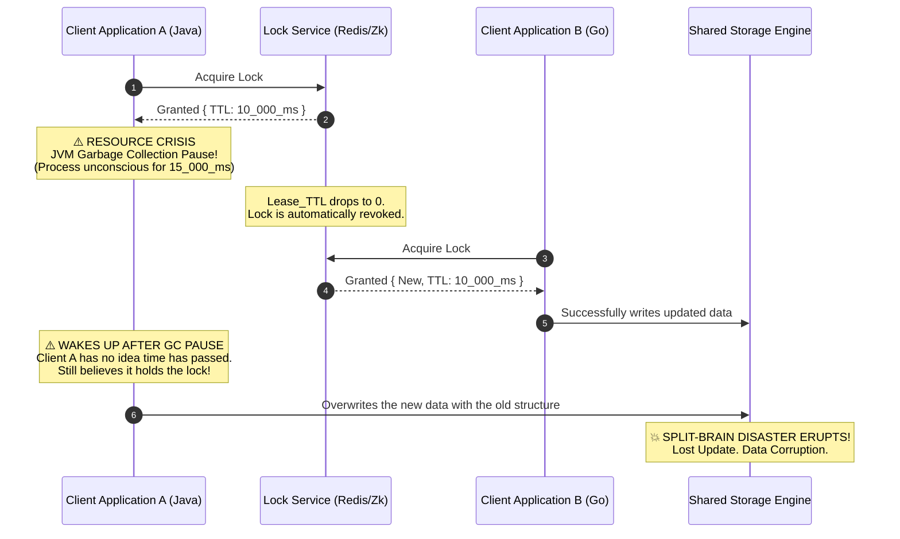
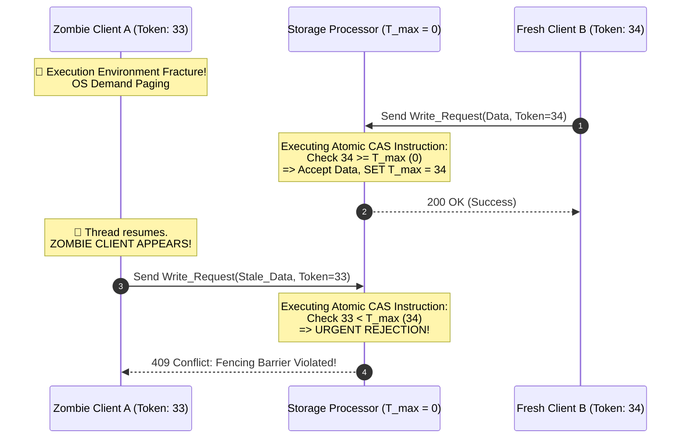

# Split-Brain, Fencing, and Quorums: How Storage Engines Survive a Network Partition

## Why Split-Brain Is the Failure Mode Everyone Fears

Ask any distributed-systems engineer what keeps them up at night, and split-brain is usually near the top of the list. It happens when the network fractures and a cluster ends up split into isolated groups of nodes. Without an out-of-band way to check on each other, each side assumes it's the only one left standing and elects its own leader. Now you have two leaders, both accepting writes, both handing out locks that contradict each other — and by the time anyone notices, the data has already been torn in two directions that can't be reconciled.

This article works through split-brain from two angles: the quorum math that Raft and Paxos-based systems use to prevent it, and the operating-system-level failures — clock skew, GC pauses — that can undermine even a correctly implemented lock service. We'll end with the mechanism that actually closes the gap: fencing tokens, which move the guarantee out of the network layer and into the storage engine itself, where it becomes a property you can verify rather than something you hope holds true.

**The core problem.** Most systems quietly assume the OS and the network can act as a dependable clock. When you take out a distributed lock with a lease or TTL, the implicit contract is: as long as the lease hasn't expired, you're safe to write. But if a client's thread gets frozen — a page fault, a GC pause, a hypervisor stealing its CPU time — that contract breaks silently. The client wakes up later as what we'll call a zombie client: it still believes it holds a lock that expired minutes ago, and it goes ahead and overwrites data that another client has since written. The question this article answers is how a storage engine can protect itself from that kind of internal attack, one that doesn't come from a hostile actor but from ordinary OS scheduling.

**What we'll establish:**
1. A physical clock or TTL alone is not a safe basis for consensus — you need a logical clock, one that only ever moves forward and is validated at the point of write.
2. Zombie clients are the real danger, not network partitions per se. A lock service like ZooKeeper only decides who's allowed to *ask* — the storage engine has to be the one that decides who's allowed to *write*.
3. Quorum systems work because of simple set intersection: if every write quorum and every other quorum are guaranteed to overlap, two leaders can never both believe they have permission to write.

---

## Network Partitions and the CAP / PACELC Trade-off

Formally, a network partition splits a connected graph $G = (V, E)$ into disconnected subsets $V_1, V_2, \dots, V_k$, where the bandwidth between them collapses toward $0$ and round-trip latency shoots toward $\infty$.

In practice this rarely looks like a severed undersea cable. More often it's buffer bloat inside a switch's ASIC — packets start dropping, TCP congestion control panics, and heartbeats stop arriving on time. Whatever the cause, CAP theorem gives you no way around the choice: when the network is partitioned, you pick consistency or you pick availability.

Pick availability, and each partition $V_k$ keeps serving its own clients, which means each side starts writing its own version of history. That divergence is split-brain. Once a financial ledger or a B-tree index has been modified independently on both sides, there's no automatic way to merge the two back together — someone has to reconcile it by hand, and even then some writes are simply lost.

### 1 Quorums: The Mechanism That Prevents Two Brains From Forming

Systems like Apache ZooKeeper and HashiCorp Consul avoid this outcome using Paxos or Raft, both of which rest on a fairly simple piece of set theory: the quorum.

A set of quorums $S = \{Q_1, Q_2, \dots, Q_m\}$ is only useful for consensus if any two quorums are guaranteed to intersect:
$\forall Q_i, Q_j \in S, Q_i \cap Q_j \neq \emptyset$.

In practice this comes down to two conditions:

- Read set $Q_r$ and write set $Q_w$, relative to total node count $N$: $Q_r + Q_w > N$
- To prevent split-brain specifically: $Q_w > \frac{N}{2}$

Take a 5-node cluster that splits into a group of 3 and a group of 2. Only the 3-node side can gather more than half the votes ($> 2.5$), so only it can elect a leader. The 2-node side keeps timing out on its election attempts and demotes itself to follower — it simply can't manufacture enough votes to declare victory, no matter how long it waits.

---

## Distributed Locks and the Illusion of a Reliable Clock

Say you want to stop two clients from editing the same file at once. The usual approach is a distributed lock with a lease — 10 seconds, for example — so that if a client dies, the lock frees itself automatically after that window. Reasonable enough on paper. The trouble starts at the OS layer, where "10 seconds" doesn't mean what you'd hope it means.

### 1 The Stop-the-World Problem

A surprising number of things can pause a client's execution without the client itself knowing time has passed:

- **Garbage collection.** JVM and Go runtimes can trigger stop-the-world cycles where the entire application thread freezes — sometimes for tens of seconds — while the heap gets cleaned up.
- **OS page faults.** A memory access that isn't backed by RAM triggers the MMU to raise a hardware interrupt, and the CPU has to wait while the missing page is pulled in from disk.
- **Hypervisor CPU steal time.** In cloud environments, a VM's access to the physical CPU can be revoked by the hypervisor for reasons entirely outside the VM's control.

While Client A sits frozen in userspace, none of this shows up to the lock service — its clock keeps running normally. The 10-second lease expires, the lock service releases it, and Client B picks it up. Client A eventually wakes up with no idea that any time has passed at all. It checks its own internal flag, sees "I hold the lock," and proceeds as if nothing happened.



This is the kind of lost-update bug that's miserable to debug, because nothing in the logs looks wrong. Every individual operation was logged as successful — it's only the ordering, the thing you can't see from any single log line, that's broken.

---

## Fencing Tokens: Moving the Guarantee Into the Storage Engine

If you can't trust wall-clock time to arbitrate who's allowed to write, the fix is to stop relying on it. This is where fencing tokens come in, and the idea underneath them is straightforward.

- Drop the physical clock as a source of truth. Use a **logical clock** instead — a strictly increasing integer sequence, $T_i > T_{i-1}$, that has nothing to do with wall time.
- Every time the lock service grants a lock, it hands out the next token in sequence: 33, then 34, then 35, and so on.
- The storage engine stops being a passive recipient of writes and becomes the actual enforcement point. It keeps a running record, $T_{max}$, of the highest token it has ever accepted.
- **The rule is simple:** when a write arrives with a token, compare it against $T_{max}$.
  - If $T_{req} \ge T_{max}$: accept the write and update $T_{max} = T_{req}$.
  - If $T_{req} < T_{max}$: reject it outright — a 409 Conflict is typical — because a lower token can only mean this client is behind.

### 1 How This Kills the Zombie Client Problem

Replay the earlier scenario, this time with fencing tokens in place:

1. Client A acquires the lock and gets token `33`. Then the JVM GC pause hits.
2. The lease expires. Client B acquires the lock and gets token `34`.
3. Client B writes to storage with token `34`. Storage checks $34 \ge 0$, accepts, and sets $T_{max} = 34$.
4. Client A wakes up — now effectively a zombie client — and tries to write with its stale token `33`.
5. Storage checks $33 < 34$: false. The write is rejected before it ever touches the underlying data.

Split-brain never gets the chance to materialize, because the conflicting write is stopped at the door — before a single bit on disk changes.



---

## Implementing the Fencer in Rust With Compare-And-Swap

A fencing check like this has to survive tens of millions of IOPS without becoming the bottleneck. A traditional mutex around $T_{max}$ would be the wrong tool here — you'd be serializing every single write behind a lock just to compare two integers. Instead, this is exactly the kind of thing lock-free atomics were built for, using a compare-and-swap (CAS) instruction directly.

Here's a minimal storage fencer in Rust that relies on the MESI cache-coherence protocol and hardware bus locking to keep $T_{max}$ consistent without paying for a full lock on every write:

```rust
use std::sync::atomic::{AtomicU64, Ordering};

pub struct HighThroughputStorageFencer {
    // AtomicU64 guarantees absolute memory safety on 64-bit microarchitectures
    current_max_fencing_token: AtomicU64,
}

pub enum FencingViolationError {
    StaleZombieToken { provided_token: u64, current_system_max: u64 },
}

impl HighThroughputStorageFencer {
    pub fn new() -> Self {
        Self { current_max_fencing_token: AtomicU64::new(0) }
    }

    pub fn validate_and_atomically_update(&self, incoming_fencing_token: u64) -> Result<(), FencingViolationError> {
        // The Acquire ordering prevents CPU instruction reordering
        let mut local_current_view = self.current_max_fencing_token.load(Ordering::Acquire);
        
        loop {
            // BLOCK THE ZOMBIE CLIENT
            if incoming_fencing_token < local_current_view {
                return Err(FencingViolationError::StaleZombieToken {
                    provided_token: incoming_fencing_token,
                    current_system_max: local_current_view,
                });
            }
            
            // Lock-free CAS strike. If another core just inserted a new value, retry immediately
            match self.current_max_fencing_token.compare_exchange_weak(
                local_current_view, 
                incoming_fencing_token, 
                Ordering::Release, 
                Ordering::Relaxed
            ) {
                Ok(_) => return Ok(()),
                Err(new_updated_val_from_ram) => local_current_view = new_updated_val_from_ram,
            }
        }
    }
}
```

Because this is a `compare_exchange_weak` loop rather than a mutex, the check adds essentially no overhead — the cost stays close to $O(1)$ even under heavy contention, since a losing thread just reloads and retries instead of blocking.

---

## Conclusion

None of this — split-brain, fencing, and quorums — is really about stitching APIs together carefully. It's closer to applied set theory: quorum systems guarantee overlap so two leaders can't both claim a majority, and fencing tokens replace an unreliable physical clock with a logical one that the storage engine can actually verify at write time. Put both together and you get a storage engine that stays correct even when the network partitions and even when a client's thread disappears into a GC pause for fifteen seconds — because correctness no longer depends on any clock agreeing with any other clock.

---
