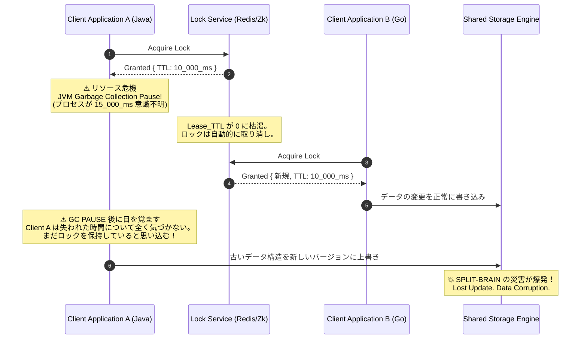
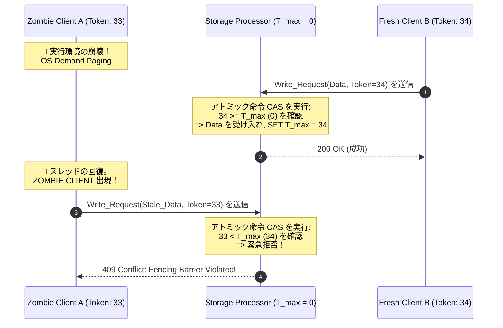

# スプリットブレイン(Split-Brain)問題 - Fencing Tokens、Quorums、そして一貫性を守る戦い

## エグゼクティブサマリー (Executive Summary)

分散システムの運用で本当に手を焼くのが「スプリットブレイン(Split-Brain)」だ。ネットワークが分断され、サーバークラスターがいくつかの孤立した島に割れてしまったときに起きる。帯域外(out-of-band)の通信手段がなければ、各パーティションは自分こそが唯一の生存者だと思い込み、それぞれ独自に新しいリーダーを選出してしまう。結果、二つの「脳」が同時に動き、互いに矛盾する分散ロックを発行し合い、データを無秩序に上書きして、コアのストレージシステムに修復不能なダメージを与える。

本稿ではスプリットブレイン現象をQuorum(集合論)とCAP定理の観点から丁寧に解剖する。さらに踏み込んで、OSのマイクロアーキテクチャまで掘り下げ、クロックスキューやガベージコレクションの一時停止(GC pause)といった物理的な落とし穴が、ZooKeeperやRedis Redlockのような優れたロック管理サービスすら欺きうることを見ていく。

最後に提示するのが、この問題への決定打となる**Fencing Tokens**だ。これはストレージエンジンのソースコードに直接埋め込む防御機構であり、一貫性の担保をネットワークの信頼性任せにするのではなく、数学的な保証に置き換えてしまう発想と言える。

**問題提起 (Problem Statement):**
現代のシステム設計では、OSやネットワークが信頼できる「リアルタイム」の基準を提供してくれるという前提が、暗黙のうちに置かれがちだ。分散ロック(Lease/TTL)を使うとき、有効期限さえ切れればロックは安全に失効すると考える。ところが、クライアントの実行スレッドがOSのページフォールトやGC pauseで凍りついてしまうと、その時間の契約は静かに破られる。目を覚ました「ゾンビクライアント」は、とっくに失効したロックをまだ握っていると思い込んだまま、他人が正しく書いたデータを平然と上書きしてしまう。ストレージシステムはこの内側からの攻撃にどう対処すればいいのか。

**学んだ教訓と知識 (Lessons Learned):**
1. **物理時計はあてにならない。** 合意形成の唯一の拠り所として物理的なクロックやTTLを使ってはいけない。論理時計(logical clock)を使うべきだ。
2. **ゾンビクライアントは見えない刺客だ。** Fencing Tokensのないシステムは、鍵はかかっているのに中に警備員がいない家のようなものだ。ZooKeeperのロックはネットワークアクセス権を決めるだけで、実際に書き込みを許すかどうかの最後の関所はストレージエンジン自身が担うべきだ。
3. **Quorumは数学的な盾になる。** Paxos/Raftは過半数($R + W > N$)を使うことで、分散セット上で二人のリーダーが同時に書き込みを成立させることは代数的にありえないと証明する。

---

## 理論的背景: ネットワーク分断とCAP / PACELC定理

ネットワーク分断とは、接続されたネットワークグラフ$G = (V, E)$がいくつかの非連結な部分集合$V_1, V_2, \dots, V_k$に割れ、それらの間の帯域幅が$\to 0$に近づき、遅延$RTT \to \infty$になる状態として定義できる。

この分断は海底光ケーブルの切断だけが原因ではない。スイッチのASIC内で起きる**バッファブロート**が大量のパケットドロップを引き起こし、TCPの輻輳制御を機能不全にし、ハートビートパケットを失敗させることも少なくない。CAP定理が示す通り、こうなるとシステムは苦しい選択を迫られる。一貫性を捨てるか、可用性を捨てるかだ。

可用性を選べば、各パーティション$V_k$はそれぞれクライアントへのサービス提供を続け、履歴が並行して分岐していく。これがスプリットブレインの本質的な原因だ。財務データやB-Treeインデックスの構造はいったん壊れると、二度と自動的にはマージできない。

### Split-Brainの天敵: Quorum合意アルゴリズム

二つの脳が同時に生まれるのを防ぐため、Apache ZooKeeperやHashiCorp ConsulはPaxosやRaftを使う。
その数学的な支柱が**Quorum**(定足数)の仕組みだ。Quorum集合$S = \{Q_1, Q_2, \dots, Q_m\}$は、どの二つの集合も必ず交わることを要求する。
$\forall Q_i, Q_j \in S, Q_i \cap Q_j \neq \emptyset$

- 総ノード数$N$に対する書き込み集合$Q_w$、読み取り集合$Q_r$: $Q_r + Q_w > N$
- スプリットブレインを防ぐには: $Q_w > \frac{N}{2}$

例えば5ノードのクラスターが3ノードと2ノードに分断されたとする。
3ノード側だけが過半数($> 2.5$)を確保できるためリーダーを選び続けられる。少数派の2ノード側は投票がまとまらずタイムアウトし続け、フォロワーへと降格する。

---

## マイクロアーキテクチャの謎: 分散ロックと時間の幻想

複数のクライアントが同じファイルを同時に編集しないよう、例えば10秒のTTL(lease)を持つ分散ロックを発行するとする。クライアントに障害が起きても10秒後には自動的にロックが解放される、という設計だ。
ところが、災害の種は常にOS層に潜んでいる。

### "Stop-The-World"という悪夢

ランタイム環境の複雑さは、時間の連続性を思わぬ形で壊すことがある。
- **ガベージコレクション(GC):** JVMやGoランタイムは"stop-the-world"サイクルを引き起こすことがある。ヒープ上のゴミを掃除する間、アプリケーションの実行スレッド全体が数十秒単位で凍りつく。
- **OSページフォールト:** RAMからのデータ読み取りに失敗すると、MMU(メモリ管理ユニット)がハードウェア割り込みを発生させ、遅いディスクからデータを取ってくる間CPUがアプリケーションを止める。
- **ハイパーバイザーのCPU steal time:** クラウド環境では、仮想サーバーがハイパーバイザーによって突然物理CPUを取り上げられることがある。

Client Aがユーザー空間で「無自覚に凍結」している間も、Lock Service側の時計は動き続ける。10秒の契約が切れると、Lock Serviceはロックを解放し、それをClient Bに渡す。
数秒後、Client Aが目を覚ます。しかしカーネルは「時間のブラックホール」についての割り込みを送ってくれるわけではないので、Client Aは自分の内部フラグを見て、まだロックを持っていると思い込んでしまう。



こうした目に見えない「更新のロスト」は、SREにとって最も厄介なデバッグ対象の一つだ。ログ上は何もかも正常に見えるのに、内部の順序はすでに壊れている。

---

## 決定的な防御策: Fencing Tokens

時間の幻想が崩れても数学的な正しさを保証するために、分散ストレージの世界は**Fencing Tokens**という仕組みを編み出した。
- 当てにならない物理時計を捨て、**論理時計**を使う。単調に増加する整数の列($T_i > T_{i-1}$)だ。
- Lock Serviceはロックを発行するたびに新しいトークン($33, 34, 35\dots$)を自動生成し、クライアントに渡す。
- **ストレージエンジンが果たす決定的な役割:** ストレージ層自体が能動的な関門になる。これまでに見た最大のトークンをグローバルなレジスタ$T_{max}$として保持しておく。
- **検証ルール:** クライアントがデータとトークンを持って書き込みに来たら、ストレージは単純な比較を行う。
  - $T_{req} \ge T_{max}$ なら、書き込みを受け入れ$T_{max} = T_{req}$に更新する。
  - $T_{req} < T_{max}$ なら、即座に拒否する(409 Conflictを返す)。このトークンはもう古すぎるからだ。

### ゾンビクライアントをマイクロチップレベルで撃退する

先ほどの時間のブラックホールのシナリオを、今度はFencing Tokensありで辿ってみる。
1. Client Aがロックを取得し、トークン`33`を受け取る。ここでJVMのGC pauseが発生する。
2. ロックが失効し、Client Bがロックを取得、トークン`34`を受け取る。
3. Client Bはトークン`34`をストレージに送る。ストレージは$34 \ge 0$を確認して書き込みを許可し、$T_{max} = 34$に更新する。
4. Client Aが目を覚まし、**ゾンビクライアント**と化して、古いトークン`33`のまま上書きしようとする。
5. ストレージ側は$33 < 34$を確認する。条件は偽だ。書き込みは即座に破棄され、扉は閉じられる。

スプリットブレインは、ディスク上のビットが一つも変わる前に、入り口の時点で確実に食い止められる。



---

## RustとCompare-And-Swap (CAS) による低レベル最適化

このストレージ側のフェンシング機構は、数千万のIOPSに耐えなければならない。メモリをロックするのにMutexを使うわけにはいかない(CPUがすぐに音を上げる)。エンジニアが頼るのはロックフリーなアトミック操作、つまりCAS(Compare-And-Swap)命令だ。

以下は、$T_{max}$をオーバーヘッドなしに保護するために、MESIキャッシュプロトコルとハードウェアのバスロックを活用したRustによるストレージフェンサーの実装例だ。

```rust
use std::sync::atomic::{AtomicU64, Ordering};

pub struct HighThroughputStorageFencer {
    // AtomicU64 は 64-bit マイクロアーキテクチャ上で絶対的なメモリ安全性を保証します
    current_max_fencing_token: AtomicU64,
}

pub enum FencingViolationError {
    StaleZombieToken { provided_token: u64, current_system_max: u64 },
}

impl HighThroughputStorageFencer {
    pub fn new() -> Self {
        Self { current_max_fencing_token: AtomicU64::new(0) }
    }

    pub fn validate_and_atomically_update(&self, incoming_fencing_token: u64) -> Result<(), FencingViolationError> {
        // Acquire 命令は CPU Reordering を防ぎます
        let mut local_current_view = self.current_max_fencing_token.load(Ordering::Acquire);
        
        loop {
            // ZOMBIE CLIENT の迎撃
            if incoming_fencing_token < local_current_view {
                return Err(FencingViolationError::StaleZombieToken {
                    provided_token: incoming_fencing_token,
                    current_system_max: local_current_view,
                });
            }
            
            // ロックフリー CAS を試行。別のコアが介入した場合、直ちにリトライします
            match self.current_max_fencing_token.compare_exchange_weak(
                local_current_view, 
                incoming_fencing_token, 
                Ordering::Release, 
                Ordering::Relaxed
            ) {
                Ok(_) => return Ok(()),
                Err(new_updated_val_from_ram) => local_current_view = new_updated_val_from_ram,
            }
        }
    }
}
```

この`compare_exchange_weak`ループのおかげで、フェンシングエンジンはガベージをほぼ出さないまま、運用コストを$O(1)$に近い水準まで抑えられる。

---

## まとめ

分散システムのアーキテクチャは、ゆるいAPI同士をつなぎ合わせるだけの作業ではない。数学的な裏付けを持った厳密な工学そのものだ。Quorum理論で多数決の条件を定量化し、アトミックなFencing Tokensで時空を越えて現れるゾンビクライアントの脅威を断ち切ることで、堅牢なストレージエンジンを設計できる。半導体の分子レベルで起きている熱力学的なカオスすら、こうした仕組みによって制御下に置くことができるのだ。
