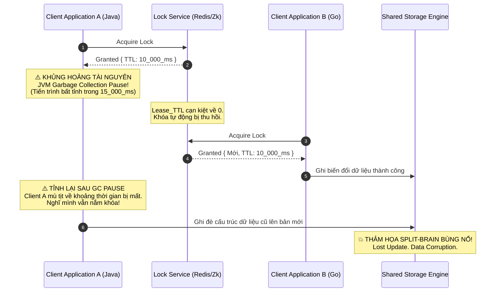
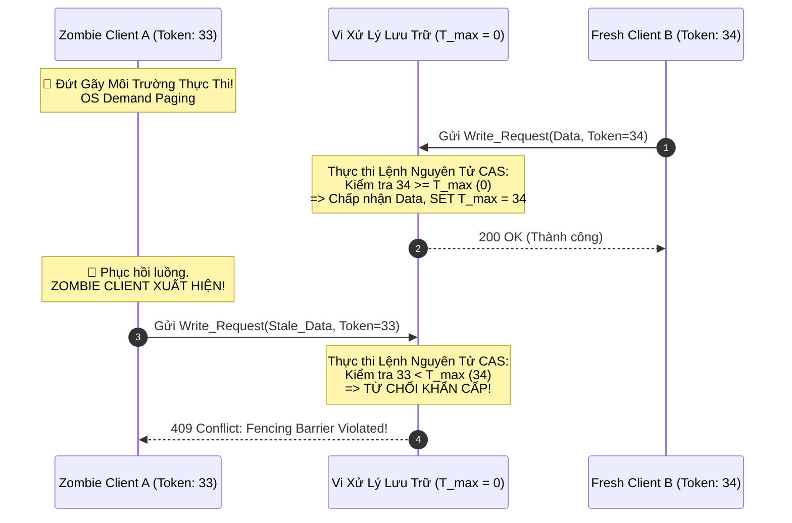

# Bài Toán Split-Brain: Fencing Tokens, Quorums Và Cuộc Chiến Bảo Vệ Tính Nhất Quán

## Tóm tắt Điều hành

Với dân vận hành hệ thống phân tán, "Split-Brain" (Hội chứng Phân não) vẫn là cơn ác mộng khó chịu nhất. Nó xảy ra khi mạng lưới đứt gãy, chia cụm máy chủ thành các hòn đảo cô lập. Không còn kênh liên lạc ngoại vi để xác nhận, mỗi phân vùng đinh ninh mình là kẻ sống sót duy nhất và tự bầu ra một Leader mới. Kết quả: hai "bộ não" cùng hoạt động song song, cấp phát Distributed Lock chồng chéo lên nhau, rồi ghi đè dữ liệu hỗn loạn — thiệt hại này thường không thể đảo ngược ở tầng storage engine.

Bài viết này mổ xẻ split-brain dưới góc độ lý thuyết Quorum và định lý CAP, sau đó đi sâu vào những cạm bẫy vật lý cấp hệ điều hành — clock skew, GC pause — vốn có thể đánh lừa cả những dịch vụ khóa tốt nhất như ZooKeeper hay Redis Redlock.

Cuối cùng là giải pháp thực dụng nhất mà ngành lưu trữ phân tán đã đúc kết: **Fencing Tokens**. Đây là cơ chế phòng thủ được nhúng thẳng vào storage engine, biến việc bảo vệ tính nhất quán thành một điều kiện toán học có thể kiểm chứng, thay vì đặt niềm tin mù quáng vào mạng.

**Vấn đề cốt lõi:**
Nhiều kiến trúc hiện đại ngầm giả định rằng hệ điều hành và mạng máy tính có thể cung cấp một chuẩn thời gian đáng tin cậy. Khi dùng Distributed Lock kiểu Lease/TTL, ta tin rằng khóa sẽ an toàn một khi hết hạn. Nhưng nếu luồng thực thi của client bị đóng băng — do OS page fault hay GC pause — hợp đồng thời gian đó sụp đổ ngay lập tức. Client "tỉnh lại" (Zombie Client) vẫn mang khóa đã hết hạn, ngây thơ tưởng mình còn quyền, và ghi đè lên dữ liệu hợp lệ của người khác. Storage engine cần cơ chế nào để tự vệ trước kiểu tấn công nội bộ này?

**Bài học rút ra:**
1. **Đồng hồ vật lý không đáng tin:** Đừng bao giờ dùng clock/TTL vật lý làm nguồn chân lý duy nhất cho consensus. Logical clock mới là thứ đáng tin.
2. **Zombie Client là kẻ giết người thầm lặng:** Một hệ thống thiếu fencing tokens giống nhà có khóa cửa nhưng không ai canh bên trong. ZooKeeper chỉ quyết định quyền truy cập ở tầng mạng — storage engine mới là chốt chặn cuối cùng kiểm tra thẻ bài.
3. **Quorum là lá chắn toán học:** Paxos/Raft dùng nguyên tắc đa số ($R + W > N$) để đảm bảo không bao giờ có hai Leader cùng ghi vào tập hợp phân tán tại một thời điểm.

---

## Nền Tảng Lý Thuyết: Phân Mảnh Mạng và Định Lý CAP / PACELC

Về mặt hình thức, một phân mảnh mạng (Network Partition) là khi đồ thị mạng liên thông $G = (V, E)$ bị đứt gãy thành các tập con không còn liên thông $V_1, V_2, \dots, V_k$, sao cho băng thông giao tiếp giữa chúng tiến về $\to 0$ và độ trễ $RTT \to \infty$.

Nguyên nhân không nhất thiết là đứt cáp quang biển. Trong thực tế, phần lớn các sự cố kiểu này bắt nguồn từ **buffer bloat** trong ASIC của switch, gây rớt gói hàng loạt, làm TCP congestion control tê liệt và khiến các gói heartbeat không đến nơi. Theo định lý CAP, hệ thống buộc phải chọn một trong hai: Tính Nhất Quán (C) hoặc Tính Sẵn Sàng (A).

Nếu chọn Availability, mỗi phân vùng $V_k$ vẫn tiếp tục phục vụ client, và từ đó sinh ra các nhánh lịch sử song song — đây chính là bản chất của split-brain. Dữ liệu tài chính, cấu trúc B-Tree index bị phân kỳ theo hai hướng khác nhau, và thường không thể tự động merge lại.

### Khắc Tinh Của Split-Brain: Thuật Toán Đồng Thuận Quorum

Để tránh tình trạng hai bộ não, Apache ZooKeeper và HashiCorp Consul dựa vào Paxos/Raft. Xương sống toán học của các thuật toán này là hệ **Quorum** (số đông). Tập hợp Quorum $S = \{Q_1, Q_2, \dots, Q_m\}$ đòi hỏi giao điểm luôn tồn tại:

$\forall Q_i, Q_j \in S, Q_i \cap Q_j \neq \emptyset$.

- Kích thước tập Ghi ($Q_w$) và Đọc ($Q_r$) so với tổng số node ($N$): $Q_r + Q_w > N$
- Để tránh split-brain: $Q_w > \frac{N}{2}$

Ví dụ: cụm 5 node bị phân mảnh thành 3 và 2. Chỉ cụm 3 node mới gom đủ phiếu bầu ($> 2.5$) để tiếp tục bầu Leader. Cụm 2 node thiểu số sẽ liên tục timeout và tự hạ cấp xuống Follower.

---

## Bí Ẩn Vi Kiến Trúc: Khóa Phân Tán và Ảo Tưởng Thời Gian

Để ngăn nhiều client sửa cùng một file, ta cấp cho chúng một Distributed Lock kèm thời hạn (Lease TTL), chẳng hạn 10 giây. Nếu client gặp lỗi, 10 giây sau khóa tự động nhả ra. Nghe rất hợp lý — cho đến khi tầng hệ điều hành can thiệp.

### Cơn Ác Mộng "Stop-The-World"

Runtime environment phức tạp hơn nhiều so với những gì ta hình dung, và hoàn toàn có thể phá vỡ tính liên tục của thời gian mà ứng dụng đang trông cậy vào:

- **Garbage Collection (GC):** JVM hay Go runtime có thể kích hoạt chu kỳ "stop-the-world", đóng băng toàn bộ luồng thực thi trong hàng chục giây để dọn heap.
- **OS Page Fault:** Khi dữ liệu không có sẵn trong RAM, MMU ngắt phần cứng, buộc CPU dừng ứng dụng để lấy dữ liệu từ đĩa chậm hơn nhiều bậc.
- **Hypervisor CPU Steal Time:** Trên cloud, máy ảo có thể bị hypervisor tước quyền dùng CPU vật lý bất cứ lúc nào.

Trong lúc Client A bị đóng băng ở userspace, đồng hồ của Lock Service vẫn chạy đều. Hợp đồng 10 giây hết hạn, Lock Service giải phóng khóa và cấp nó cho Client B. Vài giây sau, Client A tỉnh lại — nhưng vì kernel không hề báo động về khoảng thời gian đã mất, nó chỉ kiểm tra một cờ boolean nội bộ và thấy mình "vẫn đang giữ khóa".



Kiểu "lost update" âm thầm này là cơn ác mộng debug của SRE — log vẫn ghi nhận mọi thứ hợp lệ, nhưng trình tự thao tác đã bị xé rách từ bên trong.

---

## Kiến Trúc Phòng Thủ: Fencing Tokens

Để giữ tính đúng đắn ngay cả khi ảo tưởng về thời gian sụp đổ, ngành lưu trữ phân tán đưa ra giải pháp **Fencing Tokens**:

- Bỏ hẳn đồng hồ vật lý phi tuyến tính. Dùng **Logical Clocks** — một dãy số nguyên tăng nghiêm ngặt ($T_i > T_{i-1}$).
- Mỗi lần Lock Service cấp khóa, nó tự động sinh một token mới: $33, 34, 35\dots$ và đính kèm cho client.
- **Vai trò then chốt của Storage Engine:** tầng storage trở thành người gác cổng chủ động, duy trì một thanh ghi toàn cục $T_{max}$ — token lớn nhất từng thấy.
- **Quy tắc kiểm tra atomic:** khi client gửi dữ liệu kèm token để ghi, storage kiểm tra:
  - Nếu $T_{req} \ge T_{max}$: chấp nhận ghi, cập nhật $T_{max} = T_{req}$.
  - Nếu $T_{req} < T_{max}$: từ chối ngay (trả lỗi 409 Conflict) vì token này đã cũ.

### Dập Tắt Zombie Client Từ Gốc

Chạy lại kịch bản "hố đen thời gian" ở trên, lần này với fencing token:

1. Client A lấy khóa, nhận token `33`. GC pause của JVM kích hoạt.
2. Khóa hết hạn, Client B lấy khóa, nhận token `34`.
3. Client B gửi token `34` cho storage. Storage thấy $34 \ge 0$, cho phép ghi, cập nhật $T_{max} = 34$.
4. Client A tỉnh dậy — giờ là một Zombie Client — mang token cũ `33` đến storage định ghi đè.
5. Storage kiểm tra: $33 < 34$. Điều kiện sai. Request bị từ chối ngay lập tức.

Split-brain bị chặn đứng ngay từ đầu vào, trước khi bất kỳ bit nào trên đĩa kịp thay đổi.



---

## Tối Ưu Hóa Cấp Thấp Bằng Rust Và Compare-And-Swap

Bộ fencer này phải chịu tải hàng chục triệu IOPS, nên dùng mutex khóa bộ nhớ là không ổn — CPU sẽ nghẽn ngay. Cách thực tế hơn là dùng **lock-free atomic operations**, cụ thể là lệnh CAS (Compare-And-Swap).

Dưới đây là một ví dụ storage fencer cấp kernel viết bằng Rust, tận dụng giao thức cache-coherence MESI và hardware bus locking để bảo vệ $T_{max}$ mà gần như không tốn overhead.

```rust
use std::sync::atomic::{AtomicU64, Ordering};

pub struct HighThroughputStorageFencer {
    // AtomicU64 bảo đảm an toàn bộ nhớ tuyệt đối trên vi kiến trúc 64-bit
    current_max_fencing_token: AtomicU64,
}

pub enum FencingViolationError {
    StaleZombieToken { provided_token: u64, current_system_max: u64 },
}

impl HighThroughputStorageFencer {
    pub fn new() -> Self {
        Self { current_max_fencing_token: AtomicU64::new(0) }
    }

    pub fn validate_and_atomically_update(&self, incoming_fencing_token: u64) -> Result<(), FencingViolationError> {
        // Lệnh Acquire ngăn chặn CPU Reordering
        let mut local_current_view = self.current_max_fencing_token.load(Ordering::Acquire);
        
        loop {
            // ĐÁNH CHẶN ZOMBIE CLIENT
            if incoming_fencing_token < local_current_view {
                return Err(FencingViolationError::StaleZombieToken {
                    provided_token: incoming_fencing_token,
                    current_system_max: local_current_view,
                });
            }
            
            // Xung kích CAS phi khóa. Nếu lõi khác vừa chèn vào, retry lập tức
            match self.current_max_fencing_token.compare_exchange_weak(
                local_current_view, 
                incoming_fencing_token, 
                Ordering::Release, 
                Ordering::Relaxed
            ) {
                Ok(_) => return Ok(()),
                Err(new_updated_val_from_ram) => local_current_view = new_updated_val_from_ram,
            }
        }
    }
}
```

Nhờ vòng lặp `compare_exchange_weak` cấp thấp này, fencer engine đạt chi phí vận hành gần như $O(1)$, không cần cấp phát bộ nhớ thêm.

---

## Tổng Kết

Thiết kế hệ thống phân tán không phải là chuyện ghép nối vài API lỏng lẻo lại với nhau — nó đòi hỏi một nền tảng toán học chặt chẽ đứng sau mỗi quyết định. Quorum giải quyết bài toán "ai được quyền nói tiếng nói cuối cùng" ở tầng consensus; fencing tokens giải quyết bài toán "làm sao chặn một client đã lỗi thời nhưng chưa biết mình lỗi thời" ở tầng storage. Kết hợp cả hai, ta có một hệ thống chống split-brain không dựa vào giả định về thời gian thực — mà dựa vào các điều kiện có thể chứng minh được.
