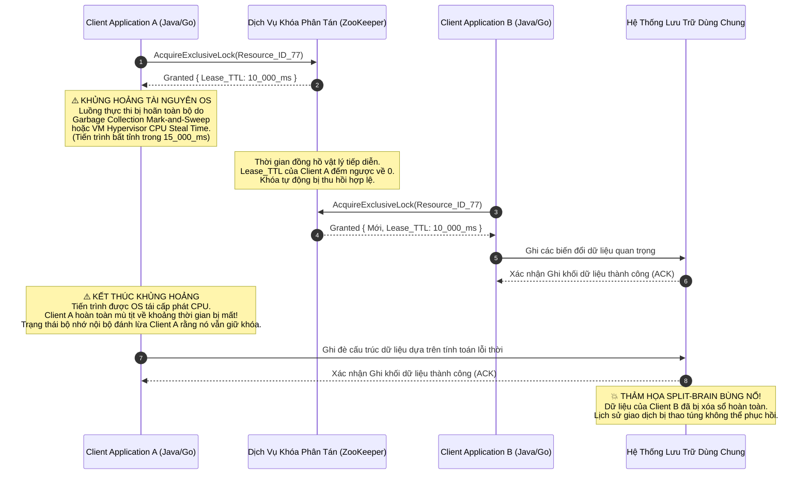
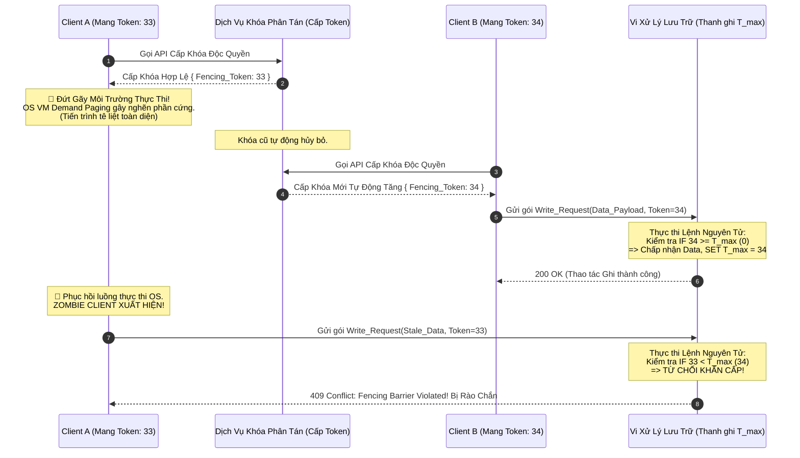

# 30: Bài toán Split-Brain: Fencing Tokens, Quorums và Distributed Locking

## Cơ Sở Lý Thuyết Về Phân Mảnh Mạng Và Đồng Thuận Phân Tán

Trong lĩnh vực thiết kế, vận hành và tối ưu hóa các hệ thống phân tán quy mô lớn, bài toán Split-Brain hiện diện như một trong những thách thức cơ bản, dai dẳng và khó giải quyết nhất ở cấp độ kiến trúc, đe dọa trực tiếp đến tính nhất quán dữ liệu tuyến tính (linearizability) và tính toàn vẹn của toàn bộ hệ sinh thái phần mềm. Khái niệm Split-Brain, hay còn gọi là hiện tượng phân não hệ thống, mô tả một trạng thái dị thường cấp độ vĩ mô trong đó một cụm máy chủ (cluster) bị chia cắt thành hai hoặc nhiều phân vùng mạng độc lập, mất khả năng giao tiếp xuyên vùng. Đáng sợ hơn, do thiếu hụt một kênh truyền thông out-of-band (kênh tín hiệu ngoại vi), mỗi phân vùng đều lầm tưởng một cách vô căn cứ rằng bản thân nó là thành phần duy nhất còn sống sót trên đồ thị mạng, từ đó kích hoạt các quy trình tự động bầu cử ra các tiến trình lãnh đạo (leader/primary) song song hoặc cấp phát các khóa phân tán (distributed locks) hoàn toàn chồng chéo. Nền tảng toán học và lý thuyết thông tin của hiện tượng này được mô tả chặt chẽ thông qua Định lý CAP của Eric Brewer và cấu trúc mở rộng lý thuyết PACELC của Daniel Abadi, trong đó khẳng định một cách bất di bất dịch rằng khi một phân mảnh mạng (network partition) xảy ra, hệ thống bắt buộc phải đánh đổi giữa tính nhất quán (Consistency) và tính sẵn sàng (Availability). Sự xuất hiện của các phân mảnh mạng đã được chứng minh là không thể tránh khỏi (inevitable) do các giới hạn bất biến của vật lý điện từ, sự khúc xạ quang học trong cáp quang băng thông rộng, và các giới hạn giới hạn về vùng nhớ đệm FIFO (First-In-First-Out) được nhúng sâu bên trong các vi mạch ASIC của bộ định tuyến. Một phân mảnh mạng có thể được định nghĩa một cách hình thức và quy chuẩn là một đồ thị mạng liên thông $G = (V, E)$ bị đứt gãy thành các tập hợp con không liên thông $V_1, V_2, \dots, V_k$ sao cho băng thông khả dụng giữa bất kỳ hai tập hợp con $V_i$ và $V_j$ tiến tới tiệm cận không, hoặc độ trễ truyền tải trọn vòng (Round-Trip Time - RTT) $\Delta t \to \infty$. Trong các mô hình ngẫu nhiên mô phỏng xác suất lỗi cấu trúc mạng diện rộng (WAN), xác suất để xảy ra ít nhất một sự kiện phân mảnh mạng trong khoảng thời gian $t$ thường được mô hình hóa bằng phân phối hàm mũ liên tục: $$ P(\text{partition}) = 1 - e^{-\lambda t} $$ trong đó đại lượng $\lambda$ biểu diễn tỷ lệ hỏng hóc trung bình theo thời gian của các thiết bị mạng trung gian, bao gồm cả lỗi phần mềm giao thức định tuyến BGP (Border Gateway Protocol) và sự cố tụt nguồn cung cấp điện từ các trạm biến áp. Sự đứt gãy kết nối mạng này không chỉ đơn thuần giới hạn ở các đứt gãy cáp vật lý ngầm dưới đáy biển; nó còn bắt nguồn từ các sự kiện vi mô như sự tràn bộ đệm cực độ (buffer bloat) ở cấp độ vi kiến trúc của switch mạng, gây ra hiện tượng rớt gói tin hàng loạt, làm tê liệt cơ chế kiểm soát tắc nghẽn TCP (TCP Congestion Control) và tạo ra độ trễ hàng chục giây cho các gói tin kiểm tra trạng thái sống (heartbeat packets). Khi một hệ thống cơ sở dữ liệu phân tán bị phân mảnh, nếu không có cơ chế kiểm soát nghiêm ngặt dựa trên số đông theo thuyết tập hợp (quorum-based control), các nút tính toán ở các phân vùng khác nhau sẽ đồng thời tiếp nhận các yêu cầu ghi biến đổi trạng thái từ phía máy khách đa luồng, dẫn đến sự phân kỳ trạng thái toàn cục (global state divergence). Hệ quả thảm khốc trực tiếp là hệ thống dữ liệu bị ghi đè lẫn nhau, các giao dịch tài chính phi tập trung (DeFi) bị thất thoát hoặc lặp lại vô cớ, và các cấu trúc dữ liệu cây B-Tree của chỉ mục cơ sở dữ liệu bị phá hủy cấu trúc liên kết vĩnh viễn không thể khôi phục nguyên vẹn thông qua các phương pháp hợp nhất tự động (auto-merging resolution). 

Để thiết lập một rào chắn chống lại thảm họa dữ liệu đa phân vùng này, các hệ thống cơ sở dữ liệu hiện đại có độ tin cậy tuyệt đối và các dịch vụ điều phối trung tâm như Apache ZooKeeper, HashiCorp etcd hay Consul đều bắt buộc phải triển khai các thuật toán đồng thuận phân tán có độ phức tạp cao như Paxos, Raft hoặc Multi-Paxos. Xương sống toán học của mọi thuật toán đồng thuận đa phân tử này luôn xoay quanh khái niệm Quorum (số đông tối thiểu bắt buộc). Hệ thống Quorum cấu thành nền tảng chứng minh toán học đảm bảo tính nhất quán mạnh mẽ thông qua việc định nghĩa các tập hợp con các nút mạng sao cho bất kỳ hai tập hợp con nào cũng phải có ít nhất một nút vật lý giao nhau. Về mặt lý thuyết tập hợp đại số, một hệ thống Quorum $S = \{Q_1, Q_2, \dots, Q_m\}$ thỏa mãn điều kiện tiên quyết mang tính sống còn là $\forall Q_i, Q_j \in S, Q_i \cap Q_j \neq \emptyset$. Trong mô hình kiến trúc đọc/ghi truyền thống dựa trên số đông, để đảm bảo mỗi thao tác đọc đều chắc chắn truy xuất được giá trị mới nhất (có tem thời gian logic cao nhất) đã được ghi thành công, kích thước của tập hợp các nút tham gia trả lời thao tác đọc (ký hiệu là $Q_r$) và tập hợp các nút xác nhận thao tác ghi (ký hiệu là $Q_w$) phải thỏa mãn bất đẳng thức nghiêm ngặt: $$ Q_r + Q_w > N $$ trong đó tham số $N$ đại diện cho tổng số lượng nút thành viên cấu thành nên cụm (cluster). Đồng thời, để ngăn chặn tận gốc hiện tượng hai thao tác ghi diễn ra đồng thời tạo ra hai nhánh lịch sử phân kỳ không thể dung hòa, kích thước tập hợp ghi bắt buộc phải chiếm ưu thế đa số tuyệt đối so với toàn cụm: $$ Q_w > \frac{N}{2} $$ Việc tuân thủ và cưỡng chế nghiêm ngặt các bất đẳng thức Quorum này ở tầng giao thức mạng đảm bảo chắc chắn rằng không thể có hai phân vùng mạng bị cô lập nào cùng đồng thời có khả năng thu thập đủ số lượng phiếu bầu (votes) để thực thi thao tác sửa đổi trạng thái khối, hay bầu cử ra một leader mới để nắm quyền điều khiển cụm. Lấy ví dụ, thuật toán đồng thuận Raft áp dụng nguyên lý cơ bản này một cách cực đoan trong pha bầu cử (Leader Election), nơi giao thức yêu cầu ứng cử viên bắt buộc phải nhận được thông điệp RequestVoteRPC phản hồi thành công từ lớn hơn một nửa số lượng thành viên định danh trong cụm. Nếu một sự cố đứt gãy mạng bất ngờ xảy ra và chia tách một cụm gồm $N=5$ máy chủ vật lý thành hai phân vùng hoàn toàn độc lập chứa lần lượt $3$ nút và $2$ nút, lý thuyết Quorum khẳng định chỉ có phân vùng chứa $3$ nút mới có khả năng toán học thiết lập được Quorum hợp lệ để duy trì dịch vụ, trong khi phân vùng $2$ nút thiểu số sẽ liên tục gặp phải lỗi thời gian chờ (timeout) trong quá trình vận động tranh cử và buộc phải tự hạ cấp vĩnh viễn xuống trạng thái chờ đợi theo sau (follower state), từ chối mọi yêu cầu ghi từ phía máy khách nhằm bảo vệ tính toàn vẹn dữ liệu tổng thể.

## Cơ Chế Cấp Phát Khóa Phân Tán Và Hiệu Ứng Split-Brain Mức Hệ Điều Hành

Cơ chế cấp phát khóa phân tán (Distributed Locking Mechanisms) – thường được trừu tượng hóa bằng các thuật toán như Redlock của Redis hay các ZNode tạm thời (ephemeral nodes) của ZooKeeper – đóng vai trò như một hòn đá tảng kiến trúc dùng để điều phối sự truy cập độc quyền một cách tuần tự vào một tài nguyên số dùng chung, chẳng hạn như một tệp tin dữ liệu khổng lồ trên hệ thống Hadoop Distributed File System (HDFS) hoặc một bản ghi tối quan trọng trong một cơ sở dữ liệu quan hệ. Trong một mô hình điện toán đám mây lý tưởng hóa, một máy khách (Client Application) thực hiện gửi chuỗi thông điệp yêu cầu qua giao thức TCP/IP đến dịch vụ quản lý khóa (Lock Service) và may mắn nhận được một phiên bản khóa mã hóa có đính kèm một thông số giới hạn thời gian tồn tại tuyệt đối, thường được gọi là thời gian sống (Time-To-Live - TTL) hoặc hợp đồng thuê mướn (Lease). Máy khách được lập trình với niềm tin tuyệt đối rằng trong suốt khoảng cửa sổ thời gian TTL đã được cấp phép này, không một tiến trình cạnh tranh nào khác trên toàn bộ hệ thống mạng diện rộng được phép xâm phạm và truy cập vào tài nguyên dùng chung đó. Tuy nhiên, giả định tiên quyết về một mạng lưới các đồng hồ vật lý dao động thạch anh đồng bộ hoàn hảo trên nhiều thiết bị phần cứng khác nhau là một ảo tưởng kỹ thuật vô cùng nguy hiểm trong khoa học máy tính phân tán phi tập trung. Ngay cả khi các hệ thống hạ tầng sử dụng các giao thức đồng bộ hóa thời gian chính xác ở mức độ vi giây như Network Time Protocol (NTP) phiên bản 4 hay Precision Time Protocol (PTP IEEE 1588) được hỗ trợ bởi thiết bị phần cứng giao tiếp mạng (Hardware Timestamping NICs) kết hợp với vệ tinh GPS và đồng hồ nguyên tử Rubidium, độ lệch đồng hồ cục bộ (clock skew) và tốc độ trôi trượt của thời gian vật lý (clock drift) giữa các bo mạch chủ khác nhau vẫn luôn hiện hữu, dao động biên độ khó lường từ vài mili-giây đến vài giây tùy thuộc vào nhiệt độ môi trường xung quanh CPU. Sự bất định thời gian này làm cho việc đo lường thời điểm hết hạn TTL ở hai máy tính khác nhau mang tính chất tương đối và chứa đựng rủi ro sai lệch đồng thuận khổng lồ.

Hơn thế nữa, sự phức tạp khủng khiếp của kiến trúc hệ điều hành và môi trường chạy thực thi (Runtime Environment) hoàn toàn có khả năng phá vỡ định đề về tính liên tục của thời gian trong nội bộ một tiến trình tính toán. Một luồng thực thi máy khách có thể bị đóng băng toàn diện và rơi vào trạng thái tê liệt hoàn toàn bởi một chu kỳ "Tạm dừng Toàn cầu" (Stop-The-World) của hệ thống thu gom rác bộ nhớ động (Garbage Collector), đặc biệt phổ biến trong các ngôn ngữ lập trình dựa trên máy ảo tự quản lý bộ nhớ như Java Virtual Machine (JVM), C# .NET, hoặc Go Runtime. Giai đoạn tạm dừng để thực hiện quét và đánh dấu (mark-and-sweep) cấu trúc đối tượng này là không thể dự đoán trước về mặt thời điểm cũng như thời lượng, có khả năng kéo dài hàng chục giây đối với các khối bộ nhớ heap khổng lồ (vài trăm Gigabytes) đang đối mặt với sự phân mảnh bộ nhớ rác nghiêm trọng. Ở mức độ sâu hơn bên trong không gian nhân (Kernel Space), hệ điều hành có thể bất ngờ vấp phải hiện tượng lỗi phân trang vùng nhớ (Demand Paging / Page Fault), buộc khối quản lý bộ nhớ MMU (Memory Management Unit) kích hoạt ngắt phần cứng, yêu cầu CPU phải dừng mọi hoạt động của tiến trình người dùng để thực hiện thao tác I/O đồng bộ hóa cấu trúc trang đọc dữ liệu từ ổ cứng từ tính chậm chạp thông qua giao diện thiết bị khối PCIe. Hoặc một hiện tượng phổ biến trong môi trường ảo hóa điện toán đám mây là "CPU Steal Time", khi phần mềm ảo hóa (Hypervisor) bất ngờ tước đoạt toàn bộ chu kỳ xung nhịp CPU vật lý của máy ảo khách để cấp phát cho một máy ảo khác có độ ưu tiên cao hơn, hoặc bộ lập lịch luồng (Thread Scheduler) của Linux Kernel tự động hạ cấp tiến trình (preemption) gây ra nạn đói tài nguyên tính toán cục bộ (CPU starvation). Trong suốt những khoảng thời gian dài đằng đẵng mà máy khách bị "đóng băng vô thức" ở tầng ứng dụng này, thời gian vật lý bên ngoài không gian bộ nhớ của nó vẫn lạnh lùng trôi đi, dẫn đến hệ quả hiển nhiên là hợp đồng thuê khóa (lease TTL) của máy khách đang được lưu trữ trên Lock Service ở một máy chủ từ xa bị hết hạn theo đúng quy tắc giao thức. Lock Service, hoàn thành nhiệm vụ quản lý vòng đời tài nguyên của nó, ngay lập tức giải phóng khóa và nhanh chóng cấp phát quyền truy cập độc quyền cho một máy khách thứ hai (Client B) đang đứng chờ trong hàng đợi.

Sự kiện trớ trêu khi máy khách thứ hai hoàn tất việc nhận được khóa điều khiển mới trong khi máy khách thứ nhất (chủ sở hữu cũ) vẫn chưa kết thúc vòng đời tiến trình, tạo ra tiền đề hoàn hảo cho sự cố Split-Brain kinh điển ở tầng logic ứng dụng phân tán. Client B, sau khi nắm trong tay chìa khóa sở hữu, thực thi trót lọt các luồng thao tác truy vấn, đọc cấu trúc dữ liệu, tinh chỉnh tính toán và lưu trữ các biến đổi trạng thái mới (write operations) lên hệ thống lưu trữ bền vững dùng chung một cách hoàn toàn hợp lệ, sau đó đóng gói giao dịch và trả lại tài nguyên. Một vài mili-giây sau đó, chu kỳ thu thập rác bộ nhớ cực lớn trên JVM của Client A hoàn tất, giải phóng các thanh ghi CPU và khôi phục luồng thực thi, làm cho Client A "bừng tỉnh" khỏi cơn hôn mê kỹ thuật số. Điều tồi tệ và nguy hiểm nhất trong kiến trúc vi xử lý hiện đại là hệ điều hành và bộ vi xử lý hoàn toàn không cung cấp bất kỳ một tín hiệu ngắt phần cứng (hardware interrupt), ngoại lệ (exception) hay cờ báo trạng thái bộ nhớ (status flag) nào cho ứng dụng ở không gian người dùng (userspace) về việc nó vừa trải qua một hố đen thời gian kéo dài nhiều giây. Client A tiếp tục kiểm tra các cấu trúc dữ liệu cục bộ trên bộ nhớ cache L1/L2 của chính nó, thấy cờ boolean đánh dấu quyền sở hữu khóa phân tán vẫn còn giá trị "đúng" (true) – do đồng hồ chu kỳ nội bộ của ngôn ngữ lập trình chưa kịp kích hoạt lệnh gọi hệ thống (syscall) tới nhân điều hành để cập nhật thời gian thực RTC (Real-Time Clock) – và do đó, Client A ngây thơ tin tưởng một cách tuyệt đối rằng bản thân nó vẫn là thực thể duy nhất độc tôn trên toàn hệ thống mạng được cấp phép sửa đổi tài nguyên. Với niềm tin sai lệch nghiêm trọng được hỗ trợ bởi dữ liệu lỗi thời, Client A khởi tạo các kết nối TCP mới và rầm rộ đẩy hàng loạt các yêu cầu thao tác ghi (write mutations) cấu trúc dữ liệu lên phía hệ thống lưu trữ trung tâm. Kết quả tất yếu mang tính tàn phá là hệ thống lưu trữ mù quáng tiếp nhận các gói dữ liệu từ định danh mạng của Client A và nhẫn tâm ghi đè hoàn toàn lên những cập nhật giá trị mới nhất mà Client B vừa hoàn thiện trước đó, gây ra hiện tượng phá hủy hoàn toàn tính toàn vẹn thông tin (data corruption) và vi phạm trực diện định lý nhất quán tuyến tính. Hiện tượng vô hình này tạo ra các thao tác "Lost Updates" vô định, một cơn ác mộng gỡ lỗi bảo trì khốc liệt cho các Kỹ sư Độ tin cậy Hệ thống (Site Reliability Engineers) vì mọi công cụ giám sát đo lường (telemetry) thông thường đều chỉ ghi nhận các log hợp lệ của chuỗi thao tác ghi mà không thể nắm bắt được nghịch lý về trình tự logic thời gian.



## Giải Pháp Fencing Tokens Và Quorum Tuyến Tính Hóa

Để giải quyết một cách triệt để và chứng minh tính đúng đắn toán học trước sự sụp đổ của ảo tưởng đồng bộ hóa thời gian, ngành khoa học máy tính phân tán áp dụng kỹ thuật Fencing Tokens (Thẻ Rào Chắn Trạng Thái), một mẫu thiết kế bắt buộc không thể thương lượng trong các nền tảng lưu trữ phân tán đòi hỏi độ tin cậy cực đoan (mission-critical storage). Tư tưởng thiết kế cốt lõi của Fencing Tokens là rũ bỏ sự phụ thuộc mong manh vào khái niệm đồng hồ vật lý phi tuyến tính hay các khoảng chờ định thời TTL kém tin cậy, chuyển hướng sang việc sử dụng kiến trúc đồng hồ logic (Logical Clocks), đại diện bằng một dãy số nguyên đơn điệu tăng ngặt (strictly monotonically increasing integers) được sinh ra tập trung bởi chính hệ thống điều phối khóa, đóng vai trò như nguồn cội chân lý duy nhất (Single Source of Truth). Phương thức vận hành quy định rằng mỗi khi hệ thống quản lý khóa đồng ý cấp phát thành công một trạng thái khóa độc quyền cho một máy khách bất kỳ, bộ vi xử lý trung tâm của dịch vụ này sẽ sinh ra và đính kèm vào gói phản hồi một giá trị Fencing Token toán học $T_i$ thỏa mãn một tính chất bất biến vĩnh viễn: $T_i > T_{i-1}$ áp dụng cho mọi giao dịch $i$. Máy khách ở tầng ứng dụng, sau khi thiết lập trạng thái sở hữu và lấy được giá trị token toán học này, bắt buộc bị cưỡng chế ở cấp độ giao thức SDK mạng phải đính kèm giá trị token định danh này vào siêu dữ liệu (metadata) của tất cả mọi thông điệp yêu cầu đọc/ghi gửi hướng đến hệ thống lưu trữ vật lý. Tuy nhiên, yếu tố then chốt tạo nên sự vĩ đại của mẫu kiến trúc này không nằm ở phía Client mù quáng hay Lock Service độc lập, mà nó phụ thuộc sống còn vào một bộ máy xác thực bảo vệ trực tiếp bên trong không gian bộ nhớ của Hệ Thống Lưu Trữ Trung Tâm (Storage Layer). Khối hệ thống lưu trữ từ bỏ vai trò tiếp nhận dữ liệu thụ động để trở thành một hệ thống tham gia điều phối tính toán tích cực (active participant) vào giao thức kiểm soát tương tranh. Storage Engine duy trì một biến trạng thái bộ nhớ toàn cục (global state variable) lưu trữ lại giá trị Fencing Token số học lớn nhất mà bộ vi xử lý của nó từng tiếp nhận và xác thực thành công, ký hiệu hình thức là thanh ghi $T_{max}$. Khi một gói tin mạng yêu cầu ghi dữ liệu mới mang theo mã thông báo định danh $T_{req}$ vượt qua bộ đệm card mạng và đi vào bộ vi xử lý của hệ thống lưu trữ, hệ thống sẽ thực thi một khối logic xác thực toán học nguyên tử không thể chia cắt (indivisible atomic validation logic). Về mặt hàm chuyển trạng thái đại số boolean (boolean algebraic state transition function), hệ thống lưu trữ vận hành theo tiên đề sau: Nếu giá trị thẻ bài $T_{req} \ge T_{max}$, yêu cầu ghi dữ liệu biến đổi được đánh giá là sinh ra từ chủ thể hợp pháp mới nhất, nền tảng lưu trữ sẽ giải nén payload, thực thi thao tác I/O xuống ổ cứng vật lý và đồng thời cập nhật tức thời thanh ghi rào chắn $T_{max} \leftarrow T_{req}$. Trong trường hợp đối nghịch, nếu $T_{req} < T_{max}$, bộ xử lý ngắt lập tức vứt bỏ nội dung payload, không cho chạm vào cấu trúc đĩa, và trả ngược về hệ thống mạng một khung lỗi (Error Frame) chỉ định rõ ràng rằng định danh máy khách này đã trở thành một "Zombie Client" (Tiến trình thây ma) và đã chính thức bị "fenced" (cách ly rào cản hoàn toàn khỏi cấu trúc dữ liệu).

Quay trở lại tái hiện kịch bản thảm họa máy khách bị treo cứng đã mô phỏng ở chương trước thông qua lăng kính bảo vệ của Fencing Token. Máy khách Client A khởi tạo phiên làm việc và nhận được khóa độc quyền kèm theo Fencing Token $T=33$. Ngay sau đó, quá trình Garbage Collection bùng nổ, đóng băng hoàn toàn chu kỳ CPU của Client A. Thời gian Lease TTL ở hệ thống điều phối cạn kiệt, Client B nhanh chóng gửi yêu cầu và thu thập được khóa mới, hệ thống tự động tăng giá trị sinh token và cấp cho Client B một mã định danh $T=34$. Client B ngay lập tức gói ghém dữ liệu gửi đến Hệ thống Lưu Trữ kèm thep thẻ bài $T=34$. Khối vi xử lý của Storage tiếp nhận, xác thực thành công do $34 \ge 0$ (giả sử trạng thái ban đầu), tiến hành lưu trữ dữ liệu bền vững và cập nhật thanh ghi bảo vệ hệ thống $T_{max} = 34$. Đột ngột, chuỗi tạm dừng GC của Client A hoàn thành, hệ điều hành cấp phát lại tài nguyên, Client A "sống lại" và ngây thơ mang theo thẻ bài cũ kỹ $T=33$ dồn dập gửi lệnh ghi đè cấu trúc thay đổi dữ liệu lên Storage. Tuy nhiên, lúc này lớp tường lửa logic của Storage Layer phát huy sức mạnh phòng thủ tối thượng của kiến trúc toán học. Bộ vi xử lý ALU sẽ thực thi lệnh đánh giá biểu thức số nguyên $33 < 34$. Kết quả trả về là một mệnh đề sai lệch, Storage Engine ngay lập tức thực hiện cắt đứt quy trình phân tích cú pháp dữ liệu, rào chắn thành công nỗ lực ghi đè trái phép của thao tác lỗi thời thuộc về Client A. Lỗ hổng kỹ thuật số gây ra biến dạng dữ liệu Split-Brain đã bị dập tắt hoàn toàn trước khi mũi kim từ tính của đĩa cứng hay xung điện của chip nhớ NAND Flash SSD kịp thay đổi bất kỳ trạng thái bit nào. Cơ chế tường rào Fencing Token đã khéo léo thiết lập một trật tự thời gian logic tuyệt đối (Logical Clock Total Ordering), trực tiếp kế thừa triết học thời gian không gian từ hệ thống Đồng hồ Lamport (Lamport Timestamps Vector), cung cấp một lớp giáp bảo vệ dữ liệu toàn vẹn vĩnh cửu bất chấp mọi điều kiện nhiễu loạn hỗn mang của tín hiệu đường truyền mạng, bất kể hệ điều hành đóng băng luồng thực thi trong bao nhiêu triệu chu kỳ xung nhịp, hay các bảng định tuyến BGP lỗi làm gói tin đi vòng quanh quả đất mất nhiều phút đồng hồ mới hội tụ về đích đến. Để đảm bảo hiệu năng trong môi trường I/O hàng triệu tác vụ mỗi giây (Millions IOPS), ở cấp độ vi kiến trúc phần cứng máy chủ trung tâm (Hardware Micro-architecture), các thao tác kiểm tra tính hợp lệ và ghi đè trạng thái lên thanh ghi $T_{max}$ bắt buộc phải được biên dịch thành một chuỗi các tập lệnh hợp ngữ nguyên tử So sánh và Tráo đổi (Compare-And-Swap - CAS). Lệnh CAS phần cứng đảm bảo rằng sẽ không bao giờ xuất hiện tình trạng cạnh tranh vùng nhớ đa luồng (multi-threading race conditions) ngay tại khu vực giao tiếp giữa các Lõi CPU độc lập. Toàn bộ chu trình bốc xuất giá trị $T_{max}$ từ bộ nhớ cache tĩnh cực nhanh L1/L2 Cache, so sánh độ lớn trên thanh ghi xử lý số học ALU, và đẩy ngược giá trị nâng cấp trở lại bộ nhớ động RAM phải được quản lý thông qua cơ chế khóa bus dữ liệu (Hardware Bus Locking) hoặc sử dụng giao thức nhất quán liên cache phức tạp MESI (Modified, Exclusive, Shared, Invalid Protocol) để cấm tuyệt đối mọi lõi CPU vệ tinh khác đánh cắp quyền can thiệp đọc ghi chồng chéo lên khu vực địa chỉ ảo đang diễn ra thao tác kiểm tra Fencing Token.



Việc hiện thực hóa bằng mã nguồn sâu của cơ chế rào cản Fencing Token đòi hỏi sự can thiệp trực tiếp từ cấp độ lập trình hệ thống lõi của bản thân công cụ lưu trữ (Storage System Internals). Yêu cầu kỹ thuật vô cùng khắt khe buộc các nhà phát triển hệ thống phải thiết kế và nhúng các cơ chế đánh chặn dữ liệu (network protocol interceptors) ở tầng giao thức TCP/UDP, tiến hành trích xuất token số học ngay cả trước khi chuỗi byte dữ liệu siêu lớn thực sự được tuần tự hóa ngược (deserialization) thành các đối tượng bộ nhớ (memory objects) và đệ trình lên các khối logic ghi xuống lớp lưu trữ bền vững vật lý NVMe Solid State Drive. Các ngôn ngữ lập trình hệ thống tối tân, không sử dụng bộ thu gom rác tự động như Rust (an toàn bộ nhớ nguyên thủy bằng Ownership) hay Modern C++ (bằng RAII và Smart Pointers), cung cấp toàn quyền kiểm soát cực hạn các cấu trúc an toàn bộ nhớ song song và khả năng tối ưu hóa vi mô ở mức tạo tập lệnh máy biên dịch tối ưu (compiler intrinsic machine code generation). Sự kết hợp này mang tính quyết định nhằm đảm bảo toàn bộ quy trình giải thuật kiểm tra Fencing Token số học vĩ mô hoàn toàn không trở thành một điểm thắt nút cổ chai (performance bottleneck) chí mạng, làm sụt giảm lưu lượng băng thông truyền tải của cơ sở dữ liệu phi tập trung. Bằng cách ứng dụng xuất sắc các chỉ thị quy định rào cản thao tác bộ nhớ (Memory Ordering Barriers) như `Acquire` và `Release` semantics trực tiếp lên các vi kiến trúc hiện đại, kiến trúc phần mềm hoàn toàn có thể chinh phục bài toán thực thi hàng chục triệu tác vụ kiểm tra Fencing Token nguyên tử trong thời gian chỉ một giây trên một lõi CPU đa luồng vật lý mà không làm suy hao đáng kể biểu đồ phân phối chu kỳ nhịp đồng hồ tính toán. Dưới đây là một mô hình mã giả hệ thống (system-level pseudocode) chi tiết bậc nhất được biên soạn bằng ngôn ngữ hệ thống an toàn Rust, minh họa chân thực nguyên lý và cấu trúc sử dụng các kiểu biến nguyên tử phi khóa (lock-free hardware-atomic variables) thông qua con trỏ bộ nhớ dùng chung, mục đích nhằm triển khai thành công một Storage Fencer (Rào chắn lưu trữ) có tính kháng lỗi cực đoan và hiệu năng đáp ứng theo chuẩn thời gian thực (real-time responsiveness) trong một môi trường xử lý bất đồng bộ đa luồng cạnh tranh vô cùng dữ dội (highly contended multi-threading environment).

```rust
use std::sync::atomic::{AtomicU64, Ordering};
use std::fmt;

/// Cấu trúc lõi đại diện cho Trình Quản Lý Rào Chắn Kỹ Thuật Số (Fencer) được nhúng sâu 
/// trực tiếp tại không gian bộ nhớ của Hệ thống Lưu Trữ Backend (Storage Engine).
pub struct HighThroughputStorageFencer {
    // Thanh ghi phần cứng ảo mô phỏng việc lưu trữ giá trị Fencing Token số học lớn nhất
    // từng được bộ vi xử lý xác thực và chấp thuận cho phép Ghi dữ liệu.
    // Việc sử dụng cấu trúc `AtomicU64` là bắt buộc nhằm cưỡng chế tạo ra một vùng nhớ
    // thao tác nguyên tử hoàn hảo trên toàn bộ các thế hệ kiến trúc vi xử lý 64-bit tối tân (x86_64, ARMv8).
    current_max_fencing_token: AtomicU64,
}

/// Khởi tạo cấu trúc Enum mô phỏng một dạng lỗi cảnh báo đặc biệt (Custom Error) 
/// khi giao thức phát hiện sự hiện diện của một yêu cầu vi phạm nguyên tắc định thời gian logic.
#[derive(Debug)]
pub enum FencingViolationError {
    StaleZombieToken { provided_token: u64, current_system_max: u64 },
}

impl fmt::Display for FencingViolationError {
    fn fmt(&self, f: &mut fmt::Formatter<'_>) -> fmt::Result {
        match self {
            FencingViolationError::StaleZombieToken { provided_token, current_system_max } => write!(
                f,
                "🚨 CRITICAL: Hàng rào bảo vệ Fencing Barrier Violated! Mã định danh Token được yêu cầu ({}) hoàn toàn \
                 lạc hậu và nhỏ hơn Ngưỡng Token an toàn hiện tại của hệ thống ({}). Hệ thống phòng thủ xác nhận hiện tượng \
                 Split-Brain Zombie Client đang diễn ra! Đã tự động chặn đứng thao tác ghi tàn phá dữ liệu.",
                provided_token, current_system_max
            ),
        }
    }
}

impl HighThroughputStorageFencer {
    /// Tiến hành khởi tạo trạng thái Fencer sạch với giá trị định mức băng thông rào cản ban đầu là 0.
    pub fn new() -> Self {
        HighThroughputStorageFencer {
            current_max_fencing_token: AtomicU64::new(0),
        }
    }

    /// Khối hàm lõi chịu trách nhiệm tuyệt đối xác thực tính hợp pháp về mặt logic thời gian của một 
    /// Token toán học đi kèm với khung thông điệp mạng yêu cầu ghi dữ liệu khối (Write payload).
    /// Triết lý thiết kế bắt buộc sử dụng vòng lặp kiểm tra trạng thái CAS (Compare-And-Swap) phi khóa (lock-free)
    /// nhằm trốn tránh chi phí chuyển ngữ cảnh (context-switch) nặng nề của việc sử dụng Mutex ở tầng HĐH.
    pub fn validate_and_atomically_update(&self, incoming_fencing_token: u64) -> Result<(), FencingViolationError> {
        // Trích xuất giá trị lưu trữ hiện tại với rào cản Memory Ordering Acquire. 
        // Lệnh này ép buộc CPU ngăn chặn hiện tượng tái phân bổ thứ tự lệnh đọc (read reordering) 
        // và đảm bảo toàn bộ bộ nhớ Cache liên quan được đồng bộ hóa tức thời với RAM.
        let mut local_current_view = self.current_max_fencing_token.load(Ordering::Acquire);
        
        // Khởi động vòng lặp kiểm tra CAS không khoan nhượng. Vòng lặp liên tục thử nghiệm 
        // cho đến khi thao tác ghi đè token mới được thiết lập nguyên tử hoặc luồng lệnh bị đá bay bởi lỗi.
        loop {
            // Bước kiểm tra tường rào Fencing cốt lõi: Ngay lập tức chặn đứng, tiêu diệt toàn bộ 
            // các thông điệp có chứa mã token toán học lạc hậu cũ kỹ.
            if incoming_fencing_token < local_current_view {
                return Err(FencingViolationError::StaleZombieToken {
                    provided_token: incoming_fencing_token,
                    current_system_max: local_current_view,
                });
            }
            
            // Xung kích thử nghiệm cập nhật thanh ghi global `current_max_fencing_token` 
            // bằng mã token hợp lệ `incoming_fencing_token` vừa nhận được.
            // Triển khai lệnh Compare-Exchange Weak thay thế Strong để đạt đỉnh điểm tối ưu hóa hiệu năng
            // (giảm thiểu luồng điện năng xung đột) trên các hệ vi kiến trúc đa lõi phân tán RISC/CISC.
            match self.current_max_fencing_token.compare_exchange_weak(
                local_current_view,        // Giá trị mẫu dùng làm mục tiêu so sánh trực diện
                incoming_fencing_token,    // Nội dung mới dùng để ghi đè thay thế vào ô nhớ
                Ordering::Release,         // Phát tín hiệu đồng bộ hóa toàn vẹn các ghi chú thay đổi bộ nhớ nội bộ trước đó ra ngoài thế giới
                Ordering::Relaxed,         // Cờ tối ưu hóa: Bỏ qua lệnh rào cản bộ nhớ đắt đỏ nếu gặp rủi ro thao tác CAS thất bại do đụng độ luồng
            ) {
                // Sự kiện: Giá trị mẫu khớp chính xác tuyệt đối, bộ đếm phần cứng hoàn tất tráo đổi ô nhớ thành công. 
                // Trả về luồng điều khiển cho ứng dụng tiếp tục quy trình ghi IO lưu trữ vĩnh viễn ổ đĩa.
                Ok(_) => return Ok(()),
                // Sự kiện: Bị từ chối do xung đột Race Condition! Một lõi CPU đồng thời khác 
                // vừa chèn chân vào cập nhật giá trị mới nhất trong phân đoạn mili-giây xử lý.
                // Thao tác sửa sai: Tải lại giá trị siêu mới nhất từ bộ nhớ hệ thống vào biến `local_current_view` và dũng cảm thử lại.
                Err(new_updated_val_from_ram) => local_current_view = new_updated_val_from_ram,
            }
        }
    }
}
```

Sự dung hợp kiến trúc đan xen giữa giải pháp Fencing Tokens tiên tiến và các mô hình biểu quyết Quorum đa bản sao (multi-replica quorum architectures) trong kiến trúc xương sống của các cơ sở dữ liệu lưu trữ NoSQL phi tập trung (decentralized multi-master storage) như cấu trúc liên kết viền vòng (Ring Topology) của Apache Cassandra hay siêu nền tảng Amazon DynamoDB, lại càng làm phức tạp hóa đến mức độ cực đoan bài toán kiểm soát luồng tính toán phân tán (distributed flow control). Trong một hệ thống lưu trữ phi tập trung khuyết thiếu hoàn toàn máy chủ lãnh đạo chuyên trách phân giải xung đột (leaderless peer-to-peer replication), thao tác ghi biến đổi trạng thái từ người dùng không được gửi tập trung duy nhất vào một máy chủ trung tâm phân quyền để xác thực định danh đơn tuyến, mà nó bị phân mảnh nhân bản và phát sóng định hướng (broadcast) lan tỏa rầm rộ đến tổng cộng $N$ máy chủ bản sao vật lý được mã băm lưu trữ rải rác. Dưới mô hình tính toán cực kỳ phân mảnh này, quá trình kiểm chứng độ tin cậy của Fencing Token bắt buộc phải được thi hành phân mảnh cục bộ (local evaluation) trên hàng loạt bảng mạch vi xử lý tại mỗi bản sao một cách hoàn toàn song song độc lập. Giao thức đồng thuận ràng buộc một luật chơi thép: Chỉ khi và chỉ khi cụm tiến trình máy khách tổng hợp nhận đủ các khung thông điệp phản hồi xác nhận thành công (ACK frames) từ một tập hợp đại diện lên đến tối thiểu $W$ máy chủ bản sao cho thấy token mã hóa của yêu cầu là cực kỳ hợp lệ ($T_{req} \ge T_{max\_local}$ ở từng máy), thì thao tác phân tán sửa đổi dữ liệu khối lượng khổng lồ đó mới chính thức được Hội đồng hệ thống chứng thực ghi nhận (Committed) thành công ở mức độ toàn cầu. Kiến trúc cấu trúc đồ thị toán học vô hình của mạng lưới khổng lồ này tiếp tục bị giam cầm trong xiềng xích ràng buộc cứng rắn của bất đẳng thức Quorum chồng lấp $R + W > N$. Xét trên một mô hình rủi ro: Nếu một thảm họa tiến trình máy khách thây ma (Zombie Client Process) lầm lũi mang theo một token định danh cực kỳ lạc hậu ($T_{stale}$) lẩn tránh bảo vệ cố gắng ghi đè dữ liệu tàn dư rác rưởi vào một vòng tròn cụm bản sao, nó có thể may mắn ăn may vượt rào và sửa đổi cấu trúc thành công trên một thiểu số cụm cực nhỏ các máy chủ bản sao chưa từng bị tác động (do sự cố cáp quang đứt gãy hoặc độ trễ phân giải địa chỉ mạng gây ra việc chúng tụt hậu trạng thái). Nhưng nền tảng lý thuyết xác suất thống kê đại số về sự giao thoa không thể tách rời của tập hợp biểu quyết Quorum (Quorum Intersections) bảo vệ vững chắc kết luận mang tính định lý rằng: Thực thể thây ma đó không bao giờ, và không một xác suất nào có thể lừa gạt thành công việc ghi đè lên đủ số lượng máy chủ bản sao để phá vỡ con số đa số ma thuật $W$. Lý giải toán học: Một máy khách hợp pháp chân chính mang trong mình token sinh thế hệ mới hơn định dạng $T_{fresh}$ (với tính chất hiển nhiên $T_{fresh} > T_{stale}$) đã vượt qua tất cả và in dấu ấn lịch sử hệ thống vững chắc nhằm cập nhật thanh ghi phòng thủ $T_{max\_local}$ trên ít nhất một mạng lưới $W$ bản sao trải dài. Từ đó, định lý giao điểm khẳng định vô điều kiện sự giao nhau giao thoa giữa tập hợp mạng con ghi dữ liệu của máy khách chân chính và tập hợp mạng con thao túng ghi của Zombie Client sẽ luôn luôn bao hàm trong lõi của nó ít nhất một máy chủ vật lý bản sao đứng ra từ chối thẳng thừng token lỗi thời, gián đoạn vĩnh viễn âm mưu phá hủy dữ liệu. Cấu trúc liên kết mạng chặt chẽ của hàng rào phòng thủ đa lớp này xây dựng lên một lưới an toàn cực đoan vô biên, bao bọc che chở hoàn toàn tính tuyến tính khối lượng thông tin lưu trữ kể cả khi cơ sở hạ tầng mạng vật lý như module chuyển đổi quang điện SFP+ 100Gbps, bộ đệm định tuyến (Router Queue Buffer), hay thậm chí đường truyền liên kết song song đa luồng PCIe 5.0 kết nối thẳng từ vi xử lý xuống Card giao diện mạng (NIC) xuất hiện hiện tượng lỗi đánh rơi gói tin thầm lặng hiểm độc nhất (silent packet dropping) hoặc bức xạ nhiễu làm sai lệch lộn ngược một vài bit cấu trúc điều khiển – vốn là những hạt nhân mầm mống gây ra sự xuất hiện các lỗi hệ thống phức tạp thảm khốc định dạng Byzantine (Byzantine Faults). Hơn thế nữa, trong các môi trường điện toán mây khổng lồ cho thuê đa đối tượng độc hại (multi-tenant hostile environments), các Fencing Tokens mã hóa thuần túy số nguyên còn được tăng cường lớp bảo vệ bọc thép bằng việc đính kèm các chữ ký mật mã điện tử cực mạnh (Cryptographic Signatures) sinh ra từ bộ tăng tốc giải mã HSM (Hardware Security Module) của Lock Service, đập tan hoàn toàn nỗ lực giả mạo (spoofing) token số của các thế lực xâm nhập độc hại (malicious actors), đưa độ an toàn của thuật toán đồng thuận bảo mật lên mức hoàn mỹ bất diệt. Tất cả những luận điểm xây dựng hệ thống cùng với chứng minh nền tảng toán học logic lý thuyết đã làm rực sáng một chân lý không thể phủ nhận: Ngành kỹ thuật thiết kế kiến trúc hệ thống phân tán không đơn thuần là nghệ thuật lắp ráp gán ghép mã nguồn phần mềm lỏng lẻo, mà đó là quá trình ứng dụng một cách cực kỳ hàn lâm các nguyên lý triết học logic toán học tối tân nghiêm ngặt nhằm khống chế bóp nghẹt các trạng thái hỗn loạn nhiệt động học diễn ra ở cấp độ hạt phân tử của vi mạch điện tử bán dẫn và sóng ánh sáng laser sợi quang thông tin.

## Tối Ưu Hóa Công Cụ Tìm Kiếm (SEO Keywords)
- Kiến trúc hệ thống phân tán lớn (Large-Scale Distributed Systems Architecture), Bài toán hiện tượng Split-Brain (Network Partition Split-Brain Problem), Fencing Tokens & Quorum Systems Theory.
- Các thuật toán đồng thuận nền tảng (Distributed Consensus Algorithms Paxos/Raft), Tính nhất quán tuyến tính và khả dụng (Linearizability Consistency), Cấu trúc định lý toán học CAP Theorem, Giải pháp phân nhánh PACELC Theorem.
- Cơ chế cấp phát khóa độc quyền phân tán (Distributed Locking Execution Mechanisms Redis/Zookeeper), Dao động thời gian đồng hồ máy chủ (Clock Skew/Drift NTP synchronization bounds), Hiện tượng tiến trình đóng băng tự động (Stop-The-World JVM/Go GC Pauses), Sự cố trang bộ nhớ ảo (OS Demand Page Faults).
- Mô hình thiết kế chịu lỗi hệ thống ngẫu nhiên (Fault-Tolerant Application System Design Patterns), Kiểm soát quá trình thao tác song song (Concurrency Parallel Validation Control).
- Ngôn ngữ lập trình lõi hệ thống cấp thấp (Low-Level Systems Programming Rust C++ Modern), Lệnh vi xử lý phần cứng nguyên tử phi khóa (Lock-Free Hardware Atomic Compare-And-Swap CAS Logic), Trình tự hàng rào bộ nhớ vi kiến trúc (Micro-architecture Atomic Memory Ordering Barriers MESI Protocol).
