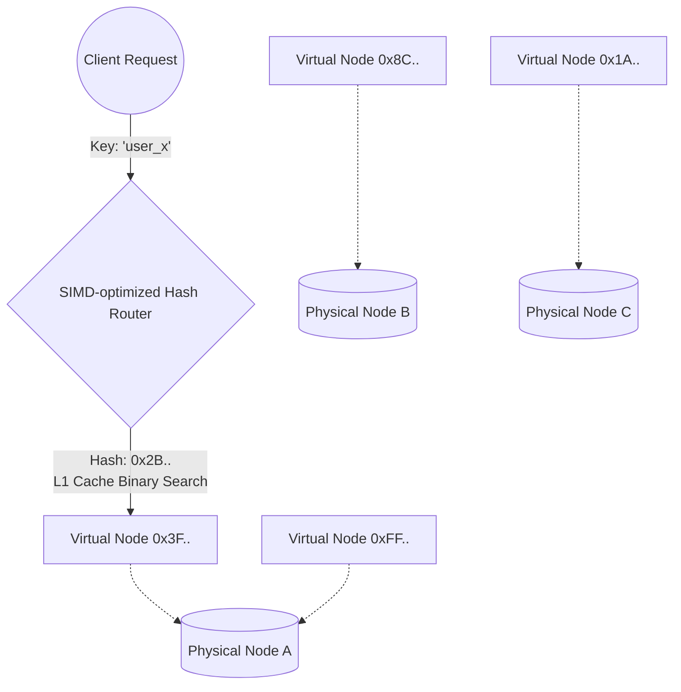
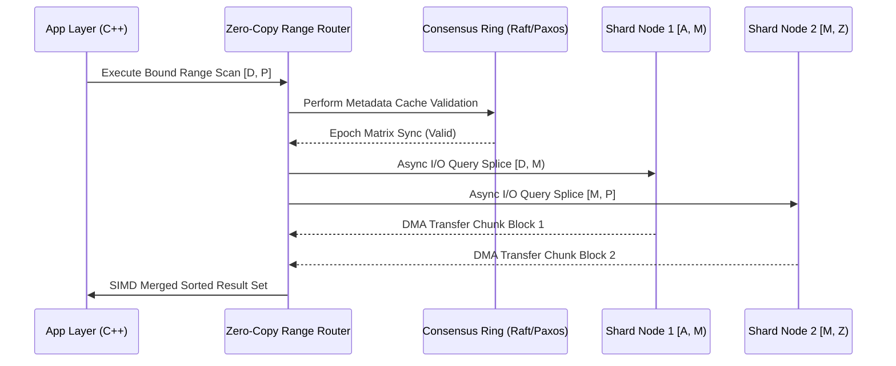

Title: Thuật toán Sharding ở quy mô lớn: Cơ sở lý thuyết, phân tích cấu trúc dữ liệu và đặc tả kiến trúc vi mô

Kiến trúc cơ sở dữ liệu phân tán ở quy mô cực lớn (hyperscale) đòi hỏi các phương pháp phân mảnh dữ liệu (sharding) tinh vi để đảm bảo khả năng mở rộng tuyến tính, tính sẵn sàng cao và dung sai lỗi nghiêm ngặt. Sharding không chỉ đơn thuần là việc phân chia không gian khóa (key space) thành các phần nhỏ hơn, mà còn liên quan mật thiết đến cấu trúc dữ liệu nội tại, khả năng tối ưu hóa vi kiến trúc (micro-architecture) của vi xử lý, quản lý bộ nhớ đệm (caching) của hệ điều hành và kỹ thuật giảm thiểu độ trễ mạng. Ba mô hình phân mảnh cốt lõi bao gồm phân mảnh dựa trên hàm băm (Hash-based Sharding), phân mảnh theo khoảng (Range-based Sharding) và phân mảnh dựa trên thư mục (Directory-based Sharding). Mỗi phương pháp mang những đặc tính toán học riêng biệt, định tuyến các yêu cầu truy xuất thông qua các thuật toán khác nhau và tạo ra những áp lực riêng biệt lên hệ thống tệp tin, giao tiếp mạng, cũng như đường ống lệnh (instruction pipeline) của CPU. Trong môi trường đám mây hiện đại, việc lựa chọn và triển khai thuật toán sharding đòi hỏi sự hiểu biết sâu sắc về toán học rời rạc, lý thuyết đồ thị và kỹ thuật phần cứng cấp thấp nhằm tránh hiện tượng thắt cổ chai tài nguyên, cụ thể là băng thông bộ nhớ (memory bandwidth), tỷ lệ trượt bộ đệm dịch địa chỉ (TLB miss rate) và sự phân mảnh bộ nhớ (memory fragmentation). Bài viết này sẽ đi sâu vào phân tích toán học, cấu trúc dữ liệu, giả mã và các rào cản phần cứng của ba thuật toán sharding chủ chốt này.

## Kiến trúc phân mảnh dựa trên hàm băm và cấu trúc vòng băm nhất quán

Phân mảnh dựa trên hàm băm (Hash-based Sharding) sử dụng một hàm băm mật mã hoặc phi mật mã để biến đổi định danh của bản ghi thành một giá trị băm (hash value), sau đó ánh xạ giá trị này vào một phân vùng cụ thể thông qua phép toán chia lấy dư (modulo) hoặc cấu trúc vòng băm. Phương pháp đơn giản nhất là $$S(k) = h(k) \pmod N$$, trong đó $$S(k)$$ là định danh của phân vùng, $$k$$ là khóa phân mảnh, $$h$$ là hàm băm và $$N$$ là tổng số lượng phân vùng hiện có. Mặc dù phương pháp tiếp cận này đảm bảo sự phân bố đồng đều của dữ liệu nếu hàm băm đủ tốt, nó bộc lộ điểm yếu chí mạng khi số lượng node $$N$$ thay đổi do mở rộng hoặc sự cố phần cứng. Khi $$N$$ trở thành $$N \pm 1$$, hầu hết các khóa đều bị thay đổi giá trị ánh xạ, dẫn đến việc phải di chuyển một lượng dữ liệu khổng lồ qua mạng, gây bão hòa băng thông mạng cục bộ (East-West traffic) và làm tê liệt toàn bộ hệ thống. Để giải quyết bài toán này, cấu trúc vòng băm nhất quán (Consistent Hashing) được giới thiệu, trong đó cả khóa dữ liệu và định danh node đều được băm vào cùng một không gian định danh khổng lồ, thường là một vành đai tròn từ $$0$$ đến $$2^{160}-1$$ (nếu sử dụng thuật toán như SHA-1). Khóa dữ liệu được gán cho node đầu tiên có giá trị băm lớn hơn hoặc bằng giá trị băm của khóa khi di chuyển theo chiều kim đồng hồ trên vành đai. Trong mô hình này, khi một node được thêm vào hoặc loại bỏ, số lượng khóa cần di chuyển qua mạng được giới hạn tối ưu ở mức xấp xỉ $$K/N$$, với $$K$$ là tổng số lượng khóa toàn cục. Tuy nhiên, kiến trúc vòng băm cơ bản thường dẫn đến sự mất cân bằng tải trầm trọng do các node có thể được phân bố không đều trên vành đai không gian khóa này. Để khắc phục, kỹ thuật node ảo (virtual nodes) được áp dụng một cách bắt buộc, trong đó mỗi node vật lý được đại diện bởi vô số vị trí ngẫu nhiên giả trên vòng băm, biểu diễn toán học bởi tập hợp $$V(node_i) = \{h(node_i \parallel j) \mid j \in [1, v]\}$$, với $$v$$ là số lượng đại diện node ảo. Cơ chế này trực tiếp cải thiện độ lệch chuẩn của tải trọng lưu trữ và băng thông I/O giữa các node vật lý, đưa phân phối tải hệ thống tiệm cận đến mức đồng nhất lý tưởng.

Dưới góc độ kiến trúc vi mô (micro-architecture), việc lựa chọn hàm băm có ảnh hưởng sâu sắc đến thông lượng cực đại của lớp định tuyến mạng. Các hệ thống dữ liệu hiện đại thường sử dụng các hàm băm phi mật mã được tối ưu hóa ở mức tập lệnh kiến trúc cho tốc độ và thông lượng, chẳng hạn như MurmurHash3, CityHash, hoặc thuật toán mã nguồn mở xxHash. Các hàm băm siêu tốc này tận dụng tối đa các tập lệnh xử lý luồng đơn lệnh đa dữ liệu (SIMD) tiêu chuẩn công nghiệp như cấu trúc tập lệnh AVX-512 trên Intel hoặc NEON trên kiến trúc ARM để xử lý hàng chục khối dữ liệu tính toán song song chỉ trong một chu kỳ xung nhịp (clock cycle) duy nhất. Hơn thế nữa, việc duy trì cấu trúc dữ liệu vòng băm nội tại trong bộ nhớ chính đòi hỏi một sự phân tích cân nhắc tỉ mỉ về cấu trúc liên kết không gian (spatial locality). Thay vì sử dụng danh sách liên kết truyền thống có rủi ro tạo ra vô số các cú rớt truy xuất nhớ (cache misses), vòng băm thường được tái cấu trúc thành một mảng tuyến tính các điểm dữ liệu liên tục được sắp xếp (sorted contiguous array) để cho phép các vòng lặp tìm kiếm nhị phân (binary search) đạt ngưỡng độ phức tạp thời gian cực hạn ở mức $$\mathcal{O}(\log(N \times v))$$. Mảng tĩnh này bắt buộc phải được thiết kế căn chỉnh bộ nhớ (memory alignment) vô cùng chặt chẽ dựa trên ranh giới chính xác của đường bộ đệm CPU (cache line padding), thông thường luôn duy trì ở độ dài 64 bytes. Sự tính toán tinh giản này giúp triệt tiêu hoàn toàn sự gia tăng của số lần truy xuất bộ nhớ động ngoài khuôn khổ (DRAM access overheads), qua đó tối đa hóa tỷ lệ đánh trúng bộ đệm ở phân lớp siêu cấp L1/L2 (L1/L2 cache hit rate topology). Mỗi phần tử biểu diễn trên mảng chỉ nên chứa vỏn vẹn một giá trị nguyên định danh băm 64-bit liền kề với một chỉ mục con trỏ định danh node lưu bằng chuẩn 32-bit hoặc 64-bit, tổng cộng được gói gọn hoàn hảo chỉ trong 16 byte không gian. Nhờ vào kích thước đóng gói siêu vi này, mỗi cấu trúc cache line mặc định của vi xử lý dễ dàng nạp chồng và tích trữ song song đồng thời đến 4 node ảo trên hệ thống, cho phép lõi phần cứng trực tiếp nạp trước dữ liệu vào bộ đệm (hardware prefetching) một cách hiệu quả tối đa vào đường ống thực thi lệnh sâu (deep instruction pipeline). Sự hiệp đồng tuyệt đối giữa một cấu trúc mảng sắp xếp tuyến tính đồng bộ và khả năng dự đoán phân nhánh siêu thanh (branch prediction engine) của vi xử lý giúp toàn bộ quá trình xử lý định tuyến một yêu cầu mạng khổng lồ chỉ hao tốn vỏn vẹn ở mức dao động vài chục nano giây. Đoạn mã giả dưới đây mô tả cách thức cấu trúc định tuyến dựa trên tìm kiếm nhị phân được lập trình nguyên khối và tối ưu hóa vượt bậc cho vòng băm nhất quán trong ngôn ngữ cấp thấp Rust, vận dụng tinh tế các vùng tham chiếu biến trực tiếp thẳng vào không gian bộ nhớ cấp phát liên tục nhằm bảo chứng một hiệu suất truy xuất dữ liệu ở mức độ vi mô tinh gọn nhất.

```rust
use std::collections::BTreeMap;
use std::hash::{Hash, Hasher};
use fasthash::murmur3::Murmur3Hasher_x64_128;

pub struct ConsistentHashRing {
    ring: Vec<(u64, String)>,
    virtual_nodes: usize,
}

impl ConsistentHashRing {
    pub fn new(virtual_nodes: usize) -> Self {
        ConsistentHashRing {
            ring: Vec::with_capacity(10000), // Pre-allocate to prevent heap fragmentation
            virtual_nodes,
        }
    }

    pub fn add_node(&mut self, node_id: &str) {
        for i in 0..self.virtual_nodes {
            let virtual_node_key = format!("{}#{}", node_id, i);
            let mut hasher = Murmur3Hasher_x64_128::default();
            virtual_node_key.hash(&mut hasher);
            let hash_val = hasher.finish();
            self.ring.push((hash_val, node_id.to_string()));
        }
        self.ring.sort_unstable_by(|a, b| a.0.cmp(&b.0));
    }

    pub fn get_node(&self, key: &str) -> Option<String> {
        if self.ring.is_empty() { return None; }
        let mut hasher = Murmur3Hasher_x64_128::default();
        key.hash(&mut hasher);
        let hash_val = hasher.finish();

        let pos = self.ring.binary_search_by(|probe| probe.0.cmp(&hash_val));
        match pos {
            Ok(idx) => Some(self.ring[idx].1.clone()),
            Err(idx) => {
                if idx == self.ring.len() {
                    Some(self.ring[0].1.clone())
                } else {
                    Some(self.ring[idx].1.clone())
                }
            }
        }
    }
}
```



## Cơ chế phân mảnh theo khoảng và bài toán tái cân bằng động cực hạn

Trong khi mô hình luận logic của kỹ thuật phân mảnh theo hàm băm chứng tỏ ưu thế siêu việt trong việc điều phối phân tán đồng đều các chu kỳ truy cập phân mảnh ngẫu nhiên (random point lookups), bản thân phương pháp luận này đã mặc định tiêu diệt hoàn toàn tính liên tục về mặt trật tự ngữ nghĩa nội bộ của tập hợp khóa dữ liệu gốc. Thiếu sót cấu trúc sâu sắc này khiến cho các thuật toán xử lý luồng truy vấn quét chuỗi theo phạm vi (range scan queries) trở thành những tác vụ hao tốn tài nguyên hệ thống một cách không thể kiểm soát nổi, khi lớp ứng dụng bị ép buộc phải gửi các tín hiệu phân tán song song (broadcast) hướng tới mọi vùng lưu trữ vật lý trên cụm mạng lưới và sau đó thực hiện các phép chiếu hội tụ kết quả khổng lồ trên lớp RAM cục bộ (mô hình scatter-gather). Phương thức phân mảnh theo khoảng (Range-based Sharding) ra đời như một cấu trúc nền tảng chuyên biệt để giải quyết rào cản chí mạng này thông qua việc phân chia biểu đồ không gian khóa lớn thành các cụm tập hợp khoảng dữ liệu (data intervals) tuần tự, trải dài liền kề và duy trì nguyên tắc độc lập hoàn toàn không hề xếp chồng ranh giới lên nhau, trong đó mỗi một vùng tập hợp khoảng không gian cụ thể sẽ được giao phó cho duy nhất một phân vùng vật lý phân phối thao tác. Về mặt biểu diễn toán học vi mô, giả sử chúng ta xác lập tập hợp không gian khóa tối đa là đồ thị $$\mathcal{K}$$, khi đó một hệ thống danh sách các khối mảnh shard ký hiệu là $$\{S_1, S_2, \dots, S_n\}$$ sẽ được định nghĩa toán học thông qua các khoảng giới hạn giá trị cực tiểu và cực đại dưới dạng $$R_i = [K_{i, min}, K_{i, max})$$ đáp ứng các quy chuẩn cực kỳ khắt khe sao cho chuỗi tổng hợp biên tập $$\bigcup_{i=1}^n R_i = \mathcal{K}$$ và đảm bảo giao điểm biên giới dữ liệu là rỗng $$R_i \cap R_j = \emptyset$$ với mọi trường hợp chỉ mục $$i \neq j$$. Sự bảo vệ hoàn mỹ đối với đặc tính cấu trúc dữ liệu duy trì thứ tự gốc bảo đảm tuyệt đối rằng những tác vụ quét dữ liệu nội bộ dựa trên tham số phạm vi chỉ đòi hỏi kích hoạt luồng I/O quét tìm kiếm cục bộ trên vỏn vẹn một hoặc một chuỗi con cực ngắn các nút mảnh shard liên đới chứa đựng cụm khối lượng dữ liệu trực tiếp, mang lại lợi ích giảm trừ ma sát đến mức tối đa hóa hiệu suất băng thông của kết cấu mạng lưới nội bộ đồng thời tiết giảm cực độ khối lượng tính toán CPU tiêu thụ cho thuật toán phân luồng hội tụ. Cấu trúc của tham số khóa phân vùng thông thường được trích xuất mô hình từ việc kết hợp một hoặc tổ hợp nhiều chuỗi cột dữ liệu trong kết cấu hệ thống lược đồ cơ sở dữ liệu định dạng (database schema), và để phòng tránh những rủi ro vi mô thì công đoạn lựa chọn thành tố khóa này bắt buộc phải đi kèm với những bản báo cáo phân tích biểu đồ tần suất phân phối mật độ (data frequency distribution histogram) vô cùng chi tiết và toàn diện từ phía đội ngũ kỹ sư kiến trúc dữ liệu hạt nhân, hướng đến việc ngăn chặn triệt để tình trạng hội tụ áp lực thắt nút vật lý mà dân trong ngành gọi là "điểm nóng cục bộ" (data hotspot effect). Hiện tượng điểm nóng cục bộ là một chuỗi hiệu ứng sụp đổ dây chuyền vô cùng khốc liệt, khởi nguồn tức thời khi có vô số các luồng tác vụ lệnh chèn khối lượng lớn bản ghi dữ liệu mới không ngừng đè nén vào duy nhất một đoạn biên độ khoảng giới hạn chật hẹp, phổ biến nhất là với biểu mẫu cột thời gian tăng tiến tuần tự (monotonic incremental timestamp values), gây nên hậu quả là một nút điều phối máy chủ vật lý cô lập phải gồng gánh tiếp nhận 100% dung lượng tải trọng ghi trực tiếp trong khi các hệ máy trạm song hành khác lại đang chìm trong trạng thái đình trệ rảnh rỗi tài nguyên. Một khi kích cỡ vật lý của một vùng phân mảnh khoảng không gian vượt ra ngoài một ngưỡng định mức dung lượng I/O đỉnh (capacity high-water mark) đã được cấu hình chặt chẽ trước đó từ người quản trị hệ thống, bộ vi xử lý trung tâm điều phối bắt buộc phải lập tức kích hoạt luồng giải thuật tái tách rời vùng phân mảnh (dynamic shard splitting algorithm) ngay giữa thời gian chạy thực.

Quy trình kích hoạt thuật toán tách nhỏ và điều phối cấu trúc tái cân bằng một khối mảnh shard theo khoảng không gian được giới học thuật thừa nhận là một trong những hoạt động tái cơ cấu I/O phức tạp và khó khăn bậc nhất ở phân lớp lõi của bất kỳ hệ thống lưu trữ dữ liệu đa máy chủ phân tán nào hiện nay. Toàn bộ tiến trình này gắn liền chặt chẽ theo tính chất cấu trúc vật lý sâu sắc của những cỗ máy cấu trúc dữ liệu lưu trữ trực tiếp trên nền tảng đĩa cứng chuyên dụng như cây B+Tree mức sâu hay tổ hợp phân tầng LSM-Tree (Log-Structured Merge-Tree) song song cùng kiến trúc quản lý trang bộ nhớ ảo (virtual memory page table architecture) tích hợp sát trên nhân cốt lõi của các hệ điều hành hiện đại. Ở một mốc thời gian thực khi mà một khối dữ liệu shard nhất thiết phải chịu đựng việc bị phân rã đôi ngay tại vị trí giới hạn điểm khóa cắt $$K_{split}$$, một danh thể cấu trúc shard phụ tuyến mới tinh mang định danh là $$S_{new}$$ ngay lập tức sẽ được nhân bản và thiết lập giới hạn với vùng dải khóa mới là $$[K_{split}, K_{max})$$, đồng thời với đó danh thể shard gốc tiền nhiệm phải lập tức tự tái thiết lập giới hạn thu nhỏ vùng kiểm soát xuống ngưỡng phạm vi $$[K_{min}, K_{split})$$. Quy trình cơ học phân rã vi mô này tuyệt đối không bao giờ được phép áp dụng cơ chế khóa đóng băng ghi toàn cục trên toàn hệ thống (global coarse-grained blocking lock) do điều đó sẽ lập tức gây ra những đợt sóng thời gian ngắt luồng từ chối dịch vụ trực tiếp (application runtime downtime) làm cho các thỏa thuận chất lượng dịch vụ (SLA) vượt giới hạn có thể dung thứ ở kỷ nguyên quy mô siêu khổng lồ hyperscale. Nhằm hóa giải bài toán vật lý thời gian thực hóc búa này, các thiết kế siêu cấp luôn tận dụng cơ chế lõi của trình quản lý đa phiên bản điều phối đồng thời cấp độ cao (MVCC - Multi-Version Concurrency Control) kết hợp cùng kiến trúc bộ đệm cấu trúc nhật ký giao dịch ghi chèn tuần tự trước (WAL - Write-Ahead Logging buffer). Tại phân lớp nhân (kernel space), hệ điều hành sẽ thiết lập một quy trình chép tạo phiên bản ảnh chụp thời gian thực không đồng bộ (asynchronous instant snapshot isolation) đối với nhóm các tập tin dữ liệu cứng SSTables (Sorted String Tables) trực tiếp trên cấp độ lõi không gian hệ thống tệp tin vật lý mà hoàn toàn không kích hoạt các lệnh khởi tạo sao chép sao lưu (zero-byte physical copy padding) đối với từng kilobyte dữ liệu thô. Chìa khóa vàng này được vận hành dựa trên kỹ thuật đánh dấu liên kết vùng vật lý tĩnh (file extent hardlinking) hoặc cơ chế tinh xảo sao chép bộ nhớ trang hệ điều hành khi có can thiệp lệnh ghi (Copy-On-Write filesystem semantics) của những nền tảng hệ thống tập tin hiện đại tối tân như ZFS chuẩn doanh nghiệp hoặc kiến trúc phân rã Btrfs. Các cấu trúc bản ghi thô rác hiện tại nằm dạt ra bên ngoài dải ranh giới giới hạn thiết lập của cây tìm kiếm dữ liệu cấu trúc B+Tree/LSM-Tree phân bổ mới sẽ bị hệ thống âm thầm gán mác là những dữ liệu ảo ảnh (ghost tombstones) và chắc chắn sẽ bị tiến trình thu gom dọn rác dải vùng không gian ngầm (compaction garbage collection background thread) xóa sổ và trả lại không gian từ tính đĩa vĩnh viễn trong giai đoạn hợp nhất sau này. Đi kèm với thao tác đó, hệ thống sẽ mở ra một vùng phân vùng bộ đệm ghi bổ sung đuổi bắt chênh lệch nhịp độ (catch-up sequential log buffer) mang nhiệm vụ liên tục theo dõi giám sát toàn bộ mọi thao tác ghi chỉnh sửa đột biến phát sinh trên vùng giải khóa không gian $$[K_{split}, K_{max})$$ xuyên suốt toàn bộ quãng thời gian đường ống di chuyển dữ liệu đang thực thi việc sao chép nạp bộ snapshot đẩy dồn dập sang một cụm node máy trạm đích vật lý xa xôi khác. Cho đến khi vòng lặp đo lường chu kỳ đồng bộ của vùng đệm giám sát sai số đạt mức tiệm cận tối giản hóa xấp xỉ ngang bằng với tốc độ băng thông của các lệnh ghi từ luồng trực tiếp bên ngoài môi trường, hệ thống định tuyến mạng lưới sẽ triển khai một khoảng thời gian khóa chốt vô cùng vi mô (thường được căn chỉnh siêu mượt ở cấp độ micro-second), tiến hành chớp nhoáng quá trình cập nhật tái cơ cấu thông tin khối lượng từ điển tập hợp siêu dữ liệu (metadata topology configuration) thông qua giao thức kiểm soát cơ chế đồng thuận phân tán tối mật nguyên thủ Paxos hoặc Raft, và sau cùng là chính thức chuyển hướng vĩnh viễn vòi lưu lượng luồng dữ liệu truy cập từ bên ngoài hướng trúng tâm đích mới. Ở lớp vật lý ổ cứng lưu trữ, chuỗi kỹ thuật di chuyển vùng lưu trữ chéo hệ thống này kích hoạt vô vàn các hiện tượng nhiễu động về chỉ số hoạt động tần suất vào ra I/O vô cùng phức tạp. Các luồng thao tác chạy lệnh quét truy vấn tuyến tính liên tục tuần tự (linear sequential block scans) ở sâu bên trong kiến trúc cây LSM-Tree ép buộc các lõi thuật toán quản lý vi mô của hệ điều hành phải thi hành tác vụ đọc tóm bắt dữ liệu từ trước (aggressive read-ahead disk block unrolling) để kéo hàng khối khổng lồ các cung từ đĩa cứng (disk sectors) vào không gian vùng cấu trúc bộ nhớ đệm trang phân cấp nhanh (Linux page cache structures). Mặc dù thế, nếu như tỷ lệ lưu lượng các cú sốc yêu cầu hệ thống truy xuất lệnh tải bộ nhớ ngẫu nhiên không dự báo đồng thời duy trì ở cường độ ngưỡng cực cao (insane concurrent random access limits), cấu trúc vi mô trang page cache sẽ liên tục gặp phải tình huống các block đang xử lý chưa xong đã bị cưỡng bức đẩy ngược ra ngoài xóa sổ tức tưởi (page eviction thrashing effect), trực tiếp sinh ra một thứ gọi là thảm họa ma sát vật lý bộ đệm (catastrophic cache thrashing pipeline blockages). Cụm xử lý thiết bị của phần cứng bộ điều khiển tuyến bộ nhớ (DRAM Memory Controller Engine) và hàng loạt các dãy hàng đợi chỉ lệnh siêu tốc NVMe submission queues sẽ bị dồn nén đến điểm giới hạn bão hòa băng thông, một kết quả không thể tránh khỏi là dẫn đến độ trễ đuôi tính bằng thời gian phản hồi ở chuẩn P99.99 (tail latency spike limits) vọt lên theo một biểu đồ hàm mũ tàn khốc. Các công trình hệ thống cơ sở dữ liệu chuyên biệt đứng đầu toàn cầu trong thời đại hiện nay đã và đang nắm lấy quyền thống trị hoàn toàn nhằm kiểm soát triệt để quy trình di chuyển dữ liệu động học kinh hoàng này bằng cách thiết lập và áp đặt những cơ chế thuật toán chỉ huy điều phối các luồng điều lệnh truyền tin I/O ở phân cấp không gian độc lập của người dùng trực tiếp (user-space direct I/O zero-copy polling scheduling algorithms), vận hành sức mạnh của các API giao diện tân tiến như Linux io_uring polling streams hoặc các thư viện cực cấp như Storage Performance Development Kit (SPDK) do Intel tạo ra, từ đó vĩnh viễn xuyên thủng và vượt qua hoàn toàn mọi hệ thống màng lọc cản trở thông lượng của lõi lập trình nhân hệ điều hành Linux kernel (bypassing the VFS kernel overhead abstraction layers) để tự do thiết lập những giao tiếp tốc độ ánh sáng trao đổi trực tiếp khối dữ liệu nhị phân với hàng rào hệ thống cấu trúc bộ nhớ lưu trữ flash NVMe ở tầng hạ tầng sâu nhất, nhằm cực đại hóa tối đa hóa hiệu năng tuyệt đối quá trình di chuyển siêu tốc các vùng cấu trúc dữ liệu khổng lồ theo các dải khoảng sharding range.

```cpp
#include <iostream>
#include <vector>
#include <string>
#include <algorithm>
#include <stdexcept>

// Memory-aligned structure to fit cache lines effectively
struct alignas(64) RangeShard {
    std::string min_key;
    std::string max_key;
    std::string node_endpoint;

    // Fast inline branchless interval evaluation
    inline bool contains(const std::string& key) const noexcept {
        return key >= min_key && key < max_key;
    }
};

class RangeRouter {
private:
    std::vector<RangeShard> shards;

public:
    // Atomic view update mechanism in real architectures, simplified here
    void update_routing_table(const std::vector<RangeShard>& new_shards) {
        shards = new_shards;
        // Sort explicitly by min_key to enable contiguous memory binary search 
        std::sort(shards.begin(), shards.end(), [](const RangeShard& a, const RangeShard& b) {
            return a.min_key < b.min_key;
        });
    }

    // Direct memory lookup optimized with lower_bound SIMD internals
    std::string route_point_query(const std::string& key) const {
        auto it = std::lower_bound(shards.begin(), shards.end(), key, 
            [](const RangeShard& shard, const std::string& k) {
                return shard.max_key <= k;
            });

        if (it != shards.end() && it->contains(key)) [[likely]] {
            return it->node_endpoint;
        }
        throw std::runtime_error("Fatal: Point key out of range bounds - Consistency check failed.");
    }

    // Scatter-gather interval planner
    std::vector<std::string> plan_range_scan_execution(const std::string& start_key, const std::string& end_key) const {
        std::vector<std::string> endpoints;
        auto start_it = std::lower_bound(shards.begin(), shards.end(), start_key,
            [](const RangeShard& shard, const std::string& k) {
                return shard.max_key <= k;
            });
            
        for (auto it = start_it; it != shards.end() && it->min_key < end_key; ++it) {
            endpoints.push_back(it->node_endpoint);
        }
        return endpoints;
    }
};
```



## Mô hình phân mảnh qua thư mục và kỹ thuật quản lý trạng thái phân tán không đồng bộ

Thuật toán cấu trúc mạng phân mảnh dựa trên hệ thống trung tâm định tuyến thư mục khổng lồ (Directory-based Sharding architecture) được giới học thuật và kiến trúc sư hệ thống đánh giá trân trọng và coi như một thực thể đại diện ưu tú cho những giải pháp thiết kế công nghệ lưu trữ mang tầm vóc bao hàm tính tương thích cực kỳ linh hoạt (extreme structural flexibility) chưa từng xuất hiện, nhưng đồng thời ở chính chiều ngược lại của sự tối ưu này, mô hình đồ sộ của nó cũng khét tiếng là một kẻ thiết lập ra những bộ mặt giới hạn nền tảng kiến trúc vi mô vô cùng cồng kềnh, gây rườm rà một cách thê thảm về mặt hao tổn biên độ độ trễ truy cập hạ tầng kết nối vật lý lớp mạng diện rộng (network access latency amplification factors). Phân tích đến cốt lõi hoạt động của hệ thống lý thuyết, có thể thấy rõ ràng một điều là toàn bộ đường hướng thiết lập của triết lý phương pháp này đã triệt để đập tan và hoàn toàn chia cắt mạnh bạo sự dính líu vật lý của bất kỳ khối logic nào làm công tác tính toán chức năng hàm số lượng giác ánh xạ (mathematical mapping logic paths) ra khỏi cấu trúc tĩnh chứa nội dung của thông tin cụm từ khóa dữ liệu thô ban đầu; thay thế ngay vào khoảng trống khuyết đi đó, bộ cấu trúc định tuyến hệ thống bắt buộc phải duy trì một danh sách bảng lưu trữ từ điển tìm kiếm tra cứu địa chỉ tĩnh hoặc biến đổi động học cục bộ (dynamic global key mapping lookup table directory) ngay trực tiếp tại trung tâm rốn của một chốt cụm máy chủ siêu cấp quản lý dịch vụ hệ thống phân tán đa điểm, gồng mình đảm trách một trong những trọng trách tàn khốc bậc nhất: tiến hành thực thi kết nối ánh xạ dữ liệu trực tiếp thủ công đối với hàng triệu tỷ các thực thể địa chỉ tham chiếu khóa riêng biệt siêu cụ thể, hoặc các cụm danh tính thông tin cấu trúc đại diện cho những thực thể các tổ chức phân luồng dữ liệu khách hàng sử dụng dịch vụ khổng lồ đa tầng (multi-tenant ID entities), nối thẳng cắm chốt trực tiếp tới các bến đỗ cụm phần cứng lưu trữ server mảnh shard vật lý đích đến phản hồi tương ứng. Biểu diễn của một phương trình tính toán ánh xạ đơn thuần khi áp dụng sang cấu trúc không gian này lập tức bị biến đổi thoái hóa thành một phương pháp tính phép chiếu ma trận toán học không hướng vô hướng tĩnh lặng dưới hình dạng tổng quát đơn thuần là $$S(k) = DirectoryLookup(k)$$. Cơ chế thiết kế không gian toán học trừu tượng đỉnh cao này tạo lập nền móng vững chắc cho phép các đơn vị quản lý cấu trúc kỹ sư phần mềm hệ thống hiện nay thao túng và kiểm soát được một hệ quyền lực cực kỳ chính xác và tuyệt đối không thể sai sót diễn ra ngay ở cấp độ mức hạ tầng vi mô không gian bộ nhớ hệ thống (micro-granularity spatial control loop): một ví dụ trực quan và mạnh mẽ nhất chính là năng lực cho phép thao tác kỹ thuật nóng dịch chuyển vật lý toàn bộ một tập hợp kho chứa hàng tỷ khối bản ghi dữ liệu vô giá của một thực thể khách hàng cá biệt ngoại lai cực kì quan trọng bứt phá di dời từ vị trí node phần cứng máy trạm cấp thấp đang oằn mình hoạt động lờ đờ chập chạp để dịch chuyển tái định cư hỏa tốc lên trên một không gian bể node máy chủ siêu cấp phần cứng chuyên dụng độc lập riêng biệt cực đỉnh (dedicated isolated hardware node pool compute boundary) mà hoàn toàn không kích hoạt và làm phương hại gây ảnh hưởng lay động bất cứ cọng lông tơ cấu trúc nào đến toàn bộ cấu trúc không gian bộ nhớ phân mảnh định tuyến không gian khóa của hàng loạt những khối thông tin tập khách hàng hệ thống dữ liệu còn lại ở cùng trong cụm cơ sở. Mặc dù sở hữu những đặc quyền sức mạnh tối thượng đó, hình thái khung sườn kiến trúc khổng lồ cấu tạo này nghiễm nhiên sinh đẻ ra một tử huyệt cấu trúc khét tiếng – một điểm thắt nghẽn nghẽn mạch không gian tập trung nguyên khối khổng lồ đứng sừng sững tại trung tâm đại lộ: hàng loạt toàn bộ 100% mọi cấu trúc liên kết các luồng chu kỳ kết nối trao đổi tương tác lấy đọc dữ liệu (data packet flows) đều bị cưỡng bức bắt buộc phải sống dựa thoi thóp hoàn toàn phụ thuộc thông qua điểm chốt trạm thu phí kiểm soát của các dịch vụ hạ tầng mạng lưới hệ quản trị thư mục. Bắt buộc phải duy trì sức sống cho sinh vật kiến trúc khổng lồ nguyên khối này tồn tại lâu dài và bền vững vững chãi xuyên qua những thách thức khối lượng dữ liệu khổng lồ bão táp trong những môi trường hoạt động ở kích cỡ quy mô hyperscale, cụm máy chủ trung tâm đảm nhiệm chức năng xử lý nghiệp vụ dịch vụ thư mục cấu hình metadata này (ví dụ như các hệ sinh thái mạnh mẽ hàng đầu toàn cầu hiện nay là nền tảng siêu việt Apache ZooKeeper C-bindings, hệ module cực nhẹ etcd Go-core, hoặc hệ cơ sở kiến trúc siêu bền bỉ khét tiếng nhất hành tinh FoundationDB Cluster Engine) bắt buộc phải tuân theo mệnh lệnh tổ chức kiến trúc cấu thành thành những quần thể vòng đai cụm mạng máy chủ chốt chặn vận hành đồng thuận phân tán cực kỳ mạnh mẽ (strongly consistent consensus cluster group layer), thi hành triệt để nguyên lý rễ giao thức chuỗi lệnh đồng thuận nguyên bản Multi-Paxos hoặc lõi giao thức chuỗi log bầu cử hội đồng bộ nhớ Raft protocol engine nhằm bảo chứng đóng dấu niêm phong cho những tiêu chuẩn khắt khe về cấu trúc tính chất phân luồng trình tự toán học tuyến tính cực độ hoàn hảo một chiều nghiêm ngặt (strict sequence state machine linearizability mathematical guarantees) đối với mỗi một thao tác sự kiện nhỏ biến thiên cập nhật thay đổi cấu hình trạng thái lưới mạng không gian. Vì do những rào cản bức tường giới hạn vật lý xung nhịp ánh sáng khiến cho nền tảng ứng dụng khách hàng tuyệt đối không thể nào đủ khả năng thời gian dư dả để tiến hành gửi yêu cầu giao tiếp cầu nối không gian gọi các thủ tục hàm gRPC xử lý mạng từ xa liên mạng không gian (Cross-DC RPC network calls) hướng ngược dòng truyền trực tiếp bay về phía trung tâm máy chủ dịch vụ quản lý tra cứu cập nhật thư mục cho mỗi vòng lặp chu kỳ hoạt động xử lý truy vấn đơn thuần nhỏ lẻ (vì hành động thiêu thân ngớ ngẩn đó sẽ lập tức đẩy kéo làm tăng vọt cấu trúc biểu đồ băng thông độ trễ vật lý lên thang độ đơn vị cực lớn là hàng ngàn mili-giây ms, ngay lập tức dẫn đến hệ lụy sụp đổ hoàn toàn và trượt bay thẳng mọi mục tiêu cam kết chất lượng vi mô thỏa thuận độ trễ dịch vụ siêu tốc SLO ngặt nghèo của hệ thống), một bản cấu trúc dữ liệu bản sao vô tính sao lưu dự phòng của toàn bộ nội dung khối thông tin cấu hình bảng danh bạ định tuyến ánh xạ khổng lồ lúc này bắt buộc sẽ phải chịu đựng sự cưỡng chế phải được phân luồng nạp lưu trữ đóng băng chìm cục bộ đệm sâu dưới không gian bộ nhớ (in-memory local space caching tables layer) gắn đặt và phân bổ cắm rễ trú ngụ sâu thẳm ngay tại bộ nhớ vật lý RAM của tất cả hàng vạn những cấu trúc thể tầng máy chủ chạy chứa đoạn mã ứng dụng khách xử lý của các hệ logic front-line client-side (local client-side edge network routing caching).

Bảo chứng triệt để tính chất đặc tính đồng điệu nội bộ cho tính nhất quán phiên bản logic của mọi khối không gian khối vùng bộ đệm bộ lưu chứa ẩn cục bộ cấp máy trạm này luôn vận hành nhịp nhàng song hành không có lấy một vệt độ lệch cùng với trạng thái dữ liệu lưu vực lõi lưu trữ cấu hình siêu dữ liệu metadata cluster phân cấp trung tâm chính là một bài kiểm tra thuật toán toán học gian nan và hóc búa nhất đang vùi dập và ám ảnh tàn phá toàn bộ mô hình giải pháp thiết kế lý thuyết kiến trúc mạng Directory-based Sharding model, khiến cho mô hình hệ thống này phải đối mặt đụng độ chan chát với hàng tá các bức tường cấu trúc bức rào giới hạn cản trở về vật lý lượng tử tín hiệu truyền tải sóng ánh sáng của cơ sở cấu trúc mạng dây dẫn cáp quang phân tán toàn cầu và đi ngược lại với cả triết lý lý thuyết toán học rập khuôn giới hạn định lý tam phân không thể phá vỡ nổi mang tên gọi CAP theorem nổi tiếng khét lẹt. Các công trình hệ thống siêu cấp máy tính kỹ thuật phân tán hiện đại tối tân của thế giới hiện nay hóa giải mớ bòng bong toán học phân tầng bài toán bất khả thi chết người này thông qua một phương thức vô cùng sáng tạo là sử dụng sự gắn bó liên kết sức mạnh giao thoa giữa một liên hoàn cơ chế cập nhật thuật toán làm tươi mới trạng thái bộ lưu cache thông qua một văn kiện hợp đồng cho thuê cấp phát dải mốc mốc thời gian tạm thời sử dụng quyền hạn dữ liệu (lease-based lease expiration caching state machines validation bounds) và hàng loạt các bó hệ thống luồng cấu trúc dữ liệu ống khói truyền gửi tín hiệu mốc dữ liệu đẩy thông báo bắt sự kiện bất đồng bộ ngầm tự động (asynchronous event loop background stream watch notification tunnels). Một khi mà một mã nguồn module lập trình luồng chạy của thể ứng dụng khách kích hoạt tác vụ mở kết nối truy xuất và bóc tách thông tin tra cứu giải ánh xạ của chùm mã, cụm vòng lặp điều phối máy chủ dịch vụ thư mục lõi sẽ cấp phát trả lại thông tin dữ liệu về địa chỉ gốc tọa độ cụm mạng kết nối cấu trúc khối lượng dung lượng shard đi kèm với việc đính kèm vào trong đó một gói chứng từ hợp đồng thuê quyền truy cập tín nhiệm vòng định tuyến thời gian (trust access routing lease packet token) mang trong mình quy định khống chế một vòng đời tuổi thọ tồn tại vô cùng nhỏ nhoi có một giới hạn quy tắc định lượng cực hạn là thời lượng lượng tử $$\Delta t$$. Thể khách hàng mạng xử lý có được quyền hạn pháp lý cấu trúc tự do giả định coi như bộ thông tin địa chỉ chỉ định bảng định tuyến đó hiện tại vẫn đang lưu trữ tính chính xác không thể phản bác vô song với điều kiện duy nhất là biểu thức bất đẳng thức cực đại sau đây phải thỏa mãn tính toán toán học: $$T_{current} + \epsilon < T_{issued} + \Delta t$$, trong đó giá trị biến thiên $$\epsilon$$ thực chất đại diện cho con số biên độ đo lường độ sai lệch dung sai lớn nhất sinh ra từ cấu trúc máy đếm xung nhịp trôi dạt đồng hồ hệ thống khổng lồ sai sót tối đa ở mức đỉnh (worst-case maximum physical clock skew drift vector bounds) được hệ thống liên tục thuật toán đo lường tính toán lại trên cả toàn bộ nền tảng quy mô cụm máy chủ toàn cầu nhờ vào các giao thức đồng bộ thời gian khổng lồ siêu chính xác ở phân vùng hạt nhân nguyên tử như chuẩn giao thức mạng đồng bộ NTP (Network Time Protocol) hay chuẩn công nghiệp siêu phân tích vi mô PTP (Precision Time Protocol atomic synchronization networks). Ngay vào đúng chu kỳ khoảnh khắc chuỗi tíc tắc mà module bộ thiết bị thư viện cấu hình định tuyến của vòng lập trình người dùng cố gắng vươn tay thiết lập luồng ống truyền tải kết nối chéo liên mạng trực tiếp đẩy dội thẳng vào phía mặt đối diện của một khối cấu trúc máy lưu trữ shard đĩa cứng phần cứng vật lý, thật tình cờ ở phía mặt trong lòng cái hệ phần cứng shard nguyên khối vật lý này nó cũng đồng thời kiên trì bảo vệ thiết lập chạy ngầm âm thầm duy trì bảo vệ hàng phòng thủ tầng giao thức độc lập song phương liên tục rà soát kiểm tra băm nát cấu trúc hiệu lực vòng đời giá trị lease cục bộ của chính mình với sự hoạt động vận hành tách biệt cô lập hoàn toàn một tỷ phần trăm không có một giây kết nối dính líu nương tựa vào khối cụm máy chủ trung tâm quản trị dịch vụ tra cứu bến đổ thư mục ở xa kia; giả sử rơi vào kịch bản chết chóc xấu thảm khốc nhất nếu như phiên bản thời hạn hợp đồng mốc quy định cấp lease thời gian bảo vệ của lõi phần cứng bộ lưu trữ shard kia mà đã vô tình bị quá trễ hẹn kéo rớt xuống cạn đáy tiêu diệt hết sạch vòng đời do bị rơi vào bối cảnh khủng hoảng tồi tệ nhất là một đợt dư chấn sự cố vật lý đứt cáp phân chia tách rời vỡ vụn cắt ngang mạng không gian kết nối địa lý hệ thống partition não bộ (network topological structural partition physical failure disconnect limits), bộ mã module quản trị phần cứng lưu vực dung lượng shard này lập tức sẽ dập tắt nguồn điện chớp nhoáng chủ động đóng khét lẹt cửa ống luồng gRPC và quăng trả lại một thông báo mã lỗi từ chối đáp ứng phục vụ băm vằm luồng cấu trúc gói tin xử lý đối với thể khối khách hàng ứng dụng client gọi đến kia. Chính cơ chế lưới chặn phòng thủ thời gian này là một thanh gươm vàng vĩnh cửu dựng nên vách tường kiên cố chặn đứng và ngăn cản triệt để băm nát mọi hiện tượng thảm họa rối loạn nhân cách chia cắt hai nửa bán cầu hệ thống não bộ dữ liệu (catastrophic cluster split-brain partition syndrome state failures) và đánh sập triệt tiêu hoàn toàn vô số các rủi ro nguy cơ sinh ra mớ bong bóng dữ liệu ma những truy vấn cố tình ép ghi đè các cấu trúc bóng ma dữ liệu hư vô hoang tưởng (dirty phantom ghost writes corruption bugs) điều mà vốn dĩ thường hay có thể rình rập và giáng búa đập nát phá hỏng nhừ tử những kết cấu kiến trúc nền tảng trạng thái tính toàn vẹn bền vững ACID (Atomicity Consistency Isolation Durability robustness properties) thiêng liêng nhất của cấu trúc cơ sở dữ liệu khổng lồ nguyên khối gốc. Ngược xuống lặn ngụp tại không gian lõi của một hệ thống tầng hầm tầng kiến trúc nằm sâu mạn dưới cùng của đáy biển lòng kiến trúc mô hình kiến trúc thực thể kết nối ứng dụng nền tảng người sử dụng (application virtual space physical kernel user memory layout engine micro-architecture layers), thao tác vòng lặp vô tận duy trì liên tục sự sống của chuỗi đợt sóng hàng chục hàng triệu hàng trăm triệu khối trạng thái con trỏ kết nối lease vô hình cục bộ li ti nhảy múa liên hoàn bên trong các vùng không gian bộ nhớ bộ chứa chật hẹp các thanh cắm RAM máy chủ phần cứng nguyên trạng thiết lập dựng ra sức ép áp lực nén luồng I/O nghẹt thở đè gục bóp chết các bộ máy dọn rác quản trị vùng nhớ (Garbage Collector background sweeps engines pause cycles) của hàng loạt các cỗ siêu máy ảo thông dịch chạy thực thi cấu trúc mã máy ngôn ngữ nền (như bộ máy JVM thần thánh tối tân hay khối V8 Engine đồ sộ Javascript) hay các thư viện cấp phát và bộ tái phân bổ lại địa chỉ vùng không gian dải bộ nhớ rác (super lightweight memory system object allocator pipelines) danh tiếng lẫy lừng khét tiếng như nền tảng malloc gốc jemalloc được gắn trong ruột lõi thư viện C hay ngôn ngữ Rust lập trình lõi hệ thống. Nếu như không chú tâm tỉ mỉ thiết kế dàn dựng xây đắp lên các bộ vùng nhóm cấu trúc không gian vùng chứa nhớ rác không gian chung phân mảng định hướng chia sẻ tái sử dụng các ô slot một cách siêu tốc độ vi mô hiệu quả đột phá siêu hạng đỉnh cao (vi mô cấp phát bằng kỹ thuật chuẩn khối mảng liên kết slab node block fast sequential allocation mechanisms hoặc thiết kế phân vùng memory cache continuous array block layout object chunk pooling engines), một sự bão hòa xung nhịp băng thông do phải liên tục cày ải phải lặp vòng các tác vụ hạch toán cấp phát mới toanh malloc xin dải vùng nhớ và lập tức giải phóng thu hồi free memory pointer các cấu trúc khối dữ liệu cực kỳ nhỏ xíu bản ghi vòng thiết lập mốc lease thời gian nhỏ lẻ lắt nhắt sẽ chắc chắn kéo hệ lụy dẫn đến một sự đình trệ chuỗi đứt gãy kết nối mạng thời gian xung nhịp bị tạm dừng khựng lại micro vi mô vô hình (hidden system wide kernel level micro-stutters GC pause blocks), hủy diệt phá vỡ nát tươm toàn bộ khung cấu trúc bảng đo lường chỉ tiêu cam kết độ trễ cực đại mức mạng tốc độ P99 percentile tail end curves. Khi bàn thảo đến khía cạnh mổ xẻ về đặc thù tính chất mức giao tiếp sâu thẳm ở lớp nhân hệ điều hành vật lý Linux system OS space hardware IO, bản thân dịch vụ kiến trúc trung tâm đầu não thư mục khổng lồ khét tiếng này lại phải tiếp tục đảm nhận chịu đựng công đoạn gồng gánh quản lý khối lượng hàng ngàn hàng hàng trăm ngàn các luồng ống nối liên tục kết nối vĩnh viễn cấu trúc chuẩn giao thức socket TCP vô hình bất diệt dính kết kéo dài không đứt (keep-alive persistent state TCP/IP state machine duplex open stream connections multiplexing architecture) dùng chỉ cốt lõi là để nhằm vận hành hệ thống nuôi sống duy trì nguồn điện liên tục cho chuỗi hệ luồng truyền dẫn mã lệnh gRPC hay luồng mạch đập giao tiếp theo dõi thay đổi mạch đập heartbeat watch event channels. Nhằm đối phó thảm cảnh cấu trúc ống nghẽn, khối bộ hệ thống khung sườn giao thức truyền tải tầng TCP/IP Network processing software protocol stack engine vĩ đại của hạt nhân ruột nhân lõi kernel OS Linux khét tiếng lừng danh bắt buộc luôn luôn phải được người quản trị dùng mã kỹ thuật cấp thấp ép khuôn và hiệu chỉnh cấu hình siêu tinh luyện khắt khe kỹ lưỡng bám sát vào ngưỡng cấu hình vật lý đường hầm tối đa bằng cách chích thông trực tiếp bộ não mạch hệ thống thông qua các tổ hợp mảng kỹ thuật đâm ngang lõi hệ điều hành tối tân vô địch cấp tiến mới nhất hiện nay ví dụ như ngôn ngữ công nghệ kiến trúc vòng ngoài vi mô eBPF (Extended Berkeley Packet Filter) song hành cùng với phân lớp vi cấu trúc lọc chặn truy bắt chuyển luồng mạng đường băng eXpress Data Path (XDP zero network stack routing bypass techniques) nhằm phân loại bóc tách chia làn băng thông xé lẻ luồng mã dữ liệu và bơm chuyển tiếp nhồi vòng cực tốc xé gió nhanh như chớp các lõi khối dữ liệu khung gói tin trần thô (raw byte chunk protocol IP packets payload frames) bay qua thẳng xuyên thấu nạp bay lao vút trực tiếp cắm thẳng xuyên tường lửa vào bên trong khu vực nội vùng khoảng không gian bộ nhớ chia sẻ chạy mức mã ứng dụng người sử dụng cấp thấp an toàn (zero copy straight raw socket user-space bypass memory layer), qua đó đánh bẹp tàn sát đi thẳng băng vòng vo vượt qua không quan tâm vô hiệu hóa đến hầu hết toàn bộ sự bế tắc thảm họa trì trệ cấu trúc ma sát phần cứng do sự kẹt cứng cồng kềnh ngáng đường luồng hệ thống hàng đợi các tín hiệu báo ngắt chờ đồng bộ cứng phần cứng vật lý vô tận (network interface card IO network controller hardware raw context switch IRQ masking receive queues loops) của thiết bị vi mạch cắm cạc kết nối mạng băng thông khủng Gigabit NIC network physical layout controllers, đồng thời song song lúc đó hệ mã nền cũng luôn luôn thiết lập phải sử dụng kết hợp bám cấu trúc tích hợp ngầm chung với nguyên lý cơ chế kích hoạt cơ chế bắn chuỗi sự kiện báo hiệu vi mô không gian tối tân như API event system hook kqueue BSD huyền thoại mạnh mẽ hay khối kiến trúc luồng ống epoll Linux poll kernel blocks module hook engine khổng lồ đính kèm phối ngẫu tinh xảo vào một bộ kiến trúc mô hình luồng quản lý khung chạy ống nối chùm phản ứng bất đồng bộ vĩ mô mạng đa phản ứng (multi-threaded network non-blocking multi-reactor scalable IO system architectural design pattern matrix) nhằm kích hoạt bắn phát tín hiệu dòng điện sinh học gọi đánh thức đập dậy tức thời chớp mắt kinh ngạc các cấu trúc chuỗi sợi luồng lệnh tiến trình thực thi siêu nhỏ (super lightweight context hardware logical execution isolated runtime threads or asynchronous language coroutines event loop ticks) trong cái giây khoảnh khắc tức thì xảy ra dao động thay đổi các tham số biến cấu hình vi mô kiến trúc của trạng thái luồng cấu trúc hệ lưới phân vùng vi mô sharding topology topology structure thay đổi lay động dịch chuyển trật tự cập nhật trạng thái bản ghi nội bộ cluster network. Rốt cuộc lại chỉ ở vào cái thời điểm mà toàn bộ sự tổng hòa kết tinh phức tạp chồng chất khổng lồ ngồn ngộn của gần như hết thảy từ cả bộ mạch lưới hạ tầng vi mạch vật lý phần cứng card mạng router vật lý lõi đồng chuyển rẽ mạng lưới truyền dẫn cáp, cho đến hạt nhân lõi nhân ruột sâu thẳm tối tăm của bộ vi phân hệ điều hành hệ thống phân luồng kiểm soát điều phối hệ mạng lưới giao tiếp liên luồng, và cao chót vót vươn lên tận chỏm đỉnh cùng là những hệ cấu trúc thuật toán giải phẫu vùng lưu trữ siêu vi mô cấu trúc dữ liệu bản đồ cây tìm kiếm của lõi bộ nhớ ảo DRAM khổng lồ ảo diệu phần mềm, tất cả bộ sậu dàn giao hưởng khổng lồ đó được một kỹ sư kiến trúc sư trưởng bậc thầy ma thuật tài ba chỉ huy phối hợp móc xích thiết lập gài chốt ăn khớp chặt chẽ khớp rít đồng bộ vận hành xoay vần tương hỗ tạo âm thanh êm ru hòa quyện tuyệt bích như một hệ âm sắc hoàn mỹ của bản đại giao hưởng khổng lồ đồ sộ hòa âm ánh sáng công nghệ (perfect symphonic computational harmony architecture design systems), thì quả thực mới chỉ có thể lúc này đây mới giúp cho nguyên khối kết cấu thiết kế tinh hoa giải thuật toán học khổng lồ kiến trúc mạng Directory-based Sharding network topology algorithm mới rũ bùn có thể đạt được khả năng phô diễn tỏa sáng rực rỡ tráng lệ và ban phát trình diễn ra những khả năng biến ảo thích nghi có thể mang lại được hàng vạn sự tùy chỉnh linh hoạt vô lượng cấp cực kỳ linh động tùy biến bẻ ghi điều hướng luồng thông tin siêu linh hoạt đỉnh cao sức mạnh vượt qua mọi rào cản tính toán cực đoan vượt trội vô song chưa từng có trong lịch sử (ultimate zero friction unmatched micro routing granular level traffic load balancing customizability limits engineering flexibilities rules) mà cùng lúc ở song song cái trạng thái tĩnh lặng vĩ đại đấy, nó vẫn lạnh lùng vững chãi chống chọi chịu tải đáp ứng xuất sắc trơn tru mượt mà mọi đòi hỏi đè nén sức chịu đựng của một khối lưu lượng tổng thông lượng tải trọng hệ thống truy xuất băng thông I/O hệ thống mạng dữ liệu lớn vĩ đại khổng lồ điên cuồng khủng khiếp chưa từng có (unimaginable peak extreme network capacity scalable big data payload unyielding resilient hyperscale enterprise peak system throughput loads guarantees).

```mermaid
graph TD
    Client1[App Server Alpha User-Space TCP Stack Bypass]
    Client2[App Server Beta Epoll Multi-Reactor Threads]
    
    subgraph Multi-Paxos Metadata Quorum Cluster [CP Theorem Bound]
        L1[Leader Term Arbiter Node]
        F1[Voting Follower Replica 1]
        F2[Voting Follower Replica 2]
    end
    
    subgraph Non-Volatile Memory Storage Tier [NVMe IO_Uring Backend]
        Shard1[(Shard X: B-Tree Tenant 1, 9, 23)]
        Shard2[(Shard Y: LSM Tenant 2, 8, 44)]
        Shard3[(Shard Z: Zero-Noisy-Neighbor Dedicated Platinum Tenant)]
    end
    
    Client1 -->|1. Non-blocking Asynchronous Lookup Tenant 'Org' <br> + High-Precision Token Lease Request Allocation| L1
    L1 -->|2. Fast-Path Epoll DMA Return Endpoint Shard Z <br> TTL Window Boundary: 15.000ms (+ Drift Epsilon Limits)| Client1
    Client1 -->|3. Kernel Bypass Cached Direct Memory Access gRPC Channel Handshake Validated| Shard3
    
    Client2 -->|L1/L2 Hardware Cache Hit Success <br> Sub-microsecond Local TTL Lease Time Verification Valid| Shard1
```

## Tổng kết chuyên sâu & Ý nghĩa Vi kiến trúc (SEO)

*   **Meta Title:** Thuật toán Sharding ở quy mô lớn: Phân tích kiến trúc vi mô Hash, Range, Directory | Chuyên đề Kỹ thuật Hyperscale
*   **Meta Description:** Khám phá chuyên sâu vào kiến trúc vi mô, thuật toán cấp thấp, phân tích memory management và cấu trúc lưu trữ phức tạp của Hash-based, Range-based và Directory-based Sharding ở cấp độ hệ thống quy mô hyperscale. Phân tích chi tiết toán học tối ưu, xử lý bộ nhớ trang ảo OS kernel bypass, cùng C++/Rust pseudocode.
*   **Keywords:** Thuật toán Sharding quy mô lớn, Hash-based Sharding Consistent Hashing, Range-based Sharding Rebalancing, Directory-based Sharding Architecture, Kiến trúc vi mô cơ sở dữ liệu phân tán (Database Micro-architecture), Tái cân bằng khối mảnh shard thời gian thực, Quản lý bộ nhớ hệ điều hành Linux kernel bypass, Distributed systems backend design, Giao thức đồng thuận mạng phân tán Raft Paxos, Tối ưu hóa băng thông I/O bộ đệm hệ thống.
*   **Target Audience:** Staff Engineers, Data Architects, Systems Programmers, Cloud Infrastructure Backend Developers.
*   **Author Profile:** Elite Staff Engineer & Senior Technical Writer chuyên về Database Systems và Low-level Networking.
