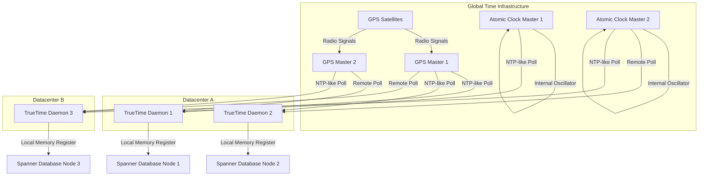

# Google Spanner TrueTime: Dùng đồng hồ nguyên tử để giải bài toán Thời gian

Trong lĩnh vực hệ thống phân tán và cơ sở dữ liệu quy mô toàn cầu, việc duy trì tính nhất quán tuyến tính (linearizability) đồng thời đảm bảo hiệu suất cao luôn là một thách thức cơ bản có tính chất vật lý và toán học. Rào cản lớn nhất đối với tính nhất quán toàn cục nằm ở sự bất đồng bộ của các đồng hồ vật lý trên các nút mạng độc lập. Các hệ thống thông thường phụ thuộc vào Network Time Protocol (NTP) thường phải đối mặt với độ trễ truyền tải bất đối xứng (asymmetric network latency) và hiện tượng trôi đồng hồ (clock drift), dẫn đến biên độ sai số thời gian có thể biến thiên từ hàng chục đến hàng trăm mili-giây. Sự thiếu chính xác này loại bỏ khả năng sắp xếp thứ tự tuyệt đối các sự kiện không có quan hệ nhân quả trực tiếp theo luồng thông điệp, do đó cản trở việc triển khai tính nhất quán ngoại lai (external consistency). Nhằm vượt qua những giới hạn vật lý này, Google Spanner giới thiệu TrueTime, một kiến trúc hạ tầng đồng hồ toàn cục sử dụng trực tiếp các bộ thu tín hiệu hệ thống định vị toàn cầu (GPS) và đồng hồ nguyên tử (atomic clocks). Cốt lõi của TrueTime không phải là việc cung cấp một con số thời gian chính xác hoàn hảo, mà là khả năng định lượng một cách chặt chẽ và đáng tin cậy độ bất định (uncertainty) của thời gian tại bất kỳ thời điểm nào. Thay vì trả về một điểm thời gian duy nhất, API của TrueTime cung cấp một khoảng thời gian chứa đựng thời điểm thực tế với xác suất tuyệt đối. Bằng cách biểu diễn sự không chắc chắn này dưới dạng dữ liệu có thể tính toán được, Spanner có thể thiết kế các thuật toán kiểm soát đồng thời (concurrency control) tinh vi, trì hoãn các tác vụ trong một khoảng thời gian vi mô vừa đủ để đảm bảo tính thứ tự toàn cục mà không làm suy giảm nghiêm trọng thông lượng của hệ thống. Đây là một sự chuyển dịch mô hình mang tính nền tảng, biến độ trễ nội tại của thuyết tương đối hẹp và tính bất định của vật lý phần cứng thành một hằng số có thể kiểm soát được trong phần mềm.

## Kiến trúc Hệ thống Đồng hồ Toàn cầu và Phân phối Lỗi Thời gian

Kiến trúc TrueTime được phân cấp thành một mạng lưới các máy chủ thời gian (time masters) và các tiến trình nền đồng bộ hóa (time daemons) chạy trên mọi máy chủ cơ sở dữ liệu của Spanner. Phần cứng cốt lõi của hệ thống bao gồm hai nguồn tham chiếu thời gian độc lập: bộ thu GPS và đồng hồ nguyên tử (rubidium or cesium oscillators). Sự phân tách này xuất phát từ bản chất trực giao của các miền lỗi (failure domains) cấu thành nên hai công nghệ. Bộ thu GPS cung cấp tham chiếu thời gian với độ chính xác cao dựa trên hệ thống vệ tinh, nhưng dễ bị tổn thương bởi các nhiễu loạn khí quyển, sự cố ăng-ten, hoặc nhiễu sóng vô tuyến điện từ. Ngược lại, đồng hồ nguyên tử hoàn toàn độc lập với môi trường bên ngoài nhưng chịu hiện tượng trôi tần số tuyến tính theo thời gian (clock drift). Bằng cách thiết lập cấu hình dư thừa và kiểm tra chéo giữa các máy chủ Master trang bị GPS và Master trang bị đồng hồ nguyên tử, kiến trúc mạng của TrueTime đảm bảo khả năng chịu lỗi Byzantine đối với tín hiệu thời gian. Một số Master chuyên biệt, gọi là Armageddon masters, được trang bị cả hai loại phần cứng để phục vụ như nguồn tham chiếu tối cao. Mỗi trung tâm dữ liệu chứa một nhóm các máy chủ TrueTime Master, và mọi máy chủ Spanner cục bộ sẽ chạy một TrueTime daemon để liên tục khảo sát (poll) thời gian từ đa dạng các Master, bao gồm cả những Master ở trung tâm dữ liệu cục bộ và trung tâm dữ liệu từ xa. Việc khảo sát chéo này cho phép thuật toán lọc Marzullo được điều chỉnh (modified Marzullo's algorithm) phát hiện và loại bỏ các máy chủ tham chiếu cung cấp dữ liệu lỗi (liars), từ đó đồng bộ hóa đồng hồ cục bộ với độ tin cậy toán học cao nhất.



Cơ sở lý thuyết của hệ thống được đúc kết qua giao diện lập trình TrueTime (TrueTime API). API này trừu tượng hóa thời gian dưới dạng biến cấu trúc $TT.now()$, trả về một khoảng thời gian $[t_{earliest}, t_{latest}]$. Khẳng định cốt lõi của TrueTime là thời điểm vật lý tuyệt đối $t_{abs}$ mà sự kiện gọi hàm $TT.now()$ xảy ra chắc chắn tuân mãn điều kiện $t_{earliest} \le t_{abs} \le t_{latest}$. Độ bất định của phép đo thời gian tại một thời điểm $t$ được xác định bởi hàm $\epsilon(t)$. Tại khoảnh khắc daemon đồng bộ hóa thành công với mạng lưới Master, giá trị $\epsilon$ được hiệu chỉnh về mức tối thiểu (bao gồm độ trễ mạng tối thiểu và sai số thiết bị đo). Khi thời gian trôi qua giữa hai chu kỳ đồng bộ hóa (poll interval), giá trị $\epsilon(t)$ tăng tuyến tính theo giới hạn trôi tối đa cực đoan (worst-case clock drift bound) của hệ thống dao động tinh thể thạch anh (quartz oscillator) trên bo mạch chủ. Theo các thông số thiết kế của Spanner, độ trôi này được giả định bảo thủ ở mức khoảng $200 \mu s/sec$. Quá trình biến thiên của hàm $\epsilon(t)$ có thể được mô tả bằng một phương trình vi phân cơ bản đối với đồng hồ máy tính:

$$ \frac{dC(t)}{dt} \in [1 - \rho, 1 + \rho] $$

Trong đó $C(t)$ là đồng hồ cục bộ và $\rho$ là tỷ lệ trôi phần cứng cực đại. Khi hàm $TT.now()$ được gọi, hệ thống sẽ tính toán:

$$ \epsilon = \epsilon_{sync} + \rho \cdot (t - t_{sync}) $$

$$ t_{earliest} = C(t) - \epsilon $$
$$ t_{latest} = C(t) + \epsilon $$

Mô hình này đảm bảo rằng độ rộng của khoảng TrueTime $2\epsilon$ luôn đại diện cho độ bất định thời gian thực tế. Sự đảm bảo nghiêm ngặt này cung cấp cơ sở tiên quyết để Spanner triển khai các thuật toán đồng thuận phân tán dựa trên thời gian mà không cần phải phụ thuộc toàn bộ vào các giao thức giao tiếp đa luồng cồng kềnh nhằm thiết lập thứ tự nhân quả. Việc sử dụng mạng đồng bộ vệ tinh và nguyên tử giúp kìm hãm $\epsilon$ ở mức từ $1$ đến $7$ mili-giây, một con số đủ nhỏ để thời gian chờ phân giải độ bất định không trở thành nút thắt cổ chai cho độ trễ giao dịch.

## Cơ chế Đồng thuận Paxos Phân tán và Định lý Chờ đợi Ký kết

Spanner duy trì dữ liệu thông qua cơ chế phân mảnh (sharding), trong đó mỗi phân mảnh dữ liệu (directory hoặc tablet) được sao chép qua nhiều trung tâm dữ liệu thông qua giao thức đồng thuận Paxos. Mỗi nhóm Paxos (Paxos group) hoạt động độc lập và bầu chọn một nút thủ lĩnh (leader). Thủ lĩnh duy trì hợp đồng cho thuê thủ lĩnh (leader lease) có giới hạn thời gian. Để đảm bảo tính nhất quán ngoại lai (external consistency)—được định nghĩa là nếu giao dịch $T_1$ hoàn tất (commit) trước khi giao dịch $T_2$ bắt đầu, thì nhãn thời gian của $T_1$ phải nhỏ hơn nhãn thời gian của $T_2$ ($s_1 < s_2$)—Spanner sử dụng một quy tắc kết hợp giữa nhãn thời gian dựa trên TrueTime và một kỹ thuật gọi là "Commit Wait" (chờ đợi ký kết). Khi một thủ lĩnh Paxos tiếp nhận một giao dịch ghi (write transaction), nó gán cho giao dịch đó một nhãn thời gian $s$ lớn hơn mọi nhãn thời gian từng được sử dụng bởi các giao dịch trước đó trong nhóm Paxos. Cụ thể, thủ lĩnh tính toán nhãn thời gian bằng cách tham chiếu TrueTime: $s = TT.now().latest$. Nhãn thời gian này đại diện cho một thời điểm tương lai cực đại có thể xảy ra ở hiện tại, đảm bảo tính đơn điệu tăng nghiêm ngặt (strict monotonicity) đối với lịch sử giao dịch. Tuy nhiên, việc chỉ gán nhãn thời gian là chưa đủ để ngăn ngừa lỗi vi phạm nhân quả do sự không chắc chắn của đồng hồ vật lý.

Định lý Commit Wait quy định rằng bộ phối hợp giao dịch (transaction coordinator) không được phép báo cáo giao dịch đã hoàn tất cho máy khách (client) hoặc cho phép bất kỳ luồng dữ liệu nào liên quan đến giao dịch này hiển thị ra ngoài hệ thống cho đến khi hệ thống chắc chắn tuyệt đối rằng thời gian vật lý hiện tại đã vượt qua nhãn thời gian $s$ được gán cho giao dịch. Theo ngôn ngữ của TrueTime, bộ phối hợp phải liên tục lấy mẫu hoặc chờ đợi cho đến khi điều kiện $TT.now().earliest > s$ được thỏa mãn. Bằng cách trì hoãn việc trả lời máy khách một khoảng thời gian tương đương với $2\epsilon$, Spanner triệt tiêu rủi ro rằng một máy khách khác có thể khởi tạo một giao dịch mới tại một thời điểm vật lý $t_{abs} > s$ nhưng lại nhận được một nhãn thời gian $s'$ nhỏ hơn $s$ do đồng hồ cục bộ của nút mới chạy chậm hơn. Thời gian chờ đợi này được hấp thụ một cách khéo léo vào thời gian độ trễ cần thiết để thuật toán Paxos hoàn tất việc đồng bộ đa số (quorum replication) dữ liệu đến các bản sao, nhờ đó, trong các cấu hình mạng thông thường, quy tắc Commit Wait hiếm khi làm tăng thêm đáng kể độ trễ khả kiến của máy khách.

```cpp
// Pseudocode: Giao thức Commit Wait kết hợp đồng thuận Paxos trong Spanner C++
struct TrueTimeInterval {
    int64_t earliest;
    int64_t latest;
};

class TrueTimeAPI {
public:
    TrueTimeInterval now();
};

class PaxosLeader {
private:
    TrueTimeAPI tt_api;
    int64_t last_assigned_timestamp = 0;
    
public:
    int64_t PrepareTransaction() {
        // Lấy thời gian muộn nhất khả dĩ để đảm bảo tính nhân quả
        TrueTimeInterval current_time = tt_api.now();
        int64_t s = current_time.latest;
        
        // Đảm bảo tính đơn điệu tăng (Monotonicity)
        if (s <= last_assigned_timestamp) {
            s = last_assigned_timestamp + 1;
        }
        last_assigned_timestamp = s;
        return s;
    }

    void CommitTransaction(Transaction tx, int64_t s) {
        // Ghi dữ liệu vào nhật ký Paxos (Write-Ahead Log) đa số
        ReplicateToPaxosQuorum(tx, s);
        
        // Bắt đầu chu trình Commit Wait
        while (true) {
            TrueTimeInterval wait_time = tt_api.now();
            if (wait_time.earliest > s) {
                // Thời gian tuyệt đối hiện tại chắc chắn đã vượt qua s
                break; 
            }
            // Trì hoãn luồng thực thi thông qua syscall (e.g., nanosleep)
            HardwareInterruptDelay(wait_time.earliest - s);
        }
        
        // Hoàn tất và gửi phản hồi thành công cho máy khách
        RespondToClient(tx.client_id, SUCCESS);
    }
};
```

Cơ chế này có ý nghĩa to lớn đối với các giao dịch đọc chỉ (read-only transactions). Trong các hệ thống cũ, thao tác đọc yêu cầu khóa phân tán (distributed locks) để đảm bảo không đọc phải dữ liệu rác hoặc dữ liệu chưa hoàn tất. Với Spanner, một giao dịch đọc chỉ cần xác định một nhãn thời gian $s_{read} = TT.now().latest$ và sau đó yêu cầu các bản sao dữ liệu trả về phiên bản của dữ liệu (snapshot) tại đúng thời điểm $s_{read}$ đó. Dữ liệu trong Spanner là hệ thống đa phiên bản (Multi-Version Concurrency Control - MVCC), mỗi cột dữ liệu mang nhiều phiên bản được định danh bởi nhãn thời gian commit của chúng. Các nút lưu trữ có thể xử lý các truy vấn đọc không khóa (lock-free reads) một cách an toàn mà không chặn các giao dịch ghi đang diễn ra, miễn là nút lưu trữ đó đã bắt kịp với nhãn thời gian $s_{read}$ (thông qua thuộc tính an toàn `safe_time`). Nhờ đó, tính khả dụng của dữ liệu đọc được tối đa hóa, giảm thiểu sự cố tranh chấp tài nguyên tàn khốc ở lớp lưu trữ, đồng thời cung cấp tính năng đọc xuyên vùng địa lý (geo-distributed reads) mạnh mẽ, một tính năng cốt lõi cho các ứng dụng toàn cầu như cơ sở dữ liệu quảng cáo của Google.

## Cấu trúc Micro-Architecture của API TrueTime và Tương tác Phần cứng

Để thực thi cam kết $t_{earliest} \le t_{abs} \le t_{latest}$ với độ tin cậy của thiết bị y tế (mission-critical reliability), hệ thống TrueTime đòi hỏi những can thiệp sâu sắc ở cấp độ kiến trúc vi mô (micro-architecture) của vi xử lý và hệ điều hành hạt nhân (OS kernel). Giao thức thăm dò liên tục của tiến trình TrueTime daemon không thể chỉ phụ thuộc vào các cuộc gọi hệ thống (system calls) mạng thông thường như `recvfrom()` vì tính bất định của bộ lập lịch tiến trình hệ điều hành (process scheduler) và cơ chế ngắt bộ nhớ đệm (cache invalidation) sẽ phá vỡ tính dự đoán của $\epsilon$. Thay vào đó, thời gian được ánh xạ vào một phân vùng bộ nhớ chung (shared memory segment) giữa hạt nhân hệ điều hành, daemon thời gian, và ứng dụng Spanner. Phân vùng này được ghim (pinned) vật lý vào RAM để vô hiệu hóa lỗi trang (page faults), đảm bảo truy cập bộ nhớ trực tiếp không qua quy trình phân giải Translation Lookaside Buffer (TLB) nặng nề.

Khi ứng dụng Spanner thực thi lệnh $TT.now()$, quá trình truy xuất không yêu cầu một giao dịch phân quyền hạt nhân (context switch). Thư viện người dùng (user-space library) đọc các cấu trúc dữ liệu cấu trúc thời gian nguyên thủy từ bộ nhớ dùng chung kết hợp với các chỉ lệnh vòng đời vi xử lý (như lệnh `RDTSC` trên cấu trúc x86_64) để suy diễn sự tiến triển thời gian kể từ lần cập nhật sau cùng của daemon. Thuật toán này được thực thi đồng bộ với các rào chắn bộ nhớ (memory barriers) nghiêm ngặt (như `MFENCE` hoặc `LFENCE`) nhằm ngăn chặn việc thi hành suy đoán (speculative execution) hay thiết lập lại thứ tự chỉ lệnh (instruction reordering) có thể bóp méo trình tự nhận thức về nhãn thời gian vật lý của dòng lệnh. Việc quản lý giá trị $\epsilon$ đòi hỏi sự theo dõi liên tục về trạng thái sức khỏe của đồng hồ CPU nội tại; nếu nhiệt độ bộ vi xử lý dao động mạnh—hiện tượng gây ra trôi dạt tần số do sự thay đổi của mạng tinh thể thạch anh—daemon sẽ dựa vào cảm biến nhiệt độ phần cứng để bảo thủ tăng tham số $\rho$ trong phương trình tính toán lỗi thời gian, mở rộng phạm vi $\epsilon$ nhằm ngăn chặn vi phạm tính đúng đắn.

Hơn nữa, ranh giới phần cứng của việc đồng bộ đồng hồ vệ tinh đóng một vai trò quan trọng. Mỗi trung tâm dữ liệu chứa máy chủ TrueTime duy trì một ăng-ten nhận GPS và xử lý tín hiệu PPS (Pulse Per Second). Tín hiệu phần cứng này phát sinh ngắt vật lý (hardware interrupts) cực nhanh báo hiệu điểm khởi đầu của giây với độ lệch chỉ tính bằng nano-giây. Quá trình lấy mẫu tín hiệu này loại bỏ toàn bộ chuỗi phần mềm trung gian mạng. Một lỗi ngắt ngoại biên (interrupt latency spike) do xung đột bus PCI Express (PCIe) cũng được phần mềm giám sát ghi nhận vào chỉ số lỗi tổng hợp của máy chủ tham chiếu đó, biến đổi mọi dạng trễ vật lý thành sự gia tăng định lượng của khoảng $2\epsilon$. Sự liên kết chặt chẽ từ tầng dao động lượng tử hạt nhân ở mức vật lý, tầng xử lý ngắt cấp hệ điều hành, đến tầng kiểm soát giao dịch đồng thời ở cấp cơ sở dữ liệu, thể hiện một kiệt tác kỹ thuật hệ thống, cho phép Spanner thống nhất định luật vật lý và khoa học máy tính trong một nền tảng cơ sở dữ liệu độc nhất vô nhị. Sự hy sinh bắt buộc để duy trì $\epsilon$ ở mức khả thi là năng lực giám sát và duy trì cơ sở hạ tầng thời gian chuyên biệt độc quyền này.

## Tối ưu hóa SEO

*   **Từ khóa chính (Primary Keywords):** Google Spanner, TrueTime API, Atomic Clocks (Đồng hồ nguyên tử), Database Concurrency Control, External Consistency.
*   **Mô tả Meta (Meta Description):** Khám phá kiến trúc chuyên sâu của Google Spanner và TrueTime API. Bài viết phân tích cách sử dụng đồng hồ nguyên tử, tín hiệu GPS và thuật toán Commit Wait để giải quyết độ bất định thời gian và tính nhất quán phân tán.
*   **Cấu trúc URL (URL Structure):** `/blogs/part-4/32-google-spanner-truetime`
*   **Thẻ định tuyến (Canonical Tag):** Đảm bảo trỏ về URL gốc để tránh trùng lặp nội dung khi phân phối trên các cổng kiến thức hệ thống.
*   **Thẻ thay thế hình ảnh (Alt Text):** Tất cả các biểu đồ Mermaid cần có bản dịch mã hoặc văn bản mô tả cụ thể kiến trúc máy chủ GPS và Atomic Clock Master.
