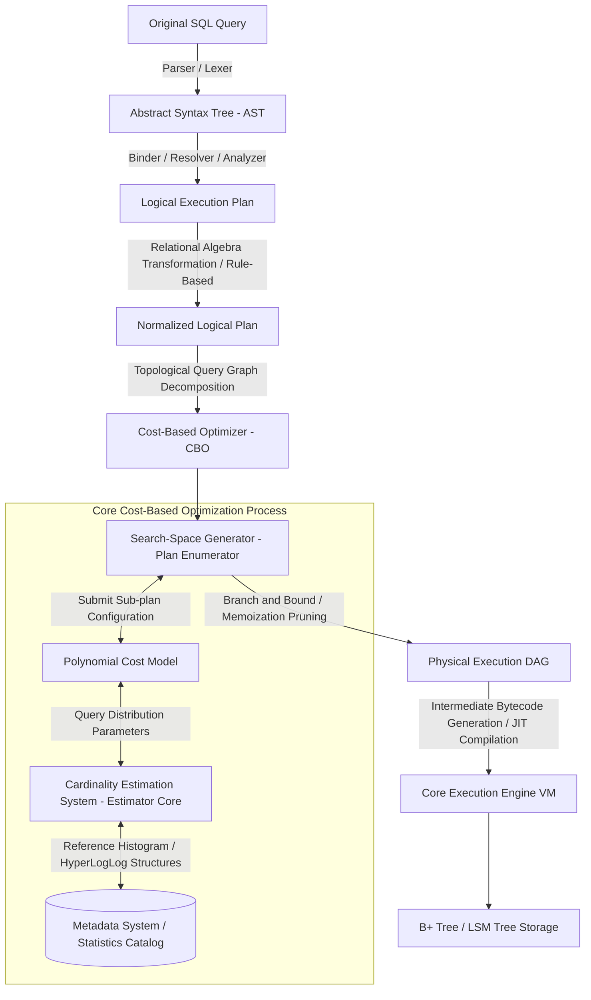

# The Architecture and Internal Algorithms of the Cost-Based Optimizer in Relational Database Management Systems

## Executive Summary

Data keeps growing faster than most schedules account for, and the ability to pull the right rows back quickly has become a real competitive edge. Inside a relational database, the component responsible for that speed is query optimization — specifically, the **Cost-Based Optimizer (CBO)**, the piece of the engine that decides how a SQL statement actually gets executed.

This article works through the CBO's micro-architecture: the cost-evaluation math, the dynamic-programming algorithms behind plan search, cardinality estimation, and how hardware and OS behavior feed back into the optimizer's choices. By the end, you should have a solid mental model of how a cost-based optimizer works under the hood, where it tends to go wrong on complex queries, and what that means for how you design and maintain a database.

---

## Defining the Core Problem

Query optimization in an RDBMS is one of the genuinely hard problems in computer science — it sits at the intersection of graph theory, statistics, and systems architecture.

**What exactly is being solved?** When a user submits a SQL statement, the engine has to translate that logical request into a physical execution plan capable of touching disk and RAM efficiently. For a query with several joins, the number of feasible plans can run into the millions. Pick the wrong one — a full table scan instead of an index, or the wrong join order — and a query that should take milliseconds can take hours, or exhaust memory outright.

The Cost-Based Optimizer is the answer to that problem. Older Rule-Based Optimizers just follow fixed heuristics ("always use an index if one exists"). A CBO instead builds a mathematical cost model and estimates the time and resource cost of tens of thousands of candidate plans before picking a route.

What the CBO decides depends heavily on:
- the shape of the query itself
- statistics about the underlying data
- the hardware profile (CPU, I/O bandwidth)
- how the OS manages buffers and cache

The gap between a strong optimizer (PostgreSQL, Oracle) and a mediocre one usually comes down to how well it prunes the search space. Because the underlying problem is NP-hard, every real system leans on approximation and statistical estimation rather than exhaustive search.

---

## Anatomy of the Cost-Based Optimizer

An execution plan is, at its core, a tree of physical operators:
- **Leaf nodes** represent base access methods — sequential scan, B+ tree index scan, bitmap scan.
- **Intermediate nodes** represent relational operations — joins (hash, merge, nested loop), aggregation, sort.

The CBO has to price out every node, model the data flow through the pipeline, and roll all of that up into a single cost figure. The process breaks down into phases:

1. **Parser/Analyzer:** compiles SQL into an AST, then a logical plan.
2. **Logical Optimization (rule-based):** simplifies expressions, pushes predicates down.
3. **Physical Optimization (cost-based):** walks the search space, scoring candidates with the cost model and picking the cheapest.



---

## The Math Behind the Cost Model

The core of the CBO's job is a cost model that mirrors real hardware behavior closely enough to be useful. The total cost $C_{total}$ combines disk I/O, CPU cycles, memory allocation, and network latency:

$$C_{total} = W_{IO} \cdot C_{IO} + W_{CPU} \cdot C_{CPU} + W_{MEM} \cdot C_{MEM} + W_{NET} \cdot C_{NET}$$

The weights ($W$) get tuned per configuration to reflect the actual hardware — SSD versus HDD, for instance.

### Breaking down I/O cost ($C_{IO}$)

$C_{IO}$ estimates read/write cost, split into sequential and random reads. On HDD, random reads are dramatically more expensive than sequential ones. On SSD that gap shrinks, but random access still costs more due to block-size constraints.

$$C_{IO} = N_{seq} \cdot C_{seq} + N_{rand} \cdot C_{rand} + N_{dirty\_flush} \cdot C_{write\_barrier}$$

### Breaking down CPU cost ($C_{CPU}$)

CPU cost is modeled from the number of tuples flowing through each operator, predicate evaluation, and hashing:

$$C_{CPU} = N_{tuples} \cdot C_{tuple\_eval} + N_{index\_probes} \cdot C_{index\_lookup} + N_{hash\_collisions} \cdot C_{resolution\_penalty}$$

Getting the CPU estimate right depends on knowing row-set size — cardinality — accurately, which is where the estimator comes in.

---

## Cardinality Estimation: The Heart of the Optimizer

Selectivity of predicate $P$ is the fraction of rows satisfying it:

$$Sel(P) = \frac{|\sigma_P(R)|}{|R|}$$

The classic assumption is that combined predicates are statistically independent:

$$Sel(P_1 \land P_2) = Sel(P_1) \cdot Sel(P_2)$$

**This assumption breaks down constantly.** Real columns correlate — `country = 'Vietnam'` and `area_code = '+84'` aren't independent at all. Assuming independence leads to severe under-estimation: the optimizer might think a filter returns 1 row when it actually returns a million, then pick a nested loop join that grinds the system to a halt.

Modern optimizers compensate with:
1. **Multi-dimensional statistics** that capture cross-column correlation.
2. **V-Optimal Histograms** — a partitioning scheme that minimizes mean squared error, useful for catching skewed distributions.
3. **HyperLogLog and Count-Min Sketch** for approximate distinct-count estimation at scale — HLL gets within a few percent of accuracy using only kilobytes of memory.

$$SE \approx \frac{1.04}{\sqrt{m}}$$

where $m$ is the number of registers. This is efficient enough that it doesn't meaningfully disturb L1/L2 cache bandwidth.

---

## Dynamic Programming and the Search Space

The plan search space is a combinatorial wall. For $N$ tables being joined:
- Restricting to **left-deep trees** (linear, pipeline-friendly): $N!$ permutations.
- Allowing **bushy trees** as well (branching, parallelizable joins): the count balloons toward a Catalan-number variant.

$$\text{Total number of Bushy Trees} = \frac{(2N-2)!}{(N-1)!}$$

The System R algorithm (from IBM Research) tackles this with dynamic programming: it memoizes the best join configuration for every subset of tables, applying Bellman's Principle of Optimality to prune the weakest configurations early.

$$OptPlan(S) = \min_{S_1, S_2 \subset S, S_1 \cap S_2 = \emptyset} \{ Cost(OptPlan(S_1) \bowtie OptPlan(S_2)) \}$$

The catch is that this bottom-up approach struggles whenever a top-down, demand-driven signal matters — for example, when returning pre-sorted data is worth paying extra for.

---

## The Cascades Framework: Rethinking Optimizer Design

Cascades — used by Microsoft SQL Server, CockroachDB, and Apache Calcite — fixes System R's blind spot directly.

It pairs a top-down traversal with a hypergraph structure called the **Memo**, which stores equivalence classes: expressions that produce the same logical result through different physical plans.

The key idea is the **physical properties demand**. If a parent operator (say, `GROUP BY X`) needs data sorted by X, it forces child subtrees to search specifically for plans that satisfy that requirement — favoring a merge join, which preserves sort order, over a hash join that would otherwise be cheaper but destroys it.

The Rust snippet below models the branch-and-bound pruning that happens inside the Memo:

```rust
use std::collections::HashMap;
use std::sync::{Arc, RwLock};

#[derive(Clone, Hash, PartialEq, Eq)]
struct LogicalExpressionId(u64);

#[derive(Clone)]
struct PhysicalPlan {
    cost: f64,
    operator_type: String,
}

struct MemoTable {
    best_plans: RwLock<HashMap<LogicalExpressionId, PhysicalPlan>>,
}

impl MemoTable {
    fn new() -> Self {
        MemoTable { best_plans: RwLock::new(HashMap::new()) }
    }

    fn optimize_group(&self, group_id: &LogicalExpressionId, current_upper_bound: f64) -> Option<PhysicalPlan> {
        {
            let read_guard = self.best_plans.read().unwrap();
            if let Some(cached_plan) = read_guard.get(group_id) {
                if cached_plan.cost <= current_upper_bound {
                    return Some(cached_plan.clone()); // Prune if it exceeds the bound
                }
            }
        }

        // Rule engine generates candidate variants
        let candidates = vec![
            PhysicalPlan { cost: 1500.0, operator_type: "GraceHashJoin".to_string() },
            PhysicalPlan { cost: 800.0, operator_type: "ParallelMergeJoin".to_string() },
        ];

        let mut local_best: Option<PhysicalPlan> = None;
        let mut min_cost = current_upper_bound;

        for candidate in candidates {
            if candidate.cost >= min_cost { continue; }
            min_cost = candidate.cost;
            local_best = Some(candidate);
        }

        if let Some(ref best) = local_best {
            let mut write_guard = self.best_plans.write().unwrap();
            write_guard.insert(group_id.clone(), best.clone());
        }
        local_best
    }
}
```

---

## Where Hardware and OS Memory Behavior Break the Model

The cost model tends to fail hardest right where it collides with physical reality: memory fragmentation, paging, and cache hierarchy.

### Grace Hash Join and the memory-overflow problem

When a hash join's hash table fits in L3 cache, probes are extremely fast — a few nanoseconds. Once it spills into RAM, TLB misses start pushing latency up. And if the table outgrows available RAM entirely, the engine has to fall back to a Grace Hash Join: split the data in half and spill it to disk.

At that point I/O cost jumps according to:

$$C_{hash\_join} = 3 \cdot (|R| + |S|) \cdot C_{IO\_seq} + C_{cpu\_partitioning}$$

(Data has to be read from RAM, written to disk, then read back for probing.) If the optimizer had anticipated this spill early, a Sort Merge Join would likely have been the better call.

### NUMA and hardware prefetching

On multi-socket (NUMA) servers, cross-socket memory access is expensive. A NUMA-aware CBO penalizes plans that lack data locality, while also discounting sequential I/O cost slightly to account for the hardware prefetcher automatically pulling data into cache ahead of demand.

---

## Practical Lessons

After digging into how the CBO actually works, a few takeaways are worth carrying into day-to-day database work:

1. **Look for the root cause before switching platforms.** A slow query is usually a symptom of the CBO working with bad or missing cardinality information, not a fundamentally broken engine.
2. **Keep statistics fresh.** Run `ANALYZE` (PostgreSQL) or `GATHER_STATS` (Oracle) regularly. Stale statistics leave the optimizer effectively blind — picking a nested loop join over billions of rows instead of a hash join.
3. **Watch for correlated columns.** Stacking `AND`/`OR` conditions on tightly related columns (city and postal code, say) without cross-column statistics will consistently mislead the estimator. Declare multi-dimensional statistics where the database supports it.
4. **Respect memory configuration limits.** Parameters like `work_mem` in PostgreSQL matter more than they look — too small and sorts/hashes spill to disk, tanking performance; too large and you risk starving the whole server of RAM.
5. **Physical ordering pays off.** A clustered index gives the optimizer an "already sorted" property it can exploit for cheap merge joins, which is a durable advantage that persists across query shapes.

---

## Conclusion

The cost-based optimizer sits at a genuine intersection of software engineering, data structures, and optimization theory. Understanding its moving parts — histograms, the Memo's memoization in Cascades, the way L3 cache and NUMA topology shape real costs — makes it much easier to write queries the optimizer handles well, instead of fighting it query by query in production.
