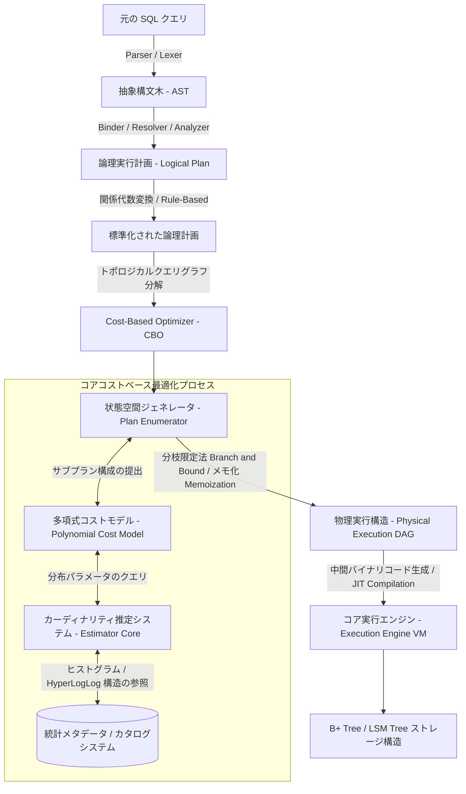

# リレーショナルデータベース管理システムにおける Cost-Based Optimizer の内部アーキテクチャとアルゴリズム

## エグゼクティブサマリー

データの増加ペースは大抵の見積もりを上回り続けていて、必要な行を素早く引き出せるかどうかが、実質的な競争優位になっている。リレーショナルデータベースの中でこの速度を左右しているのがクエリ最適化——具体的には**Cost-Based Optimizer(CBO)**、つまりSQL文が実際にどう実行されるかを決めるエンジンの部品だ。

本稿ではCBOのマイクロアーキテクチャを追っていく。コスト評価の数式、プラン探索を支える動的計画法アルゴリズム、カーディナリティ推定、そしてハードウェアやOSの挙動がオプティマイザの判断にどう跳ね返ってくるか。読み終える頃には、cost-based optimizerが裏側でどう動いているか、複雑なクエリでどこにつまずきやすいか、それがデータベース設計・運用にとって何を意味するか、しっかりしたイメージが持てるはずだ。

---

## 中核となる問題の定義

RDBMSにおけるクエリ最適化は、コンピュータサイエンスの中でも本当に難しい問題の一つで、グラフ理論、統計学、システムアーキテクチャが交差する領域にある。

**具体的に何を解いているのか。** ユーザーがSQL文を送ると、エンジンはその論理的な要求を、ディスクとRAMに効率よく触れる物理実行計画へと変換しなければならない。複数のjoinを含むクエリでは、実行可能なプランの数が数百万に達することもある。誤ったプランを選ぶ——インデックスの代わりにフルスキャンを選ぶ、join順序を間違えるなど——と、本来ミリ秒で終わるはずのクエリが数時間かかったり、メモリを使い果たしたりする。

Cost-Based Optimizerは、この問題への答えだ。古いRule-Based Optimizerは固定されたヒューリスティック(「インデックスがあれば常に使う」など)に従うだけだったが、CBOは数学的なコストモデルを構築し、経路を選ぶ前に何万もの候補プランの時間・リソースコストを見積もる。

CBOの判断は主に次に左右される。
- クエリ自体の形
- 元データに関する統計情報
- ハードウェアプロファイル(CPU、I/O帯域)
- OSがバッファ/キャッシュをどう管理しているか

優れたオプティマイザ(PostgreSQL、Oracleなど)と平凡なものとの差は、たいてい探索空間をどれだけうまく刈り込めるかにある。この問題自体がNP困難であるため、実際のシステムはすべて、網羅的探索ではなく近似と統計的推定に頼らざるを得ない。

---

## Cost-Based Optimizer の解剖

実行計画は本質的に、物理演算子のツリーだ。
- **リーフノード** は基本的なアクセス方法を表す——sequential scan、B+ tree index scan、bitmap scan。
- **中間ノード** はjoin(hash、merge、nested loop)、aggregation、sortといった関係演算を表す。

CBOはすべてのノードの価格を見積もり、パイプラインを通るデータフローをモデル化し、それらをすべて足し合わせて一つのコスト値にまとめる必要がある。このプロセスはいくつかのフェーズに分かれる。

1. **Parser/Analyzer:** SQLをASTに、次に論理計画にコンパイルする。
2. **Logical Optimization(rule-based):** 式を簡略化し、述語をプッシュダウンする。
3. **Physical Optimization(cost-based):** 探索空間を巡り、コストモデルで候補を採点し、最も安いものを選ぶ。



---

## コストモデルを支える数学

CBOの仕事の核心は、実際のハードウェアの挙動を実用的なレベルで反映するコストモデルを組み立てることにある。総コスト $C_{total}$ は、ディスクI/O、CPUサイクル、メモリ割り当て、ネットワーク遅延を組み合わせたものだ。

$$C_{total} = W_{IO} \cdot C_{IO} + W_{CPU} \cdot C_{CPU} + W_{MEM} \cdot C_{MEM} + W_{NET} \cdot C_{NET}$$

重み($W$)は、SSDかHDDかといった実際のハードウェアを反映するよう、設定ごとに調整される。

### I/Oコスト($C_{IO}$)の分解

$C_{IO}$ は読み書きコストを見積もるもので、シーケンシャルリードとランダムリードに分かれる。HDDでは、ランダムリードはシーケンシャルリードよりはるかに高くつく。SSDではこの差は縮まるが、ブロックサイズの制約によりランダムアクセスは依然としてやや割高だ。

$$C_{IO} = N_{seq} \cdot C_{seq} + N_{rand} \cdot C_{rand} + N_{dirty\_flush} \cdot C_{write\_barrier}$$

### CPUコスト($C_{CPU}$)の分解

CPUコストは、各演算子を通過するタプル数、述語評価、ハッシュ計算からモデル化される。

$$C_{CPU} = N_{tuples} \cdot C_{tuple\_eval} + N_{index\_probes} \cdot C_{index\_lookup} + N_{hash\_collisions} \cdot C_{resolution\_penalty}$$

CPUの見積もりを正確にするには、結果セットのサイズ——カーディナリティ——を正しく把握する必要があり、そこでestimatorの出番となる。

---

## Cardinality Estimation:オプティマイザの心臓部

条件 $P$ の選択性は、それを満たす行の割合だ。

$$Sel(P) = \frac{|\sigma_P(R)|}{|R|}$$

古典的な仮定は、組み合わされた条件同士が統計的に独立であるというものだ。

$$Sel(P_1 \land P_2) = Sel(P_1) \cdot Sel(P_2)$$

**この仮定は実際には頻繁に破綻する。** 実際の列はしばしば相関する——`country = 'Vietnam'` と `area_code = '+84'` はまったく独立ではない。独立性を仮定すると深刻な過小評価につながる。オプティマイザはあるフィルタが1行しか返さないと考えるが、実際には100万行返ってくることもあり、その結果nested loop joinを選んでシステムを詰まらせてしまう。

現代のオプティマイザは以下で補っている。
1. 列間の相関を捉える**多次元統計**。
2. 平均二乗誤差を最小化するパーティショニング手法である**V-Optimal Histogram**——歪んだ分布を捉えるのに役立つ。
3. 大規模な近似distinct count推定のための**HyperLogLogとCount-Min Sketch**——HLLはわずか数キロバイトのメモリで数パーセントの誤差に収まる。

$$SE \approx \frac{1.04}{\sqrt{m}}$$

$m$ はレジスタ数。この効率の良さのおかげで、L1/L2キャッシュ帯域を大きく乱すことはない。

---

## 動的計画法と探索空間

プランの探索空間は巨大な組み合わせの壁だ。join対象の $N$ 個のテーブルに対して:
- **left-deep tree**(線形でパイプラインに適したツリー)のみを考えると:順列数は $N!$。
- **bushy tree**(枝分かれし、並列化可能なjoinをサポートするツリー)も含めると:その数はカタラン数の変種近くまで膨らむ。

$$\text{総 Bushy Trees 数} = \frac{(2N-2)!}{(N-1)!}$$

System Rアルゴリズム(IBM Research発)は、これに動的計画法で立ち向かう。テーブルの各部分集合について最良のjoin構成をメモ化し、ベルマンの最適性原理を適用して弱い構成を早期に刈り込む。

$$OptPlan(S) = \min_{S_1, S_2 \subset S, S_1 \cap S_2 = \emptyset} \{ Cost(OptPlan(S_1) \bowtie OptPlan(S_2)) \}$$

問題は、このボトムアップ方式が、トップダウンかつ需要駆動型のシグナルが重要になる場面——たとえば事前にソートされたデータを返す価値が余分なコストに見合う場合など——でうまく機能しないことだ。

---

## Cascadesフレームワーク:オプティマイザ設計の再考

Microsoft SQL Server、CockroachDB、Apache Calciteが採用しているCascadesは、System Rのこの死角を直接解決する。

トップダウン探索と、**Memo**と呼ばれるハイパーグラフ構造を組み合わせる。Memoは等価クラスを格納する——異なる物理プランを通じて同じ論理的結果を生む式の集まりだ。

鍵となる考え方は**physical properties demand**だ。親演算子(たとえば `GROUP BY X`)がXでソートされたデータを必要とする場合、子ツリーにその要件を満たすプランを具体的に探させる——hash joinの方が本来安くても、ソート順を壊してしまうため、ソート順を保つmerge joinを優先させる。

以下のRustコードは、Memo内部で行われるbranch-and-boundによる刈り込みをモデル化したものだ。

```rust
use std::collections::HashMap;
use std::sync::{Arc, RwLock};

#[derive(Clone, Hash, PartialEq, Eq)]
struct LogicalExpressionId(u64);

#[derive(Clone)]
struct PhysicalPlan {
    cost: f64,
    operator_type: String,
}

struct MemoTable {
    best_plans: RwLock<HashMap<LogicalExpressionId, PhysicalPlan>>,
}

impl MemoTable {
    fn new() -> Self {
        MemoTable { best_plans: RwLock::new(HashMap::new()) }
    }

    fn optimize_group(&self, group_id: &LogicalExpressionId, current_upper_bound: f64) -> Option<PhysicalPlan> {
        {
            let read_guard = self.best_plans.read().unwrap();
            if let Some(cached_plan) = read_guard.get(group_id) {
                if cached_plan.cost <= current_upper_bound {
                    return Some(cached_plan.clone()); // しきい値を超えた場合の枝刈り (Pruning)
                }
            }
        }

        // ルールエンジンによるバリアント生成
        let candidates = vec![
            PhysicalPlan { cost: 1500.0, operator_type: "GraceHashJoin".to_string() },
            PhysicalPlan { cost: 800.0, operator_type: "ParallelMergeJoin".to_string() },
        ];

        let mut local_best: Option<PhysicalPlan> = None;
        let mut min_cost = current_upper_bound;

        for candidate in candidates {
            if candidate.cost >= min_cost { continue; }
            min_cost = candidate.cost;
            local_best = Some(candidate);
        }

        if let Some(ref best) = local_best {
            let mut write_guard = self.best_plans.write().unwrap();
            write_guard.insert(group_id.clone(), best.clone());
        }
        local_best
    }
}
```

---

## ハードウェアとOSメモリの挙動がモデルを壊す場所

コストモデルが最も派手に失敗するのは、物理的な現実——メモリの断片化、ページング、キャッシュ階層——にぶつかったときだ。

### Grace Hash Joinとメモリオーバーフロー問題

hash joinのハッシュテーブルがL3キャッシュに収まっている間は、プローブは数ナノ秒という速さで済む。RAMに溢れ始めるとTLBミスが増え、遅延が押し上げられる。テーブルが利用可能なRAMを完全に超えてしまうと、エンジンはGrace Hash Joinにフォールバックせざるを得ない——データを半分に分割し、ディスクに溢れさせる。

その時点でI/Oコストは次の式に従って跳ね上がる。

$$C_{hash\_join} = 3 \cdot (|R| + |S|) \cdot C_{IO\_seq} + C_{cpu\_partitioning}$$

(データはRAMから読み込み、ディスクに書き出し、プローブのために読み戻す必要がある。)オプティマイザがこのスピルを早期に見越していれば、多くの場合Sort Merge Joinの方が良い選択だっただろう。

### NUMAとハードウェアプリフェッチ

マルチソケット(NUMA)サーバーでは、ソケットをまたぐメモリアクセスは高くつく。NUMAを意識したCBOは、データ局所性を欠くプランにペナルティを科す一方で、ハードウェアプリフェッチャーが要求前にデータをキャッシュへ先読みしてくれることを考慮し、シーケンシャルI/Oコストをわずかに割り引く。

---

## 実践的な教訓

CBOが実際どう動いているかを掘り下げた後、日々のデータベース運用に持ち帰る価値のある教訓がいくつかある。

1. **プラットフォームを乗り換える前に根本原因を探す。** クエリが遅いのは、たいていCBOが不正確または不足したカーディナリティ情報で動いている症状であって、エンジンが根本的に壊れているわけではない。
2. **統計情報を新鮮に保つ。** `ANALYZE`(PostgreSQL)や `GATHER_STATS`(Oracle)を定期的に実行する。古い統計情報はオプティマイザを事実上盲目にし、数十億行に対してhash joinの代わりにnested loop joinを選ばせてしまう。
3. **相関する列に注意する。** 密接に関連する列(市と郵便番号など)に対してcross-column statisticsなしで `AND`/`OR` 条件を積み重ねると、estimatorを一貫して誤らせる。データベースがサポートしていれば多次元統計を宣言すること。
4. **メモリ設定の限界を尊重する。** PostgreSQLの `work_mem` のようなパラメータは見た目以上に重要だ——小さすぎるとsort/hashがディスクに溢れてパフォーマンスが落ち、大きすぎるとサーバー全体のRAMを枯渇させるリスクがある。
5. **物理的な順序付けは報われる。** クラスタ化インデックスは、オプティマイザに「すでにソート済み」という性質を与え、安価なmerge joinに活用できる。これはクエリの形が変わっても持続する有効なアドバンテージだ。

---

## 結論

Cost-based optimizerは、ソフトウェアエンジニアリング、データ構造、最適化理論が本当に交差する場所に位置している。ヒストグラム、Cascadesにおけるメモの記憶化、L3キャッシュとNUMAトポロジーが実際のコストをどう形作るか——こうした部品を理解することで、オプティマイザがうまく処理できるクエリを書きやすくなり、本番環境でクエリごとに戦い続ける必要がなくなる。
