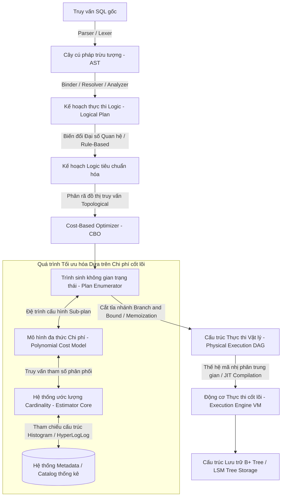

# Kiến Trúc Và Thuật Toán Nội Tại Của Cost-Based Optimizer Trong Hệ Quản Trị Cơ Sở Dữ Liệu Quan Hệ

## Tóm tắt Điều hành

Dữ liệu tăng nhanh hơn hầu hết các kế hoạch capacity từng dự tính, và khả năng lấy đúng dữ liệu về nhanh đã trở thành một lợi thế cạnh tranh thực sự. Trong một cơ sở dữ liệu quan hệ, thành phần chịu trách nhiệm cho tốc độ đó là quá trình tối ưu truy vấn — cụ thể là **Cost-Based Optimizer (CBO)**, phần của engine quyết định một câu SQL sẽ được thực thi như thế nào trên thực tế.

Bài viết này đi qua kiến trúc vi mô của CBO: mô hình toán học đánh giá chi phí, các thuật toán quy hoạch động đứng sau việc tìm kiếm kế hoạch, cardinality estimation, và cách hành vi phần cứng/hệ điều hành tác động ngược lại lựa chọn của optimizer. Đọc xong, bạn sẽ có một mô hình tư duy vững chắc về cách một cost-based optimizer hoạt động bên dưới, nó thường sai ở đâu với các truy vấn phức tạp, và điều đó có ý nghĩa gì cho việc thiết kế, bảo trì cơ sở dữ liệu.

---

## Định Nghĩa Vấn Đề Cốt Lõi

Tối ưu truy vấn trong RDBMS là một trong những bài toán thực sự khó của khoa học máy tính — nó nằm ở giao điểm giữa lý thuyết đồ thị, thống kê, và kiến trúc hệ thống.

**Bài toán cụ thể là gì?** Khi người dùng gửi một câu SQL, engine phải chuyển yêu cầu logic đó thành một kế hoạch thực thi vật lý có thể chạm vào đĩa và RAM một cách hiệu quả. Với một truy vấn có nhiều join, số lượng kế hoạch khả dĩ có thể lên tới hàng triệu. Chọn sai một kế hoạch — quét toàn bộ bảng thay vì dùng index, hay chọn sai thứ tự join — có thể biến một truy vấn đáng lẽ chỉ mất vài mili-giây thành hàng giờ, hoặc làm cạn kiệt bộ nhớ hoàn toàn.

Cost-Based Optimizer chính là câu trả lời cho bài toán đó. Các Rule-Based Optimizer đời cũ chỉ đi theo các quy tắc cố định ("luôn dùng index nếu có"). Một CBO thì xây dựng hẳn một mô hình toán học và ước lượng chi phí thời gian, tài nguyên của hàng vạn kế hoạch ứng viên trước khi chọn ra một lộ trình.

Quyết định của CBO phụ thuộc nhiều vào:
- cấu trúc của chính câu truy vấn
- số liệu thống kê về dữ liệu bên dưới
- cấu hình phần cứng (CPU, băng thông I/O)
- cách hệ điều hành quản lý buffer/cache

Khoảng cách giữa một optimizer tốt (PostgreSQL, Oracle) và một cái tầm thường thường nằm ở việc nó cắt tỉa không gian tìm kiếm tốt đến đâu. Vì bài toán gốc thuộc lớp NP-hard, mọi hệ thống thực tế đều phải dựa vào xấp xỉ và ước lượng thống kê thay vì tìm kiếm vét cạn.

---

## Giải Phẫu Kiến Trúc Cost-Based Optimizer

Một kế hoạch thực thi về bản chất là một cây các toán tử vật lý:
- **Nút lá** đại diện cho các phương thức truy xuất cơ bản — sequential scan, B+ tree index scan, bitmap scan.
- **Nút trung gian** đại diện cho các phép toán quan hệ — join (hash, merge, nested loop), aggregation, sort.

CBO phải định giá từng nút, mô hình hóa dòng chảy dữ liệu qua pipeline, và cộng gộp tất cả thành một con số chi phí duy nhất. Quá trình này chia thành các pha:

1. **Parser/Analyzer:** biên dịch SQL thành AST, rồi thành logical plan.
2. **Logical Optimization (rule-based):** đơn giản hóa biểu thức, đẩy predicate xuống dưới.
3. **Physical Optimization (cost-based):** duyệt không gian tìm kiếm, chấm điểm các ứng viên bằng cost model và chọn cái rẻ nhất.



---

## Toán Học Đứng Sau Cost Model

Trọng tâm công việc của CBO là xây dựng một cost model phản ánh đủ sát hành vi phần cứng thực tế để hữu dụng. Tổng chi phí $C_{total}$ kết hợp I/O đĩa, chu kỳ CPU, cấp phát bộ nhớ, và độ trễ mạng:

$$C_{total} = W_{IO} \cdot C_{IO} + W_{CPU} \cdot C_{CPU} + W_{MEM} \cdot C_{MEM} + W_{NET} \cdot C_{NET}$$

Các trọng số ($W$) được tinh chỉnh theo cấu hình để phản ánh đúng phần cứng — ví dụ SSD so với HDD.

### Phân rã chi phí I/O ($C_{IO}$)

$C_{IO}$ ước tính chi phí đọc/ghi, chia thành đọc tuần tự và đọc ngẫu nhiên. Trên HDD, đọc ngẫu nhiên đắt hơn đọc tuần tự rất nhiều. Trên SSD khoảng cách này thu hẹp lại, nhưng truy cập ngẫu nhiên vẫn tốn kém hơn do giới hạn kích thước block.

$$C_{IO} = N_{seq} \cdot C_{seq} + N_{rand} \cdot C_{rand} + N_{dirty\_flush} \cdot C_{write\_barrier}$$

### Phân rã chi phí CPU ($C_{CPU}$)

Chi phí CPU được mô hình hóa dựa trên số lượng tuple đi qua mỗi toán tử, việc đánh giá predicate, và tính toán hash:

$$C_{CPU} = N_{tuples} \cdot C_{tuple\_eval} + N_{index\_probes} \cdot C_{index\_lookup} + N_{hash\_collisions} \cdot C_{resolution\_penalty}$$

Để ước lượng CPU chính xác, cần biết đúng kích thước tập kết quả — cardinality — và đây là việc của estimator.

---

## Cardinality Estimation: Trái Tim Của Optimizer

Selectivity của điều kiện $P$ là tỷ lệ số dòng thỏa mãn điều kiện đó:

$$Sel(P) = \frac{|\sigma_P(R)|}{|R|}$$

Giả định kinh điển là các điều kiện kết hợp độc lập về mặt thống kê:

$$Sel(P_1 \land P_2) = Sel(P_1) \cdot Sel(P_2)$$

**Giả định này sai liên tục trong thực tế.** Các cột thường tương quan với nhau — `country = 'Vietnam'` và `area_code = '+84'` chẳng độc lập chút nào. Giả định độc lập dẫn đến under-estimation nghiêm trọng: optimizer có thể nghĩ một filter chỉ trả về 1 dòng trong khi thực tế là cả triệu dòng, rồi chọn nhầm nested loop join khiến hệ thống ì ạch.

Các optimizer hiện đại bù đắp bằng:
1. **Thống kê đa chiều** để nắm được tương quan chéo giữa các cột.
2. **V-Optimal Histograms** — một cách phân vùng dữ liệu tối thiểu hóa sai số bình phương trung bình, hữu ích để bắt các phân phối lệch.
3. **HyperLogLog và Count-Min Sketch** để ước lượng số phần tử phân biệt ở quy mô lớn — HLL đạt độ chính xác trong khoảng vài phần trăm mà chỉ tốn vài kilobyte RAM.

$$SE \approx \frac{1.04}{\sqrt{m}}$$

với $m$ là số thanh ghi. Thuật toán này đủ hiệu quả để không làm phiền băng thông cache L1/L2 một cách đáng kể.

---

## Quy Hoạch Động Và Không Gian Tìm Kiếm

Không gian tìm kiếm kế hoạch là một bức tường tổ hợp khổng lồ. Với $N$ bảng cần join:
- Chỉ xét **left-deep tree** (cây tuyến tính, thân thiện với pipeline): $N!$ hoán vị.
- Xét cả **bushy tree** (cây phân nhánh, cho phép join song song): số lượng phình lên gần một biến thể của dãy số Catalan.

$$\text{Tổng số Bushy Trees} = \frac{(2N-2)!}{(N-1)!}$$

Thuật toán System R (từ IBM Research) xử lý việc này bằng quy hoạch động: nó ghi nhớ (memoize) cấu hình join tốt nhất cho từng tập con bảng, áp dụng nguyên lý tối ưu Bellman để cắt tỉa sớm các cấu hình yếu.

$$OptPlan(S) = \min_{S_1, S_2 \subset S, S_1 \cap S_2 = \emptyset} \{ Cost(OptPlan(S_1) \bowtie OptPlan(S_2)) \}$$

Vấn đề là cách tiếp cận bottom-up này gặp khó khi cần tín hiệu top-down theo yêu cầu — ví dụ khi trả về dữ liệu đã sắp xếp sẵn đáng để trả thêm chi phí.

---

## Cascades Framework: Thiết Kế Lại Optimizer

Cascades — được dùng bởi Microsoft SQL Server, CockroachDB, và Apache Calcite — giải quyết trực tiếp điểm mù của System R.

Nó kết hợp duyệt top-down với một cấu trúc siêu đồ thị gọi là **Memo**, lưu các nhóm tương đương: những biểu thức cho ra cùng kết quả logic nhưng qua các kế hoạch vật lý khác nhau.

Ý tưởng then chốt là **physical properties demand**. Nếu một toán tử cha (ví dụ `GROUP BY X`) cần dữ liệu được sắp theo X, nó buộc các cây con phải tìm kiếm cụ thể các kế hoạch thỏa mãn yêu cầu đó — ưu tiên merge join (giữ nguyên thứ tự sắp xếp) hơn hash join (dù rẻ hơn nhưng phá vỡ thứ tự).

Đoạn Rust dưới đây mô phỏng quá trình cắt tỉa branch-and-bound diễn ra bên trong Memo:

```rust
use std::collections::HashMap;
use std::sync::{Arc, RwLock};

#[derive(Clone, Hash, PartialEq, Eq)]
struct LogicalExpressionId(u64);

#[derive(Clone)]
struct PhysicalPlan {
    cost: f64,
    operator_type: String,
}

struct MemoTable {
    best_plans: RwLock<HashMap<LogicalExpressionId, PhysicalPlan>>,
}

impl MemoTable {
    fn new() -> Self {
        MemoTable { best_plans: RwLock::new(HashMap::new()) }
    }

    fn optimize_group(&self, group_id: &LogicalExpressionId, current_upper_bound: f64) -> Option<PhysicalPlan> {
        {
            let read_guard = self.best_plans.read().unwrap();
            if let Some(cached_plan) = read_guard.get(group_id) {
                if cached_plan.cost <= current_upper_bound {
                    return Some(cached_plan.clone()); // Cắt tỉa (Pruning) nếu vượt ngưỡng
                }
            }
        }

        // Rule Engine sinh biến thể
        let candidates = vec![
            PhysicalPlan { cost: 1500.0, operator_type: "GraceHashJoin".to_string() },
            PhysicalPlan { cost: 800.0, operator_type: "ParallelMergeJoin".to_string() },
        ];

        let mut local_best: Option<PhysicalPlan> = None;
        let mut min_cost = current_upper_bound;

        for candidate in candidates {
            if candidate.cost >= min_cost { continue; }
            min_cost = candidate.cost;
            local_best = Some(candidate);
        }

        if let Some(ref best) = local_best {
            let mut write_guard = self.best_plans.write().unwrap();
            write_guard.insert(group_id.clone(), best.clone());
        }
        local_best
    }
}
```

---

## Nơi Phần Cứng Và Hệ Điều Hành Phá Vỡ Mô Hình

Cost model thường thất bại nặng nhất ngay chỗ nó chạm phải thực tế vật lý: phân mảnh bộ nhớ, paging, và cache hierarchy.

### Grace Hash Join và bài toán tràn bộ nhớ

Khi hash table của một hash join vừa đủ trong L3 cache, việc probe cực nhanh — chỉ vài nano-giây. Một khi nó tràn xuống RAM, TLB miss bắt đầu đẩy độ trễ lên. Và nếu bảng phình to vượt hẳn RAM sẵn có, engine buộc phải rơi về Grace Hash Join: chia đôi dữ liệu và tràn ra đĩa.

Lúc đó chi phí I/O tăng vọt theo:

$$C_{hash\_join} = 3 \cdot (|R| + |S|) \cdot C_{IO\_seq} + C_{cpu\_partitioning}$$

(Dữ liệu phải đọc từ RAM, ghi ra đĩa, rồi đọc ngược lại để probe.) Nếu optimizer nhận ra sớm việc sẽ phải tràn đĩa này, Sort Merge Join thường là lựa chọn tốt hơn.

### NUMA và hardware prefetching

Trên máy chủ nhiều socket (NUMA), truy cập bộ nhớ chéo socket rất tốn kém. Một CBO nhận biết NUMA sẽ phạt các kế hoạch thiếu tính cục bộ dữ liệu, đồng thời giảm nhẹ chi phí I/O tuần tự để tính đến việc hardware prefetcher tự động kéo dữ liệu vào cache trước khi CPU thực sự cần đến.

---

## Bài Học Thực Tiễn

Sau khi hiểu CBO hoạt động thế nào bên trong, một vài điều đáng mang vào công việc hàng ngày với cơ sở dữ liệu:

1. **Tìm nguyên nhân gốc trước khi đổi nền tảng.** Một truy vấn chậm thường là triệu chứng của việc CBO đang làm việc với thông tin cardinality sai hoặc thiếu, chứ không phải vì engine hỏng về bản chất.
2. **Giữ số liệu thống kê luôn mới.** Chạy `ANALYZE` (PostgreSQL) hay `GATHER_STATS` (Oracle) định kỳ. Thống kê cũ khiến optimizer gần như mù — chọn nested loop join cho hàng tỷ dòng thay vì hash join.
3. **Cẩn thận với các cột tương quan.** Xếp chồng nhiều điều kiện `AND`/`OR` trên các cột liên quan chặt chẽ (như thành phố và mã bưu điện) mà không có cross-column statistics sẽ liên tục đánh lừa estimator. Khai báo thống kê đa chiều nếu database hỗ trợ.
4. **Tôn trọng giới hạn cấu hình bộ nhớ.** Các tham số như `work_mem` trong PostgreSQL quan trọng hơn vẻ ngoài của nó — quá nhỏ thì sort/hash tràn đĩa, hiệu năng giảm mạnh; quá lớn thì có nguy cơ làm cạn RAM toàn server.
5. **Sắp xếp vật lý luôn có lợi.** Một clustered index cho optimizer một đặc tính "đã sắp xếp sẵn" mà nó có thể tận dụng cho merge join rẻ, và đây là lợi thế bền vững qua nhiều dạng truy vấn khác nhau.

---

## Kết Luận

Cost-based optimizer nằm ở giao điểm thực sự giữa kỹ thuật phần mềm, cấu trúc dữ liệu, và lý thuyết tối ưu hóa. Hiểu các bộ phận chuyển động của nó — histogram, cơ chế memoization trong Cascades, cách L3 cache và cấu trúc NUMA định hình chi phí thực tế — giúp việc viết truy vấn mà optimizer xử lý tốt trở nên dễ dàng hơn nhiều, thay vì phải chiến đấu với nó từng câu truy vấn một trên production.
