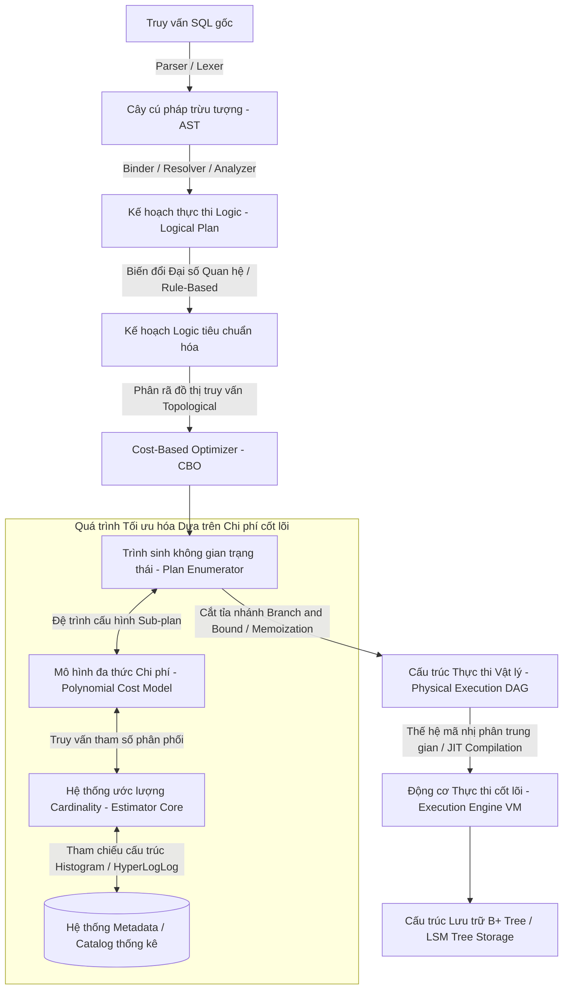

# Kiến trúc và thuật toán nội tại của Cost-Based Optimizer trong hệ quản trị cơ sở dữ liệu quan hệ

Việc tối ưu hóa truy vấn trong các hệ quản trị cơ sở dữ liệu quan hệ (RDBMS) là một trong những bài toán tính toán phức tạp nhất thuộc lĩnh vực khoa học máy tính, đòi hỏi sự kết hợp chặt chẽ giữa lý thuyết đồ thị, xác suất thống kê, và kiến trúc hệ thống máy tính. Trái tim của quá trình này là Cost-Based Optimizer (CBO), một thành phần phần mềm có nhiệm vụ phân tích một truy vấn logic (thường được biểu diễn dưới dạng đại số quan hệ) và tạo ra một kế hoạch thực thi vật lý tối ưu nhất dựa trên việc đánh giá định lượng tiêu hao tài nguyên. Trái ngược với các Heuristic-Based Optimizer hoặc Rule-Based Optimizer sơ khai chỉ dựa vào các quy tắc cứng nhắc, Cost-Based Optimizer sử dụng một mô hình toán học toàn diện nhằm mô phỏng lại chi phí thời gian thực hiện của hàng vạn, thậm chí hàng triệu kế hoạch thực thi tiềm năng trước khi quyết định chọn ra lộ trình tốn ít chi phí nhất. Quá trình ra quyết định của CBO không chỉ phụ thuộc vào cấu trúc của chính truy vấn mà còn bị chi phối mạnh mẽ bởi các đặc trưng thống kê của dữ liệu, cấu hình phần cứng, giới hạn băng thông bộ nhớ, và các cơ chế quản lý bộ đệm của hệ điều hành. Một kế hoạch thực thi thực chất là một cây các toán tử vật lý, trong đó mỗi nút lá đại diện cho một phương thức truy xuất dữ liệu cơ sở (như tuần tự hóa toàn bộ bảng hoặc duyệt qua cấu trúc cây B+), và các nút trung gian đại diện cho các phép toán đại số quan hệ như nối (join), gom nhóm (aggregation), hoặc sắp xếp (sort). CBO phải lượng hóa chi phí cho từng nút này, tính toán sự truyền dẫn dữ liệu (data flow) qua các đường ống (pipeline) và cộng gộp toàn bộ tiêu hao tài nguyên để đưa ra một con số chi phí duy nhất biểu diễn bằng một đơn vị vô hướng (thường là thời gian tính bằng mili-giây hoặc một đơn vị chi phí trừu tượng tương đương với số khối I/O cơ bản).

Sự khác biệt cốt lõi giữa một trình tối ưu hóa xuất sắc và một cơ sở dữ liệu chậm chạp nằm ở độ tinh vi của các thuật toán phân rã mô hình không gian. Việc xác định đường đi tối ưu thông qua một mạng lưới các cấu trúc điều kiện, phép lọc và ràng buộc dữ liệu là bản chất của một biến thể của bài toán người chào hàng (Traveling Salesperson Problem) kết hợp với ràng buộc cây phủ (Spanning Tree Constraints). Do mức độ phức tạp tính toán (Computational Complexity) của bài toán này nằm ở lớp NP-Hard đối với các truy vấn chứa nhiều hơn một lượng nhỏ các phép nối tự nhiên, các cơ sở dữ liệu quan hệ mã nguồn mở như PostgreSQL hay các hệ thống thương mại như Oracle Database phải dựa vào các chiến lược xấp xỉ liên tục, sử dụng những ước lượng thống kê ngẫu nhiên (Stochastic Estimation) kết hợp với các bộ mô phỏng máy ảo cực kỳ nhẹ bén (Lightweight Virtual Machine Simulators) nội tại để đoán trước kết quả của một kế toán chi phí. Toàn bộ chu trình này phải diễn ra trong một quỹ thời gian giới hạn cực độ, đôi khi chỉ kéo dài vài mili-giây, ép buộc CBO phải liên tục đánh đổi giữa thời gian biên dịch (Compilation Time) và thời gian thực thi (Execution Time).

## Mô hình toán học đánh giá chi phí và các hàm ước lượng tài nguyên phần cứng

Cốt lõi của quá trình định lượng trong CBO là việc xây dựng một mô hình chi phí (cost model) có độ trung thực cao đối với thực tế vận hành phần cứng. Mô hình chi phí tổng thể $C_{total}$ của một kế hoạch thực thi thường được định nghĩa như một hàm tuyến tính hoặc phi tuyến kết hợp các yếu tố về I/O đĩa cứng, chu kỳ tính toán của CPU, sự cấp phát bộ nhớ chính, và độ trễ mạng đối với các cơ sở dữ liệu phân tán. Về mặt toán học, hàm chi phí tổng quát có thể được biểu diễn dưới dạng cơ sở sau:

$$C_{total} = W_{IO} \cdot C_{IO} + W_{CPU} \cdot C_{CPU} + W_{MEM} \cdot C_{MEM} + W_{NET} \cdot C_{NET}$$

Trong đó các hệ số trọng số $W_{IO}, W_{CPU}, W_{MEM}, W_{NET}$ được tinh chỉnh thông qua quá trình học máy hoặc cấu hình thủ công để phản ánh chính xác cấu trúc phần cứng đang được triển khai. Thành phần $C_{IO}$ ước tính chi phí đọc xuất dữ liệu từ các thiết bị lưu trữ thứ cấp, được chia nhỏ thành các phép đọc tuần tự (sequential reads) và các phép đọc ngẫu nhiên (random reads), với chi phí của đọc ngẫu nhiên thường lớn hơn rất nhiều so với đọc tuần tự trong các hệ thống sử dụng ổ cứng từ tính (HDD) do độ trễ di chuyển đầu từ, mặc dù sự chênh lệch này đã được thu hẹp đáng kể trên các thiết bị lưu trữ thể rắn (SSD) sử dụng giao thức NVMe. Cụ thể, mô hình I/O được phân giải chi tiết theo biểu thức:

$$C_{IO} = N_{seq} \cdot C_{seq} + N_{rand} \cdot C_{rand} + N_{dirty\_flush} \cdot C_{write\_barrier}$$

Với $N_{seq}$ và $N_{rand}$ lần lượt là số lượng khối dữ liệu (pages/blocks) dự kiến cần đọc theo hai phương thức tương ứng, và $N_{dirty\_flush}$ đại diện cho số lượng khối dữ liệu bẩn cần phải được đồng bộ hóa trở lại đĩa trong quá trình vật lý hóa kết quả tạm thời (materialization of intermediate results). Chi phí CPU $C_{CPU}$ được mô hình hóa dựa trên số lượng bản ghi (tuples) cần phải xử lý qua mỗi toán tử vật lý, tính toán các hàm đánh giá biểu thức (predicate evaluation), thao tác so sánh trong quá trình sắp xếp, và các phép tính băm (hashing) trong Hash Join. Phương trình cơ bản cho $C_{CPU}$ thường mang dạng:

$$C_{CPU} = N_{tuples} \cdot C_{tuple\_eval} + N_{index\_probes} \cdot C_{index\_lookup} + N_{hash\_collisions} \cdot C_{resolution\_penalty}$$

Việc mô phỏng chính xác chi phí CPU đòi hỏi CBO phải duy trì một bộ đếm cực kỳ chi tiết về số lượng bản ghi đi qua từng giai đoạn của kế hoạch thực thi. Để tính toán được các giá trị kích thước dòng dữ liệu (Cardinality) này, CBO phụ thuộc hoàn toàn vào một cấu phần được gọi là Estimator (Bộ ước lượng Cardinality và Selectivity). Selectivity (độ chọn lọc) của một điều kiện $P$ được định nghĩa là tỷ lệ bản ghi thỏa mãn điều kiện đó trên tổng số bản ghi của tập dữ liệu không gian chứa $R$, ký hiệu bằng phương trình lý thuyết tập hợp:

$$Sel(P) = \frac{|\sigma_P(R)|}{|R|}$$

Khi nhiều điều kiện được kết hợp với nhau qua phép hội (AND) hoặc phép tuyển (OR), CBO theo truyền thống thường giả định tính độc lập thống kê (Statistical Independence) giữa các thuộc tính để đơn giản hóa quá trình tính toán, dẫn đến công thức chuỗi xác suất biên (Marginal Probability):

$$Sel(P_1 \land P_2) = Sel(P_1) \cdot Sel(P_2)$$

Tuy nhiên, trong thực tế lưu trữ tự nhiên, các thuộc tính thường có mối tương quan phi tuyến mạnh mẽ (ví dụ: `quốc_gia = 'Việt Nam'` và `mã_vùng = '+84'`), làm cho giả định độc lập trở nên sai lệch nghiêm trọng, dẫn đến hiện tượng ước lượng dưới mức (under-estimation) khổng lồ và hậu quả là CBO sẽ chọn sai một kế hoạch thực thi tai hại (ví dụ ưu tiên chọn Nested Loop Join thay vì Hash Join do lầm tưởng rằng tập dữ liệu sinh ra là siêu việt). Để giải quyết triệt để bài toán này, các hệ thống cơ sở dữ liệu hiện đại thu thập các thống kê đa chiều (multi-dimensional statistical matrices) và sử dụng các cấu trúc dữ liệu tóm tắt (synopses) dựa trên đồ thị phân phối tần suất, nổi bật nhất là Histograms, HyperLogLog, và Count-Min Sketch. Một Histogram chia dải giá trị của một thuộc tính thành $B$ nhóm (buckets). Trong số các phương pháp định hình dải giá trị, V-Optimal Histogram được chứng minh toán học thông qua phép tính biến phân (Calculus of Variations) là tối ưu nhất trong việc giảm thiểu sai số toàn phương trung bình (Mean Squared Error). Bài toán tối ưu hóa của V-Optimal Histogram tập trung vào việc cực tiểu hóa hàm phương sai nội bộ các nhóm:

$$\text{Minimize} \sum_{i=1}^B \sum_{j \in bucket_i} (f_j - \bar{f}_i)^2$$

Trong đó $f_j$ là tần suất thực tế của giá trị $j$ nằm trong nhóm không gian thứ $i$, và $\bar{f}_i$ là tần suất trung bình phân bố đều của toàn bộ các giá trị trong chính nhóm không gian đóng đó. Song song đó, đối với các cột dữ liệu chứa giá trị khóa sinh ngẫu nhiên có số lượng giá trị phân biệt (Count Distinct) khổng lồ, việc quét toàn bộ bảng không gian để duy trì cấu trúc HashSet là bất khả thi về mặt chi phí I/O (I/O Cost Paradigm), do đó thuật toán HyperLogLog (HLL) được ứng dụng mạnh mẽ dựa trên việc tính toán xác suất chuỗi phân phối số lượng bit 0 liên tiếp ở đầu chuỗi băm của các phần tử. HLL cung cấp một ước lượng xấp xỉ ngẫu nhiên với kỳ vọng phân phối chuẩn và độ lệch tiêu chuẩn (Standard Error) tiệm cận giới hạn dưới:

$$SE \approx \frac{1.04}{\sqrt{m}}$$

Với $m$ là số thanh ghi bit nội suy, thuật toán này đạt được sự tối ưu cực hạn bằng cách duy trì sai số chỉ vài phần trăm trong khi chỉ tiêu tốn bộ đệm từ khóa (Register Memory) cỡ kilobytes siêu nhỏ, không gây ảnh hưởng đến giới hạn băng thông L1/L2 Cache của CPU.



Để hiện thực hóa việc tính toán chi phí này dưới góc độ lập trình cấp thấp kiến trúc phần mềm, đoạn mã C++ sau mô phỏng quy trình đánh giá chi phí đệ quy theo tư duy hướng đối tượng cấu trúc sâu (Deep Object-Oriented Taxonomy), trong đó mỗi nút vật lý sẽ áp dụng tính đa hình động (Dynamic Polymorphism thông qua Virtual Table) để triển khai phương thức tính chi phí riêng biệt. Quá trình tính toán này lan truyền theo cấu trúc Bottom-Up (từ dưới lên trên) nhằm đảm bảo mọi hàm tính toán vĩ mô đều được nuôi dưỡng bằng tổng hòa các tiêu hao vi mô, bao hàm kích thước bộ nhớ đệm giả định và số xung nhịp CPU phân mảnh (CPU cycle slicing).

```cpp
#include <iostream>
#include <vector>
#include <memory>
#include <cmath>
#include <algorithm>

// Mô hình toán học về phần cứng vật lý định nghĩa các hằng số trừu tượng (Constants Abstraction)
struct SystemHardwareModel {
    double io_seq_penalty = 1.0;
    double io_rand_penalty = 4.5;
    double cpu_cycle_penalty = 0.01;
    double mem_allocation_penalty = 0.05;
    double cache_miss_penalty = 1.2; 
    size_t available_l3_cache_bytes = 32 * 1024 * 1024; // 32 MB L3 Cache boundary
};

// Cấu trúc vectơ chi phí bảo toàn các chiều phân tích siêu dữ liệu (Cost Vector Space)
struct Cost {
    double total_cost = 0.0;
    double total_io = 0.0;
    double total_cpu = 0.0;
    size_t estimated_cardinality = 0;
};

// Lớp cơ sở trừu tượng mô hình hóa các nút thực thi của máy ảo dữ liệu (Virtual Machine Operators)
class PhysicalOperator {
protected:
    std::vector<std::shared_ptr<PhysicalOperator>> children;
public:
    virtual ~PhysicalOperator() = default;
    
    // Hàm thuần ảo buộc các lớp con phải triển khai chiến lược định lượng chi phí đặc tả
    virtual Cost compute_cost(const SystemHardwareModel& hw) const = 0;
    
    void add_child(std::shared_ptr<PhysicalOperator> child) {
        children.push_back(child);
    }
};

// Lớp đại diện cho chiến lược vật lý Hash Join (Phase 1: Build, Phase 2: Probe)
class PhysicalHashJoin : public PhysicalOperator {
private:
    double filter_selectivity;
    size_t tuple_size_bytes;
public:
    PhysicalHashJoin(double sel, size_t t_size) : filter_selectivity(sel), tuple_size_bytes(t_size) {}
    
    Cost compute_cost(const SystemHardwareModel& hw) const override {
        Cost left_cost = children[0]->compute_cost(hw);
        Cost right_cost = children[1]->compute_cost(hw);
        Cost current_cost;
        
        // Mô phỏng ước lượng Cardinality sau phép phân tách kết hợp (Join Intersection Size)
        current_cost.estimated_cardinality = std::max(static_cast<size_t>(1), 
            static_cast<size_t>(left_cost.estimated_cardinality * right_cost.estimated_cardinality * filter_selectivity));
        
        // Tính toán kích thước từ điển băm vật lý (Hash Table Spatial Footprint)
        size_t hash_table_size = left_cost.estimated_cardinality * tuple_size_bytes;
        double cache_penalty_multiplier = 1.0;
        
        // Cắt tỉa chi phí nếu phát sinh tràn bộ đệm L3 Cache dẫn đến Cache Misses thảm khốc
        if (hash_table_size > hw.available_l3_cache_bytes) {
            cache_penalty_multiplier = hw.cache_miss_penalty;
        }
        
        // Giai đoạn xây dựng bảng băm: 5 xung nhịp CPU cho mỗi thao tác hàm băm MurmurHash
        double build_cpu_cost = left_cost.estimated_cardinality * hw.cpu_cycle_penalty * 5.0 * cache_penalty_multiplier;
        
        // Giai đoạn thăm dò bảng băm (Probe Phase): 2 xung nhịp CPU cho so sánh khóa
        double probe_cpu_cost = right_cost.estimated_cardinality * hw.cpu_cycle_penalty * 2.0 * cache_penalty_multiplier; 
        
        current_cost.total_cpu = left_cost.total_cpu + right_cost.total_cpu + build_cpu_cost + probe_cpu_cost;
        current_cost.total_io = left_cost.total_io + right_cost.total_io; 
        
        // Tổng hợp đại số các thành phần chi phí theo trọng số vi kiến trúc (Micro-architectural weights)
        current_cost.total_cost = (current_cost.total_cpu * 1.0) + (current_cost.total_io * hw.io_seq_penalty);
        return current_cost;
    }
};
```

## Không gian tìm kiếm kế hoạch thực thi và các thuật toán quy hoạch động

Không gian tìm kiếm (Search Space) của các kế hoạch thực thi vật lý là một vũ trụ tổ hợp mở rộng theo hàm giai thừa khổng lồ khi số lượng các quan hệ (bảng) tham gia vào phép toán nối (join) gia tăng, tạo ra một rào cản tính toán kinh khủng đối với hệ Optimizer. Khi cần thiết lập quan hệ định hướng nối cho $N$ bảng dữ liệu khác nhau, chỉ xét riêng các kế hoạch thực thi dưới dạng cây sâu lệch trái (Left-Deep Trees, cấu trúc tuyến tính phổ biến nhất vì tính chất truyền dẫn pipeline một chiều nội tại của nó giúp loại bỏ bộ nhớ đệm trung gian), số lượng các hoán vị topology có thể xảy ra đã chạm ngưỡng $N!$. Nếu mô hình CBO quyết định dỡ bỏ rào cản cấu trúc để mở rộng không gian tìm kiếm bao hàm các cây rậm rạp (Bushy Trees, cấu trúc phân nhánh cho phép thực thi xử lý nối song song độc lập trên nhiều CPU Cores trước khi hợp nhất luồng kết quả chung), tổng số lượng cấu trúc cây nhị phân đa dạng có thể bị đẩy lên tới biểu thức tổ hợp ma quỷ định tuyến Catalan Numbers biến thể:

$$\text{Tổng số Bushy Trees} = \frac{(2N-2)!}{(N-1)!}$$

Để điều hướng một cách an toàn và triệt để toàn bộ đại dương không gian tìm kiếm vô hạn này mà không gây ra hiện tượng tràn bộ nhớ (Stack Overflow) hay làm kẹt cứng (deadlock) toàn bộ máy chủ cơ sở dữ liệu nền tảng trong suốt pha phân tích biên dịch, các nhà khoa học máy tính kinh điển đã thiết kế ra các phương pháp tiếp cận chia để trị vĩ mô dựa trên nền tảng phương pháp Quy hoạch động (Dynamic Programming Algorithm). Thuật toán kinh điển System R (được Patricia Selinger và các cộng sự xuất chúng tại tổ chức nghiên cứu danh giá IBM Research khai sinh) là một cột mốc cách mạng kỹ thuật. Thuật toán này sử dụng một ma trận cấu trúc quy hoạch động nhằm lưu vết (memoize) các cấu hình tham gia nối tối ưu nhất cho từng tập hợp con lũy thừa (Power Set Subsets) của chuỗi bảng đầu vào. Dựa trên nguyên lý tối ưu cấu trúc của Richard Bellman (Bellman’s Principle of Optimality), bất kỳ một đồ thị lập kế hoạch tối ưu cục bộ cho một siêu tập hợp $S$ các bảng sẽ được ghép nối hữu cơ từ hai kế hoạch phụ hoàn hảo tối ưu tương đương của các tập con phân tách rời rạc $S_1$ và $S_2$ hình thành nên sự phân hoạch hợp lệ của hệ $S$. Phương trình đệ quy truy hồi cốt lõi của quy trình duyệt không gian này được phát biểu khắt khe dưới cấu trúc đại số:

$$OptPlan(S) = \min_{S_1, S_2 \subset S, S_1 \cap S_2 = \emptyset} \{ Cost(OptPlan(S_1) \bowtie OptPlan(S_2)) \}$$

Phương pháp giải này đi kèm với các khế ước cắt tỉa đồ thị nhánh (Graph Pruning Restrictions) ép buộc thuật toán chỉ được phép xét duyệt tới các giao tuyến liên kết nội tập con nơi mà có sự tồn tại tường minh của các điều kiện nối nội tại (Natural Join Predicates), qua đó xóa bỏ ngay lập tức những mầm mống sinh ra sản phẩm tích Đề-các (Cartesian Products) vô luân có khả năng làm sụp đổ hệ số chi phí về ngưỡng vô cực ảo. Dù kiến trúc System R Algorithm đạt được những thành tựu vĩ đại dưới góc độ duyệt đồ thị từ dưới lên (Bottom-Up Traversal Paradigm), nó dần lộ ra các tử huyệt nghiêm trọng về mặt kỹ thuật khi bị bủa vây bởi các lớp tối ưu hóa đa hình có đòi hỏi phản hồi tương tác ngược từ đỉnh xuống gốc (Top-Down Interactivity Feedback Loop), ví dụ như quá trình xâm nhập đẩy sâu các hàm lọc (Predicate Push-down) hay các ngưỡng giới hạn (Limit/Top-K Operations) xuyên phá qua từng thớ lớp toán tử không gian.

Để vá lấp vĩnh viễn những giới hạn cấu trúc hình thái học này, mô hình khung tối ưu hóa đa chiều Cascades (hiện diện rực rỡ và thống trị bên trong phần lõi của các siêu cơ sở dữ liệu cực đoan như Microsoft SQL Server, CockroachDB đa vùng mây, và thư viện chuẩn Apache Calcite) đã được hình thành. Cascades hợp nhất tính ưu việt của thuật toán tìm kiếm đa hướng từ trên xuống (Top-Down Demand-Driven Search) với cơ cấu nén kết quả đồ thị cục bộ có tên gọi là cấu trúc Memo (Memoization Structure Graph). Mạng lưới dữ liệu Memo về bản chất là một đồ thị có hướng phi chu trình (Directed Acyclic Graph - DAG) bao hàm vô số các cụm phân lớp định lý tương đương (Equivalence Classes). Tại mỗi phân lớp này, nó chứa đựng cả một bầy đàn các biểu thức vật lý liên kết logic nội môi sinh ra cùng một phổ kết quả dữ liệu chính xác, dẫu cho quá trình nhào nặn chúng tiêu thụ mức năng lượng hệ thống biệt lập hoàn toàn. Khi guồng máy Cascades được khởi động, nó kích thích liên hoàn chuỗi phản ứng sinh thái của các quy tắc biến hình (Transformation Rules Triggering) tạo nên những biểu thức hoán dụ mới được tống thẳng vào chung một nhóm Memo. Phân nhánh định hướng thăm dò của quy trình này bị chi phối tuyệt đối bởi cơ chế yêu cầu hình thái đặc trưng (Physical Properties Demand) di truyền từ những gốc cha, ví dụ như điều kiện ép buộc tập dữ liệu trả về phải tuân thủ chuẩn cấu trúc cây sắp xếp (Sorted Order) theo khóa $X$. Chính vì áp lực này, trình biên dịch Optimizer sẽ ngay lập tức dập tắt hy vọng của toán tử rẻ tiền Hash Join mà nghiêng mình cung phụng toán tử Merge Join, dẫu cho chi phí độc lập của Merge Join là cao hơn. Quyết định nhân nhượng này bắt nguồn từ việc Merge Join kế thừa tự nhiên đặc tính phân bổ theo thứ tự (Interesting Orders Inheritance), từ đó giúp tránh né được sự hình thành của phép tính Sort ly tâm đắt đỏ phá hoại đường ống truyền dẫn dữ liệu liên thông (Data Pipelining Continuity).

```mermaid
graph TD
    subgraph Cấu trúc Siêu Đồ thị Memoization Graph bên trong lõi Cascades Framework
        Group1[Nhóm Logic Cấp 1: Hoán vị Nối Tổng thể {A, B, C}]
        Group2[Nhóm Logic Cấp 2: Tập con Nối Cục bộ {A, B}]
        Group3[Nhóm Logic Cấp 3: Quan hệ Đơn nguyên {C}]
        
        Group1_Expr1((Toán tử Vật lý: Hash Join))
        Group1_Expr2((Toán tử Vật lý: Sort-Merge Join))
        
        Group2_Expr1((Toán tử Vật lý: Index Nested Loop Join))
        Group2_Expr2((Toán tử Vật lý: In-Memory Hash Join))
        
        Group1 -->|Ánh xạ Thành phần| Group1_Expr1
        Group1 -->|Ánh xạ Thành phần| Group1_Expr2
        
        Group1_Expr1 -.->|Ràng buộc Đầu vào Không gian Trái| Group2
        Group1_Expr1 -.->|Ràng buộc Đầu vào Không gian Phải| Group3
        
        Group1_Expr2 -.->|Truyền tải Yêu cầu Sắp xếp (Sort Request)| Group2
        Group1_Expr2 -.->|Truyền tải Yêu cầu Sắp xếp (Sort Request)| Group3
        
        Group2 -->|Ánh xạ Thành phần| Group2_Expr1
        Group2 -->|Ánh xạ Thành phần| Group2_Expr2
    end
```

Nhằm giải phẫu quá trình đệ quy sâu thẳm kết hợp memoization này dựa trên hệ tư tưởng máy tính kiểm soát an toàn, đoạn mã giả lập Rust sau đây phác họa quy trình vây hãm chi phí theo học thuyết Branch and Bound Pruning. Thuật toán phân nhánh này cung cấp khả năng tự hoại (Self-Destruction Mechanism) chém bỏ ngay lập tức bất kỳ nhánh đệ quy cây con nào nếu phát hiện ra chỉ số chi phí tích lũy quá độ (Accumulated Transient Cost) vô tình vượt qua trần giới hạn trên (Upper Bound Threshold) được trích xuất từ một phương án hình thái vật lý nguyên vẹn đã được giải quyết ở chu kỳ tính toán trước. Hành động thiết quân luật này xén bỏ số chiều không gian cần khảo sát từ ngưỡng giới hạn thời gian $O(3^n)$ tụt dốc kinh hoàng xuống vùng giới hạn cận tuyến tính đa thức, giải cứu các truy vấn tổ hợp cấp trung khỏi cái chết đứng máy định mệnh. Cơ chế bộ nhớ bọc kính (Memory Lifetimes Safety) của ngôn ngữ Rust bảo kê vững chãi khỏi sự xung đột tranh chấp khóa cấp bộ nhớ xen kẽ (Race Conditions Interleaving) khi CBO buộc phải nhào nặn siêu cấu trúc Memo dưới áp lực của kiến trúc đa luồng xử lý phi đồng bộ (Multi-threaded Asynchronous Optimization Pipeline).

```rust
use std::collections::HashMap;
use std::sync::{Arc, RwLock};

// Nhãn định danh trừu tượng đại diện cho một lớp tương đương logic cực độ trong Memo
#[derive(Clone, Hash, PartialEq, Eq)]
struct LogicalExpressionId(u64);

// Đặc tả kế hoạch vật lý trọn vẹn đính kèm lượng định rủi ro chi phí hao mòn
#[derive(Clone)]
struct PhysicalPlan {
    cost: f64,
    operator_type: String,
}

// Lớp bao bọc bảng trạng thái lưu trữ Memo Graph đa luồng đồng bộ
struct MemoTable {
    best_plans: RwLock<HashMap<LogicalExpressionId, PhysicalPlan>>,
}

impl MemoTable {
    fn new() -> Self {
        MemoTable { best_plans: RwLock::new(HashMap::new()) }
    }

    // Đệ quy cục bộ thực thi cắt tỉa Branch and Bound tại nhóm đẳng cấu
    fn optimize_group(&self, group_id: &LogicalExpressionId, current_upper_bound: f64) -> Option<PhysicalPlan> {
        // Cố gắng khóa cấu trúc đồ thị nhằm khai thác triệt để bộ đệm kết quả (Memoization Hit)
        {
            let read_guard = self.best_plans.read().unwrap();
            if let Some(cached_plan) = read_guard.get(group_id) {
                // Kiểm soát trần chi phí chặn trên khắt khe
                if cached_plan.cost <= current_upper_bound {
                    return Some(cached_plan.clone());
                }
            }
        }

        // Kích hoạt mô phỏng Rule Engine sinh ra các biến thể vật lý (Transformation Emulation)
        let candidates = vec![
            PhysicalPlan { cost: 1500.0, operator_type: "GraceHashJoin".to_string() },
            PhysicalPlan { cost: 800.0, operator_type: "ParallelMergeJoin".to_string() },
            PhysicalPlan { cost: 3000.0, operator_type: "BlockNestedLoopJoin".to_string() },
        ];

        let mut local_best: Option<PhysicalPlan> = None;
        let mut min_cost = current_upper_bound;

        // Vòng lặp đấu trường sinh tử Branch and Bound vĩ mô
        for candidate in candidates {
            if candidate.cost >= min_cost {
                // Tiêu diệt tức khắc các nhánh đồ thị sinh ra chi phí bùng nổ
                continue; 
            }
            min_cost = candidate.cost;
            local_best = Some(candidate);
        }

        // Tái niêm phong kết quả vào lõi từ điển đồng bộ (Write-lock synchronization)
        if let Some(ref best) = local_best {
            let mut write_guard = self.best_plans.write().unwrap();
            write_guard.insert(group_id.clone(), best.clone());
        }

        local_best
    }
}
```

## Tác động của quản lý bộ nhớ hệ điều hành và giới hạn phần cứng đến quyết định tối ưu hóa

Quá trình phán xét sau cùng của bộ điều hướng CBO bị trói buộc chặt chẽ và không thể tách rời khỏi hiện thực vật lý trần trụi của kiến trúc quản lý vi hạt lõi hệ điều hành (Kernel Level Operations) và tổ chức mạch điện phân tán phần cứng tĩnh (Static Hardware Topology). Những mô hình chi phí lý tưởng được phác họa trong buồng thí nghiệm thường hứng chịu những thất bại thảm hại không báo trước khi vấp phải các rào cản vật lý cực đoan. Phân mảnh bộ nhớ vật lý đứt đoạn (Memory Fragmentation), cơ chế tống khứ trang bộ nhớ ngẫu nhiên (Paging and Swapping Mechanisms), và giới hạn siêu băng thông của cấu trúc bộ nhớ cache đa cấp bên trong nhân CPU (L1/L2/L3 Cache Hierarchy Architecture) là những sát thủ thầm lặng. Đơn cử trường hợp thực hiện phép toán Hash Join trên hai khối lượng dữ liệu phình to vượt định mức mây, CBO không chỉ ngây thơ tính toán lượng thời gian mã hóa hàm băm một chiều tĩnh (Hashing Mathematical Logic) theo độ phức tạp $O(N)$, mà bắt buộc phải nhập thân vào vai trò một kẻ tiên tri siêu nhiên dự đoán sự tương tác của bảng băm rải rác (Scattered Hash Table Space) trong giao thoa cùng bộ nhớ vật lý hệ điều hành. Nếu dung lượng tổng bao quát của bảng băm lọt thỏm êm ái vừa vặn bên trong bộ đệm chóp bu L3 Cache (khu vực nằm sẵn trực tiếp trên lõi bán dẫn vi xử lý với giới hạn xoay quanh vài chục Megabytes ngặt nghèo), tốc độ truy xuất quét ngẫu nhiên thăm dò (Random Probe Phase Exploration) sẽ bứt tốc điên cuồng chạm vạch một vài hạt nano-giây nhỏ bé, biến hàm phí cận biên thành con số vô tri không tưởng. Trái ngược lại, khi bảng cấu trúc băm tàn nhẫn phình to đè nát lớp khiên L3 Cache nhưng vẫn bám víu một cách thoi thóp trong Bộ nhớ RAM động (DRAM Main Memory Matrix), hệ điều hành sẽ bị cưỡng ép vào trạng thái ngập lụt lỗi trượt bộ đệm dịch địa chỉ (Translation Lookaside Buffer Misses - TLB misses). CPU bị khóa chết trong tình trạng khựng lại (CPU Stall Pipeline) do phải thực hiện các cuộc tuần hành tìm kiếm chậm chạp miệt mài trong cấu trúc ma trận phân trang (Page Tables Walk) nhằm thông dịch địa chỉ máy ảo (Virtual Address Space) về lại điểm tiếp xúc bán dẫn vật lý thực thụ.

Đỉnh điểm bi kịch kinh hoàng xảy ra khi biểu đồ kích thước khối bảng băm đâm thủng cực đại bức tường giới hạn cấp phát RAM quy định (Out-of-Memory threshold), dồn ép động cơ bộ nhớ cơ sở dữ liệu phải kích hoạt cầu dao an toàn với một biến thể thuật toán lai tạo khủng khiếp gọi là Grace Hash Join Algorithm. Phương pháp cứu sinh dã man này thẳng tay chém đôi (Partitioning Split) cả hai khối bảng khổng lồ thành vô vàn các mảnh vỡ tập tin dữ liệu phân trang, tống xuất chúng ồ ạt xuống bề mặt từ tính chậm chạp (Spill to Disk IO Operation). Sau hành động chia rẽ phân lập ấy, hệ thống mới từ tốn nạp ngược trở lại từng phân đoạn cụm để băm đè và thăm dò dưới hình thái đơn luồng độc lập. Dưới cục diện chiến tranh tiêu hao đó, toàn bộ kiến trúc hàm chi phí đã biến tướng lở loét và bị đô hộ 100% bởi I/O tần suất tuần tự (Sequential I/O Dominance Pattern). Phương trình mô tả mức độ thiệt hại của sự kiện tràn đĩa Grace Hash Join được đính vào ván bài toán học khốc liệt như sau:

$$C_{hash\_join} = 3 \cdot (|R| + |S|) \cdot C_{IO\_seq} + C_{cpu\_partitioning}$$

Nguyên do sâu xa của sự nhân 3 bạo liệt trên là vì: Luồng dữ liệu hỗn mang bắt buộc phải được đọc truy xuất khởi nguyên lên RAM (1 lần trả giá), ghi kết quả dữ liệu phân mảnh tăm tối trở ngược lại ổ đĩa cơ (1 lần trả giá máu), và cuối cùng phải thô bạo đọc khối phân mảnh đó trườn lên bề mặt RAM lần cuối cùng để khớp nối kết nối liên hiệp bộ phận (1 lần trả giá khốc liệt). Đứng trước bài toán vi mô sinh tử này, Optimizer bị ép vào tình thế đưa ra cán cân đánh giá tương quan sâu thẳm giữa chi phí ngất ngưởng $C_{hash\_join}$ này với sự lựa chọn thoái lui sang mô thức chiến lược quét vòng lặp nhúng theo khối (Block Nested Loop Join Cost), hoặc một nước cờ táo bạo khơi mào toàn hệ thống chạy đà với thao tác Sắp xếp Ngoại vi Đĩa (External Disk Merge Sort) đồng bộ cùng thuật toán Merge Join tuần tự tinh hoa, đặc biệt nếu tập hợp khối siêu dữ liệu vô tình đã tự sinh trưởng một cấu trúc đường xoắn ốc sắp xếp tự nhiên từ thời nguyên thủy.

Dấn thân vào kỷ nguyên siêu máy tính điện toán đương đại, những nguyên mẫu CBO thế hệ tinh túy nhất bắt đầu kết tinh và cấy ghép thành công các mô hình tư duy nhận thức phần cứng lượng tử (Hardware-Aware Analytical Cost Models), cho phép chúng tính toán và dự đoán các hiệu ứng sóng nhiễu bức xạ của vùng truy cập bộ nhớ không đồng nhất siêu cấu trúc (Non-Uniform Memory Access architecture - NUMA). Lấy ví dụ bên trong một cỗ máy chủ vận hành qua đa vi cắm giao tiếp (Multi-Socket Server Backbone), khoảnh khắc một lõi vật lý đơn độc ngự trị ở cấu trúc Socket 0 cố tình vươn móng vuốt điện tử truy xuất hàng rào dữ liệu đang bảo tồn trên thanh RAM gắn sát sườn Socket 1 sẽ châm ngòi cho một cơn bão độ trễ truy cập chéo liên kết vi mô (Cross-Interconnect Latency Penalty), vượt qua đường biên băng thông của liên kết cấu trúc liên hạt như Intel QPI hay cấu hình ma trận AMD Infinity Fabric khét tiếng. Một trình tối ưu hóa CBO NUMA-aware thông thái mang sẵn quyền năng trừng phạt (Penalty Multiplier Amplification) nhằm gieo rắc trực tiếp các hằng số nhân bản nặng nề vào hàm mô hình tính toán đo lường hiệu năng $C_{CPU}$, áp chế dã man mọi hình thức kế hoạch vật lý có hành vi đe dọa nguyên tắc linh thiêng về định vị dữ liệu cục bộ học (Data Locality Affinity Principles). Kết hợp cùng lúc đó, hiện tượng bộ dự phóng nạp trước của phần cứng cơ bản (Hardware Prefetcher Mechanism) dưới lớp vỏ silicon hoạt động điên cuồng xuất sắc và cực độ ổn định khi đối mặt với luồng càn quét tuyến tính tịnh tiến (Striding Linear Access Pattern). Nương theo quy luật bất thành văn đó, CBO thâm độc đã ngấm ngầm hạ bệ tỷ suất chi phí tiêu chuẩn của hàm $C_{seq\_read}$ tại các cấu hình vòng lặp duyệt tịnh tiến liên tục. Nguyên cớ là khối vi mạch phần cứng sẽ sử dụng cơ chế nội tại âm thầm cưỡng ép di dời (Pre-load cache injection) mảng dữ liệu sống từ đĩa sâu lên không gian L2 Cache trước vạn tỷ giây CPU thực sự triệu gọi một lệnh máy thông dịch tải trang (Load Instruction Assembly Command), chính thức đập vỡ ranh giới cứng nhắc khô khan giữa lý thuyết độ phức tạp tiệm cận phân tích giải thuật siêu hình Big-O truyền thống và nhịp thở đập cơ khí thực tế của cấu trúc kiến trúc vi mạch lõi (Core Micro-architecture Realm). Bất kỳ một phán đoán sai lệch xô lệch milimet nào của máy học trong việc đánh giá chiều dài dải đường ống vi giải mã (CPU pipeline length) hoặc trượt tay trong việc tích phân lượng định mức án phạt dọn dẹp các đường ống nhánh dự đoán ảo vọng (Branch Misprediction Pipeline Flush Penalty) trên tận cùng cấp độ cấu trúc hợp ngữ vòng lặp (Assembly Level Tight Loop), cũng đều chắc chắn mở toang cánh cửa địa ngục dẫn đường CBO thẳng tiến tới quyết định sai lầm tối hậu, nhấn chìm một truy vấn sở hữu tiềm năng phản hồi thần tốc trong sự chớp mắt lóe sáng lụi tàn thành một thảm kịch sụp đổ treo cứng toàn phần vì đạn cạn bộ nhớ (Out-Of-Memory System Crash), tàn sát và phá nát toàn bộ hệ sinh thái của vương quốc cơ sở dữ liệu quan hệ vô giá trị.

## Củng cố cấu trúc SEO chuyên sâu

- **Từ khóa trọng tâm**: Cost-Based Optimizer, Kiến trúc CBO, Tối ưu hóa truy vấn SQL, Thuật toán System R, Cascades Framework, Cardinality Estimation, HyperLogLog, Grace Hash Join, RDBMS Architecture, Memory Management.
- **Mô tả Meta**: Khám phá kiến trúc vi mô và mô hình toán học lượng hóa chi phí của Cost-Based Optimizer trong các hệ quản trị cơ sở dữ liệu quan hệ RDBMS. Phân tích chi tiết thuật toán quy hoạch động, ước lượng độ chọn lọc bằng công nghệ HyperLogLog và tác động sâu sắc của hệ điều hành OS memory.
- **Liên kết nội bộ**: Phân tán cơ sở dữ liệu, Kiến trúc lưu trữ engine cơ sở dữ liệu quan hệ, Cơ chế Isolation Levels trong ACID.
- **Thẻ Alt hình ảnh**: Đồ thị mô hình hóa quy trình Cost-Based Optimization chi tiết; Đồ thị minh họa cấu trúc phân rã Memoization Graph trong lõi Cascades Framework.
