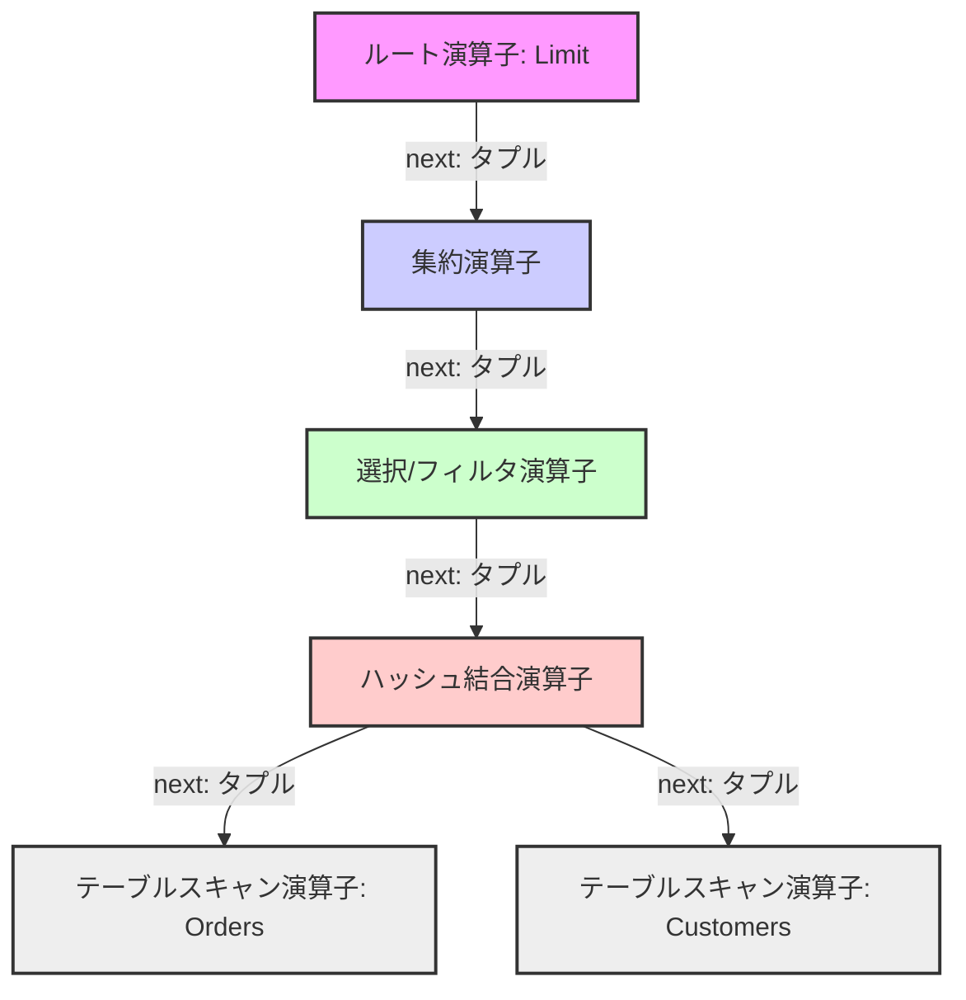
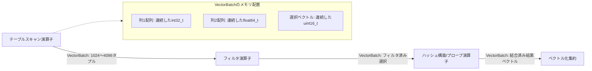

# Volcanoモデル対 ベクトル化クエリ実行 ― 現代データベースエンジンにおける比較

## エグゼクティブサマリー

リレーショナルデータベースのクエリ実行エンジンは、この30年でまったく違う顔つきになった。背景にあるのは半導体ハードウェアの進化そのもので、複雑な分析クエリをどう評価するかという発想自体が変わってきている。

データベース黎明期には、ハードディスク(HDD)のI/O帯域幅がほぼすべてを決めるボトルネックだった。ディスクが遅い時代には、**Volcanoイテレータモデル**が自然な答えだった。エレガントで、どんな演算子とも自由に組み合わせられる抽象化を提供してくれたからだ。ところがCPUの処理能力、コア数、メインメモリの容量が指数関数的に伸びるにつれ、この古典的なVolcanoモデルは現代のハードウェア上でボロが出始めた。クロックあたりの命令数(IPC)が信じられないほど低くなってしまうのだ。

このギャップを埋めるために生まれたのが**ベクトル化クエリ実行(Vectorized Query Execution)**である。この記事では両方の実行モデルについて、アルゴリズムの中身、メモリアクセスの経路、OSとの関わり方、そしてハードウェアの限界まで踏み込んで比較する。読み終える頃には、現代のデータベースがシリコンレベルで何をしているのか、旧来のアーキテクチャが抱える問題点、そしてエンジンを最適化する上で押さえておくべきポイントが見えてくるはずだ。

---

## はじめに:なぜ性能に桁違いの差が生まれるのか

**問い:** まったく同じハードウェアで動かしているのに、なぜ一部のデータベースエンジンだけが分析クエリ(OLAP)を桁違いに速く処理できるのか。

答えはアルゴリズムのビッグO記法のような理論的な複雑性にあることはまずない。実際の差は、その高レベルなアルゴリズムを正確なCPU命令とメモリアクセスへどう機械的に落とし込むか、という部分に潜んでいる。古いデータベースエンジンは、ディスクがボトルネックでCPUが暇を持て余していた時代に設計されたものだ。今はデータの多くがRAM上に丸ごとキャッシュされており(インメモリデータベース)、ボトルネックはCPUがメモリからデータを引っ張ってくる速さ(メモリ帯域幅)、命令のデコード、そして実行パイプラインをどれだけ埋め続けられるかへと移っている。

従来型のクエリ実行モデルを現代のスーパースカラCPUで走らせると、CPU使用率がお粗末なほど落ち込む。CPUは意味のある演算をこなす代わりに、メモリ待ちでストールしたり、投機実行の予測ミスから立て直したりすることにクロックサイクルの大半を費やしている。このソフトウェアとハードウェアの現実とのズレこそ、ベクトル化実行が向き合っている中心課題だ。

---

## Volcanoモデルとタプル単位のパイプライン処理

Volcanoイテレータモデルは1990年代初頭にGoetz Graefeが正式に提唱したもので、物理的なクエリ実行を物理演算子の有向非巡回グラフ(たいていは木構造)として組み立てる。各演算子ノードは選択・射影・結合・集約といった特定のリレーショナル代数演算に対応する。

### アーキテクチャとデータフロー
Volcanoモデルを特徴づけているのは、`open()`、`next()`、`close()`という3つの仮想メソッドで定義される、非常に標準化された**タプル単位の手続き型インターフェース**だ。データは葉ノードからルートノードへ一方向に流れていく。



親演算子が`next()`を呼び出すと、子演算子は自分の内部状態を進め、さらに自分の子から`next()`でデータを取り、ロジックを適用して、完全にマテリアライズされたタプルを1つ返す。この繰り返しだ。

### 効率という幻想
このパイプライン化された需要駆動型のやり方は、中間結果をほとんどマテリアライズしないので、従来のディスクベースのシステムではメモリ効率がかなり良かった。ところが現代のスーパースカラCPUの上に乗せると、話は変わってくる。マイクロアーキテクチャ的なオーバーヘッドがあちこちで積み重なっていくのだ。

### 解釈オーバーヘッドと仮想呼び出し
非効率の主な原因は、**仮想関数呼び出し(動的ディスパッチ)**を多用していることにある。物理演算子は共通インターフェースを継承した多態的なサブクラスとして実装されるため、`next()`を呼ぶたびに構造的に動的ディスパッチが発生する。

現代のマイクロアーキテクチャでは、分岐ターゲットバッファ(BTB)が飛び先を正しく予測できないと、間接分岐は実行パイプラインを止めてしまう。数十億のタプルを処理する深いVolcano実行木では、BTBが激しくキャパシティミスを起こし、予測ミスが延々と続く。

$$T_{volcano} \approx \sum_{i=1}^{N} \sum_{j=1}^{D} \left( C_{vcall}^{(i,j)} + C_{logic}^{(i,j)} + P_{miss}^{(i,j)} \times C_{penalty} \right)$$

この式では、単純な演算の実行時間を$C_{vcall}$がしばしば支配してしまう。手続き的な制御フローを回すために必要なアセンブリ命令の量が、実際にリレーショナルロジックを実行する命令の数をはるかに上回るからだ。

### キャッシュスラッシングと行指向ストレージ
さらにVolcanoモデルは、N分ストレージモデル(NSM)、つまり**行指向ストレージ**に従うデータをそのまま扱う。行指向タプルの特定フィールドだけを読もうとすると、メモリアクセスがあちこちに散らばる。現代のプロセッサはDRAMから64バイト単位(キャッシュライン)でメモリを取ってくる。射影演算子が256バイトのタプルからたった4バイトの整数しか必要としなくても、ハードウェアは64バイト分まるごと取得してしまい、メモリ帯域幅を無駄に食いつぶす。

```cpp
// Volcano実行をモデル化するC++疑似コード
class PhysicalOperator {
public:
    virtual Tuple* next() = 0; 
};

class FilterOperator : public PhysicalOperator {
private:
    PhysicalOperator* child_;
    Predicate* pred_;
public:
    Tuple* next() override {
        // 木を下る繰り返しの仮想呼び出しがBTBの予測性を破壊する
        while (Tuple* t = child_->next()) {
            if (pred_->evaluate(t)) return t;
        }
        return nullptr;
    }
};
```

---

## ベクトル化クエリ実行とハードウェアとの共生

**ベクトル化クエリ実行**は、スーパースカラのシリコンと歩調を合わせる(メカニカル・シンパシー)ことを狙って、ゼロから設計し直されたアーキテクチャだ。MonetDB/X100(VectorWise)が切り開いたこのパラダイムは、タプル単位のやり方をきっぱり手放す。

### データフロー優位への転換
個々のタプルを処理する代わりに、演算子同士は**列指向形式でぎっしり整理された、固定サイズのタプルのバッチ**(VectorBatch)をやり取りする。実用上の最適なベクトルサイズはだいたい1024から4096要素で、この範囲はワーキングセットがCPUのL1またはL2データキャッシュに収まるように選ばれている。



膨大な数のタプルをまとめて処理することで手続き的な制御フローのコストを分散させ、ベクトル化実行は仮想関数呼び出しの影響を大きく薄める。`next()`メソッドは単一の`Tuple`ポインタではなく`VectorBatch`参照を返すようになり、計算の性格自体が制御フロー優位から**データフロー優位**へと変わる。

### 密なインナーループとCPUプリフェッチ
演算子がベクトルバッチを処理するとき、リレーショナルロジックは密で連続的な配列を順に舐めていくだけの、拍子抜けするほど単純な`for`ループとして実装される。

この列指向レイアウトは、CPUキャッシュ階層が前提としている空間局所性にぴったり合う。シーケンシャルなメモリアクセスはハードウェアのストライドプリフェッチャーやネクストラインプリフェッチャーを確実に働かせ、実行ユニットが要求する前にキャッシュラインをDRAMからL1/L2へ運び込んでくれる。結果としてメモリレイテンシがうまく隠れ、メモリ帯域幅がほぼ飽和するまで使い切れる。

```rust
// ベクトル化実行を示すRust疑似コード
struct VectorBatch {
    columns: Vec<Vec<u8>>, 
    selection_vector: Vec<u16>, 
    count: usize,
}

impl FilterOperator {
    fn next_batch(&mut self) -> Option<VectorBatch> {
        let mut batch = self.child.next_batch()?;
        let data = get_typed_column::<i32>(&batch, self.filter_col_idx);
        let mut new_sel = Vec::with_capacity(batch.count);
        
        // 自動ベクトル化に非常に適した密なインナーループ
        for i in 0..batch.count {
            let row_idx = batch.selection_vector[i] as usize;
            // 分岐のない評価
            if data[row_idx] > self.threshold {
                new_sel.push(row_idx as u16);
            }
        }
        
        batch.selection_vector = new_sel;
        batch.count = batch.selection_vector.len();
        Some(batch)
    }
}
```

ベクトル化された処理時間($T_{vectorized}$)の式を見ると、構造的な制御オーバーヘッドがどこまで償却されるかがよくわかる。

$$T_{vectorized} \approx \sum_{j=1}^{D} \left( \frac{N}{B} \times C_{vcall}^{(j)} + \sum_{k=1}^{N/B} C_{vector\_logic}^{(j,k)} \right)$$

ベクトルバッチサイズ$B$を大きくしていくほど、解釈にかかるコストは償却されてほぼゼロに近づく。実行速度を決めるのは、最終的にハードウェアのメモリ帯域幅($BW_{dram}$)とALUのスループットだけになる。

---

## SIMD(単一命令・複数データ)の力

ベクトル化のなかでも特に効いてくるのが、SIMDアーキテクチャ(Intel AVX-512、ARM SVE)との相性の良さだ。これらの命令セットは、1クロックの命令で複数のスカラーデータ要素を同時に処理できる。

ベクトル化エンジンはプリミティブ型を連続した配列に格納しているので、現代のコンパイラ(LLVM/GCC)は密なインナーループを**自動ベクトル化**できる。あるいはデータベースエンジニアが明示的にSIMDイントリンシクスを使うこともある。1本のAVX-512命令だけで、32ビット整数の比較を16個まとめて実行できてしまう。

$$T_{vectorized\_simd} \approx \frac{N}{B} \times C_{vcall} + N \times \frac{C_{vector\_logic}}{W_{simd}}$$

分岐予測ミスを根絶するため、ベクトル化エンジンは**分岐のないプログラミング**を選ぶ。`if`文の代わりに、ビット演算やSIMDのマスク演算を使って選択ベクトルやビットマップを計算する。制御の依存関係をデータの依存関係へと置き換えることで、CPUパイプラインは常にフル稼働に近い状態を保ち、分岐予測器の限界に足を引っ張られずに済む。

---

## マイクロアーキテクチャ的な比較分析

マイクロアーキテクチャの動きまで踏み込んで比べると、両者の差はかなりはっきり見えてくる。

- **リオーダーバッファ(ROB)の飽和:** Volcanoモデルの頻繁な仮想呼び出しは事実上の直列化バリアとして働き、ROBを空腹状態にする。ベクトル化ループはROBに独立した命令を大量に供給できるので、積極的な動的ループアンローリングと複数ALUをまたいだ並行実行が可能になる。
- **TLBスラッシング:** TLB(トランスレーション・ルックアサイド・バッファ)は仮想アドレスを物理アドレスに変換する役目を持つ。Volcanoの断片化したヒープ割り当ては激しいTLBスラッシングを引き起こし、コストの高いページテーブルウォークを誘発する。ベクトル化エンジンは巨大で事前割り当て済みの列指向チャンクの上で動くので、空間局所性がきれいに保たれる。透過的巨大ページ(1GBブロック)と組み合わせれば、TLBミスはほぼ消える。
- **ハッシュ結合でのソフトウェアパイプライン化プリフェッチ:** Volcanoでは、ハッシュテーブルをタプルごとにプローブするせいで、ロジックとランダムメモリアクセス(CPUストール)が密に絡み合ってしまう。ベクトル化実行では、ループフィッションによってハッシュ結合のフェーズを切り分ける。SIMDでベクトルのハッシュをまとめて計算し、バケットへの明示的なソフトウェアプリフェッチ命令(`__builtin_prefetch`)を発行してから、別のループで比較を行う。こうすることで、レイテンシの高いメモリアクセスとCPU計算を物理的に重ね合わせられる。

---

## 教訓とベストプラクティス

1. **メカニカル・シンパシーは避けて通れない:** ソフトウェアアーキテクチャは、CPUを何でも屋の汎用チューリングマシンとして扱うわけにはいかない。極限の性能を引き出すには、SIMD、キャッシュライン、TLB階層、OoO(アウト・オブ・オーダー)パイプラインといったシリコンの特性を意識してソフトウェアを設計する必要がある。
2. **制御フローよりデータフロー:** 分析ワークロードでは、条件分岐からデータ操作(ビットマップ、選択ベクトル)へ発想を切り替えることで、データの偏りに左右されない、決定論的で高スループットな実行が得られる。
3. **OLAPでは列指向が主役:** ストレージ形式と実行形式は噛み合っていなければならない。行指向のVolcanoエンジンに列指向ストレージを与えると、タプルの再構築が絶えず発生し、せっかくの利点が相殺されてしまう。列指向ストレージ(Parquet、ORC)とベクトル化実行の組み合わせが、分析性能では今のところ最良の選択だ。
4. **解釈オーバーヘッドは軽視できない:** 仮想関数のような抽象化は、システムプログラミングにおいて「ゼロコスト」であることはめったにない。密でデータ量の多いループでは、多態的なディスパッチが命令パイプラインの効率を大きく損なう。
5. **メモリ帯域幅が最後の壁になる:** ベクトル化でCPUサイクルの無駄を削り切った後は、性能はRAMがどれだけ速くデータを供給できるかで決まってくる。データの配置管理とメモリフットプリントの最小化は、依然として重要な課題として残る。

---

## 結論

VolcanoモデルとVectorized実行モデルの構造的な違いは、システムエンジニアリングにおけるもっと広い原則を映し出している。データ量が指数関数的に増え、ムーアの法則が単一スレッドのクロック速度に物理的な天井を課している以上、ハードウェアを無視したエンジン(Volcano)とハードウェアと歩調を合わせるエンジン(Vectorized)の差は、これからも開いていく一方だろう。ベクトル化クエリ実行は、超大規模な分析データ処理を支えるアーキテクチャの土台として定着しつつあり、データベースがシリコンレベルでどう働くかという理解そのものを塗り替えた。
