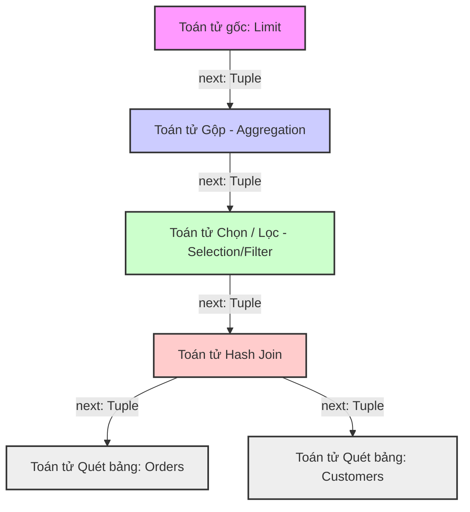

# Mô hình Volcano và Thực thi Truy vấn theo Vector trong các Engine Cơ sở dữ liệu Hiện đại

## Tóm tắt Điều hành

Cách các engine thực thi truy vấn (Query Execution Engine) của cơ sở dữ liệu quan hệ được thiết kế đã thay đổi khá nhiều trong ba thập kỷ qua. Lý do chính không nằm ở lý thuyết mới, mà ở phần cứng: kiến trúc bán dẫn tiến hóa với tốc độ cấp số nhân, và cách người ta nghĩ về việc đánh giá các truy vấn phân tích phức tạp cũng buộc phải thay đổi theo.

Ở giai đoạn đầu của cơ sở dữ liệu, băng thông I/O của ổ đĩa cứng (HDD) gần như quyết định mọi thứ — đó là điểm nghẽn tuyệt đối. Trong bối cảnh bị ràng buộc bởi đĩa cứng đó, **mô hình lặp Volcano (Volcano Iterator Model)** nổi lên gần như là lựa chọn hiển nhiên: nó cung cấp một cách trừu tượng hóa gọn gàng, có thể ghép nối tự do giữa các toán tử. Nhưng khi CPU, số lượng lõi, và dung lượng RAM tăng vọt theo quy luật thu nhỏ bán dẫn, mô hình Volcano cổ điển bắt đầu bộc lộ những điểm yếu mang tính cấu trúc trên phần cứng hiện đại — số lệnh thực thi mỗi chu kỳ (IPC) tụt xuống mức đáng thất vọng.

Khoảng cách kiến trúc này là lý do trực tiếp dẫn tới sự ra đời của **Thực thi Truy vấn theo Vector (Vectorized Query Execution)**. Bài viết này đi sâu vào cả hai mô hình thực thi — thuật toán nền tảng, cách chúng truy cập bộ nhớ, tương tác với hệ điều hành, và những giới hạn vật lý của phần cứng mà chúng phải đối mặt. Qua đó, bạn sẽ thấy rõ cơ sở dữ liệu hiện đại xử lý dữ liệu ở cấp độ silicon như thế nào, vì sao kiến trúc cũ gặp khó, và những bài học nào đáng để áp dụng khi tối ưu một engine cơ sở dữ liệu.

---

## Vấn đề cốt lõi: Vì sao có sự chênh lệch hiệu năng hàng bậc?

**Câu hỏi đặt ra:** Tại sao trên cùng một phần cứng, một số engine cơ sở dữ liệu lại chạy các truy vấn phân tích (OLAP) nhanh hơn hẳn — không phải vài phần trăm, mà là cả một bậc độ lớn?

Câu trả lời hiếm khi nằm ở độ phức tạp lý thuyết của thuật toán (kiểu ký hiệu Big O). Thực ra chênh lệch hiệu năng bắt nguồn từ việc các thuật toán cấp cao đó được dịch một cách máy móc thành lệnh CPU cụ thể và các lượt truy cập bộ nhớ theo cấp bậc ra sao. Các engine cũ được thiết kế cho thời mà đĩa cứng là nút thắt cổ chai và CPU lúc nào cũng phải chờ. Còn bây giờ, dữ liệu thường nằm gọn trong RAM (cơ sở dữ liệu in-memory), và điểm nghẽn đã chuyển hẳn sang khả năng CPU lấy dữ liệu từ bộ nhớ (băng thông bộ nhớ), giải mã lệnh, và giữ cho đường ống thực thi luôn bận rộn.

Khi chạy các mô hình thực thi truyền thống trên CPU siêu vô hướng (superscalar) đời mới, ta thấy mức sử dụng CPU tụt xuống một cách đáng ngạc nhiên. Phần lớn chu kỳ đồng hồ, CPU không hề tính toán gì có ích — nó đang chờ bộ nhớ hoặc đang phục hồi sau một cú đoán nhánh sai. Khoảng cách giữa kiến trúc phần mềm và thực tế phần cứng chính là vấn đề mà thực thi theo vector ra đời để giải quyết.

---

## Mô hình Volcano và Cơ chế Xử lý Từng Bản ghi Một

Mô hình lặp Volcano, do Goetz Graefe giới thiệu chính thức đầu những năm 1990, triển khai việc thực thi truy vấn vật lý dưới dạng một đồ thị có hướng không chu trình (thường là cây) gồm các toán tử vật lý. Mỗi toán tử ứng với một phép toán đại số quan hệ cụ thể: chọn, chiếu, nối, gộp.

### Kiến trúc và Luồng Dữ liệu
Điểm đặc trưng của mô hình Volcano là **giao diện thủ tục xử lý từng bản ghi một** được chuẩn hóa cao, định nghĩa qua ba phương thức ảo: `open()`, `next()`, `close()`. Dữ liệu chảy theo một chiều, từ các nút lá lên tới nút gốc.



Khi toán tử cha gọi `next()`, toán tử con xử lý máy trạng thái nội bộ của nó, lấy dữ liệu từ các con của chính nó qua các lệnh `next()` tiếp theo, áp dụng logic, và trả về đúng một bản ghi đã vật chất hóa hoàn chỉnh. Cứ thế lặp lại cho từng dòng.

### Ảo tưởng về hiệu quả
Cách tiếp cận theo đường ống, hướng theo nhu cầu này khá tiết kiệm bộ nhớ trên các hệ thống dựa trên đĩa cũ, vì kết quả trung gian hiếm khi bị vật chất hóa. Nhưng đưa lên CPU siêu vô hướng hiện đại thì mọi chuyện khác hẳn — chi phí vi kiến trúc bắt đầu chồng chất và ăn mòn hiệu năng một cách có hệ thống.

### Chi phí thông dịch và các lệnh gọi ảo
Nguồn gốc chính của sự kém hiệu quả nằm ở việc dùng tràn lan **lệnh gọi hàm ảo (dynamic dispatch)**. Vì các toán tử vật lý được cài đặt dưới dạng lớp con đa hình kế thừa từ một giao diện chung, mỗi lần gọi `next()` đều buộc phải điều phối động về mặt cấu trúc.

Trên các vi kiến trúc hiện đại, một nhánh rẽ gián tiếp sẽ làm đình trệ đường ống thực thi nếu Bộ đệm Đích Nhánh (BTB) của CPU đoán sai điểm đến. Trong một cây thực thi Volcano sâu, xử lý hàng tỷ bản ghi, BTB liên tục bị trượt bộ đệm, kéo theo hàng loạt dự đoán sai dai dẳng.

$$T_{volcano} \approx \sum_{i=1}^{N} \sum_{j=1}^{D} \left( C_{vcall}^{(i,j)} + C_{logic}^{(i,j)} + P_{miss}^{(i,j)} \times C_{penalty} \right)$$

Trong công thức này, $C_{vcall}$ thường chiếm phần lớn thời gian thực thi cho những phép toán đơn giản. Số lượng lệnh hợp ngữ cần để điều phối luồng điều khiển thủ tục lớn hơn nhiều so với số lệnh thực sự thực hiện logic quan hệ.

### Rối loạn bộ đệm và lưu trữ theo hàng
Thêm vào đó, mô hình Volcano vốn xử lý dữ liệu theo Mô hình Lưu trữ N-ngôi (NSM), tức **lưu trữ định hướng theo hàng**. Đọc một trường cụ thể trong bản ghi kiểu hàng khiến các lượt truy cập bộ nhớ bị rải rác. Các bộ xử lý hiện đại nạp dữ liệu từ DRAM theo khối 64-byte căn chỉnh (cache line). Nếu một toán tử chiếu chỉ cần một số nguyên 4-byte trong bản ghi 256-byte, phần cứng vẫn phải nạp cả đường bộ đệm 64-byte, lãng phí băng thông bộ nhớ quý giá.

```cpp
// Mã giả C++ mô phỏng việc thực thi theo mô hình Volcano
class PhysicalOperator {
public:
    virtual Tuple* next() = 0; 
};

class FilterOperator : public PhysicalOperator {
private:
    PhysicalOperator* child_;
    Predicate* pred_;
public:
    Tuple* next() override {
        // Lệnh gọi ảo lặp đi lặp lại xuống theo cây, phá hủy khả năng dự đoán của BTB
        while (Tuple* t = child_->next()) {
            if (pred_->evaluate(t)) return t;
        }
        return nullptr;
    }
};
```

---

## Thực thi Truy vấn theo Vector và Sự Cộng hưởng với Phần cứng

**Thực thi Truy vấn theo Vector** là một cuộc thiết kế lại gần như từ đầu, nhắm thẳng vào việc tận dụng tối đa phần cứng và đạt được "sự đồng cảm cơ học" với silicon siêu vô hướng. Được MonetDB/X100 (VectorWise) tiên phong, mô hình này bỏ hẳn cách xử lý từng bản ghi một.

### Chuyển sang ưu thế luồng dữ liệu
Thay vì xử lý từng bản ghi rời rạc, các toán tử giao tiếp bằng cách truyền các **lô (batch) dày đặc, kích thước cố định, tổ chức theo định dạng cột** (VectorBatch). Kích thước vector tối ưu thường rơi vào khoảng 1024 đến 4096 phần tử — con số này được chọn sao cho tập làm việc vừa khít trong bộ đệm L1 hoặc L2 của CPU.

```mermaid
graph LR
    Scan[Toán tử Quét bảng] -->|VectorBatch: 1024-4096 Bản ghi| Filter[Toán tử Lọc]
    Filter -->|VectorBatch: Kết quả đã lọc| Hash[Toán tử Xây dựng/Thăm dò Hash]
    Hash -->|VectorBatch: Vector kết quả đã Join| Agg[Toán tử Gộp theo Vector]
    
    subgraph Cấu trúc Bộ nhớ của VectorBatch
        C1[Mảng Cột 1: int32_t liên tiếp]
        C2[Mảng Cột 2: float64_t liên tiếp]
        Sel[Vector Lựa chọn: uint16_t liên tiếp]
    end
    Scan -.-> Cấu trúc Bộ nhớ của VectorBatch
```

Bằng cách khấu hao chi phí luồng điều khiển thủ tục trên một lô bản ghi lớn, thực thi theo vector giảm mạnh tác động của các lệnh gọi hàm ảo. Phương thức `next()` giờ trả về một `VectorBatch` thay vì một con trỏ `Tuple` đơn lẻ, biến hồ sơ tính toán từ mô hình thiên về luồng điều khiển sang mô hình **thiên về luồng dữ liệu**.

### Vòng lặp trong chặt chẽ và cơ chế nạp trước của CPU
Khi xử lý một lô vector, logic quan hệ được cài đặt đơn giản là một vòng lặp `for` dễ đoán, lặp tuần tự qua các mảng dày đặc, liên tiếp.

Cách bố trí theo cột này khớp hoàn hảo với giả định về tính cục bộ không gian vốn đã được khắc sâu trong hệ thống phân cấp bộ đệm CPU. Truy cập bộ nhớ tuần tự kích hoạt đều đặn các bộ nạp trước theo bước nhảy và bộ nạp trước dòng kế tiếp của phần cứng, giúp nạp trước các đường bộ đệm từ DRAM vào L1/L2 trước khi đơn vị thực thi cần đến. Nhờ đó độ trễ bộ nhớ gần như bị che giấu hoàn toàn, và băng thông bộ nhớ được tận dụng gần tối đa.

```rust
// Mã giả Rust minh họa việc Thực thi theo Vector
struct VectorBatch {
    columns: Vec<Vec<u8>>, 
    selection_vector: Vec<u16>, 
    count: usize,
}

impl FilterOperator {
    fn next_batch(&mut self) -> Option<VectorBatch> {
        let mut batch = self.child.next_batch()?;
        let data = get_typed_column::<i32>(&batch, self.filter_col_idx);
        let mut new_sel = Vec::with_capacity(batch.count);
        
        // Vòng lặp trong chặt chẽ, rất phù hợp cho tự động vector hóa (auto-vectorization)
        for i in 0..batch.count {
            let row_idx = batch.selection_vector[i] as usize;
            // Đánh giá không phân nhánh (Branchless)
            if data[row_idx] > self.threshold {
                new_sel.push(row_idx as u16);
            }
        }
        
        batch.selection_vector = new_sel;
        batch.count = batch.selection_vector.len();
        Some(batch)
    }
}
```

Công thức thời gian thực thi theo vector ($T_{vectorized}$) cho thấy chi phí điều khiển cấu trúc được khấu hao đến mức nào:

$$T_{vectorized} \approx \sum_{j=1}^{D} \left( \frac{N}{B} \times C_{vcall}^{(j)} + \sum_{k=1}^{N/B} C_{vector\_logic}^{(j,k)} \right)$$

Khi kích thước lô $B$ càng lớn, chi phí khấu hao của việc thông dịch càng tiến gần về 0. Lúc này hiệu năng chỉ còn bị giới hạn bởi băng thông bộ nhớ phần cứng ($BW_{dram}$) và thông lượng của ALU.

---

## Sức mạnh của SIMD (Single Instruction, Multiple Data)

Điều thú vị nhất ở thực thi theo vector là sự cộng hưởng của nó với các kiến trúc SIMD (Intel AVX-512, ARM SVE). Các tập lệnh này cho phép một lệnh, trong một chu kỳ đồng hồ, thao tác đồng thời trên nhiều phần tử dữ liệu vô hướng cùng lúc.

Vì các engine theo vector lưu dữ liệu trong các mảng liên tiếp của kiểu nguyên thủy, trình biên dịch hiện đại (LLVM/GCC) có thể **tự động vector hóa** các vòng lặp trong chặt chẽ. Ngoài ra kỹ sư cơ sở dữ liệu cũng có thể dùng trực tiếp các hàm nội tại SIMD. Một lệnh AVX-512 duy nhất có thể so sánh cùng lúc mười sáu số nguyên 32-bit.

$$T_{vectorized\_simd} \approx \frac{N}{B} \times C_{vcall} + N \times \frac{C_{vector\_logic}}{W_{simd}}$$

Để loại bỏ hoàn toàn tình trạng đoán nhánh sai, các engine theo vector dùng kỹ thuật **lập trình không phân nhánh**. Thay vì viết `if`, chúng tính vector lựa chọn hoặc bitmap bằng phép toán bit hoặc các phép mặt nạ SIMD. Biến phụ thuộc điều khiển thành phụ thuộc dữ liệu giúp đường ống CPU luôn bận rộn, tránh được giới hạn của bộ dự đoán nhánh.

---

## So sánh ở góc độ vi kiến trúc

Đi sâu vào cách vi kiến trúc thực thi, ta thấy sự khác biệt khá rõ ràng:

- **Bão hòa Bộ đệm Sắp xếp lại (ROB):** Các lệnh gọi ảo dày đặc của Volcano đóng vai trò như rào chắn tuần tự hóa, khiến ROB thiếu việc để làm. Vòng lặp theo vector thì ngược lại, cung cấp cho ROB một kho lệnh độc lập lớn, cho phép giải cuộn vòng lặp động mạnh mẽ và thực thi song song trên nhiều ALU.
- **Rối loạn TLB:** TLB (Translation Lookaside Buffer) chuyển đổi địa chỉ ảo sang địa chỉ vật lý. Việc cấp phát bộ nhớ heap phân mảnh của Volcano gây rối loạn TLB nghiêm trọng, kéo theo các lượt duyệt bảng trang tốn kém. Ngược lại, engine theo vector hoạt động trên các khối cột được cấp phát sẵn, có tính cục bộ không gian gần như hoàn hảo. Kết hợp thêm Trang Lớn Minh Bạch (khối 1GB), tình trạng trượt TLB gần như biến mất.
- **Nạp trước theo đường ống phần mềm trong Hash Join:** Ở Volcano, việc thăm dò bảng băm từng bản ghi một khiến logic bị xen kẽ nặng nề với các lượt truy cập bộ nhớ ngẫu nhiên (gây đình trệ CPU). Trong thực thi theo vector, phép Hash Join tách các giai đoạn này ra nhờ kỹ thuật phân rã vòng lặp: engine tính hash cho cả vector bằng SIMD, phát lệnh nạp trước phần mềm (`__builtin_prefetch`) cho các bucket, rồi mới so sánh trong một vòng lặp riêng. Nhờ vậy việc truy cập bộ nhớ có độ trễ cao và tính toán CPU được chồng lấp lên nhau thay vì chờ nhau tuần tự.

---

## Bài học rút ra và thực hành tốt

1. **Sự đồng cảm cơ học không phải là tùy chọn:** Kiến trúc phần mềm không thể coi CPU như một cỗ máy Turing chung chung. Muốn có hiệu năng cực đại, phải thiết kế phần mềm để khai thác trực tiếp các đặc tính của silicon: SIMD, cache line, hệ thống phân cấp TLB, đường ống thực thi ngoài thứ tự (OoO).
2. **Ưu tiên luồng dữ liệu hơn luồng điều khiển:** Với khối lượng công việc phân tích, chuyển từ logic điều kiện (nhánh rẽ) sang thao tác dữ liệu (bitmap, vector lựa chọn) giúp việc thực thi có thông lượng cao và ổn định, bất kể dữ liệu có bị lệch phân phối hay không.
3. **Định dạng cột là lựa chọn hàng đầu cho OLAP:** Định dạng lưu trữ và định dạng thực thi cần phải khớp nhau. Đưa dữ liệu lưu theo cột vào một engine Volcano định hướng theo hàng sẽ buộc phải tái tạo bản ghi liên tục, làm mất hết lợi ích. Kết hợp thực thi theo vector với lưu trữ theo cột (Parquet, ORC) hiện là lựa chọn tốt nhất cho hiệu năng phân tích.
4. **Cẩn thận với chi phí thông dịch:** Các lớp trừu tượng trong lập trình hệ thống (như hàm ảo) hiếm khi thực sự "miễn phí". Trong các vòng lặp chặt chẽ, thâm dụng dữ liệu, cơ chế điều phối đa hình sẽ kéo tụt hiệu năng đường ống lệnh một cách rõ rệt.
5. **Băng thông bộ nhớ là giới hạn cuối cùng:** Sau khi đã tối ưu chu kỳ CPU nhờ vector hóa, hiệu năng sẽ bị giới hạn bởi tốc độ RAM có thể cung cấp dữ liệu. Quản lý vị trí đặt dữ liệu và giảm dấu chân bộ nhớ vẫn là việc cần làm.

---

## Kết luận

Sự khác biệt cấu trúc giữa mô hình Volcano và mô hình Vector hóa phản ánh một nguyên lý rộng hơn trong kỹ thuật hệ thống: khi dữ liệu tăng theo cấp số nhân và Định luật Moore đặt trần vật lý lên tốc độ xung nhịp đơn luồng, khoảng cách giữa engine bỏ qua phần cứng (Volcano) và engine cộng hưởng với phần cứng (Vectorized) sẽ chỉ ngày càng lớn hơn. Thực thi truy vấn theo vector đã chứng minh được vị trí của nó như nền tảng kiến trúc cho tương lai xử lý dữ liệu phân tích quy mô cực lớn, và đã định hình lại cách các cơ sở dữ liệu vận hành ở cấp độ silicon.
