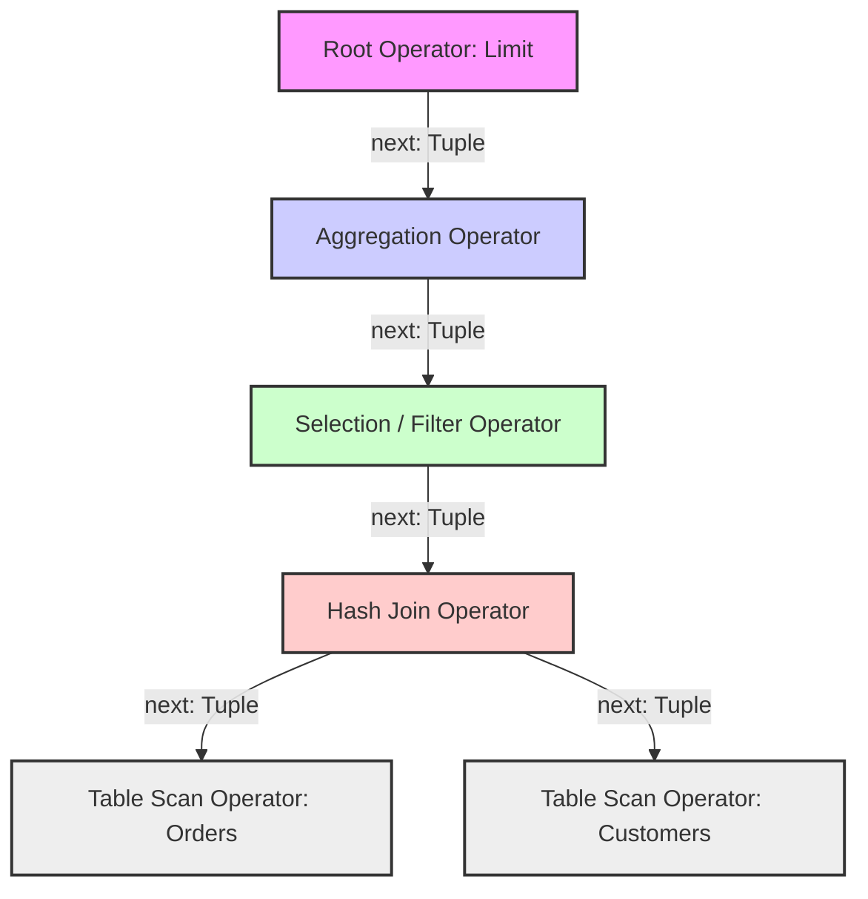

# Volcano Model vs. Vectorized Query Execution in Modern Database Engines

## Executive Summary

Query execution engines inside relational databases look almost nothing like they did thirty years ago, and the reason has less to do with new theory than with hardware simply changing shape underneath them. As semiconductor architectures kept evolving at a geometric pace, the way engines evaluate complex analytical queries had to evolve right along with them.

Back in the early days of databases, hard disk I/O bandwidth was the hard limit on everything. In that disk-bound world, the **Volcano iterator model** became the obvious default — an elegant abstraction where any operator could be composed with any other. But once semiconductor scaling pushed CPU power, core counts, and main memory capacity upward at a relentless pace, the classical Volcano model started showing its age on modern hardware. Instructions-per-cycle (IPC) throughput fell to embarrassingly low levels.

That growing gap between software design and hardware reality is what forced the shift toward **Vectorized Query Execution**. This article walks through both execution models in detail — the core algorithms, how they touch memory, how they interact with the operating system, and where the hardware limits actually bite. By the end you should have a solid feel for how modern databases process data at the silicon level, why the older architecture struggles, and what lessons carry over to building or tuning your own engine.

---

## The Core Problem: Why Some Engines Are an Order of Magnitude Faster

**The question worth asking:** why do some database engines run analytical (OLAP) queries dramatically faster than others, on identical hardware?

The answer is almost never about algorithmic complexity in the Big-O sense. It's about how those high-level algorithms get translated, mechanically, into CPU instructions and memory accesses. Older engines were built for an era where disk was the bottleneck and the CPU spent most of its time waiting around. Today, data frequently lives entirely in RAM — in-memory databases are the norm for hot workloads — and the bottleneck has moved decisively to how fast the CPU can pull data from memory, decode instructions, and keep its execution pipeline full.

Run a traditional query execution model on a modern superscalar CPU and you'll see CPU utilization collapse in a way that's almost embarrassing. Most clock cycles go to stalls waiting on memory or recovering from a mispredicted branch, not to actual relational computation. That mismatch between the software's mental model and what the hardware actually rewards is the problem vectorized execution set out to fix.

---

## The Volcano Model and Tuple-at-a-Time Pipelining

The Volcano iterator model, formally introduced by Goetz Graefe in the early 1990s, implements physical query execution as a directed acyclic graph — usually a tree — of physical operators. Each operator node maps to a specific relational algebra operation: selection, projection, join, aggregation.

### Architecture and Data Flow
What defines the Volcano model is its highly standardized, **tuple-at-a-time procedural interface**, classically built around three virtual methods: `open()`, `next()`, and `close()`. Data flows in one direction only, from the leaf nodes up to the root.



When a parent operator calls `next()`, the child processes its own internal state machine, pulls data from its own children through further `next()` calls, applies its logic, and hands back exactly one fully materialized tuple. Repeat for every row.

### The Illusion of Efficiency
This demand-driven, pipelined approach was genuinely memory-efficient on the disk-based systems it was designed for — intermediate results were rarely materialized in full. On modern superscalar CPUs, though, it quietly racks up micro-architectural overhead that adds up fast.

### Interpretation Overhead and Virtual Calls
Most of the inefficiency traces back to heavy use of **virtual function calls (dynamic dispatch)**. Because physical operators are implemented as polymorphic subclasses of a common interface, every `next()` call structurally requires dynamic dispatch.

On modern microarchitectures, an indirect branch stalls the pipeline whenever the CPU's Branch Target Buffer (BTB) fails to correctly guess the destination. In a deep Volcano execution tree churning through billions of tuples, the BTB runs into constant capacity misses, and mispredictions become the norm rather than the exception.

$$T_{volcano} \approx \sum_{i=1}^{N} \sum_{j=1}^{D} \left( C_{vcall}^{(i,j)} + C_{logic}^{(i,j)} + P_{miss}^{(i,j)} \times C_{penalty} \right)$$

In this formula, $C_{vcall}$ frequently dominates the runtime for simple operations. The sheer number of assembly instructions needed just to coordinate procedural control flow ends up dwarfing the instructions that actually do relational work.

### Cache Thrashing and Row-Oriented Storage
On top of that, the Volcano model natively processes data laid out as the N-ary Storage Model (NSM) — plain **row-oriented storage**. Reading one field out of a row-oriented tuple scatters memory accesses all over the place. Modern processors fetch memory from DRAM in fixed 64-byte aligned chunks (cache lines). If a projection operator only needs a 4-byte integer out of a 256-byte tuple, the hardware still has to pull in the entire 64-byte cache line, burning memory bandwidth it didn't need.

```cpp
// C++ Pseudocode modeling Volcano execution
class PhysicalOperator {
public:
    virtual Tuple* next() = 0; 
};

class FilterOperator : public PhysicalOperator {
private:
    PhysicalOperator* child_;
    Predicate* pred_;
public:
    Tuple* next() override {
        // Repeated virtual call down the tree, destroying BTB predictability
        while (Tuple* t = child_->next()) {
            if (pred_->evaluate(t)) return t;
        }
        return nullptr;
    }
};
```

---

## Vectorized Query Execution and Hardware Symbiosis

**Vectorized Query Execution** is close to a ground-up redesign, built specifically to work with — rather than against — superscalar hardware, chasing what's often called mechanical sympathy. Pioneered by MonetDB/X100 (VectorWise), this approach drops the tuple-at-a-time model entirely.

### The Shift to Data-Flow Dominance
Instead of shuttling individual tuples between operators, they exchange **dense, fixed-size batches of tuples organized in columnar format** (VectorBatches). A typical sweet spot for vector size lands somewhere between 1024 and 4096 elements — chosen specifically so the working set fits inside the CPU's L1 or L2 data cache.

```mermaid
graph LR
    Scan[Table Scan Operator] -->|VectorBatch: 1024-4096 Tuples| Filter[Filter Operator]
    Filter -->|VectorBatch: Filtered Selection| Hash[Hash Build/Probe Operator]
    Hash -->|VectorBatch: Joined Result Vectors| Agg[Vectorized Aggregation]
    
    subgraph VectorBatch Memory Topography
        C1[Column 1 Array: Contiguous int32_t]
        C2[Column 2 Array: Contiguous float64_t]
        Sel[Selection Vector: Contiguous uint16_t]
    end
    Scan -.-> VectorBatch Memory Topography
```

By amortizing procedural control-flow overhead across a large batch of tuples at once, vectorized execution shrinks the relative cost of virtual function calls dramatically. The `next()` method now returns a `VectorBatch` reference instead of a single `Tuple` pointer, which flips the whole computational profile from control-flow dominant to **data-flow dominant**.

### Tight Inner Loops and CPU Prefetching
When an operator processes a vector batch, the relational logic collapses down to a plain, predictable `for` loop iterating over dense, contiguous arrays — nothing fancy, and that's exactly the point.

This columnar layout lines up naturally with the spatial locality assumptions baked into CPU cache hierarchies. Sequential memory access reliably triggers hardware stride prefetchers and next-line prefetchers, which load cache lines from DRAM into L1/L2 before the execution units even ask for them. That hides memory latency and lets the engine actually use the available memory bandwidth instead of wasting it.

```rust
// Rust Pseudocode demonstrating Vectorized Execution
struct VectorBatch {
    columns: Vec<Vec<u8>>, 
    selection_vector: Vec<u16>, 
    count: usize,
}

impl FilterOperator {
    fn next_batch(&mut self) -> Option<VectorBatch> {
        let mut batch = self.child.next_batch()?;
        let data = get_typed_column::<i32>(&batch, self.filter_col_idx);
        let mut new_sel = Vec::with_capacity(batch.count);
        
        // Tight inner loop, highly amenable to auto-vectorization
        for i in 0..batch.count {
            let row_idx = batch.selection_vector[i] as usize;
            // Branchless evaluation
            if data[row_idx] > self.threshold {
                new_sel.push(row_idx as u16);
            }
        }
        
        batch.selection_vector = new_sel;
        batch.count = batch.selection_vector.len();
        Some(batch)
    }
}
```

The equation for vectorized time ($T_{vectorized}$) shows just how much the structural control overhead gets amortized away:

$$T_{vectorized} \approx \sum_{j=1}^{D} \left( \frac{N}{B} \times C_{vcall}^{(j)} + \sum_{k=1}^{N/B} C_{vector\_logic}^{(j,k)} \right)$$

As the batch size $B$ grows, the amortized cost of interpretation shrinks toward zero, and execution becomes bound almost entirely by hardware memory bandwidth ($BW_{dram}$) and ALU throughput.

---

## The Power of SIMD (Single Instruction, Multiple Data)

The most consequential part of vectorization is how well it plays with SIMD architectures — Intel AVX-512, ARM SVE, and similar. These instruction sets let a single clock-cycle instruction operate on multiple scalar data elements at once.

Because vectorized engines store data as contiguous arrays of primitive types, modern compilers (LLVM/GCC) can **auto-vectorize** tight inner loops without any help. Database engineers also reach for explicit SIMD intrinsics when they need more control. A single AVX-512 instruction, for instance, can perform sixteen 32-bit integer comparisons simultaneously.

$$T_{vectorized\_simd} \approx \frac{N}{B} \times C_{vcall} + N \times \frac{C_{vector\_logic}}{W_{simd}}$$

To wipe out branch mispredictions altogether, vectorized engines lean on **branchless programming**. Instead of `if` statements, they compute selection vectors or bitmaps using bitwise logic or SIMD masked operations. Turning control dependencies into data dependencies keeps the CPU pipeline saturated and sidesteps branch predictor limits entirely.

---

## Comparing the Two at the Micro-Architecture Level

Looking closely at how each model actually runs on silicon, the gap becomes obvious:

- **Reorder Buffer (ROB) saturation:** Volcano's constant virtual calls act like serialization barriers, starving the ROB of independent work. Vectorized loops, by contrast, hand the ROB a large pool of independent instructions, enabling aggressive dynamic loop unrolling and concurrent execution across multiple ALUs.
- **TLB thrashing:** The Translation Lookaside Buffer (TLB) maps virtual addresses to physical ones. Volcano's fragmented heap allocations trigger heavy TLB thrashing and expensive page table walks. Vectorized engines, working over large pre-allocated columnar chunks, get near-perfect spatial locality — and combined with Transparent Huge Pages (1GB blocks), TLB misses essentially disappear.
- **Software-pipelined prefetching in hash joins:** In Volcano, probing a hash table tuple-by-tuple tangles the logic tightly with random memory access, which means constant CPU stalls. Vectorized execution splits these phases apart via loop fission: it computes hashes for a whole vector using SIMD, issues explicit software prefetch instructions (`__builtin_prefetch`) for the target buckets, and only then runs the comparisons in a separate loop. That overlap lets high-latency memory access happen in parallel with CPU computation instead of blocking it.

---

## Lessons Learned and Best Practices

1. **Mechanical sympathy isn't optional.** Software architecture can't treat the CPU as a generic Turing machine and expect good performance. Getting real throughput means shaping the software around SIMD, cache lines, TLB hierarchies, and out-of-order (OoO) pipelines explicitly.
2. **Favor data-flow over control-flow.** For analytical workloads, swapping conditional branches for data operations (bitmaps, selection vectors) gives you deterministic, high-throughput execution regardless of how skewed the data distribution is.
3. **Columnar wins for OLAP.** Storage format and execution format need to match. Feeding columnar storage into a row-oriented Volcano engine forces constant tuple reconstruction, which erases most of the benefit. Vectorized execution paired with columnar storage (Parquet, ORC) is still the strongest combination for analytical performance.
4. **Don't underestimate interpretation overhead.** Abstractions like virtual functions are rarely "zero-cost" in systems programming. In tight, data-heavy loops, polymorphic dispatch can quietly wreck your instruction pipeline.
5. **Memory bandwidth is the next wall you'll hit.** Once vectorization has squeezed the waste out of CPU cycles, performance becomes bound by how fast RAM can actually deliver data. Data placement and memory footprint still matter a great deal.

---

## Conclusion

The structural gap between the Volcano and vectorized execution models says something bigger about systems engineering in general. As data volumes keep growing exponentially and Moore's Law puts a hard ceiling on single-thread clock speed, the distance between hardware-oblivious engines (Volcano) and hardware-aware ones (vectorized) is only going to widen. Vectorized query execution has earned its place as the architectural foundation for large-scale analytical processing, and it's fundamentally changed how we think about databases operating at the silicon level.
