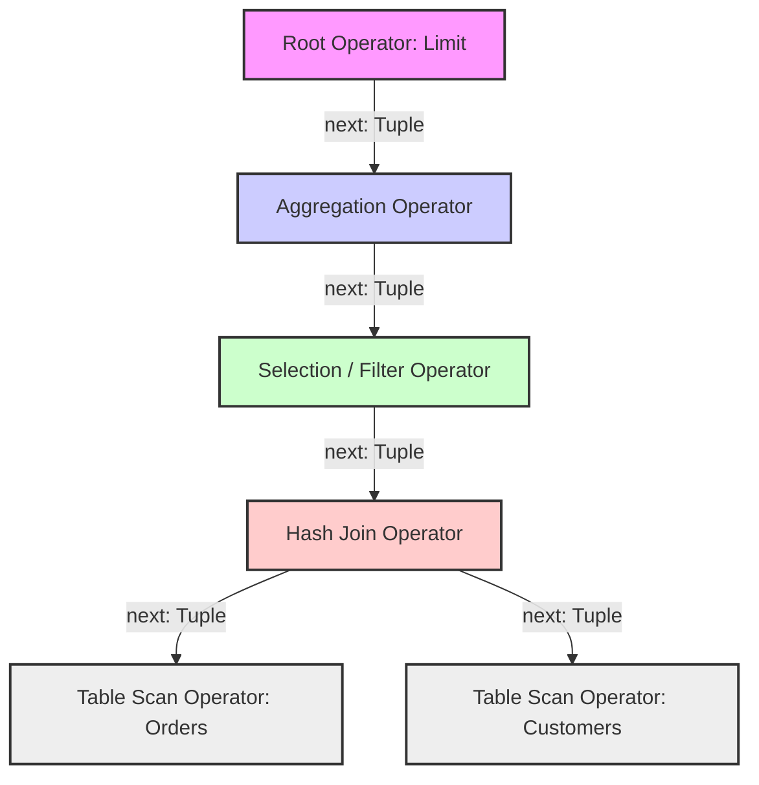

The design and implementation of relational database query execution engines have undergone a profound, structural transformation over the past three decades, primarily driven by the relentless, geometric evolution of underlying semiconductor hardware architectures. In the nascent era of relational database management systems, I/O bandwidth and seek latency from magnetic hard disk drives (HDDs) constituted the unequivocal, absolute bottleneck for analytical workloads. Central Processing Units (CPUs) operated at speeds orders of magnitude faster than disk seek and rotational latencies, rendering the computational efficiency of the query execution engine a strictly secondary concern. During this disk-bound epoch, the Volcano iterator model, formally introduced and formalized by Goetz Graefe in the early 1990s, emerged as the de facto standard and canonical paradigm for query evaluation. The Volcano model provided a highly elegant, universally composable abstraction for evaluating complex relational algebra trees, abstracting away the intricacies of query planning from physical execution. However, as semiconductor scaling rigidly adhered to Moore's Law and Dennard Scaling for several decades, CPU processing power, core counts, and volatile main memory capacities skyrocketed exponentially. The subsequent advent of in-memory database systems fundamentally shifted the physical bottleneck from mechanical disk I/O to main memory bandwidth, CPU cache latency, and instruction decoding constraints. Modern superscalar, out-of-order (OoO) processors possess immense computational capabilities, featuring exceptionally deep execution pipelines, highly aggressive speculative execution, sophisticated branch prediction heuristics, and extremely wide vector processing units. The classical Volcano model, architecturally conceptualized in an era oblivious to these micro-architectural advancements, exhibits severe, structural inefficiencies on modern hardware, leading to catastrophically low instructions-per-cycle (IPC) throughput, severe memory bandwidth underutilization, and abysmal cache locality. This severe architectural divergence necessitated a radical paradigm shift in database engineering, culminating in the development and widespread adoption of Vectorized Query Execution, initially pioneered by the MonetDB/X100 research project (subsequently commercialized as VectorWise). Vectorized execution completely restructures the query evaluation pipeline to process carefully sized batches of columnar data, symbiotically aligning database software architecture with modern hardware capabilities, specifically exploiting Single Instruction, Multiple Data (SIMD) instruction sets, deep multi-level memory hierarchies, and aggressive instruction-level parallelism. This technical whitepaper presents a rigorous, microscopic, and mathematically grounded micro-architectural analysis of both execution models, dissecting their fundamental algorithms, memory access topologies, operating system interactions, and absolute hardware limits.

## The Volcano Model and Tuple-at-a-Time Pipelining

The Volcano iterator model implements physical query execution as a directed acyclic graph (typically a tree) of physical operators, where each individual operator node corresponds to a specific relational algebra operation (e.g., selection, projection, join, aggregation). The defining, foundational characteristic of the Volcano model is its highly standardized, tuple-at-a-time procedural interface, classically defined by three virtual methods: `open()`, `next()`, and `close()`. Data flows unidirectionally from the leaf nodes (base table scans) up to the root node (the final query result) by having parent operators iteratively invoke the `next()` method on their respective child operators. When a parent operator executes a `next()` call, the child operator processes its internal state machine, retrieves necessary data from its own children via subsequent `next()` calls, applies its specific relational logic, and ultimately yields a single, fully materialized tuple. This pipelined, demand-driven approach is exceptionally memory-efficient in traditional, heavily memory-constrained, disk-based systems, as intermediate result sets are rarely materialized in their entirety. Instead, individual tuples percolate up the execution tree sequentially, minimizing the resident memory footprint required for query evaluation to a nominal constant space per operator. The inherent simplicity, encapsulation, and composability of this model have historically led to its ubiquitous adoption in virtually all legacy relational database systems, including PostgreSQL, MySQL, SQLite, and the foundational architectures of major commercial database engines.



Despite its undeniable algorithmic elegance and software engineering benefits, the Volcano model introduces catastrophic and systemic micro-architectural overheads when executed on modern superscalar CPUs. The primary, inescapable source of computational inefficiency stems directly from the pervasive, systemic use of virtual function calls. Because physical operators in the execution tree are strictly implemented as polymorphic subclasses inheriting from a generic, abstract `Operator` interface, every single `next()` invocation structurally mandates dynamic dispatch. In systems programming languages such as C++, this process involves dereferencing an object pointer to access a virtual method table (vtable), retrieving the corresponding function pointer, and subsequently executing an indirect branch instruction. On contemporary microarchitectures, an indirect branch can severely stall the execution pipeline if the CPU's Branch Target Buffer (BTB) fails to accurately forecast the dynamic destination address. In a deep Volcano execution tree processing billions of tuples, the BTB experiences intense capacity misses and aliasing, leading to persistent mispredictions. Furthermore, the sheer volume of assembly instructions explicitly required to orchestrate the procedural control flow, manage the call stack, and manipulate object pointers massively dwarfs the number of instructions executing the actual, intrinsic relational logic. This severe imbalance is formally quantified as the "interpretation overhead."

To rigorously and mathematically model the absolute execution time of the Volcano model on modern silicon, we must express the total temporal cost $T_{volcano}$ as a multifaceted function of the total tuple count $N$, the virtual call structural overhead $C_{vcall}$, the intrinsic cost of the relational logic $C_{logic}$, the penalty of branch mispredictions, and the latency induced by catastrophic cache misses. Let $P_{miss}$ represent the probabilistic likelihood of a branch target misprediction or an L1 instruction/data cache miss, and let $C_{penalty}$ represent the associated hardware stall cycles (typically 15-20 cycles for a pipeline flush, and potentially hundreds of cycles for a DRAM fetch). The temporal execution bound is rigorously approximated by the following summation over the operator depth $D$:

$$T_{volcano} \approx \sum_{i=1}^{N} \sum_{j=1}^{D} \left( C_{vcall}^{(i,j)} + C_{logic}^{(i,j)} + P_{miss}^{(i,j)} \times C_{penalty} \right)$$

In this mathematical formulation, $C_{vcall}$ frequently dominates the execution time for computationally simple operations such as integer predicates or field projections. Furthermore, the tuple-at-a-time processing paradigm fundamentally degrades and weaponizes instruction cache (I-cache) and data cache (D-cache) locality against the CPU. As the execution context switches rapidly and unpredictably between entirely different operator logics for every single tuple, the CPU's L1 instruction cache experiences extreme thrashing. The active instruction footprint of a complex, multi-join query tree frequently exceeds the typical 32KB L1 I-cache capacity, leading to persistent, unrecoverable instruction fetch stalls front-ending the CPU pipeline.

Simultaneously, the physical data access patterns are structurally suboptimal. The Volcano model natively processes data adhering to the N-ary Storage Model (NSM), fundamentally known as row-oriented storage. Although pure pipelining avoids full, blocking materialization, reading specific fields of a row-oriented tuple across different operators scatters memory accesses across the cache hierarchy. Modern processors fetch memory from DRAM in strict 64-byte aligned chunks known as cache lines. If a projection operator only requires a single 4-byte integer from a 256-byte tuple, the hardware is forced to fetch the entire 64-byte cache line containing that integer, wasting 60 bytes of critical memory bandwidth. Moreover, hardware prefetchers, heavily relied upon to hide DRAM latency by detecting linear memory access patterns, are completely defeated. The pointer-chasing, non-sequential nature of tuple-at-a-time execution across fragmented heap allocations ensures that the execution engine is exposed to the absolute latency of main memory accesses, stalling the execution pipeline completely.

```cpp
// C++ Pseudocode mathematically modeling Volcano Model execution mechanics
class PhysicalOperator {
public:
    virtual void open() = 0;
    // The fundamental architectural bottleneck: polymorphic dynamic dispatch per tuple
    virtual Tuple* next() = 0; 
    virtual void close() = 0;
    virtual ~PhysicalOperator() = default;
};

class FilterOperator : public PhysicalOperator {
private:
    PhysicalOperator* child_;
    Predicate* pred_;
public:
    Tuple* next() override {
        // Repeated virtual call down the tree, destroying BTB predictability
        while (Tuple* t = child_->next()) {
            // High interpretation overhead, cache line pollution, and conditional branch hazards
            if (pred_->evaluate(t)) {
                return t;
            }
        }
        return nullptr;
    }
};
```

Another critical, structurally embedded flaw in the Volcano model is its absolute vulnerability to conditional branch mispredictions. Inside the polymorphic `next()` method, operators inherently contain complex state machines, switch statements, and conditional logic to manage diverse execution phases, handle SQL NULL semantics, evaluate short-circuit predicates, and check buffer boundary conditions. These highly data-dependent conditional branches are notoriously hostile to the CPU's branch predictor (even advanced Perceptron or TAGE predictors), especially when statistical data distributions are highly skewed or pseudo-random. When a conditional branch is mispredicted, the processor is forced to violently flush its deeply pipelined execution units, completely discarding all speculatively executed instructions and halting execution until the correct instruction path is fetched, decoded, and dispatched. This pipeline flush penalty severely bottlenecks absolute query throughput. Consequently, legacy execution engines employing the classical Volcano model frequently observe an IPC of strictly less than 1.0 (often hovering around 0.5 to 0.8), signifying that the CPU spends the overwhelming majority of its clock cycles stalled, waiting for memory, or recovering from speculative mispredictions, rather than performing mathematically useful relational computation.

## Vectorized Query Execution and Hardware Symbiosis

Vectorized Query Execution represents a fundamental, ground-up architectural redesign explicitly engineered to maximize hardware utilization and achieve mechanical sympathy with superscalar silicon. Instead of processing discrete, single tuples, physical operators in a vectorized execution engine communicate by passing dense, fixed-size batches of tuples, strictly organized in a columnar format (commonly referred to as vectors, chunk arrays, or record batches). A typical optimal vector size mathematically ranges from 1024 to 4096 elements, a dimension carefully and mathematically calibrated to ensure the entire working set of the vector batch fits perfectly within the CPU's L1 or L2 data cache boundaries. By amortizing the procedural control flow overhead across a massive batch of tuples, vectorized execution dramatically and exponentially reduces the statistical impact of virtual function calls, vtable lookups, and instruction decoding bottlenecks. The `next()` method in a vectorized engine returns a `VectorBatch` reference rather than a single `Tuple` pointer. This critical shift in granular processing scale transforms the computational profile of the database from a control-flow dominant paradigm into a strictly data-flow dominant paradigm, enabling profound compiler optimizations, auto-vectorization, and absolute hardware acceleration.

```mermaid
graph LR
    Scan[Table Scan Operator] -->|VectorBatch: 1024-4096 Tuples| Filter[Filter Operator]
    Filter -->|VectorBatch: Filtered Selection| Hash[Hash Build/Probe Operator]
    Hash -->|VectorBatch: Joined Result Vectors| Agg[Vectorized Aggregation]
    
    subgraph VectorBatch Memory Topography
        C1[Column 1 Array: Contiguous int32_t]
        C2[Column 2 Array: Contiguous float64_t]
        Sel[Selection Vector: Contiguous uint16_t]
    end
    Scan -.-> VectorBatch Memory Topography
```

The absolute core architectural advantage of vectorization lies entirely in its mathematical ability to exploit tight, data-parallel inner loops. When an operator processes a vector batch, the relational logic is physically implemented as a highly predictable, simple `for` loop iterating sequentially over dense, contiguous arrays in virtual memory. This columnar memory layout, strictly adhering to the Decomposition Storage Model (DSM), is perfectly, mathematically aligned with the spatial locality assumptions hardwired into CPU cache hierarchies. Sequential memory accesses reliably trigger hardware stride prefetchers and next-line prefetchers, proactively and aggressively loading cache lines from DRAM into the L1 and L2 caches well before the execution units request the data. This effectively hides memory latency entirely and fully saturates the available physical memory bandwidth. Furthermore, the compiled assembly of these tight loop structures easily and permanently resides within the L1 instruction cache, entirely eliminating I-cache thrashing. The CPU spends prolonged, uninterrupted periods executing a highly focused, dense sequence of arithmetic and logic instructions, allowing the out-of-order execution engine's Reorder Buffer (ROB) to extract maximum instruction-level parallelism (ILP).

```rust
// Rust Pseudocode demonstrating tight-loop Vectorized Execution mechanics
struct VectorBatch {
    // Contiguous memory arrays maximizing spatial locality and cache line utilization
    columns: Vec<Vec<u8>>, 
    // Selection vector for branchless control flow
    selection_vector: Vec<u16>, 
    count: usize,
}

impl FilterOperator {
    fn next_batch(&mut self) -> Option<VectorBatch> {
        let mut batch = self.child.next_batch()?;
        let data = get_typed_column::<i32>(&batch, self.filter_col_idx);
        let mut new_sel = Vec::with_capacity(batch.count);
        
        // Tight inner loop, highly amenable to LLVM auto-vectorization and unrolling
        for i in 0..batch.count {
            // Data-parallel operation with perfectly predictable memory access
            let row_idx = batch.selection_vector[i] as usize;
            
            // Evaluated branchlessly by modern compilers or utilizing explicit SIMD masks
            if data[row_idx] > self.threshold {
                new_sel.push(row_idx as u16);
            }
        }
        
        batch.selection_vector = new_sel;
        batch.count = batch.selection_vector.len();
        Some(batch)
    }
}
```

Mathematically modeling the execution time of a highly optimized vectorized query, $T_{vectorized}$, visibly demonstrates the extreme amortization of structural control overhead. Let $B$ represent the carefully tuned batch size (number of tuples per vector array). The virtual call overhead $C_{vcall}$ is now strictly divided by $B$, rendering it mathematically negligible. The relational logic execution cost is absolutely dominated by the tight loop execution, denoted as $C_{vector\_logic}$. Crucially, the highly predictable, linear nature of the loop minimizes the penalty probability $P_{miss}$ to near zero for both instructions and data. The execution equation is rigorously formulated as:

$$T_{vectorized} \approx \sum_{j=1}^{D} \left( \frac{N}{B} \times C_{vcall}^{(j)} + \sum_{k=1}^{N/B} C_{vector\_logic}^{(j,k)} \right)$$

This mathematical formulation explicitly reveals that as the vector batch size $B$ increases to optimal cache boundaries, the amortized cost of interpretation approaches a strict limit of zero, and the execution time becomes strictly, physically bounded by hardware memory bandwidth $BW_{dram}$ and the theoretical maximum Arithmetic Logic Unit (ALU) throughput. 

However, the most technologically transformative aspect of vectorization is its profound synergy with Single Instruction, Multiple Data (SIMD) architectures. Modern CPUs feature exceptionally wide vector registers, such as Intel's Advanced Vector Extensions (AVX-256, AVX-512) or ARM's Scalable Vector Extension (SVE) and NEON. These instruction set architectures (ISAs) mathematically allow a single clock cycle instruction to operate concurrently on multiple scalar data elements. Because vectorized engines rigidly store data in contiguous arrays of strongly typed primitive variables, modern compilers (like LLVM or GCC) can automatically map the tight inner loops to corresponding SIMD instructions through aggressive auto-vectorization. Alternatively, database engineers utilize explicit SIMD intrinsics for complex operations. For instance, a single AVX-512 instruction can physically perform sixteen 32-bit integer comparisons simultaneously. This hardware acceleration linearly scales query execution by a mathematical factor approaching the physical SIMD lane width $W_{simd}$.

$$T_{vectorized\_simd} \approx \frac{N}{B} \times C_{vcall} + N \times \frac{C_{vector\_logic}}{W_{simd}}$$

To completely eradicate branch mispredictions, vectorized engines universally employ branchless programming techniques and data-parallel logical transformations. In the strict context of filtering, instead of using conditional `if` branches to selectively populate the resulting output vector, engines mathematically compute selection vectors or physical bitmaps utilizing bitwise logic, mathematical arithmetic, or SIMD masked operations (e.g., AVX-512 k-registers). A selection vector is an array of 16-bit indices pointing to the valid tuples remaining in the batch. By algorithmically transforming control dependencies into strict data dependencies, the CPU pipeline remains fully occupied and saturated, completely bypassing the heuristic limitations of the branch predictor. This technique guarantees deterministic, mathematically bound performance regardless of data selectivity, maintaining maximum IPC and total throughput.

## Comparative Micro-Architectural Analytics

A scientifically rigorous comparison between the Volcano and Vectorized models inherently necessitates an exhaustive examination of deep micro-architectural telemetry, typically gathered via specialized hardware performance counters (e.g., utilizing Linux `perf` events or Intel VTune). The vast disparities in observable performance are exceedingly rarely due to algorithmic complexity (Big O notation), as both models physically process the exact same number of mathematical tuples to evaluate a given logical query. Instead, the performance delta is deeply rooted in the mechanical translation of those high-level algorithms into precise CPU instructions and hierarchical memory accesses. In a heavily profiled analytical workload (OLAP), the Volcano model frequently exhibits a catastrophic IPC ranging from 0.5 to 1.2, statistically characterized by an exceptionally high ratio of retired branch instructions and a staggering percentage of branch mispredictions. Conversely, a mathematically optimized Vectorized engine achieves a sustained IPC between 2.5 and 4.0, directly approaching the theoretical maximum issue width of the processor's superscalar architecture.

The hardware Reorder Buffer (ROB) plays a determinative role in superscalar out-of-order execution, physically allowing the CPU to look ahead in the instruction stream and execute mathematically independent instructions concurrently across multiple ALUs. The Volcano model's frequent virtual function calls act as absolute serialization barriers, artificially and severely constraining the instruction window visible to the ROB. The deep call stack, combined with the associated physical register saving and restoring (register spilling to the stack), consumes highly valuable execution resources. In the Vectorized model, the tight, mathematically pure loops spanning contiguous memory arrays provide the ROB with a vast, highly visible pool of independent instructions. The CPU hardware can dynamically and aggressively unroll these loops, simultaneously tracking hundreds of instructions in-flight, efficiently overlapping physical memory loads with concurrent arithmetic operations, effectively hiding latency through sheer concurrency.

Physical memory hierarchy interactions further violently accentuate the architectural divide. The Translation Lookaside Buffer (TLB) is a specialized cache utilized to speed up virtual-to-physical address translations. Tuple-at-a-time processing, characterized by highly fragmented heap allocations and object-oriented pointer chasing, frequently and predictably induces catastrophic TLB thrashing. As the processor traverses the object graph for each individual tuple, it accesses entirely disparate virtual memory pages, rapidly exceeding the finite capacity of the L1 and L2 TLBs and triggering highly expensive, multi-cycle page table walks. Vectorized engines, operating exclusively on massive, pre-allocated columnar chunks, exhibit mathematically perfect spatial locality at the page level. Furthermore, these engines seamlessly integrate with advanced Operating System level memory management, specifically utilizing Transparent Huge Pages (allocating physical memory in continuous 2MB or 1GB blocks instead of standard 4KB blocks). Utilizing 1GB Huge Pages drastically, exponentially reduces the number of TLB entries required to map a massive columnar dataset into physical memory, effectively eradicating TLB misses entirely and massively accelerating memory-bound aggregations and hash joins.

The implications of these absolute micro-architectural realities extend deeply into the physical design of complex relational operators, such as Hash Joins and Group-By Aggregations. In the Volcano model, building and probing a highly concurrent hash table tuple-by-tuple severely interleaves procedural control logic with completely random memory accesses. The CPU executes the hash function, computes the array bucket offset, and performs a serialized linked-list traversal for collision resolution, all while completely stalled, waiting for the physical memory subsystem to fetch remote cache lines. In Vectorized execution, these physical phases are strictly decoupled via loop fission. A highly optimized vectorized Hash Join operates in distinct, vectorized micro-phases over the vector batch: mathematically computing hashes for all vector elements simultaneously using SIMD, generating highly specific software prefetch instructions (`__builtin_prefetch`) for all corresponding hash table memory buckets, and subsequently performing the comparison logic in a separate loop. This specific technique, formally known as software pipelined prefetching, physically overlaps the high latency of random memory accesses with the actual computational work of subsequent tuples in the same batch, a micro-architectural feat structurally impossible to achieve efficiently within the rigid constraints of tuple-at-a-time pipelining. Furthermore, advanced vectorized engines employ Radix Partitioning to recursively divide the hash join build side until the physical hash table fits entirely within the CPU's L2 or L3 cache, converting extremely slow DRAM accesses into highly performant SRAM accesses.

The fundamental, structural divergence between Volcano and Vectorized execution models underscores a broader, non-negotiable principle in extreme-performance software engineering: mechanical sympathy. The Volcano model abstractly ignores the physical hardware, conceptually treating the CPU as a generic Turing machine executing arbitrary logical operations. Vectorized execution, conversely, correctly treats modern hardware as a highly specialized, massively parallel array processing engine, strictly molding the software architecture to ruthlessly exploit specific silicon features including SIMD vector units, multi-level TLB hierarchies, stride prefetchers, and deep OoO pipelines. As global data volumes continue to scale exponentially and the physical limits of Moore's Law impose hard ceilings on single-thread performance, the mathematical performance delta between hardware-oblivious and hardware-symbiotic database engines will only continue to diverge, absolutely solidifying Vectorized Query Execution as the indisputable architectural foundation for the future of extreme-scale analytical data processing.

## SEO Section
title: "34: Volcano Model vs. Vectorized Query Execution"
description: "A deep technical and micro-architectural analysis of the Volcano iterator model versus Vectorized Query Execution in modern database engines. Covers SIMD, memory hierarchies, cache locality, TLB thrashing, software prefetching, and CPU pipelining limits."
keywords:
- Volcano Model
- Vectorized Query Execution
- Database Micro-architecture
- SIMD Database Processing
- Tuple-at-a-time Pipelining
- Hardware Mechanical Sympathy
url: "/blogs/part-5/34-volcano-vs-vectorized-execution"
