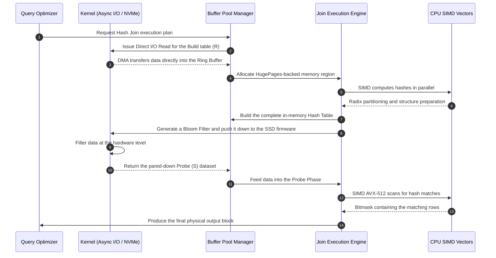

# Anatomy of Join Algorithms: Nested Loop, Hash Join, and Sort-Merge Join Down to the Micro-Architecture

## Executive Summary

The join operator is the most expensive thing a relational database does, and it sits right in the middle of almost every query plan. Picking the right join algorithm isn't a textbook exercise in Big-O notation — it's a fight over CPU cycles, cache lines, and storage bandwidth that plays out differently depending on the hardware underneath it.

This piece walks through the three foundational join algorithms — **Nested Loop Join**, **Hash Join**, and **Sort-Merge Join** — and then goes further than the usual textbook treatment. We'll cover the optimizations that actually matter in production engines today: radix partitioning, SIMD vectorization (AVX-512), NUMA effects, OS-level memory tricks like Huge Pages, and even pushing filter logic down into the storage device itself using Bloom filters.

By the end, you should understand why join algorithms behave the way they do at the hardware level, why a query can suddenly get a hundred times slower for no obvious reason, and what that means for how you design data systems.

---

## The Core Problem: Why Joins Are Hard

**What are we actually solving?**
Say you have two large tables: `Orders` (1 billion rows) and `Customers` (10 million rows), and you need every order placed by a customer in Hanoi. Mathematically that's a Cartesian product with a filter on top. Done the naive way, that's $1,000,000,000 \times 10,000,000 = 10^{16}$ comparisons — enough to bring any machine to its knees if you don't have a smarter join algorithm.

Where the bottleneck sits has shifted over the decades:
- **The spinning-disk era:** seek time dominated everything. The best join algorithm was whichever one touched the disk the fewest times.
- **The in-memory / NVMe era:** once data lives in RAM or on SSDs pushing millions of IOPS, the bottleneck moves to the CPU and memory bandwidth. Cache misses and TLB misses become the real performance killers.

So modern engines — both OLTP databases and OLAP systems — keep reworking their join algorithms to match whatever the underlying hardware actually rewards.

---

## Theoretical Foundations and Complexity

Take two relations, $R$ (the outer/build side) and $S$ (the inner/probe side), with $|R|$ and $|S|$ tuples respectively.

### Nested Loop Join and Its Variants

The simplest form is two nested loops scanning record by record.
- **Tuple-at-a-time Nested Loop Join:** $\mathcal{O}(|R| \times |S|)$. Bad in theory, worse in practice.
- **Block Nested Loop Join (BNLJ):** loads pages of $R$ and $S$ into RAM in blocks rather than one row at a time. With $M$ available RAM pages, I/O cost falls to $\mathcal{C}_{I/O} = P_R + \lceil \frac{P_R}{M-2} \rceil \times P_S$. This moves the bottleneck from disk rotational latency to memory bandwidth.
- **Index Nested Loop Join (INLJ):** uses a B+ Tree index on $S$ so you never fully scan it. Complexity drops to $\mathcal{O}(|R| \log_b |S|)$ — the go-to choice in OLTP once $R$ has already been filtered down to a handful of rows.

### Hash Join

When the predicate is an equi-join, **Hash Join** gives you an expected complexity of $\mathcal{O}(|R| + |S|)$, split into two phases:
1. **Build Phase:** scan $R$ and insert every record into an in-memory hash table using $h(k)$.
2. **Probe Phase:** scan $S$ and look up each key against that hash table.

The catch with classic hash join: it's only fast if the hash table fits entirely in RAM. Once it overflows, the OS starts swapping pages to disk, thrashing on random I/O, and performance falls off a cliff.

**Grace Hash Join** exists to fix exactly that. It partitions both $R$ and $S$ into $k$ disk-resident partitions using a hash function $h_1(k)$, sized so each $R_i$ fits comfortably in RAM. Then it loads each pair $(R_i, S_i)$ and joins them locally. I/O cost comes out to $\mathcal{C}_{I/O} = 3(P_R + P_S)$ — one pass to write the partitions, one to read them back for $R$, one for $S$.

### Sort-Merge Join (SMJ)

SMJ skips hashing entirely and leans on sortedness instead. It shines when the data is already indexed on the join key.
1. **Sort Phase:** for large inputs, use External Merge Sort — complexity $\mathcal{O}(|R| \log_M |R| + |S| \log_M |S|)$.
2. **Merge Phase:** walk two cursors down $R$ and $S$ in lockstep. Linear: $\mathcal{O}(|R| + |S|)$.

The real payoff of SMJ is that its I/O is purely sequential — no random access at all, which is exactly what you want on spinning disks or in memory-constrained setups.

---

## Micro-Architecture Optimization: Making Join Algorithms Hardware-Aware

Once databases moved in-memory (SAP HANA, MemSQL, and friends), the game changed completely. The bottleneck stopped being disk and became the CPU's micro-architecture — L1/L2/L3 caches, the branch predictor, and the TLB.

### Cache Misses and TLB Thrashing

Building and probing a hash table means random access by nature. Once that table gets large — say 10GB — you're going to miss L3 constantly. A DRAM access costs 100-300 CPU cycles, and during that stall the ALUs just sit idle.

**Radix Hash Join** fights this with an aggressive divide-and-conquer strategy: it splits data into chunks small enough to fit in L1 (32KB) or L2 (256KB), using bit shifts on the hash value to decide partition assignment.
Partition too aggressively in one pass, though, and you blow out the TLB (Translation Lookaside Buffer), triggering TLB thrashing of your own. The fix is multi-pass radix partitioning — spread the partitioning work across several passes. The trade-off is straightforward: burning extra sequential memory bandwidth by repeating a pass is always cheaper than eating random-access latency.

### Vectorization with SIMD

In the classic Volcano execution model, every `if/else` branch (checking for a hash collision, say) is a chance to mispredict. A mispredicted branch means a pipeline flush — the CPU throws away speculative work, costing dozens of cycles.

AVX-512 sidesteps this by processing 16 32-bit integers at once. The C++ snippet below shows the shape of branchless SIMD probing combined with software prefetching:

```cpp
#include <immintrin.h>

// Vectorized probing logic for an in-memory Hash Join array
inline void simd_probe_hash_table(
    const int32_t* probe_keys, 
    const int32_t* hash_table, 
    uint32_t num_keys, 
    uint32_t* output_buffer) 
{
    uint32_t out_idx = 0;
    // Process 16 keys in parallel
    for(uint32_t i = 0; i < num_keys; i += 16) {
        __m512i v_probe = _mm512_loadu_si512((__m512i*)&probe_keys[i]);
        
        // Software Prefetching: force the CPU to load data into Cache 64 iterations ahead
        _mm_prefetch((const char*)&probe_keys[i + 1024], _MM_HINT_T0);

        // Compute the hash in parallel using XOR / bit-shift operators
        __m512i v_hashes = _mm512_xor_si512(v_probe, _mm512_srli_epi32(v_probe, 15));
        
        // Gather: fetch the buckets from the Hash table in parallel using random access
        __m512i v_ht_entries = _mm512_i32gather_epi32(v_hashes, hash_table, 4);
        
        // SIMD comparison with no IF instructions
        __mmask16 match_mask = _mm512_cmpeq_epi32_mask(v_probe, v_ht_entries);
        
        // Compress and write out the results contiguously
        __m512i v_matched = _mm512_maskz_compress_epi32(match_mask, v_probe);
        _mm512_storeu_si512((__m512i*)&output_buffer[out_idx], v_matched);
        out_idx += _mm_popcnt_u32(match_mask);
    }
}
```

### NUMA Effects

On multi-socket servers, RAM is physically split into per-socket segments, and reaching across sockets over Intel QPI costs noticeably more latency. To avoid paying that tax, databases use **Data Pinning** and **Thread Affinity** so a hash table built by a core on socket A stays in socket A's local memory — effectively turning one server into a small shared-nothing cluster.

---

## OS Memory Management and Asynchronous I/O

### Huge Pages

When the OS allocates a hash table that's tens of gigabytes using standard 4KB pages, it ends up tracking millions of page table entries — a recipe for TLB misses. Switching to **Huge Pages (2MB or 1GB)** cuts that entry count by orders of magnitude, pushing TLB hit rates up toward 99.9% and speeding up in-memory queries substantially. Most serious engines also skip the general-purpose allocator entirely and build their own arena allocators for this.

### Asynchronous I/O and Direct I/O

Blocking I/O simply can't keep up with what an NVMe SSD is capable of. Modern engines use `io_uring` on Linux (or AIO) to queue tens of thousands of async reads, letting the CPU keep computing hashes while the device streams data in over DMA — full overlap between I/O and compute.

On top of that, **Direct I/O** lets the database skip the OS page cache entirely. Joins are inherently scan-once: routing that data through the page cache would just evict other useful pages and pay for a redundant copy, with nothing to show for it.

---

## Storage Offloading and Bloom Filter Pushdown

Push the idea further and you get computational storage paired with Bloom filters — a neat piece of synergy. Instead of streaming terabytes from SSD across PCIe into RAM just to throw most of it away, the CPU builds a small Bloom filter from the build relation $R$ and ships it down to the SSD controller (SmartNIC or FPGA).

$$p = \left( 1 - e^{-\frac{kn}{m}} \right)^k$$

Armed with that filter, the SSD evaluates the predicate itself and drops non-matching rows of $S$ right there in hardware, before they ever touch the PCIe bus.



---

## Lessons Learned and Best Practices

A few takeaways for data engineers and system architects:

1. **Know your data before you pick an algorithm.** Don't just let the optimizer default to Hash Join. If the output needs `ORDER BY` on the join key anyway, hinting Sort-Merge Join is usually cheaper since it skips a separate final sort.
2. **Memory management is a survival skill.** Running out of memory during a hash join won't crash the database — it'll quietly fall back to Grace Hash Join and start spilling to disk. A query that used to take 5 seconds can turn into a 5-hour one. Tune buffer parameters like Postgres's `work_mem` carefully.
3. **OS configuration is not an afterthought.** On large systems, skipping Huge Pages configuration wastes a meaningful chunk of CPU capacity. Understanding NUMA topology — and either tuning around it or disabling it deliberately — saves you from the cross-socket latency trap.
4. **Hardware and software co-design matters.** Modern databases aren't just software anymore. Real speed comes from mechanical sympathy between the code and the hardware: SIMD, cache-aware data structures, and squeezing every bit of bandwidth out of NVMe.

## Conclusion

From the crude nested loop all the way to vectorized, multi-pass radix hash join and sort-merge join running across parallel networks, join algorithms are a case study in reconciling software design with the physics of the machine underneath. Understanding them properly is one of the more durable skills for anyone building or operating large-scale data systems.

---
