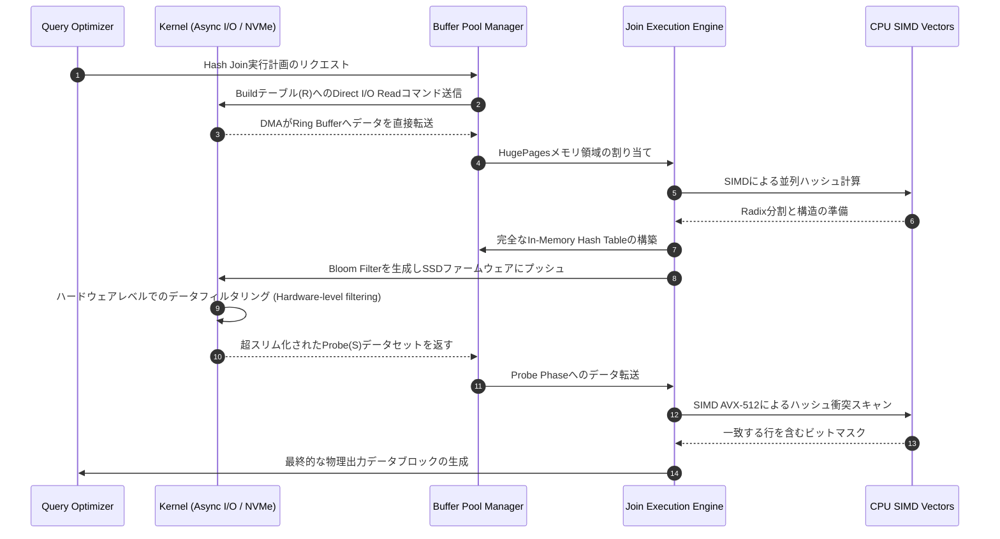

# Joinアルゴリズムの解剖：マイクロアーキテクチャレベルで見るNested Loop、Hash Join、Sort-Merge Join

## エグゼクティブサマリー

結合演算子（join operator）はリレーショナルデータベースの中で最もコストのかかる処理であり、ほとんどのクエリ実行計画の中心に位置しています。どのJoinアルゴリズムを選ぶかは、単純な時間計算量（$O(N)$）の比較では済みません。CPUクロックサイクル、キャッシュメモリの1バイト単位、そしてストレージ帯域幅をめぐる駆け引きであり、その結果は使っているハードウェアによって大きく変わります。

本稿では、Joinアルゴリズムの3本柱である**Nested Loop Join**、**Hash Join**、**Sort-Merge Join**を掘り下げたうえで、教科書レベルを超えた話に踏み込みます。Radix Partitioning、SIMDベクトル化命令（AVX-512）、NUMAアーキテクチャが与える影響、Huge PagesなどOSのメモリ管理機構、そしてBloom Filterを使ってストレージデバイス側に処理を押し込むStorage Offloadingまで扱います。

読み終える頃には、Joinアルゴリズムがハードウェアレベルでどう振る舞うのか、なぜクエリが突然何百倍も遅くなることがあるのか、そしてそれがデータシステム設計にどう跳ね返ってくるのかが見えてくるはずです。

---

## Joinの本質と難しさ

**そもそも何が問題なのか？**
`Orders`（10億行）と`Customers`（1000万行）という2つの巨大なテーブルがあり、「ハノイ」の顧客の注文をすべて取り出したいとします。数式で言えばこれはデカルト積にフィルタをかけたものです。愚直にやれば $1,000,000,000 \times 10,000,000 = 10^{16}$ 回の比較が必要になり、効率的なJoinアルゴリズムなしではどんなマシンでも音を上げます。

Joinのボトルネックがどこにあるかは時代とともに変わってきました。
- **磁気ディスク（HDD）時代:** Seek timeによるI/Oコストが絶対的なボトルネックでした。最良のアルゴリズムとは、ディスク読み取り回数を最小化するアルゴリズムでした。
- **インメモリDB・NVMe SSD時代:** データがRAMや数百万IOPSを叩き出すSSD上に完全に載ると、ボトルネックはCPUとメモリ帯域幅に移ります。キャッシュミスとTLBミスこそが実際のパフォーマンスを削る要因になります。

この変化を受けて、現代のRDBMSやOLAPエンジンは、下にあるハードウェアの物理特性に合わせてJoinアルゴリズムを絶えず作り替えています。

---

## 理論的基礎と漸近計算量

2つのリレーション、$R$（outer/build relation）と$S$（inner/probe relation）を考え、それぞれのタプル数を$|R|$、$|S|$とします。

### Nested Loop Join（NLJ）とそのバリエーション

最も基本的な形は、レコードを1件ずつ処理する二重ループです。
- **Tuple-centric Nested Loop Join:** 計算量は$\mathcal{O}(|R| \times |S|)$。理論的にも実践的にも最悪です。
- **Block Nested Loop Join（BNLJ）:** $R$と$S$のブロック（ページ）をまとめてRAMにロードすることでI/Oアクセスパターンを改善します。利用可能なRAMページ数を$M$とすると、I/Oコストは $\mathcal{C}_{I/O} = P_R + \lceil \frac{P_R}{M-2} \rceil \times P_S$ まで下がります。BNLJはボトルネックをディスクの回転遅延からメモリ帯域幅へと移す手法です。
- **Index Nested Loop Join（INLJ）:** $S$上のB+Treeインデックスを使い、$S$の全件スキャンを回避します。計算量は$\mathcal{O}(|R| \log_b |S|)$まで下がり、$R$が事前に少数まで絞り込まれているOLTPシステムでは定番の選択肢です。

### Hash Joinの時代

結合述語が等価条件（equi-join）であれば、**Hash Join**は期待計算量$\mathcal{O}(|R| + |S|)$を実現します。処理は2段階に分かれます。
1. **Build Phase:** $R$をスキャンし、ハッシュ関数$h(k)$を使ってRAM上のハッシュテーブルにレコードを詰め込みます。
2. **Probe Phase:** $S$をスキャンし、同じ$h(k)$でハッシュテーブルを検索します。

古典的なHash Joinの弱点は、ハッシュテーブルがRAMに完全に収まる間しかうまく機能しないことです。RAMから溢れた瞬間、OSはディスクへのスワップを始め、ランダムアクセスによる「スラッシング」が発生し、性能は一気に崩れ落ちます。

これを解決するために生まれたのが**Grace Hash Join**です。ハッシュ関数$h_1(k)$を使って$R$と$S$の両方をディスク上の$k$個のパーティションに分割し、各パーティション$R_i$がRAMに無理なく収まるサイズに揃えます。そのうえでペア$(R_i, S_i)$を読み込んで結合します。I/Oコストは $\mathcal{C}_{I/O} = 3(P_R + P_S)$ となります（パーティション書き込みに1回、$R$の再読み込みに1回、$S$の再読み込みに1回）。

### Sort-Merge Join（SMJ）

SMJはハッシュに頼らず、ソート済みという性質を利用します。結合キーに既にインデックスが張られているデータに対しては特に効果を発揮します。
1. **Sort Phase:** データが大きい場合はExternal Merge Sortを使います。計算量は $\mathcal{O}(|R| \log_M |R| + |S| \log_M |S|)$。
2. **Merge Phase:** $R$と$S$それぞれにカーソルを置き、並行してスキャンします。計算量は線形の $\mathcal{O}(|R| + |S|)$。

SMJの本当の強みは、I/Oが完全にシーケンシャルになる点です。ランダムアクセスがゼロになるため、HDD環境やRAMが限られた構成には特に向いています。

---

## マイクロアーキテクチャの最適化とハードウェア対応の実装

SAP HANAやMemSQLのようなインメモリデータベースが登場すると、状況は一変します。ボトルネックはディスクではなく、CPUのマイクロアーキテクチャ（L1/L2/L3キャッシュ、分岐予測器、TLB）に移ります。

### Cache MissとTLB Thrashingという悪夢

ハッシュテーブルの構築とプローブには、本質的にランダムアクセスが伴います。テーブルが大きくなる（例えば10GB）と、L3キャッシュを外れるキャッシュミスは避けられません。DRAMへのアクセスは100〜300 CPUサイクルかかり、その間CPUのALUは完全に停止（Memory Stall）します。

**Radix Hash Join**は、これに対して徹底した分割統治戦略を取ります。ハッシュ値へのビットシフト操作を使い、データをL1キャッシュ（32KB）やL2キャッシュ（256KB）にきっちり収まる小さな塊に分割するのです。
ただし、一度に細かく分割しすぎるとページテーブルがTLB（Translation Lookaside Buffer）から溢れ、今度はTLB Thrashingを引き起こします。そのためアルゴリズムは複数パスに分けて分割する必要があります（multi-pass radix partitioning）。ここでのトレードオフは単純で、パスを繰り返して余分なシーケンシャル帯域幅を使うほうが、過酷なランダムアクセス遅延に耐えるより常に得だということです。

### SIMDによるベクトル化の力

Volcanoモデルでは、`if/else`命令（ハッシュ衝突のチェックなど）が分岐予測器を頻繁に誤らせ、パイプラインフラッシュ（CPUが投機実行の結果を破棄する処理）を招きます。これには毎回数十サイクルのコストがかかります。

AVX-512は16個の32ビット整数を同時に処理することでこの問題を回避します。次のC++疑似コード（インライン組み込み関数を使用）は、Software Prefetchingと組み合わせた分岐なしSIMDプロービングの考え方を示しています。

```cpp
#include <immintrin.h>

// インメモリHash Joinのためのベクトル化されたプロービングロジック
inline void simd_probe_hash_table(
    const int32_t* probe_keys, 
    const int32_t* hash_table, 
    uint32_t num_keys, 
    uint32_t* output_buffer) 
{
    uint32_t out_idx = 0;
    // 16個のキーを並列処理
    for(uint32_t i = 0; i < num_keys; i += 16) {
        __m512i v_probe = _mm512_loadu_si512((__m512i*)&probe_keys[i]);
        
        // Software Prefetching: 64ループ前にCPUにデータをキャッシュにロードさせる
        _mm_prefetch((const char*)&probe_keys[i + 1024], _MM_HINT_T0);

        // XOR / ビットシフト演算による並列ハッシュ計算
        __m512i v_hashes = _mm512_xor_si512(v_probe, _mm512_srli_epi32(v_probe, 15));
        
        // Gather: Hash tableからバケットを並列にランダム取得
        __m512i v_ht_entries = _mm512_i32gather_epi32(v_hashes, hash_table, 4);
        
        // IF命令を使用しないSIMD比較
        __mmask16 match_mask = _mm512_cmpeq_epi32_mask(v_probe, v_ht_entries);
        
        // 圧縮と連続的な結果の書き込み
        __m512i v_matched = _mm512_maskz_compress_epi32(match_mask, v_probe);
        _mm512_storeu_si512((__m512i*)&output_buffer[out_idx], v_matched);
        out_idx += _mm_popcnt_u32(match_mask);
    }
}
```

### NUMA構造が与える影響

マルチソケットサーバーでは、RAMは物理的にソケットごとに分割されています。Intel QPI経由でソケットをまたいでRAMにアクセスすると、無視できないほどの遅延ペナルティを受けます。これを避けるため、現代のデータベースは**Data Pinning**と**Thread Affinity**を組み合わせ、あるコアが構築したハッシュテーブルがそのコアの属するソケットのローカルRAMだけに存在するようにします。結果として、1台のサーバーが縮小版の「シェアードナッシング」アーキテクチャのように振る舞うわけです。

---

## OSのメモリ管理と非同期I/O

### Huge Pages

OSが数十GB規模のハッシュテーブルをデフォルトのページサイズ（4KB）で確保しようとすると、数百万件ものページエントリを管理することになり、TLBミスの嵐に見舞われます。**Huge Pages（2MBまたは1GB）**を有効にすると、ページエントリ数は桁違いに減り、TLBヒット率は99.9%近くまで上がって、インメモリクエリは大幅に高速化します。多くの本格的なエンジンは、標準のアロケータを避けて専用のArena Allocatorを自前で実装しています。

### 非同期I/OとDirect I/O

同期（ブロッキング）I/Oでは、NVMe SSDの実力を到底引き出せません。現代のエンジンはLinuxの`io_uring`やAIOを使い、数万件規模の非同期読み取りリクエストをまとめて発行します。これにより、ストレージデバイスがDMA経由でデータを流し込んでいる間もCPUはハッシュ計算を続けられ、I/Oと計算がほぼ完全に重なります。

さらに**Direct I/O**を使えば、データベースはOSのページキャッシュを丸ごと迂回できます。Joinは本質的に「一度読んだら使い捨て」のスキャンオンチェイン処理であり、ページキャッシュを経由させると他の有用なデータを追い出したうえに、無駄な二重コピーの帯域幅まで払うことになります。

---

## Storage OffloadingとBloom Filter Pushdown

この考え方をさらに突き詰めると、Computational StorageとBloom Filterの組み合わせという、なかなか洗練された相乗効果に行き着きます。数TB規模のデータをSSDからPCIe経由でRAMに送り込んでからほとんどを捨てる代わりに、CPUはBuild側のリレーション$R$から小さなBloom Filter構造を作り、それをSSDコントローラ（SmartNICやFPGA）にそのまま送り込みます。

$$p = \left( 1 - e^{-\frac{kn}{m}} \right)^k$$

このフィルタを渡されたSSDは自ら述語を評価し、条件に合わない$S$の行をPCIeバスに乗せる前にハードウェアレベルで即座に捨ててしまいます。



---

## 学んだ教訓とベストプラクティス

データエンジニアやシステムアーキテクトへの実践的な示唆をいくつか挙げます。

1. **アルゴリズムを選ぶ前にデータの性質を理解する。** システムに盲目的にHash Joinを使わせないこと。最終結果を結合キーで`ORDER BY`する必要があるなら、Sort-Merge Joinをヒントで指定したほうが、最後の高コストなソートを省ける分、たいてい安上がりです。
2. **メモリ管理はサバイバル術だと心得る。** Hash Joinの最中にメモリが足りなくなってもデータベースはクラッシュしません。代わりに黙ってGrace Hash Joinにフォールバックし、ディスクへのスピルを始めます。5秒で終わっていたクエリが5時間かかるようになることもあります。Postgresの`work_mem`のようなバッファサイズパラメータは慎重にチューニングしましょう。
3. **OSの設定を軽視しない。** 大規模システムでHuge Pagesの設定を怠ると、CPUリソースをかなりの割合で無駄にします。同様に、NUMAトポロジーを理解したうえで意図的に無効化するかチューニングするかを決めておけば、ソケットをまたぐ遅延の罠を避けられます。
4. **ハードウェアとソフトウェアの協調設計を意識する。** 現代のデータベースはもはや単なるソフトウェアではありません。真の速度は、コードとハードウェアの間の機械的共生（mechanical sympathy）から生まれます。SIMD、キャッシュを意識したデータ構造、NVMeの帯域幅を余さず使い切る工夫――そのすべてが噛み合って初めて実現するものです。

## 結論

素朴なネストループから、ベクトル化された多パスRadix Hash Join、そして並列ネットワークを跨ぐSort-Merge Joinまで――Joinアルゴリズムの進化は、ソフトウェア設計と計算機の物理法則をいかに折り合わせるかという格好の事例です。これらを深く理解しておくことは、大規模データシステムを構築・運用するうえで長く役立つスキルになるはずです。

---
