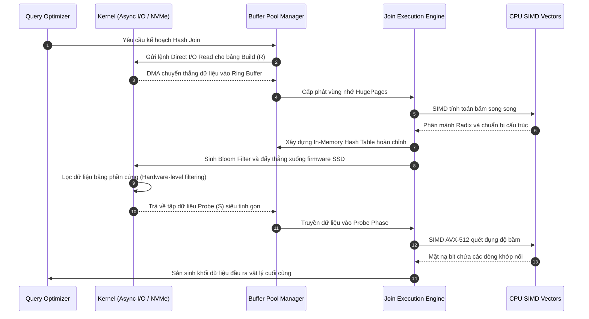

# Giải phẫu các Thuật toán Join: Nested Loop, Hash Join và Sort-Merge Join từ Cấp độ Vi kiến trúc

## Tóm tắt điều hành

Trong cơ sở dữ liệu quan hệ, phép join là thứ tốn kém nhất mà engine phải làm, và nó gần như luôn nằm ở trung tâm của mọi kế hoạch truy vấn. Chọn đúng thuật toán join không đơn thuần là bài toán độ phức tạp $O(N)$ trên giấy — đó là cuộc giành giật từng chu kỳ CPU, từng dòng cache, từng đơn vị băng thông lưu trữ, và kết quả phụ thuộc rất nhiều vào phần cứng bên dưới.

Bài viết này đi qua ba thuật toán join nền tảng — **Nested Loop Join**, **Hash Join**, và **Sort-Merge Join** — rồi đi xa hơn phần lý thuyết sách vở thường dừng lại. Chúng ta sẽ bàn tới những tối ưu thực sự quan trọng trong các engine hiện đại: Radix Partitioning, vector hóa SIMD (AVX-512), ảnh hưởng của kiến trúc NUMA, các thủ thuật quản lý bộ nhớ ở tầng hệ điều hành như Huge Pages, và thậm chí là đẩy logic lọc xuống tận thiết bị lưu trữ bằng Bloom Filter.

Đọc xong, bạn sẽ hiểu vì sao các thuật toán join lại hoạt động như vậy ở cấp độ phần cứng, vì sao một truy vấn có thể đột nhiên chậm đi hàng trăm lần mà không có lý do rõ ràng, và điều đó có ý nghĩa gì khi thiết kế hệ thống dữ liệu.

---

## Bản chất vấn đề: Vì sao Join lại khó

**Chúng ta đang giải quyết cái gì?**
Giả sử bạn có hai bảng lớn: `Orders` (1 tỷ dòng) và `Customers` (10 triệu dòng), và cần tìm mọi đơn hàng của khách ở Hà Nội. Về mặt toán học đây là một phép tích Đề-các kèm điều kiện lọc. Làm theo cách ngây thơ, đó là $1,000,000,000 \times 10,000,000 = 10^{16}$ phép so sánh — đủ để khiến bất kỳ máy nào quỵ gối nếu không có thuật toán join thông minh hơn.

Điểm nghẽn của phép join đã dịch chuyển qua nhiều thập kỷ:
- **Thời đại ổ đĩa quay:** seek time chi phối mọi thứ. Thuật toán tốt nhất là thuật toán chạm đĩa ít lần nhất.
- **Thời đại in-memory / NVMe:** khi dữ liệu nằm trong RAM hoặc trên SSD đạt hàng triệu IOPS, điểm nghẽn chuyển sang CPU và băng thông bộ nhớ. Cache miss và TLB miss mới là thứ thực sự giết chết hiệu năng.

Vì vậy các engine hiện đại — cả OLTP lẫn OLAP — liên tục làm lại thuật toán join của mình để bám sát những gì phần cứng bên dưới thực sự thưởng cho.

---

## Nền tảng lý thuyết và độ phức tạp

Xét hai quan hệ $R$ (phía outer/build) và $S$ (phía inner/probe) với số tuple lần lượt là $|R|$ và $|S|$.

### Nested Loop Join và các biến thể

Dạng đơn giản nhất là hai vòng lặp lồng nhau quét từng bản ghi.
- **Tuple-at-a-time Nested Loop Join:** $\mathcal{O}(|R| \times |S|)$. Tệ cả về lý thuyết lẫn thực tế.
- **Block Nested Loop Join (BNLJ):** nạp các trang của $R$ và $S$ vào RAM theo khối thay vì từng dòng một. Với $M$ trang RAM khả dụng, chi phí I/O giảm còn $\mathcal{C}_{I/O} = P_R + \lceil \frac{P_R}{M-2} \rceil \times P_S$. Cách này chuyển điểm nghẽn từ độ trễ quay đĩa sang băng thông bộ nhớ.
- **Index Nested Loop Join (INLJ):** dùng index B+ Tree trên $S$ để không phải quét toàn bộ $S$. Độ phức tạp giảm xuống $\mathcal{O}(|R| \log_b |S|)$ — lựa chọn mặc định trong OLTP một khi $R$ đã được lọc còn ít dòng.

### Hash Join

Khi vị từ join là điều kiện bằng (equi-join), **Hash Join** cho độ phức tạp kỳ vọng $\mathcal{O}(|R| + |S|)$, chia làm hai giai đoạn:
1. **Build Phase:** quét $R$ và đưa từng bản ghi vào bảng băm trong RAM bằng hàm $h(k)$.
2. **Probe Phase:** quét $S$ và tra từng khóa vào bảng băm đó.

Vấn đề của Hash Join cổ điển: nó chỉ nhanh khi bảng băm nằm gọn trong RAM. Một khi tràn RAM, hệ điều hành bắt đầu swap trang xuống đĩa, gây thrashing với truy cập ngẫu nhiên, và hiệu năng rơi tự do.

**Grace Hash Join** ra đời chính là để giải quyết chuyện đó. Nó phân vùng cả $R$ và $S$ thành $k$ phần nằm trên đĩa bằng hàm băm $h_1(k)$, sao cho mỗi $R_i$ vừa đủ nhỏ để nằm gọn trong RAM. Sau đó nó nạp từng cặp $(R_i, S_i)$ và join cục bộ. Chi phí I/O là $\mathcal{C}_{I/O} = 3(P_R + P_S)$ — một lượt ghi các phân vùng xuống đĩa, một lượt đọc lại cho $R$, một lượt cho $S$.

### Sort-Merge Join (SMJ)

SMJ bỏ hẳn việc băm, dựa vào tính đã sắp xếp của dữ liệu. Nó tỏa sáng khi dữ liệu đã được index sẵn theo khóa join.
1. **Sort Phase:** với dữ liệu lớn, dùng External Merge Sort — độ phức tạp $\mathcal{O}(|R| \log_M |R| + |S| \log_M |S|)$.
2. **Merge Phase:** đặt hai con trỏ chạy song song dọc $R$ và $S$. Tuyến tính: $\mathcal{O}(|R| + |S|)$.

Cái được lớn nhất của SMJ là I/O của nó hoàn toàn tuần tự — không có truy cập ngẫu nhiên, đúng thứ bạn muốn trên ổ đĩa quay hoặc trong môi trường ít RAM.

---

## Tối ưu ở tầng vi kiến trúc: đưa thuật toán join tới gần phần cứng

Khi cơ sở dữ liệu chuyển sang chạy in-memory (SAP HANA, MemSQL và tương tự), cuộc chơi thay đổi hoàn toàn. Điểm nghẽn không còn là đĩa nữa mà chuyển sang vi kiến trúc CPU — cache L1/L2/L3, bộ dự đoán nhánh, và TLB.

### Cache Miss và TLB Thrashing

Xây dựng và tra cứu bảng băm về bản chất là truy cập ngẫu nhiên. Khi bảng đó lớn lên — chẳng hạn 10GB — bạn sẽ liên tục trượt khỏi L3. Một lần truy cập DRAM tốn 100-300 chu kỳ CPU, và trong lúc đó các ALU chỉ ngồi không.

**Radix Hash Join** đối phó bằng chiến lược chia-để-trị quyết liệt: chia dữ liệu thành các khối đủ nhỏ để vừa L1 (32KB) hoặc L2 (256KB), dùng phép dịch bit trên giá trị băm để quyết định phân vùng.
Nhưng nếu phân vùng quá mạnh trong một lượt, bạn sẽ làm tràn TLB (Translation Lookaside Buffer), gây ra TLB thrashing kiểu khác. Cách khắc phục là radix partitioning nhiều lượt — chia nhỏ công việc phân vùng ra nhiều pass. Đánh đổi ở đây khá rõ ràng: tốn thêm băng thông bộ nhớ tuần tự khi lặp lại một lượt luôn rẻ hơn phải chịu độ trễ truy cập ngẫu nhiên.

### Vector hóa với SIMD

Trong mô hình thực thi Volcano cổ điển, mỗi nhánh `if/else` (ví dụ kiểm tra va chạm băm) là một cơ hội để dự đoán sai. Dự đoán nhánh sai nghĩa là pipeline bị xả — CPU vứt bỏ phần việc đã suy đoán trước, tốn hàng chục chu kỳ.

AVX-512 né tránh chuyện này bằng cách xử lý 16 số nguyên 32-bit cùng lúc. Đoạn C++ dưới đây cho thấy hình dạng của việc probing SIMD không nhánh kết hợp với software prefetching:

```cpp
#include <immintrin.h>

// Vectorized probing logic cho mảng Hash Join trong bộ nhớ
inline void simd_probe_hash_table(
    const int32_t* probe_keys, 
    const int32_t* hash_table, 
    uint32_t num_keys, 
    uint32_t* output_buffer) 
{
    uint32_t out_idx = 0;
    // Xử lý 16 khóa song song
    for(uint32_t i = 0; i < num_keys; i += 16) {
        __m512i v_probe = _mm512_loadu_si512((__m512i*)&probe_keys[i]);
        
        // Software Prefetching: Ép CPU nạp dữ liệu vào Cache trước 64 vòng
        _mm_prefetch((const char*)&probe_keys[i + 1024], _MM_HINT_T0);

        // Tính Hash song song bằng toán tử XOR / Dịch bit
        __m512i v_hashes = _mm512_xor_si512(v_probe, _mm512_srli_epi32(v_probe, 15));
        
        // Gather: Lấy ngẫu nhiên các bucket từ Hash table song song
        __m512i v_ht_entries = _mm512_i32gather_epi32(v_hashes, hash_table, 4);
        
        // SIMD so sánh không dùng lệnh IF
        __mmask16 match_mask = _mm512_cmpeq_epi32_mask(v_probe, v_ht_entries);
        
        // Nén và ghi kết quả liên tục
        __m512i v_matched = _mm512_maskz_compress_epi32(match_mask, v_probe);
        _mm512_storeu_si512((__m512i*)&output_buffer[out_idx], v_matched);
        out_idx += _mm_popcnt_u32(match_mask);
    }
}
```

### Ảnh hưởng của kiến trúc NUMA

Trên các máy chủ nhiều socket, RAM bị chia vật lý thành từng vùng riêng cho mỗi socket, và truy cập chéo socket qua Intel QPI tốn thêm độ trễ đáng kể. Để tránh khoản phí đó, các cơ sở dữ liệu dùng **Data Pinning** và **Thread Affinity** để bảng băm do lõi ở socket A xây dựng luôn nằm trong RAM cục bộ của socket A — biến một máy chủ thành một cụm shared-nothing thu nhỏ.

---

## Quản lý bộ nhớ ở hệ điều hành và I/O bất đồng bộ

### Huge Pages

Khi hệ điều hành cấp phát một bảng băm cỡ vài chục GB bằng trang mặc định 4KB, nó phải theo dõi hàng triệu mục trong bảng trang — công thức chuẩn cho TLB miss. Chuyển sang **Huge Pages (2MB hoặc 1GB)** giảm số mục đó xuống vài bậc độ lớn, đẩy tỷ lệ trúng TLB lên gần 99.9% và tăng tốc đáng kể các truy vấn in-memory. Hầu hết các engine nghiêm túc cũng bỏ hẳn allocator đa dụng để tự xây arena allocator riêng cho việc này.

### I/O bất đồng bộ và Direct I/O

I/O blocking đơn giản là không theo kịp những gì một SSD NVMe có thể làm. Các engine hiện đại dùng `io_uring` trên Linux (hoặc AIO) để xếp hàng chục nghìn lệnh đọc bất đồng bộ, cho phép CPU tiếp tục tính băm trong khi thiết bị bơm dữ liệu vào qua DMA — I/O và tính toán chồng lấp gần như hoàn toàn.

Thêm vào đó, **Direct I/O** cho phép cơ sở dữ liệu bỏ qua hẳn OS page cache. Phép join về bản chất là "quét một lần rồi thôi": cho dữ liệu đó đi qua page cache chỉ tổ đẩy các trang hữu ích khác ra ngoài và phải trả thêm chi phí sao chép dư thừa, mà chẳng được lợi gì.

---

## Storage Offloading và Bloom Filter Pushdown

Đẩy ý tưởng này đi xa hơn, ta có computational storage kết hợp với Bloom Filter — một sự cộng hưởng khá đẹp. Thay vì kéo hàng terabyte dữ liệu từ SSD qua PCIe vào RAM chỉ để vứt bỏ phần lớn, CPU xây một Bloom Filter nhỏ gọn từ quan hệ build $R$ rồi gửi thẳng nó xuống bộ điều khiển SSD (SmartNIC hoặc FPGA).

$$p = \left( 1 - e^{-\frac{kn}{m}} \right)^k$$

Có filter đó trong tay, SSD tự đánh giá vị từ và loại bỏ ngay các dòng không khớp của $S$ tại tầng phần cứng, trước khi chúng kịp chạm vào bus PCIe.



---

## Bài học rút ra và thực hành tốt

Vài điều đáng ghi nhớ cho data engineer và kiến trúc sư hệ thống:

1. **Hiểu dữ liệu của bạn trước khi chọn thuật toán.** Đừng để optimizer mặc định chọn Hash Join. Nếu kết quả cuối cùng dù sao cũng cần `ORDER BY` theo khóa join, gợi ý dùng Sort-Merge Join thường rẻ hơn vì nó bỏ được bước sắp xếp cuối cùng.
2. **Quản lý bộ nhớ là một kỹ năng sinh tồn.** Hết bộ nhớ trong lúc Hash Join không làm sập database — nó âm thầm rơi về Grace Hash Join và bắt đầu tràn xuống đĩa. Một truy vấn từng chạy 5 giây có thể biến thành 5 giờ. Hãy tinh chỉnh cẩn thận các tham số buffer như `work_mem` của Postgres.
3. **Cấu hình hệ điều hành không phải chuyện phụ.** Trên các hệ thống lớn, bỏ qua việc cấu hình Huge Pages lãng phí một phần đáng kể năng lực CPU. Hiểu rõ topology NUMA — rồi hoặc tinh chỉnh theo nó, hoặc chủ động tắt đi — giúp bạn tránh được cái bẫy độ trễ khi truy cập chéo socket.
4. **Đồng thiết kế phần cứng và phần mềm là chuyện quan trọng.** Cơ sở dữ liệu hiện đại không còn đơn thuần là phần mềm nữa. Tốc độ thực sự đến từ sự cộng sinh cơ học giữa code và phần cứng: SIMD, cấu trúc dữ liệu ý thức về cache, và vắt kiệt từng chút băng thông NVMe.

## Kết luận

Từ vòng lặp lồng thô sơ cho đến radix hash join vector hóa đa lượt và sort-merge join chạy trên mạng song song, các thuật toán join là một case study về việc dung hòa thiết kế phần mềm với vật lý của máy móc bên dưới. Hiểu rõ chúng là một trong những kỹ năng bền vững nhất cho bất kỳ ai xây dựng hoặc vận hành hệ thống dữ liệu quy mô lớn.

---
