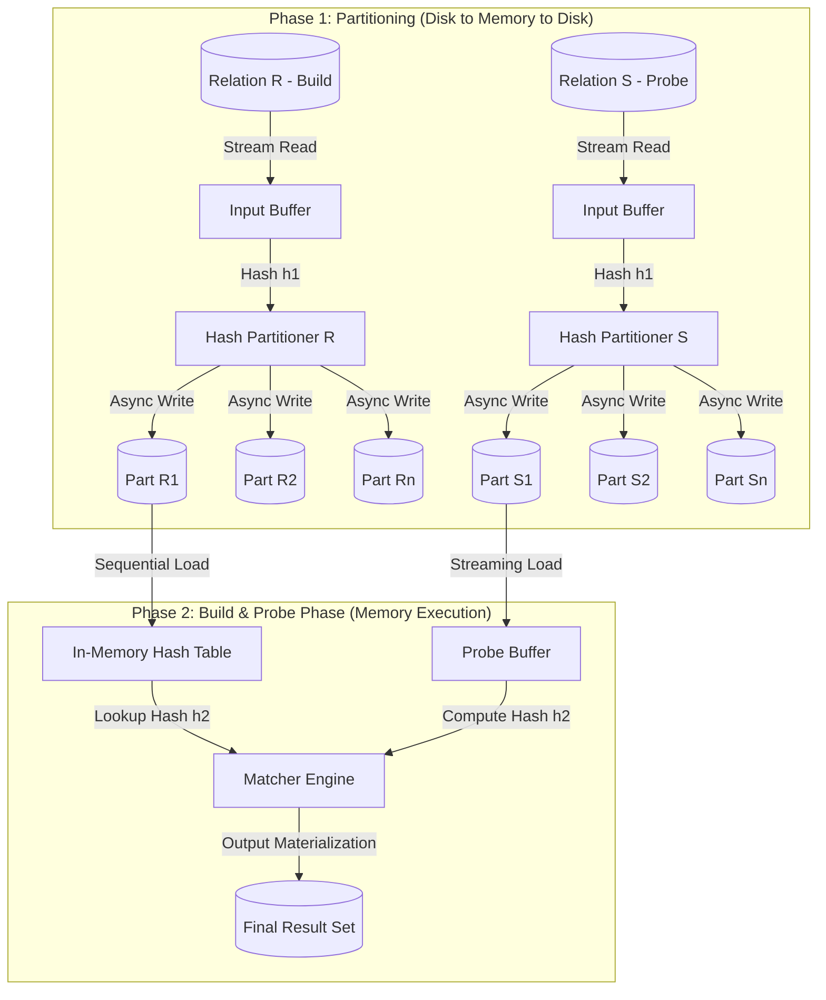
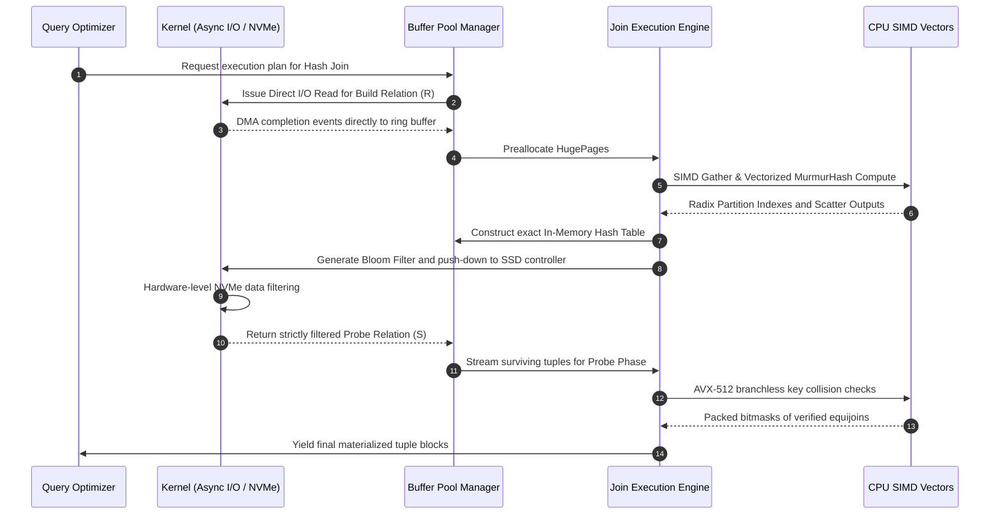

# 35: Join Algorithms Deep Dive: Nested Loop, Hash Join, và Sort-Merge Join

## Theoretical Foundations and Asymptotic Complexity of Relational Joins
Trong lý thuyết cơ sở dữ liệu quan hệ, toán tử kết nối (join operator) là một trong những phép toán đắt đỏ nhất và đóng vai trò trung tâm trong quá trình thực thi truy vấn. Việc phân tích và thiết kế các thuật toán join đòi hỏi một sự am hiểu sâu sắc về độ phức tạp thời gian, không gian bộ nhớ, cũng như cấu trúc dữ liệu cơ sở. Xét hai quan hệ $R$ và $S$ với số lượng tuple tương ứng là $|R|$ và $|S|$, trong đó $R$ thường được quy ước là quan hệ bên ngoài (outer relation) hay quan hệ xây dựng (build relation), và $S$ là quan hệ bên trong (inner relation) hay quan hệ thăm dò (probe relation). Thuật toán Nested Loop Join (NLJ) là dạng thức cơ bản nhất, biểu diễn một phép tích Đề-các (Cartesian product) được lọc bởi một vị từ (predicate). Trong biến thể nguyên thủy nhất là Tuple-centric Nested Loop Join, hệ thống thiết lập hai vòng lặp lồng nhau duyệt qua từng bản ghi đơn lẻ, mang lại độ phức tạp thời gian tiệm cận là $\mathcal{O}(|R| \times |S|)$, một con số không thể chấp nhận được trong các hệ thống xử lý phân tích trực tuyến (OLAP) quy mô lớn khi cả hai quan hệ đều chứa hàng trăm triệu dòng. 

Tuy nhiên, cấu trúc này là nền tảng khởi nguồn cho các tối ưu hóa tinh tế. Bằng cách thay đổi mô hình truy cập bộ nhớ và I/O, Block Nested Loop Join (BNLJ) cải thiện đáng kể chi phí đọc từ đĩa bằng cách nạp các khối (blocks/pages) của $R$ và $S$ vào bộ nhớ đệm thay vì duyệt từng tuple một. Nếu kích thước bộ đệm khả dụng là $M$ trang (pages), và $R$ có $P_R$ trang, $S$ có $P_S$ trang, thì chi phí I/O của BNLJ được tối ưu hóa bằng cách giữ $M-2$ trang của $R$ trong bộ nhớ, dùng một trang để đọc $S$ và một trang để xuất dữ liệu đầu ra. Công thức chi phí truy xuất đĩa (I/O cost) lúc này trở thành $\mathcal{C}_{I/O} = P_R + \lceil \frac{P_R}{M-2} \rceil \times P_S$. BNLJ thay đổi điểm nghẽn hiệu suất từ sự trễ của trục quay đĩa từ sang giới hạn của băng thông bộ nhớ và chu kỳ thực thi CPU. Khi hệ thống có sự hỗ trợ của các chỉ mục cấu trúc cây (B+ Trees) hoặc bảng băm tĩnh trên quan hệ $S$, Index Nested Loop Join (INLJ) được ưu tiên sử dụng. INLJ bỏ qua bước quét toàn bộ quan hệ $S$, thay vào đó thực hiện việc tìm kiếm qua chỉ mục với chi phí $\mathcal{O}(\log_{b} |S|)$ cho mỗi tuple của $R$, khiến độ phức tạp giảm xuống $\mathcal{O}(|R| \log_b |S|)$. Thuật toán này thể hiện sự ưu việt tuyệt đối trong các hệ thống xử lý giao dịch trực tuyến (OLTP) nơi $R$ có kích thước nhỏ do được lọc bằng các vị từ chọn lọc (highly selective predicates).

Khi vị từ kết nối là phép bằng (equi-join), Hash Join nổi lên như một giải pháp mang tính hệ thống với độ phức tạp thời gian kỳ vọng tuyến tính $\mathcal{O}(|R| + |S|)$. Dưới góc nhìn kiến trúc, Hash Join hoạt động dựa trên hai giai đoạn phân biệt: giai đoạn xây dựng (Build Phase) và giai đoạn thăm dò (Probe Phase). Trong giai đoạn xây dựng, hệ thống quét qua quan hệ $R$ và áp dụng một hàm băm $h(k)$ lên khóa kết nối để phân bổ các tuple (hoặc tham chiếu của chúng) vào một bảng băm (Hash Table) cấu trúc trong bộ nhớ chính. Để tránh hiện tượng đụng độ băm (hash collisions), các cơ sở dữ liệu hiện đại áp dụng các chiến lược giải quyết đụng độ chuỗi mở (open addressing) với thăm dò tuyến tính (linear probing), hoặc băm Cuckoo (Cuckoo Hashing) để đảm bảo thời gian truy xuất tồi tệ nhất ở mức $\mathcal{O}(1)$. Giai đoạn thăm dò tiếp nối bằng cách quét qua quan hệ $S$, áp dụng cùng hàm băm $h(k)$ lên khóa kết nối của từng tuple trong $S$ để tìm kiếm các bản ghi khớp trong bảng băm. Hiệu suất của Classic Hash Join phụ thuộc cực kỳ nghiêm ngặt vào khả năng hệ thống giữ toàn bộ bảng băm trong bộ nhớ chính. Nếu bảng băm vượt quá dung lượng bộ nhớ định mức, sự tráo đổi trang (paging/swapping) do hệ điều hành kiểm soát sẽ gây ra sự sụp đổ hiệu suất (thrashing) do truy cập ngẫu nhiên trên đĩa.

Để giải quyết giới hạn không gian lưu trữ vật lý, Grace Hash Join và Partitioned Hash Join chia để trị vấn đề thông qua quá trình phân vùng trung gian. Grace Hash Join phân vùng cả hai quan hệ $R$ và $S$ thành $k$ phân vùng vật lý trên đĩa sao cho phân vùng lớn nhất của $R_i$ có thể nằm gọn trong bộ nhớ, sử dụng một hàm băm $h_1(k)$ riêng biệt. Toán học phía sau việc phân chia đảm bảo rằng nếu $r \in R_i$ và $s \in S_j$ có cùng giá trị khóa, thì chắc chắn $i = j$. Việc chia tách này cho phép hệ thống nạp từng cặp phân vùng $(R_i, S_i)$ vào bộ nhớ, tạo bảng băm trên $R_i$ bằng hàm băm $h_2(k)$ và thăm dò bằng $S_i$. Chi phí I/O lý thuyết cho Grace Hash Join bao gồm việc đọc và ghi toàn bộ dữ liệu trong giai đoạn phân vùng, và đọc lại trong giai đoạn kết nối, dẫn đến chi phí xấp xỉ $\mathcal{C}_{I/O} = 3(P_R + P_S)$. Sự tối ưu hóa tiến xa hơn với Hybrid Hash Join, thuật toán này tận dụng tối đa bộ nhớ còn thừa trong giai đoạn phân vùng để lưu trữ trực tiếp phân vùng $R_0$ trong bộ nhớ chính thay vì ghi xuống đĩa, giúp tiết kiệm một lượng đáng kể thao tác I/O. Phương trình phân phối băm đòi hỏi các hàm băm gia đình murmur3 hoặc cityhash để đạt được tính đồng nhất phân phối, nhằm tránh các điểm nóng bất đối xứng (data skewness), nơi một phân vùng có số lượng bản ghi phình to bất thường, ép hệ thống phải thực hiện việc phân vùng lại đệ quy (recursive partitioning).

Sort-Merge Join (SMJ) đưa ra một hệ hình (paradigm) hoàn toàn khác biệt, rũ bỏ sự phụ thuộc vào cấu trúc băm bằng cách sử dụng các đặc tính thứ tự đại số. SMJ cực kỳ hữu dụng khi dữ liệu đầu vào đã được cấu trúc theo thứ tự từ B-Tree index, hoặc khi câu lệnh SQL tổng thể yêu cầu thao tác Order By hoặc Group By ở các bước kế tiếp. Giai đoạn đầu tiên, Sort Phase, là thách thức cốt lõi. Nếu dữ liệu khổng lồ không vừa RAM, thuật toán External Merge Sort được áp dụng. External Sort sử dụng các hàng đợi ưu tiên (Priority Queues/Tournament Trees) để tạo ra các đường chạy sắp xếp sơ bộ (sorted runs) bằng thuật toán Replacement Selection, sau đó trộn (merge) chúng lại thông qua nhiều vòng (multi-pass k-way merge). Độ phức tạp của External Sort chịu chi phối bởi $\mathcal{O}(|R| \log_M |R| + |S| \log_M |S|)$. Giai đoạn trộn (Merge Phase) thiết lập hai con trỏ luồng quét dọc theo hai quan hệ. Tại mỗi bước lặp, giá trị khóa $R_k$ và $S_k$ được so sánh: nếu $R_k = S_k$, một kết quả mới được đưa vào output buffer; nếu $R_k < S_k$, con trỏ của $R$ được tịnh tiến, và ngược lại. Nếu tồn tại nhiều tuple trong $S$ có cùng khóa, thuật toán phải duy trì một con trỏ khôi phục (backtracking pointer) để quét lại các tuple này đối với mỗi tuple tương ứng của $R$. Trong môi trường thực tế, với khóa ngoại toàn vẹn, độ phức tạp của Merge Phase là tuyến tính $\mathcal{O}(|R| + |S|)$. Lợi thế vĩ đại của Sort-Merge Join nằm ở tính tuần tự (sequential I/O pattern). Truy xuất dữ liệu ngẫu nhiên (Random Access) được triệt tiêu hoàn toàn, làm cho SMJ trở thành lựa chọn hoàn hảo trên các hệ thống lưu trữ có độ trễ tìm kiếm cao như HDD.

Biểu đồ Mermaid dưới đây đặc tả đường dẫn kiến trúc dữ liệu của cấu trúc Grace Hash Join tích hợp với hệ thống chia vùng.



## Micro-Architectural Implications and Hardware-Aware Implementations
Sự chuyển dịch cơ bản từ kiến trúc cơ sở dữ liệu dựa trên đĩa từ (disk-resident) sang cơ sở dữ liệu lưu trữ trực tiếp trong bộ nhớ (in-memory databases) như SAP HANA, MemSQL hay các thành phần bộ nhớ cột của SQL Server, đã thay đổi hoàn toàn hệ quy chiếu của việc đánh giá hiệu suất. Khi chi phí I/O chậm chạp không còn làm lu mờ thời gian xử lý, giới hạn cổ chai chuyển dịch trực tiếp vào vi kiến trúc CPU (CPU micro-architecture), bao gồm cấu trúc phân cấp bộ nhớ đệm đa tầng (L1, L2, L3 caches), thiết kế pipeline sâu, bộ dự đoán phân nhánh (branch predictor), và tính song song mức lệnh (Instruction-Level Parallelism - ILP). Hash Join cổ điển khi hoạt động trên In-Memory DB phơi bày những lỗ hổng chí mạng liên quan đến hiện tượng cache trượt (cache misses) và TLB misses. Quá trình xây dựng bảng băm yêu cầu cấp phát bộ nhớ rải rác, sau đó quá trình thăm dò thực hiện các phép đọc ngẫu nhiên (random memory accesses) trên toàn bộ dải địa chỉ bộ nhớ lớn (có thể lên tới hàng chục GB). Bất cứ một truy vấn ngẫu nhiên nào vượt ra ngoài biên giới của bộ đệm L3 (chỉ từ 32MB đến 64MB ở các chip máy chủ phổ thông) đều buộc Memory Controller phải gọi tới bộ nhớ chính RAM (DRAM access), tốn kém khoảng 100-300 chu kỳ đồng hồ. Khoảng thời gian chết này, gọi là memory stall, triệt tiêu gần như hoàn toàn khả năng tính toán của các khối ALU trên CPU.

Để chế ngự sự hỗn loạn của việc truy xuất ngẫu nhiên, Radix Hash Join được thiết kế như một mô hình xử lý nhận thức phần cứng (hardware-aware) ưu việt tuyệt đối. Thay vì để bảng băm phình to tự do, Radix Hash Join sử dụng chiến lược chia để trị cực đoan bằng cách phân mảnh dữ liệu nhiều lần thành các cụm siêu nhỏ, sao cho mỗi phân vùng cục bộ vừa khít với không gian hạn hẹp của bộ đệm L1 (thường chỉ 32KB) hoặc L2 (khoảng 256KB-1MB). Quá trình phân vùng này dựa trên phép toán dịch bit (bit shift) lấy các bit cụ thể của hàm băm để tạo ra radix (cơ số). Nếu việc phân vùng thành số lượng phân đoạn khổng lồ được thực hiện trong một lần, kích thước mảng cấu trúc bảng trang (page table) dùng cho việc ánh xạ địa chỉ sẽ vượt quá số mục (entries) hỗ trợ của Translation Lookaside Buffer (TLB), gây ra TLB thrashing trầm trọng. Do đó, thuật toán phải thực hiện phân mảnh nhiều bước (multi-pass radix partitioning). Giả sử dung lượng phân mảnh yêu cầu là $2^B$, cấu trúc chia thành chuỗi $P_1, P_2, \dots, P_k$ bước, mỗi bước phân mảnh một số lượng bit nhỏ nhằm duy trì luồng ghi tuần tự thân thiện với tính năng Hardware Prefetcher của vi xử lý. Tổ hợp đánh đổi (trade-off) này thể hiện một chân lý thực dụng trong lập trình hệ thống: băng thông bộ nhớ tuần tự cực cao (được tiêu tốn bởi nhiều vòng lặp Radix) luôn rẻ hơn độ trễ bộ nhớ ngẫu nhiên của một vòng lặp nguyên khối. Công thức đánh giá phạt bộ nhớ được mô hình hóa xấp xỉ bằng $\mathcal{P}_{stall} = \sum_{i=1}^{N} \mathbb{P}(\text{TLB\_miss}_i) \times \Delta t_{TLB} + \mathbb{P}(\text{L3\_miss}_i) \times \Delta t_{DRAM}$.

Một mũi nhọn tối ưu hóa vi kiến trúc khác là áp dụng công nghệ xử lý vectơ hóa (Vectorization) qua tập lệnh SIMD (Single Instruction, Multiple Data) như AVX2 hoặc AVX-512 trên Intel, và SVE (Scalable Vector Extension) trên ARM. Trong mô hình thực thi cổ điển (tuple-at-a-time hay Volcano model), sự rẽ nhánh có điều kiện (conditional branches) khi so sánh khóa thường xuyên đánh lừa Branch Predictor, dẫn đến hiện tượng pipeline flush tốn kém hàng chục chu kỳ. Vectorization xử lý hàng loạt bản ghi thông qua các thanh ghi rộng (wide registers), thực thi một lệnh duy nhất để thao tác trên 16 hoặc 32 số nguyên cùng lúc. Đối với Sort-Merge Join, SIMD có thể thực hiện thuật toán sắp xếp Bitonic Sort, một dạng mạng phân loại không phụ thuộc vào dữ liệu đầu vào (data-independent sorting network), loại bỏ 100% sự phân nhánh có điều kiện. Đối với Hash Join, SIMD có thể thu thập (gather instructions) nhiều khóa thăm dò, tính toán hàm băm song song và phát hiện va chạm qua các phép toán logic mặt nạ bit (bitmask logic) không có bất kỳ lệnh chia nhánh nào. Dưới đây là mã giả C++ tích hợp nội tuyến (inline intrinsics) minh họa triết lý SIMD và cơ chế Prefetching bằng phần mềm:

```cpp
#include <immintrin.h>

// Vectorized probing logic for an in-memory hash join chunk
inline void simd_probe_hash_table(
    const int32_t* probe_keys, 
    const int32_t* hash_table, 
    uint32_t num_keys, 
    uint32_t* output_buffer) 
{
    uint32_t out_idx = 0;
    // Process 16 integer keys simultaneously using AVX-512
    for(uint32_t i = 0; i < num_keys; i += 16) {
        // Load 16 probe keys into a 512-bit vector register
        __m512i v_probe = _mm512_loadu_si512((__m512i*)&probe_keys[i]);
        
        // Software Prefetching: Explicitly hint the CPU to fetch data 
        // 64 cache lines ahead to hide DRAM latency
        _mm_prefetch((const char*)&probe_keys[i + 1024], _MM_HINT_T0);

        // Simulated parallel hash calculation via bitwise SIMD shifts/XORs
        __m512i v_hashes = _mm512_xor_si512(
                             v_probe, 
                             _mm512_srli_epi32(v_probe, 15)
                           );
        
        // Gather operation: Fetch potential matches from Hash Table randomly
        // using the computed SIMD hashes as indices
        __m512i v_ht_entries = _mm512_i32gather_epi32(
                                  v_hashes, 
                                  hash_table, 
                                  4 /* scale */
                               );
        
        // Perform branchless SIMD equality check
        // Returns a 16-bit mask where each 1 bit means a match
        __mmask16 match_mask = _mm512_cmpeq_epi32_mask(v_probe, v_ht_entries);
        
        // Compress and extract matching keys compactly without branching
        __m512i v_matched = _mm512_maskz_compress_epi32(match_mask, v_probe);
        _mm512_storeu_si512((__m512i*)&output_buffer[out_idx], v_matched);
        
        out_idx += _mm_popcnt_u32(match_mask);
    }
}
```

Kiến trúc Hệ thống Đa lõi Bộ nhớ Không Đồng Nhất (Non-Uniform Memory Access - NUMA) cấy thêm một tầng phức tạp đáng sợ vào các thuật toán join hiện đại. Trong một máy chủ đa socket, bộ nhớ DRAM được phân chia vật lý và gán trực tiếp cho từng bộ vi xử lý riêng biệt. Truy cập bộ nhớ cục bộ (local memory access) sẽ đạt được băng thông tối đa, trong khi việc truy xuất bộ nhớ chéo socket (remote memory access) thông qua giao thức Intel QPI hoặc AMD Infinity Fabric sẽ bị trừng phạt bởi độ trễ siêu cao và băng thông chật hẹp. Các cơ sở dữ liệu NUMA-aware Hash Join giải quyết triệt để rào cản này bằng phương pháp luận thiết kế ràng buộc dữ liệu (data pinning) và luồng tiểu trình cục bộ. Giai đoạn chia nhỏ Radix sẽ giới hạn việc sao chép dữ liệu liên-node (inter-node copy) thông qua các hàng đợi trao đổi vòng (ring message queues) được định cỡ chính xác sao cho dữ liệu đi qua liên kết QPI là hoàn toàn tuần tự thay vì rải rác. Các tiểu trình xây dựng và thăm dò bảng băm sẽ bị trói buộc cứng (hard affinity) vào từng nhân CPU chuyên biệt, và bảng băm cục bộ sẽ chỉ được cấp phát trên node NUMA đó, đảm bảo 100% tỷ lệ truy cập dữ liệu trong cấu trúc thăm dò là cục bộ, tái hiện lại mô hình tính toán song song hoàn hảo chia sẻ hư vô (share-nothing topology) ngay bên trong khuôn khổ phần cứng của một máy chủ.

## System-Level Memory Management and I/O Optimization Strategies
Đằng sau màn trình diễn ấn tượng của các tối ưu hóa vi kiến trúc phần cứng là lớp cơ sở hạ tầng chịu trách nhiệm quản lý bộ nhớ của hệ điều hành và các chiến lược tương tác I/O tinh vi do Động cơ Lưu trữ Cơ sở dữ liệu (Storage Engine) điều phối. Cấp phát bộ nhớ cho các phép kết nối quy mô lớn không đơn giản là gọi hàm chuẩn hóa từ thư viện hệ thống. Quá trình cấp phát động như vậy sinh ra sự phân mảnh không gian địa chỉ ảo, chi phí khóa luồng hạt nhân (mutex contention) khổng lồ, và quản lý siêu dữ liệu đồ sộ. Thay vào đó, các động cơ CSDL xây dựng các cấu trúc quản lý bộ nhớ đặc thù dựa trên định lý đấu trường (Arena Allocators) hay hệ nhóm đối tượng (Memory Pools). Khi một truy vấn Hash Join bắt đầu, CSDL sẽ yêu cầu hệ điều hành cung cấp một khối bộ nhớ liền kề hàng gigabyte. Đặc biệt, chiến lược sử dụng Trang Lớn (Huge Pages) - điển hình là các trang dung lượng 2MB hoặc 1GB trên nhân Linux so với mức cơ bản 4KB - là bắt buộc đối với hiệu năng In-Memory. Nếu bảng băm lớn 64GB được cấu trúc bằng trang 4KB, hệ thống sẽ phải duy trì hơn 16 triệu mục trong Bảng Trang (Page Table). Việc truy cập bộ nhớ ngẫu nhiên khiến TLB không thể lưu trữ hết, buộc Đơn vị Quản lý Bộ nhớ (MMU) của phần cứng phải thực hiện các bước duyệt qua ma trận bảng phân tầng cấp hạt nhân (Page Table Walks), biến một lần đọc bộ nhớ trễ 100 chu kỳ thành 400 chu kỳ. Thông qua API nhân cơ sở kết hợp với các cờ báo hiệu, cơ sở dữ liệu dập tắt điểm yếu chết người này bằng cách giảm thiểu triệt để số lượng bảng trang cần duyệt, giữ TLB luôn hoạt động ổn định ở tỷ lệ trúng bộ đệm (hit rate) hơn 99%.

Đối phó với kịch bản dữ liệu không đủ chứa trong RAM (Out-of-Core Execution), tối ưu hóa luồng I/O tiếp tục là một chiến trường sinh tử. Mô hình truy xuất đồng bộ truyền thống buộc tiểu trình bị tạm ngưng vô thời hạn (blocked) cho đến khi đĩa từ hoặc ổ cứng thể rắn SSD trả về dữ liệu. Mô hình này cản trở tiềm năng của các SSD NVMe hiện đại vốn được trang bị độ sâu hàng đợi song song lên tới 64K lệnh. Giải pháp thay thế là các cơ chế I/O bất đồng bộ tối tân (Asynchronous I/O) trong hạt nhân Linux, hoặc việc bỏ qua hoàn toàn không gian hệ điều hành (kernel bypass) bằng các thư viện mạng chuyên biệt. Động cơ Cơ sở dữ liệu có thể thiết lập các vòng nhẫn đệm không khóa (lockless ring buffers) chia sẻ chung giữa không gian người dùng và hệ thống. Các truy vấn Sort-Merge Join hay Grace Hash Join lúc này có thể ném hàng chục ngàn yêu cầu đọc/ghi xuống hàng đợi nộp (Submission Queue) mà không tốn một chu kỳ thay đổi ngữ cảnh (context switch) nào. Trong quá trình bộ điều khiển lưu trữ thực hiện việc chuyển đổi dữ liệu qua kênh DMA (Direct Memory Access), các nhân CPU hoàn toàn rảnh rỗi để thực thi các phép tính băm, lọc vị từ, hoặc sắp xếp ở giai đoạn khác, đạt tới ngưỡng chồng chéo I/O - Tính toán (I/O-Compute Overlap) tối ưu 100%.

Bên cạnh đó, việc trượt qua lớp Bộ đệm Trang Hệ Điều Hành (OS Page Cache) bằng cách sử dụng I/O Trực tiếp là một tôn chỉ của các kỹ sư lập trình nhân cơ sở dữ liệu. Hệ điều hành sử dụng chiến lược dọn dẹp truyền thống vốn chỉ phù hợp với các file văn bản nhỏ hoặc mô hình đọc ngẫu nhiên cục bộ. Việc Hash Join thực hiện một đường quét tuyến tính khổng lồ (table scan) trên các bảng chứa hàng tỷ dòng sẽ lập tức phá hủy và trục xuất tất cả dữ liệu có giá trị khác khỏi bộ đệm - một thảm họa tàn phá hiệu suất. Tồi tệ hơn, dữ liệu được sao chép dư thừa hai lần, từ bộ nhớ tạm lên hệ thống, rồi về tiến trình ứng dụng. Khi dùng công nghệ truyền qua trực tiếp, cSDL nắm toàn quyền kiểm soát vòng đời dữ liệu thông qua Trình quản lý Nhóm Đệm (Buffer Pool Manager) cục bộ. Nó có thể thay thế các trang nhớ bằng thuật toán nâng cao hơn chuyên biệt cho cơ sở dữ liệu, hoặc loại bỏ dữ liệu ngay lập tức sau khi quét qua vì hiểu được ngữ nghĩa "chỉ đọc một lần" (scan-once semantics) của thuật toán join.

Đẩy giới hạn tối ưu lên mức cực đoan, khái niệm Giảm tải Lưu trữ (Storage Offloading) kết hợp với cấu trúc xác suất Bộ lọc Bloom (Bloom Filter) tạo nên sự hiệp đồng kinh điển trong tối ưu Hash Join trên hệ thống có IO gắt gao. Trong môi trường kiến trúc Tính toán Lưu trữ (Computational Storage), trước khi dữ liệu của quan hệ thăm dò $S$ phải di chuyển một chặng đường dài tốn băng thông PCIe để lên CPU, CPU thực tế đã khởi tạo xong một mảng cấu trúc bit gọi là Bloom filter từ quan hệ xây dựng $R$. Cấu trúc nhỏ gọn này (vài MB) sẽ được chuyển tiếp sâu xuống tận bộ vi điều khiển (controller) của SSD FPGA hoặc SmartNIC. Phương trình lý thuyết xác suất định dạng tỷ lệ báo động giả (false positive rate) cho cấu trúc Bloom Filter sử dụng hàm băm $k$ định vị, không gian mảng $m$ bits cho $n$ phần tử cài đặt là:

$$p = \left( 1 - e^{-\frac{kn}{m}} \right)^k$$

Dựa vào tỷ lệ $p$ này, chip lưu trữ sẽ tự chủ đánh giá vị từ của hàng loạt tuple $S$. Nếu tuple cho ra kết quả băm ánh xạ tới một bit trị 0 trong bảng Bloom filter, tuple đó bị loại trừ ngay tại tầng phần cứng vật lý, khẳng định tuyệt đối không có sự khớp nối ở bảng kết quả. Cơ chế tuyệt vời này giảm thiểu hàng trăm Gigabyte dữ liệu rác truyền tải dọc qua bo mạch chủ (motherboard), thay vào đó chỉ đẩy những bản ghi tiềm năng về phía bảng băm trong bộ nhớ chính, khôi phục lại tài nguyên dải thông quý báu.



Với những luận điểm thiết kế xoáy sâu vào cốt lõi toán học, vi kiến trúc xử lý, cùng nền tảng quản lý bộ nhớ nhân điều hành, hệ sinh thái các thuật toán join—từ các luồng lặp lồng thô sơ cho tới Hash Join đa vòng băm véc-tơ hóa và Sort-Merge kết hợp mạng song song—thực sự đứng như một tượng đài về nghệ thuật dung hòa giữa kỹ thuật lập trình tinh xảo và bản chất vật lý của máy tính hiện đại. Sự am hiểu đến cấp độ nanomet và byte nhớ này là kim chỉ nam tối thượng để chế ngự các kho dữ liệu quy mô khổng lồ.

## SEO
title: "Join Algorithms Deep Dive: Nested Loop, Hash Join, và Sort-Merge Join"
description: "Phân tích chuyên sâu về kiến trúc vi mô CPU, quản lý bộ nhớ hệ điều hành cấp hạt nhân (Huge Pages, io_uring), và độ phức tạp toán học của các thuật toán Nested Loop, Hash Join và Sort-Merge Join."
keywords:
- Database Join Algorithms
- Grace Hash Join
- Sort-Merge Join Optimization
- Nested Loop Join
- SIMD Vectorization AVX-512
- In-Memory Databases Performance
- OS Memory Management HugePages
- NVMe Asynchronous I/O io_uring
- Radix Partitioning Database Architecture
- Bloom Filter Storage Pushdown
