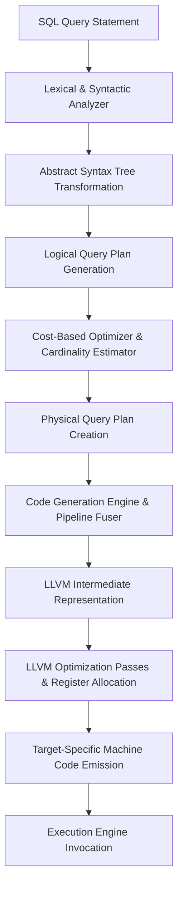
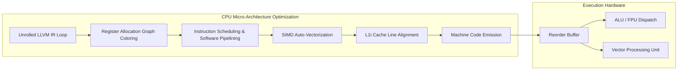

# 現代データベースにおけるJust-In-Time(JIT)コンパイル:アーキテクチャ徹底講座

## エグゼクティブサマリー

リレーショナルデータベース管理システムの進化は、長らくクエリ実行エンジンのオーバーヘッドに足を引っ張られてきた。ディスクI/Oが主要なボトルネックだった時代に設計された解釈実行モデルを、データベースは何十年も引きずってきたわけだ。しかしデータがインメモリ構造に移り、CPUが深いパイプラインを持つスーパースカラーの化け物へと進化するにつれ、この解釈のオーバーヘッドそのものが致命的なボトルネックに変わった。

本稿では、現代データベースにおける**JIT(Just-In-Time)コンパイル**を掘り下げる。クエリを解釈された実行計画から、実行時にその場で生成される専用の最適化済みマシンコードへと変換する、このパラダイムシフトの中身を見ていく。クエリコストの数学的な裏付け、Volcanoイテレータモデルからのシフト、LLVMベースのIR生成、L1i命令キャッシュの局所性や分岐予測、レジスタ割り当てといったマイクロアーキテクチャレベルの利点、さらに動的生成コードを実行する際にOSが課す制約まで扱う。ここまで理解しておけば、PostgreSQL(LLVM採用)やApache Spark Tungstenのようなエンジンがなぜ桁違いの性能を叩き出せるのか、その技術的な裏側と、自分で似た仕組みを実装する際の勘所が見えてくるはずだ。

---

## 核心の問い:なぜ従来型エンジンはCPUの力を引き出せないのか

**問題設定:** 分析クエリを実行するとき、従来型のデータベースエンジンはなぜ現代のCPUの能力を使い切れないのか。

従来型のデータベースは主に**Volcanoイテレータモデル**に依存してきた。クエリプランは演算子(operator)のツリーとして表現され、各演算子は標準インターフェースを実装し、子演算子から呼ばれる`next()`メソッドを公開する。この設計は拡張性が高くクリーンな抽象化を提供する一方、現代のスーパースカラーCPU上では深刻な性能ボトルネックを生む。

非効率の主な原因は、タプル1件ごとに発生する**仮想関数呼び出し(動的ディスパッチ)**の多用にある。数十億行を扱う典型的なデータウェアハウジングのワークロードでは、こうした間接分岐命令のオーバーヘッドが頻繁なパイプラインフラッシュと命令キャッシュ(L1i)ミスを引き起こし、1サイクルあたりの命令実行数(IPC)を大きく押し下げる。

これを式にしてみよう。$C_{eval}(t_i)$をタプル$t_i$の述語評価に必要なCPUサイクル数、$C_{dispatch}$を仮想関数ディスパッチのオーバーヘッドとすると、純粋な解釈実行エンジンの総実行時間$T_{interp}$は次のとおりだ。

$$ T_{interp} = \sum_{i=1}^{N} \left( C_{dispatch} + C_{eval}(t_i) + C_{materialize}(t_i) \right) $$ 

$N$が数十億にまで膨らむと、$C_{dispatch}$がCPU時間を丸ごと支配するようになる。つまりCPUは、データを実際に評価する時間よりも「次にどのコードを実行すべきか」を判断する時間の方に多く費やしていることになる。

---

## 解決策:コード生成とPushベースのパイプライン

この本質的な限界を突破するために、現代のデータベース管理システムは**JITコンパイル**を採用する。解釈された実行計画を、実行時に動的に生成されるタイトに結合したマシンコードへと作り替えるわけだ。

### PullベースからPushベースへ

クエリコンパイルの根っこにある発想は、演算子を1本のパイプラインへ融合したデータ中心のコードを生成することで、解釈のオーバーヘッドをそもそも発生させないことだ。仮想関数呼び出しを通じて演算子ツリーからタプルを引き出す(pull)従来のやり方の代わりに、クエリコンパイルは**Pushベースの実行モデル**を採る。

このモデルでは、データはストレージ層から読み込まれると、集約用ハッシュテーブルやソートバッファ、最終結果セットといったマテリアライゼーションポイントに到達するまで、演算子パイプラインを通じて上へ押し上げられていく。このPushベースのアプローチは現代のメモリ階層の特性にぴったり合っており、データ局所性を最大化し、キャッシュやメインメモリに溢れる前にできる限り長くデータをCPUレジスタ内へ留めておく。

クエリの構造に合わせて専用のループをその場で組み立てることで、JITコンパイラは$C_{dispatch}$を事実上ゼロにする。



### 性能向上を数式で見る

WHERE句の述語評価を考えてみる。解釈実行モデルでは、複雑な式ツリーをタプルごとに走査しなければならない。式ツリーが$k$個のノードから成るとすれば、コスト$C_{eval}(t_i)$は$O(k)$回のポインタ参照解決に比例する。

一方JITコンパイルは、式ツリーを一連のスカラー算術演算へと畳み込み、$C_{eval}(t_i)$を$O(1)$回のネイティブCPU命令にまで縮める。性能向上係数$\Gamma$は次のように書ける。

$$ \Gamma = \frac{\sum_{i=1}^{N} (C_{dispatch} + \alpha \cdot k)}{\sum_{i=1}^{N} (\beta) + T_{compile}} $$ 

$N \to \infty$になると、JITコンパイルされたクエリの漸近的な性能は圧倒的に有利になり、その上限はメモリ帯域幅だけで決まるようになる。

### JIT対ベクトル化

ベクトル化(タプルを配列にまとめてバッチ処理する手法)も、$C_{dispatch}$をベクトルサイズ$V$で割ることで償却する点は同じだ。ただしベクトル化には演算子間のマテリアライゼーションオーバーヘッドが付きまとう――データを一旦キャッシュに書き出し、また読み戻す必要があるからだ。JITコンパイルは、パイプライン全体を通じてタプルデータをCPUレジスタ内に留め続けることで、この制約自体を回避する。だから計算負荷の高い複雑なクエリほど、JITコンパイルには数学的な優位性がある。

---

## アーキテクチャ統合:LLVM IRの生成

この変換を実現するため、データベースエンジンは通常**LLVM**のような堅牢なコンパイラフレームワークを利用する。データベースのコードジェネレータは物理プランを走査しながら、Static Single Assignment(SSA)形式に基づく、強く型付けされたアーキテクチャ非依存のアセンブリ言語であるLLVM中間表現(IR)を出力する。

コードジェネレータは、生成するIRの中でSQLのデータ型、null許容性のセマンティクス、MVCCの可視性チェックをネイティブに、しかも細心の注意を払って扱わなければならない。SQLは3値論理(True、False、Unknown)を要求するため、生成コードには条件チェックが組み込まれる。これを最適化するために、コンパイラは**投機的実行とループアンスイッチング**を使い、カタログメタデータが非null制約を保証している場合はnullチェックを内側ループの外へ引き上げる。

```rust
// Hash Join Probeパイプライン向けのIR生成を示すRust風の疑似コード
fn generate_hash_join_probe_pipeline(
    builder: &mut IRBuilder, module: &mut IRModule, plan: &PhysicalJoinPlan
) -> Function {
    let pipeline_func = builder.create_function("HashJoinProbePipeline");
    let loop_block = builder.create_basic_block("loop", pipeline_func);
    let probe_block = builder.create_basic_block("probe_hash_table", pipeline_func);
    let emit_block = builder.create_basic_block("emit_joined_tuple", pipeline_func);
    
    // セットアップしてループへジャンプ
    builder.build_br(loop_block);
    
    // LOOPブロック:取得とハッシュ計算
    builder.set_insert_point(loop_block);
    let probe_tuple = emit_storage_layer_fetch(builder);
    let join_key = emit_expression_evaluation(builder, probe_tuple, plan.probe_key_expr);
    let hash_value = emit_murmur_hash3(builder, join_key);
    builder.build_br(probe_block);
    
    // PROBEブロック:ハッシュテーブルを確認
    builder.set_insert_point(probe_block);
    let bucket_ptr = emit_hash_table_lookup(builder, hash_table_ptr, hash_value);
    let is_match = emit_key_comparison(builder, bucket_ptr, join_key);
    builder.build_cond_br(is_match, emit_block, loop_block);
    
    // EMITブロック:一致を出力し継続
    builder.set_insert_point(emit_block);
    let combined_tuple = emit_tuple_concatenation(builder, probe_tuple, bucket_ptr);
    emit_pipeline_continuation(builder, combined_tuple, plan.parent_operator);
    builder.build_br(loop_block); 
    
    return pipeline_func;
}
```

---

## OSレベルのメモリ管理とセキュリティ上の制約

JITコンパイルされた関数のメモリ管理は、OSレベルで厄介な課題を持ち込む。LLVMがIRをマシンコードへ落とし込む際、生成されたバイナリは実行可能権限がマッピングされた物理メモリページへとフラッシュされなければならない。

### $W \oplus X$(Write XOR Execute)というセキュリティ原則

現代のOSはバッファオーバーフロー攻撃を軽減するために$W \oplus X$を強制する。メモリは書き込み可能と実行可能を同時に満たすことができない。そのためデータベースはシステムコール(POSIXなら`mprotect`、Windowsなら`VirtualProtect`)を次のように編成する必要がある。
1. ページを読み書き可能(`PROT_READ | PROT_WRITE`)として確保する。
2. マシンコードを生成しリンクする。
3. ページを読み取り/実行可能(`PROT_READ | PROT_EXEC`)へ切り替える。
4. CPUが新しい命令を確実にメインメモリからフェッチするよう、命令キャッシュをフラッシュする(`__builtin___clear_cache`)。

### TLBスラッシングとHuge Pages

巨大なデータセットを処理するにはTLB効率が要る。JIT実行は処理速度を最大化する一方で、ボトルネックをメモリアドレス変換の側へ押しやる。データベースは**Huge Pages**(2MBまたは1GB)でマッピングされた専用のアリーナアロケータを管理しなければならない。こうすることで1つのTLBエントリが広大な連続メモリ領域をカバーするようになり、実行中のTLBミスはほぼ消え去る。

---

## マイクロアーキテクチャの力学:CPUを解放する

JITの真価は、LLVMがアーキテクチャを意識した最適化パスを適用したときに発揮される。

### レジスタ割り当て(グラフ彩色)

変数はグラフ彩色を用いて物理CPUレジスタへマッピングされる。演算子を融合することで、中間変数(タプル属性)の生存期間は極めて短くなる。干渉グラフは疎なままとなり、データがCPUレジスタファイル内に留まり続けてL1キャッシュへの読み書きを丸ごと迂回する確率が最大化される。

### ループアンローリングとソフトウェアパイプライニング

ループアンローリングは、$N$回反復するループを$\frac{N}{U}$回の反復に作り替える。基本ブロックが大きくなることで、CPUのアウトオブオーダー実行エンジン(リオーダーバッファ、ROB)は独立した命令をより広い視野で見渡せるようになり、命令レベル並列性(ILP)が最大化される。
ソフトウェアパイプライニングはループの反復同士を重ね合わせ、メモリレイテンシを隠す。反復$i$がALUで評価されている間に、反復$i+1$はL1キャッシュからデータをフェッチしている、という具合だ。

### L1iキャッシュと分岐予測

インタプリタは命令キャッシュ(L1i)を荒らす。タイトな内側ループに巨大なswitch文や間接ポインタが詰め込まれ、CPUをスラッシングさせるからだ。JITコンパイルはロジックを連続した命令の並びへと畳み込み、決定論的な命令プリフェッチを可能にする。さらに制御フロー分岐をデータフロー演算(`cmov`)へ変換することで、分岐予測ミスのペナルティそのものを取り除く。



---

## 損益分岐点と適応的実行

コンパイルはタダではない。LLVMの最適化パスを走らせるだけでも相応のCPUサイクルを食う。では、JITコンパイルはいつ数学的に割に合うのか。

$T_{compile}$をコンパイルのレイテンシ、$c_{interp}$と$c_{jit}$をそれぞれ解釈実行パスとコンパイル実行パスのタプルあたりの処理時間とする。$N$個のタプルに対してJITが有利になるのは次の条件を満たすときだ。

$$ T_{compile} + N \cdot c_{jit} < N \cdot c_{interp} $$ 

$N$について解くと:

$$ N > \frac{T_{compile}}{c_{interp} - c_{jit}} $$ 

小規模なOLTPクエリでは$N$が小さすぎて、コンパイルのオーバーヘッドがかえって性能を損なう。逆に大規模なOLAPクエリでは$N$が膨大になるため、JITは桁違いの性能改善をもたらす。

### 適応的実行

$T_{compile}$を隠すため、高度なシステムは適応的実行を用いる。クエリはまず軽量なベクトル化インタプリタで即座に開始され、その裏でバックグラウンドスレッドがJITコンパイルを進める。コンパイルが終わると、エンジンは実行の途中で関数ポインタをホットスワップし、処理を止めることなく最大スループットへシームレスに切り替わる。

---

## 学びの要点とベストプラクティス

1. **コンパイルのオーバーヘッドは実在する。** すべてのクエリに機械的にJITを適用すると、かえって性能が退行することがある。信頼できるコストベースのヒューリスティクスと、パラメータ化クエリ向けにコンパイル済みバイナリを使い回すためのクエリプランキャッシュを実装しておくこと。
2. **JITに関してはPushベースがPullベースに勝る。** VolcanoのPullベースモデルをそのままJITコンパイルしても得られる恩恵はわずかだ。レジスタ局所性を最大化するには、アーキテクチャをPushベースかつパイプライン融合型のモデルへ移行させる必要がある。
3. **OSとのやり取りは軽視できない。** JITコードに対する頻繁な`mprotect`呼び出しや断片化したメモリ割り当てはレイテンシを生む。専用のアリーナアロケータとHuge Pagesを使うこと。
4. **C-ABIへのフォールバックを用意する。** すべてをJITコンパイルしようとしないこと。正規表現の解析、ロックの取得、バッファプールのスピルといった複雑なロジックは、静的にコンパイルされたC/C++関数として実装し、JITコードから標準のC-ABI経由で呼び出すのが理にかなっている。

## 結論

JITコンパイルの統合は、データベースを単なるアプリケーションソフトウェアの一層として扱う発想から、専用の動的コンパイラとして扱う発想への根本的なパラダイムシフトを意味する。実行時にカスタムマシンコードをその場で生成することで、現代のデータベースは高水準の宣言的クエリ言語(SQL)と、現代ハードウェアの容赦のないマイクロアーキテクチャの現実との間に長らく横たわっていた意味論的なギャップを埋め、シリコンの本来の潜在能力を引き出している。

---
