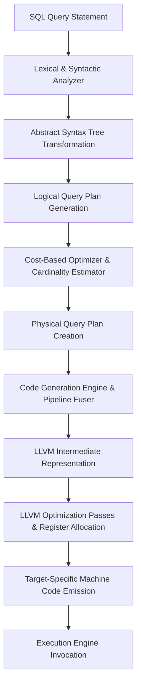
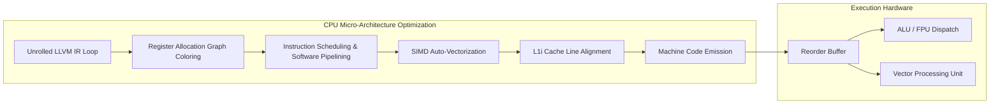

# Biên dịch Just-In-Time (JIT) trong Cơ sở dữ liệu Hiện đại: Một Lớp học Kiến trúc Chuyên sâu

## Tóm tắt điều hành

Sự phát triển của các hệ quản trị cơ sở dữ liệu quan hệ từ trước đến nay luôn bị kìm hãm bởi chi phí của chính động cơ thực thi truy vấn. Trong nhiều thập kỷ, cơ sở dữ liệu dựa vào mô hình thực thi thông dịch (interpreted execution) — một thiết kế phù hợp với thời kỳ I/O đĩa còn là nút thắt chính. Nhưng khi dữ liệu chuyển hẳn vào các cấu trúc trong bộ nhớ và CPU tiến hóa thành những cỗ máy siêu vô hướng (superscalar) với đường ống xử lý sâu, chính chi phí thông dịch đó lại trở thành nút thắt chết người.

Bài viết này mổ xẻ **biên dịch Just-In-Time (JIT)** trong các cơ sở dữ liệu hiện đại — một sự dịch chuyển mô hình biến truy vấn từ những kế hoạch được thông dịch thành mã máy tối ưu riêng, sinh ra ngay tại thời điểm chạy. Chúng ta sẽ đi qua nền tảng toán học của chi phí truy vấn, việc chuyển dịch từ mô hình vòng lặp Volcano sang sinh mã trung gian (IR) dựa trên LLVM, những lợi ích ở tầng vi kiến trúc — tính cục bộ của cache lệnh L1i, dự đoán rẽ nhánh, cấp phát thanh ghi — và cả những ràng buộc mà hệ điều hành đặt ra khi thực thi mã sinh động. Hiểu rõ cơ chế này, kỹ sư sẽ thấy được vì sao các engine như PostgreSQL (dùng LLVM) hay Apache Spark Tungsten đạt được những bước nhảy hiệu năng gấp nhiều bậc, cùng những bài học quan trọng khi tự triển khai hệ thống tương tự.

---

## Vấn đề cốt lõi: Vì sao engine truyền thống không khai thác hết CPU

**Câu hỏi đặt ra:** Vì sao các engine cơ sở dữ liệu truyền thống không thể tận dụng triệt để năng lực của CPU hiện đại khi chạy các truy vấn phân tích?

Các hệ thống cơ sở dữ liệu truyền thống chủ yếu dựa vào **mô hình vòng lặp Volcano (Volcano iterator model)**, trong đó kế hoạch truy vấn được biểu diễn như một cây các toán tử (operators). Mỗi toán tử triển khai một giao diện chuẩn, lộ ra một phương thức `next()` được các toán tử con gọi để sinh từng tuple. Thiết kế này cho khả năng mở rộng tốt và các lớp trừu tượng gọn gàng, nhưng lại gây ra những nút thắt hiệu năng nghiêm trọng trên kiến trúc CPU siêu vô hướng hiện đại.

Nguồn gốc chính của sự kém hiệu quả nằm ở việc dùng tràn lan **lệnh gọi hàm ảo (dynamic dispatch)** — thứ cần thiết để xử lý từng tuple một. Trong một kịch bản data warehousing điển hình xử lý hàng tỷ dòng, chi phí từ những lệnh rẽ nhánh gián tiếp này gây ra các lần xả pipeline và trượt cache lệnh (L1i) liên tục, kéo tụt số lệnh thực thi mỗi chu kỳ (IPC) đáng kể.

Để hình thức hóa chi phí này: gọi $C_{eval}(t_i)$ là số chu kỳ CPU cần để đánh giá vị từ trên tuple $t_i$, và $C_{dispatch}$ là chi phí phân phối lệnh gọi hàm ảo. Tổng thời gian thực thi $T_{interp}$ của một engine hoàn toàn thông dịch là:

$$ T_{interp} = \sum_{i=1}^{N} \left( C_{dispatch} + C_{eval}(t_i) + C_{materialize}(t_i) \right) $$ 

Khi $N$ tăng lên hàng tỷ, $C_{dispatch}$ áp đảo hoàn toàn thời gian CPU. Nói cách khác, CPU tiêu tốn nhiều thời gian để tìm ra *mã nào* cần chạy tiếp theo hơn là thực sự đánh giá dữ liệu.

---

## Giải pháp: Sinh mã và pipeline dựa trên Push

Để vượt qua giới hạn này, các hệ quản trị cơ sở dữ liệu hiện đại chuyển sang **biên dịch JIT**, biến kế hoạch thực thi được thông dịch thành mã máy tối ưu, kết dính chặt, sinh ra động ngay tại runtime.

### Từ thực thi dựa trên Pull sang dựa trên Push

Ý tưởng nền tảng của việc biên dịch truy vấn (query compilation) là loại bỏ chi phí thông dịch bằng cách sinh mã hướng dữ liệu, trong đó các toán tử được hợp nhất thành một pipeline liền mạch. Thay vì kéo (pull) tuple xuyên qua cây toán tử qua các lệnh gọi hàm ảo, việc biên dịch truy vấn dùng **mô hình thực thi dựa trên Push**.

Trong mô hình này, dữ liệu được đọc từ tầng lưu trữ rồi đẩy (push) lên xuyên suốt pipeline toán tử cho tới khi gặp một điểm hiện thực hóa — có thể là bảng băm tổng hợp, bộ đệm sắp xếp, hay tập kết quả cuối cùng. Cách tiếp cận dựa trên push này khớp rất tốt với đặc tính của phân cấp bộ nhớ hiện đại: nó tối đa hóa tính cục bộ của dữ liệu và giữ dữ liệu trong thanh ghi CPU lâu nhất có thể trước khi phải tràn xuống cache hay bộ nhớ chính.

Bằng cách tổng hợp những vòng lặp riêng, được thiết kế khớp với cấu trúc từng truy vấn cụ thể, trình biên dịch JIT loại bỏ gần như hoàn toàn $C_{dispatch}$.



### Bài toán hiệu năng bằng con số

Xét việc đánh giá vị từ trong mệnh đề WHERE. Ở mô hình thông dịch, một cây biểu thức phức tạp phải được duyệt lại cho từng tuple. Với cây biểu thức gồm $k$ nút, chi phí $C_{eval}(t_i)$ tỷ lệ với $O(k)$ lần dereference con trỏ.

Ngược lại, biên dịch JIT gộp cây biểu thức thành một chuỗi phép toán số học vô hướng, kéo $C_{eval}(t_i)$ xuống còn $O(1)$ lệnh CPU gốc. Ta có thể biểu diễn hệ số tăng hiệu năng $\Gamma$ như sau:

$$ \Gamma = \frac{\sum_{i=1}^{N} (C_{dispatch} + \alpha \cdot k)}{\sum_{i=1}^{N} (\beta) + T_{compile}} $$ 

Khi $N \to \infty$, hiệu năng tiệm cận của truy vấn được biên dịch JIT áp đảo hoàn toàn, và giới hạn trên lúc này chỉ còn phụ thuộc vào băng thông bộ nhớ.

### JIT so với vector hóa

Vector hóa (gộp tuple thành mảng để xử lý theo lô) cũng khấu hao $C_{dispatch}$ bằng cách chia nó cho kích thước vector $V$. Nhưng vector hóa lại phải gánh chi phí hiện thực hóa giữa các toán tử — dữ liệu phải được ghi vào cache rồi đọc lại. Biên dịch JIT vượt qua giới hạn đó bằng cách giữ nguyên dữ liệu tuple trong thanh ghi CPU xuyên suốt cả pipeline, nên về mặt toán học JIT có lợi thế rõ rệt hơn với các truy vấn phức tạp, nặng tính toán.

---

## Tích hợp kiến trúc: sinh mã IR của LLVM

Để hiện thực hóa việc chuyển đổi này, các engine cơ sở dữ liệu thường dựa vào các framework trình biên dịch mạnh như **LLVM**. Bộ sinh mã của cơ sở dữ liệu duyệt qua kế hoạch vật lý và sinh ra LLVM Intermediate Representation (IR) — một ngôn ngữ assembly độc lập kiến trúc, kiểu dữ liệu chặt chẽ, dựa trên dạng Static Single Assignment (SSA).

Bộ sinh mã phải xử lý cẩn thận kiểu dữ liệu SQL, ngữ nghĩa khả năng rỗng (nullability), và các kiểm tra khả kiến MVCC ngay trong IR sinh ra. Vì SQL đòi hỏi logic ba giá trị (True, False, Unknown), mã sinh ra phải nhúng các điều kiện kiểm tra. Để tối ưu việc này, trình biên dịch dùng **thực thi suy đoán và loop unswitching** để đưa các kiểm tra null ra khỏi vòng lặp bên trong, khi metadata catalog đã đảm bảo ràng buộc non-null.

```rust
// Mã giả dạng Rust minh họa việc sinh IR cho một Pipeline Probe của Hash Join
fn generate_hash_join_probe_pipeline(
    builder: &mut IRBuilder, module: &mut IRModule, plan: &PhysicalJoinPlan
) -> Function {
    let pipeline_func = builder.create_function("HashJoinProbePipeline");
    let loop_block = builder.create_basic_block("loop", pipeline_func);
    let probe_block = builder.create_basic_block("probe_hash_table", pipeline_func);
    let emit_block = builder.create_basic_block("emit_joined_tuple", pipeline_func);
    
    // Thiết lập và nhảy tới vòng lặp
    builder.build_br(loop_block);
    
    // LOOP BLOCK: Lấy dữ liệu và tính băm
    builder.set_insert_point(loop_block);
    let probe_tuple = emit_storage_layer_fetch(builder);
    let join_key = emit_expression_evaluation(builder, probe_tuple, plan.probe_key_expr);
    let hash_value = emit_murmur_hash3(builder, join_key);
    builder.build_br(probe_block);
    
    // PROBE BLOCK: Kiểm tra Bảng băm
    builder.set_insert_point(probe_block);
    let bucket_ptr = emit_hash_table_lookup(builder, hash_table_ptr, hash_value);
    let is_match = emit_key_comparison(builder, bucket_ptr, join_key);
    builder.build_cond_br(is_match, emit_block, loop_block);
    
    // EMIT BLOCK: Xuất kết quả khớp và tiếp tục
    builder.set_insert_point(emit_block);
    let combined_tuple = emit_tuple_concatenation(builder, probe_tuple, bucket_ptr);
    emit_pipeline_continuation(builder, combined_tuple, plan.parent_operator);
    builder.build_br(loop_block); 
    
    return pipeline_func;
}
```

---

## Quản lý bộ nhớ hệ điều hành và các ràng buộc bảo mật

Quản lý bộ nhớ cho các hàm biên dịch JIT đặt ra những thách thức không nhỏ ở tầng hệ điều hành. Khi LLVM hạ IR xuống mã máy, tệp nhị phân kết quả phải được ghi vào các trang bộ nhớ vật lý được ánh xạ với quyền thực thi.

### Nguyên tắc bảo mật $W \oplus X$ (Write XOR Execute)

Các hệ điều hành hiện đại áp đặt $W \oplus X$ để giảm thiểu tấn công tràn bộ đệm. Một vùng bộ nhớ không thể vừa ghi được vừa thực thi được cùng lúc. Cơ sở dữ liệu phải điều phối các lời gọi hệ thống (`mprotect` trên POSIX, `VirtualProtect` trên Windows) theo trình tự:
1. Cấp phát trang với quyền đọc/ghi (`PROT_READ | PROT_WRITE`).
2. Sinh và liên kết mã máy.
3. Chuyển trang sang quyền đọc/thực thi (`PROT_READ | PROT_EXEC`).
4. Xóa cache lệnh (`__builtin___clear_cache`) để đảm bảo CPU nạp các lệnh mới từ bộ nhớ chính.

### TLB Thrashing và Huge Pages

Thực thi trên tập dữ liệu khổng lồ đòi hỏi hiệu quả TLB. Thực thi JIT tối đa hóa tốc độ xử lý, nhưng đồng thời đẩy nút thắt cổ chai sang việc dịch địa chỉ bộ nhớ. Cơ sở dữ liệu phải quản lý một arena allocator chuyên biệt, ánh xạ với **Huge Pages** (2MB hoặc 1GB), để một mục TLB duy nhất có thể bao phủ một vùng nhớ liên tục rộng lớn, gần như triệt tiêu hoàn toàn tình trạng trượt TLB trong lúc thực thi.

---

## Động lực vi kiến trúc: giải phóng sức mạnh CPU

Sức mạnh thực sự của JIT chỉ bộc lộ khi LLVM áp dụng các bước tối ưu hóa nhận biết kiến trúc phần cứng.

### Cấp phát thanh ghi (tô màu đồ thị)

Các biến được ánh xạ vào thanh ghi CPU vật lý bằng kỹ thuật tô màu đồ thị (graph coloring). Nhờ hợp nhất các toán tử, các biến trung gian (thuộc tính tuple) có vòng đời cực ngắn. Đồ thị xung đột (interference graph) vẫn thưa thớt, giúp tối đa hóa khả năng mọi dữ liệu được giữ hoàn toàn trong tệp thanh ghi CPU, bỏ qua hẳn các thao tác đọc/ghi cache L1.

### Loop Unrolling và Software Pipelining

Loop unrolling biến một vòng lặp $N$ lần lặp thành $\frac{N}{U}$ lần lặp. Một basic block lớn hơn cho động cơ thực thi ngoài thứ tự của CPU (Reorder Buffer - ROB) tầm nhìn rộng hơn về các lệnh độc lập, giúp tối đa hóa song song hóa mức lệnh (ILP).
Software pipelining chồng lấn các lần lặp để che giấu độ trễ bộ nhớ: khi lần lặp $i$ đang được đánh giá trong ALU, lần lặp $i+1$ đã đang nạp dữ liệu từ cache L1.

### Cache L1i và dự đoán rẽ nhánh

Trình thông dịch phá hỏng cache lệnh (L1i) vì các vòng lặp bên trong chật hẹp chứa những câu lệnh switch khổng lồ và con trỏ gián tiếp, khiến CPU quay cuồng. Biên dịch JIT gộp logic thành mảng lệnh tuần tự liên tục, cho phép nạp trước lệnh một cách xác định. Hơn nữa, việc chuyển các nhánh điều khiển luồng thành thao tác dòng dữ liệu (`cmov`) loại bỏ hoàn toàn hình phạt do dự đoán rẽ nhánh sai.



---

## Điểm hòa vốn và thực thi thích ứng

Biên dịch không hề miễn phí. Chạy các bước tối ưu hóa của LLVM tốn một lượng chu kỳ CPU đáng kể. Vậy khi nào biên dịch JIT thực sự đáng giá về mặt toán học?

Gọi $T_{compile}$ là độ trễ biên dịch, $c_{interp}$ và $c_{jit}$ lần lượt là thời gian trên mỗi tuple của đường thông dịch và đường biên dịch. Với $N$ tuple, JIT có lợi khi:

$$ T_{compile} + N \cdot c_{jit} < N \cdot c_{interp} $$ 

Hay giải theo $N$:

$$ N > \frac{T_{compile}}{c_{interp} - c_{jit}} $$ 

Với các truy vấn OLTP nhỏ, $N$ quá nhỏ nên chi phí biên dịch phản tác dụng. Với các truy vấn OLAP khổng lồ, $N$ rất lớn và JIT mang lại cải thiện gấp nhiều bậc.

### Thực thi thích ứng

Để che giấu $T_{compile}$, các hệ thống tiên tiến dùng thực thi thích ứng (adaptive execution). Truy vấn bắt đầu ngay bằng một trình thông dịch vector hóa nhẹ, trong khi một luồng nền song song khởi động quá trình biên dịch JIT. Khi biên dịch xong, engine hoán đổi nóng (hot-swap) con trỏ hàm ngay giữa chừng, chuyển tiếp liền mạch sang thông lượng tối đa mà không gây gián đoạn.

---

## Bài học rút ra và thực hành tốt

1. **Chi phí biên dịch là có thật.** Áp dụng JIT một cách máy móc cho mọi truy vấn có thể gây thoái lui hiệu năng. Hãy dùng heuristic dựa trên chi phí đủ tin cậy, kèm cơ chế query plan caching để tái sử dụng các bản nhị phân đã biên dịch cho các truy vấn tham số hóa.
2. **Với JIT, push-based luôn thắng pull-based.** Cố biên dịch JIT một mô hình pull-based kiểu Volcano nguyên trạng chỉ mang lại lợi ích rất hạn chế. Kiến trúc cần chuyển sang mô hình push-based, hợp nhất pipeline, để tối đa hóa tính cục bộ của thanh ghi.
3. **Tương tác với hệ điều hành có ý nghĩa lớn hơn tưởng.** Các lệnh gọi `mprotect` liên tục và việc cấp phát bộ nhớ phân mảnh cho mã JIT đều gây độ trễ. Hãy dùng arena allocator chuyên biệt cùng Huge Pages.
4. **Luôn dự phòng bằng C-ABI.** Đừng cố biên dịch JIT mọi thứ. Những logic phức tạp — phân tích regex, giành khóa, tràn bộ đệm buffer pool — nên được viết thành hàm C/C++ biên dịch tĩnh, để mã JIT gọi qua C-ABI chuẩn.

## Kết luận

Việc tích hợp biên dịch JIT đánh dấu một sự dịch chuyển mô hình căn bản: từ coi cơ sở dữ liệu như một lớp phần mềm ứng dụng thuần túy, sang coi nó như một trình biên dịch động chuyên biệt. Bằng cách sinh mã máy tùy chỉnh ngay tại thời điểm chạy, các cơ sở dữ liệu hiện đại đã bắc cầu qua khoảng cách vốn tồn tại lâu nay giữa ngôn ngữ truy vấn khai báo cấp cao (SQL) và thực tế vi kiến trúc khắc nghiệt của phần cứng hiện đại, khai thác trọn vẹn tiềm năng của silicon.

---
