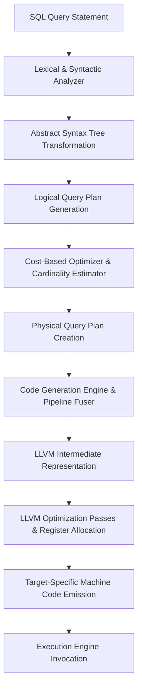
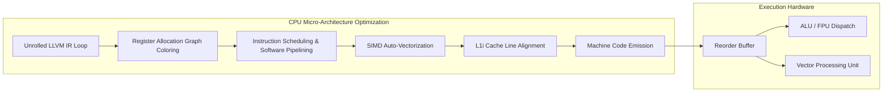
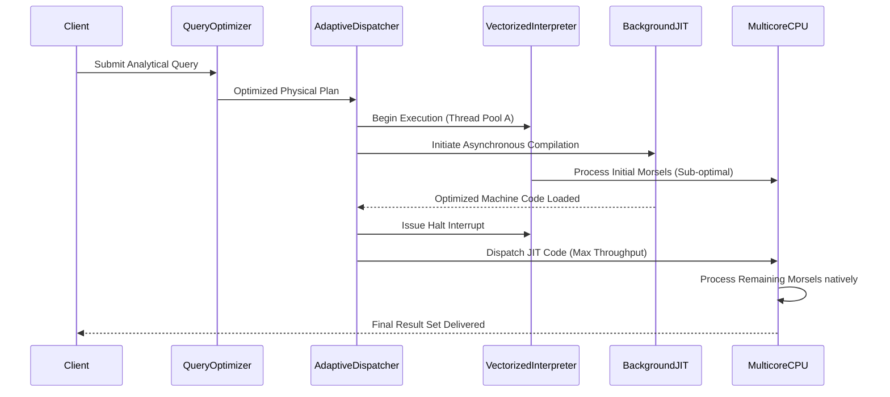

# Just-In-Time (JIT) Compilation in Modern Databases: An Architectural Masterclass

## Fundamentals of Query Compilation and Execution Models

The evolution of relational database management systems has historically been constrained by the overhead associated with query execution engines. Traditional database systems predominantly rely on the Volcano iterator model, where query plans are represented as a tree of operators. Each operator implements a standard interface, typically exposing a `next()` method, which child operators invoke to yield tuples. While this design offers high extensibility and clean abstractions, it introduces severe performance bottlenecks on modern superscalar processor architectures. The primary source of inefficiency stems from the extensive use of virtual function calls required to process every single tuple. In a typical data warehousing scenario processing billions of rows, the overhead of these indirect branch instructions leads to frequent pipeline flushes and instruction cache misses, drastically reducing instructions per cycle. To formalize the execution cost, let us define the total cost of evaluating a query plan over $N$ tuples. Let $C_{eval}(t_i)$ be the CPU cycles required to evaluate predicates on tuple $t_i$, and $C_{dispatch}$ be the virtual function dispatch overhead per tuple. The total execution time $T_{interp}$ for a purely interpreted engine can be approximated by the summation over all tuples as follows: $$ T_{interp} = \sum_{i=1}^{N} \left( C_{dispatch} + C_{eval}(t_i) + C_{materialize}(t_i) \right) $$ 

This equation illustrates that $C_{dispatch}$ scales linearly with the number of tuples processed. To circumvent this inherent limitation, modern database management systems employ Just-In-Time (JIT) compilation to transform the interpreted execution plan into highly optimized, tightly coupled machine code dynamically at runtime. The fundamental premise of query compilation is the elimination of interpreted overhead by generating data-centric code where operators are fused into cohesive pipelines. Instead of pulling tuples through an operator tree via virtual function calls, query compilation adopts a push-based execution model. In this paradigm, data is read from the storage layer and pushed upward through the operator pipeline until a materialization point—such as an aggregation hash table, a sort buffer, or the final result set—is encountered. This push-based model aligns perfectly with the characteristics of modern memory hierarchies, maximizing data locality and keeping data in CPU registers as long as possible before spilling to cache or main memory. By synthesizing bespoke loops tailored to the specific query structure, JIT compilers effectively remove $C_{dispatch}$ entirely, ensuring that the inner loops of query execution are perfectly unrolled, branch-predicted, and optimized for specific target architectures. 



To achieve this transformation, database engines typically leverage robust compiler frameworks like LLVM. The compilation process begins by traversing the physical query plan and emitting LLVM Intermediate Representation (IR), a strongly typed, architecture-independent assembly language based on Static Single Assignment (SSA) form. The LLVM IR allows the database engine to abstract away the intricacies of specific hardware targets, such as x86_64, ARM64, or PowerPC, while benefiting from decades of compiler optimization research. The database code generator acts as an interpreter over the physical plan, but instead of executing data processing logic directly on the tuples, it executes IR building logic. The generated IR encapsulates the exact sequence of instructions necessary to evaluate expressions, probe hash tables, and serialize results without any generic branching logic. Consider the mathematical evaluation of predicates within a WHERE clause. In an interpreted model, a complex expression tree must be traversed for each tuple. Let the expression tree consist of $k$ nodes. The cost $C_{eval}(t_i)$ becomes a function of $O(k)$ pointer dereferences and type checks. Conversely, JIT compilation collapses the expression tree into a sequence of scalar arithmetic operations, reducing $C_{eval}(t_i)$ to $O(1)$ native CPU instructions. We can represent the performance gain factor $\Gamma$ as the ratio of interpreted time to compiled time: $$ \Gamma = \frac{\sum_{i=1}^{N} (C_{dispatch} + \alpha \cdot k)}{\sum_{i=1}^{N} (\beta) + T_{compile}} $$ This formulation explicitly demonstrates that as $N \to \infty$, the asymptotic performance of the JIT-compiled query strictly dominates the interpreted counterpart, bounded only by memory bandwidth and the hardware limits of instruction execution, where $\alpha$ and $\beta$ are architecture-dependent constants representing the latency of memory accesses versus register-based arithmetic. 

Vectorization, pioneered by the MonetDB/X100 project, serves as an alternative to JIT compilation by batching tuples into arrays (vectors) and processing them using heavily unrolled loops over specialized primitives. While vectorization effectively amortizes $C_{dispatch}$ by dividing it over the vector size $V$, resulting in $\frac{C_{dispatch}}{V}$, it still suffers from materialization overhead between operators within the pipeline. Data must be written from CPU registers to L1/L2 cache and read back by the subsequent operator. JIT compilation transcends this limitation by fusing operators, entirely eliminating intermediate memory writes. Let $C_{mem}$ denote the latency of a cache read/write operation. The cost of a pipelined sequence of $P$ operators using vectorization involves $P-1$ intermediate materializations, yielding a cost proportional to $(P-1) \cdot C_{mem}$. In contrast, data-centric JIT compilation keeps the tuple data strictly within CPU registers across the entire pipeline boundary, effectively dropping the intermediate materialization term to zero. Consequently, the mathematical advantage of JIT over vectorization emerges prominently in complex, highly pipelined queries with dense arithmetic and logical expressions, whereas vectorization maintains parity primarily in simplistic, memory-bandwidth-bound scan operations.

## Architectural Integration of JIT Compilation in Database Systems

Integrating a JIT compilation pipeline into an existing or newly designed relational engine requires profound architectural considerations, particularly concerning memory management, type safety, and the semantic gap between relational algebra and machine instructions. The core component of this integration is the code generator, which translates relational operators into control flow graphs mapped to executable memory regions. The code generator must meticulously handle SQL data types, nullability semantics, and multi-version concurrency control (MVCC) visibility checks natively within the emitted IR. Since SQL semantics require precise handling of three-valued logic (True, False, Unknown), the generated code must embed these conditional checks without introducing branch divergence that could penalize the CPU's branch predictor. To optimize this, code generators often employ speculative execution techniques and loop unswitching to hoist null checks outside the inner processing loops whenever catalog metadata indicates that a column possesses a strictly non-null constraint. The architectural layout of the generated code typically revolves around pipelines. A pipeline is defined as a maximal sequence of operators that can process a tuple without requiring a blocking materialization step. Pipeline breakers, such as the build phase of an in-memory hash join, the gathering phase of an ORDER BY clause, or a network exchange operator in a distributed system, define the boundaries of these generated functions. 

```rust
// Rust-like pseudocode illustrating the IR generation logic for a Hash Join probe pipeline
fn generate_hash_join_probe_pipeline(
    builder: &mut IRBuilder,
    module: &mut IRModule,
    plan: &PhysicalJoinPlan
) -> Function {
    let pipeline_func = builder.create_function("HashJoinProbePipeline");
    let entry_block = builder.create_basic_block("entry", pipeline_func);
    let loop_block = builder.create_basic_block("loop", pipeline_func);
    let probe_block = builder.create_basic_block("probe_hash_table", pipeline_func);
    let emit_block = builder.create_basic_block("emit_joined_tuple", pipeline_func);
    
    builder.set_insert_point(entry_block);
    let hash_table_ptr = builder.get_argument(0); // Pointer to materialized build side
    builder.build_br(loop_block);
    
    builder.set_insert_point(loop_block);
    let probe_tuple = emit_storage_layer_fetch(builder);
    let join_key = emit_expression_evaluation(builder, probe_tuple, plan.probe_key_expr);
    let hash_value = emit_murmur_hash3(builder, join_key);
    
    builder.build_br(probe_block);
    builder.set_insert_point(probe_block);
    
    // Simulate hash table lookup via linked list traversal or open addressing
    let bucket_ptr = emit_hash_table_lookup(builder, hash_table_ptr, hash_value);
    let is_match = emit_key_comparison(builder, bucket_ptr, join_key);
    builder.build_cond_br(is_match, emit_block, loop_block);
    
    builder.set_insert_point(emit_block);
    // Project columns from both sides of the join
    let combined_tuple = emit_tuple_concatenation(builder, probe_tuple, bucket_ptr);
    emit_pipeline_continuation(builder, combined_tuple, plan.parent_operator);
    
    builder.build_br(loop_block); // Resume scanning probe side
    return pipeline_func;
}
```

The memory management of JIT-compiled functions introduces significant operating system level challenges that must be circumvented to ensure robust operation. When the LLVM optimization passes conclude, the IR is lowered to native machine code utilizing a JIT linker and loader API, such as LLVM's ORC JIT (On-Request Compilation). The resulting binary machine code must be flushed to pages of physical memory mapped with appropriate execution permissions. Most modern operating systems, adhering to the strict $W \oplus X$ (Write XOR Execute) security principle designed to mitigate buffer overflow attacks, prohibit memory regions from being simultaneously writable and executable. Consequently, the database engine must carefully orchestrate operating system system calls such as `mprotect` on POSIX systems or `VirtualProtect` on Windows architectures to toggle virtual memory page permissions. The generated code is initially written to an anonymous page mapped as read/write (`PROT_READ | PROT_WRITE`). Once the compilation protocol is finalized and the linker has resolved all relocations, the page permission is transitioned to read/execute (`PROT_READ | PROT_EXEC`) before a function pointer is acquired and invoked by the query executor. This transition necessitates explicitly flushing the instruction cache (via `__builtin___clear_cache` or architectural equivalents) to guarantee that the processor fetches the newly materialized instructions from main memory rather than relying on stale cache entries.

Furthermore, the allocation of executable pages must be highly controlled to prevent memory fragmentation and Translation Lookaside Buffer (TLB) thrashing. Databases typically manage a specialized arena allocator dedicated exclusively to JIT code, mapping large, contiguous virtual memory regions backed by huge pages (e.g., 2MB or 1GB pages in Linux). This minimizes the TLB footprint, reducing the frequency of costly page table walks during query execution. The execution of the generated machine code must also inherently support thread-safety, as contemporary analytical engines heavily utilize intra-query parallelism through morsel-driven execution models. The generated machine functions are architected to be purely stateless and reentrant. They accept thread-local state structures, such as partial aggregation hash tables, partition buffers, and random number generator seeds, via standardized pointer arguments. This functional design allows thousands of worker threads to execute the identical JIT-compiled binary payload concurrently, perfectly scaling across non-uniform memory access (NUMA) multi-core architectures without introducing synchronization bottlenecks within the generated logic. The interplay between the dynamically compiled query code and the pre-compiled database runtime engine is managed through standardized external function calls. For highly complex operations that are excessively arduous or inefficient to compile dynamically—such as evaluating sophisticated regular expressions, interacting with the buffer pool manager for spill-to-disk scenarios, or acquiring transactional locks—the generated code issues standard C Application Binary Interface (C-ABI) calls back into the statically compiled database kernel. This hybrid architectural approach guarantees that the code generator remains manageable in complexity while still achieving peak execution throughput for the critical, high-frequency data processing loops.

## Performance Analysis, Optimization Passes, and Micro-Architectural Dynamics

The true power of JIT compilation in databases is unlocked when the generated LLVM IR is subjected to aggressive, architecture-aware optimization passes. One of the most critical transformations is register allocation, formulated mathematically as a graph coloring problem. Variables and intermediate results within the query pipeline are mapped to physical CPU registers. Let $G = (V, E)$ represent the interference graph, where vertices $V$ denote variables, and an edge $e \in E$ exists if two variables are simultaneously live. The compiler attempts to color the graph using $K$ colors, where $K$ corresponds to the number of available architectural registers (e.g., 16 general-purpose registers in x86_64, or 32 in ARM64). If the chromatic number $\chi(G) > K$, register spilling occurs, forcing variables into the thread stack mapped to the L1 data cache. By meticulously fusing operators, the database ensures that the intermediate variables representing tuple attributes exhibit extremely short live ranges. Consequently, the interference graph remains sparse, maximizing the probability of a successful $K$-coloring and keeping all intermediate data strictly within the CPU register file.

Beyond register allocation, LLVM applies loop unrolling and software pipelining. Loop unrolling mathematically transforms a loop of $N$ iterations into $\frac{N}{U}$ iterations, where each iteration processes $U$ tuples sequentially. This transformation reduces the loop control overhead and significantly expands the size of the basic block. A larger basic block provides the CPU's out-of-order execution engine with a vast horizon of independent instructions. The reorder buffer (ROB) and reservation stations can aggressively dispatch arithmetic instructions to multiple arithmetic logic units (ALUs) simultaneously, maximizing instruction-level parallelism (ILP). Software pipelining further optimizes the execution by overlapping the execution of different loop iterations, effectively masking memory latency. The compiler schedules the instruction stream such that while iteration $i$ is evaluating predicates in the ALU, iteration $i+1$ is simultaneously fetching data from the L1 cache, preventing pipeline stalls. Modern JIT compilers also exploit Single Instruction, Multiple Data (SIMD) instruction sets, such as AVX-512 on Intel platforms or NEON on ARM. LLVM's auto-vectorization passes detect isomorphic operations within unrolled loops and emit packed machine instructions. For instance, when evaluating a predicate like `salary > 50000`, the JIT engine can emit an AVX-512 `vcmpps` instruction to compare 16 floating-point values simultaneously. Let $W_{SIMD}$ be the width of the vector register. The execution cost of the predicate drops from $O(N)$ scalar operations to $O\left(\frac{N}{W_{SIMD}}\right)$ packed operations. This micro-architectural integration requires meticulous handling of data alignment. The JIT code generator must emit instructions to align memory pointers to 64-byte boundaries, ensuring that vector load instructions operate at maximum bandwidth without triggering architectural alignment faults.



The management of the instruction cache (L1i) and the branch predictor is another profound advantage of JIT compilation over interpreted execution. Interpreted engines suffer immensely from instruction cache misses because the tight inner loops contain massive switch statements or indirect function pointer dereferences. This architectural design causes the CPU to constantly fetch dispersed segments of the compiled database kernel into the L1i cache, leading to severe thrashing. JIT compilation, conversely, collapses the data processing logic into contiguous arrays of sequential instructions. This dense, contiguous layout guarantees deterministic instruction prefetching, ensuring that the L1i cache is maximally utilized and that the CPU frontend is never starved for instructions. Furthermore, modern superscalar processors rely heavily on sophisticated branch prediction algorithms. Interpreters create dense networks of unpredictable data dependencies and control dependencies. By inlining operators and converting control-flow branches into data-flow operations (e.g., using `cmov` conditional move instructions instead of branches), JIT compilers generate straight-line code that virtually eliminates branch misprediction penalties, preventing costly pipeline flushes that waste hundreds of CPU cycles.

The TLB (Translation Lookaside Buffer) plays a crucial role in the performance of JIT-compiled queries operating over massive datasets. The TLB caches the virtual-to-physical address translations. In a typical data warehousing query, billions of tuples are scanned. If the memory pages are allocated using standard 4KB sizes, the TLB, which typically holds only a few thousand entries, will suffer from catastrophic thrashing. Each TLB miss requires a page table walk by the Memory Management Unit (MMU), stalling the CPU for hundreds of cycles. JIT-compiled code inherently maximizes the processing speed per tuple, shifting the bottleneck to memory bandwidth and address translation. Therefore, modern databases mandate the use of huge pages (e.g., 2MB or 1GB) for buffer pool allocations. When combined with JIT compilation, huge pages ensure that a single TLB entry covers a vast expanse of contiguous memory, virtually eliminating TLB misses during sequential scans. Furthermore, the linear, straight-line nature of the generated machine code flawlessly aligns with hardware prefetchers. Modern processors employ stride prefetchers that monitor the memory access patterns of individual load instructions. Because the JIT compiler emits dedicated load instructions within unrolled loops that access memory with a constant stride (the size of the tuple or column), the hardware prefetcher rapidly detects the pattern and proactively fetches the subsequent cache lines into the L1/L2 cache ahead of execution. This synergy between JIT-generated code and hardware prefetchers effectively hides main memory latency, allowing the execution pipeline to operate at theoretical peak bandwidth limits.

While JIT compilation effectively eradicates interpreted overhead, the compilation process itself is not strictly cost-free. Invoking the LLVM framework, executing complex optimization passes, and lowering IR to machine code consume significant CPU cycles and memory bandwidth. Therefore, database engines must implement sophisticated, cost-based heuristics to determine when the computational expense of compilation is mathematically justified. We must formalize the break-even point to make optimal runtime decisions. Let $T_{compile}$ represent the latency of the JIT compilation phase in milliseconds. Let $c_{interp}$ and $c_{jit}$ denote the average processing time per tuple for the interpreted and compiled execution paths, respectively, measured in nanoseconds. The total time to process $N$ tuples using the JIT approach is defined as $T_{total\_jit} = T_{compile} + N \cdot c_{jit}$. The break-even condition occurs when the total JIT execution time is strictly less than the total interpreted execution time. We express this inequality as: $$ T_{compile} + N \cdot c_{jit} < N \cdot c_{interp} $$ 

By isolating the cardinality $N$, we derive the minimum row threshold required to amortize the compilation overhead: $$ N > \frac{T_{compile}}{c_{interp} - c_{jit}} $$ 

This equation dictates that queries operating over minuscule datasets, typical in highly concurrent Online Transaction Processing (OLTP) workloads, will experience net performance degradation if forcefully compiled, as the compilation latency $T_{compile}$ entirely overshadows the execution savings. Conversely, in Online Analytical Processing (OLAP) environments involving massive sequential scans and complex aggregations, $N$ is sufficiently large to guarantee that JIT compilation yields orders-of-magnitude performance improvements. To mitigate the compilation latency for short-lived queries or exploratory workloads, advanced systems often employ adaptive execution strategies. In a fully adaptive framework, query execution initiates immediately using a lightweight, pre-compiled vectorized interpreter. Concurrently, a background system thread dispatches the physical plan to the JIT compiler. Once the optimized machine code is completely synthesized and linked, the execution engine dynamically hot-swaps the pipeline function pointers, transitioning seamlessly from interpreted to compiled execution mid-flight. This technique masks the compilation latency entirely from the critical path of the query execution.



Additionally, to amortize compilation costs across repeated query invocations, modern databases maintain an extensive, memory-bound query plan cache. The cache keys are constructed from the structural topology of the physical plan, the underlying column data types, and the catalog version, while literal values originating from the WHERE clause are heavily parameterized and passed as arguments to the compiled function. This parameterization ensures that queries differing only by constant values map to the exact same compiled binary payload in memory. This drastically reduces the compilation pressure on the system over time, enabling the database to achieve sub-millisecond latencies for recurring analytical patterns. The integration of JIT compilation signifies a fundamental paradigm shift from treating the database purely as an application software layer to treating it as a specialized, dynamic compiler. It pushes the absolute limits of silicon efficiency, bridging the historical semantic gap between high-level declarative query languages like SQL and the low-level, unforgiving micro-architectural realities of modern hardware platforms.

## SEO
title: "36: Just-In-Time (JIT) Compilation in Modern Databases"
description: "A comprehensive technical whitepaper on Just-In-Time (JIT) compilation in modern database management systems, exploring LLVM IR, OS memory constraints, and superscalar CPU micro-architecture."
keywords: [JIT Compilation, Database Systems, LLVM IR, Query Engine, Query Execution, Volcano Model, Vectorized Execution, C++, Database Architecture, Super Scalar CPU]
author: "Staff Engineer"
