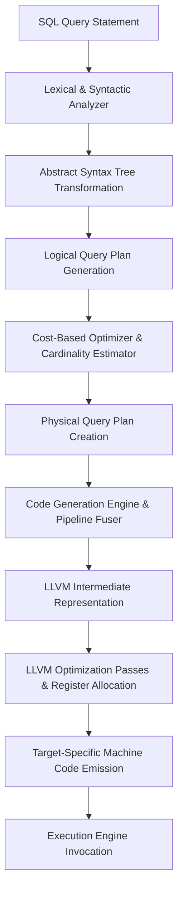
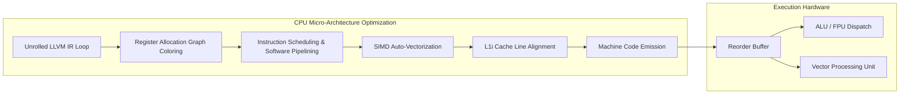

# Just-In-Time (JIT) Compilation in Modern Databases

## Overview

Relational database engines spent decades built around one assumption: disk I/O is the bottleneck, so it doesn't matter much how the CPU spends its cycles between reads. That assumption stopped holding once working sets moved into RAM and processors turned into deeply pipelined, superscalar chips that can retire several instructions per cycle — if you give them the chance. Interpreted execution, it turns out, rarely gives them that chance.

This post looks at JIT compilation database techniques: how engines convert an interpreted query plan into purpose-built machine code at runtime instead of walking an operator tree row by row. We'll cover the cost model behind the Volcano iterator design, how databases generate LLVM IR from a physical plan, why register allocation and instruction-cache behavior matter as much as algorithmic complexity, and the OS-level plumbing (W^X memory, TLB pressure) that JIT execution has to deal with. Systems like PostgreSQL (via LLVM) and Apache Spark's Tungsten engine use exactly this approach to get order-of-magnitude speedups on analytical workloads, and the reasoning behind it is worth understanding in some depth.

---

## Why Interpreted Execution Falls Behind Modern CPUs

**The question:** why can't a traditional database engine use the full capability of a modern CPU when running an analytical query?

Most traditional engines use the **Volcano iterator model**: a query plan is a tree of operators, each exposing a `next()` method that pulls one tuple at a time from its children. It's a clean design — easy to extend, easy to reason about — but it runs into trouble on modern superscalar hardware.

The trouble is **virtual function dispatch**. Every tuple, every operator call, goes through an indirect branch. On a data warehouse query touching billions of rows, that adds up to a huge number of indirect branches, each one a candidate for a pipeline flush and an L1 instruction-cache miss. Instructions-per-cycle (IPC) drops accordingly.

We can put a number on this. Let $C_{eval}(t_i)$ be the CPU cycles spent evaluating predicates on tuple $t_i$, and $C_{dispatch}$ the overhead of one virtual dispatch. Total execution time for a purely interpreted engine is:

$$ T_{interp} = \sum_{i=1}^{N} \left( C_{dispatch} + C_{eval}(t_i) + C_{materialize}(t_i) \right) $$ 

As $N$ climbs into the billions, $C_{dispatch}$ starts to dominate the sum. The CPU spends more cycles figuring out *what* to execute next than it does actually evaluating the data in front of it.

---

## The Fix: Code Generation and Push-Based Pipelines

To get around this, modern database engines compile the query plan into machine code at runtime — JIT compilation applied directly to query execution. Rather than interpreting a fixed set of operator implementations, the engine generates code tailored to the specific query.

### From Pull to Push

The core idea behind query compilation is to fuse operators into a single tight loop instead of chaining them through virtual calls. Instead of pulling tuples up through an operator tree (the pull-based Volcano approach), compiled engines push data forward through the pipeline.

Data comes off the storage layer and flows upward until it hits a materialization point — an aggregation hash table, a sort buffer, the final result set — whichever comes first. This matches how modern memory hierarchies actually behave: keep values in registers as long as possible, and only spill to cache or memory when there's no other option.

By generating a bespoke loop for each query's specific shape, the compiler eliminates $C_{dispatch}$ almost entirely.



### Quantifying the Gain

Take predicate evaluation in a WHERE clause. In an interpreted plan, the expression tree — say $k$ nodes — has to be walked for every tuple, so $C_{eval}(t_i)$ scales as $O(k)$ pointer dereferences.

A JIT compiler collapses that same tree into a straight sequence of scalar operations, dropping $C_{eval}(t_i)$ to $O(1)$ native instructions. The resulting speedup factor $\Gamma$ looks like:

$$ \Gamma = \frac{\sum_{i=1}^{N} (C_{dispatch} + \alpha \cdot k)}{\sum_{i=1}^{N} (\beta) + T_{compile}} $$ 

As $N \to \infty$, the compiled query's asymptotic performance wins outright, limited only by memory bandwidth.

### JIT vs. Vectorization

Vectorized execution — batching tuples into arrays — amortizes $C_{dispatch}$ across a batch size $V$, which helps but doesn't eliminate the underlying cost. It also has to materialize intermediate columns between operators: write to cache, read back, repeat. JIT compilation skips that step by keeping tuple data in registers for the entire pipeline, which is why it tends to win on complex, compute-heavy queries where vectorization's materialization overhead starts to show.

---

## Generating LLVM IR

Most engines don't write a machine-code backend from scratch — they target **LLVM**. The database's code generator walks the physical plan and emits LLVM IR: a strongly typed, architecture-independent representation in SSA (Static Single Assignment) form.

The generator has to handle SQL data types, nullability, and MVCC visibility checks directly in the IR it emits. Because SQL logic is three-valued (True, False, Unknown), the generated code carries explicit null checks. Where possible, the compiler hoists those checks out of inner loops using **speculative execution and loop unswitching** — if catalog metadata guarantees a column is non-null, there's no reason to re-check it on every iteration.

```rust
// Rust-like pseudocode illustrating IR generation for a Hash Join Probe Pipeline
fn generate_hash_join_probe_pipeline(
    builder: &mut IRBuilder, module: &mut IRModule, plan: &PhysicalJoinPlan
) -> Function {
    let pipeline_func = builder.create_function("HashJoinProbePipeline");
    let loop_block = builder.create_basic_block("loop", pipeline_func);
    let probe_block = builder.create_basic_block("probe_hash_table", pipeline_func);
    let emit_block = builder.create_basic_block("emit_joined_tuple", pipeline_func);
    
    // Setup and jump to loop
    builder.build_br(loop_block);
    
    // LOOP BLOCK: Fetch and Hash
    builder.set_insert_point(loop_block);
    let probe_tuple = emit_storage_layer_fetch(builder);
    let join_key = emit_expression_evaluation(builder, probe_tuple, plan.probe_key_expr);
    let hash_value = emit_murmur_hash3(builder, join_key);
    builder.build_br(probe_block);
    
    // PROBE BLOCK: Check Hash Table
    builder.set_insert_point(probe_block);
    let bucket_ptr = emit_hash_table_lookup(builder, hash_table_ptr, hash_value);
    let is_match = emit_key_comparison(builder, bucket_ptr, join_key);
    builder.build_cond_br(is_match, emit_block, loop_block);
    
    // EMIT BLOCK: Output match and continue
    builder.set_insert_point(emit_block);
    let combined_tuple = emit_tuple_concatenation(builder, probe_tuple, bucket_ptr);
    emit_pipeline_continuation(builder, combined_tuple, plan.parent_operator);
    builder.build_br(loop_block); 
    
    return pipeline_func;
}
```

---

## OS-Level Memory Management and Security Constraints

Once LLVM lowers IR to machine code, the resulting bytes have to land in memory pages that the CPU can actually execute — and that's where OS-level complications start.

### W^X (Write XOR Execute)

Modern operating systems enforce W^X to block a whole class of buffer-overflow exploits: a page can be writable or executable, never both at once. So the database has to choreograph a small dance of system calls (`mprotect` on POSIX, `VirtualProtect` on Windows):
1. Allocate the page as Read/Write (`PROT_READ | PROT_WRITE`).
2. Generate and link the machine code into it.
3. Flip the page to Read/Execute (`PROT_READ | PROT_EXEC`).
4. Flush the instruction cache (`__builtin___clear_cache`) so the CPU actually fetches the new bytes instead of stale cached instructions.

### TLB Pressure and Huge Pages

Once JIT execution removes the dispatch bottleneck, memory address translation becomes the next thing to worry about. Scanning huge datasets through a compiled pipeline puts real pressure on the TLB. To manage this, databases typically route JIT-related memory through an arena allocator backed by **huge pages** (2MB or 1GB), so a single TLB entry covers a much larger span of memory and TLB misses become rare during execution.

---

## Micro-Architectural Effects: Getting the CPU Out of Its Own Way

JIT compilation pays off most once LLVM's architecture-aware optimization passes get involved.

### Register Allocation (Graph Coloring)

Variables get mapped onto physical registers using graph coloring. Because operator fusion keeps intermediate values — tuple attributes, mostly — alive for only a short stretch of code, the interference graph stays sparse, and the allocator can keep most of the working data in registers, bypassing L1 reads and writes entirely.

### Loop Unrolling and Software Pipelining

Unrolling turns an $N$-iteration loop into roughly $N/U$ iterations of a larger body. A bigger basic block gives the CPU's out-of-order execution engine (the reorder buffer) more independent instructions to work with at once, which raises instruction-level parallelism (ILP). Software pipelining overlaps adjacent iterations to hide memory latency — while iteration $i$ is in the ALU, iteration $i+1$ is already pulling data from L1.

### L1i Cache and Branch Prediction

Interpreters are rough on the instruction cache: tight inner loops full of switch statements and indirect calls thrash L1i. Compiled code, by contrast, is a contiguous block of sequential instructions the CPU can prefetch deterministically. On top of that, turning control-flow branches into data-flow operations (`cmov`) removes branch-misprediction penalties that would otherwise show up on every iteration.



---

## The Break-Even Point and Adaptive Execution

Compiling isn't free — running LLVM's optimization passes burns real CPU cycles. So when does it actually pay off?

Let $T_{compile}$ be the compilation latency, and $c_{interp}$, $c_{jit}$ the per-tuple cost of the interpreted and compiled paths respectively. For $N$ tuples, JIT wins when:

$$ T_{compile} + N \cdot c_{jit} < N \cdot c_{interp} $$ 

Solved for $N$:

$$ N > \frac{T_{compile}}{c_{interp} - c_{jit}} $$ 

For a short OLTP query touching a handful of rows, $N$ never clears that bar — compilation overhead alone would make things worse. For an OLAP scan over millions or billions of rows, $N$ clears it easily, and JIT delivers the order-of-magnitude gains it's known for.

### Adaptive Execution

To avoid paying $T_{compile}$ up front on every query, some systems use adaptive execution: the query starts running immediately on a lightweight vectorized interpreter while a background thread compiles the JIT version. Once compilation finishes, the engine hot-swaps the function pointers mid-execution and the query transitions to the compiled path without ever blocking on it.

---

## Lessons from Building This

1. **Compilation overhead is real.** JIT-compiling every query indiscriminately causes regressions on short queries. A cost-based heuristic, plus a plan cache that reuses compiled binaries for parameterized queries, avoids paying the compile cost repeatedly.
2. **Push beats pull for JIT.** Trying to JIT-compile a Volcano-style pull model barely moves the needle. The real gains come from restructuring around a push-based, pipeline-fused model that keeps data in registers.
3. **The OS is part of the design.** Frequent `mprotect` calls and fragmented allocations for JIT code introduce their own latency. Arena allocators and huge pages aren't optional extras — they're load-bearing.
4. **Not everything belongs in generated code.** Regex parsing, lock acquisition, buffer-pool spilling — these are better left as statically compiled C/C++ functions that the generated code calls through a plain C ABI, rather than reimplemented inline in IR.

## Conclusion

JIT compilation database design marks a shift in how you think about the query engine: less like an application layer interpreting a plan, more like a specialized compiler generating code for the hardware it happens to be running on. By producing machine code tailored to each query at runtime, engines like PostgreSQL and Spark Tungsten close the gap between declarative SQL and the register-level realities of the CPU underneath — which is where most of the performance was hiding all along.
