# Inside the Cascades Framework: The Architecture Behind Modern Query Optimizers

## Why This Architecture Matters

The query optimizer is the part of a relational database that decides whether your query finishes in milliseconds or brings the server to its knees. Somewhere between the SQL you type and the rows that come back, the system has to turn an abstract statement into a concrete, physical execution plan — and that translation step is where most of the engineering difficulty lives. Over the past three decades, the **Cascades framework**, designed by Goetz Graefe, has become the reference architecture for this problem. It sits at the core of systems as different as Microsoft SQL Server, Apache Calcite, CockroachDB, and Greenplum, which says something about how well the underlying ideas generalize.

This article walks through how the Cascades framework query optimizer is actually built: the Memo graph structure, the top-down search algorithm, branch-and-bound pruning, and the ways this design has to bend to fit real CPU and memory behavior. It's aimed at engineers who need to reason about these internals directly — whether to debug a bad plan, extend an optimizer, or just understand why a database chose the plan it did.

---

## The Problem: Too Many Plans, Too Little Time

**What are we actually solving?**
When you write a SQL query, you're describing *what* you want, not *how* to get it. That gap is the optimizer's whole job. A query joining ten tables can be executed in more than 17.6 billion distinct ways once you account for join order, join algorithm, and access paths. The optimizer has to search that space, estimate a cost for each candidate plan, and pick the one that burns the least CPU, I/O, and network bandwidth.

The search itself is NP-hard. Brute-forcing it, or even applying the bottom-up dynamic programming approach classic System R used, would exhaust available memory and CPU time before the query ever ran — the optimizer would spend more resources deciding how to answer the question than it would take to just answer it badly.

**The Cascades answer** is architectural: split the problem into three orthogonal pieces that can evolve independently.
1. The logical search space.
2. The physical cost model.
3. The rule execution engine.

That separation is what lets Cascades stay extensible for the people building on top of it, while still compressing an enormous search space down to something that fits comfortably in memory.

---

## The Memo: A Shared Structure for Billions of Plans

At the center of the Cascades framework query optimizer is the **Memo**, a directed acyclic graph. Rather than materializing billions of individual parse trees, Memo compresses the search space by letting equivalent subplans share structure.

### Groups and Logical Equivalence

When the initial logical plan is loaded, it gets decomposed into **Groups**. A Group is a logical equivalence class — the set of all algebraic expressions that produce the same result set, regardless of which algorithm eventually computes it.

Each Group holds one or more **Group Expressions**. Critically, the operands of a Group Expression don't point to other individual expressions — they point to child Groups. That one design choice is what turns a plain algebraic tree into a densely shared graph.

For $n=10$ tables, the number of possible join trees is $N(n) = \frac{(2n-2)!}{(n-1)!}$. Enumerating that space naively would take terabytes of memory. Because Memo shares pointers lazily instead of duplicating subtrees, the space complexity drops to $\mathcal{O}(n \cdot 2^n)$. In practice, this keeps memory usage down to a few megabytes even for reasonably large joins.

### Properties and Enforcers

Memo tracks two distinct kinds of properties:
- **Logical properties** — static metadata such as output columns, filter predicates, and cardinality estimates. These are computed once per Group and reused everywhere that Group appears.
- **Physical properties** — things like sort order or how data is partitioned across nodes.

Reconciling what a parent operator needs with what a child plan produces is the job of the **Enforcers** mechanism. Say a query needs data sorted on column $A$. Cascades might find a fast algorithm that produces unordered output. Rather than discard that plan, it checks whether bolting a Sort enforcer onto the fast-but-unordered path beats using an algorithm that's already sorted, like a B+-tree scan. The comparison is captured by a Bellman-style recurrence:

$$ C_{opt}(G, P) = \min \left( \min_{e \in G} \left( C_{local}(e) + \sum_{i=1}^{k} C_{opt}(G_i, P_i) \right), C(E_P) + C_{opt}(G, \emptyset) \right) $$

```mermaid
graph TD
    classDef group fill:#1e1e1e,stroke:#333,stroke-width:2px,color:#fff;
    classDef expr fill:#2d2d2d,stroke:#555,stroke-width:1px,color:#7ad4e6;
    classDef rule fill:#4a154b,stroke:#832561,stroke-width:2px,color:#e8e8e8,shape:hexagon;

    subgraph Optimization Search Space [The Memo DAG Structure]
        G1[Group 1: Result/Root]:::group
        G1E1((Logical Join)):::expr --> G2
        G1E1 --> G3
        G1E2((Hash Join)):::expr --> G2
        G1E2 --> G3
        G1E3((Merge Join)):::expr --> G2
        G1E3 --> G3
        
        G2[Group 2: Table A]:::group
        G2E1((TableScan A)):::expr
        G2E2((IndexScan A)):::expr
        
        G3[Group 3: Table B]:::group
        G3E1((TableScan B)):::expr
    end
    
    R1{{Rule: Join Commutativity}}:::rule -.-> G1E1
    R2{{Rule: Logical -> HashJoin}}:::rule -.-> G1E1
    R3{{Rule: Scan -> IndexScan}}:::rule -.-> G2E1
    
    G1 -.-> G1E1
    G1 -.-> G1E2
    G1 -.-> G1E3
    G2 -.-> G2E1
    G2 -.-> G2E2
    G3 -.-> G3E1
    
    style Optimization Search Space fill:#0a0a0a,stroke:#222,stroke-width:2px
```

---

## Search Strategy: Top-Down Traversal and Branch-and-Bound Pruning

Every transformation inside the Memo is driven by a **Rule** — for instance, rewriting `A JOIN B` into `B JOIN A`. The real departure from System R, though, is how Cascades traverses the search space: top-down, paired with branch-and-bound pruning.

A bottom-up optimizer has to compute costs for every subtree before it knows anything about what the parent needs. Top-down search flips that: it starts at the root and pushes physical property requirements — "I need this sorted," for example — down into child Groups as it recurses. That means the optimizer never bothers generating a child plan (say, a Hash Join that produces unordered output) if it can't possibly satisfy what the parent is asking for.

### How Branch-and-Bound Pruning Works

During the recursive search, once the optimizer finds a complete plan with, say, cost 1000, it records that as the current best — the $Cost_{limit}$. As it explores other branches and accumulates cost along the way, it keeps a running check: if the cost already spent on a branch, plus the best-case lower bound on whatever's left unexplored, already exceeds the current $Cost_{limit}$, there's no point continuing down that branch. Cascades cuts it off immediately, without ever expanding the subtree below it.

$$ C_{accumulated} + C_{local}(e) + \sum_{i \in \text{unoptimized\_children}} LB_{cost}(G_i) \geq Cost_{limit} $$

### The Promise Function

To make pruning effective early, Cascades uses a Promise Function to order which rule gets applied first. Rules judged likely to yield the biggest cost reduction go first, which drives $Cost_{limit}$ down quickly — and a tight bound early on means branch-and-bound gets to start eliminating competing branches sooner rather than later.

---

## Where the Algorithm Meets the Hardware

Graph theory and cost models only get you so far. A production-grade optimizer also has to behave well on real CPUs and under real memory pressure — the algorithmic design and the hardware constraints end up shaping each other.

### Memory Management: Avoiding Heap Fragmentation

A single optimization pass can create and destroy tens of millions of `Group` and `GroupExpr` objects in a few milliseconds. Calling `malloc()` or `new` repeatedly for objects that short-lived generates a lot of fragmentation and lock contention under the hood. Most modern optimizers instead use **bump-pointer arena allocators**: they request one large chunk of memory up front — often backed by 2MB or 1GB huge pages on Linux via `mmap` — and then hand out memory from that chunk with a simple pointer bump. This sidesteps TLB misses almost entirely.

### Cache-Line Packing and the Hardware Prefetcher

CPUs don't fetch memory byte by byte; they pull it in 64-byte cache-line chunks. Cascades implementations lean on this by using `#pragma pack` and `alignas(64)` to force a `GroupExpr` object to fit inside a single cache line.

That discipline pays off because it plays nicely with the CPU's hardware prefetcher: while the core is busy computing on Node $A$, the prefetcher can already be pulling Node $B$ from L3 cache into registers, so the pipeline doesn't stall waiting on memory.

### Branchless Code and SIMD

When the optimizer is running billions of property comparisons, ordinary `if/else` branching wrecks the CPU's branch predictor — too many unpredictable jumps. Modern implementations rewrite these comparisons as **branchless code**, using bitwise masks instead of conditionals. Beyond that, some engines use **SIMD instructions (AVX-512)** to evaluate 16 or 32 logical-equivalence checks in a single cycle, which is what makes sub-second optimization of complex OLAP queries realistic.

---

## Practical Takeaways

A few things worth internalizing if you work with systems built on this architecture:

1. **Pruning is only as good as your statistics.** SQL with unclear cross-column relationships throws off cardinality estimation. Bad estimates skew $LB_{cost}$, and a skewed lower bound can cause branch-and-bound to prune away the actually-optimal plan while keeping a mediocre one. Keeping statistics fresh and declaring foreign key relationships isn't just hygiene — it directly affects which plans survive pruning.
2. **Physical properties explain a lot of "weird" plan choices.** Ever wonder why a B-tree index sometimes gets used even when a full table scan would be cheaper on its own? It's often because the index's "sorted" property avoids a separate Sort operator further up the plan. Understanding top-down enforcers makes these decisions much less mysterious, and can inform how you design your schema and indexes.
3. **Mechanical sympathy matters as much as algorithmic complexity.** An algorithm with great Big-O characteristics can still lose to a "worse" one if it generates millions of throwaway objects, thrashes cache lines, and triggers TLB misses along the way. The arena-allocator mindset is worth borrowing for any large-scale computational system, not just query optimizers.
4. **Separation of concerns is the architectural lesson that generalizes furthest.** Keeping rules, the cost model, and the search engine as independent, swappable pieces is what gives Cascades its longevity. The same separation — business rules versus execution engine — pays off in plenty of systems that have nothing to do with databases.

## Conclusion

Cascades started as an academic idea in 1995 and, three decades later, quietly runs underneath a large share of the world's query optimizers. What makes it interesting isn't just the graph theory and combinatorics, though those are elegant on their own. It's that the abstract algebraic model has to answer to very unglamorous realities — cache lines, TLB behavior, SIMD registers — and the framework was designed with that constraint in mind from the start. That's a useful reminder for anyone building large systems: the elegant model and the messy hardware underneath it aren't separate concerns, they're the same problem.
