# Cascades Framework:現代のQuery Optimizerが辿り着いたゴールドスタンダード

## エグゼクティブサマリー

Query Optimizerは、あらゆるRDBMSの中で実質的な「頭脳」に当たる部分だ。数ミリ秒で終わるクエリとサーバー全体を止めてしまうクエリの差は、たいてい抽象的なSQLコマンドをどう物理的な実行計画に落とし込んでいるかの違いに帰着する。過去30年にわたり、Goetz Graefeが設計した**Cascades Framework**はこの領域のゴールドスタンダードとなり、Microsoft SQL Server、Apache Calcite、CockroachDB、Greenplumといった分散・高性能データベースの中核に据えられてきた。

本稿ではCascades Frameworkのアーキテクチャを詳しく見ていく。Memo構造(Memoization Graph)の作り、トップダウン評価アルゴリズム、分枝限定法(branch-and-bound)による刈り込み、そしてこのアーキテクチャがマイクロアーキテクチャレベルでハードウェアとどう噛み合っているかまで解剖する。大規模データシステムを構築・最適化・デバッグする立場のデータベースエンジニアやソフトウェアアーキテクトを念頭に書いている。

---

## クエリ最適化という問題

**何が問題なのか。**
プログラマーがSQLクエリを書くとき、指定しているのは「どう取得するか」ではなく「何が欲しいか」だ。10個のテーブルを結合するだけの単純なクエリでも、実行計画のツリーとしては176億通り以上のバリエーションがありうる。Query Optimizerの仕事は、この176億通りの探索空間を歩き回り、それぞれのコストを見積もり、CPU・I/O・ネットワーク帯域の消費が最も少ない案を選び出すことだ。

この問題の複雑さはNP-Hardの域に達しているため、力任せ(brute-force)や、古典的なSystem Rのようなボトムアップの動的計画法をそのまま使うと、SQL文の実行方法を見つけるためだけにRAMとCPUを使い果たしてしまう。

**Cascades Frameworkのブレークスルー**は、直交する3つの要素を切り分けるという設計思想にある。
1. 論理探索空間(Logical Search Space)
2. 物理コストモデル(Physical Cost Models)
3. ルール実行エンジン(Rule Execution Engine)

この分離のおかげで、Cascadesはデータベース開発者にとって非常に拡張しやすいアーキテクチャでありながら、巨大な探索空間をわずかなRAMに圧縮できる。

---

## アーキテクチャの土台:Memo構造

Cascadesの中核をなすのが**Memo**構造、つまり有向非巡回グラフ(DAG)だ。何十億もの解析ツリーを個別に生成する代わりに、Memoは共通のノードを共有することでそれらを圧縮する。

### 論理的同値類(Logical Equivalence Classes)

初期の論理プランがロードされると、それは複数の**Group**へと分解される。各Groupは論理的な同値類、つまり背後のアルゴリズムが何であれ*同じ結果セット*を生成する代数式の集合を表す。
各Groupの内部には複数の**Group Expression**が存在する。Group Expressionの入力オペランドは他の式を直接指すのではなく、子Groupを指す。この抽象化のおかげで、代数ツリーは高密度に共有されたネットワークへと姿を変える。

$n=10$テーブルの場合、生成されうる結合ツリーの数は$N(n) = \frac{(2n-2)!}{(n-1)!}$にもなる。テラバイト級のRAMを食いつぶす代わりに、Memoの遅延ポインタ共有メカニズムは空間計算量を$\mathcal{O}(n \cdot 2^n)$まで落とす。実際のところ、RAM消費量は常に数メガバイト程度に収まる。

### プロパティ管理とEnforcers

Memoのエコシステムは2つのプロパティ領域を定義する。
- **論理プロパティ:** 列構造、フィルタ条件、カーディナリティ推定などの静的メタデータ。重複計算を避けるためGroupごとに一度だけ保存される。
- **物理プロパティ:** データのソート順や、ネットワーク上の分散パーティションなど。

要求と実態を突き合わせるために、Cascadesは**Enforcers**という仕組みを使う。データを列$A$でソートしておく必要があるとしよう。Cascadesは非常に高速だがソートされていないデータ読み取りアルゴリズムを見つけた場合、それを捨てるのではなく、そのアルゴリズムにEnforcer(Sort演算子)を追加するコストと、最初からソート済みのアルゴリズム(B+ Tree Scanなど)を使うコストを比較する。
このプロセスを表すBellman方程式は次のとおりだ。

$$ C_{opt}(G, P) = \min \left( \min_{e \in G} \left( C_{local}(e) + \sum_{i=1}^{k} C_{opt}(G_i, P_i) \right), C(E_P) + C_{opt}(G, \emptyset) \right) $$

```mermaid
graph TD
    classDef group fill:#1e1e1e,stroke:#333,stroke-width:2px,color:#fff;
    classDef expr fill:#2d2d2d,stroke:#555,stroke-width:1px,color:#7ad4e6;
    classDef rule fill:#4a154b,stroke:#832561,stroke-width:2px,color:#e8e8e8,shape:hexagon;

    subgraph Optimization Search Space [The Memo DAG Structure]
        G1[Group 1: Result/Root]:::group
        G1E1((Logical Join)):::expr --> G2
        G1E1 --> G3
        G1E2((Hash Join)):::expr --> G2
        G1E2 --> G3
        G1E3((Merge Join)):::expr --> G2
        G1E3 --> G3
        
        G2[Group 2: Table A]:::group
        G2E1((TableScan A)):::expr
        G2E2((IndexScan A)):::expr
        
        G3[Group 3: Table B]:::group
        G3E1((TableScan B)):::expr
    end
    
    R1{{Rule: Join Commutativity}}:::rule -.-> G1E1
    R2{{Rule: Logical -> HashJoin}}:::rule -.-> G1E1
    R3{{Rule: Scan -> IndexScan}}:::rule -.-> G2E1
    
    G1 -.-> G1E1
    G1 -.-> G1E2
    G1 -.-> G1E3
    G2 -.-> G2E1
    G2 -.-> G2E2
    G3 -.-> G3E1
    
    style Optimization Search Space fill:#0a0a0a,stroke:#222,stroke-width:2px
```

---

## アルゴリズムの仕組み:トップダウン探索と刈り込み

Memo内のすべての変換は**Rules**によって制御される(例: A JOIN BをB JOIN Aに入れ替える)。CascadesとSystem Rの最大の違いは、**トップダウン**の走査戦略と**分枝限定法**を組み合わせている点にある。

ボトムアップのアルゴリズムでは、すべての枝のコストを下から積み上げていかなければならない。対してトップダウンはルートから出発し、物理的な要件(「ソート済みデータが必要」など)を子ノードへ伝播させる。これにより、上位レベルが求めるプロパティを満たさない無意味な子ブランチ(例えばHash Join)を生成すること自体を防げる。

### 分枝限定刈り込み(Branch-and-Bound Pruning)

再帰的な走査の途中で、システムがコスト$Cost_{limit} = 1000$の完全なプランを見つけると、その記録が保存される。アルゴリズムが別の枝に移るとコストが積み上がっていくが、途中で「すでに走査したステップのコスト」と「まだ走査していないステップの下限(Lower Bound)」の合計が$1000$を超えた時点で、Cascadesはその下にある巨大な枝に踏み込むことなく丸ごと刈り取る。

$$ C_{accumulated} + C_{local}(e) + \sum_{i \in \text{unoptimized\_children}} LB_{cost}(G_i) \geq Cost_{limit} $$

### Promise Function(ヒューリスティックなナビゲーション)

速度を稼ぐため、CascadesはPromise Functionを使ってルールの適用優先度を決める。コストを最も削減しそうなルールを先に適用することで、低い$Cost_{limit}$を早期に確保でき、分枝限定法という武器が他の枝をより早く排除できるようになる。

---

## ハードウェアとの接点

数学的理論やグラフ理論だけでは足りない。本当に使えるOptimizerは、OSやCPUのマイクロアーキテクチャと歩調を合わせて動く必要がある。

### メモリ管理:ヒープ断片化を避ける

Cascadesの処理では、わずか数ミリ秒の間に数千万個の`Group`と`GroupExpr`オブジェクトが生成・破棄される。`malloc()`(C)や`new`(C++)を律儀に呼び続けると、深刻なヒープ断片化とロック競合が発生する。現代のOptimizerは**bump-pointer方式のアリーナアロケータ**を使う。`mmap`経由でOSから大きなRAMブロック(Linuxでは通常2MB/1GBのHuge Pages)をまとめて確保し、その内側で割り当てを行う。これによりTLBミスはほぼ完全になくなる。

### Cache-Line PackingとHardware Prefetcher

CPUはRAMを1バイトずつ読むわけではなく、**キャッシュライン(64バイト)**単位でまとめて読む。Cascadesのソースコードは`#pragma pack`や`alignas(64)`を使い、`GroupExpr`オブジェクトが64バイトに完全に収まるよう強制する。
この細やかな設計がCPUの**Hardware Prefetcher**回路を働かせる。CPUがノード$A$を計算している間に、ハードウェアは先回りしてノード$B$をL3キャッシュからコアレジスタへ押し込んでおき、パイプラインストール(データ待ちの遅延)を実質的に消し去る。

### Branchless ProgrammingとSIMD

何十億回ものプロパティ行列計算を評価する場面では、Cascadesの`if/else`構造がCPUの分岐予測器を乱してしまう。現代のエンジンはビット単位のマスク演算を使い、こうした比較を**Branchless Programming**へと置き換える。
さらに、逐次比較する代わりに**SIMD(AVX-512)**を使い、16個や32個の論理的同値性チェックを1クロックサイクルに圧縮することで、リアルタイムOLAP処理の限界を押し広げている。

---

## 学びの要点とベストプラクティス

データベースエンジニアやソフトウェアアーキテクトへ向けて。

1. **システムの「刈り込み」の仕組みを理解する。** 列同士の関係が曖昧なSQLを書くと、カーディナリティ推定が歪む。推定が狂えば$LB_{cost}$も狂い、分枝限定法が本来最適なプランを誤って刈り取ってしまい、悪いプランだけが残る羽目になる。統計情報は常に最新に保ち、外部キー関係もきちんと宣言しておくこと。
2. **Physical Propertiesの力を侮らない。** B-Treeインデックスが、Full Table Scanより遅いのに使われたり使われなかったりする理由を不思議に思ったことはないだろうか。それはB-Treeの「ソート済み」という性質が、上位レベルでのSort操作を省く非常に貴重なPhysical Propertyだからだ。トップダウンのEnforcersを理解しておくと、スキーマ設計の最適化にも役立つ。
3. **ソフトウェア設計にはMechanical Sympathyが要る。** アルゴリズムのBig-O計算量がどれほど優れていても、数百万のガベージオブジェクトを生み、キャッシュラインを壊し、TLBミスを引き起こすようでは、ハードウェアに優しい力任せのアルゴリズムより遅くなることがある。アリーナアロケータの発想は大規模な計算システムにも応用する価値がある。
4. **関心事の分離を徹底する。** Cascadesの最大のアーキテクチャ上の教訓は、Rules・Cost Model・Search Engineをきっちり切り離したことにある。複雑なビジネスソフトウェアの設計でも、論理ブロック(ビジネスルールと実行エンジンなど)を分離しておくことが、際限のない拡張性につながる。

## 結論

1995年の学術的なアイデアから出発し、Cascades Frameworkは30年をかけて進化し、データベース管理システムの世界を事実上支配するに至った。グラフ理論と組合せ数学の傑作であるだけでなく、システムプログラミングという技芸の確かな証でもある。最も抽象的な代数の概念が、シリコンとキャッシュラインとSIMDレジスタという最も無機質な機械の法則に頭を垂れ、折り合いをつけなければならない場所——それがCascadesなのだ。

---
