# Cascades Framework: Kiến trúc Tiêu chuẩn Vàng của Query Optimizer Hiện đại

## Tóm tắt điều hành

Trình tối ưu hóa truy vấn (query optimizer) là bộ phận gần như đóng vai trò "bộ não" của mọi hệ quản trị cơ sở dữ liệu quan hệ. Khoảng cách giữa một truy vấn chạy xong trong vài mili-giây và một truy vấn làm treo cứng cả máy chủ nằm ở cách hệ thống biên dịch câu lệnh SQL trừu tượng thành một kế hoạch thực thi vật lý cụ thể. Suốt ba thập kỷ qua, **Cascades Framework** — do Goetz Graefe thiết kế — đã trở thành tiêu chuẩn vàng, là nền tảng cốt lõi của những cơ sở dữ liệu phân tán, hiệu năng cao như Microsoft SQL Server, Apache Calcite, CockroachDB và Greenplum.

Bài viết này đi sâu vào kiến trúc của Cascades Framework: cấu trúc đồ thị Memo (memoization graph), thuật toán duyệt từ trên xuống (top-down evaluation), cơ chế cắt tỉa nhánh và cận (branch-and-bound pruning), và cách kiến trúc này cộng sinh với phần cứng ở tầng vi kiến trúc. Nội dung hướng tới các kỹ sư cơ sở dữ liệu và kiến trúc sư phần mềm cần hiểu rõ nguyên lý vận hành để làm chủ, tối ưu và gỡ lỗi các hệ thống dữ liệu quy mô lớn.

---

## Vấn đề của tối ưu hóa truy vấn

**Vấn đề cụ thể là gì?**
Khi lập trình viên viết một câu SQL, họ đang mô tả "kết quả mong muốn" chứ không phải "cách lấy ra kết quả đó". Một truy vấn đơn giản join 10 bảng có thể được thực thi theo hơn 17,6 tỷ cách khác nhau (tương ứng với 17,6 tỷ cây kế hoạch thực thi). Việc của query optimizer là duyệt qua không gian 17,6 tỷ phương án này, ước tính chi phí của từng phương án, rồi chọn ra phương án tốn ít CPU, I/O và băng thông mạng nhất.

Vì độ phức tạp của bài toán này chạm ngưỡng NP-Hard, nếu hệ thống duyệt kiểu brute-force hay dùng quy hoạch động từ dưới lên (bottom-up, như trong System R cổ điển), nó sẽ ngốn sạch RAM và CPU chỉ để tìm ra cách chạy một câu lệnh SQL.

**Bước đột phá của Cascades Framework** nằm ở việc tách bạch ba thành phần trực giao:
1. Không gian tìm kiếm logic (logical search space).
2. Mô hình chi phí vật lý (physical cost models).
3. Động cơ thực thi quy tắc (rule execution engine).

Nhờ sự tách bạch đó, Cascades vừa cho một kiến trúc rất dễ mở rộng đối với người phát triển database, vừa nén được không gian tìm kiếm khổng lồ xuống một lượng RAM khiêm tốn.

---

## Nền tảng kiến trúc: cấu trúc dữ liệu Memo

Trái tim của Cascades là cấu trúc **Memo** — một đồ thị có hướng không chu trình (DAG). Thay vì sinh ra hàng tỷ cây phân tích riêng lẻ, Memo nén chúng lại bằng cách chia sẻ các nút chung.

### Các lớp tương đương logic (Logical Equivalence Classes)

Khi một kế hoạch logic ban đầu được nạp vào, nó được tách thành nhiều **Group**. Mỗi Group đại diện cho một lớp tương đương logic — tức tập hợp mọi biểu thức đại số cho ra *cùng một tập kết quả*, bất kể thuật toán đứng sau là gì.
Bên trong mỗi Group chứa nhiều **Group Expression**. Toán hạng đầu vào của một Group Expression không trỏ trực tiếp tới biểu thức khác mà trỏ tới các Group con. Cách trừu tượng hóa này biến một cây đại số thành một mạng lưới chia sẻ cực kỳ dày đặc.

Với $n=10$ bảng, số cây join có thể sinh ra là $N(n) = \frac{(2n-2)!}{(n-1)!}$. Thay vì ngốn hàng terabyte RAM, cơ chế chia sẻ con trỏ lười (lazy pointer) của Memo đưa độ phức tạp không gian xuống còn $\mathcal{O}(n \cdot 2^n)$. Trên thực tế, mức tiêu thụ RAM luôn được giữ ở vài megabyte.

### Quản lý thuộc tính và Enforcers

Hệ sinh thái Memo phân định hai miền thuộc tính:
- **Thuộc tính logic:** siêu dữ liệu tĩnh như cấu trúc cột, điều kiện lọc, ước lượng cardinality — được lưu một lần cho cả Group để tránh tính đi tính lại.
- **Thuộc tính vật lý:** ví dụ thứ tự sắp xếp dữ liệu (sort order) hay cách phân mảnh trên mạng (distribution partition).

Để khớp giữa yêu cầu và thực tế, Cascades dùng cơ chế **Enforcers**. Giả sử bạn cần dữ liệu đã sắp xếp theo cột $A$. Nếu Cascades tìm được một thuật toán đọc dữ liệu rất nhanh nhưng không theo thứ tự, nó sẽ không vứt bỏ ngay, mà so sánh xem gắn thêm một Enforcer (toán tử Sort) vào thuật toán nhanh đó có rẻ hơn việc dùng hẳn một thuật toán vốn đã sắp xếp sẵn (như B+ Tree Scan) hay không.
Phương trình Bellman mô tả quá trình này:

$$ C_{opt}(G, P) = \min \left( \min_{e \in G} \left( C_{local}(e) + \sum_{i=1}^{k} C_{opt}(G_i, P_i) \right), C(E_P) + C_{opt}(G, \emptyset) \right) $$

```mermaid
graph TD
    classDef group fill:#1e1e1e,stroke:#333,stroke-width:2px,color:#fff;
    classDef expr fill:#2d2d2d,stroke:#555,stroke-width:1px,color:#7ad4e6;
    classDef rule fill:#4a154b,stroke:#832561,stroke-width:2px,color:#e8e8e8,shape:hexagon;

    subgraph Optimization Search Space [The Memo DAG Structure]
        G1[Group 1: Result/Root]:::group
        G1E1((Logical Join)):::expr --> G2
        G1E1 --> G3
        G1E2((Hash Join)):::expr --> G2
        G1E2 --> G3
        G1E3((Merge Join)):::expr --> G2
        G1E3 --> G3
        
        G2[Group 2: Table A]:::group
        G2E1((TableScan A)):::expr
        G2E2((IndexScan A)):::expr
        
        G3[Group 3: Table B]:::group
        G3E1((TableScan B)):::expr
    end
    
    R1{{Rule: Join Commutativity}}:::rule -.-> G1E1
    R2{{Rule: Logical -> HashJoin}}:::rule -.-> G1E1
    R3{{Rule: Scan -> IndexScan}}:::rule -.-> G2E1
    
    G1 -.-> G1E1
    G1 -.-> G1E2
    G1 -.-> G1E3
    G2 -.-> G2E1
    G2 -.-> G2E2
    G3 -.-> G3E1
    
    style Optimization Search Space fill:#0a0a0a,stroke:#222,stroke-width:2px
```

---

## Cơ chế thuật toán: không gian tìm kiếm top-down và cắt tỉa

Mọi phép biến đổi trong Memo đều do các **Rules** điều khiển (ví dụ: đổi A JOIN B thành B JOIN A). Điểm khác biệt lớn nhất giữa Cascades và System R là chiến lược duyệt **top-down** kết hợp với **branch-and-bound**.

Thuật toán bottom-up buộc phải tổng hợp chi phí của mọi nhánh từ dưới lên trên. Ngược lại, top-down xuất phát từ gốc, lan truyền các yêu cầu vật lý (kiểu "cần dữ liệu đã sort") xuống các nút con. Nhờ vậy hệ thống tránh được việc sinh ra những nhánh con vô nghĩa (chẳng hạn Hash Join) nếu nhánh đó không thỏa mãn thuộc tính mà cấp trên đòi hỏi.

### Cắt tỉa nhánh và cận (Branch-and-Bound Pruning)

Trong quá trình duyệt đệ quy, khi hệ thống tìm được một kế hoạch hoàn chỉnh với chi phí $Cost_{limit} = 1000$, con số này được ghi lại. Khi thuật toán chuyển sang nhánh khác, chi phí tiếp tục cộng dồn. Nếu tại một điểm giữa chừng, tổng chi phí các bước đã duyệt cộng với cận dưới (lower bound) của các bước chưa duyệt đã vượt quá $1000$, Cascades lập tức cắt bỏ toàn bộ nhánh phía dưới mà không cần đi sâu vào nó.

$$ C_{accumulated} + C_{local}(e) + \sum_{i \in \text{unoptimized\_children}} LB_{cost}(G_i) \geq Cost_{limit} $$

### Promise Function (định hướng theo kinh nghiệm)

Để tăng tốc, Cascades dùng Promise Function nhằm quyết định mức ưu tiên áp dụng cho từng quy tắc. Quy tắc nào có khả năng giảm chi phí nhiều nhất sẽ được thử trước, giúp nhanh chóng có được một $Cost_{limit}$ thấp — từ đó cơ chế branch-and-bound có thể loại bỏ các nhánh khác sớm hơn.

---

## Điểm giao thoa với phần cứng

Lý thuyết toán học và đồ thị thôi là chưa đủ. Một optimizer thực sự tốt phải vận hành ăn khớp với hệ điều hành và vi kiến trúc CPU.

### Quản lý bộ nhớ: tránh phân mảnh heap

Quá trình chạy của Cascades sinh ra và hủy đi hàng chục triệu đối tượng `Group` và `GroupExpr` chỉ trong vài mili-giây. Gọi `malloc()` (C) hay `new` (C++) liên tục sẽ gây phân mảnh heap nghiêm trọng và tranh chấp khóa (lock contention). Các optimizer hiện đại dùng **arena allocator kiểu bump-pointer**: xin hệ điều hành một khối RAM lớn qua `mmap` (thường dùng Huge Pages 2MB/1GB trên Linux) rồi tự cấp phát bên trong khối đó. Cách này gần như triệt tiêu hoàn toàn TLB miss.

### Cache-Line Packing và Hardware Prefetcher

CPU không đọc RAM từng byte một mà đọc theo từng khối **cache line (64 byte)**. Mã nguồn của Cascades dùng `#pragma pack` và `alignas(64)` để ép một đối tượng `GroupExpr` nằm gọn trong 64 byte.
Thiết kế tỉ mỉ này kích hoạt mạch **Hardware Prefetcher** của CPU: trong lúc CPU đang tính toán node $A$, phần cứng đã chủ động đẩy node $B$ từ L3 cache vào thanh ghi lõi, xóa sổ gần như hoàn toàn hiện tượng pipeline stall (độ trễ chờ dữ liệu).

### Branchless Programming và SIMD

Khi phải đánh giá hàng tỷ phép so sánh ma trận thuộc tính, cấu trúc lặp `if/else` của Cascades sẽ làm hỏng bộ dự đoán rẽ nhánh của CPU. Các engine hiện đại chuyển những phép so sánh này thành **branchless programming** bằng các toán tử bitwise mask.
Hơn nữa, thay vì so sánh tuần tự, hệ thống dùng **SIMD (AVX-512)** để nén 16 hoặc 32 phép kiểm tra tương đương logic vào một chu kỳ xung nhịp duy nhất, phá vỡ giới hạn xử lý của OLAP thời gian thực.

---

## Bài học rút ra và thực hành tốt

Dành cho các kỹ sư cơ sở dữ liệu và kiến trúc sư phần mềm:

1. **Hiểu cách hệ thống cắt tỉa.** Viết SQL với các ràng buộc chéo cột (cross-column constraints) không rõ ràng sẽ làm sai lệch hệ thống ước lượng cardinality. Ước lượng sai kéo theo $LB_{cost}$ sai, khiến branch-and-bound vô tình cắt bỏ một kế hoạch thực sự tối ưu và giữ lại một kế hoạch tồi. Hãy luôn duy trì thống kê (statistics) cập nhật và khai báo rõ ràng các quan hệ khóa ngoại.
2. **Sức mạnh của physical properties.** Bạn có bao giờ thắc mắc vì sao một chỉ mục B-Tree lúc thì được dùng, lúc thì không dù chậm hơn quét toàn bảng? Đó là vì tính chất "đã sắp xếp" của B-Tree là một physical property quý giá, giúp tránh hẳn một bước Sort ở tầng trên. Hiểu rõ cơ chế Enforcers theo kiểu top-down sẽ giúp bạn thiết kế schema hợp lý hơn.
3. **Thiết kế phần mềm cần có mechanical sympathy.** Dù thuật toán của bạn có độ phức tạp Big-O tối ưu đến đâu, nếu nó sinh ra hàng triệu đối tượng rác, phá vỡ cache line, và gây TLB miss liên tục, nó vẫn có thể chậm hơn một thuật toán brute-force nhưng thân thiện với phần cứng. Tư duy arena allocator hoàn toàn có thể áp dụng cho các hệ thống tính toán quy mô lớn khác.
4. **Tách bạch các mối quan tâm (separation of concerns).** Bài học kiến trúc lớn nhất của Cascades là việc tách rời Rules, Cost Model và Search Engine. Trong thiết kế các hệ thống phần mềm nghiệp vụ phức tạp, việc phân tách các khối logic — chẳng hạn business rules với execution engine — mang lại khả năng mở rộng gần như không giới hạn.

## Kết luận

Từ một ý tưởng học thuật ra đời năm 1995, Cascades Framework đã trải qua ba thập kỷ tiến hóa để trở thành thế lực chi phối bản đồ các hệ quản trị cơ sở dữ liệu. Đây không chỉ là một tác phẩm đẹp về lý thuyết đồ thị và tổ hợp, mà còn là minh chứng vững chắc cho nghệ thuật lập trình hệ thống — nơi những khái niệm đại số trừu tượng nhất buộc phải cúi mình hòa hợp với những quy luật cơ học khô khan nhất của silicon, cache line và thanh ghi SIMD.

---
