# 37: The Cascades Framework: Kiến trúc chuẩn mực của Query Optimizers

The Cascades framework, được giới thiệu bởi nhà khoa học máy tính Goetz Graefe vào năm 1995 như một sự tiến hóa cấu trúc từ trình tối ưu hóa Volcano, hiện đang duy trì vị thế tiêu chuẩn tuyệt đối trong lĩnh vực phát triển hệ quản trị cơ sở dữ liệu quan hệ, đóng vai trò là kiến trúc tham chiếu định hình các hệ thống Query Optimizer hiện đại. Triết lý thiết kế cơ bản của Cascades tập trung vào việc cô lập hoàn toàn không gian tìm kiếm logic (logical search space), các mô hình chi phí vật lý (physical cost models), và động cơ thực thi quy tắc (rule execution engine) thành các thành phần trực giao. Sự cô lập này cho phép khả năng mở rộng không giới hạn mà không làm phá vỡ tính đúng đắn toán học của thuật toán tối ưu hóa. Các hệ thống cơ sở dữ liệu phân tán và hiệu năng cao ngày nay như Microsoft SQL Server, Apache Calcite, CockroachDB, và Greenplum đều kế thừa hoặc triển khai trực tiếp mô hình này để vượt qua bài toán NP-Hard về định tuyến truy vấn tối ưu. Trình tối ưu hóa truy vấn có nhiệm vụ giải mã một tập hợp các chỉ thị SQL trừu tượng, mô hình hóa chúng dưới dạng một Cây cú pháp trừu tượng (Abstract Syntax Tree), và tiếp tục thực hiện quá trình ánh xạ không gian trạng thái cực kỳ phức tạp để biến đổi AST này thành một Đồ thị kế hoạch thực thi vật lý (Physical Execution Plan Graph) với chi phí thấp nhất về mặt tài nguyên ngoại vi và bộ vi xử lý. Trong một môi trường vận hành thực tế nơi hàng chục hoặc hàng trăm bảng dữ liệu được kết hợp thông qua các phép toán đại số quan hệ đa hướng, bài toán tối ưu hóa bùng nổ theo hàm mũ, khiến các kỹ thuật duyệt cây truyền thống tiêu thụ toàn bộ tài nguyên khả dụng nếu không có một chiến lược quy hoạch không gian trạng thái chặt chẽ. Đóng góp nền tảng của Cascades nằm ở kỹ thuật ghi nhớ (Memoization) được nhúng trực tiếp vào quá trình đánh giá từ trên xuống (top-down evaluation), kết hợp với thuật toán nhánh và cận (branch-and-bound pruning), loại bỏ sự cần thiết của việc tái cấu trúc các cây kế hoạch con tương đương. Kiến trúc này khắc phục hoàn toàn nhược điểm của các hệ thống lập trình quy hoạch động từ dưới lên (bottom-up dynamic programming) như kiến trúc System R cổ điển, vốn lãng phí chu kỳ xử lý để xây dựng và ước lượng các kế hoạch vật lý cho mọi hoán vị con ngay cả khi chúng chắc chắn không bao giờ cấu thành nên kế hoạch tối ưu toàn cục. Bằng cách định hướng toàn bộ hành vi tìm kiếm thông qua một tập hợp các yêu cầu về đặc tính vật lý (required physical properties) được lan truyền từ nút gốc xuống các nút lá, Cascades chỉ yêu cầu hệ thống hiện thực hóa các kế hoạch cục bộ có khả năng đóng góp trực tiếp vào cấu hình chiến thắng cuối cùng, tối ưu hóa triệt để không gian tính toán dư thừa.

## Nền tảng Kiến trúc và Cấu trúc Dữ liệu Memo

Cơ sở cấu trúc của Cascades Framework là cấu trúc dữ liệu Memo, một đồ thị vòng có hướng (Directed Acyclic Graph - DAG) được tối ưu hóa ở mức độ vi mô nhằm nén toàn bộ không gian tìm kiếm vào một không gian RAM tối thiểu. Khi một kế hoạch logic ban đầu được nạp vào bộ tối ưu hóa, nó được chuyển đổi và phân tách thành các lớp tương đương logic (logical equivalence classes) gọi là các Group. Khái niệm Group đại diện cho một tập hợp tất cả các biểu thức đại số quan hệ có cùng một tập kết quả dữ liệu đầu ra, bất kể chúng được triển khai bằng thuật toán vật lý nào hay thứ tự kết hợp ra sao. Bên trong mỗi Group chứa nhiều Group Expression, tương ứng với các toán tử logic (như LogicalJoin, LogicalProject) hoặc các toán tử vật lý (như HashJoin, IndexScan). Đặc điểm tối ưu hóa cốt lõi của cấu trúc Memo là các toán hạng đầu vào (operands) của một Group Expression không duy trì tham chiếu trực tiếp đến các biểu thức cụ thể khác, mà chỉ trỏ đến các Group con. Sự trừu tượng hóa này biến một cây đại số rời rạc thành một mạng lưới đan xen, nơi các cấu trúc con được chia sẻ tự động trên toàn bộ hệ thống. Xét trên phương diện toán học tổ hợp, số lượng cây kết nối (join trees) đầy đủ có thể hình thành từ tập hợp $n$ quan hệ độc lập tuân theo tốc độ tăng trưởng của số Catalan kết hợp với số hoán vị phần tử, cụ thể được tính bằng công thức giới hạn $N(n) = \frac{(2n-2)!}{(n-1)!}$. Với số lượng tham số $n=10$, hệ thống máy tính phải phân tích hơn 17.6 tỷ cây kết nối khả thi. Nếu mỗi thể hiện cây được khởi tạo dưới dạng một đối tượng đồ thị độc lập trong bộ nhớ ảo, quá trình này sẽ tiêu thụ hàng Terabyte dữ liệu tạm thời và làm tràn không gian địa chỉ. Bằng việc áp dụng cơ chế chia sẻ nút thông qua con trỏ lười biếng của cấu trúc Memo, độ phức tạp không gian (space complexity) được tinh giản một cách triệt để xuống giới hạn cận trên là $O(n \cdot 2^n)$. Kết hợp với các kỹ thuật loại trừ nhánh, mức tiêu thụ RAM thực tế luôn được giữ ở định mức vài Megabyte. Bất kỳ một phép toán chuyển đổi logic nào áp dụng thành công lên một Group Expression đều tạo ra một biểu thức mới; biểu thức này ngay lập tức được chèn trở lại vào Group ban đầu, tiếp tục mở rộng biên độ không gian mà không làm mất tính toàn vẹn liên kết gốc của đồ thị.

Hệ sinh thái thông tin bên trong cấu trúc Memo được kiểm soát bởi một mô hình quản lý thuộc tính (properties management). Cascades phân định các thuộc tính này thành hai miền trực giao: Thuộc tính logic (Logical Properties) và Thuộc tính vật lý (Physical Properties). Thuộc tính logic bao gồm siêu dữ liệu tĩnh và chính xác cho toàn bộ các phần tử trong Group, chẳng hạn như lược đồ cột đầu ra (output schema), các vị từ ràng buộc (predicates), và thống kê khối lượng ước tính cơ bản. Việc lưu trữ dữ liệu này ở cấp độ Group cho phép Cascades loại bỏ các lệnh tính toán trùng lặp khi áp dụng cho hàng ngàn kế hoạch vật lý con. Ngược lại, Thuộc tính vật lý xác định các trạng thái cụ thể của một luồng thực thi hữu hình, tiêu biểu như thứ tự sắp xếp của dữ liệu (sort order) hay phương thức phân mảnh dữ liệu trên mạng cụm (network distribution partition). Cơ chế cốt lõi để liên kết các miền này là hệ thống Toán tử áp đặt (Enforcers), đóng vai trò thiết yếu trong việc giải quyết xung đột chi phí và ràng buộc vật lý. Khi một truy vấn phân tích yêu cầu đầu ra phải được sắp xếp theo cột $A$, thuộc tính $P = \{ \text{Sort}(A) \}$ được truyền xuống Group gốc. Cascades không biến đổi trực tiếp các toán tử bằng cách nhúng mã sắp xếp vào các quy tắc chuyển đổi (transformation rules) nhằm bảo toàn tính đối xứng đại số. Khi quá trình tối ưu hóa xác định được một kế hoạch vật lý tối ưu $O_{opt}(G, P)$ cung cấp dữ liệu không có thứ tự với băng thông cực cao, khung tối ưu hóa sẽ đánh giá tính khả thi toán học của việc ghép nối một Enforcer Sort $E_P$ chèn lên cấu trúc kế hoạch chi phí thấp nhất $O_{opt}(G, \emptyset)$. Mô hình quy hoạch động cho hàm chi phí tối ưu này được mô tả dưới dạng một phương trình truy hồi Bellman đa thức:
$$ C_{opt}(G, P) = \min \left( \min_{e \in G} \left( C_{local}(e) + \sum_{i=1}^{k} C_{opt}(G_i, P_i) \right), C(E_P) + C_{opt}(G, \emptyset) \right) $$

```mermaid
graph TD
    classDef group fill:#1e1e1e,stroke:#333,stroke-width:2px,color:#fff;
    classDef expr fill:#2d2d2d,stroke:#555,stroke-width:1px,color:#7ad4e6;
    classDef rule fill:#4a154b,stroke:#832561,stroke-width:2px,color:#e8e8e8,shape:hexagon;

    subgraph Optimization Search Space [The Memo DAG Structure]
        G1[Group 1: Result/Root]:::group
        G1E1((Logical Join)):::expr --> G2
        G1E1 --> G3
        G1E2((Hash Join)):::expr --> G2
        G1E2 --> G3
        G1E3((Merge Join)):::expr --> G2
        G1E3 --> G3
        
        G2[Group 2: Table A]:::group
        G2E1((TableScan A)):::expr
        G2E2((IndexScan A)):::expr
        
        G3[Group 3: Table B]:::group
        G3E1((TableScan B)):::expr
    end
    
    R1{{Rule: Join Commutativity}}:::rule -.-> G1E1
    R2{{Rule: Logical -> HashJoin}}:::rule -.-> G1E1
    R3{{Rule: Scan -> IndexScan}}:::rule -.-> G2E1
    
    G1 -.-> G1E1
    G1 -.-> G1E2
    G1 -.-> G1E3
    G2 -.-> G2E1
    G2 -.-> G2E2
    G3 -.-> G3E1
    
    style Optimization Search Space fill:#0a0a0a,stroke:#222,stroke-width:2px
```

Trong mô hình này, $C_{local}(e)$ biểu thị chi phí thực thi cục bộ của toán tử vật lý, $G_i$ là các nhóm đầu vào, và $P_i$ là các thuộc tính vật lý mà toán tử $e$ bắt buộc các nhóm con phải tuân thủ (ví dụ, Sort Merge Join đòi hỏi tính đồng nhất thứ tự trên cả hai nhóm dữ liệu). Chi phí của một toán tử vật lý không phải là một đại lượng vô hướng đơn giản mà là một vector đa chiều đại diện cho nhiều ràng buộc hệ thống. Hàm chi phí cục bộ $C_{local}(e)$ của một biểu thức $e$ được chi tiết hóa thông qua biểu thức:
$$ C_{local}(e) = W_{I/O} \cdot N_{pages}(e) + W_{CPU} \cdot \left( N_{tuples}(e) \cdot C_{eval\_predicate} + C_{hash\_probe} \right) + W_{Net} \cdot B_{transferred}(e) $$
Các tham số trọng lượng $W_{I/O}, W_{CPU}, W_{Net}$ phản ánh các đặc điểm phần cứng hệ thống hiện thời và được tinh chỉnh thông qua tiến trình định chuẩn (benchmarking) tự động của engine máy chủ. Số lượng trang hệ thống $N_{pages}$ và tổng bản ghi $N_{tuples}$ được cung cấp trực tiếp từ các mô-đun ước lượng mật độ phân phối dữ liệu tích hợp trong Memo.



## Cơ chế Thuật toán: Không gian Tìm kiếm và Áp dụng Quy tắc

Quá trình tiến hóa của cấu trúc Memo được kiểm soát bởi một hệ thống phân tích diễn dịch liên tục (continuous deduction engine) chuyên biệt. Mọi biến đổi trạng thái trong biểu đồ đều xuất phát từ việc kích hoạt các quy tắc (Rules), được chia làm hai tập hợp cơ bản: Quy tắc chuyển đổi logic (Logical Transformation Rules), điều khiển các tính chất như tính giao hoán $A \bowtie B \rightarrow B \bowtie A$ hoặc phép đẩy điều kiện bộ lọc $\sigma_F(A \bowtie B) \rightarrow \sigma_F(A) \bowtie B$, và Quy tắc thực thi (Implementation Rules) có vai trò dịch các đối tượng đại số logic sang các cấu trúc thuật toán mức vật lý. Trọng tâm thuật toán của quá trình này nằm ở cơ chế Khớp mẫu (Pattern Matching) và kiến trúc xếp hàng Nhiệm vụ Tối ưu hóa (Optimization Tasks). Bằng cách duy trì một ngăn xếp nhiệm vụ (Task Stack), hệ thống chia nhỏ bài toán khổng lồ thành các nguyên hàm tính toán tuần tự: OptimizeGroup, OptimizeExpr, ApplyRule, và ExploreGroup. Khi ExploreGroup được khởi chạy, nó có nhiệm vụ khai mở toàn bộ các biến đổi logic tiềm năng. Tiếp theo, OptimizeGroup tiếp quản, kích hoạt đồng loạt hàng loạt công việc OptimizeExpr cho từng thành viên của Group. Quá trình này không sử dụng phương thức giải nén toàn bộ không gian Memo thành cấu trúc tuyến tính để khớp mẫu do chi phí bộ nhớ không cho phép. Khung Cascades triển khai cấu trúc thiết kế Trình lặp Liên kết Trì hoãn (Lazy Binding Iterators), thực hiện việc duyệt cấu trúc DAG theo mô hình tìm kiếm theo chiều sâu (Depth-First Search) để chiếu cấu trúc biểu thức yêu cầu (pattern tree) với các mẫu đang cư trú. Phương pháp này chỉ duy trì và trả về các cấu trúc con trỏ tĩnh, tối ưu hóa toàn diện việc lưu trữ dữ liệu tại bộ đệm dòng chỉ lệnh (instruction cache).

```cpp
// Hệ thống thực thi Task của Cascades Optimizer
class OptimizeGroupTask : public OptimizerTask {
    GroupId group_id;
    PhysicalProperties required_props;
    Cost cost_limit;
public:
    void Execute(OptimizerContext* ctx) override {
        Group* group = ctx->GetMemo()->GetGroup(group_id);
        
        // Dừng đệ quy nếu nhánh đã cung cấp kết quả thỏa mãn Cost Bound
        if (auto optimal = group->GetBestPlan(required_props)) {
            if (optimal->GetCost() <= cost_limit) {
                return;
            }
        }
        
        // Buộc không gian trạng thái logic mở rộng hoàn toàn
        if (!group->IsExplored()) {
            ctx->PushTask(new ExploreGroupTask(group_id));
        }
        
        // Phân rã quá trình đánh giá xuống cấp độ Expression
        for (auto expr : group->GetExpressions()) {
            ctx->PushTask(new OptimizeExprTask(
                expr->GetId(), required_props, cost_limit
            ));
        }
    }
};
```

Sức mạnh loại bỏ sự bùng nổ tổ hợp của kiến trúc Cascades bắt nguồn từ thuật toán cắt tỉa nhánh và cận (Branch-and-Bound Pruning) được tích hợp trong cơ chế tìm kiếm top-down. Thuật toán Bottom-up bị giới hạn ở chỗ chúng bắt buộc phải tổng hợp chi phí cho tất cả các hoán vị của cây con từ dưới lên trước khi có thể áp dụng bất kỳ hàm loại trừ nào. Khác biệt với giới hạn này, thuật toán Top-down Cascades bắt đầu tìm kiếm với một biến giới hạn chi phí cực đại (upper bound cost limit). Khi hệ thống hoàn thành phân tích một cấu hình kế hoạch thực thi hợp lệ đầu tiên, tổng chi phí I/O và CPU của kế hoạch đó lập tức thiết lập kỷ lục trần (current bounding limit). Khi thuật toán di chuyển đệ quy vào các nhánh khảo sát tiếp theo, nó theo dõi chặt chẽ hàm chi phí cục bộ tích lũy. Tại một đối tượng Group Expression $e_j$, nếu tổng chi phí của chuỗi phép toán gốc và bản thân $e_j$, khi được cộng dồn với định mức cận dưới cực tiểu (lower bound limit) của các Group chưa đánh giá, vượt qua kỷ lục trần hiện hành, toàn bộ nhánh đồ thị lồng nhau khổng lồ phía sau nó sẽ bị loại bỏ khỏi danh sách công việc. Công thức phân giải điều kiện cắt nhánh được biểu diễn toán học: nhánh đồ thị trên Group $G_k$ sẽ bị hủy nếu:
$$ C_{accumulated} + C_{local}(e) + \sum_{i \in \text{unoptimized\_children}} LB_{cost}(G_i) \geq Cost_{limit} $$
Hàm số đánh giá cận dưới $LB_{cost}$ hoạt động thông qua một ma trận tra cứu vi mô cực nhẹ nhằm dự báo chi phí tối thiểu để cung cấp lượng dữ liệu tương ứng. Song song với đó, hệ thống tích hợp phân hệ quy tắc dựa trên điểm số ưu tiên gọi là Hàm Hứa Hẹn (Promise Function). Hệ thống sử dụng giá trị kỳ vọng tính toán để quyết định mức độ quan trọng của một thao tác phân tích quy tắc. Điểm số Promise của quy tắc $r$ khi áp dụng lên Group $e$ được định lượng bằng định lý tích phân:
$$ Promise(r, e) = \int_{0}^{\infty} P(Cost_{improvement} > \tau | r, e) \cdot \Delta Cost \ d\tau $$
Thông qua thuật toán Heuristics điều khiển bằng kỳ vọng chi phí này, cấu trúc tìm kiếm loại bỏ hoàn toàn các biến đổi đồ thị vô ích và hội tụ một cách có điều hướng về phía lời giải tối ưu. Khối lượng các tập kết quả trung gian là đại lượng cốt lõi định hình độ chính xác của cơ chế cắt tỉa này, và nó được đảm bảo bằng các cấu trúc ước tính định lượng (Cardinality Estimation). Hệ thống sử dụng chuỗi cấu trúc dữ liệu xác suất tinh vi như Phác đồ Count-Min (Count-Min Sketches) và bộ lọc HyperLogLog. Đối với biểu thức có thuộc tính tương quan cao (cross-column correlations), thuật toán áp dụng quy tắc Bayesian để duy trì phân phối chính xác: $sel(P_1 \wedge P_2) = sel(P_1) \cdot sel(P_2 | P_1)$, loại bỏ triệt để hiện tượng đánh giá thấp khối lượng dữ liệu, một sự cố nghiêm trọng có khả năng phá vỡ định hướng điều hướng của tối ưu hóa hệ thống.

## Quản lý Bộ nhớ Hệ điều hành và Tối ưu hóa Cấp độ Phần cứng

Kiến trúc Optimizer đạt đến trạng thái hoàn mỹ không chỉ nhờ vào các mô hình đồ thị tinh vi mà còn bởi sự tương thích chặt chẽ với cơ chế vi kiến trúc của phần cứng (Hardware Micro-architecture) và các định lý phân bổ của hệ điều hành. Xuyên suốt tiến trình định tuyến truy vấn tối ưu, hàng chục triệu đối tượng cỡ nhỏ với độ trễ vòng đời chỉ dưới mức mili-giây như Group, GroupExpr, và BindingNode liên tục được hệ thống khởi tạo và hủy bỏ. Việc phó thác quá trình này cho cơ chế cấp phát chuẩn của thư viện thời gian thực (C-Runtime `malloc()` hoặc toán tử `new` trong C++) sẽ lập tức làm tê liệt toàn bộ luồng xử lý do hệ quả tất yếu của hiện tượng phân mảnh vùng nhớ heap (heap memory fragmentation). Thêm vào đó, mỗi chỉ thị tạo bộ nhớ trong không gian người dùng có xác suất kích hoạt cơ chế khóa loại trừ lẫn nhau (mutex locking) và buộc hệ điều hành tiến hành chuyển đổi ngữ cảnh tốn kém sang không gian hạt nhân (kernel space) thông qua ngắt `mmap` hoặc `sbrk`. Khắc phục triệt để vấn đề này, các mã nguồn thực thi Cascades hiện đại sử dụng độc quyền hệ thống Bộ Cấp Phát Vùng Nhớ Tuyến Tính (Bump-pointer Arena Allocators). Khi chu trình tối ưu hóa bắt đầu, bộ quản lý không gian trực tiếp yêu cầu một phân vùng RAM kích thước lớn từ Kernel qua chỉ thị `mmap` với tham số `MAP_ANONYMOUS | MAP_PRIVATE`. Nhằm kiểm soát hiệu năng tận cùng, bộ nhớ này sử dụng hệ thống Trang Khổng Lồ (Huge Pages) dung lượng 2MB hoặc 1GB từ kiến trúc `hugetlbfs` của nhân Linux. Giảm thiểu khối lượng bảng trang (Page Tables) vật lý từ quy mô hàng triệu trang chuẩn (4KB) xuống chỉ còn một số ít trang lớn giúp triệt tiêu hoàn toàn tỷ lệ lỗi Trượt Bộ Đệm Dịch Trang (TLB Misses), một loại chi phí chu kỳ đồng hồ đặc biệt đắt đỏ khi CPU quét diện rộng qua đồ thị Memo phân tán ngẫu nhiên.

Quá trình tối ưu hóa bộ nhớ tiếp tục tiến sâu vào hệ thống phân cấp đệm (Cache Hierarchy). Kiến trúc xử lý x86_64 hay ARM64 không giao tiếp với dữ liệu bằng từng byte rời rạc; chúng tìm nạp theo các khối Dòng Bộ Đệm (Cache Lines) với kích thước cố định là 64 bytes từ bộ nhớ truy cập ngẫu nhiên vào hệ thống đệm L1, L2. Trong cấu trúc mã nguồn của Cascades, các tham số kỹ thuật được ép buộc bởi chỉ thị `#pragma pack` và `alignas(64)` nhằm định tuyến khép kín (Cache-line Packing) một đối tượng GroupExpr nguyên vẹn bên trong ranh giới 64 bytes. Bằng cách thiết lập các thông tin mang tính quyết định bao gồm: định danh toán tử logic (operator ID), chỉ số con trỏ Group liền kề, và mức chi phí cục bộ ngay trong những byte đầu tiên của cấu trúc, kiến trúc Cascades kích hoạt thành công mạch Tìm Nạp Trước Phần Cứng (Hardware Prefetcher). Hệ thống này chủ động chuyển tiếp dữ liệu GroupExpr kế tiếp từ L3 vào các thanh ghi lõi trước khi đơn vị điều khiển CPU thực thi lệnh tải, triệt tiêu chu kỳ chờ bộ nhớ (Pipeline memory stalls) và bảo vệ tốc độ xung nhịp hoạt động. Sự tối ưu này đóng vai trò sống còn đối với độ trễ phản hồi khi cơ chế nhánh và cận cần tiến hành hàng triệu phép so sánh giới hạn chi phí trong khoảng thời gian cực ngắn. Ngoài ra, để ngăn cản sự đình trệ chuỗi đường ống do dự đoán rẽ nhánh thất bại (Branch Prediction Misprediction) — một hiện tượng ép buộc CPU hủy bỏ và xử lý lại toàn bộ lệnh đang chạy suy đoán với tổn thất lên tới 20 chu kỳ máy cho mỗi lần sai — động cơ phân tích đồ thị cấu trúc lại các khối hàm phân bổ bằng Lập Trình Không Phân Nhánh (Branchless Programming). Thay vì sử dụng các luồng cấu trúc `if-else` ngắt quãng, thuật toán tính toán định lượng các lộ trình song song và nhân kết quả thu được với một ma trận bitwise mask logic đại diện cho tập điều kiện đúng/sai.

Điểm hội tụ kỹ thuật sắc bén nhất giữa không gian đại số quan hệ Cascades và vật lý silicon nằm ở mức độ ứng dụng chỉ thị SIMD (Single Instruction, Multiple Data). Để quản lý đồ thị truy vấn, các mô hình bảng (tables) và cột dữ liệu (columns) được định nghĩa dưới dạng các siêu vector cấu trúc nhị phân lớn. Trong quá trình đánh giá tính nhất quán của một lệnh tương quan trên hàng ngàn yếu tố cột khác nhau, kiến trúc Cascades thay thế hoàn toàn các quy trình lặp `for` tuần tự nguyên thủy bằng cấu trúc thanh ghi vector AVX-512 (trên kiến trúc Intel) hoặc NEON (trên kiến trúc ARM). Một chỉ thị cấp độ phần cứng như `_mm512_and_epi64` được cung cấp khả năng đánh giá sự giao nhau (intersection) và tổ hợp dữ liệu của 512 bit logic song hành chỉ trong duy nhất một chu kỳ nhịp đập bộ đếm. Phương pháp cơ học hóa này giúp ép băng thông biên dịch truy vấn đạt đến cực đại, cho phép nền tảng đối phó thành công với áp lực xử lý OLAP tần số cao của môi trường cơ sở dữ liệu hiện đại, biến đổi một mô hình cấu trúc dữ liệu thuần tính học thuật thành động cơ lõi tối thượng đáp ứng đầy đủ yêu cầu khắt khe của hệ sinh thái kỹ thuật dữ liệu cấp doanh nghiệp thời đại mới.

## SEO Optimization Section
* Meta Title: 37: The Cascades Framework: Kiến trúc chuẩn mực của Query Optimizers
* Meta Description: Đánh giá chuyên sâu về kiến trúc Cascades Framework vĩ đại của Goetz Graefe, tiêu chuẩn vàng cho Query Optimizers hiện đại. Khám phá cấu trúc Memo, Branch-and-Bound, và tối ưu vi kiến trúc.
* Target Keywords: Cascades Framework, Query Optimizer, Goetz Graefe, Memo Data Structure, Thuật toán Branch and Bound, Cơ sở dữ liệu quan hệ, Kiến trúc System R, Tối ưu hóa SQL, Tối ưu hóa vi kiến trúc, SIMD.
* Tags: Database System, Query Optimization, Advanced Algorithms, System Engineering, Computer Science, Architecture.
