# Cascades Framework - Kiến trúc Tiêu chuẩn Vàng của Hệ thống Query Optimizer Hiện đại

## Tóm tắt điều hành

Trình tối ưu hóa truy vấn (Query Optimizer) là bộ phận quyết định nhiều nhất đến hiệu năng của một hệ quản trị cơ sở dữ liệu quan hệ. Khoảng cách giữa một truy vấn chạy xong trong vài mili-giây và một truy vấn treo cứng cả server nằm ở chỗ: hệ thống biên dịch câu lệnh SQL trừu tượng thành kế hoạch thực thi vật lý theo cách nào. Suốt ba thập kỷ qua, **Cascades Framework** do Goetz Graefe thiết kế đã trở thành lựa chọn mặc định cho gần như mọi cơ sở dữ liệu phân tán hiệu năng cao — từ Microsoft SQL Server, Apache Calcite, cho tới CockroachDB và Greenplum.

Bài viết này đi vào chi tiết kiến trúc của Cascades Framework: cấu trúc đồ thị Memo (memoization graph), thuật toán duyệt top-down, cơ chế cắt tỉa branch-and-bound, và cách kiến trúc này khớp với phần cứng ở mức vi kiến trúc. Nội dung phù hợp với kỹ sư cơ sở dữ liệu và kiến trúc sư phần mềm cần hiểu tận gốc cách vận hành để tối ưu và gỡ lỗi các hệ thống dữ liệu quy mô lớn.

---

## Vấn đề cốt lõi của Tối ưu hóa Truy vấn

**Vấn đề là gì?**
Khi lập trình viên viết một câu SQL, họ chỉ định "kết quả mong muốn", chứ không nói "cách lấy dữ liệu". Một truy vấn join 10 bảng đơn giản có thể được thực thi theo hơn 17,6 tỷ cách khác nhau (tương ứng với từng cây kế hoạch thực thi). Việc của Query Optimizer là duyệt qua không gian 17,6 tỷ phương án đó, ước tính chi phí (cost) của từng phương án, rồi chọn ra cách tốn ít CPU, I/O và băng thông mạng nhất.

Bài toán này thuộc lớp NP-Hard, nên nếu duyệt theo kiểu brute-force, hoặc dùng quy hoạch động bottom-up như trong System R cổ điển, hệ thống sẽ ngốn sạch RAM và CPU chỉ để tìm ra cách chạy một câu SQL — trước cả khi nó thực sự chạy.

**Cách Cascades giải quyết:** framework này tách bài toán bùng nổ tổ hợp thành ba mảnh độc lập:
1. Không gian tìm kiếm logic.
2. Mô hình chi phí vật lý.
3. Động cơ thực thi quy tắc (rule engine).

Sự tách bạch này vừa giúp Cascades dễ mở rộng cho các nhà phát triển database, vừa nén được không gian tìm kiếm khổng lồ vào một lượng RAM khiêm tốn.

---

## Cấu trúc Dữ liệu Memo

Trái tim của Cascades là cấu trúc **Memo**, một đồ thị có hướng không chu trình (DAG). Thay vì sinh ra hàng tỷ cây phân tích riêng lẻ, Memo nén chúng lại bằng cách chia sẻ các nút chung.

### Logical Equivalence Classes
Khi một kế hoạch logic ban đầu được nạp vào, nó bị phân rã thành các **Group**. Mỗi Group đại diện cho một lớp tương đương logic — tức tập hợp mọi biểu thức đại số sinh ra *cùng một tập kết quả*, bất kể thuật toán bên dưới là gì.

Bên trong mỗi Group có nhiều **Group Expression**. Toán hạng đầu vào của một Group Expression không trỏ trực tiếp đến một biểu thức khác, mà trỏ đến các Group con. Cách trừu tượng hóa này biến một cây đại số thành một mạng lưới chia sẻ rất dày đặc.

Với $n=10$ bảng, số cây nối sinh ra là $N(n) = \frac{(2n-2)!}{(n-1)!}$. Nếu lưu trực tiếp thì tốn hàng terabyte RAM, nhưng nhờ cơ chế chia sẻ con trỏ kiểu lazy, Memo giảm độ phức tạp không gian xuống còn $\mathcal{O}(n \cdot 2^n)$. Trên thực tế, mức RAM tiêu thụ thường chỉ vài megabyte.

### Quản lý Thuộc tính và Enforcers
Hệ sinh thái Memo phân chia rõ hai loại thuộc tính:
- **Thuộc tính logic:** siêu dữ liệu tĩnh như cấu trúc cột, điều kiện lọc, ước lượng cardinality. Được lưu một lần cho cả Group để tránh lặp lại.
- **Thuộc tính vật lý:** ví dụ thứ tự dữ liệu (sort order) hay cách phân mảnh trên mạng (distribution partition).

Để nối khoảng cách giữa yêu cầu và thực tế, Cascades dùng cơ chế **Enforcer**. Giả sử bạn cần dữ liệu sắp theo cột $A$. Cascades tìm được một thuật toán đọc rất nhanh nhưng không sắp thứ tự. Thay vì bỏ qua nó, hệ thống sẽ thử xem: gắn thêm một Enforcer (toán tử Sort) vào thuật toán nhanh đó có rẻ hơn dùng hẳn một thuật toán vốn đã sắp xếp sẵn (như B+ Tree Scan) hay không.

Phương trình Bellman mô tả quá trình này:

$$ C_{opt}(G, P) = \min \left( \min_{e \in G} \left( C_{local}(e) + \sum_{i=1}^{k} C_{opt}(G_i, P_i) \right), C(E_P) + C_{opt}(G, \emptyset) \right) $$

```mermaid
graph TD
    classDef group fill:#1e1e1e,stroke:#333,stroke-width:2px,color:#fff;
    classDef expr fill:#2d2d2d,stroke:#555,stroke-width:1px,color:#7ad4e6;
    classDef rule fill:#4a154b,stroke:#832561,stroke-width:2px,color:#e8e8e8,shape:hexagon;

    subgraph Optimization Search Space [The Memo DAG Structure]
        G1[Group 1: Result/Root]:::group
        G1E1((Logical Join)):::expr --> G2
        G1E1 --> G3
        G1E2((Hash Join)):::expr --> G2
        G1E2 --> G3
        G1E3((Merge Join)):::expr --> G2
        G1E3 --> G3
        
        G2[Group 2: Table A]:::group
        G2E1((TableScan A)):::expr
        G2E2((IndexScan A)):::expr
        
        G3[Group 3: Table B]:::group
        G3E1((TableScan B)):::expr
    end
    
    R1{{Rule: Join Commutativity}}:::rule -.-> G1E1
    R2{{Rule: Logical -> HashJoin}}:::rule -.-> G1E1
    R3{{Rule: Scan -> IndexScan}}:::rule -.-> G2E1
    
    G1 -.-> G1E1
    G1 -.-> G1E2
    G1 -.-> G1E3
    G2 -.-> G2E1
    G2 -.-> G2E2
    G3 -.-> G3E1
    
    style Optimization Search Space fill:#0a0a0a,stroke:#222,stroke-width:2px
```

---

## Thuật toán: Tìm kiếm Top-Down và Cắt tỉa

Mọi biến đổi trong Memo đều do các **Rule** điều khiển (ví dụ: đổi A JOIN B thành B JOIN A). Khác biệt lớn nhất giữa Cascades và System R nằm ở chiến lược duyệt **top-down** kết hợp **branch-and-bound**.

Thuật toán bottom-up buộc phải tổng hợp chi phí từ mọi nhánh cây, từ dưới lên. Top-down thì ngược lại: bắt đầu từ gốc, đẩy các yêu cầu vật lý (kiểu "tôi cần dữ liệu đã sort") xuống các nút con. Nhờ vậy hệ thống tránh được việc sinh ra những nhánh vô nghĩa — ví dụ một Hash Join không thỏa mãn tính chất mà tầng trên đòi hỏi thì bị loại ngay từ đầu, không cần tính toán.

### Cắt tỉa Branch-and-Bound
Trong lúc duyệt đệ quy, nếu hệ thống tìm được một kế hoạch hoàn chỉnh với chi phí $Cost_{limit} = 1000$, con số này được ghi lại làm mốc. Khi thuật toán chuyển sang nhánh khác, nó cộng dồn chi phí đã đi qua. Nếu ở giữa chừng mà tổng chi phí các bước đã duyệt cộng với cận dưới (lower bound) của phần chưa duyệt đã vượt quá 1000, Cascades cắt bỏ ngay toàn bộ nhánh còn lại mà không cần đi sâu vào nó.

$$ C_{accumulated} + C_{local}(e) + \sum_{i \in \text{unoptimized\_children}} LB_{cost}(G_i) \geq Cost_{limit} $$

### Promise Function
Để tăng tốc, Cascades dùng Promise Function nhằm quyết định thứ tự ưu tiên áp dụng các Rule. Rule nào có tiềm năng giảm chi phí lớn nhất được thử trước, giúp nhanh chóng có được một $Cost_{limit}$ thấp — và mốc thấp đó lại giúp branch-and-bound loại bỏ các nhánh khác sớm hơn.

---

## Giao thoa với Phần cứng

Lý thuyết đồ thị và toán tổ hợp là chưa đủ. Một optimizer thực chiến còn phải làm việc ăn ý với hệ điều hành và vi kiến trúc CPU.

### Quản lý Bộ nhớ: Tránh Phân mảnh Heap
Cascades tạo ra và hủy hàng chục triệu đối tượng `Group` và `GroupExpr` chỉ trong vài mili-giây. Gọi `malloc()` hay `new` liên tục sẽ gây phân mảnh nặng và tranh chấp khóa (lock contention). Các optimizer hiện đại vì thế dùng **bump-pointer arena allocator**: xin hệ điều hành một khối RAM lớn (thường qua Huge Pages 2MB/1GB trên Linux, cấp phát bằng `mmap`) rồi tự quản lý việc cấp phát bên trong khối đó. Cách này gần như triệt tiêu TLB miss.

### Cache-Line Packing và Hardware Prefetcher
CPU không đọc từng byte từ RAM — nó đọc theo từng khối **cache line 64 byte**. Mã nguồn của Cascades thường dùng `#pragma pack` và `alignas(64)` để ép một đối tượng `GroupExpr` gói gọn trong đúng 64 byte.

Cách sắp xếp tỉ mỉ này kích hoạt hardware prefetcher của CPU: trong lúc CPU đang xử lý node $A$, phần cứng đã chủ động kéo node $B$ từ L3 cache lên gần lõi xử lý, giúp tránh gần như hoàn toàn tình trạng pipeline stall do chờ dữ liệu.

### Branchless Programming và SIMD
Khi phải tính hàng tỷ phép so sánh thuộc tính, các nhánh `if/else` trong Cascades sẽ phá vỡ branch predictor của CPU. Các engine hiện đại thay các phép so sánh này bằng **branchless programming**, dùng toán tử bitwise mask thay vì rẽ nhánh có điều kiện.

Ngoài ra, thay vì so sánh tuần tự từng cặp, hệ thống dùng **SIMD (AVX-512)** để gộp 16 hoặc 32 phép kiểm tra tương đương logic vào một chu kỳ xung nhịp, giúp đáp ứng được yêu cầu tối ưu truy vấn gần thời gian thực cho OLAP.

---

## Bài học Rút ra

Dành cho các kỹ sư cơ sở dữ liệu và kiến trúc sư phần mềm:

1. **Hiểu cách hệ thống cắt tỉa:** Khi bạn viết SQL với các ràng buộc chéo cột (cross-column constraints) mà optimizer không nhìn thấy được, bạn đang làm sai lệch cardinality estimation. Ước lượng sai kéo theo $LB_{cost}$ sai, khiến branch-and-bound vô tình cắt bỏ đúng kế hoạch tối ưu và giữ lại một kế hoạch tồi. Luôn duy trì statistics cập nhật và khai báo rõ ràng khóa ngoại.
2. **Sức mạnh của Physical Properties:** Có bao giờ bạn thắc mắc vì sao một chỉ mục B-Tree lúc thì được dùng, lúc lại bị bỏ qua để chạy full table scan dù chậm hơn? Vì tính chất "đã sắp xếp" của B-Tree là một physical property có giá trị thực — nó giúp tránh một bước Sort ở tầng trên. Hiểu cơ chế enforcer theo hướng top-down sẽ giúp bạn thiết kế schema hợp lý hơn.
3. **Thiết kế phần mềm cần có mechanical sympathy:** Một thuật toán có độ phức tạp Big-O đẹp đến đâu, nếu nó sinh ra hàng triệu đối tượng rác, phá vỡ cache line, và gây TLB miss, thì vẫn có thể chậm hơn một thuật toán brute-force nhưng thân thiện với phần cứng. Tư duy arena allocator đáng để áp dụng cho bất kỳ hệ thống tính toán nặng nào.
4. **Tách biệt các mối quan tâm:** Bài học kiến trúc lớn nhất từ Cascades là việc tách rời Rule, Cost Model và Search Engine. Trong các hệ thống phần mềm nghiệp vụ phức tạp, việc phân tách rõ các khối logic — chẳng hạn business rules với execution engine — mang lại khả năng mở rộng gần như không giới hạn.

## Kết luận

Từ một ý tưởng học thuật năm 1995, Cascades Framework đã đi một chặng đường dài suốt ba thập kỷ để trở thành nền tảng chi phối gần như toàn bộ bản đồ các hệ quản trị cơ sở dữ liệu hiện đại. Nó không chỉ là một thành tựu về đồ thị và toán tổ hợp, mà còn là minh chứng rõ ràng cho nghệ thuật lập trình hệ thống: nơi những khái niệm đại số trừu tượng nhất buộc phải khớp với những quy luật cơ học khô khan nhất của silicon, cache line và thanh ghi SIMD.
