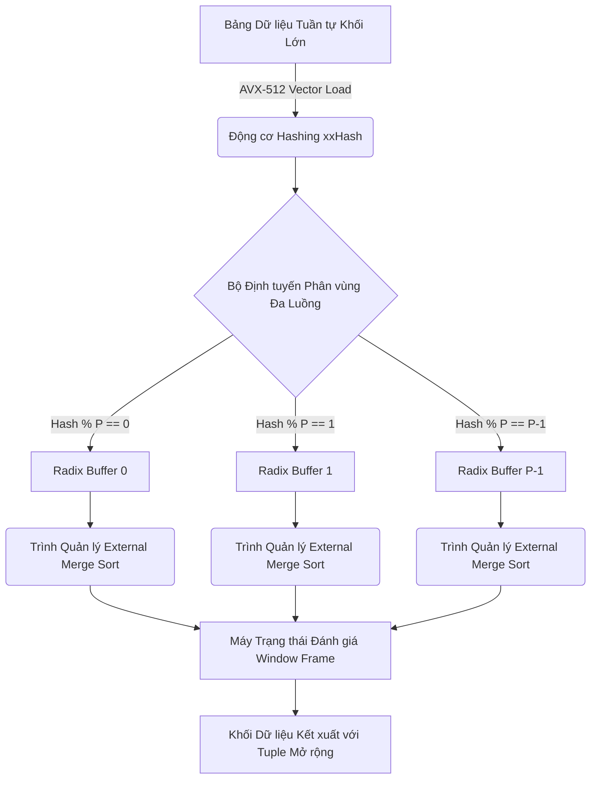

# 38: Cơ chế thực thi đằng sau SQL Window Functions

## Kiến trúc và Kỹ thuật Phân mảnh Dữ liệu

Cơ chế thực thi của các hàm cửa sổ (Window Functions) trong Hệ quản trị Cơ sở dữ liệu Quan hệ (RDBMS) và các hệ thống xử lý dữ liệu phân tán (như Apache Spark, Presto, Trino) là một trong những chủ đề phức tạp nhất trong kiến trúc hệ thống cơ sở dữ liệu. Khác biệt cốt lõi giữa hàm tập hợp truyền thống (Aggregate Functions) và hàm cửa sổ nằm ở chỗ hàm cửa sổ không gộp các hàng thành một kết quả duy nhất, mà tính toán một giá trị cho mỗi hàng đầu vào dựa trên một tập hợp các hàng liên quan về mặt logic đối với nó. Tập hợp này được gọi là khung cửa sổ (window frame). Quá trình này đòi hỏi một luồng thực thi phức tạp bao gồm các giai đoạn phân mảnh (partitioning), sắp xếp (sorting), và đánh giá (evaluation) được thực thi trong một chu trình xử lý siêu vô hướng. 

Về mặt vi kiến trúc (micro-architecture), việc phân mảnh dữ liệu đầu vào thành các nhóm phân vùng logic dựa trên mệnh đề `PARTITION BY` thường được thực hiện thông qua các thuật toán băm (hashing) có tốc độ phân giải cao kết hợp với kỹ thuật phân vùng song song (parallel partitioning). Các hàm băm phi mật mã (non-cryptographic hash functions) như MurmurHash3, CityHash, hay xxHash thường được triển khai sâu trong mã nguồn lõi để cực đại hóa thông lượng xử lý. Hệ thống cơ sở dữ liệu sẽ gán cho mỗi hàng một giá trị băm $h(x) = \text{xxHash}(x_k) \pmod P$, trong đó $x_k$ đại diện cho tập hợp các chuỗi byte cấu thành các cột được chỉ định trong mệnh đề phân vùng, và $P$ là hằng số đại diện cho số lượng phân vùng độc lập hoặc số luồng thực thi song song (parallel degrees of freedom). Quá trình tính toán giá trị băm thường sử dụng các lệnh SIMD (Single Instruction, Multiple Data) như bộ tập lệnh AVX-512 hoặc AVX2 trên vi xử lý x86-64 để gia tăng thông lượng bộ nhớ và giảm số chu kỳ xung nhịp (clock cycles) cần thiết cho việc xử lý hàng loạt các bản ghi cùng lúc. Ví dụ, bằng cách tải đồng thời 8 khối khóa 64-bit vào các thanh ghi YMM (YMM registers), bộ xử lý có thể tính toán hàm băm cho 8 bản ghi trong một chu kỳ xung nhịp duy nhất, tạo ra mức tăng tốc tuyến tính so với quy trình SISD truyền thống.

Để giảm thiểu tình trạng xung đột bộ nhớ đệm (cache thrashing) và tối ưu hóa hiện tượng trễ truy xuất bộ nhớ (memory latency), các luồng dữ liệu được định tuyến thông qua một kiến trúc bộ đệm Radix (Radix Buffer) với kích thước khối (block size) được tinh chỉnh để nằm gọn trong dung lượng của bộ nhớ đệm L2 hoặc tối thiểu là L3 của vi xử lý. Việc tràn bộ nhớ đệm dẫn đến việc vi xử lý phải tìm kiếm dữ liệu ở bộ nhớ chính, làm tăng chi phí độ trễ lên mức hàng chục nanosecond so với chỉ vài nanosecond ở cache L1/L2. Khi không gian bộ nhớ RAM được phân bổ cho luồng xử lý không đủ để chứa toàn bộ tập dữ liệu của một phân vùng cụ thể, kỹ thuật phân vùng ngoại vi (External Partitioning) sẽ được hệ thống kích hoạt tự động. Bộ quản lý bộ nhớ (Memory Manager) của RDBMS sẽ tiến hành ánh xạ các tệp tạm thời trên ổ cứng thông qua giao diện hệ thống `mmap()` (Memory-Mapped Files), kết hợp chặt chẽ với cơ chế hệ thống `madvise()` cùng cờ `MADV_SEQUENTIAL`. Mục tiêu của hệ thống cờ này là gửi tín hiệu tiên đoán đến nhân hệ điều hành (kernel) về mẫu truy cập dữ liệu một chiều tuần tự, từ đó kích hoạt cơ chế đọc trước (aggressive read-ahead heuristic), tải các khối dữ liệu từ ổ đĩa (disk blocks) lên Page Cache trước khi CPU thực sự yêu cầu nó.

Về mặt hình thức học, một khung cửa sổ cho một hàng thứ $i$ trong một phân vùng $P$ với kích thước $N$ bản ghi được định nghĩa một cách chặt chẽ qua lý thuyết tập hợp là:
$$ W_i = \{ r_j \in P \mid \max(1, i - L) \le j \le \min(N, i + U) \} $$
Trong đó, $L$ và $U$ lần lượt là các giá trị chỉ số biên dưới (Lower Bound) và biên trên (Upper Bound) của khung, định hình từ mệnh đề `ROWS BETWEEN L PRECEDING AND U FOLLOWING`. Hệ thống phân chia cửa sổ thành nhiều mô hình thực thi khác nhau. Nếu cấu trúc của khung cửa sổ là tĩnh và luân phiên mở rộng từ gốc phân vùng (ví dụ: `UNBOUNDED PRECEDING AND CURRENT ROW`), thuật toán thực thi chỉ cần một bộ tích lũy trạng thái tuyến tính (linear running accumulator) áp dụng kỹ thuật cập nhật gia tăng (incremental update) với độ phức tạp toán học $\mathcal{O}(1)$ cho mỗi bước lặp. Tuy nhiên, khi đối mặt với khung cửa sổ trượt (sliding window) hai đầu di chuyển động, việc duy trì trạng thái tích lũy không thể phụ thuộc vào cập nhật tích lũy đơn thuần mà đòi hỏi các cấu trúc dữ liệu phức tạp hơn, cung cấp khả năng đánh giá đồng bộ ở cả hai cực của vùng dữ liệu nội bộ.



## Thuật toán Sắp xếp và Đánh giá Cửa sổ Khung

Sau khi hoàn tất quá trình thiết lập ranh giới các phân vùng dựa trên mệnh đề `PARTITION BY`, hệ thống sẽ tiếp tục chuyển sang bước sắp xếp (sorting) chi tiết bên trong từng phân vùng độc lập dựa trên mệnh đề `ORDER BY`. Trong kiến trúc thực thi truy vấn cơ sở dữ liệu, việc sắp xếp dữ liệu khối lượng khổng lồ luôn là một phép toán cực kỳ tốn kém, tiêu thụ tài nguyên điện toán nội tại với độ phức tạp thời gian giới hạn tiệm cận dưới $\Omega(N \log N)$ cho mỗi phân vùng gồm $N$ tuple đầu vào. Bộ tối ưu hóa truy vấn chi phí (Cost-Based Optimizer - CBO) hiện đại liên tục ứng dụng các đồ thị thuộc tính (property graphs) và mô hình suy luận luồng dữ liệu (dataflow inference) nhằm loại bỏ toán tử sắp xếp thừa thãi. Điều này đạt được thông qua việc tận dụng các thuộc tính trật tự vật lý hệ thống (physical order properties) được kế thừa trực tiếp từ các toán tử lớp dưới trong cây biểu thức, chẳng hạn như cấu trúc rễ B+Tree từ phép quét chỉ mục (Index Scan) tuần tự. Tuy nhiên, trong phần lớn các lộ trình truy vấn (query execution plans) nơi sự vô trật tự (entropy) của dữ liệu quá cao, một hệ thống Sắp xếp Hỗn hợp (Hybrid Sorter) sẽ được khởi động. Khi toàn bộ tuple thuộc vùng quản lý của luồng có thể định cư gọn gàng trên không gian RAM khả dụng, thuật toán IntroSort (Introspective Sort) — một kiệt tác vi máy tính kết hợp giữa tốc độ trượt tuyến tính trung bình của Quicksort và khả năng đảm bảo giới hạn thực thi tồi tệ nhất $\mathcal{O}(N \log N)$ của Heapsort — sẽ là cốt lõi sắp xếp chính. 

Mặt khác, đối mặt với các cấu hình dữ liệu vượt ngưỡng kích thước `work_mem` hay bộ nhớ heap tiến trình, thuật toán Sắp xếp Trộn Ngoại vi (External Merge Sort) nắm quyền điều khiển. Dữ liệu được chia cắt thành các chuỗi con (runs), được sắp xếp bằng bộ xử lý chính và ghi luân phiên (spill) xuống các khối không gian trên ổ lưu trữ NVMe dạng block định dạng nhị phân thuần túy. Giai đoạn hợp nhất nhiều nhánh ngoại vi (multi-way merge phase) được tăng tốc đáng kể bằng cách áp dụng Cấu trúc Hàng đợi Ưu tiên Tối thiểu (Min-Priority Queue) với dạng Cây Giải mã nhị phân (Binary Heap) hoặc Cây Đấu Giải (Tournament Tree / Loser Tree). Kỹ thuật Loser Tree cung cấp một giải pháp cực kỳ tối ưu về mặt kiến trúc bộ nhớ vì việc thay thế một node tại đỉnh cây và cập nhật toàn bộ cấu trúc chỉ đòi hỏi $\log_2(K)$ phép so sánh cho chu kỳ trộn $K$ nhánh, với các nút nằm cạnh nhau trong cùng một dải cache line vật lý.

Bước vào giai đoạn định hình giá trị (Evaluation Phase), khung cửa sổ sẽ được áp dụng cho mọi Tuple đã định vị. Chiến lược được phân mảnh dựa trên phân loại hàm toán học. Với các cấu trúc như `ROW_NUMBER()`, `RANK()`, và `DENSE_RANK()`, bộ thi hành chỉ duy trì các biến trạng thái quy mô siêu nhỏ (registers), so sánh trị số giữa node liền kề bằng độ phức tạp tuyệt đối $\mathcal{O}(N)$. Đỉnh cao sự phức tạp toán học tập trung vào các tập hợp trượt hai chiều như tính giá trị tối đa `MAX()`, tổng `SUM()` với dạng khung `ROWS BETWEEN W PRECEDING AND W FOLLOWING`. Hệ thống vận dụng thuật toán Hàng đợi Hai đầu Đơn điệu (Monotonic Deque) có khả năng giải quyết truy vấn vùng cục bộ với chi phí tuyến tính phân bổ trơn tru (amortized $\mathcal{O}(1)$ time per row), biến thời gian đánh giá tổng thành $\mathcal{O}(N)$. Deque hoạt động qua nguyên lý đào thải các phần tử lạc hậu — những tuple không thể có cơ hội trở thành giá trị tối đa khi cửa sổ tịnh tiến về tương lai sẽ bị xóa nhòa vĩnh viễn khỏi hàng đợi, chỉ bảo lưu danh sách các ứng viên có tiềm năng với vị trí chỉ mục tăng dần chặt chẽ.

Đối với chuỗi thao tác tổng hợp `SUM()` và `AVG()` trên các khung di động chứa dữ liệu số thực dấu phẩy động (IEEE 754 Double Precision Floating Point), một nguy cơ thảm họa về độ chính xác tiềm ẩn được gọi là sai số khử (catastrophic cancellation) khi cộng các giá trị siêu lớn với siêu nhỏ luân phiên sẽ xuất hiện. Để bảo toàn tính toàn vẹn của kết quả khoa học, engine sẽ thực thi thuật toán tổng hợp Kahan (Kahan Summation Algorithm) kết hợp với thuật toán Neumaier (Neumaier's variant) để theo dõi song song các phần bù bị mất mát, kìm hãm lỗi sai số tích lũy ở mức cận biên epsilon hệ thống.

Thuật toán đoạn mã Rust giả lập kiến trúc cốt lõi dưới đây phác thảo hệ thống thực thi Cửa sổ trượt hiệu năng cao:

```rust
use std::collections::VecDeque;
use std::fmt::Debug;

pub struct WindowFrameExecutor<T> {
    data: Vec<T>,
    window_size: usize,
}

impl<T: PartialOrd + Copy + Debug> WindowFrameExecutor<T> {
    pub fn new(data: Vec<T>, window_size: usize) -> Self {
        WindowFrameExecutor { data, window_size }
    }

    /// Đánh giá Sliding Window Maximum theo nguyên lý Monotonic Deque
    /// Complexities: Time O(N) | Space O(W)
    pub fn evaluate_max(&self) -> Vec<T> {
        let n = self.data.len();
        let mut result = Vec::with_capacity(n);
        let mut deque: VecDeque<usize> = VecDeque::with_capacity(self.window_size);

        for i in 0..n {
            // Loại bỏ chỉ mục của các phần tử đã trượt khỏi ranh giới khung cửa sổ
            if let Some(&front_idx) = deque.front() {
                if i >= self.window_size && front_idx <= i - self.window_size {
                    deque.pop_front();
                }
            }

            // Loại bỏ các phần tử nằm trong deque mà nhỏ hơn phần tử hiện tại
            // Vì chúng không bao giờ có thể đóng vai trò Max từ giờ trở đi
            while let Some(&back_idx) = deque.back() {
                if self.data[back_idx] <= self.data[i] {
                    deque.pop_back();
                } else {
                    break;
                }
            }

            deque.push_back(i);

            // Ghi kết quả vào đầu ra kể từ khi cửa sổ bắt đầu chứa đủ giá trị 
            // hoặc bắt đầu từ tuple hiện tại cho partial frame
            if let Some(&max_idx) = deque.front() {
                result.push(self.data[max_idx]);
            }
        }
        result
    }
}
```

Trong những tình huống siêu việt khi khung dạng `RANGE` được sử dụng trên một trục biến động hỗn loạn hoặc khi thực thi các phép tính không thể sử dụng bộ tích lũy gia nghịch (như hàm đếm số giá trị phân biệt `COUNT(DISTINCT)`), phương thức tiếp cận Deque bị phá sản hoàn toàn. Giải pháp cấp thiết là khởi tạo một Cấu trúc Cây Phân Đoạn (Segment Tree) hoặc Cây Chỉ số Nhị phân (Fenwick Tree / Binary Indexed Tree). Các cấu trúc toán học quy hoạch động này hỗ trợ khả năng cập nhật thay đổi và trích xuất giá trị vùng với độ phức tạp logarit nhị phân $\mathcal{O}(\log N)$, dẫn tới chi phí thời gian tổng quát của phép Window Frame Evaluation leo lên con số $\mathcal{O}(N \log N)$.

## Thuật toán Tính toán Song song theo Cụm Phân Tán

Với mô hình hệ thống kho dữ liệu phân tán nhiều node (Distributed Data Warehouse như Google BigQuery hay Snowflake), việc định giá hàm cửa sổ buộc phải chuyển sang mô hình siêu luồng phân tán qua Mạng Lưới Kiến trúc (Network Fabric). Do tính phụ thuộc dữ liệu một cách toàn cục đối với việc phân mảnh (Global Partitioning Dependencies), phương thức Broadcast hay Shuffle truyền thống đòi hỏi băng thông trao đổi siêu hạng (Ultra-High Bandwidth). 

Dữ liệu ban đầu được dàn trải qua cụm phân tán bằng thuật toán Hash-Shuffle trên mạng theo giao thức RDMA (Remote Direct Memory Access), với mỗi node chịu trách nhiệm một tập hợp phân vùng duy nhất để hạn chế việc di chuyển dữ liệu trạng thái. Trong trường hợp một phân vùng quá khổng lồ (Data Skewness) dẫn tới điểm chết bóp nghẹt tài nguyên trên một Node duy nhất, hệ thống triển khai phương pháp Phân đoạn Trạng thái Tiền tố (Prefix Sum / Scan Algorithms). Thay vì xử lý nguyên một luồng, dữ liệu được phân chia thành các đoạn song song nội tại cục bộ $C_1, C_2, ..., C_k$. Mỗi Node vi xử lý đoạn $C_i$ sẽ tính toán một Tích lũy Cục bộ (Local Aggregate) tương ứng với biên nội bộ của nó. Sau đó, tại cấp độ phân tán, các Node trao đổi phần dư kết quả $S_i$ tạo thành bộ Tích lũy Toàn cục (Global Prefix Sum), và lan truyền dội ngược (Back-propagation) về từng bộ máy trạm. Quá trình chia rẽ để chinh phục dựa vào định lý hàm biến hình không gian (homomorphism) với một cấu trúc toán học đơn hình (Monoid) có tính kết hợp (associativity), đạt được tốc độ $\mathcal{O}(N / P + \log P)$ theo khuôn khổ mô hình máy PRAM song song. Tuy nhiên giải pháp này bị vô hiệu hoàn toàn đối với các hàm cửa sổ không hỗ trợ tính kết hợp, buộc hệ thống tái áp dụng giới hạn xử lý cục bộ nguyên khối.

## Quản lý Bộ nhớ Hệ điều hành và Giới hạn Phần cứng

Sức mạnh thực thi hàm cửa sổ là một sân chơi minh chứng cho nghệ thuật kiểm soát cơ chế tương tác ở tầng cực thấp giữa động cơ quản lý cơ sở dữ liệu và nhân Kernel của hệ điều hành. Do sự háu đói tài nguyên cực hạn khi thao tác trên các vùng nhớ không liền kề trong thuật toán Sắp xếp, engine thực thi luân phiên đối mặt với điểm kết thúc của bộ nhớ vật lý. Kernel quản lý bộ nhớ thông qua Cơ chế Phân trang Bộ nhớ Ảo (Virtual Memory Paging), sử dụng cấu trúc Translation Lookaside Buffer (TLB) trong CPU để làm cầu nối phiên dịch từ địa chỉ ảo sang địa chỉ vật lý. Sự suy giảm dung lượng TLB (TLB miss) đẩy vi xử lý vào bước duyệt Bảng Trang phần cứng (Hardware Page Walk), tiêu tốn hàng trăm chu kỳ CPU. Với tập dữ liệu trong RAM cỡ Terabyte, hiện tượng TLB thrashing là thảm họa không thể tránh khỏi. Để tối ưu hiện tượng này, kiến trúc vi hạt (micro-engine) cấp phát các trang nhớ sử dụng cơ chế Transparent Huge Pages (THP) hoặc `hugetlbfs` theo chuẩn Linux, kích thước bộ khung đẩy từ mức 4KB truyền thống lên 2MB hoặc 1GB, giảm bớt mật độ phần tử bảng trang đi hàng triệu lần.

Khối lượng truy xuất ngoại vi xuống đĩa (disk I/O) khi thực hiện tràn băng thông bộ đệm sẽ trở thành nút thắt cổ chai về độ trễ nguy hiểm. Do đó, mã lõi C/C++ của hệ quản trị CSDL ưu tiên áp dụng cờ `O_DIRECT` khi thao tác mở file từ hệ thống lưu trữ khối (Block Storage). Điều này đi vòng qua thành phần Page Cache của hệ điều hành — nơi mà cơ chế duy trì hai vùng sao chép không chỉ lãng phí chu kỳ DMA (Direct Memory Access) mà còn tạo áp lực dư thừa tới bộ dọn rác Kernel (kswapd). Trình Quản lý Bộ đệm (Buffer Manager) tự thiết kế trong lõi database sẽ nhận trách nhiệm tuyệt đối đối với việc dọn dẹp các mảng ghi đọc không đồng bộ (AIO - Asynchronous I/O via `io_uring` trong Linux Kernel hiện đại). 

Một tầng phức tạp khác nằm ở Kiến trúc Bộ nhớ Không Đồng nhất (Non-Uniform Memory Access - NUMA). Các kiến trúc đa socket của bo mạch chủ máy chủ (dual-socket hoặc quad-socket) sở hữu vùng nhớ RAM vật lý dính liền với vi xử lý vật lý quản lý nó. Nếu một tiến trình Thread ID được OS Scheduler định tuyến tại Node NUMA 0, nhưng phân vùng Hash lại vô tình rải trên bộ nhớ thuộc Node NUMA 1, thông lượng dữ liệu buộc phải len lỏi qua các cầu nối liên mạng vi xử lý (như băng tần Intel UPI hoặc AMD Infinity Fabric). Độ trễ tín hiệu sẽ gia tăng mạnh và băng thông bị chia sẻ với các tiến trình khác. Vì lẽ này, quá trình khởi chạy thực thi truy vấn sẽ dùng tập lệnh hệ thống để ràng buộc chặt vi luồng xử lý vào một lõi CPU vật lý cụ thể bằng kỹ thuật CPU Pinning thông qua hàm `sched_setaffinity()`, song song với cấu hình phân bổ vùng RAM bằng tập lệnh `libnuma`, yêu cầu hệ điều hành phân bổ `MAP_POPULATE` nghiêm ngặt theo đặc điểm địa phương (Data Locality).

Cuối cùng, sự tổ chức cấu trúc dữ liệu cho quá trình lặp hàm cửa sổ buộc phải thỏa mãn yêu cầu căn chỉnh dòng cache vật lý (cache line alignment). Bất cứ một sai lệch thiết kế kiến trúc đối tượng OOP nào dẫn đến hiện tượng Chia sẻ Sai lệch (False Sharing), nơi hai luồng khác biệt vô tình cập nhật hai biến tích lũy liền kề cư trú trong cùng một block 64-byte của L1 Cache, sẽ đánh thức giao thức liên kết Cache Coherency (như MESI Protocol). CPU buộc phải khóa kênh RAM và hủy bộ đệm đồng bộ lặp lại giữa các lõi, thiêu rụi tốc độ phân tích siêu luồng. Giải pháp là điền khuyết bộ đệm (padding) qua định hướng `#pragma pack` hoặc macro cấu trúc `__attribute__((aligned(64)))`, đẩy từng đối tượng ra các khu vực phân tách độc lập trong cấp phát heap của ứng dụng. Cơ chế thực thi Window Function không chỉ là lý thuyết truy vấn đơn giản, mà là sự hoàn thiện của vật lý vi điện toán kết tinh qua mã nguồn.

## Tối ưu hóa Vi cấu trúc Lệnh Dữ liệu Thực Thi

Đi sâu hơn vào cách bộ máy xử lý mã máy lệnh x86/ARM thực tế với các đoạn đánh giá khung dữ liệu, ta thấy mô hình JIT Compilation (Biên dịch tức thời - Just-In-Time) đang thay thế mô hình thông dịch (Interpreter/Volcano Iterator Model). RDBMS hiện đại tạo sinh LLVM IR code (Intermediate Representation code) cho riêng truy vấn hàm cửa sổ tại thời điểm thực thi. Việc biên dịch động loại bỏ hoàn toàn các nhánh hàm trừu tượng ảo (virtual function calls) được sử dụng khi gọi lệnh lấy tuple. Mã lệnh máy sinh ra sẽ có luồng điều khiển phẳng (flat control flow) cho phép vi xử lý thực hiện phép tiên đoán rẽ nhánh (Branch Prediction) với tỷ lệ chính xác gần 100%. Các lệnh điều kiện dạng `if (row.is_null)` có khả năng làm tắc đường ống lệnh (Instruction Pipeline Stall) được gỡ bỏ và thay thế bằng các hoạt động thao tác cờ bit (bitwise mask operations), duy trì tỷ lệ Thực thi Lệnh Trên Xung nhịp (IPC - Instructions Per Clock) đạt mức đỉnh cao tối đa.

## SEO
* **Keywords**: SQL Window Functions Execution, Database Architecture, Sắp xếp phân vùng dữ liệu, Cây Phân đoạn Segment Tree, Khung trượt Sliding Window Deque, Quản lý bộ nhớ NUMA, Linux Kernel Page Cache, Thuật toán Kahan Summation, Tối ưu hóa Cache Line CPU, LLVM JIT Compilation.
* **Tags**: SQL Optimization, Database Internals, Advanced Algorithms, System Programming, High Performance Computing.
* **Meta Description**: Phân tích kỹ thuật chuyên sâu và quy mô lớn về kiến trúc siêu vô hướng, thuật toán xử lý luồng cấu trúc và giới hạn vật lý hệ điều hành đằng sau cơ chế thực thi của hệ quản trị cơ sở dữ liệu đối với SQL Window Functions.
