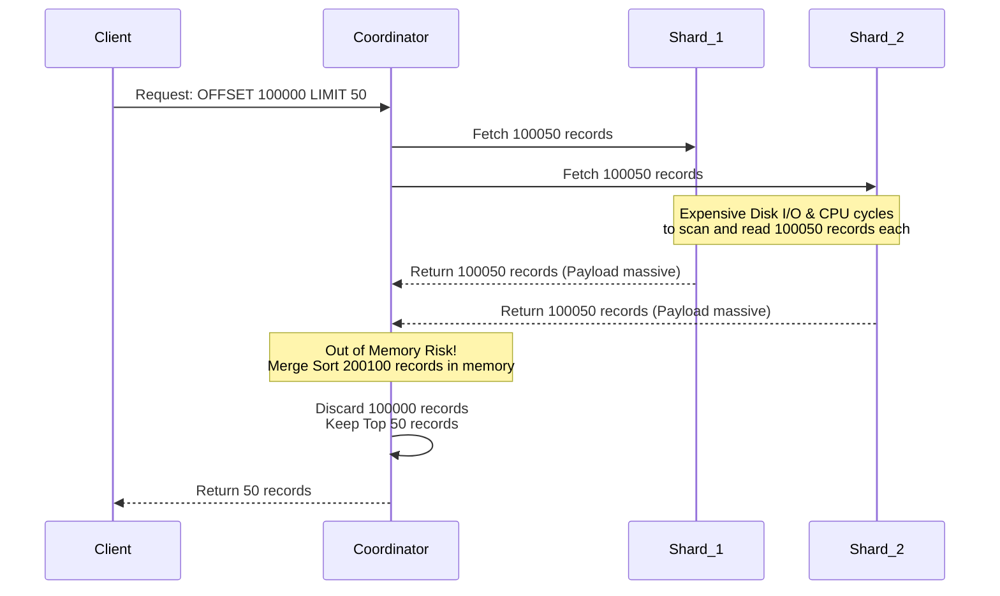

# Keyset Pagination vs Offset/Limit: Why Deep Pagination Breaks at Billion-Row Scale

## Executive Summary

Pagination sounds like a solved problem until your table crosses roughly a billion rows. At that point the naive SQL that worked fine in development starts eating CPU and dragging down every other query on the box.

This article is a close comparison of the two pagination strategies you'll run into in almost every production database: **Offset/Limit** and **Keyset Pagination** (sometimes called Seek Pagination). Rather than stop at syntax, we'll trace what each one actually does to a B+Tree index, to the OS page cache, and to CPU-level structures like the branch predictor and L1/L2 cache. The goal is to show, with real numbers and mechanics rather than hand-waving, why Offset/Limit degrades quietly until it doesn't — and why Keyset Pagination holds roughly constant latency ($O(1)$) no matter how deep you page.

If you're a backend engineer, DBA, or architect who has ever watched a "harmless" pagination query spike CPU to 100%, this should give you the mental model to explain why, and the fix to apply.

---

## The Core Problem

**What actually goes wrong?**
Picture an e-commerce platform with billions of transaction rows. A user — or more often, a batch job — asks for "page 10,000" of the transaction list. The backend fires off the query everyone has written at least once:

`SELECT * FROM transactions ORDER BY created_at DESC OFFSET 100000 LIMIT 50;`

Early on, with a small table, this comes back in 10ms. Nobody notices anything. But as the table grows, that same query starts taking 10 seconds, CPU on the database server pins at 100%, and unrelated queries start timing out because they're stuck behind it. This is what people call the **Deep Pagination Penalty** — and it's one of the more common causes of "the database just fell over" incidents that trace back to a single unassuming query.

Why does fetching 50 rows bring a cluster to its knees? The root cause is that Offset/Limit works by counting and discarding — it has to walk past every row it's skipping before it can hand you the ones you asked for. That's fundamentally at odds with how hardware wants to be used, a mismatch engineers sometimes call a failure of Mechanical Sympathy.

---

## Anatomy of Offset/Limit: Where the Waste Comes From

### The algorithmic cost

When an RDBMS receives `OFFSET O LIMIT K`, it has no way to jump straight to row $O$. It has to traverse $O + K$ rows from the start of the result set, throw away the first $O$, and return only the last $K$. Total execution time follows roughly:

$$ T_{offset}(O, K) = C_{seek} \cdot \log_b(N) + C_{scan} \cdot \sum_{i=1}^{O+K} c_i $$

The per-row cost $c_i$ isn't free — it covers reading the row off disk (or cache), decompressing it if needed, and evaluating any filter conditions. Multiply that by hundreds of thousands of rows you're about to discard, and the waste adds up fast.

### Buffer pool thrashing

To read those $O + K$ rows, the database has to pull every data page containing them from disk into RAM. An `OFFSET 1000000` can mean loading gigabytes of data you'll never actually use — just to throw it away a moment later.

That flood of pages through the buffer pool triggers the LRU eviction algorithm, and the pages that get evicted are often the "hot" ones serving your other, more useful queries. This is **cache pollution**: it tanks the cache hit ratio across the whole system, forces more disk reads, and those disk reads pollute the cache further. It's a feedback loop, and it doesn't self-correct.

### Where it turns into a real disaster: sharded systems

In a sharded architecture — Elasticsearch, Cassandra, and similar systems — the problem compounds. Say you have 10 shards and issue `OFFSET 100000 LIMIT 50`. The coordinator node has no choice but to ask **every single shard** for 100,050 rows, because it doesn't know in advance which shard holds which rows in the global ordering. The coordinator then has to hold $100,050 \times 10 = 1,000,500$ rows in memory, merge-sort them, and throw away 1,000,000 of them to return the 50 you actually wanted. That's routinely enough to trigger an out-of-memory error or a stop-the-world garbage collection pause.

---

## Keyset Pagination: The Alternative That Scales

Keyset Pagination drops the idea of an absolute position entirely. Instead of "skip 100,000 rows," it remembers the last row you saw on the previous page — say, `last_id` and `last_timestamp` — and uses that as a `WHERE` condition on the next query.

`SELECT * FROM transactions WHERE (created_at, id) < (last_timestamp, last_id) ORDER BY created_at DESC, id DESC LIMIT 50;`

### Why this plays to the B+Tree's strengths

This is where keyset pagination vs offset limit really diverges: instead of scanning linearly, the database performs an **index seek** — essentially a binary search down the B+Tree — to land directly on the row matching `(last_timestamp, last_id)`.

That changes the cost function entirely, removing the $O$ term:

$$ T_{keyset}(K) = C_{seek} \cdot \log_b(N) + C_{scan} \cdot K $$

For $N = 1$ billion rows, a B+Tree is typically only 3-4 levels deep. The upper levels — root and internal nodes — tend to stay resident in L3 cache because they're accessed constantly. So the seek itself costs microseconds, not milliseconds. Once it lands, the database only has to walk forward through the $K$ (here, 50) rows you actually asked for, reading straight along the leaf nodes.

### Solving the distributed case too

In a sharded setup, keyset pagination pushes the same `(last_timestamp, last_id)` pair down to every shard. Each shard performs its own fast index seek and returns exactly 50 rows — no more. The coordinator now only has to merge $50 \times 10 = 500$ rows instead of over a million. RAM usage and network traffic both drop by roughly three orders of magnitude compared to the Offset/Limit approach.

---

## What Happens at the Hardware Level

The gap between these two approaches gets more interesting once you look below the SQL layer, at how each one behaves on the CPU and in the OS.

### Branch prediction and the instruction pipeline

Offset/Limit's discard loop is essentially a `while` loop checking `skipped < offset` on every iteration. Over hundreds of thousands of iterations of throwaway rows, the CPU's branch predictor has a hard time — and every misprediction forces a pipeline flush, burning roughly 15-20 clock cycles per mistake.

$$ T_{cpu\_cycles} = N_{instructions} \cdot CPI_{ideal} + N_{misses} \cdot Penalty_{cache\_miss} + N_{mispredicts} \cdot Penalty_{pipeline\_flush} $$

Keyset pagination's leaf-node walk has no discard branch at all — it's a straight-line loop. That keeps the pipeline full and lets the CPU run close to its theoretical IPC (instructions per cycle) ceiling.

### TLB thrashing and L1/L2 cache pressure

Loading hundreds of thousands of throwaway rows evicts useful instructions and data from L1/L2 cache. It also stresses the Translation Lookaside Buffer (TLB), which has to map an unusually large number of virtual pages to physical pages — that's TLB thrashing, and when it happens the CPU has to fall back to a full page walk through the kernel, which is slow. Keyset pagination, touching only $K$ rows, keeps the TLB hit rate close to 99.9%.

```mermaid
graph TD
    subgraph Offset/Limit Flow
        A1[Receive Offset O Limit K] --> B1[Seek to Start]
        B1 --> C1[Loop through O records]
        C1 --> D1[CPU Branch Predictor Fails]
        D1 --> E1[L1/L2 Cache Evicted Unnecessarily]
        E1 --> F1[Discard O records]
        F1 --> G1[Collect K records]
    end

    subgraph Keyset Pagination Flow
        A2[Receive Keys Limit K] --> B2[SIMD Binary Search on B-Tree Node]
        B2 --> C2[L1/L2 Cache Hit - High TLB Hit Rate]
        C2 --> D2[Direct Jump to Leaf Node Address]
        D2 --> E2[Collect exactly K records sequentially]
    end
```

### NVMe queue depth and hardware prefetching

On NVMe-backed storage, Offset/Limit's flood of throwaway reads piles up DMA requests and saturates the disk controller's queue depth. Keyset pagination, by contrast, reads sequentially in a pattern the hardware prefetcher can predict well — it starts pulling the next cache lines into on-chip SRAM before the algorithm even asks for them, which largely eliminates I/O stalls.

---

## Practical Takeaways

A few concrete lessons worth carrying into your own schema and API design:

1. **Treat large OFFSET values as a production hazard.** Anything past `OFFSET 10,000` is worth flagging in review. If your UI needs arbitrary page jumps ("jump to page 100,000"), it's usually cheaper to rethink the UX — infinite scroll backed by keyset pagination is the common fix — than to keep patching the query. If you truly need an exact total count, that's a job for a separate search index, not a live COUNT against the transactional table.
2. **Build the covering index keyset pagination actually needs.** It only pays off if you have a composite index matching both your ORDER BY and your pagination predicate — for example: `CREATE INDEX idx_created_id ON transactions(created_at DESC, id DESC);`.
3. **Never key pagination off a non-unique column alone.** Ordering purely by `created_at` breaks down the moment two rows share a timestamp — you'll skip or duplicate rows silently. Always pair the sort column with a genuinely unique tiebreaker, like `id` or a UUID.
4. **Keyset pagination is immune to page-shift anomalies.** With Offset/Limit, an insert into an earlier page shifts everything after it, and users see duplicated rows on the next page load. Keyset pagination anchors to a specific row in the index rather than a numeric position, so that class of bug simply doesn't occur.

## Conclusion

Choosing between these two isn't just a matter of which query is shorter to write — it reflects how well you understand what your database is actually doing underneath the SQL. Offset/Limit's linear count-and-discard model works fine at small scale and quietly turns into a liability as data grows. Keyset pagination trades that off for a small amount of extra state (remembering the last row) in exchange for near-constant latency regardless of how deep a user pages. Once you've seen the keyset pagination vs offset limit comparison play out at scale — in query plans, in buffer pool stats, in CPU counters — it's hard to reach for OFFSET again for anything beyond a handful of pages.
