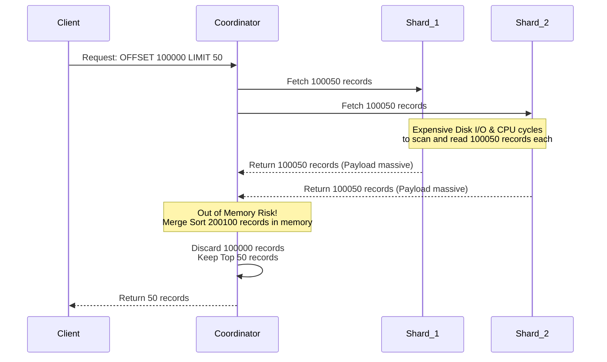

# 10億レコード規模でのページネーションクエリ - Offset/Limitに対するKeyset Paginationの台頭

## エグゼクティブサマリー

ページネーションはほぼすべてのアプリケーションに存在する、ごくありふれた機能だ。ところがデータセットが10億レコード規模に達すると、最初に何気なく書いたSQLページネーションのクエリが致命的な弱点をさらけ出し、性能が崩れ始める。

この記事では、データベースの世界でよく使われる2つのページネーション戦略、**Offset/Limit**と**Keyset Pagination(Seek Pagination)**を掘り下げて比較する。SQL構文の違いだけでなく、これらのクエリがB+Tree構造、OSのページキャッシュ、CPUマイクロアーキテクチャ(L1/L2キャッシュ、分岐予測)とどう絡み合うかまで踏み込む。数式とマイクロアーキテクチャの両面から、なぜOffset/Limitが分散システムで見えない爆弾になりうるのか、そしてKeyset Paginationがなぜ大規模でもリアルタイムに近い応答($O(1)$)を保てるのかを示す。

読み終える頃には、ページネーションが内部でどう動いているか、「Deep Pagination Penalty(深いページネーションのペナルティ)」がなぜ起きるのか、そして自分のシステムに活かせる設計上の教訓がつかめるはずだ。

---

## 中核となる問題

**問題とは何か?**
数十億件のトランザクションを持つECシステムを運用しているとしよう。ユーザー(あるいはバッチジョブ)が「10,000ページ目」の表示を要求してきた。バックエンドは次のような、ごくありふれたSQLを発行する。

`SELECT * FROM transactions ORDER BY created_at DESC OFFSET 100000 LIMIT 50;`

データが少ないうちは10ミリ秒で返ってくる。ところがシステムが成長すると、同じクエリが10秒かかるようになり、データベースサーバーのCPUは張り付き、他のクエリまで巻き添えで止まってしまう。これが**Deep Pagination Penalty**と呼ばれる現象だ。

たった50行を取ってくるだけのクエリが、なぜデータベースクラスター全体を巻き込んで落ちてしまうのか。答えはOffset/Limitの「数えて捨てる」というやり方そのものにある。これはハードウェアとの相性(メカニカル・シンパシー)という観点から見ると、かなり分の悪い設計だ。

---

## Offset/Limitの中身:壮大な無駄遣い

### 計算量とアルゴリズム
RDBMSは`OFFSET O LIMIT K`を受け取っても、位置$O$へ直接「ジャンプ」することはできない。開始位置から正確に$O + K$件のレコードをスキャンし、**最初の$O$件を泣く泣く捨てて**、残りの$K$件だけを返す羽目になる。

合計実行時間$T_{offset}$は次のような1次式で表せる。

$$ T_{offset}(O, K) = C_{seek} \cdot \log_b(N) + C_{scan} \cdot \sum_{i=1}^{O+K} c_i $$

このコスト$c_i$は決して軽くない。各レコードについてディスクからの読み取り、解凍、条件チェックがまるまる発生する。

### バッファプールスラッシング
$O + K$件のレコードを読むために、データベースはそれらを含むデータページをまるごとSSDからRAMに引き込まなければならない。`OFFSET 1000000`ともなれば、捨てるためだけに数ギガバイトのゴミデータをRAMに乗せている可能性がある。

この大量のゴミデータはLRU(Least Recently Used)クリーンアップを誘発し、他の重要なクエリが使っている「ホットな」データページを追い出してしまう。これが**キャッシュ汚染**と呼ばれる現象で、システム全体のキャッシュヒット率を下げ、ディスクからの読み込みを増やし、さらに悪化するという悪循環(Death Spiral)を生む。

### 分散システムでの大惨事
シャーディングされたアーキテクチャ(Elasticsearch、Cassandraなど)では、Offset/Limitは悪夢になる。10個のシャードがある状態で`OFFSET 100000 LIMIT 50`を実行すると、コーディネーターノードは**それぞれの**シャードに10万50件のレコードを要求しなければならない。そしてコーディネーターは合計$100,050 \times 10 = 1,000,500$件をRAM上に保持し、マージソートを行い、そのうち100万件を捨てる。この処理は簡単にメモリ不足(OOM)を招いたり、ガベージコレクションのStop-The-Worldを引き起こしたりする。

---

## Keyset Pagination(Seek Pagination)という解決策

Keyset Paginationは「絶対位置(Offset)」という考え方そのものを捨てる。代わりに前のページの最後のレコードの状態(`last_id`、`last_timestamp`など)を覚えておき、それを次のクエリの`WHERE`条件として渡す。

`SELECT * FROM transactions WHERE (created_at, id) < (last_timestamp, last_id) ORDER BY created_at DESC, id DESC LIMIT 50;`

### 探索木アルゴリズムの強み
Keyset PaginationはB+Treeインデックスの構造を最大限に活かす。線形にカウントする代わりに、データベースは**Index Seek**(木の中での二分探索)を実行し、`(last_timestamp, last_id)`に一致するレコードへピンポイントで「着地」する。

計算量の式から$O$の項がすっかり消える。

$$ T_{keyset}(K) = C_{seek} \cdot \log_b(N) + C_{scan} \cdot K $$

$N = 10$億であっても、B+Treeの高さはせいぜい3〜4段だ。上位のレベル(ルート/内部ノード)はほぼ常にL3キャッシュに乗っている。だからこのSeek操作は数マイクロ秒で終わる。着地した後は、リーフノード上で次の$K$(50)件をなぞるだけで済む。

### 分散システムでのボトルネック解消
分散システムでKeyset Paginationを使うと、コーディネーターはキーペア`(last_timestamp, last_id)`をそのまま各シャードに渡す。各シャードは高速なIndex Seekを行い、ちょうど50件だけを返す。コーディネーターが受け取るのは$50 \times 10 = 500$件で済み、マージソートして返すだけだ。消費するRAMとネットワーク帯域幅は、Offset/Limitと比べて桁違いに少なくなる。

---

## マイクロアーキテクチャレベルでの違い

この2つのモデルの差は、CPUの内部やOSのレンズを通して見ると、かなり露骨に現れる。

### 分岐予測と命令パイプライン
Offset/Limitモデルでは、`while`ループが`skipped < offset`かどうかを延々とチェックし続ける。数十万件のゴミレコードを相手にすると、CPUの分岐予測器は混乱しがちになる。予測が外れるたびに命令パイプライン全体がフラッシュされ、1回のミスにつき15〜20クロックサイクルが無駄になる。

$$ T_{cpu\_cycles} = N_{instructions} \cdot CPI_{ideal} + N_{misses} \cdot Penalty_{cache\_miss} + N_{mispredicts} \cdot Penalty_{pipeline\_flush} $$

Keyset Paginationでは、リーフノードをなぞるループに「捨てるかどうか」の分岐がそもそも存在しない。直線的な実行(straight-line execution)に近いので、CPUパイプラインは常に埋まった状態を保ち、IPC(Instructions Per Cycle)がほぼ理論上限に近づく。

### TLBスラッシングとL1/L2キャッシュ
Offsetの処理でCPUに大量のゴミデータを読み込ませると、L1/L2キャッシュから本来必要な命令やデータが押し出されてしまう。さらに困ったことに、数十万の仮想ページを物理ページへ変換する必要が出てくるとTLB(トランスレーション・ルックアサイド・バッファ)も過負荷になり、TLBスラッシングが発生する。結果としてCPUはページテーブルを再走査するためにOSカーネルを呼び出す羽目になり(ページウォーク)、システム全体が重くなる。Keyset Paginationは扱う件数$K$が小さいので、TLBヒット率はほぼ99.9%を維持できる。

### NVMeキューのレイテンシとハードウェアプリフェッチャ
NVMeディスクのクラスターでは、Offset/Limitが発生させる数千件分のゴミDMAリクエストがディスクのキュー(Queue Depth)を詰まらせる。一方、Keyset Paginationは素直な線形読み取りのパターンなので、CPUやOSの**ハードウェアプリフェッチャ**が次に使われるキャッシュラインを高い精度で予測でき、実際に必要になる前にデータをあらかじめSRAMへ引き込んでおける。結果としてI/O待ちによるメモリストールがほぼ発生しない。

---

## 学んだ教訓

こうした分析を踏まえて、データベース設計における実践的な教訓をまとめておく。

1. **本番環境で大きなOFFSETは避ける:** OFFSETが1万を超えるクエリは、システムの安定性を静かに脅かす時限爆弾だと考えたほうがいい。UIが「10万ページ目へジャンプ」のような機能を求めてくるなら、Keysetを使った無限スクロールへの切り替えを検討するか、どうしても正確なカウントが必要なら別のインデックスシステムを併用すべきだ。
2. **Keyset用のカバリングインデックスを設計する:** Keyset Paginationが真価を発揮するのは、`ORDER BY`の基準とページネーションの条件に一致する複合インデックスがある場合だけだ。例:`CREATE INDEX idx_created_id ON transactions(created_at DESC, id DESC);`。
3. **ページネーションキーの一意性を確保する:** Keysetでよくある失敗は、`created_at`のように重複しうる列だけをキーにしてしまうことだ。同じ`created_at`を持つレコードが100件あると、データの欠落が起きる。必ず`id`や`UUID`のような一意な列をタイブレーカーとして加えること。
4. **異常系(ファントムデータ)への耐性:** Offsetを使っていると、前のページに新しいデータがINSERTされた瞬間、後続のページ全体が「ずれて」しまい、ユーザーには同じデータが重複して見える。Keyset Paginationはインデックス空間上の特定の物理ノードを直接指すので、このズレの影響をそもそも受けない。

## 結論

ページネーション戦略の選択は、単にSQLを何行か書くという話では済まない。それはソフトウェアが下層のハードウェアとどうやり取りしているかを、どれだけ理解しているかを映し出す鏡でもある。Offset/Limitの古い「線形カウント」の発想を手放し、Keyset Paginationのシンプルな数式に切り替えることで、システムを崩壊から守るだけでなく、現代のサーバーアーキテクチャが本来持っている処理能力を引き出し、何億人ものユーザーにも滑らかに対応できるアプリケーション基盤への道が開ける。
