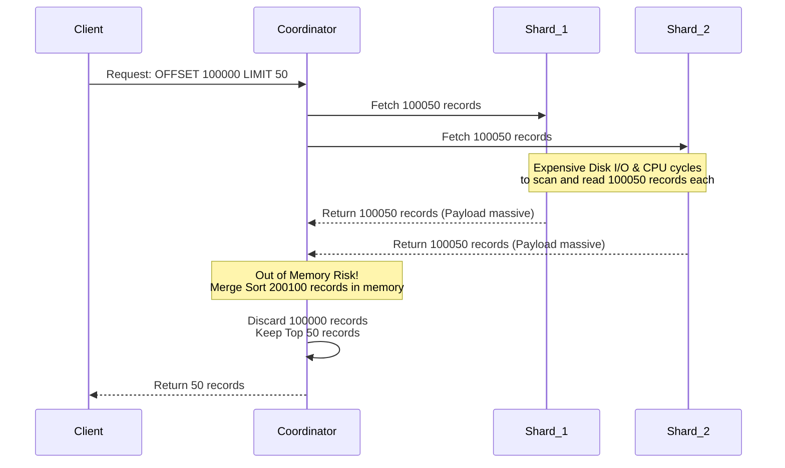

# Truy vấn Phân trang ở Quy mô Tỷ Bản ghi - Sự trỗi dậy của Keyset Pagination so với Offset/Limit

## Tóm tắt điều hành

Phân trang (pagination) là một trong những tính năng cơ bản nhất mà hầu như ứng dụng nào cũng cần. Nhưng khi tập dữ liệu vượt ngưỡng hàng tỷ bản ghi, câu lệnh SQL phân trang viết một cách hồn nhiên ban đầu sẽ bắt đầu bộc lộ những lỗ hổng nghiêm trọng, kéo theo sự sụp đổ về hiệu năng.

Bài viết này đi sâu vào hai chiến lược phân trang phổ biến nhất trong thế giới cơ sở dữ liệu: **Offset/Limit** và **Keyset Pagination (còn gọi là Seek Pagination)**. Không chỉ dừng ở cú pháp SQL, chúng ta sẽ xem các câu lệnh này tương tác thế nào với cấu trúc B+Tree, page cache của hệ điều hành, và vi kiến trúc CPU (cache L1/L2, dự đoán nhánh). Qua các phép tính cụ thể, bài viết sẽ chỉ ra vì sao Offset/Limit là một quả bom hẹn giờ trong hệ thống phân tán, và vì sao Keyset Pagination lại giữ được độ trễ gần như hằng số ($O(1)$) ngay cả ở quy mô cực lớn.

Đọc xong bài này, kỹ sư hệ thống, DBA và kiến trúc sư phần mềm sẽ hiểu rõ cơ chế phân trang vận hành ra sao bên dưới, vì sao "Deep Pagination Penalty" (hình phạt phân trang sâu) lại xảy ra, và rút ra được vài nguyên tắc thiết kế đáng áp dụng ngay.

---

## Vấn đề Cốt lõi

**Vấn đề là gì?**
Hãy tưởng tượng bạn vận hành một hệ thống thương mại điện tử với hàng tỷ giao dịch. Người dùng (hoặc một batch job) yêu cầu xem "trang thứ 10.000" của danh sách giao dịch. Backend phát ra câu lệnh SQL quen thuộc:

`SELECT * FROM transactions ORDER BY created_at DESC OFFSET 100000 LIMIT 50;`

Ban đầu, khi dữ liệu còn ít, truy vấn trả về trong 10ms. Nhưng khi hệ thống lớn dần, cùng một câu lệnh đó mất tới 10 giây, CPU của database server chạy full, và một loạt truy vấn khác bị treo theo. Đây chính là hiện tượng **Deep Pagination Penalty**.

Vì sao một truy vấn chỉ lấy 50 dòng lại có thể kéo sập cả cụm database? Câu trả lời nằm ở cách Offset/Limit vận hành: "đếm rồi bỏ" — một cách làm đi ngược hoàn toàn với nguyên tắc tận dụng phần cứng hiệu quả (mechanical sympathy).

---

## Bên trong Offset/Limit: Lãng phí ở quy mô lớn

### Độ phức tạp toán học
Khi RDBMS nhận `OFFSET O LIMIT K`, nó không thể "nhảy" thẳng đến vị trí $O$. Nó buộc phải quét đúng $O + K$ bản ghi từ đầu, rồi **ngậm ngùi vứt bỏ $O$ bản ghi đầu tiên**, chỉ giữ lại $K$ bản ghi cuối.

Tổng thời gian thực thi $T_{offset}$ là một hàm bậc nhất theo $O$:

$$ T_{offset}(O, K) = C_{seek} \cdot \log_b(N) + C_{scan} \cdot \sum_{i=1}^{O+K} c_i $$

Chi phí $c_i$ ở đây không hề nhỏ — nó bao gồm đọc đĩa, giải nén, và kiểm tra điều kiện cho từng bản ghi một.

### Khủng hoảng Buffer Pool
Để đọc được $O + K$ bản ghi, database phải kéo toàn bộ các trang dữ liệu chứa chúng từ SSD vào RAM. Với `OFFSET 1000000`, bạn có thể đang bắt hệ thống nạp hàng gigabyte dữ liệu vào RAM chỉ để vứt đi ngay sau đó.

Lượng dữ liệu thừa khổng lồ này kích hoạt cơ chế dọn dẹp LRU, đẩy văng các trang dữ liệu "nóng" đang phục vụ những truy vấn quan trọng khác ra khỏi bộ nhớ. Hiện tượng này gọi là **ô nhiễm cache (cache pollution)** — nó kéo tỷ lệ cache hit của cả hệ thống xuống thấp, buộc database phải đọc đĩa nhiều hơn, và cứ thế lún sâu vào một vòng xoáy tệ dần.

### Thảm họa trong hệ thống phân tán
Với kiến trúc sharding (Elasticsearch, Cassandra...), Offset/Limit trở thành cơn ác mộng thực sự. Có 10 shard và gọi `OFFSET 100000 LIMIT 50`, node điều phối (coordinator) phải yêu cầu **từng** shard trả về 100.050 bản ghi. Coordinator sau đó phải giữ $100.050 \times 10 = 1.000.500$ bản ghi trong RAM, chạy merge-sort, rồi vứt bỏ 1 triệu dòng trong số đó. Thao tác này rất dễ dẫn đến hết bộ nhớ (OOM) hoặc khiến garbage collector đứng hình (stop-the-world).

---

## Kiến trúc Keyset Pagination: Lối thoát ở Quy mô Lớn

Keyset Pagination bỏ hẳn khái niệm "vị trí tuyệt đối" (offset). Thay vào đó, nó lưu lại trạng thái của bản ghi cuối cùng ở trang trước (ví dụ `last_id`, `last_timestamp`), rồi truyền giá trị này vào truy vấn kế tiếp dưới dạng điều kiện `WHERE`.

`SELECT * FROM transactions WHERE (created_at, id) < (last_timestamp, last_id) ORDER BY created_at DESC, id DESC LIMIT 50;`

### Lợi thế của thuật toán cây tìm kiếm
Keyset Pagination tận dụng tối đa cấu trúc chỉ mục B+Tree. Thay vì đếm tuần tự, database thực hiện **Index Seek** (tìm kiếm nhị phân trên cây) để "hạ cánh" chính xác vào bản ghi có giá trị bằng `(last_timestamp, last_id)`.

Yếu tố $O$ biến mất hoàn toàn khỏi công thức độ phức tạp:

$$ T_{keyset}(K) = C_{seek} \cdot \log_b(N) + C_{scan} \cdot K $$

Với $N = 1$ tỷ bản ghi, chiều cao của B+Tree chỉ khoảng 3-4 tầng. Các tầng trên cùng (root, internal nodes) hầu như luôn nằm sẵn trong L3 cache. Vì vậy thao tác seek này chỉ tốn vài micro giây. Sau khi hạ cánh, database chỉ cần đọc tiếp đúng $K$ (50) bản ghi kế tiếp trên các leaf node.

### Giải quyết triệt để nút thắt phân tán
Khi dùng Keyset Pagination trong hệ thống phân tán, coordinator truyền thẳng cặp khóa `(last_timestamp, last_id)` xuống từng shard. Mỗi shard thực hiện Index Seek cực nhanh và chỉ trả về đúng 50 bản ghi. Coordinator lúc này chỉ nhận $50 \times 10 = 500$ bản ghi, chạy merge-sort rồi trả kết quả. Lượng RAM và băng thông mạng tiêu tốn giảm đi hàng nghìn lần so với Offset/Limit.

---

## Sự khác biệt ở tầng Vi kiến trúc

Khoảng cách giữa hai mô hình này lộ rõ hơn hẳn khi nhìn qua lăng kính vi mạch CPU và hệ điều hành.

### Dự đoán nhánh và Instruction Pipeline
Với Offset/Limit, vòng lặp `while` liên tục kiểm tra biến đếm `skipped < offset`. Đối mặt với hàng trăm nghìn bản ghi vô ích, bộ dự đoán nhánh (branch predictor) của CPU dễ bị nhiễu loạn. Mỗi lần đoán sai, CPU phải xả bỏ toàn bộ instruction pipeline, lãng phí 15-20 chu kỳ xung nhịp mỗi lần.

$$ T_{cpu\_cycles} = N_{instructions} \cdot CPI_{ideal} + N_{misses} \cdot Penalty_{cache\_miss} + N_{mispredicts} \cdot Penalty_{pipeline\_flush} $$

Với Keyset Pagination, vòng lặp đọc qua các leaf node không hề chứa nhánh điều kiện để loại bỏ dữ liệu. Nó gần với mô hình thực thi tuyến tính (straight-line execution), giữ cho pipeline CPU luôn đầy và đạt gần 100% IPC (instructions per cycle).

### TLB Thrashing và cache L1/L2
Khi Offset buộc CPU nạp quá nhiều dữ liệu thừa, các lệnh và dữ liệu hữu ích khác bị đẩy văng khỏi cache L1/L2. Tệ hơn, việc phải ánh xạ hàng trăm nghìn trang bộ nhớ ảo sang trang vật lý khiến TLB (Translation Lookaside Buffer) quá tải, gây ra TLB thrashing. Hệ quả là CPU phải nhờ kernel dò lại bảng trang (page walk), làm chậm cả hệ thống. Với Keyset Pagination, số bản ghi $K$ nhỏ giúp tỷ lệ TLB hit giữ ở mức gần 99,9%.

```mermaid
graph TD
    subgraph Offset/Limit Flow
        A1[Receive Offset O Limit K] --> B1[Seek to Start]
        B1 --> C1[Loop through O records]
        C1 --> D1[CPU Branch Predictor Fails]
        D1 --> E1[L1/L2 Cache Evicted Unnecessarily]
        E1 --> F1[Discard O records]
        F1 --> G1[Collect K records]
    end

    subgraph Keyset Pagination Flow
        A2[Receive Keys Limit K] --> B2[SIMD Binary Search on B-Tree Node]
        B2 --> C2[L1/L2 Cache Hit - High TLB Hit Rate]
        C2 --> D2[Direct Jump to Leaf Node Address]
        D2 --> E2[Collect exactly K records sequentially]
    end
```

### Độ trễ hàng đợi NVMe và Hardware Prefetcher
Trên các cụm đĩa NVMe, hàng nghìn yêu cầu DMA vô ích do Offset/Limit sinh ra sẽ làm nghẽn hàng đợi điều khiển đĩa (queue depth). Ngược lại, Keyset Pagination là một mô hình đọc tuyến tính rất "dễ chịu" với phần cứng — nó cho phép **hardware prefetcher** của CPU và hệ điều hành dự đoán chính xác cache line nào sẽ được dùng tiếp theo, chủ động kéo dữ liệu vào SRAM trước khi thuật toán cần đến, gần như loại bỏ hoàn toàn tình trạng chờ I/O.

---

## Bài học Rút ra

Sau khi phân tích kỹ, có vài bài học đáng ghi nhớ khi thiết kế hệ thống phân trang:

1. **Tránh OFFSET lớn trên production:** Bất kỳ truy vấn nào có OFFSET vượt quá 10.000 đều là một quả bom hẹn giờ đe dọa sự ổn định của hệ thống. Nếu giao diện đòi hỏi tính năng "nhảy tới trang 100.000", hãy cân nhắc đổi sang infinite scrolling dùng Keyset, hoặc dùng một hệ thống index riêng nếu thực sự cần đếm chính xác.
2. **Thiết kế covering index cho Keyset:** Keyset Pagination chỉ phát huy hết sức mạnh khi có một composite index khớp với tiêu chí `ORDER BY` và điều kiện phân trang. Ví dụ: `CREATE INDEX idx_created_id ON transactions(created_at DESC, id DESC);`.
3. **Đảm bảo tính duy nhất của khóa phân trang:** Lỗi thường gặp khi dùng Keyset là chỉ dựa vào cột có thể trùng giá trị (như `created_at`). Nếu có 100 bản ghi cùng `created_at`, thuật toán sẽ bỏ sót dữ liệu. Luôn thêm một cột duy nhất (như `id` hay `UUID`) làm tie-breaker.
4. **Miễn nhiễm với dữ liệu ma (phantom data):** Khi dùng Offset, nếu có dữ liệu mới được insert vào trang trước, mọi trang sau đó sẽ bị "dịch chuyển", khiến người dùng thấy dữ liệu trùng lặp. Keyset Pagination trỏ thẳng vào một node vật lý cụ thể trong không gian index, nên hoàn toàn không bị ảnh hưởng bởi kiểu lỗi dịch chuyển dữ liệu này.

## Kết luận

Chọn chiến lược phân trang nào không đơn thuần là gõ vài dòng SQL khác nhau — nó phản ánh mức độ hiểu biết của người kỹ sư về cách phần mềm giao tiếp với tầng phần cứng bên dưới. Từ bỏ lối tư duy đếm tuyến tính cũ kỹ của Offset/Limit và chuyển sang nguyên lý toán học gọn gàng của Keyset Pagination không chỉ giúp bảo vệ hệ thống khỏi nguy cơ sụp đổ, mà còn giải phóng đúng năng lực tính toán mà kiến trúc server hiện đại vốn có, mở đường cho những nền tảng có thể phục vụ hàng trăm triệu người dùng một cách trơn tru.
