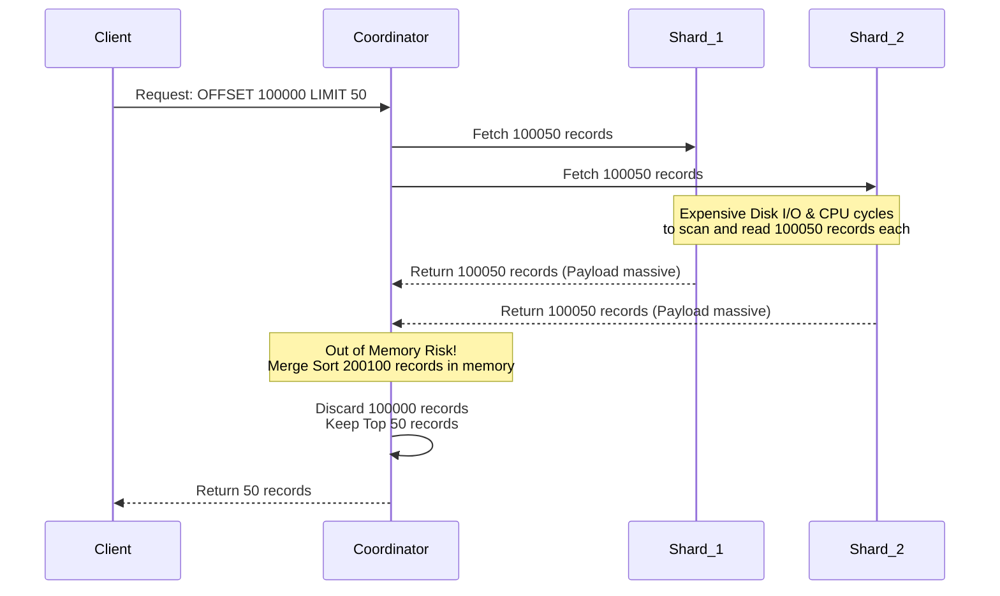

```mermaid
graph TD
    subgraph Offset/Limit Flow
        A1[Receive Offset O Limit K] --> B1[Seek to Start]
        B1 --> C1[Loop through O records]
        C1 --> D1[CPU Branch Predictor Fails]
        D1 --> E1[L1/L2 Cache Evicted Unnecessarily]
        E1 --> F1[Discard O records]
        F1 --> G1[Collect K records]
    end

    subgraph Keyset Pagination Flow
        A2[Receive Keys Limit K] --> B2[SIMD Binary Search on B-Tree Node]
        B2 --> C2[L1/L2 Cache Hit - High TLB Hit Rate]
        C2 --> D2[Direct Jump to Leaf Node Address]
        D2 --> E2[Collect exactly K records sequentially]
    end
```

# Phân tích Chuyên sâu về Truy vấn Phân trang ở Quy mô Tỷ Bản ghi: Keyset Pagination so với Offset và Limit

Vấn đề truy xuất dữ liệu theo từng phần, thường được gọi là phân trang (pagination), là một trong những bài toán kinh điển nhất trong kỹ thuật cơ sở dữ liệu và thiết kế hệ thống phân tán. Khi quy mô của tập dữ liệu vượt qua ngưỡng hàng tỷ bản ghi (billion-record scale), các chiến lược phân trang ngây thơ ban đầu sẽ bộc lộ những khiếm khuyết chí mạng về mặt hiệu suất, dẫn đến sự suy giảm tuyến tính của thông lượng (throughput) và sự gia tăng hàm mũ của độ trễ (latency). Trong môi trường sản xuất thực tế, việc thiết kế một cơ chế phân trang tối ưu đòi hỏi sự am hiểu sâu sắc về cấu trúc dữ liệu lưu trữ dưới dạng B+Tree hoặc Log-Structured Merge-tree (LSM Tree), chiến lược quản lý bộ nhớ đệm của hệ điều hành, và kiến trúc bộ nhớ vi mô của hệ thống phần cứng. Bài viết này trình bày một phân tích kỹ thuật toàn diện, so sánh hai mô hình phân trang phổ biến nhất: Offset/Limit và Keyset Pagination (hay Seek Pagination), dưới lăng kính của độ phức tạp thuật toán, kiến trúc vi xử lý, và cơ chế tương tác với hệ thống lưu trữ khối (block storage). Bằng việc mổ xẻ các khía cạnh vi mô của việc thực thi truy vấn, chúng ta sẽ làm rõ nguyên nhân gốc rễ khiến cơ chế Offset/Limit bị suy thoái hiệu suất nghiêm trọng ở các trang dữ liệu nằm sâu trong kết quả trả về, đồng thời chứng minh tính ưu việt của Keyset Pagination trong việc duy trì thời gian đáp ứng hằng số ($O(1)$ đối với thao tác tìm kiếm trên chỉ mục) bất kể vị trí của trang dữ liệu. Các kỹ sư hệ thống cần nhận thức rằng việc lựa chọn cơ chế phân trang không chỉ đơn thuần là một quyết định liên quan đến cú pháp truy vấn SQL, mà là một quyết định kiến trúc cốt lõi ảnh hưởng trực tiếp đến hệ số khuếch đại đọc (read amplification), tỷ lệ thất bại của bộ nhớ đệm (cache miss rate), và vòng đời của dữ liệu trong bộ nhớ chính.

## Phân tích Độ phức tạp Thời gian và Quản lý Bộ nhớ của Cơ chế Offset/Limit

Cơ chế phân trang dựa trên Offset và Limit hoạt động dựa trên nguyên tắc đếm và loại bỏ. Khi một hệ quản trị cơ sở dữ liệu quan hệ (RDBMS) nhận được một truy vấn chứa mệnh đề `OFFSET O LIMIT K`, bộ tối ưu hóa truy vấn (query optimizer) thường sẽ phải chỉ thị cho bộ máy thực thi (execution engine) duyệt qua chính xác $O + K$ bản ghi (records) từ vị trí bắt đầu của chỉ mục (index) hoặc bảng dữ liệu, sau đó loại bỏ $O$ bản ghi đầu tiên và chỉ trả về $K$ bản ghi cuối cùng cho máy khách. Từ góc độ thuật toán, điều này tạo ra một độ phức tạp thời gian thực thi là $O(O + K)$. Khi giá trị của tham số $O$ (Offset) tăng lên, khối lượng công việc vô ích mà cơ sở dữ liệu phải thực hiện tăng tỷ lệ thuận theo một hàm bậc nhất. Giả sử chúng ta đang truy xuất dữ liệu từ một cấu trúc B+Tree với hệ số phân nhánh (branching factor) là $b$ và tổng số bản ghi là $N$, thời gian để tìm đến bản ghi đầu tiên của toàn bộ kết quả quét là $O(\log_b N)$. Sau thao tác seek ban đầu này, hệ thống phải thực hiện một quá trình duyệt tuần tự qua các nút lá (leaf nodes) của B+Tree. Tổng thời gian thực thi $T_{offset}$ có thể được biểu diễn chặt chẽ thông qua phương trình:

$$ T_{offset}(O, K) = C_{seek} \cdot \log_b(N) + C_{scan} \cdot \sum_{i=1}^{O+K} c_i $$

Trong đó, $C_{seek}$ là chi phí vi mô cho một thao tác chuyển con trỏ xuống một tầng của cây, $C_{scan}$ là chi phí trung bình để đọc và xử lý một bản ghi, và $c_i$ đại diện cho chi phí thực tế của việc giải nén (decompression) và giải mã (decoding) bản ghi thứ $i$. Vấn đề nghiêm trọng nhất của phương pháp này không chỉ nằm ở chu kỳ xung nhịp CPU (CPU cycles) bị lãng phí cho việc tính toán $O$ bản ghi, mà còn nằm ở sự tương tác thảm họa với hệ thống phân trang bộ nhớ ảo của hệ điều hành (Virtual Memory Paging) và không gian bộ nhớ đệm (Buffer Pool) của cơ sở dữ liệu. Để đọc $O + K$ bản ghi, cơ sở dữ liệu phải tải toàn bộ các trang dữ liệu (data pages) chứa các bản ghi này từ thiết bị lưu trữ thứ cấp (NVMe SSD hoặc HDD) vào trong RAM. Nếu kích thước của một bản ghi là $S_{row}$ bytes và kích thước của một trang dữ liệu là $S_{page}$ bytes, thì số lượng trang tối thiểu cần tải vào bộ nhớ đệm được tính bằng công thức $P_{load} = \lceil \frac{(O + K) \cdot S_{row}}{S_{page}} \rceil$. Trong một kịch bản phân trang sâu (deep pagination), ví dụ như `OFFSET 1000000 LIMIT 50`, một lượng khổng lồ các trang dữ liệu sẽ bị đẩy vào Buffer Pool. Do các thuật toán thay thế trang như LRU (Least Recently Used) hoặc Clock-Sweep, luồng dữ liệu khổng lồ này sẽ quét sạch (flush) các trang dữ liệu đang hoạt động (hot pages) của các truy vấn khác, gây ra hiện tượng ô nhiễm bộ nhớ đệm (cache pollution). Hệ quả tất yếu là tỷ lệ Cache Hit Ratio (CHR) giảm mạnh, dẫn đến một sự gia tăng đột biến về IOPS đọc trên thiết bị lưu trữ vật lý (thường được gọi là hiện tượng Cache Thrashing). Quá trình loại bỏ $O$ bản ghi trong cấu trúc B+Tree được thực hiện thông qua việc sử dụng một con trỏ duy trì trạng thái (cursor), lặp lại việc giải tham chiếu (dereferencing) qua danh sách liên kết của các nút lá. Dưới đây là một mô hình giả mã C++ mô phỏng quá trình thực thi cấp thấp này của bộ máy cơ sở dữ liệu:

```cpp
template <typename Record, typename Predicate>
std::vector<Record> execute_offset_limit(BPlusTree<Record>& tree, 
                                         Predicate filter, 
                                         size_t offset, 
                                         size_t limit) {
    std::vector<Record> result;
    result.reserve(limit);
    size_t skipped = 0;
    
    // O(log N) seek to the first leaf node matching the implicit bounds
    auto cursor = tree.find_first(); 
    
    // O(O + K) linear scan through the leaf nodes
    while (cursor.is_valid() && result.size() < limit) {
        Record current_record = cursor.read_tuple();
        if (filter.evaluate(current_record)) {
            if (skipped < offset) {
                // Catastrophic waste: Decompressed and evaluated, but discarded
                skipped++;
            } else {
                result.push_back(std::move(current_record));
            }
        }
        cursor.advance(); // Traverses next pointer in leaf nodes, triggering potential disk I/O
    }
    return result;
}
```

Như đoạn mã trên minh họa, mỗi thao tác `cursor.advance()` có khả năng gây ra một lỗi trang (page fault) nếu trang dữ liệu tiếp theo chưa nằm trong bộ nhớ. Hơn nữa, ngay cả khi dữ liệu đã nằm trong Page Cache của hệ điều hành, việc chuyển đổi ngữ cảnh (context switch) và thao tác sao chép bộ nhớ (memory copy) từ kernel space sang user space đối với $O$ bản ghi bị loại bỏ tiêu tốn một lượng băng thông bộ nhớ (memory bandwidth) vô cùng lớn. Việc tiêu thụ băng thông này làm cạn định tài nguyên của hệ thống con bộ nhớ, gây cản trở nghiêm trọng cho các lõi CPU khác đang cố gắng truy cập RAM trên cùng một kiến trúc NUMA (Non-Uniform Memory Access). Thêm vào đó, việc phân phối khối lượng công việc này trên các hệ thống phân tán (ví dụ: mô hình scatter-gather trong Elasticsearch hay Cassandra) càng làm trầm trọng thêm vấn đề. Mỗi shard trong một hệ thống phân tán phải tính toán và trả về $O + K$ bản ghi cho nút điều phối (coordinator node), dẫn đến nút điều phối phải sắp xếp và hợp nhất (merge-sort) $N_{shards} \times (O + K)$ bản ghi trong bộ nhớ. Sự bùng nổ về mặt tài nguyên này khiến bộ thu gom rác (Garbage Collector) của hệ thống điều phối, nếu được viết bằng ngôn ngữ sử dụng máy ảo định tuyến bộ nhớ, phải hoạt động liên tục, gây ra hiện tượng dừng toàn cục (Stop-The-World pauses) dài hạn và có thể làm sụp đổ hoàn toàn dịch vụ.



## Kiến trúc Kỹ thuật và Cấu trúc Dữ liệu của Keyset Pagination

Ngược lại với mô hình đếm và loại bỏ của Offset/Limit, Keyset Pagination (phân trang dựa trên tập khóa) sử dụng một mô hình hoàn toàn khác: truyền trạng thái của tập dữ liệu đang được duyệt vào trực tiếp trong các ràng buộc tìm kiếm của truy vấn tiếp theo. Thay vì nói với cơ sở dữ liệu hãy bỏ qua phần đầu danh sách bằng thuật toán brute-force, Keyset Pagination hướng dẫn bộ phân tích cú pháp tạo ra một nút mệnh đề (clause node) bắt đầu đọc $K$ bản ghi ngay sau bản ghi có giá trị khóa là một mức được xác định trước. Về mặt cấu trúc, phương pháp này tận dụng triệt để đặc tính có thứ tự nghiêm ngặt (strict ordering) của các cấu trúc cây tìm kiếm (như B-Tree hoặc cấu trúc SSTable trong LSM-Tree). Mệnh đề điều kiện trong SQL được biên dịch dưới dạng phân tích đa thức để xử lý logic đa biến. Độ phức tạp thời gian thực thi của Keyset Pagination loại bỏ hoàn toàn yếu tố $O$ khỏi phương trình. Quá trình xử lý truy vấn trở thành một thao tác tìm kiếm chính xác (index seek) trên chỉ mục ghép (composite index), theo sau là một lần quét tuần tự (index scan) ngắn với chiều dài bằng chính xác $K$. Do đó, phương trình toán học mô tả thời gian thực thi $T_{keyset}$ được đơn giản hóa một cách tuyệt đối:

$$ T_{keyset}(K) = C_{seek} \cdot \log_b(N) + C_{scan} \cdot K $$

Tính ưu việt toán học này mang lại những tác động kỹ thuật to lớn. Thứ nhất, thao tác index seek với độ phức tạp $\log_b(N)$ trên một B+Tree hiện đại thường cực kỳ nhanh gọn. Với hệ số phân nhánh $b$ thường dao động trong khoảng từ 100 đến 1000, ngay cả với tập dữ liệu một tỷ bản ghi ($N = 10^9$), chiều cao của B+Tree $h = \log_b(N)$ sẽ không vượt quá 3 hoặc 4 tầng. Hơn nữa, do nguyên lý địa phương không gian và thời gian (spatial and temporal locality), các nút gốc (root node) và nút trung gian (internal nodes) của B+Tree gần như luôn luôn thường trú vĩnh viễn trong bộ nhớ đệm L3 của CPU hoặc trong Buffer Pool, loại bỏ hoàn toàn chi phí I/O vật lý cho quá trình seek. Khi truy vấn chạm đến nút lá mục tiêu, bộ máy cơ sở dữ liệu chỉ cần đọc đúng $K$ bản ghi để thỏa mãn mệnh đề. Điều này có nghĩa là, hệ thống chỉ cần đưa vào bộ nhớ đệm đúng 1 hoặc tối đa 2 trang dữ liệu liên tiếp. Hệ số khuếch đại đọc (Read Amplification) được giảm thiểu đến mức tối đa có thể về mặt vật lý. Hệ thống không hề lãng phí bất kỳ chu kỳ xung nhịp CPU nào để giải mã các bản ghi không cần thiết, và cũng không hề gây ra tình trạng ô nhiễm Buffer Pool. Để hệ thống đạt được hiệu suất tối đa với Keyset Pagination, cơ sở hạ tầng chỉ mục (index infrastructure) phải được định cấu hình chính xác tuyệt đối. Cơ sở dữ liệu cần một chỉ mục bao phủ (covering index) hoặc chỉ mục ghép (composite index) khớp chính xác với tiêu chí sắp xếp và lọc. Cấu trúc của khóa phân trang thường phải đảm bảo tính duy nhất (uniqueness), thường bằng cách ghép nối khóa chính (primary key) hoặc mã định danh duy nhất toàn cục (UUID/Snowflake ID) vào làm thành phần cuối cùng của phân nhánh.

```rust
// Mô phỏng quá trình Seek Pagination bằng Rust để thể hiện tính an toàn và tối ưu bộ nhớ
struct Record {
    index_val: u64,
    id: u128,
    payload: Vec<u8>,
}

fn execute_keyset_pagination(
    tree: &BPlusTree<Record>,
    last_index_val: u64,
    last_id: u128,
    limit: usize
) -> Vec<Record> {
    let mut result = Vec::with_capacity(limit);
    
    // O(log N) tree traversal to find the exact starting point
    // The B+Tree engine uses binary search within each intermediate node
    let mut cursor = tree.seek_greater_than_or_equal(last_index_val, last_id);
    
    // Evaluate exact K records. Zero discarded records.
    while let Some(record) = cursor.next() {
        if result.len() >= limit {
            break;
        }
        
        // Strict deterministic tie-breaking evaluation
        if record.index_val > last_index_val || 
           (record.index_val == last_index_val && record.id > last_id) {
            result.push(record.clone());
        }
    }
    
    result
}
```

Kiến trúc Keyset Pagination cũng giải quyết triệt để bài toán thắt cổ chai (bottleneck) trong các môi trường cơ sở dữ liệu phân tán (Distributed Databases) và kiến trúc vi dịch vụ (Microservices). Đối với một truy vấn phân trang sâu trong hệ thống phân tán được phân mảnh (sharded), nút điều phối (coordinator) chỉ cần chuyển tiếp trực tiếp (forward) tuple khóa giới hạn đến tất cả các mảnh (shards). Mỗi mảnh sẽ sử dụng cấu trúc lưu trữ cục bộ của nó (chẳng hạn như BlockCache hoặc MemTable trong RocksDB) để tìm kiếm trực tiếp và trả về chính xác $K$ bản ghi thỏa mãn. Tổng số bản ghi mà coordinator phải thu thập và hợp nhất lúc này chỉ là $N_{shards} \times K$, thay vì tải trọng siêu lớn như phương pháp ngây thơ trước đó. Quá trình xử lý phân tán chuyển đổi từ một thao tác tải trọng lớn (heavy-lifting) dễ dấn đến hiện tượng tràn bộ nhớ (Out-Of-Memory/OOM) sang một mạng lưới vi mô tĩnh (static micro-network) trao đổi các gói dữ liệu có kích thước nhỏ và cố định. Điều này đảm bảo tính dự đoán được về độ trễ (latency predictability) ở phần vị phân thứ 99 (p99 latency) – một thuộc tính sống còn của các hệ thống giao dịch thời gian thực. Hơn nữa, vì trạng thái của việc phân trang không bị gán chặt với vị trí tuyệt đối (absolute position) mà dựa trên giá trị của khóa, Keyset Pagination miễn nhiễm với lỗi dữ liệu bị lặp hoặc bị thiếu (data duplication/omission anomalies) khi có các giao dịch chèn (INSERT) hoặc xóa (DELETE) diễn ra đồng thời (concurrent mutations) giữa các vòng lặp thao tác đọc trang. Nếu một bản ghi mới được chèn vào trước vị trí con trỏ hiện tại, truy vấn offset sẽ bị trượt và hiển thị sai lệch, trong khi keyset sẽ duy trì tính toàn vẹn kết quả một cách nguyên vẹn do con trỏ vật lý trỏ trực tiếp đến mặt phẳng cấu trúc dữ liệu theo khóa.

## Tối ưu hóa Truy vấn Phân trang trên Kiến trúc Phần cứng Hiện đại và Bộ nhớ Đệm

Để đánh giá toàn diện sự khác biệt giữa hai mô hình phân trang này, chúng ta cần đào sâu xuống cách thức mã thực thi tương tác với các tầng kiến trúc vi xử lý (micro-architecture) và các dòng bộ nhớ đệm L1/L2/L3 của CPU. Các bộ vi xử lý hiện đại dựa chủ yếu vào cơ chế dự đoán rẽ nhánh (Branch Prediction) và nạp trước dữ liệu phần cứng (Hardware Prefetching) để che giấu độ trễ truy xuất bộ nhớ chính vốn cao hơn hàng trăm lần so với tốc độ của thanh ghi (Registers). Trong cơ chế Offset/Limit, vòng lặp phân giải điều kiện đòi hỏi CPU phải thực hiện việc kiểm tra trạng thái nhảy bậc (branch testing) liên tục cho mỗi chu kỳ giải mã bản ghi. Đối với những bản ghi bị loại bỏ, bộ nạp trước của CPU có thể phán đoán sai (branch misprediction), dẫn đến việc phải xóa toàn bộ đường ống dẫn lệnh (instruction pipeline flush), tiêu tốn một lượng xung nhịp (clock cycles) vô ích đáng kể. Việc này đặc biệt thảm họa khi cơ sở dữ liệu lưu trữ dữ liệu theo mô hình hướng hàng (Row-oriented storage). Bộ nhớ đệm L1 của CPU sẽ liên tục bị lấp đầy bởi các tuple hoàn toàn vô dụng, dẫn đến hiện tượng bão hòa băng thông (bandwidth saturation) trên bus bộ nhớ truy xuất phân tầng. Quá trình tính toán vô nghĩa này phát sinh thêm một nhiệt lượng (thermal dissipation) không nhỏ và buộc vi xử lý phải đánh thức năng lượng hao phí. Việc phân tích chi phí phần cứng được định lượng thông qua phương trình độ trễ vi mô:

$$ T_{cpu\_cycles} = N_{instructions} \cdot CPI_{ideal} + N_{misses} \cdot Penalty_{cache\_miss} + N_{mispredicts} \cdot Penalty_{pipeline\_flush} $$

Khi xem xét Keyset Pagination, phương trình tối ưu hóa bộ nhớ này thể hiện một mô hình cực kỳ hiệu quả. Do thao tác seek chỉ thực hiện các phép so sánh (comparisons) giới hạn trên số lượng khóa phân nhánh nằm kề nhau trên kiến trúc mảng (array) trong nội bộ mỗi nút của B+Tree, nó tận dụng tối đa lợi ích của tính liên tục không gian (spatial contiguity). Cơ sở dữ liệu có thể sử dụng các chỉ thị SIMD (Single Instruction, Multiple Data) như AVX-512 để song song hóa quá trình tìm kiếm khóa trong một nút cây. Thay vì lặp qua từng khóa, một tập lệnh SIMD có thể so sánh khóa tìm kiếm với mảng khóa của B+Tree cùng một lúc. Hơn nữa, bởi vì chúng ta chỉ tải đúng số trang bộ nhớ cần thiết, bộ nhớ đệm Translation Lookaside Buffer (TLB) - một thành phần phần cứng quan trọng quản lý việc ánh xạ từ bộ nhớ ảo (virtual memory) sang bộ nhớ vật lý (physical memory) - sẽ không phải chịu tình trạng thay thế liên tục (TLB Thrashing). Với Keyset Pagination, số lượng trang bộ nhớ (memory pages) cần ánh xạ là cực kỳ nhỏ và ổn định, cho phép TLB duy trì trạng thái cache hit gần như tối đa định mức lý thuyết.



Tại tầng lưu trữ vật lý, vai trò của Keyset Pagination càng trở nên tối quan trọng trong thời đại của các ổ cứng thể rắn NVMe (Non-Volatile Memory Express) sử dụng công nghệ NAND Flash nhiều lớp. Mặc dù chuẩn giao tiếp ngoại vi cung cấp khả năng đọc ngẫu nhiên lớn, giới hạn của bộ điều khiển I/O nằm ở hiện tượng khuếch đại tác vụ. Băng thông có giới hạn theo lý thuyết, và việc đẩy một lượng khổng lồ yêu cầu DMA (Direct Memory Access) từ bộ nhớ thiết bị lên RAM của CPU cho các truy vấn tuần tự vô dụng sẽ tạo ra độ trễ hàng đợi (queue latency) theo định lý vi mô hàng đợi. Bằng cách áp dụng Keyset Pagination, số lượng các thao tác bị kiềm chế tuyệt đối ở mức trần theo tham số độ sâu của cây. Ngoài ra, mô hình này cho phép hệ điều hành tận dụng cơ chế đọc trước tuần tự một cách có chủ đích, vì khi hệ thống điều phối biết chính xác tọa độ con trỏ kế tiếp trên đĩa, các thuật toán nạp trước không đồng bộ của kernel (asynchronous prefetching) có thể kích hoạt các tác vụ điều khiển trước khi bộ định tuyến bộ nhớ lên lịch thực thi, tạo ra một kiến trúc vận hành tuyến tính. Quá trình vận hành trơn tru này là cấu phần không thể thiếu để các hệ thống công nghệ xử lý dữ liệu Big Data cung cấp các giao thức dịch vụ không trễ đối với dữ liệu bất kỳ vị trí nào trên chuỗi lưu trữ. Tóm lại, việc loại bỏ cấu trúc phân trang tuyến tính lạc hậu trong quá trình phát triển là một sự tái thiết lập sâu sắc về việc tối ưu hóa mức tiêu thụ năng lượng CPU, băng thông bus nhớ, tải thiết bị I/O và sự cân bằng phân vùng trong mạng kiến trúc lưu trữ hiện đại.

## SEO
* **Keywords:** Keyset Pagination, Seek Pagination, Offset Limit Performance, Database Optimization, B-Tree Pagination, Deep Pagination, System Design Pagination, Hardware Prefetching, Buffer Pool Thrashing.
* **Meta Description:** Bài báo cáo kỹ thuật toàn diện phân tích sự khác biệt về độ phức tạp thuật toán, quản lý bộ nhớ đệm và giao tiếp kiến trúc phần cứng NVMe giữa mô hình Offset/Limit và Keyset Pagination cho cơ sở dữ liệu quy mô hàng tỷ bản ghi.
* **Target Audience:** Staff Engineers, Database Administrators (DBA), Backend Architects, Systems Engineers chuyên trách thiết kế hệ thống tính toán song song, phân tán và tối ưu hóa hệ quản trị cơ sở dữ liệu.
