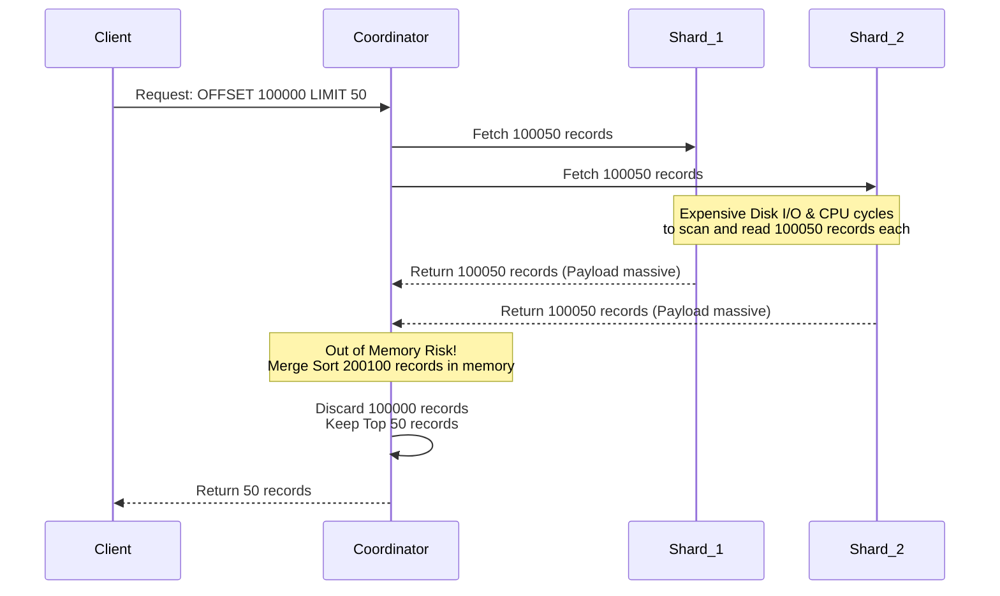

# Phân trang ở Quy mô Tỷ Bản ghi: Vì sao Keyset Pagination thắng Offset/Limit

## Tóm tắt điều hành

Phân trang (Pagination) nghe có vẻ là một tính năng tầm thường - ai chẳng biết cách hiển thị "trang 2, trang 3"? Nhưng khi tập dữ liệu vượt ngưỡng hàng tỷ bản ghi, câu lệnh SQL phân trang mà hầu hết chúng ta viết theo phản xạ sẽ bắt đầu bộc lộ vấn đề, và không phải kiểu chậm dần đều mà là sụp đổ hiệu năng đột ngột.

Bài viết này mổ xẻ hai chiến lược phân trang phổ biến nhất: **Offset/Limit** và **Keyset Pagination** (còn gọi là Seek Pagination). Chúng ta sẽ không dừng ở cú pháp SQL mà đi sâu vào cách hai cách tiếp cận này tương tác với cây B+Tree, với bộ nhớ đệm của hệ điều hành (Page Cache), và cả với vi kiến trúc CPU - L1/L2 Cache, Branch Prediction. Qua phân tích toán học và vi kiến trúc, bài viết sẽ chỉ ra tại sao Offset/Limit là quả bom hẹn giờ trong hệ thống phân tán, còn Keyset Pagination là cách giữ độ trễ gần như hằng số ($O(1)$) ngay cả khi dữ liệu phình to không giới hạn.

Nếu bạn là kỹ sư hệ thống, DBA hay kiến trúc sư phần mềm, sau bài viết này bạn sẽ hiểu rõ cơ chế nội tại của phân trang, biết vì sao "Deep Pagination Penalty" (hình phạt phân trang sâu) lại xảy ra, và có sẵn vài nguyên tắc thiết kế để áp dụng ngay cho hệ thống của mình.

---

## Vấn đề Cốt lõi

**Vấn đề nằm ở đâu?**
Hình dung bạn đang vận hành một hệ thống thương mại điện tử với hàng tỷ giao dịch. Một người dùng - hoặc một batch job nào đó - muốn xem "trang thứ 10.000" trong danh sách giao dịch. Backend của bạn, theo phản xạ, phát ra câu lệnh SQL rất quen thuộc:
`SELECT * FROM transactions ORDER BY created_at DESC OFFSET 100000 LIMIT 50;`

Ban đầu, khi dữ liệu còn ít, truy vấn này chạy trong 10ms, chẳng ai để ý. Nhưng khi hệ thống lớn lên, cùng một truy vấn ấy mất tới 10 giây, CPU của database server chạy kịch trần, và hàng loạt truy vấn khác bị treo theo. Đây chính là hiện tượng **Deep Pagination Penalty**.

Câu hỏi đáng đặt ra là: tại sao một truy vấn chỉ lấy về 50 dòng lại có thể đánh sập cả một cụm database? Câu trả lời nằm ở cách Offset/Limit vận hành - "đếm rồi vứt" - một mô hình đi ngược hoàn toàn với nguyên tắc cộng sinh phần cứng (mechanical sympathy).

---

## Giải phẫu Offset/Limit: Sự lãng phí không nhỏ

### Độ phức tạp Toán học và Thuật toán
Khi RDBMS nhận `OFFSET O LIMIT K`, nó không có cách nào "nhảy thẳng" tới vị trí $O$. Nó buộc phải duyệt qua chính xác $O + K$ bản ghi tính từ đầu, rồi âm thầm vứt bỏ $O$ bản ghi đầu tiên, chỉ giữ lại $K$ bản ghi cuối cùng để trả về.

Tổng thời gian thực thi $T_{offset}$ có dạng:

$$ T_{offset}(O, K) = C_{seek} \cdot \log_b(N) + C_{scan} \cdot \sum_{i=1}^{O+K} c_i $$

Chi phí $c_i$ cho mỗi bản ghi không hề rẻ - nó bao gồm đọc từ đĩa, giải nén (decompression), và kiểm tra điều kiện lọc (filtering).

### Buffer Pool Thrashing
Để đọc đủ $O + K$ bản ghi, database phải kéo toàn bộ các trang dữ liệu (data pages) chứa chúng từ SSD lên RAM. Với `OFFSET 1000000`, bạn có thể đang buộc database nạp cả gigabyte dữ liệu vào RAM chỉ để vứt đi ngay sau đó.

Lượng dữ liệu "rác" khổng lồ này kích hoạt thuật toán LRU (Least Recently Used), đẩy các trang dữ liệu "nóng" đang phục vụ các truy vấn quan trọng khác ra khỏi cache. Hiện tượng này gọi là **ô nhiễm bộ nhớ đệm (Cache Pollution)** - nó kéo tụt Cache Hit Ratio (CHR) của toàn hệ thống, buộc database đọc đĩa nhiều hơn, và cứ thế vòng lặp tệ hại này tự nuôi chính nó.

### Thảm họa trong Hệ thống Phân tán
Trong các kiến trúc sharding (Elasticsearch, Cassandra...), Offset/Limit biến thành cơn ác mộng thực sự. Có 10 shard và bạn gọi `OFFSET 100000 LIMIT 50`? Coordinator Node phải yêu cầu **mỗi** shard trả về 100.050 bản ghi. Sau đó Coordinator phải giữ $100.050 \times 10 = 1.000.500$ bản ghi trong RAM cùng lúc, chạy Merge-Sort, rồi vứt đi 1.000.000 dòng trong số đó. Không khó để thao tác này gây Out-Of-Memory hoặc kích hoạt một đợt GC Stop-The-World kéo dài.

---

## Kiến trúc Keyset Pagination: Lối thoát ở Quy mô Lớn

Keyset Pagination từ bỏ hẳn khái niệm "vị trí tuyệt đối" (offset). Thay vào đó, nó ghi nhớ trạng thái của bản ghi cuối cùng ở trang trước - ví dụ `last_id`, `last_timestamp` - rồi truyền giá trị đó vào truy vấn kế tiếp dưới dạng điều kiện `WHERE`.

`SELECT * FROM transactions WHERE (created_at, id) < (last_timestamp, last_id) ORDER BY created_at DESC, id DESC LIMIT 50;`

### Ưu thế của Cấu trúc Cây Tìm kiếm
Keyset Pagination tận dụng trực tiếp cấu trúc chỉ mục B+Tree. Thay vì đếm tuyến tính từng bản ghi, database thực hiện một thao tác **Index Seek** - tìm kiếm nhị phân trên cây - để "hạ cánh" thẳng vào bản ghi có giá trị bằng `(last_timestamp, last_id)`.

Độ phức tạp lúc này loại bỏ hoàn toàn yếu tố $O$:
$$ T_{keyset}(K) = C_{seek} \cdot \log_b(N) + C_{scan} \cdot K $$

Với $N = 1$ tỷ bản ghi, chiều cao B+Tree chỉ khoảng 3-4 tầng. Các tầng trên cùng (root/internal nodes) gần như luôn nằm sẵn trong L3 Cache. Vì vậy thao tác Seek tiêu tốn chưa tới vài micro-giây. Sau khi "hạ cánh", database chỉ cần trượt qua đúng $K$ (ví dụ 50) bản ghi tiếp theo trên các leaf node.

### Giải quyết Nút thắt trong Hệ thống Phân tán
Trong kiến trúc phân tán, khi dùng Keyset Pagination, Coordinator chỉ cần truyền cặp khóa `(last_timestamp, last_id)` xuống các shard. Mỗi shard thực hiện Index Seek cực nhanh và trả về đúng 50 bản ghi. Coordinator chỉ nhận $50 \times 10 = 500$ bản ghi, chạy Merge-Sort rồi trả kết quả. RAM và băng thông mạng tiêu thụ giảm đi hàng nghìn lần so với Offset/Limit.

---

## Tối ưu hóa Vi kiến trúc và Tương tác Phần cứng

Sự khác biệt giữa hai mô hình càng rõ rệt hơn khi nhìn qua lăng kính vi mạch CPU và hệ điều hành.

### Branch Prediction và Instruction Pipeline
Với Offset/Limit, vòng lặp `while` liên tục kiểm tra biến đếm `skipped < offset`. Khi phải lặp qua hàng trăm ngàn bản ghi bị vứt bỏ, bộ dự đoán rẽ nhánh (Branch Predictor) của CPU dễ bị nhiễu. Mỗi lần dự đoán sai, CPU phải xóa toàn bộ instruction pipeline, tốn thêm 15-20 chu kỳ xung nhịp cho một lần sai như vậy.

$$ T_{cpu\_cycles} = N_{instructions} \cdot CPI_{ideal} + N_{misses} \cdot Penalty_{cache\_miss} + N_{mispredicts} \cdot Penalty_{pipeline\_flush} $$

Với Keyset Pagination, vòng lặp trượt qua leaf node không chứa nhánh điều kiện loại bỏ nào cả. Nó chạy theo kiểu tuyến tính (straight-line execution), giữ cho pipeline CPU luôn no đủ việc và hoạt động gần ngưỡng IPC (Instructions Per Cycle) tối đa.

### TLB Thrashing và L1/L2 Cache
Khi Offset ép CPU nạp quá nhiều dữ liệu không cần dùng, các dữ liệu và lệnh hữu ích khác bị đẩy khỏi L1/L2 Cache. Tệ hơn, Translation Lookaside Buffer (TLB) cũng quá tải khi phải ánh xạ hàng trăm ngàn virtual page sang physical page, gây ra TLB Thrashing. Hệ quả là CPU phải nhờ OS kernel dò lại bảng trang (page walk), làm chậm cả hệ thống. Ngược lại, Keyset Pagination chỉ chạm tới $K$ bản ghi nhỏ, giữ TLB Hit Rate ở mức xấp xỉ 99,9%.

```mermaid
graph TD
    subgraph Offset/Limit Flow
        A1[Receive Offset O Limit K] --> B1[Seek to Start]
        B1 --> C1[Loop through O records]
        C1 --> D1[CPU Branch Predictor Fails]
        D1 --> E1[L1/L2 Cache Evicted Unnecessarily]
        E1 --> F1[Discard O records]
        F1 --> G1[Collect K records]
    end

    subgraph Keyset Pagination Flow
        A2[Receive Keys Limit K] --> B2[SIMD Binary Search on B-Tree Node]
        B2 --> C2[L1/L2 Cache Hit - High TLB Hit Rate]
        C2 --> D2[Direct Jump to Leaf Node Address]
        D2 --> E2[Collect exactly K records sequentially]
    end
```

### Độ trễ Hàng đợi NVMe và Hardware Prefetcher
Trên các cụm ổ NVMe, hàng ngàn yêu cầu DMA "rác" do Offset/Limit sinh ra sẽ làm nghẽn Queue Depth của controller đĩa. Keyset Pagination ngược lại là mô hình đọc tuyến tính rất thân thiện với phần cứng: nó cho phép Hardware Prefetcher của CPU và hệ điều hành đoán chính xác cache line nào sẽ được dùng tiếp theo, chủ động kéo dữ liệu lên trước khi thuật toán cần đến, gần như xóa sổ hiện tượng I/O memory stall.

---

## Bài học Rút ra từ Thực tiễn

Sau khi mổ xẻ cả hai mô hình, có vài nguyên tắc thiết kế đáng ghi nhớ:

1. **Tránh OFFSET lớn trên production.** Bất kỳ truy vấn nào có OFFSET vượt quá khoảng 10.000 đều tiềm ẩn rủi ro cho sự ổn định của hệ thống. Nếu giao diện người dùng yêu cầu "nhảy tới trang 100.000", nên cân nhắc lại UX (chuyển sang infinite scrolling dùng Keyset) hoặc dùng một hệ thống đánh chỉ mục riêng nếu thực sự cần đếm chính xác vị trí.
2. **Thiết kế covering index cho Keyset.** Keyset Pagination chỉ phát huy hết sức mạnh khi có một composite index khớp với cả tiêu chí ORDER BY lẫn điều kiện phân trang. Ví dụ: `CREATE INDEX idx_created_id ON transactions(created_at DESC, id DESC);`.
3. **Đảm bảo tính duy nhất cho khóa phân trang.** Lỗi thường gặp khi dùng Keyset là chỉ dựa vào một cột có giá trị trùng lặp (như `created_at`). Nếu 100 bản ghi cùng một `created_at`, thuật toán có thể bỏ sót dữ liệu. Luôn ghép thêm một cột duy nhất (như `id` hoặc `UUID`) làm điểm neo (tie-breaker).
4. **Miễn nhiễm với hiện tượng "dữ liệu bóng ma".** Với Offset, nếu có bản ghi mới được insert vào trang trước, toàn bộ các trang sau đó bị dịch chuyển, khiến người dùng thấy dữ liệu lặp lại hoặc bị bỏ sót. Keyset Pagination trỏ thẳng vào một node vật lý cụ thể trong không gian index, nên hoàn toàn tránh được lỗi data shifting này.

## Kết luận

Chọn chiến lược phân trang không đơn thuần là gõ vài dòng SQL khác nhau - nó phản ánh mức độ hiểu biết của người kỹ sư về cách phần mềm giao tiếp với lớp phần cứng bên dưới. Từ bỏ lối tư duy đếm tuyến tính của Offset/Limit và chuyển sang nguyên lý gọn gàng của Keyset Pagination không chỉ giúp hệ thống tránh khỏi những cú sập bất ngờ, mà còn giải phóng đáng kể năng lực tính toán sẵn có trên phần cứng hiện đại - điều cần thiết cho bất kỳ nền tảng nào muốn phục vụ hàng trăm triệu người dùng một cách trơn tru.

---
