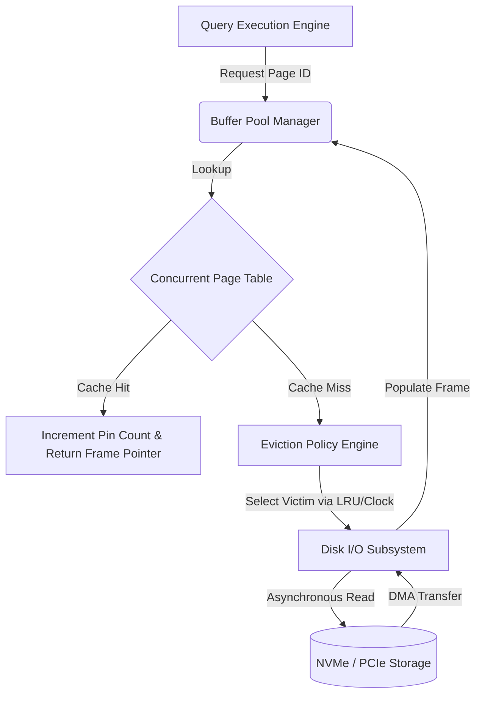
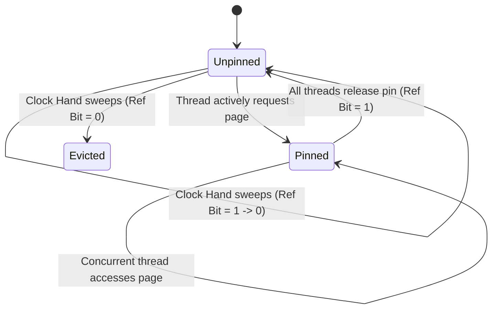

# バッファプール管理: キャッシュ置換の仕組みとハードウェアとの付き合い方

## エグゼクティブサマリーと核心課題

データ集約型アプリケーションのレイテンシをどこまで詰められるかは、結局のところバッファプールマネージャー(BPM)がどれだけうまく働くかにかかっている。永続的だが遅いセカンダリストレージと、揮発性だが速いメインメモリの間を取り持つ仲介役として、バッファプールはRDBMSや分散キーバリューストアのスループットと応答時間を左右する中核コンポーネントだ。

**核心的な問題は何か。** バッファプールが必要になる理由は、HDDやSSDといった不揮発性メディアの物理的な制約に行き着く。DRAMは50〜100ナノ秒程度でアクセスできるのに対し、NVMe SSDは数十マイクロ秒、HDDに至っては数ミリ秒かかる。CPUがサブナノ秒単位で命令を処理している環境で、ストレージメディアへ同期I/Oで直接アクセスすれば、パイプラインのストールは避けられない。アクティブなディスクブロックをメインメモリにキャッシュする仕組みがなければ、CPUは時間の大半をデータ待ちに費やすことになる。

この記事では、バッファプール管理をマイクロアーキテクチャのレベルまで掘り下げて整理する。物理メモリ構成、キャッシュヒット率を左右する数式、LRU・Clock Sweep・LRU-K・LIRSといった置換アルゴリズム、NUMAアーキテクチャ下での並行性制御、そして非同期ページクリーナーとWrite-Ahead Logging(WAL)の連携まで、一通り見ていく。

## 物理メモリとストレージ階層

バッファプールの役割を本当に理解するには、まずストレージ階層を押さえる必要がある。バッファプールは単なるキャッシュではなく、データの変更が実際に起きるアクティブな作業領域でもある。

### レイテンシのギャップ

CPUの処理速度とストレージへのアクセス時間の差は開く一方で、これが積極的なキャッシングを要求する根本原因になっている。10〜14 GB/sのスループットを謳うPCIe Gen 5 NVMeドライブが登場しても、NANDフラッシュの物理特性そのものがレイテンシの下限を決めてしまう。読み取りにはフローティングゲートトランジスタの電圧状態を検出する必要があり、書き込み(プログラム/消去サイクル)では量子トンネル効果を使って酸化膜層越しに電子を押し出す必要がある。こうした物理的な制約がある限り、セカンダリストレージはDRAMより何桁も遅いままだ。

### メモリ管理ユニット(MMU)とTLBスラッシング

バッファプールの物理的な構成は、OSの仮想メモリサブシステムとハードウェアのメモリ管理ユニット(MMU)に密接に結びついている。バッファプール自体は通常、システム起動時に大きな連続した仮想メモリ領域として確保され、論理的に「フレーム」と呼ばれる固定サイズのセグメント(データベースエンジンによって4KB、8KB、16KBなど)に分割される。これらのインメモリフレームは、セカンダリメディア上の対応する「ページ」と決定論的に対応付けられる。

Translation Lookaside Buffer(TLB)のスラッシングによる性能劣化を避けるため、OracleやPostgreSQLといった本格的なデータベースエンジンは、ハードウェアがサポートするHuge Pagesを使ってこの連続領域を割り当てる。2メガバイトや1ギガバイトのページサイズを使うことで、TLBがカバーできる範囲を大きく広げられる。標準の4KBページだと、1GBのバッファプールだけで262,144個のページテーブルエントリが必要になる。TLBが1,536エントリしか持てないなら、高並行のワークロードはTLBエントリを絶えず追い出し、CPUのページテーブルウォーカーがメモリ上の階層ページテーブルを走査する羽目になり、メモリアクセスのたびに数百ナノ秒が上乗せされる。2MBのHuge Pagesを使えば必要なエントリは512個に減り、最近のTLBの容量に十分収まるので、仮想アドレスから物理アドレスへの変換にかかるペナルティを最小限に抑えられる。

## バッファプールアーキテクチャの理論的基盤

クエリ実行エンジンが使う論理ページ識別子と、バッファフレームの物理メモリアドレスとの対応は、ページテーブルあるいはフレームマップと呼ばれる、高度に最適化されたデータ構造で管理されている。

マルチコアが激しく競合する環境でも定数時間$O(1)$のルックアップを実現するために、このマッピングには専用のコンカレントハッシュテーブルが使われることが多い。ロックフリーのチェイニングや、ロビンフッドハッシュを組み合わせたリニアプロービングを採用し、衝突による劣化を抑えつつキャッシュライン密度を保つ工夫がされている。



### 有効アクセス時間(EAT)の数式

バッファプールの効率を左右する数学的な指標が、キャッシュヒット率$h$だ。これは、要求されたページがすでにメインメモリのフレームにあり、セカンダリストレージへのページフォールトを避けられる確率として定義される。

ストレージサブシステム全体の有効アクセス時間(EAT)は次の式でモデル化できる。
$$EAT = h \cdot t_{mem} + (1 - h) \cdot (t_{mem} + t_{disk} + t_{overhead})$$

ここで:
* $t_{mem}$は非常に安定したDRAMアクセスレイテンシ(おおよそ50〜100ナノ秒)。
* $t_{disk}$は不揮発性ストレージからページフォールトを解決するレイテンシ(エンタープライズNVMe SSDで10マイクロ秒程度、機械式HDDなら数ミリ秒)。
* $t_{overhead}$はOSカーネルによるコンテキストスイッチ、DMAチャネルの設定、割り込み、NVMeのサブミッション/完了キュー処理などのオーバーヘッド。

$t_{disk}$が$t_{mem}$より何桁も大きく式全体を支配するので、キャッシュミスの割合$(1 - h)$を抑えることがエビクション戦略の最優先課題になる。ヒット率が99%から95%に下がるだけと聞くと大したことなさそうだが、$t_{disk}$が$100\mu s$、$t_{mem}$が$100ns$の場合、平均アクセス時間は$1.1\mu s$から$5.1\mu s$へと跳ね上がる。実に4.6倍の性能劣化だ。

### OSをバイパスするダイレクトI/O(`O_DIRECT`)

さらに、本格的なバッファプールマネージャーはOS自身のページキャッシュを意図的に迂回する。POSIX環境なら`O_DIRECT`フラグ、Windowsなら`FILE_FLAG_NO_BUFFERING`を使う、いわゆるダイレクトI/Oだ。

この迂回には理由がある。二重キャッシングによるメモリの無駄や、OSカーネルの汎用的なページ置換アルゴリズムによる予測しづらいエビクション挙動を避けるためだ。OSのページキャッシュは、データベースが実行するBツリー走査やテーブルスキャンのパターンを一切知らない汎用のヒューリスティックで動いている。メモリを自前で管理することで、データベースはメモリ上に何を残し何を追い出すかを自分自身でコントロールし続けられる。

## キャッシュエビクションポリシーのアルゴリズム比較

バッファプールが満杯になり、ディスクから新しいページを読み込む必要が出てきたら、バッファプールマネージャーは追い出す「被害者」フレームを選ばなければならない。被害者ページがダーティ(変更済み)であれば、フレームを再利用する前にディスクへフラッシュする必要がある。

### Strict Least Recently Used(LRU)

キャッシュエビクションの基本と言えるのがLRUポリシーだ。最近アクセスされたページは近い将来また参照される可能性が高い、という時間的局所性の仮定に基づいている。

教科書的なLRU実装では、定数時間でページからフレームを引けるハッシュマップと、アクセス順序を正確に維持する双方向連結リストを組み合わせた、状態を多く持つデータ構造が必要になる。ページへのアクセスが起きるたびに、対応するメタデータノードはリスト内の現在位置から切り離され、Most Recently Used(MRU)を表す先頭に再挿入される。

バッファプールが物理容量の上限に達すると、リストの末尾にあるフレーム — つまり文字通り最も長くアクセスされていない要素 — がエビクションの被害者として選ばれる。

**シーケンシャルフラッディング問題:**
標準的なガウス分布やジップの法則に従うアクセスパターンに対しては理論上うまく機能するLRUだが、*シーケンシャルフラッディング*と呼ばれる病的なケースには弱い。フルテーブルスキャン(分析系のOLAPクエリやインデックスなしのルックアップなど)では、クエリ実行計画がバッファプールの総フレーム容量を上回る量のページを連続して要求することがある。

この場合、厳密なLRUポリシーは、活発に使われているインデックスページを次々に追い出し、一度しか読まれず二度と必要にならないスキャン用のページのために場所を空けてしまう。結果としてキャッシュ全体が実質的にフラッシュされ、ヒット率がゼロに近づくという最悪の事態になる。加えて、読み取りのたびに双方向リストのポインタを書き換える必要があるため、マルチコア環境でのスケーラビリティにも深刻なボトルネックが生じる。リストの先頭・末尾ポインタはCPUのMESIキャッシュコヒーレンスプロトコル上で激しく競合するメモリ位置となり、キャッシュライン無効化とフォールスシェアリングを誘発しやすい。

### Clock Sweepアルゴリズム(Second Chance)

厳密なLRUの同期オーバーヘッドと理論上の弱点を避けるため、多くの現代的なデータベースはClock Sweepアルゴリズム(Second Chance置換ポリシーとも呼ばれる)を採用している。Clockは、スケーラブルでロックフリー志向のメカニズムを通じてLRUを数学的に近似したものだ。

バッファプールのフレームは論理的に循環バッファとして構成され、エビクションの仕組みは、フレームを順番に指しながら回り続ける時計の針としてモデル化される。各フレームのメタデータには、アトミックなブール値の参照ビットが1つ付いている。

スレッドがページにアクセスすると、バッファプールマネージャーはCompare-And-Swapや単純なアトミックストアといったアトミック命令で参照ビットをtrueにする。この操作はグローバルミューテックスの取得も複雑なポインタ操作も不要なので、並行に実行できる。

キャッシュミスによりエビクションが必要になると、時計の針は循環バッファを進んでいく。
1. 参照ビットがtrueのフレームに当たったら、そのビットをfalseにクリアして(ページに「セカンドチャンス」を与える)、次のフレームへ進む。
2. 参照ビットがすでにfalseのフレームに当たったら、そのフレームを即座にエビクションの被害者として選ぶ。



あるページ$P_i$が時計の針の1周を生き延びる確率は、針の掃引速度$V_{sweep}$に対するアクセス頻度$\lambda_i$の比に強く依存する。この生存確率は次のようにモデル化できる。
$$P(survival) = 1 - e^{-\lambda_i \cdot \frac{N}{V_{sweep}}}$$
ここで$N$は循環バッファ内のフレーム総数を表す。

### 発展形: LRU-K、LIRS、2Q

オーバーヘッドを抑えつつシーケンシャルフラッディングに対処するため、データベースはより洗練されたバリエーションを使うこともある。

1. **LRU-K**: 過去$K$回のアクセスタイムスタンプを記録し、より正確な到着間隔を計算する。後方K距離が最大のページをエビクトすることで、一時的なシーケンシャルリード(1回しか見ていないので後方K距離が無限大になる)と本当にホットなページをうまく区別できる。
2. **2Qアルゴリズム**: 1回しかアクセスされていないページ用のFIFOキューと、複数回アクセスされたページ用のLRUキューを分けて持つ。これによりスキャン系のトラフィックとトランザクション系のトラフィックがきれいに分離される。
3. **Clock-Pro**: LIRS(Low Inter-reference Recency Set)をClockの仕組みで近似したもの。ページを「コールド」「ホット」に分類し、最近エビクトしたページの履歴も保持することで、ワークロードの変化に動的に適応する。

```rust
// Advanced Clock Sweep pseudo-architecture utilizing atomic hardware primitives
use std::sync::atomic::{AtomicBool, AtomicUsize, Ordering};

pub struct FrameMetadata {
    pub page_id: Option<u64>,
    pub is_dirty: AtomicBool,
    pub pin_count: AtomicUsize,
}

pub struct HardwareOptimizedClockPool {
    capacity: usize,
    frames: Vec<FrameMetadata>,
    reference_bits: Vec<AtomicBool>,
    clock_hand: AtomicUsize,
}

impl HardwareOptimizedClockPool {
    pub fn execute_eviction_sweep(&self) -> Option<usize> {
        let mut algorithmic_iterations = 0;
        let theoretical_max_iterations = self.capacity * 2;
        
        while algorithmic_iterations < theoretical_max_iterations {
            // Relaxed ordering suffices for the monotonic clock hand advancement
            let current_position = self.clock_hand.fetch_add(1, Ordering::Relaxed) % self.capacity;
            
            // Immediately bypass frames pinned by active execution pipelines
            if self.frames[current_position].pin_count.load(Ordering::Acquire) > 0 {
                algorithmic_iterations += 1;
                continue;
            }
            
            // Interrogate and conditionally mutate the hardware reference bit
            if self.reference_bits[current_position].load(Ordering::Acquire) {
                // Execute Second Chance semantic: downgrade the reference status
                self.reference_bits[current_position].store(false, Ordering::Release);
            } else {
                // Ideal victim identified: Reference bit is logically false and pin count is absolute zero
                return Some(current_position);
            }
            algorithmic_iterations += 1;
        }
        None // Pathological exhaustion: Buffer pool is entirely saturated with pinned frames
    }
}
```

## 並行性制御とハードウェアを意識した最適化

NUMAマルチソケット構成で高性能なバッファプールマネージャーを実際に動かすには、並行性制御をかなり慎重に設計する必要がある。

### NUMA認識とシャーディング

バッファプール内部の複合的なデータ構造(巨大なフレームマップ、フリーリスト、エビクション用のメタデータなど)を粗粒度のOSミューテックスで保護してしまうと、コンボイ効果やスレッドの飢餓、CPUの使い残しが起きやすい。

数十から数百のCPUコアにわたって線形にスループットをスケールさせるには、バッファプールのアーキテクチャを完全に独立したセグメント(インスタンス)にシャーディングする必要がある。各インスタンスは、局所化されキャッシュアラインされたラッチによって個別に保護される。要求された論理ページ識別子をハッシュ化し、モジュロ演算やビットマスクでどのインスタンスがそのページを管理するかを決定論的に決める。これにより、メモリバスやNUMAノード間での同期競合を統計的に均等に分散できる。

### 細粒度ラッチングとキャッシュコヒーレンス

各インスタンスの内部では、高度に最適化された読み取り/書き込みラッチ(カスタムスピンロックやMCSロックのような厳密なキューイング機構など)がフレーム単位で配置され、ページの実データへの並行読み書きを調整する。

スレッドが構造的な変更のためにページを要求する場合は、フレームの排他書き込みラッチを取得する必要がある。逆に読み取り専用の操作は共有読み取りラッチを取得し、多数のリーダーが並行して動けるようにする。

こうしたソフトウェア定義のラッチと、ハードウェアのメモリ階層との相互作用は性能に直結する。Clock Sweepの参照ビット更新や、LRUリストのポインタ操作といったメタデータの更新は、64バイトや128バイトといったハードウェアキャッシュラインの境界にきちんと揃えて、*フォールスシェアリング*を避ける必要がある。フォールスシェアリングとは、同じ物理キャッシュライン上にある別々の変数を独立したスレッドが更新することで、QPI(Intel)やInfinity Fabric(AMD)のインターコネクト越しに高価なクロスコアL3キャッシュ無効化が連鎖する現象で、性能に無視できない影響を与える。

## 非同期I/O、ページフラッシング、WALとの連携

クエリ実行のレイテンシを予測可能な範囲に収めるには、エビクション処理自体をクエリ実行スレッドのクリティカルパスから切り離す必要がある。現代のバッファプールマネージャーは、専用の優先度の高いバックグラウンドスレッド — 一般に*非同期ページクリーナー*や*フラッシャー*と呼ばれる — を使う。

### バックグラウンドフラッシャーと`io_uring`

これらのスレッドはエビクション用のデータ構造を常時走査して、ダーティページ(メインメモリ上で変更されたが、まだセカンダリストレージに永続化されていないページ)を見つけ出す。最近のLinuxカーネルの`io_uring`やWindows NTのIOCP(Input/Output Completion Ports)といった非同期カーネルインターフェイスを使い、個々のI/O書き込みリクエストをバッチ処理してディスクへのフラッシュをパイプライン化する。この処理を経ることで、ページはクリーンな状態に変わり、突然のページフォールトが起きても即座にエビクトできるようになる。

### WALプロトコルとの整合

このバックグラウンドフラッシング処理は、データベースのWrite-Ahead Logging(WAL)プロトコルと厳密に同期している必要がある。データベースの耐久性の基本ルールは、単調増加するログシーケンス番号(LSN)で識別される対応するログレコードが永続ログファイルにフラッシュされたことを確認するまでは、ダーティページをセカンダリストレージにフラッシュしてはならない、というものだ。これによってACID特性が守られる。バッファプールマネージャーは、ダーティページの非同期書き込みを発行する前に、必ずWALのフラッシュ済みLSNを確認する必要がある。

### 適応型フラッシングのためのPIDコントローラー

バックグラウンドフラッシングの速度をどう最適化するかは、制御理論の観点でもなかなか難しい問題だ。フラッシュを積極的にやりすぎると、限られたディスクI/O帯域が飽和してフォアグラウンドのトランザクション性能が落ちる。逆に消極的すぎると、クリーンなフレームが足りなくなり、クエリを実行しているフォアグラウンドスレッドが、ページを読み込む前に同期的な書き込みI/Oを強いられ、大きく予測しづらいレイテンシスパイクが発生する。

これを解決するために、バックグラウンドフラッシャーの制御ループにはしばしばPID(比例・積分・微分)コントローラーが使われる。クリーンページの不足量$E_{clean}(t) = N_{target} - N_{current}$を基準に、連続的なフラッシュ速度$V_{flush}(t)$を動的に調整する。

この制御関数は次のように表せる。
$$V_{flush}(t) = K_p E_{clean}(t) + K_i \int_{0}^{t} E_{clean}(\tau) d\tau + K_d \frac{d E_{clean}(t)}{dt}$$
ここで$K_p$、$K_i$、$K_d$は、経験的あるいは機械学習ベースのヒューリスティックで調整される比例・積分・微分係数だ。こうした制御理論に基づくI/Oスケジューリングにより、バッファプールは変動の激しいバースト性ワークロードの下でも安定した応答性を保てる。

## 学んだ教訓とベストプラクティス

データ集約型アプリケーションを設計する側にとっても、本番のデータベースサーバーをチューニングする側にとっても、バッファプールの挙動からはいくつか実用的な教訓が得られる。

1. **メモリ割り当てがすべてを決める**: バッファプールのサイズ(MySQLの`innodb_buffer_pool_size`やPostgreSQLの`shared_buffers`など)をただ増やすだけでは、エビクションポリシー自体に問題があれば効果が頭打ちになる。とはいえ、アクティブなワーキングセットに見合うサイズを設定することは、データベースチューニングの中でも特に効果の大きい一手であることに変わりはない。
2. **シーケンシャルフラッドに注意する**: 分析クエリを書くときは、フルテーブルスキャンがバッファプールにどう影響するかを意識しておく必要がある。データベースがスキャントラフィックを分離しない設計だと、インデックスなしの大きな`SELECT *`一発でトランザクション用キャッシュが丸ごと追い出され、システムが止まりかねない。
3. **Huge Pagesは軽視できない**: 数ギガバイトを超えるバッファプールでは、OSレベルのHuge Pagesを有効にするかどうかで話が変わってくる。TLBミスが大きく減り、ページテーブルウォークに費やされるCPUサイクルを節約できる。
4. **シャーディングで競合を減らす**: 数十コア規模の高並行環境では、バッファプールインスタンスを複数構成することで、ハッシュテーブルやフリーリストでのラッチ競合が減り、ほぼ線形に近いスケーラビリティが得られる。
5. **決定論を保つためのダイレクトI/O**: データベースファイルの扱いをOSページキャッシュに委ねると、予測しづらい仲介者を一つ増やすことになる。ダイレクトI/O(`O_DIRECT`)を使えば、データベースエンジン自身がドメイン固有のエビクションロジックを適用し、I/Oスケジューリングを自分の手で制御できる。

## 結論

バッファプールマネージャーは、アルゴリズムの複雑さとハードウェアの制約、並行性理論がぶつかり合う場所に位置するシステムエンジニアリングの一分野だ。LRU-KやClock近似の数学的な工夫から、キャッシュコヒーレンス・フォールスシェアリング・NUMAアーキテクチャといった低レベルの現実まで、バッファプール管理のあらゆる側面がデータ検索のレイテンシを削るためにチューニングされている。こうしたマイクロアーキテクチャの知識を押さえておくことで、データベースの抽象化レイヤーの下側を覗き込み、性能異常の原因を突き止め、現代のストレージハードウェアの物理的な限界に近いところまでシステムを設計できるようになる。

---
