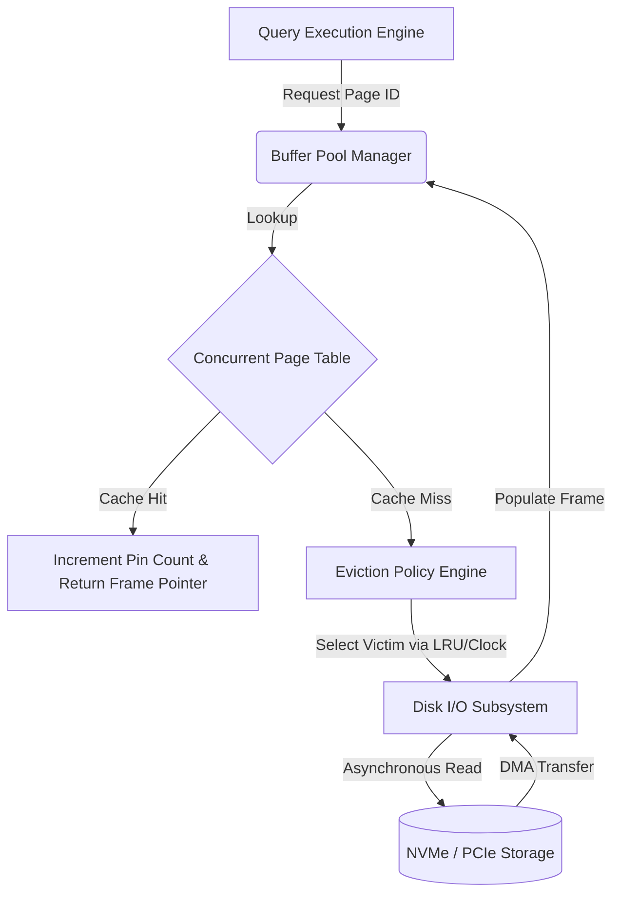
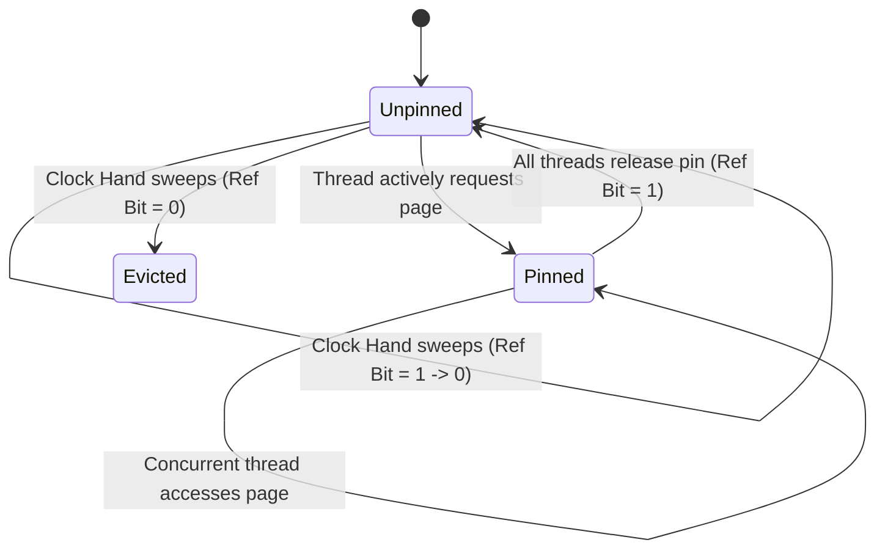

# Quản lý Buffer Pool: Cách Cache Eviction và Bộ nhớ Vật lý Quyết định Hiệu năng Database

## Tóm tắt và Vấn đề Cốt lõi

Muốn giảm độ trễ truy xuất dữ liệu trong các ứng dụng nặng về dữ liệu, gần như lúc nào bạn cũng phải quay lại một điểm: buffer pool manager (BPM) đang vận hành tốt tới đâu. Đóng vai trò trung gian giữa tầng lưu trữ thứ cấp - bền vững nhưng chậm - và bộ nhớ chính - dễ bay hơi nhưng nhanh, buffer pool là thành phần kiến trúc quyết định thông lượng và thời gian phản hồi của cả RDBMS lẫn các kho key-value phân tán. Việc quản lý buffer pool hiệu quả, vì thế, không phải là chi tiết vặt vãnh mà là nền tảng của hiệu năng hệ thống.

**Vấn đề cốt lõi nằm ở đâu?** Buffer pool tồn tại vì những giới hạn cơ học và điện tử khá nghiệt ngã của các công nghệ lưu trữ non-volatile như HDD và SSD. DRAM có độ trễ khoảng 50-100 nano giây, trong khi SSD NVMe phản hồi trong hàng chục micro giây, còn HDD thì mất vài mili giây - chênh nhau cả ngàn lần. Trong khi đó CPU thực thi lệnh ở mức dưới nano giây. Nếu để I/O đồng bộ chạm thẳng vào thiết bị lưu trữ vật lý, pipeline của CPU sẽ bị đình trệ liên tục. Không có một lớp trừu tượng chủ động cache các khối đĩa đang hoạt động vào bộ nhớ chính, CPU sẽ dành phần lớn thời gian - có khi hơn 99% - chỉ để chờ dữ liệu.

Bài viết này đi sâu vào quản lý buffer pool ở mức vi kiến trúc: cách tổ chức bộ nhớ vật lý, công thức toán học chi phối tỷ lệ cache hit, các thuật toán thay thế cache (LRU, Clock Sweep, LRU-K, LIRS), cơ chế kiểm soát đồng thời trên kiến trúc NUMA, và cách các background page cleaner phối hợp với Write-Ahead Logging (WAL).

## Bộ nhớ Vật lý và Phân tầng Lưu trữ

Để hiểu đúng vai trò của buffer pool, cần hiểu cấu trúc phân tầng lưu trữ trước. Buffer pool không đơn thuần là một lớp cache - nó là không gian làm việc thực sự, nơi dữ liệu bị thay đổi (mutate) trực tiếp.

### Khoảng cách Độ trễ

Khoảng cách giữa tốc độ xử lý của CPU và thời gian truy cập lưu trữ ngày càng nới rộng, và đó chính là lý do buộc phải caching tích cực. Ngay cả ổ PCIe Gen 5 NVMe với thông lượng 10-14 GB/s cũng không thoát khỏi giới hạn vật lý của bộ nhớ flash NAND. Đọc dữ liệu đòi hỏi cảm biến trạng thái điện áp của các floating gate transistor; ghi dữ liệu (chu kỳ program/erase) đòi hỏi đẩy electron xuyên qua lớp oxit bằng hiệu ứng đường hầm lượng tử. Những ràng buộc vật lý này khiến bộ nhớ thứ cấp luôn chậm hơn DRAM nhiều bậc độ lớn, không có cách nào khác.

### Memory Management Unit (MMU) và TLB Thrashing

Cách buffer pool được tổ chức vật lý gắn chặt với hệ thống con bộ nhớ ảo của hệ điều hành và MMU của phần cứng. Buffer pool thường được cấp phát trước khi hệ thống khởi động, dưới dạng một khối bộ nhớ ảo liên tục lớn, chia thành các "frame" kích thước cố định (4KB, 8KB hoặc 16KB tùy engine). Các frame này ánh xạ tất định tới các "page" tương ứng trên thiết bị lưu trữ thứ cấp.

Để tránh hiện tượng TLB (Translation Lookaside Buffer) thrashing làm sập hiệu năng, các database engine lớn như Oracle hay PostgreSQL cấp phát vùng nhớ liên tục này bằng Huge Pages do phần cứng hỗ trợ. Dùng page size 2MB hoặc 1GB giúp mở rộng đáng kể phạm vi bao phủ của TLB. Với page 4KB tiêu chuẩn, một buffer pool 1GB cần tới 262.144 mục trong page table. Nếu TLB chỉ chứa được 1.536 mục, một workload đồng thời cao sẽ liên tục đẩy các mục TLB ra ngoài, buộc page table walker của CPU phải dò lại bảng phân trang nhiều tầng trong bộ nhớ, cộng thêm hàng trăm nano giây cho mỗi lần truy cập. Chuyển sang Huge Pages 2MB, số mục cần thiết giảm còn 512 - vừa đủ nằm gọn trong giới hạn TLB hiện đại, giảm hẳn chi phí của việc chuyển đổi địa chỉ ảo sang vật lý.

## Nền tảng Lý thuyết của Kiến trúc Buffer Pool

Việc chuyển đổi giữa mã định danh trang logic - thứ mà execution engine dùng khi xử lý truy vấn - và địa chỉ bộ nhớ vật lý của buffer frame được duy trì qua một cấu trúc dữ liệu tối ưu cao, gọi là page table hay frame map.

Để đạt độ phức tạp tra cứu hằng số $O(1)$ ngay cả dưới áp lực đồng thời đa lõi cực lớn, việc ánh xạ này thường dùng concurrent hash table chuyên dụng. Các bảng này hay dùng lock-free chaining, hoặc linear probing kết hợp Robin Hood hashing, để giảm suy thoái do va chạm và giữ mật độ cache line tối ưu.



### Toán học của Effective Access Time (EAT)

Hiệu quả của buffer pool được đo bằng tỷ lệ cache hit $h$ - xác suất trang được yêu cầu đã nằm sẵn trong một frame của bộ nhớ chính, tránh được page fault xuống secondary storage.

Effective Access Time (EAT) của toàn bộ hệ thống con lưu trữ có thể mô hình hóa bằng:
$$EAT = h \cdot t_{mem} + (1 - h) \cdot (t_{mem} + t_{disk} + t_{overhead})$$

Trong đó:
* $t_{mem}$ là độ trễ truy cập DRAM, khá ổn định (thường 50-100 nano giây).
* $t_{disk}$ là độ trễ giải quyết một page fault từ thiết bị lưu trữ non-volatile (khoảng 10 micro giây với SSD NVMe doanh nghiệp, tới vài mili giây với HDD).
* $t_{overhead}$ gồm chi phí chuyển ngữ cảnh, thiết lập kênh DMA, ngắt, và xử lý hàng đợi submission/completion của NVMe do kernel đảm nhiệm.

Vì $t_{disk}$ lớn hơn $t_{mem}$ nhiều bậc và gần như chi phối toàn bộ phương trình, việc giảm tỷ lệ cache miss $(1 - h)$ trở thành mục tiêu quan trọng nhất của mọi chiến lược eviction. Nghe có vẻ tỷ lệ hit giảm từ 99% xuống 95% không đáng kể, nhưng nếu $t_{disk} = 100\mu s$ và $t_{mem} = 100ns$, thời gian truy cập trung bình nhảy từ $1.1\mu s$ lên $5.1\mu s$ - chậm đi 4.6 lần.

### Bỏ qua Hệ điều hành: Direct I/O (`O_DIRECT`)

Các buffer pool manager nghiêm túc thường bỏ qua hẳn page cache riêng của hệ điều hành - kỹ thuật gọi là Direct I/O, dùng cờ `O_DIRECT` trên POSIX hoặc `FILE_FLAG_NO_BUFFERING` trên Windows.

Việc né tránh này có lý do rõ ràng: tránh caching trùng lặp (lãng phí bộ nhớ do double buffering) và tránh hành vi eviction khó đoán của các thuật toán thay thế trang tổng quát trong kernel. OS page cache dùng heuristic chung chung, không hề biết gì về mẫu duyệt B-Tree hay ngữ nghĩa quét bảng quan hệ mà database engine đang thực hiện. Bằng cách tự quản lý bộ nhớ, database giữ được quyền kiểm soát tất định với việc gì ở lại trong bộ nhớ, việc gì bị đẩy ra.

## Phân tích các Chính sách Cache Eviction

Khi buffer pool đã đầy và cần đọc một trang mới từ đĩa, buffer pool manager phải chọn ra một frame "nạn nhân" để trục xuất. Nếu trang đó dirty (đã bị sửa), nó phải được flush xuống đĩa trước khi frame được tái sử dụng.

### Strict Least Recently Used (LRU)

Thuật toán nền tảng nhất trong cache eviction là LRU. Nó dựa trên giả định rằng trang vừa được truy cập gần đây có xác suất cao sẽ được truy cập lại trong tương lai gần - tính cục bộ thời gian (temporal locality).

Cài đặt LRU theo sách giáo khoa cần một cấu trúc dữ liệu khá nặng: hash map để tra cứu page-to-frame trong thời gian hằng số, kết hợp doubly linked list để giữ đúng thứ tự thời gian của các lần truy cập. Mỗi khi một trang được truy cập, node metadata tương ứng phải bị tách khỏi vị trí hiện tại trong danh sách và chèn lại vào đầu danh sách - vị trí Most Recently Used (MRU).

Khi buffer pool chạm ngưỡng dung lượng, frame ở cuối danh sách - phần tử thực sự ít được dùng nhất - sẽ bị chọn làm nạn nhân eviction ngay lập tức.

**Vấn đề Sequential Flooding:**
LRU hoạt động khá tốt với các mẫu truy cập theo phân phối Gaussian hay Zipfian thông thường, nhưng lại rất dễ tổn thương trước một kiểu lỗi gọi là *sequential flooding*. Khi quét toàn bộ bảng (full table scan) - ví dụ trong các truy vấn OLAP phân tích hay lookup không có index - kế hoạch thực thi truy vấn có thể yêu cầu một chuỗi trang liên tục vượt quá tổng dung lượng frame của buffer pool.

Trong tình huống này, LRU nghiêm ngặt sẽ trục xuất các trang index đang hoạt động tích cực để nhường chỗ cho các trang scan chỉ đọc một lần rồi không bao giờ cần lại. Kết quả là gần như toàn bộ cache bị flush sạch, tỷ lệ cache hit rơi về gần zero. Thêm vào đó, việc phải thay đổi con trỏ trong doubly linked list ở mỗi lần đọc gây ra nút thắt cổ chai nghiêm trọng khi mở rộng đa lõi. Con trỏ head và tail của danh sách trở thành điểm tranh chấp bộ nhớ nóng, chịu vô hiệu hóa cache line liên tục và false sharing trong giao thức MESI của CPU.

### Thuật toán Clock Sweep (Second Chance)

Để tránh chi phí đồng bộ hóa đắt đỏ và các điểm yếu lý thuyết của LRU nghiêm ngặt, phần lớn kiến trúc database hiện đại chọn Clock Sweep - còn gọi là chính sách Second Chance. Clock xấp xỉ LRU bằng một cơ chế lock-free có khả năng mở rộng tốt hơn nhiều.

Các frame của buffer pool được tổ chức như một circular buffer, và cơ chế eviction được mô hình hóa như một kim đồng hồ quay liên tục qua từng frame. Mỗi frame có thêm một reference bit dạng boolean, atomic.

Khi một thread truy cập một trang, buffer pool manager chỉ cần thực thi một lệnh phần cứng atomic (Compare-And-Swap hoặc atomic store đơn giản) để đặt reference bit thành true. Thao tác này chạy song song được, không cần giữ mutex toàn cục hay sửa cấu trúc con trỏ phức tạp nào.

Khi một cache miss cần eviction, kim đồng hồ tiến dần qua circular buffer:
1. Nếu gặp frame có reference bit true, nó xóa bit về false (coi như cho trang đó "cơ hội thứ hai") rồi tiến tiếp.
2. Nếu gặp frame có reference bit đã là false, frame đó lập tức được chọn làm nạn nhân eviction.



Xác suất một trang $P_i$ sống sót qua trọn một vòng quay của kim đồng hồ phụ thuộc vào tần suất truy cập $\lambda_i$ so với tốc độ quét $V_{sweep}$. Hàm xác suất sống sót có thể mô hình hóa như sau:
$$P(survival) = 1 - e^{-\lambda_i \cdot \frac{N}{V_{sweep}}}$$
với $N$ là tổng số frame vật lý trong circular buffer.

### Các biến thể nâng cao: LRU-K, LIRS, và 2Q

Để chống sequential flooding mà vẫn giữ chi phí thấp, các database còn dùng những biến thể phức tạp hơn:

1. **LRU-K**: theo dõi dấu thời gian của $K$ lần truy cập gần nhất để tính khoảng cách xuất hiện chính xác hơn. Bằng cách evict trang có backward K-distance lớn nhất, LRU-K phân biệt tốt giữa một lượt sequential read nhất thời (có backward K-distance vô cực vì chỉ mới thấy một lần) và một trang thực sự "hot".
2. **Thuật toán 2Q**: dùng hai hàng đợi riêng biệt - một FIFO queue cho các trang chỉ truy cập một lần, một LRU queue cho các trang truy cập nhiều lần. Nhờ đó lưu lượng scan và lưu lượng giao dịch "hot" được tách bạch hoàn toàn.
3. **Clock-Pro**: xấp xỉ thuật toán LIRS (Low Inter-reference Recency Set) bằng mô hình Clock, phân loại trang thành "cold" hoặc "hot", đồng thời giữ lịch sử các trang vừa bị evict để thích ứng động với workload thay đổi.

```rust
// Advanced Clock Sweep pseudo-architecture utilizing atomic hardware primitives
use std::sync::atomic::{AtomicBool, AtomicUsize, Ordering};

pub struct FrameMetadata {
    pub page_id: Option<u64>,
    pub is_dirty: AtomicBool,
    pub pin_count: AtomicUsize,
}

pub struct HardwareOptimizedClockPool {
    capacity: usize,
    frames: Vec<FrameMetadata>,
    reference_bits: Vec<AtomicBool>,
    clock_hand: AtomicUsize,
}

impl HardwareOptimizedClockPool {
    pub fn execute_eviction_sweep(&self) -> Option<usize> {
        let mut algorithmic_iterations = 0;
        let theoretical_max_iterations = self.capacity * 2;
        
        while algorithmic_iterations < theoretical_max_iterations {
            // Relaxed ordering suffices for the monotonic clock hand advancement
            let current_position = self.clock_hand.fetch_add(1, Ordering::Relaxed) % self.capacity;
            
            // Immediately bypass frames pinned by active execution pipelines
            if self.frames[current_position].pin_count.load(Ordering::Acquire) > 0 {
                algorithmic_iterations += 1;
                continue;
            }
            
            // Interrogate and conditionally mutate the hardware reference bit
            if self.reference_bits[current_position].load(Ordering::Acquire) {
                // Execute Second Chance semantic: downgrade the reference status
                self.reference_bits[current_position].store(false, Ordering::Release);
            } else {
                // Ideal victim identified: Reference bit is logically false and pin count is absolute zero
                return Some(current_position);
            }
            algorithmic_iterations += 1;
        }
        None // Pathological exhaustion: Buffer pool is entirely saturated with pinned frames
    }
}
```

## Kiểm soát Đồng thời và Tối ưu hóa theo Phần cứng

Triển khai một buffer pool manager hiệu năng cao trên kiến trúc NUMA đa socket đòi hỏi phải rất cẩn trọng với kiểm soát đồng thời.

### Nhận biết NUMA và Sharding

Nếu bảo vệ các cấu trúc dữ liệu phức hợp bên trong buffer pool - frame map khổng lồ, free list, metadata eviction theo thời gian - bằng một mutex toàn cục thô (coarse-grained) của hệ điều hành, gần như chắc chắn sẽ gặp hiệu ứng convoy, thread bị đói tài nguyên hàng loạt, và CPU không được tận dụng hết.

Để có thông lượng mở rộng gần như tuyến tính trên hàng chục hay hàng trăm core CPU, kiến trúc buffer pool cần được chia (sharding) thành các phân đoạn hoàn toàn độc lập. Mỗi phân đoạn được bảo vệ riêng bởi một latch cục bộ, căn chỉnh theo cache line. Mã định danh trang logic được yêu cầu sẽ được băm, rồi qua phép modulo hoặc bit-masking để xác định phân đoạn nào quản lý trang đó - qua đó phân tán đều sự tranh chấp đồng bộ hóa trên các memory bus và NUMA node.

### Fine-Grained Latching và Cache Coherence

Bên trong mỗi phân đoạn, các read-write latch được tối ưu kỹ (spinlock tùy biến, hoặc cơ chế khóa hàng đợi chặt như MCS lock) được đặt ở mức từng frame riêng lẻ, điều phối việc đọc/ghi đồng thời trên dữ liệu thực của trang.

Khi một thread cần thay đổi cấu trúc của một trang, nó phải giành được write latch độc quyền trên frame đó; ngược lại, các thao tác chỉ đọc dùng shared read latch, cho phép nhiều reader chạy song song.

Sự tương tác giữa các latch phần mềm này với tầng bộ nhớ vật lý bên dưới ảnh hưởng trực tiếp tới hiệu năng. Cập nhật metadata - như sửa reference bit trong Clock Sweep, hay chỉnh con trỏ trong danh sách LRU - cần được căn chỉnh đúng theo cache line phần cứng (64 byte hoặc 128 byte) để tránh *false sharing*. False sharing là hiện tượng khi các thread độc lập sửa các biến khác nhau nhưng cùng nằm trên một cache line vật lý, khiến L3 cache liên tục bị vô hiệu hóa chéo lõi qua interconnect QPI (Intel) hay Infinity Fabric (AMD) - một chi phí dễ bị bỏ qua nhưng ảnh hưởng rất thật tới hiệu năng.

## I/O Bất đồng bộ, Page Flushing, và Tích hợp WAL

Để đảm bảo truy vấn chạy với độ trễ có thể đoán trước ở mức micro giây, quá trình eviction cần được tách hẳn khỏi critical path của thread đang chạy truy vấn. Các buffer pool manager hiện đại dùng các background thread ưu tiên cao chuyên trách - thường gọi là *asynchronous page cleaner* hay *flusher*.

### Background Flusher và `io_uring`

Các thread này liên tục quét cấu trúc dữ liệu eviction để tìm dirty page - những trang đã bị sửa trong bộ nhớ chính nhưng chưa được ghi xuống lưu trữ thứ cấp. Chúng tận dụng các interface kernel bất đồng bộ hiện đại như `io_uring` trên Linux hay IOCP (Input/Output Completion Ports) trên Windows NT để gom nhiều yêu cầu ghi I/O thành batch, pipeline hóa việc flush dirty page xuống đĩa. Sau bước này, các trang trở nên "sạch" và có thể bị evict ngay lập tức khi cần, không phải chờ ghi đồng bộ.

### Tuân thủ Giao thức WAL

Cơ chế background flushing này phải đồng bộ chặt chẽ với giao thức Write-Ahead Logging (WAL) của database. Nguyên tắc cơ bản của durability là: một dirty page không bao giờ được flush xuống lưu trữ thứ cấp trước khi log record tương ứng - xác định bởi Log Sequence Number (LSN) tăng đơn điệu - đã được xác nhận ghi vào log file bền vững. Đây là điều kiện tiên quyết để đảm bảo các thuộc tính ACID. Buffer pool manager luôn phải kiểm tra LSN đã flush của WAL trước khi phát lệnh ghi bất đồng bộ cho dirty page.

### Bộ điều khiển PID cho Flushing Thích ứng

Tối ưu tốc độ background flushing là một bài toán lý thuyết điều khiển khá phức tạp. Flush quá gắt sẽ làm bão hòa băng thông disk I/O vốn có hạn, kéo tụt hiệu năng giao dịch ở foreground. Flush quá lơi lại khiến clean frame cạn kiệt, buộc thread đang chạy truy vấn phải chờ ghi I/O đồng bộ trước khi load được trang cần dùng, gây ra những đợt tăng độ trễ khó lường.

Để giải quyết, control loop điều khiển background flusher thường dùng bộ điều khiển PID (Proportional-Integral-Derivative), tính toán và điều chỉnh động tốc độ flush $V_{flush}(t)$ dựa trên độ thiếu hụt clean page hiện tại $E_{clean}(t) = N_{target} - N_{current}$.

Hàm điều khiển liên tục này biểu diễn như sau:
$$V_{flush}(t) = K_p E_{clean}(t) + K_i \int_{0}^{t} E_{clean}(\tau) d\tau + K_d \frac{d E_{clean}(t)}{dt}$$
trong đó $K_p$, $K_i$, $K_d$ là các hệ số tỷ lệ, tích phân, vi phân, được tinh chỉnh thực nghiệm hoặc điều chỉnh động qua heuristic machine learning. Cách tiếp cận dựa trên lý thuyết điều khiển này giúp buffer pool giữ được độ ổn định và khả năng phản hồi tốt ngay cả khi workload biến động mạnh và có tính bùng nổ (bursty).

## Bài học Rút ra và Kinh nghiệm Thực tiễn

Với các kỹ sư đang thiết kế ứng dụng nặng dữ liệu hay tinh chỉnh máy chủ database production, hành vi của buffer pool để lại vài bài học đáng nhớ:

1. **Cấp phát bộ nhớ là yếu tố quan trọng nhất.** Chỉ tăng kích thước buffer pool (như `innodb_buffer_pool_size` của MySQL hay `shared_buffers` của PostgreSQL) sẽ nhanh chóng gặp hiệu quả giảm dần nếu chính sách eviction có vấn đề. Nhưng định cỡ đúng theo working set đang hoạt động vẫn là tham số tinh chỉnh có ảnh hưởng lớn nhất trong quản trị database.
2. **Cẩn trọng với sequential flood.** Khi viết truy vấn phân tích, cần ý thức rõ full table scan sẽ ảnh hưởng thế nào tới buffer pool. Nếu database không tách riêng scan traffic, một câu `SELECT *` không có index có thể evict sạch transactional cache và khiến hệ thống đứng hình.
3. **Huge Pages đáng để đầu tư.** Với buffer pool cỡ vài gigabyte trở lên, bật Huge Pages ở cấp OS gần như là điều bắt buộc. Nó giảm mạnh TLB miss và tiết kiệm lượng lớn CPU cycle vốn sẽ bị tiêu tốn cho page table walk.
4. **Sharding giúp giảm tranh chấp.** Trong môi trường đồng thời cao với hàng chục CPU core, cấu hình nhiều buffer pool instance sẽ giảm latch contention trên hash table và free list, cho khả năng mở rộng gần như tuyến tính.
5. **Direct I/O cho tính tất định.** Phụ thuộc vào OS page cache cho file database nghĩa là chấp nhận một lớp trung gian khó đoán. Direct I/O (`O_DIRECT`) buộc database engine tự chịu trách nhiệm, áp dụng logic eviction riêng phù hợp với đặc thù của mình và kiểm soát chặt việc lập lịch I/O.

## Kết luận

Buffer pool manager là nơi giao thoa giữa độ phức tạp thuật toán, giới hạn phần cứng, và lý thuyết đồng thời - một bài toán kỹ thuật hệ thống không hề đơn giản. Từ những chi tiết toán học của LRU-K và các phép xấp xỉ Clock, cho tới thực tế khắc nghiệt của cache coherence, false sharing và kiến trúc NUMA, mọi khía cạnh của việc quản lý buffer pool đều nhắm tới một mục tiêu: cắt giảm từng nano giây trong quá trình truy xuất dữ liệu. Nắm được các khái niệm vi kiến trúc này giúp kỹ sư nhìn xuyên qua lớp trừu tượng của database, chẩn đoán được các bất thường hiệu năng nghiêm trọng, và thiết kế hệ thống khai thác gần tới giới hạn vật lý của phần cứng lưu trữ hiện đại.

---
