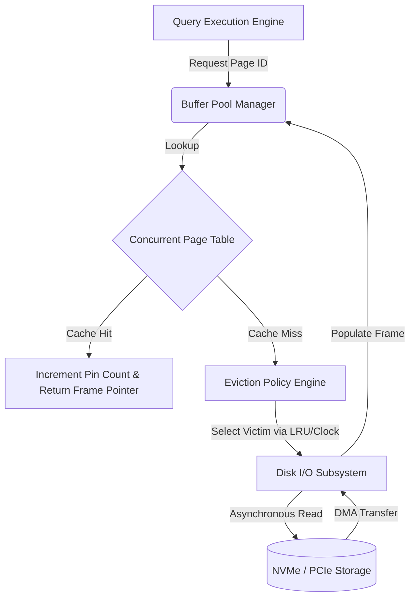
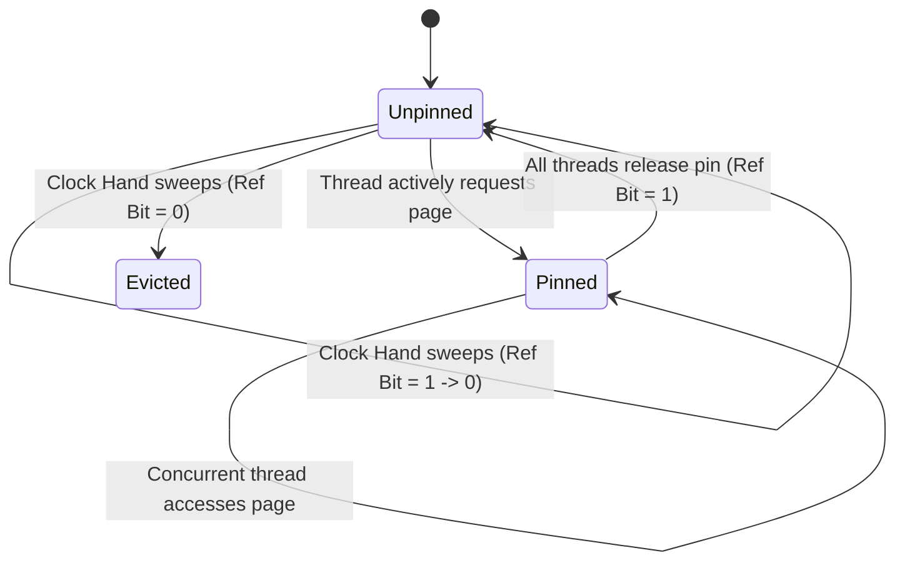

# Buffer Pool Management: Cache Eviction, Memory Subsystem Interactions, and Concurrency Control

---
seo_title: "Buffer Pool Management: Database Cache Eviction Explained"
seo_description: "A deep dive into buffer pool management database internals: LRU, Clock Sweep, NUMA sharding, latching, and WAL-aware page flushing."
focus_keyword: "buffer pool management database"
---

## The Core Problem: Why Databases Need a Buffer Pool

Buffer pool management is the discipline that lets a database hide the gap between fast CPUs and slow disks — and almost every performance property a relational database or key-value store exhibits traces back to how well its buffer pool manager (BPM) does this job. Sitting between the persistent-but-slow secondary storage tier and the volatile-but-fast main memory, the buffer pool is the piece of architecture that determines throughput and response time more than almost anything else in the system.

**Why it exists:** DRAM answers in 50–100 nanoseconds. An NVMe SSD answers in tens of microseconds. A spinning HDD answers in single-digit milliseconds. Meanwhile a modern CPU retires instructions on sub-nanosecond timescales. If every read had to go straight to disk, the CPU would spend the overwhelming majority of its time simply waiting — over 99% of it, in practice — for data to arrive. A buffer pool exists to keep the working set of "hot" pages in memory so the CPU rarely has to wait at all.

This article works through buffer pool management from the ground up: physical memory layout, the math behind cache hit ratios, the eviction algorithms that decide what stays and what goes (LRU, Clock Sweep, LRU-K, LIRS), how concurrency control behaves on NUMA hardware, and how background page cleaners stay in lockstep with Write-Ahead Logging.

## Physical Memory and Storage Tiering

To understand what a buffer pool actually does, it helps to think of it less as a cache and more as an active workspace — the place where in-flight data mutations actually happen, not just a holding area for read-only copies.

### The Latency Gap

The gap between CPU speed and storage speed keeps widening, and that's exactly why caching has to be aggressive rather than incidental. Even PCIe Gen 5 NVMe drives, capable of 10–14 GB/s of throughput, are bound by the physics of NAND flash: reads require sensing the voltage state of a floating-gate transistor, and writes require pushing electrons through an oxide layer via quantum tunneling. No amount of engineering removes that latency floor — secondary storage will keep being orders of magnitude slower than DRAM for the foreseeable future.

### Memory Management Units and TLB Thrashing

How a buffer pool is laid out in memory is inseparable from the operating system's virtual memory subsystem and the CPU's memory management unit (MMU). Most engines pre-allocate the buffer pool at startup as one large, contiguous block of virtual memory, then logically slice it into fixed-size "frames" — typically 4KB, 8KB, or 16KB depending on the engine. Each frame maps deterministically to a page on disk.

One problem shows up quickly at scale: Translation Lookaside Buffer (TLB) thrashing. Engines like Oracle and PostgreSQL address this by allocating that contiguous memory using hardware-supported Huge Pages. The math explains why. A standard 4KB page means a 1GB buffer pool needs 262,144 page table entries — but a typical TLB only holds around 1,536 entries. Under concurrent load, entries get evicted constantly, forcing the CPU's page table walker to chase hierarchical page tables in memory and tack a few hundred extra nanoseconds onto every access. Switch to 2MB Huge Pages and the same 1GB pool needs only 512 entries, small enough to fit comfortably inside the TLB and keep address translation off the critical path.

## How Buffer Pool Architecture Maps Pages to Frames

The translation between the logical page identifiers a query engine works with and the physical addresses of buffer frames is handled by a structure usually called the page table, or frame map.

Getting constant-time, $O(1)$ lookups under heavy multi-core concurrency means this mapping can't be a plain hash table with a global lock. Engines instead use concurrent hash tables — lock-free chaining, or linear probing with Robin Hood hashing — to keep collisions rare and cache-line density high.



### The Math of Effective Access Time (EAT)

The number that actually governs buffer pool efficiency is the cache hit ratio $h$: the probability that a requested page is already sitting in a memory frame, sparing you a trip to secondary storage.

The Effective Access Time (EAT) of the storage subsystem follows directly from it:
$$EAT = h \cdot t_{mem} + (1 - h) \cdot (t_{mem} + t_{disk} + t_{overhead})$$

Where:
*   $t_{mem}$ is DRAM access latency — roughly 50–100 nanoseconds, and fairly predictable.
*   $t_{disk}$ is the cost of resolving a page fault against non-volatile storage — anywhere from about 10 microseconds on enterprise NVMe to several milliseconds on a mechanical HDD.
*   $t_{overhead}$ covers everything the OS kernel has to do around the I/O itself: context switches, DMA setup, interrupts, and NVMe queue processing.

Because $t_{disk}$ dwarfs $t_{mem}$ by orders of magnitude, driving down the miss fraction $(1 - h)$ is really the whole game for any eviction policy. The effect compounds fast: drop the hit ratio from 99% to 95%, and with $t_{disk} = 100\mu s$ and $t_{mem} = 100ns$, average access time jumps from about $1.1\mu s$ to $5.1\mu s$ — a 4.6x slowdown from what looks like a small change on paper.

### Bypassing the OS: Direct I/O (`O_DIRECT`)

Serious buffer pool managers also bypass the operating system's own page cache entirely — a technique known as Direct I/O, enabled via the `O_DIRECT` flag on POSIX systems or `FILE_FLAG_NO_BUFFERING` on Windows.

The reason is straightforward: without it, you end up double-buffering the same data (once in the OS page cache, once in the buffer pool) and ceding eviction decisions to a generic kernel algorithm that has no idea it's looking at a B-tree traversal or a sequential table scan. By managing memory itself, the database keeps full, deterministic control over what stays resident and what gets flushed — which matters a great deal once you start tuning eviction policy in the next section.

## Cache Eviction Policies: Choosing What to Throw Away

Once the pool is full and a new page needs to come in from disk, the buffer pool manager has to pick a "victim" frame to evict. If that victim is dirty — modified since it was loaded — it has to be flushed to disk first, before the frame can be reused.

### Strict Least Recently Used (LRU)

LRU is the starting point for almost every discussion of cache eviction. It rests on a simple assumption: a page accessed recently is likely to be accessed again soon, because most real workloads exhibit temporal locality.

The textbook implementation pairs a hash map (for constant-time page-to-frame lookups) with a doubly linked list that tracks access order precisely. Every access moves the corresponding node to the head of the list, marking it Most Recently Used. When the pool fills up, the frame at the tail — genuinely the least recently used — gets evicted.

**The sequential flooding problem.** LRU behaves reasonably well under typical access patterns, but it has one well-known blind spot: sequential flooding. During a full table scan — an analytical query, or a lookup with no usable index — the engine may stream through a run of pages larger than the whole buffer pool, each one read exactly once.

Under strict LRU, that scan evicts everything, including index pages the rest of the workload actually depends on. The scan pages themselves are never touched again, so the cache hit ratio during and after the scan effectively drops to zero — the pool has been flushed by data nobody wanted cached in the first place. There's a second cost too: mutating the linked list on every single read means the head and tail pointers become hot, heavily contended memory locations, prone to cache-line invalidation and false sharing under the CPU's MESI coherence protocol. That's a real scalability problem once you're running dozens of cores against the same pool.

### The Clock Sweep Algorithm (Second Chance)

To avoid both the synchronization cost and the sequential-flooding weakness of strict LRU, most production database engines use Clock Sweep — also known as Second Chance. It approximates LRU behavior with a much cheaper, largely lock-free mechanism.

Picture the buffer frames arranged in a circular buffer, with a "clock hand" that sweeps around it. Each frame carries one extra bit of state: a reference bit.

Accessing a page just sets that bit to true, via a single atomic instruction (compare-and-swap, or a plain atomic store) — no global mutex, no pointer surgery, and it's safe under concurrent access from multiple threads.

When a miss forces an eviction, the clock hand advances around the buffer:
1. If it lands on a frame with the reference bit set, it clears the bit (giving that page a "second chance") and moves on.
2. If it lands on a frame whose bit is already false, that frame becomes the victim.



How likely is a given page $P_i$ to survive a full revolution of the clock hand? That depends on its access frequency $\lambda_i$ relative to the hand's sweep speed $V_{sweep}$. The survival probability can be modeled as:
$$P(survival) = 1 - e^{-\lambda_i \cdot \frac{N}{V_{sweep}}}$$
where $N$ is the total number of frames in the circular buffer.

### Beyond Clock: LRU-K, 2Q, and Clock-Pro

Clock Sweep still doesn't fully solve sequential flooding on its own, so several refinements exist:

1.  **LRU-K**: tracks the timestamp of the $K$-th most recent access, giving a more accurate picture of inter-arrival distance. Evicting based on the largest "backward K-distance" naturally separates one-off sequential reads (which have effectively infinite backward distance) from pages that are genuinely hot.
2.  **2Q**: splits pages across two queues — a FIFO for pages seen exactly once, and an LRU queue for pages seen more than once. Scan traffic and hot transactional traffic never compete for the same slot.
3.  **Clock-Pro**: a Clock-based approximation of the LIRS (Low Inter-reference Recency Set) algorithm. It classifies pages as "hot" or "cold" and keeps a short history of recently evicted pages so it can adapt as the workload shifts.

```rust
// Advanced Clock Sweep pseudo-architecture utilizing atomic hardware primitives
use std::sync::atomic::{AtomicBool, AtomicUsize, Ordering};

pub struct FrameMetadata {
    pub page_id: Option<u64>,
    pub is_dirty: AtomicBool,
    pub pin_count: AtomicUsize,
}

pub struct HardwareOptimizedClockPool {
    capacity: usize,
    frames: Vec<FrameMetadata>,
    reference_bits: Vec<AtomicBool>,
    clock_hand: AtomicUsize,
}

impl HardwareOptimizedClockPool {
    pub fn execute_eviction_sweep(&self) -> Option<usize> {
        let mut algorithmic_iterations = 0;
        let theoretical_max_iterations = self.capacity * 2;
        
        while algorithmic_iterations < theoretical_max_iterations {
            // Relaxed ordering suffices for the monotonic clock hand advancement
            let current_position = self.clock_hand.fetch_add(1, Ordering::Relaxed) % self.capacity;
            
            // Immediately bypass frames pinned by active execution pipelines
            if self.frames[current_position].pin_count.load(Ordering::Acquire) > 0 {
                algorithmic_iterations += 1;
                continue;
            }
            
            // Interrogate and conditionally mutate the hardware reference bit
            if self.reference_bits[current_position].load(Ordering::Acquire) {
                // Execute Second Chance semantic: downgrade the reference status
                self.reference_bits[current_position].store(false, Ordering::Release);
            } else {
                // Ideal victim identified: Reference bit is logically false and pin count is absolute zero
                return Some(current_position);
            }
            algorithmic_iterations += 1;
        }
        None // Pathological exhaustion: Buffer pool is entirely saturated with pinned frames
    }
}
```

## Concurrency Control and Hardware-Aware Optimizations

Getting a buffer pool manager to perform well on modern multi-socket NUMA hardware takes real care around concurrency control — this is where buffer pool management shades into pure systems programming.

### NUMA Awareness and Sharding

Protecting the buffer pool's internal structures — the frame map, the free list, the eviction metadata — behind a single coarse-grained lock is a recipe for convoy effects, thread starvation, and cores sitting idle waiting their turn.

The usual fix is to shard: split the buffer pool architecture into fully independent instances, each with its own cache-aligned latch, so throughput can scale close to linearly across dozens or hundreds of cores. A requested page ID gets hashed, and a modulo or bit-mask operation decides which shard owns it, spreading contention evenly across memory buses and NUMA nodes instead of funneling everything through one lock.

### Fine-Grained Latching and Cache Coherence

Inside each shard, individual frames are protected by lightweight read-write latches — custom spinlocks, or queued mechanisms like MCS locks — that coordinate concurrent reads and writes on the page payload itself.

A thread that needs to modify a page's structure takes an exclusive write latch; a thread that's only reading takes a shared read latch, so many readers can proceed at once.

The interaction between these software latches and the underlying cache hierarchy matters more than it might seem. Metadata updates — flipping a Clock Sweep reference bit, or relinking an LRU list — need to be aligned to 64-byte or 128-byte cache lines to avoid false sharing: the situation where two unrelated threads modifying unrelated variables that happen to share a cache line end up bouncing that line back and forth across cores, over QPI on Intel or Infinity Fabric on AMD, at real cost to both of them.

## Asynchronous I/O, Page Flushing, and WAL Integration

Eviction itself has to stay off the query thread's critical path if the engine wants predictable, low-microsecond latency. That's the job of dedicated background threads, usually called asynchronous page cleaners or flushers.

### Background Flushers and `io_uring`

These threads continuously walk the eviction structures looking for dirty pages — pages modified in memory but not yet written back to disk — and batch their writes using asynchronous kernel interfaces such as `io_uring` on modern Linux or I/O Completion Ports on Windows. Batching lets the flusher pipeline disk writes instead of issuing them one at a time, and it turns dirty pages back into clean ones that can be evicted instantly the next time a page fault needs the frame.

### Staying in Lockstep with WAL

Background flushing has to be tightly synchronized with Write-Ahead Logging. The rule is absolute: a dirty page can never be flushed to disk until its corresponding log record — identified by a monotonically increasing Log Sequence Number (LSN) — has itself been durably written to the log file. Break that ordering and you break durability, which is the whole point of ACID. In practice, this means the buffer pool manager has to check the WAL's flushed LSN before it lets any dirty-page write go out.

### PID Controllers for Adaptive Flushing

Deciding how fast to flush is a genuine control-theory problem. Flush too aggressively and you saturate disk I/O bandwidth, starving foreground transactions. Flush too passively and you run out of clean frames, forcing a foreground query thread to do a synchronous write itself before it can even load the page it asked for — which shows up as an unpredictable latency spike.

The common solution is a PID controller that continuously adjusts the flushing rate $V_{flush}(t)$ based on the current shortfall of clean pages, $E_{clean}(t) = N_{target} - N_{current}$:

$$V_{flush}(t) = K_p E_{clean}(t) + K_i \int_{0}^{t} E_{clean}(\tau) d\tau + K_d \frac{d E_{clean}(t)}{dt}$$

Here $K_p$, $K_i$, and $K_d$ are the proportional, integral, and derivative gains, tuned empirically or adjusted dynamically. This kind of feedback loop is what lets the flusher stay responsive under bursty, unpredictable workloads instead of oscillating between too aggressive and too passive.

## Lessons Learned and Best Practices

A few practical takeaways for anyone tuning a production database or designing a data-intensive system around these ideas:

1. **Sizing matters more than tuning the algorithm.** Cranking up `innodb_buffer_pool_size` in MySQL or `shared_buffers` in PostgreSQL has diminishing returns if the eviction policy is a poor fit for the workload — but getting the pool large enough to hold the active working set is still the single highest-leverage change you can make.
2. **Watch for sequential floods.** A large, unindexed `SELECT *` can evict your entire transactional working set if the engine doesn't segregate scan traffic from regular access, so it's worth knowing whether yours does.
3. **Huge Pages are close to mandatory at scale.** Once a buffer pool is a few gigabytes or larger, enabling OS-level Huge Pages meaningfully cuts TLB misses and the CPU cycles spent on page table walks.
4. **Sharding buys you concurrency headroom.** On machines with dozens of cores, splitting the buffer pool into multiple instances reduces latch contention on shared structures and keeps scalability closer to linear.
5. **Direct I/O gives you back control.** Letting the OS page cache manage your database files hands eviction decisions to a generic algorithm; `O_DIRECT` lets the engine apply logic that actually understands its own access patterns.

## Conclusion

The buffer pool manager sits at an unusually direct intersection of algorithms, hardware constraints, and concurrency theory. The choice between LRU, Clock Sweep, and their descendants shapes hit ratios; NUMA-aware sharding and careful latching shape how well those algorithms hold up under real concurrency; and background flushing tied to WAL keeps all of it durable. None of this is abstract — every decision here is really about shaving microseconds, sometimes nanoseconds, off the path between a query and the data it needs. Understanding buffer pool management well enough to reason about these trade-offs is what lets an engineer diagnose the odd performance regression that only shows up under production load, and design systems that actually make good use of the hardware underneath them.

---

## Further Reading Notes
* **Related concepts**: cache eviction algorithms, Least Recently Used (LRU), Clock Sweep, database memory management, page fault latency, NUMA, TLB thrashing, Direct I/O, Write-Ahead Logging (WAL).
* **Who this is for**: engineers tuning production databases, database internals learners, and anyone debugging memory-bound performance issues in a storage engine.
* **Also covered**: CPU cache coherence (MESI), asynchronous I/O with io_uring, control theory in page flushing, and the math behind memory hierarchy performance.
