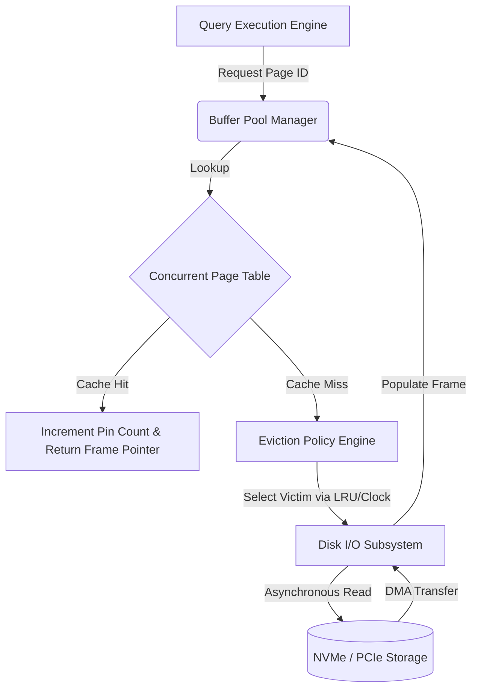
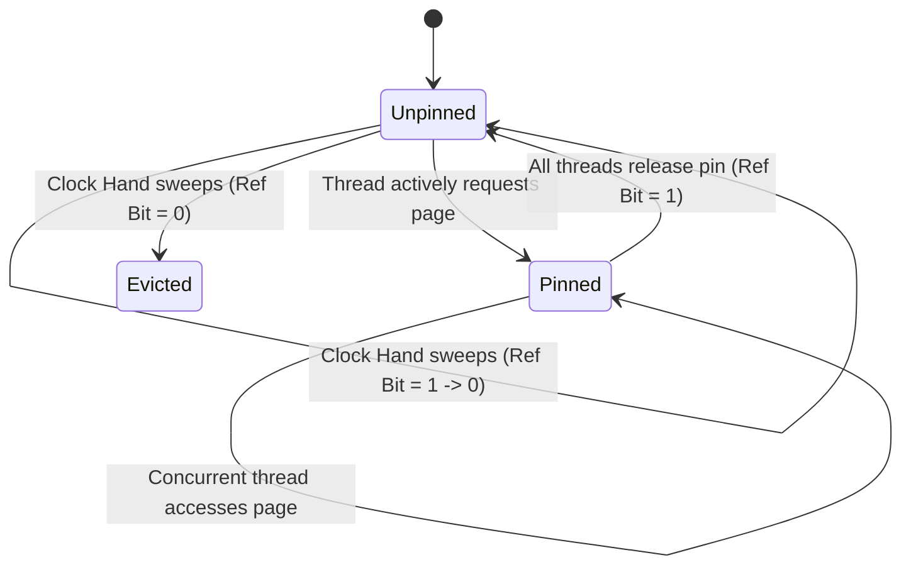

# Buffer Pool Management: Micro-architectural Analysis of Cache Eviction Mechanisms and Memory Subsystem Interactions

The optimization of data retrieval latency in modern data-intensive applications fundamentally relies on the orchestration of a Buffer Pool Manager (BPM). As the primary intermediary bridging the persistent, yet inherently high-latency, secondary storage tier and the volatile, low-latency main memory, the buffer pool constitutes the core architectural component determining the throughput and response time of relational database management systems and distributed key-value stores. The architectural necessity of a buffer pool stems from the mechanical and electronic constraints of non-volatile memory technologies, such as Hard Disk Drives (HDD) and Solid State Drives (SSD), which exhibit access latencies orders of magnitude greater than Dynamic Random Access Memory (DRAM). In contemporary systems, where central processing units execute instructions at sub-nanosecond granularities, synchronous input/output operations directly referencing physical storage media impose an unacceptable pipeline stall, thereby necessitating a sophisticated abstraction layer that aggressively caches active disk blocks into main memory frames. This technical whitepaper delves into the micro-architectural implementation details, mathematical formalisms, and advanced algorithmic paradigms that govern buffer pool management, with a rigorous and uncompromising focus on cache eviction heuristics, particularly the Least Recently Used (LRU) policy, the Clock Sweep approximation, and modern enhancements optimized for highly concurrent memory subsystems.

## Theoretical Foundations of Buffer Pool Architecture and Memory Subsystem Interactions

The physical organization of a buffer pool is intrinsically tied to the underlying operating system's virtual memory subsystem and the hardware architecture's memory management unit (MMU). The buffer pool itself is typically pre-allocated during system initialization as a massive, contiguous block of virtual memory, which is logically partitioned into fixed-size segments designated as "frames." These in-memory frames map deterministically to the corresponding "pages" stored on secondary media. To mitigate the catastrophic performance degradation caused by Translation Lookaside Buffer (TLB) thrashing, advanced database engines allocate this contiguous memory leveraging hardware-supported huge pages, typically utilizing 2 Megabyte or 1 Gigabyte page dimensions, thereby vastly increasing the reach of the TLB and minimizing the latency penalty of virtual-to-physical address translation walks performed by the processor's page table walker. The translation between logical page identifiers, utilized by the database execution engine during query processing, and the physical memory addresses of the buffer frames is maintained via a highly optimized data structure known as the page table or frame map. To achieve deterministic constant-time $O(1)$ lookup complexity under extreme multi-core concurrency, this mapping is implemented using specialized concurrent hash tables, often employing lock-free chaining mechanisms or linear probing with Robin Hood hashing algorithms to minimize collision degradation and maintain optimal cache line density.



The mathematical foundation governing buffer pool efficiency is definitively quantified by the cache hit ratio $h$, defined rigorously as the probability that a requested page already resides within a main memory frame, thereby circumventing a catastrophic page fault to secondary storage. The Effective Access Time (EAT) of the entire database storage subsystem can be mathematically modeled by the equation:
$$EAT = h \cdot t_{mem} + (1 - h) \cdot (t_{mem} + t_{disk} + t_{overhead})$$
where $t_{mem}$ represents the highly deterministic DRAM access latency (typically ranging from 50 to 100 nanoseconds), $t_{disk}$ denotes the latency of resolving a page fault from the non-volatile storage device (ranging from 10 microseconds for enterprise NVMe SSDs to several milliseconds for mechanical HDDs), and $t_{overhead}$ encapsulates the context switching, Direct Memory Access (DMA) channel setup, and interrupt handling costs incurred by the operating system kernel. Given that $t_{disk}$ strictly dominates the equation, often being several orders of magnitude greater than $t_{mem}$, minimizing the cache miss penalty fraction $(1 - h)$ becomes the paramount, overarching objective of any eviction heuristic. Furthermore, industrial-grade buffer pool managers must strictly bypass the operating system's proprietary page cache—a technique universally known as Direct I/O, achieved via the `O_DIRECT` flag in POSIX environments or `FILE_FLAG_NO_BUFFERING` in Windows. This deliberate circumvention prevents anomalous redundant caching, double buffering memory waste, and unpredictable eviction behaviors driven by the OS kernel's generalized, opaque page replacement algorithms, which are utterly oblivious to the specific B-Tree traversal patterns or relational table scan semantics generated by a database execution engine.

## Algorithmic Analysis of Cache Eviction Policies and Heuristics

The foundational algorithm within the domain of cache eviction is the Least Recently Used (LRU) policy, predicated on the temporal heuristic that pages accessed recently exhibit a mathematically high probability of temporal locality and will invariably be referenced again in the near future. The classical, textbook implementation of the LRU policy necessitates a composite, heavily stateful data structure combining a hash map for constant-time page-to-frame lookups and a doubly linked list to precisely maintain the strict temporal ordering of access events. Upon every discrete page access, the corresponding metadata node must be physically detached from its current anatomical position within the doubly linked list and re-inserted at the head, representing the Most Recently Used (MRU) position. When the buffer pool reaches absolute physical capacity, the frame residing at the tail of the list—the strictly Least Recently Used element—is systematically selected as the victim for immediate eviction. While theoretically robust for standard Gaussian or Zipfian distribution access patterns, the strict LRU algorithm is acutely vulnerable to a pathological architectural failure mode classified as sequential flooding. During full table scans, a query execution plan may request a continuous sequence of pages that marginally exceeds the total frame capacity of the buffer pool. In this catastrophic scenario, the strict LRU policy will systematically evict pages mere milliseconds before they are required by a concurrent process, completely polluting the cache and resulting in a devastating cache hit ratio of absolutely zero. Furthermore, the mandatory mutation of the doubly linked list pointers upon every read operation induces severe multi-core scalability bottlenecks, as the list's head and tail pointers become highly contested memory locations subject to intense cache line invalidation and false sharing within the CPU's MESI cache coherence protocol.

To circumvent the prohibitive synchronization overhead and theoretical vulnerabilities of strict LRU, modern database architectures heavily favor the Clock Sweep algorithm, alternatively recognized as the Second Chance replacement policy, which mathematically approximates LRU eviction through a significantly more scalable, lock-free oriented mechanism. The buffer pool frames are conceptually organized as a continuous circular buffer, and the eviction mechanism is modeled as a continuously rotating hand pointing sequentially to specific frames. Each frame's metadata structure is augmented with a singular, atomic boolean reference bit. When a page is accessed by a thread, the buffer pool manager simply executes an atomic hardware instruction to set its reference bit to true, an operation that can be executed concurrently without acquiring global mutexes or modifying complex pointer structures. When a cache miss necessitates an eviction, the clock hand advances continuously through the circular buffer. If the hand encounters a frame with a reference bit set to true, it clears the bit to false, effectively granting the page a "second chance," and proceeds to the subsequent frame. If the hand encounters a frame with a reference bit already evaluated to false, that frame is immediately and deterministically selected as the eviction victim.



The Clock Sweep algorithm rigorously approximates the temporal dynamics of LRU by exploiting the elapsed time between the hand's cyclic revolutions; pages that are frequently accessed will continuously have their reference bits reset to true before the sweeping hand returns, whereas dormant, unreferenced pages will inevitably lose their reference bit and be ruthlessly reclaimed. The mathematical probability of a specific page $P_i$ surviving a full, uninterrupted revolution of the clock hand is deeply correlated to its access frequency $\lambda_i$ relative to the scanning velocity of the clock hand $V_{sweep}$. The survival probability function can be stochastically modeled as:
$$P(survival) = 1 - e^{-\lambda_i \cdot \frac{N}{V_{sweep}}}$$
where $N$ represents the total absolute number of frames physically instantiated in the circular buffer. Advanced architectural derivatives, such as the Generalized Clock or Clock-Pro algorithms, extend this theoretical paradigm by maintaining multiple sweeping hands or allocating distinct history sets for evicted pages to combat sequential flooding phenomena. These enhancements intricately mimic the behavior of highly advanced algorithms like LIRS (Low Inter-reference Recency Set) and LRU-K, tracking the $K$-th previous access timestamp to calculate a more accurate inter-arrival distance, all while strictly maintaining the extremely low hardware overhead characteristic of the Clock paradigm. The LRU-K algorithm specifically defines the backward K-distance $d_k(p, t)$ as the temporal distance backward from the current time $t$ to the $K$-th most recent access of page $p$. By evicting the page with the maximum backward K-distance, LRU-K successfully differentiates between transient sequential reads and genuinely hot pages, mathematically resolving the Belady's anomaly vulnerabilities inherent in primitive FIFO queues.

```rust
// Advanced Clock Sweep pseudo-architecture utilizing atomic hardware primitives
use std::sync::atomic::{AtomicBool, AtomicUsize, Ordering};

pub struct FrameMetadata {
    pub page_id: Option<u64>,
    pub is_dirty: AtomicBool,
    pub pin_count: AtomicUsize,
}

pub struct HardwareOptimizedClockPool {
    capacity: usize,
    frames: Vec<FrameMetadata>,
    reference_bits: Vec<AtomicBool>,
    clock_hand: AtomicUsize,
}

impl HardwareOptimizedClockPool {
    pub fn execute_eviction_sweep(&self) -> Option<usize> {
        let mut algorithmic_iterations = 0;
        let theoretical_max_iterations = self.capacity * 2;
        
        while algorithmic_iterations < theoretical_max_iterations {
            // Relaxed ordering suffices for the monotonic clock hand advancement
            let current_position = self.clock_hand.fetch_add(1, Ordering::Relaxed) % self.capacity;
            
            // Immediately bypass frames pinned by active execution pipelines
            if self.frames[current_position].pin_count.load(Ordering::Acquire) > 0 {
                algorithmic_iterations += 1;
                continue;
            }
            
            // Interrogate and conditionally mutate the hardware reference bit
            if self.reference_bits[current_position].load(Ordering::Acquire) {
                // Execute Second Chance semantic: downgrade the reference status
                self.reference_bits[current_position].store(false, Ordering::Release);
            } else {
                // Ideal victim identified: Reference bit is logically false and pin count is absolute zero
                return Some(current_position);
            }
            algorithmic_iterations += 1;
        }
        None // Pathological exhaustion: Buffer pool is entirely saturated with pinned frames
    }
}
```

## Concurrency Control, Hardware-Aware Optimizations, and Asynchronous I/O

The physical realization of a high-performance buffer pool manager on modern Non-Uniform Memory Access (NUMA) multi-socket architectures necessitates extreme vigilance regarding concurrency control and the deployment of hardware synchronization primitives. Protecting the buffer pool's internal composite data structures—such as the massive frame map, the free list, and the temporal eviction metadata—using coarse-grained operating system mutexes invariably leads to catastrophic convoy effects, massive thread starvation, and severe CPU underutilization. To achieve linear throughput scalability across dozens or hundreds of hardware CPU cores, the buffer pool architecture must be horizontally partitioned into completely independent segments or instances, each meticulously protected by its own highly localized, cache-aligned latch. A requested logical page identifier is cryptographically hashed, and a modulo or bit-masking operation definitively determines which independent buffer pool instance governs the page, thereby statistically uniformly distributing the synchronization contention across the memory buses. Within each isolated instance, highly optimized read-write latches (such as custom spinlocks or strictly queued lock mechanisms like MCS locks) are deployed precisely at the granularity of individual frames to relentlessly coordinate concurrent read and write operations on the actual page payload. When a thread inevitably requests a page for structural modification, it must successfully acquire an exclusive write latch on the frame; conversely, strictly read-only operations acquire shared read latches, allowing massive reader concurrency. The physical interaction between these software-defined latches and the hardware's internal memory hierarchy is absolutely critical to performance. Metadata updates, such as modifying the atomic reference bit in a Clock Sweep implementation or aggressively adjusting pointer nodes in an LRU list, must be exhaustively memory-aligned to standard 64-byte or 128-byte hardware cache lines to definitively prevent false sharing, a devastating hardware phenomenon where completely independent threads modifying disparate variables residing on the identical physical cache line trigger continuous, exorbitantly expensive cross-core L3 cache invalidations over the QPI or Infinity Fabric interconnects.

The eviction process itself must be aggressively decoupled from the critical path of the querying thread to ensure predictable, microsecond-level latency query execution. Modern buffer pool managers employ dedicated, highly prioritized background threads, universally termed asynchronous page cleaners or flushers, which proactively and continuously traverse the eviction data structures to identify dirty pages—pages that have been modified in the volatile main memory but have not yet been strictly persisted to the non-volatile secondary storage. These cleaner threads aggressively batch discrete I/O write requests, leveraging advanced asynchronous kernel interfaces such as `io_uring` in modern Linux kernels or Input/Output Completion Ports (IOCP) in Windows NT environments, to heavily pipeline the flushing of dirty pages to disk. This critical process converts them into clean, pristine pages that can be instantaneously evicted when a sudden page fault occurs. This background flushing architecture must be rigorously synchronized with the database's Write-Ahead Logging (WAL) protocol; a dirty page can never be flushed to secondary storage until its corresponding log record, identified by a monotonically increasing Log Sequence Number (LSN), has been verifiably flushed to the persistent log file, ensuring absolute compliance with the ACID properties. The mathematical optimization of the background flushing rate is a deeply complex control theory problem. Flushing too aggressively saturates the limited disk I/O bandwidth and severely degrades foreground transaction performance, while flushing too passively results in a critical scarcity of clean frames, forcing the foreground thread executing the query to synchronously and tragically perform the write I/O before it can even load its requested page, causing massive, unpredictable latency spikes. The control loop governing the background flusher heavily utilizes Proportional-Integral-Derivative (PID) controllers to dynamically compute and adjust the continuous flushing velocity $V_{flush}(t)$ based on the current mathematical deficit of clean pages $E_{clean}(t) = N_{target} - N_{current}$. This continuous control function is mathematically represented precisely as:
$$V_{flush}(t) = K_p E_{clean}(t) + K_i \int_{0}^{t} E_{clean}(\tau) d\tau + K_d \frac{d E_{clean}(t)}{dt}$$
where $K_p$, $K_i$, and $K_d$ are the proportional, integral, and derivative coefficients empirically tuned or dynamically adjusted via machine learning heuristics. This rigorous, mathematically grounded approach to I/O scheduling ensures that the buffer pool architecture remains highly resilient and exceptionally responsive under extremely fluctuating, bursty workload intensities, continuously maintaining a steady supply of available memory frames and guaranteeing that the eviction mechanisms—whether implementing strict LRU, approximated Clock, or composite advanced algorithms—can operate strictly and flawlessly within the main memory domain without triggering synchronous hardware I/O stalls.

## SEO Section
* Target Keywords: Buffer Pool Management, Cache Eviction Algorithms, Least Recently Used (LRU), Clock Sweep Algorithm, Database Memory Management, Page Fault Latency, Non-Uniform Memory Access (NUMA).
* Meta Description: An elite, massive technical whitepaper detailing the micro-architectural complexities of Buffer Pool Management, focusing on LRU, Clock Sweep heuristics, cache eviction mathematics, and hardware-level synchronization.
* Intended Audience: Staff Software Engineers, Database Architects, Systems Programmers, and Computer Science Researchers specializing in storage engines and memory subsystems.
* Technical Focus: Advanced caching heuristics, CPU cache coherence (MESI), asynchronous I/O architectures (io_uring), and mathematical modeling of memory hierarchies.
