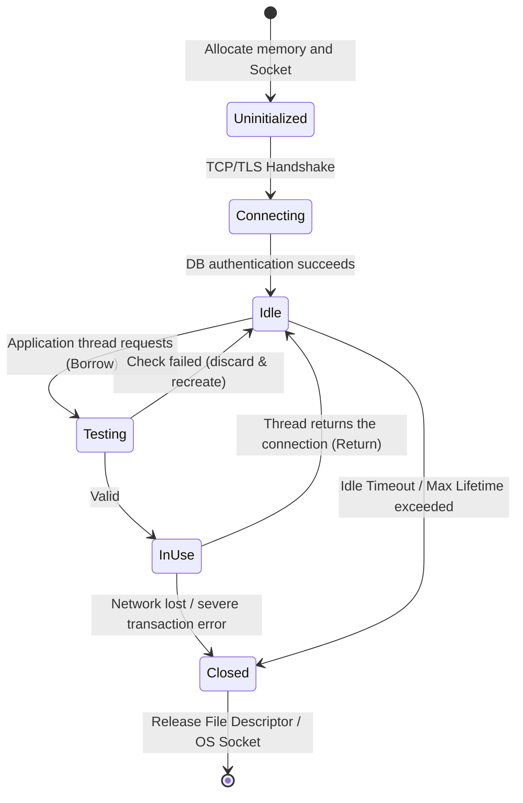
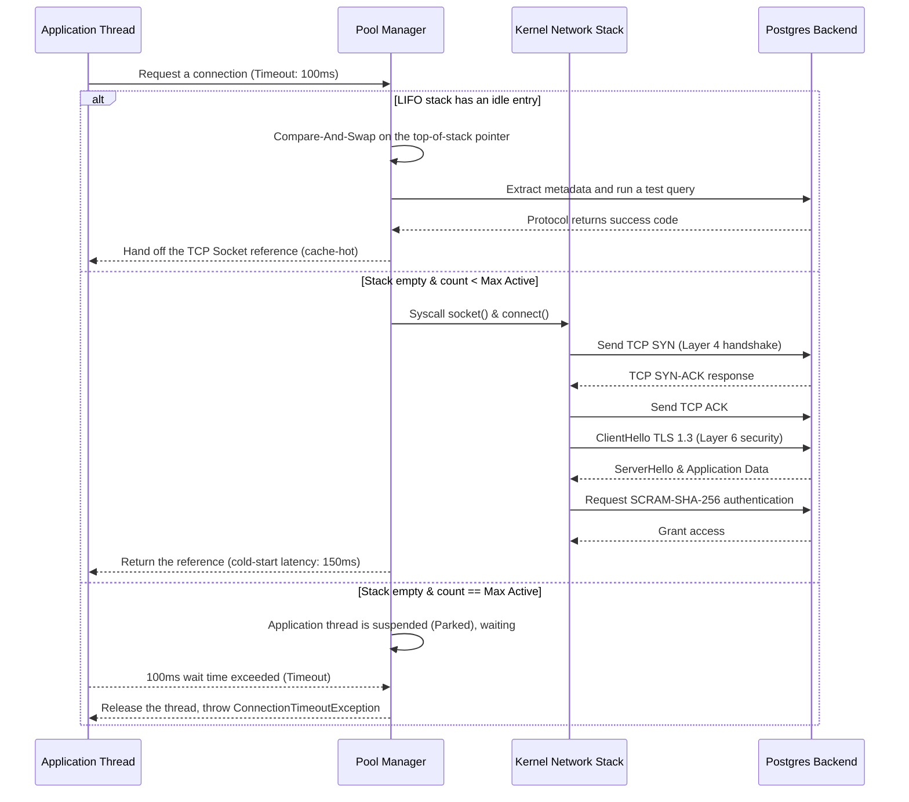

# The Deep Technical Nature of Database Connection Pooling: Microarchitecture, Mathematical Models, and Operating-System-Level Interactions

## Summary & Core Problem Statement

In distributed systems, microservices architectures, and modern web applications, the link between the application layer and the database layer is one of the most common places performance quietly falls apart. Database connection pooling exists specifically to fix that link, and understanding how it works internally — not just how to configure it — is what separates a system that scales from one that tips over under load.

**The core problem:** opening a new connection to a database isn't just opening a socket. It's a chain of steps, each with its own cost:
1. DNS resolution.
2. The TCP three-way handshake at the transport layer.
3. TLS parameter negotiation and key exchange at the session layer.
4. Authentication, authorization, and memory allocation inside the database engine itself.

Add it all up and you typically get somewhere between a few dozen and a few hundred milliseconds. That's fine once. It's a disaster if you pay it on every request. A system aiming for tens of thousands of transactions per second simply cannot afford to re-run this handshake chain per user request — average response time spikes, threads pile up waiting, and you're one bad afternoon away from a cascading failure.

Connection pooling solves this by keeping a set of already-established connections alive and handing them out on demand, rather than opening and closing a connection for every query. Beyond eliminating cold-start latency, a good pool also acts as a kind of circuit breaker: it caps how many concurrent connections the database sees, which protects the OS and the database engine from resource exhaustion when traffic spikes far beyond what the hardware can absorb.

This article looks at what's actually happening inside a connection pool — the internal state machine, the allocation strategy (lock-free structures, LIFO vs. FIFO), the queueing-theory math behind sizing a pool correctly, and the OS kernel interactions that determine whether your pool behaves well under real load. This is the kind of detail that matters once you're designing systems meant to run at scale, not just make it through a demo.

---

## Micro-architecture and Connection State Management

Under the deceptively simple API of a connection pool — HikariCP in Java, `database/sql` in Go, the `psycopg2` pool in Python — sits a fairly intricate piece of engineering. Its job is to guarantee data integrity and maximum throughput in an environment where dozens of threads are fighting over the same small set of resources.

### The Connection State Machine

At the core of any pool implementation is a finite state machine tracking the lifecycle of each physical connection. A connection typically moves through these states:

1. **Uninitialized:** no socket open, no resources allocated yet.
2. **Idle:** successfully connected to the database, clean, sitting in a queue or stack waiting to be picked up.
3. **In-Use / Borrowed:** an application thread has claimed it and is running a query.
4. **Testing:** the pool is quietly pinging it to confirm a firewall or timeout hasn't silently killed it.
5. **Closed / Evicted:** expired (past its max lifetime), dropped by the network, or simply no longer needed, and waiting for cleanup.

These transitions have to happen atomically. Otherwise you get race conditions — two threads grabbing the same idle connection, or one thread writing to a socket that's already been torn down.



### Avoiding the Convoy Effect and Lock-Free Synchronization

Older connection pool libraries, C3P0 and DBCP among them, protected the whole array of connections with a single global mutex. That works fine at low concurrency and falls apart badly as thread count rises — a pattern known as the **convoy effect**. Hundreds of threads end up queued just to flip one boolean, and the system spends more cycles on context switching than on actually running queries.

Modern pools — HikariCP is the usual reference point for the JVM — drop locks entirely in favor of lock-free structures built on atomic `Compare-And-Swap` (CAS) instructions, the kind the CPU exposes directly (`LOCK CMPXCHG` on x86).

Building these structures well means paying close attention to **false sharing** at the CPU cache level. If several atomic variables — say, a counter of active connections — happen to sit on the same 64-byte cache line, updating one on core 1 invalidates that whole line on core 2 thanks to the MESI cache-coherence protocol. The usual fix is **cache line padding**: deliberately inserting unused bytes between state variables so each one lands on its own cache line, sidestepping the problem at the hardware level.

### Dead Connections and Keep-Alive Diagnostics

Every connection pool eventually runs into the same distributed-systems question: how do you know the other end is still alive? A brief network blip, a firewall or NAT device silently dropping idle connections after five or ten minutes (the classic TCP half-open scenario), or a DBA restarting the database overnight — any of these can leave a connection that the client's OS still reports as `ESTABLISHED`, while the database has already quietly discarded it.

The traditional fix is a "test-on-borrow" query — `SELECT 1`, or a protocol-level `ping()`. It works, in the sense that the application never gets handed a dead connection, but it adds latency to every single borrow. For a high-frequency-trading workload, that overhead alone can be the difference between meeting your SLA and not.

Modern pools, and newer JDBC drivers, split this responsibility across two mechanisms instead:
1. **A background eviction thread** that periodically scans the idle list and spot-checks connections.
2. **The JDBC4 `isValid()` API**, which either pings at the database's binary protocol level (skipping SQL parsing entirely) or leans on the OS's own `SO_KEEPALIVE` at the TCP layer.

```rust
// Modeling a Lock-Free Connection Pool architecture in Rust
use std::sync::atomic::{AtomicUsize, Ordering};
use std::sync::Arc;
use crossbeam_queue::ArrayQueue;

struct DbConnection {
    id: u32,
    is_valid: bool,
    created_at: u64,
}

struct ConnectionPool {
    connections: ArrayQueue<DbConnection>,
    active_count: AtomicUsize,
    max_size: usize,
}

impl ConnectionPool {
    fn new(max_size: usize) -> Arc<Self> {
        Arc::new(ConnectionPool {
            connections: ArrayQueue::new(max_size),
            active_count: AtomicUsize::new(0),
            max_size,
        })
    }

    fn acquire(&self) -> Result<DbConnection, String> {
        // Lock-free algorithm: grab a connection as fast as possible
        while let Some(conn) = self.connections.pop() {
            if self.test_connection(&conn) {
                self.active_count.fetch_add(1, Ordering::SeqCst);
                return Ok(conn);
            }
        }
        
        let current_active = self.active_count.load(Ordering::Relaxed);
        if current_active < self.max_size {
            // Push the extremely expensive TCP Handshake networking logic outside the CAS boundary
            let new_conn = self.create_physical_connection();
            self.active_count.fetch_add(1, Ordering::SeqCst);
            return Ok(new_conn);
        }
        
        Err("Pool exhausted: the connection wait queue has hit its maximum threshold".to_string())
    }

    fn release(&self, mut conn: DbConnection) {
        self.active_count.fetch_sub(1, Ordering::SeqCst);
        if conn.is_valid {
            // Update state and push back into the structure, warming the L1/L2 cache
            let _ = self.connections.push(conn);
        }
    }

    fn test_connection(&self, conn: &DbConnection) -> bool {
        // Could run an asynchronous PING here
        conn.is_valid
    }

    fn create_physical_connection(&self) -> DbConnection {
        // OS-level socket(), connect() syscalls...
        DbConnection { id: 0, is_valid: true, created_at: 0 }
    }
}
```

---

## The Architectural Battle: LIFO vs FIFO on CPU Cache

Whether idle connections sit in a queue (FIFO) or a stack (LIFO) sounds like a trivial implementation detail. It isn't — it changes measurable throughput.

FIFO looks fair on paper: every connection takes its turn, none of them sit idle long enough to get killed by a firewall timeout. But that fairness argument doesn't survive contact with how CPU caches actually work.

Under LIFO, a connection that was just returned to the pool sits at the top of the stack, and there's a good chance another thread grabs it again within milliseconds. That reuse pattern buys you real **cache locality**:
- In userspace, the object describing that connection is still hot in L1/L2 cache.
- In kernel space, the `struct socket`, the `sk_buff` holding the TCP stream, and related context pointers are all still resident.

With FIFO, you instead pull out the oldest idle connection — the one most likely to have been evicted from cache already, forcing a trip to RAM that costs hundreds of cycles. LIFO also has a side effect worth noting: it naturally concentrates load onto a small hot set of connections near the top of the stack, while connections near the bottom sit unused long enough to hit `idle_timeout` and get reclaimed — freeing file descriptors and ephemeral ports back to the OS.

That combination of cache locality and natural connection turnover is why most serious connection pool libraries default to LIFO.

---

## Mathematical Model: Sizing the Pool Using Queueing Theory

Sizing a connection pool isn't a matter of guessing, and setting `Max_Connections = 1000` in the hope that bigger is faster is one of the more reliable ways to destabilize a database server.

Every open TCP connection to a database costs RAM — roughly 2–10MB per backend process on PostgreSQL or Oracle — plus lock manager overhead and page table fragmentation.

### The M/M/c Queueing Model and Little's Law

We can model this with queueing theory, specifically the $M/M/c$ model:
- **M (Markovian):** requests arrive following a Poisson distribution.
- **M (Markovian):** the database's service time follows an exponential distribution.
- **c:** the maximum number of connections (Max connections in the pool).

**Little's Law** gives us the wide-angle view:
$$ L = \lambda \times W $$
Where:
- $L$: the average number of requests currently in the system.
- $\lambda$: the arrival rate (requests per second, TPS).
- $W$: response time — the queueing wait to acquire a connection ($W_q$) plus the actual I/O execution time at the database ($W_s$).

When traffic spikes and $\lambda$ climbs toward the service capacity of $c$ connections, the wait time at the pool, $W_q$, doesn't rise gently — it blows up.

### The Universal Scalability Law (USL)

The obvious response is "why not just set $c$ to 5000 and never wait?" Dr. Neil Gunther's Universal Scalability Law explains why that backfires. The throughput of a parallel system like a database backend follows this decay curve:

$$ X(N) = \frac{\gamma N}{1 + \alpha(N - 1) + \beta N(N - 1)} $$

- $N$: the number of active parallel threads/connections.
- $\alpha$: the cost of contention — threads fighting over the same row lock, or competing to write the WAL.
- $\beta$: the cost of coherency and context-switching overhead — the CPU constantly swapping thread contexts.

The quadratic term $\beta N(N - 1)$ in the denominator is what actually breaks things. Once $N$ climbs well past the physical core count of the database server, that term dominates, the denominator balloons, and total throughput $X(N)$ collapses — the system starts **thrashing**.

**PostgreSQL's classic rule of thumb:**
> Optimal Pool Size = (Number of physical CPU cores × 2) + Number of mechanical disks (Spindles)

On modern NVMe storage, disk wait is effectively zero, so the active-connection count really only needs to be a bit above the core count. A 32-core database server will typically push far more throughput with a pool of 60–80 active connections than one configured for 1000 — the smaller pool avoids the thrashing regime entirely.



---

## Operating-System-Level Interaction and the Port Exhaustion Crisis

Everything at the application layer eventually rests on kernel-space structures. The socket behind a TCP/IP connection requires the Linux kernel to allocate a send buffer (`SO_SNDBUF`) and a receive buffer (`SO_RCVBUF`). With TCP window scaling in play, even an idle connection ties up several dozen KB of kernel memory that can't be swapped out.

### The TIME_WAIT and Ephemeral Port Crisis

One of the subtler failure modes here is running out of ephemeral local ports. When a connection pool closes a connection on its own initiative — an expired `idle_timeout` or `max_lifetime` — that connection doesn't just vanish. The socket enters the `TIME_WAIT` state.

That state lingers for $2 \times MSL$ (Maximum Segment Lifetime), which defaults to **60 seconds** on Linux. TCP holds the port in reserve during this window so that a stray, delayed packet from the old connection can't accidentally land on a new connection that happens to reuse the same port.

If a poorly tuned pool is opening and closing hundreds of connections per second, it will push tens of thousands of ports into `TIME_WAIT` limbo. Eventually the OS's ephemeral port range (typically 32768–60999) is fully drained, `connect()` starts failing with `EADDRNOTAVAIL`, and the process can no longer open new outbound connections — not just to the database, but to Redis, Kafka, Elasticsearch, anything.

**How to fix it:**
1. Keep connection lifetime (`max_lifetime`) long enough — 30 minutes to an hour is typical — that you're not churning connections unnecessarily.
2. Tune the Linux kernel carefully via sysctl: `net.ipv4.tcp_tw_reuse = 1` allows safe port reuse based on TCP timestamps.

### Micro-Optimizing Sockets in C/C++

At the low-level end, engineers can reach directly into the OS to tune how the pool's sockets behave.

```cpp
#include <sys/socket.h>
#include <netinet/in.h>
#include <netinet/tcp.h>
#include <unistd.h>
#include <stdexcept>

class SocketTuner {
public:
    static void configure_database_socket(int socket_fd) {
        int keepalive = 1;
        int keepidle = 60;   // Idle threshold before sending a probe (seconds)
        int keepintvl = 10;  // Interval between keep-alive probes (seconds)
        int keepcnt = 3;     // Number of failures before marking the connection dead
        int tcp_nodelay = 1; // Disable the Nagle Algorithm

        // Enable background keep-alive probing at the OS protocol layer (Layer 4)
        if (setsockopt(socket_fd, SOL_SOCKET, SO_KEEPALIVE, &keepalive, sizeof(keepalive)) < 0) {
            throw std::runtime_error("Failed to configure SO_KEEPALIVE");
        }
        
        // Tune the optimal probing interval to avoid Firewalls (TCP KeepAlive)
        setsockopt(socket_fd, IPPROTO_TCP, TCP_KEEPIDLE, &keepidle, sizeof(keepidle));
        setsockopt(socket_fd, IPPROTO_TCP, TCP_KEEPINTVL, &keepintvl, sizeof(keepintvl));
        setsockopt(socket_fd, IPPROTO_TCP, TCP_KEEPCNT, &keepcnt, sizeof(keepcnt));

        // CRITICAL OPTIMIZATION: SQL queries are usually very small in size.
        // The (default) Nagle algorithm will slow down transactions because it tries to batch small packets together.
        // Nagle must be disabled to achieve ultra-low latency.
        setsockopt(socket_fd, IPPROTO_TCP, TCP_NODELAY, &tcp_nodelay, sizeof(tcp_nodelay));
    }
};
```

---

## Middleware Architecture: The Transaction Pooler and Epoll

Classic RDBMS engines like PostgreSQL run on a one-process-per-connection model. That's fine until you put it behind a microservices ecosystem with thousands of pods, each keeping its own pool of 20 connections open — suddenly the database is staring down 20,000 connections, the OS runs out of memory, and the CPU spends most of its time context-switching instead of executing queries.

The standard fix is a middleware proxy — a **transaction pooler** — sitting in front of the database. PgBouncer, Odyssey, and ProxySQL are the usual names here.

These tools run an asynchronous I/O architecture built on non-blocking event loops like `epoll` on Linux. The core mechanism is **transaction-level multiplexing**, and it works like this:
1. The pooler lets tens of thousands of client applications hold what look like real TCP connections (frontend connections).
2. Behind the scenes, it maintains only as many real backend connections as the database has CPU cores to use.
3. When a client sends `BEGIN`, the pooler assigns it one physical backend connection.
4. The moment that client sends `COMMIT`, the backend connection is reclaimed immediately — even if the client hasn't disconnected — and handed to the next transaction waiting in line.

This multiplexing layer decouples client-side connection count from backend load almost entirely. The database ends up working with a small, static set of connections, L3 cache usage improves, and the whole system can absorb billions of requests without buckling.

---

## Lessons Learned & Best Practices for Systems Engineers

1. **Size for performance, not for traffic volume.** The ideal pool size scales with the database server's physical core count — roughly `cores * 2` — not with how many requests your application sends. Over-provisioning triggers the USL curve and pushes you into thrashing.
2. **Cap the max lifetime.** Configure `max_lifetime` (typically 15–60 minutes). Lower-level C/C++ drivers occasionally leak memory slowly; recycling connections after an hour resets the heap state of the DB process before that becomes a problem.
3. **Always enable TCP_NODELAY.** Make sure the Nagle algorithm is off. Don't let the OS batch small SQL packets to save bandwidth at the cost of latency.
4. **Watch TIME_WAIT.** If a web server keeps throwing `Connection refused` or timeouts despite an idle CPU, run `netstat -nat | awk '{print $6}' | sort | uniq -c`. A TIME_WAIT count above 40,000 means your pool is opening and closing connections too often, and you're heading toward ephemeral port exhaustion.
5. **Don't overuse SELECT 1.** Avoid a SQL-based test-on-borrow on every single connection request. Modern pools that rely on background keep-alive or the JDBC4 API achieve the same safety with far less overhead.
