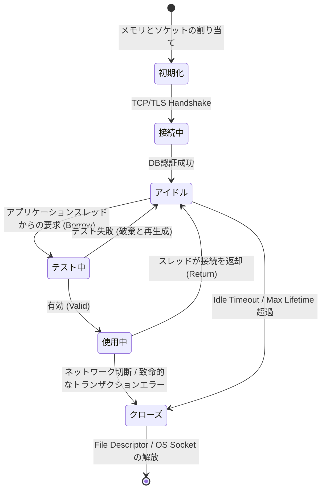
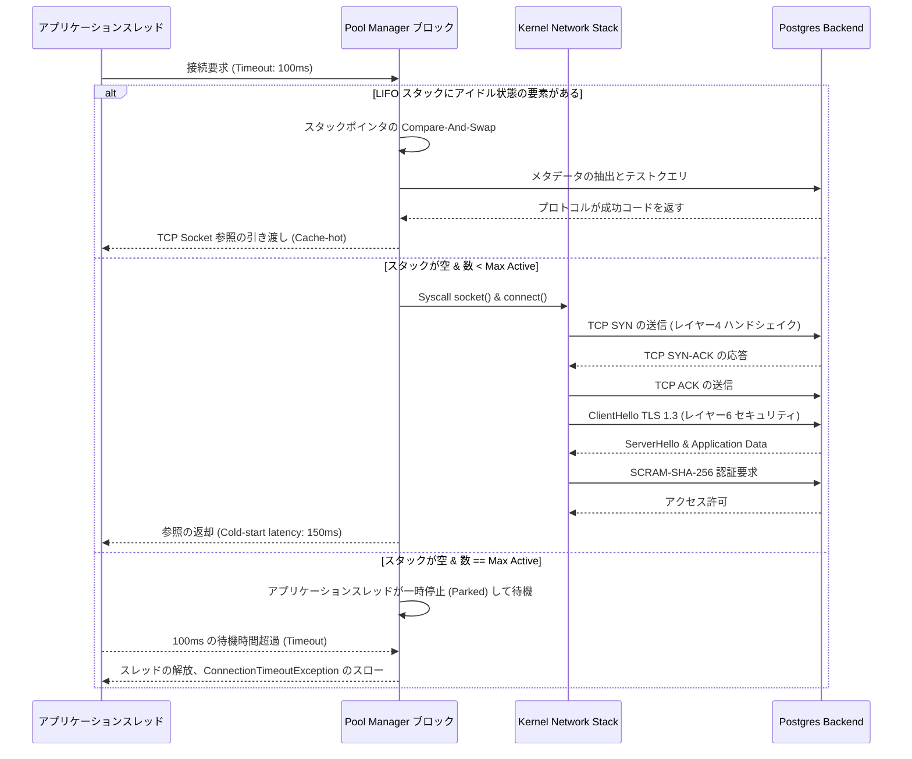

# データベースコネクションプーリングの内側: マイクロアーキテクチャからOSレベルの挙動まで

## 概要と中核的な問題

分散システムやマイクロサービス、モダンなWebアプリケーションでは、アプリケーション層とデータベース層の間の通信が最も深刻なボトルネックになりがちだ。ここでコネクションプーリングがどう効いてくるかを理解しておくと、性能問題の見立てがぐっと楽になる。

**中核的な問題は何か。** データベースへの新規接続を確立するプロセスは、単にソケットを開くだけの単純な処理ではない。実際には次のような重い手順が連なっている。
1. DNS解決。
2. トランスポート層でのTCP 3ウェイハンドシェイク。
3. セッション層でのTLSパラメータのネゴシエーションと鍵交換。
4. データベースエンジン側でのユーザー認証、認可、メモリ割り当て。

この一連の処理にかかる時間は、通常数十から数百ミリ秒に及ぶ。超低遅延と毎秒数万トランザクション(TPS)を求められるシステムにとって、この遅延は到底許容できない。リクエストのたびにこの重いネットワーク初期化コストを払うことになれば、平均応答時間は跳ね上がり、負荷の蓄積、スレッド枯渇、そして連鎖的な障害へとつながっていく。

この問題を解決するために生まれたのが、確立済みの接続を管理・再利用するミドルウェアとしての**コネクションプーリング**だ。接続をその都度作って壊すのではなく、プールは常にアプリケーションのスレッドへすぐ渡せる状態の接続群を維持しておく。これによりコールドスタートの遅延がなくなるだけでなく、同時接続数が物理的なしきい値を超えてOSのメモリが枯渇するのを防ぐ、一種の安全弁としても機能する。

この記事では、コネクションプールの内部メカニズム、データ構造(ロックフリー、LIFO/FIFO)、待ち行列理論による数学的モデル、そしてプールとOSカーネルの間の深い相互作用を掘り下げていく。大規模なデータ処理システムを設計・最適化するソフトウェアアーキテクトにとって欠かせない基礎知識のはずだ。

---

## マイクロアーキテクチャと接続状態管理

HikariCP(Java)、Goの`database/sql`、Pythonの`psycopg2`のプールなど、コネクションプールのAPI自体はシンプルに見えるが、その裏側には、激しい競合が起きるマルチスレッド環境でもデータの整合性と最高のパフォーマンスを両立させるための、かなり洗練された仕組みが隠れている。

### 接続の状態遷移

このアーキテクチャの核となるのは、個々の物理接続のライフサイクルを管理する有限状態機械だ。プール内の接続は、おおよそ次のいずれかの状態にある。

1. **Uninitialized(未初期化)**: ソケットも開いておらず、リソースも未割り当て。
2. **Idle(アイドル)**: DBへの接続に成功し、クリーンな状態でキューやスタックに入っている。
3. **In-Use / Borrowed(使用中)**: アプリケーションスレッドがこの接続を借りてクエリを実行している。
4. **Testing(有効性確認中)**: バックグラウンドでpingを送り、ファイアウォールなどで切断されていないか確認している。
5. **Closed / Evicted(クローズ済み)**: 最大生存時間の超過、ネットワーク切断、不要と判断されたことで、ガベージコレクションによる解放を待っている。

複数のスレッドが同じアイドル接続を取り合ったり、最悪の場合すでにソケットレベルで閉じられた接続にデータを送ろうとしたりする競合状態を避けるため、これらの状態遷移は**アトミック**に行う必要がある。



### コンボイ効果の回避とロックフリー同期

C3P0やDBCPといった初期のコネクションプールライブラリは、接続配列全体をグローバルミューテックスで保護することが多かった。これは競合するスレッド数が増えるにつれて性能を大きく損なう。この現象が**コンボイ効果**だ。数百のアプリケーションスレッドがたった1つのブール変数の更新のためだけに並んで待たされ、システムはクエリ処理ではなくコンテキストスイッチにエネルギーを吸い取られてしまう。

JVM向けの高速プールとして知られるHikariCPなど、最近のプール実装は従来型のロックをほぼ捨てている。代わりにロックフリーなデータ構造を使うか、CPUの命令セットが直接提供するCompare-And-Swap(CAS)命令(x86の`LOCK CMPXCHG`など)によるアトミック変数を使う。

こうしたデータ構造の設計では、CPUキャッシュレベルでの**フォールスシェアリング**にも気を配る必要がある。アクティブ接続数をカウントする変数のような複数のアトミック変数が同じキャッシュライン(通常64バイト)に乗っていると、MESIキャッシュコヒーレンスプロトコルにより、あるCPUコアでの更新が別のコアのキャッシュライン全体を無効化してしまう。**キャッシュラインパディング**という手法で状態変数の間に無意味なバイトを挿入し、別々のキャッシュラインに配置させることで、このハードウェア由来のボトルネックを回避できる。

### デッドコネクションとKeep-alive診断

コネクションプールは分散システムではおなじみの問題にも向き合う必要がある。相手がまだ生きているかをどう確認するか、という問題だ。一時的なネットワーク障害、ファイアウォールやNATによる5〜10分後のアイドル接続の自動切断(TCP half-open)、あるいはDBAによる夜間のデータベース再起動などが典型的な原因になる。クライアント側のOSはTCP接続を`ESTABLISHED`とみなしていても、データベースサーバー側はすでにその接続を破棄しているかもしれない。

これに対する古典的な対処法が、「Test-on-borrow」クエリ(`SELECT 1`やプロトコルレベルの`ping()`呼び出しなど)の実行だ。これで死んだ接続を掴まされることはなくなるが、接続を借りるすべてのリクエストに余計な遅延が乗る。高頻度取引のようなアプリケーションでは、この遅延が致命傷になりかねない。

そこで、最近のプール(および新しめのJDBCドライバー)はこのチェックを次の2つの仕組みに移している。
1. **バックグラウンドの退避スレッド**: 定期的にアイドルリストを走査し、ランダムにチェックする。
2. **JDBC4の`isValid()` API**: SQL文字列をパースする代わりに、データベースのバイナリプロトコルレベルでのPINGを直接使うか、OSのTCP/IP層にある`SO_KEEPALIVE`機能を活用する。

```rust
// Rust を用いた Lock-Free Connection Pool アーキテクチャのシミュレーション
use std::sync::atomic::{AtomicUsize, Ordering};
use std::sync::Arc;
use crossbeam_queue::ArrayQueue;

struct DbConnection {
    id: u32,
    is_valid: bool,
    created_at: u64,
}

struct ConnectionPool {
    connections: ArrayQueue<DbConnection>,
    active_count: AtomicUsize,
    max_size: usize,
}

impl ConnectionPool {
    fn new(max_size: usize) -> Arc<Self> {
        Arc::new(ConnectionPool {
            connections: ArrayQueue::new(max_size),
            active_count: AtomicUsize::new(0),
            max_size,
        })
    }

    fn acquire(&self) -> Result<DbConnection, String> {
        // ロックフリーアルゴリズム: 可能な限り最速で接続を取得
        while let Some(conn) = self.connections.pop() {
            if self.test_connection(&conn) {
                self.active_count.fetch_add(1, Ordering::SeqCst);
                return Ok(conn);
            }
        }
        
        let current_active = self.active_count.load(Ordering::Relaxed);
        if current_active < self.max_size {
            // 非常にコストの高い TCP Handshake ネットワークロジックを CAS 境界から押し出す
            let new_conn = self.create_physical_connection();
            self.active_count.fetch_add(1, Ordering::SeqCst);
            return Ok(new_conn);
        }
        
        Err("Pool exhausted: 接続待機キューが最大しきい値に達しました".to_string())
    }

    fn release(&self, mut conn: DbConnection) {
        self.active_count.fetch_sub(1, Ordering::SeqCst);
        if conn.is_valid {
            // 状態を更新し、構造体に押し戻して L1/L2 キャッシュをアクティブ化
            let _ = self.connections.push(conn);
        }
    }

    fn test_connection(&self, conn: &DbConnection) -> bool {
        // 非同期 PING を実行可能
        conn.is_valid
    }

    fn create_physical_connection(&self) -> DbConnection {
        // OS は syscalls を操作します socket(), connect() ...
        DbConnection { id: 0, is_valid: true, created_at: 0 }
    }
}
```

---

## LIFO対FIFO: CPUキャッシュの上で起きている勝負

アイドル接続をキュー(FIFO)で管理するかスタック(LIFO)で管理するかという一見些細な選択が、マイクロチップレベルでは決定的な差を生む。

直感的には**FIFO**の方が公平に見える。各接続に均等に負荷が回り、特定の接続だけが長時間放置されてファイアウォールにタイムアウトされる心配もない。しかし、この「公平さ」の理屈は、実際のハードウェアの前ではあっさり崩れる。

**LIFO**を採用すると、プールに返却されたばかりの接続はスタックの先頭に積まれる。この接続は次の数ミリ秒のうちに別のスレッドから再利用される可能性が高い。これが**キャッシュ局所性**という実務上大きなメリットを生む。
- ユーザースペースでは、接続を表すデータ構造がCPUのL1/L2キャッシュに「ホット」な状態で残り続ける。
- カーネル空間でも、ソケット構造体`struct socket`、TCPストリームを保持する`sk_buff`、コンテキストポインタなどがキャッシュに乗ったままになる。

FIFOだと、取り出されるのは常に最も古い接続であり、それを表すメモリはすでにスワップアウトされているかCPUキャッシュから追い出されている可能性が高く、CPUは数百クロックサイクルを費やしてRAMへアクセスすることになる。さらにLIFOには、ネットワーク負荷をスタック上位の少数の接続に集中させる副次効果もある。スタックの底にある接続は使われないままidle_timeoutに達し、自然に回収されていく。この弾力性のおかげで、ファイルディスクリプタやエフェメラルポートを早めにサーバーへ返却できる。

こうした理由から、現在主流のコネクションプールライブラリの多くはLIFO優先のモデルを採用している。

---

## 待ち行列理論で考えるプールサイジング

コネクションプールのサイジングは、当てずっぽうで`Max_Connections = 1000`のような数値を設定して様子を見る作業ではない。むしろ、接続数の**過剰なプロビジョニング**こそがデータベースサーバーを不安定にする最大の原因になりがちだ。

データベースへの1つのTCP接続は、RAM(PostgreSQLやOracleでは1プロセスあたりおよそ2〜10MB)を消費し、ロックマネージャーのリソースを使い、ページテーブルの断片化も引き起こす。

### M/M/c待ち行列モデルとリトルの法則

このダイナミクスは待ち行列理論、具体的には$M/M/c$モデルで捉えられる。
- **M(Markovian)**: リクエストの到着はポアソン分布に従う。
- **M(Markovian)**: データベース側のサービス時間は指数分布に従う。
- **c**: プール内の最大接続数。

**リトルの法則**は全体像をシンプルに示してくれる。
$$ L = \lambda \times W $$
ここで:
- $L$: システム内にある平均リクエスト数。
- $\lambda$: リクエストレート(秒間トランザクション数、TPS)。
- $W$: 応答時間。接続待ちのキュー時間($W_q$)とデータベースでの実処理時間($W_s$)の合計。

トラフィックが急増すると$\lambda$が跳ね上がり、$c$個の接続で処理できる容量に近づく。すると待ち時間$W_q$は指数関数的に膨らんでいく。

### 普遍的スケーラビリティ法則(USL)

「待ちたくないなら$c$を5000にすればいいのでは」と考えたくなるところだが、そこに落とし穴がある。ニール・ガンサー博士のUSL(Universal Scalability Law)によれば、データベースバックエンドのような並列処理システムのスケーラビリティは次の式に従う。

$$ X(N) = \frac{\gamma N}{1 + \alpha(N - 1) + \beta N(N - 1)} $$

- $N$: 同時に稼働しているスレッド/接続の数。
- $\alpha$: 競合コスト — 例えば複数スレッドが同じ行をロックしたり、WAL(Write-Ahead Log)への書き込みを取り合ったりすること。
- $\beta$: キャッシュコヒーレンシやコンテキストスイッチにかかる同期コスト。CPUがスレッドの切り替えに常に追われる状態を表す。

分母にある2次の項$\beta N(N - 1)$が厄介者だ。$N$(開いている接続数)がデータベースサーバーの物理コア数を大きく超えると、分母は急激に膨れ上がり、全体のスループット$X(N)$は自由落下する。これがいわゆる**スラッシング**、つまりパニック的な競合状態だ。

**PostgreSQLでよく言われる経験則:**
> 最適なプールサイズ = (物理CPUコア数 × 2) + 物理ディスク数(スピンドル数)

ただ、今どきのNVMe SSDストレージでは、ディスク待機の要素はほぼゼロに近い。つまり、稼働中の接続数は物理CPUコア数を少し上回る程度で十分ということになる。32コアのDBサーバーなら、Max_Activeを60〜80程度にしたコネクションプールの方が、1000接続のプールを設定するよりも何倍も高いTPSを出せることが多い。



---

## OSレベルの挙動とポート枯渇のリスク

アプリケーション側のあらゆる論理構造は、最終的にカーネル空間に根を下ろしている。ソケット構造体はTCP/IPのリンクを表し、Linuxカーネルに対して送信バッファ`SO_SNDBUF`と受信バッファ`SO_RCVBUF`の割り当てを要求する。TCP Window Scalingを使う場合、接続がアイドル状態であっても数十KBのカーネルメモリ(スワップ不可)が確保されたままになる。

### TIME_WAITとエフェメラルポートの枯渇

見落とされがちだが実際に厄介なのが、ローカルのエフェメラルポート枯渇だ。TCPのルールでは、コネクションプール(クライアント側)が自発的に接続を閉じても(`Idle Timeout`や`Max Lifetime`の超過など)、そのソケットは即座には消えない。`TIME_WAIT`状態に移行する。

この状態は$2 \times MSL$(Maximum Segment Lifetime)の間続き、Linuxのデフォルトでは**60秒**だ。古い接続に対する遅延パケットが、同じポートを再利用した新しい接続に誤って届くのを防ぐため、TCPはこの間ポートをルーティングテーブル上に保持し続ける必要がある。

コネクションプールの設定が甘く、毎秒何百もの接続の生成と破棄を繰り返していると、何万ものポートが`TIME_WAIT`の中に溜まっていく。OSのエフェメラルポート範囲(通常32768〜60999)はやがて枯渇する。`connect()`の呼び出しが`EADDRNOTAVAIL`で失敗し始めたり、Redis・Kafka・Elasticsearchへのアウトバウンド接続すら作れなくなったりする。

**対策:**
1. 接続の生存期間(`max_lifetime`)を十分に長め(30分〜1時間程度)に設定し、接続の入れ替わり(churn rate)を抑える。
2. sysctlパラメータでLinuxカーネルを調整する: `net.ipv4.tcp_tw_reuse = 1`(TCPタイムスタンプに基づく安全なポート再利用を許可する)。

### C/C++によるソケットの微調整

低レイヤーの実装では、エンジニアがOSに直接アクセスしてプールのソケット挙動を細かく調整できる。

```cpp
#include <sys/socket.h>
#include <netinet/in.h>
#include <netinet/tcp.h>
#include <unistd.h>
#include <stdexcept>

class SocketTuner {
public:
    static void configure_database_socket(int socket_fd) {
        int keepalive = 1;
        int keepidle = 60;   // プローブ送信前のアイドルしきい値 (秒)
        int keepintvl = 10;  // 死活監視信号の送信サイクル (秒)
        int keepcnt = 3;     // 接続を死んでいるとマークする前のエラー回数
        int tcp_nodelay = 1; // Nagle アルゴリズムの無効化

        // OS プロトコル層 (レイヤー 4) でのバックグラウンド死活監視プローブを有効にする
        if (setsockopt(socket_fd, SOL_SOCKET, SO_KEEPALIVE, &keepalive, sizeof(keepalive)) < 0) {
            throw std::runtime_error("SO_KEEPALIVE の設定エラー");
        }
        
        // ファイアウォールを回避するために最適なプローブ時間振幅を調整する (TCP KeepAlive)
        setsockopt(socket_fd, IPPROTO_TCP, TCP_KEEPIDLE, &keepidle, sizeof(keepidle));
        setsockopt(socket_fd, IPPROTO_TCP, TCP_KEEPINTVL, &keepintvl, sizeof(keepintvl));
        setsockopt(socket_fd, IPPROTO_TCP, TCP_KEEPCNT, &keepcnt, sizeof(keepcnt));

        // CRITICAL な最適化: SQL クエリは通常、サイズが非常に小さい。 
        // Nagle アルゴリズム (デフォルト) は、小さなパケットをグループ化しようとするため、トランザクションを遅くします。 
        // 超低遅延を実現するには、Nagle を強制的に排除する必要があります。
        setsockopt(socket_fd, IPPROTO_TCP, TCP_NODELAY, &tcp_nodelay, sizeof(tcp_nodelay));
    }
};
```

---

## ミドルウェアの選択: Transaction PoolerとEpoll

インフラの観点で見ると、PostgreSQLのような古典的なRDBMSは「接続ごとにプロセスを1つ」というモデルで動く。マイクロサービス環境で何千ものポッドやコンテナが、それぞれ20接続程度のプールを持ってDBに直接つなぎに行けば、接続数は簡単に2万を超え、OSはメモリ不足で音を上げ、CPUはコンテキストスイッチに埋もれてしまう。PostgreSQLサーバー自体もすぐに動かなくなる。

これに対する業界の答えが、**PgBouncer**や**Odyssey**、**ProxySQL**といった**Transaction Pooler**と呼ばれる中間プロキシだ。

これらはLinuxの`epoll`のようなノンブロッキングのイベントループを使った非同期I/Oアーキテクチャで動く。
**トランザクションレベルのマルチプレキシング**は次のように働く。
1. Poolerは何万ものクライアントアプリケーションからの仮想的なTCP接続(フロントエンド接続)を受け持つ。
2. 裏側では、データベースのCPUコア数とほぼ同じ数の物理接続(バックエンド接続)だけを維持する。
3. クライアントが`BEGIN`を送ると、Poolerはそのスレッドに1つの物理バックエンド接続を割り当てる。
4. クライアントが`COMMIT`を送った直後、そのバックエンド接続はクライアントが切断していなくても即座に回収され、待機中の別のトランザクションに割り当てられる。

このマルチプレキシングの仕組みによって、データベース自体は少数の固定的な接続だけを扱えばよくなり、L3キャッシュの使い方も最適化され、システム全体として膨大なリクエスト量にも耐えられるようになる。

---

## システムエンジニアへの教訓とベストプラクティス

1. **サイジングは性能のために行う、混雑を我慢するためではない**: 理想的なプールサイズはDBサーバーの物理コア数に比例する(目安は`コア数 × 2`)ものであり、アプリケーション側のリクエスト量に比例するものではない。過剰な割り当てはUSLの法則を発動させ、性能をスラッシングのしきい値まで押し上げてしまう。
2. **Max Lifetimeは必ず制御する**: `max_lifetime`の設定(目安は15〜60分)は欠かせない。DBドライバーの下層にあるC/C++コードは、まれに微小なメモリリークを起こすことがある。一定時間で閉じて再接続することが、DBプロセスのヒープメモリの状態をリセットする最も手軽な方法だ。
3. **TCP_NODELAYは常に有効にする**: Nagleアルゴリズムがオフになっていることを確認する。SQLコマンドを含む小さなパケットを、帯域節約のためにOSがわざわざ遅延させる設定にしてはいけない。
4. **TIME_WAITの状態を監視する**: CPUがアイドル状態なのにWebサーバーが`Connection refused`やタイムアウトを繰り返す場合は、`netstat -nat | awk '{print $6}' | sort | uniq -c`を実行してみるとよい。TIME_WAITの数が4万を超えているなら、プールの設定が接続の開閉を過剰に繰り返している証拠で、エフェメラルポートが枯渇しかけている。
5. **SELECT 1に頼りすぎない**: 接続を借りるたびにSQLクエリで「Test-on-borrow」を行う方式はできるだけ避ける。代わりに、バックグラウンドのKeep-alive機構やJDBC4のAPIを備えた最近のプール実装を使い、ネットワークのオーバーヘッドを削減する。

---
