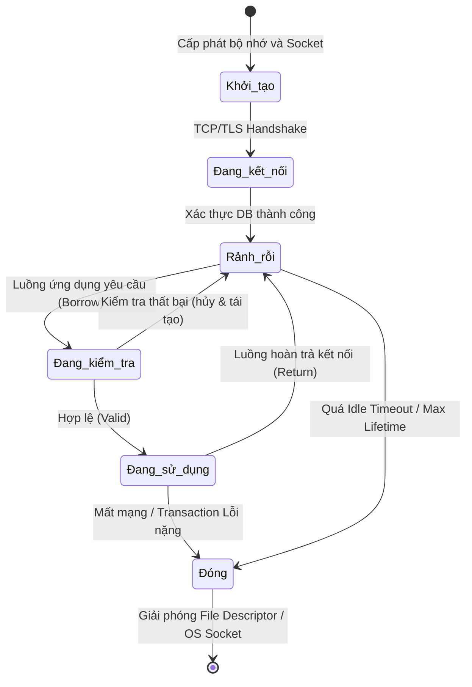
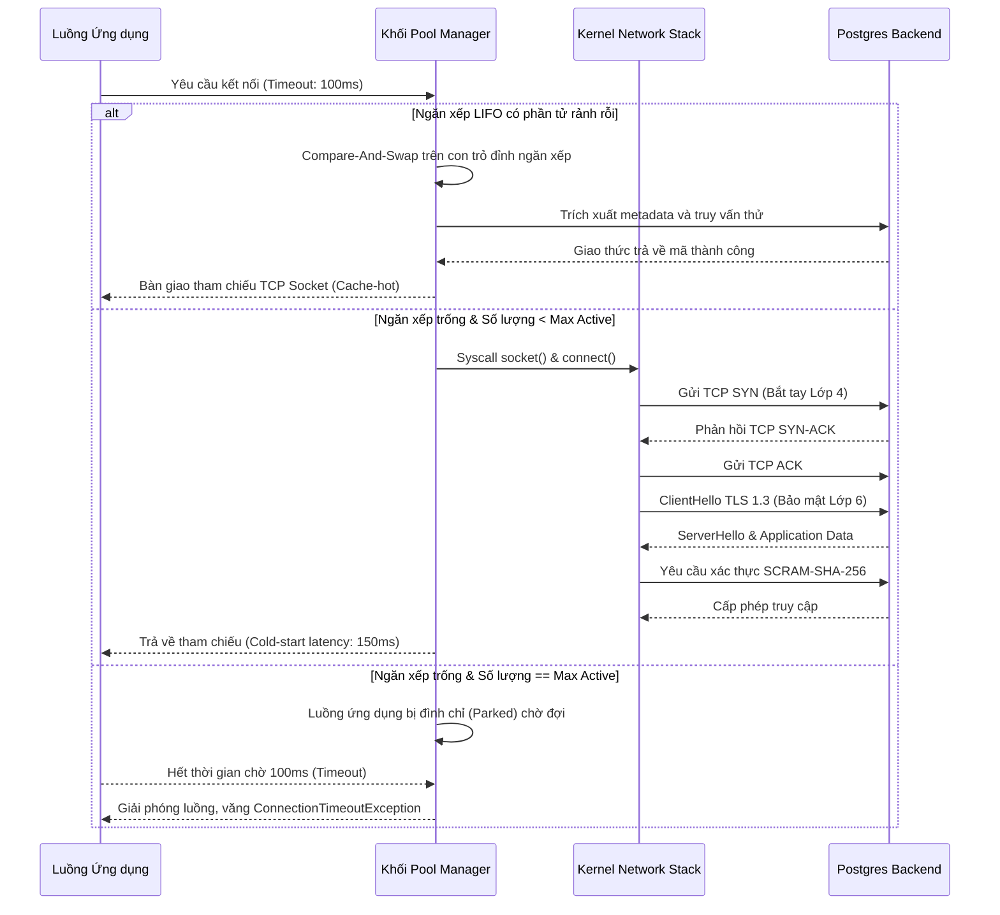

# Database Connection Pooling: Từ Vi kiến trúc đến Tương tác Hệ điều hành

## Tóm tắt và Vấn đề Cốt lõi

Trong các hệ thống phân tán, kiến trúc microservices và ứng dụng web hiện đại, giao tiếp giữa tầng ứng dụng và cơ sở dữ liệu thường là nút thắt cổ chai nghiêm trọng nhất về hiệu năng. Và phần lớn thời gian, gốc rễ của vấn đề nằm ở cách hệ thống quản lý connection - đây chính là lý do database connection pooling xứng đáng được hiểu kỹ hơn là chỉ "cấu hình một số mặc định rồi bỏ qua".

**Vấn đề cốt lõi là gì?** Thiết lập một kết nối mới tới database không đơn thuần là mở một kênh truyền vật lý - đó là một chuỗi thủ tục khá nặng, tốn cả tài nguyên lẫn thời gian:
1. Phân giải tên miền (DNS Resolution).
2. Bắt tay ba bước (3-way handshake) của TCP ở tầng Transport.
3. Đàm phán tham số bảo mật và trao đổi khóa mã hóa trong TLS ở tầng Session.
4. Xác thực người dùng, phân quyền, và cấp phát vùng nhớ ở tầng database engine.

Tổng thời gian cho chuỗi thủ tục này thường rơi vào khoảng vài chục đến vài trăm mili-giây. Với các hệ thống cần độ trễ cực thấp và thông lượng hàng chục nghìn giao dịch mỗi giây (TPS), con số đó là không thể chấp nhận. Nếu ứng dụng phải gánh chi phí khởi tạo mạng này cho mỗi request, thời gian đáp ứng trung bình sẽ tăng vọt, kéo theo tích tụ tải, cạn kiệt thread, và nguy cơ sụp đổ dây chuyền.

Để giải quyết bài toán này, **database connection pooling** ra đời như một lớp trung gian quản lý và tái sử dụng các kết nối đã thiết lập. Thay vì khởi tạo rồi hủy liên tục, connection pool duy trì sẵn một tập kết nối thường trực, sẵn sàng phục vụ ngay khi ứng dụng cần. Cơ chế này không chỉ loại bỏ độ trễ cold-start, mà còn hoạt động như một van an toàn, giới hạn tài nguyên mạng và ngăn OS cạn kiệt bộ nhớ khi số kết nối đồng thời vượt ngưỡng phần cứng chịu được.

Bài viết này đi sâu vào cơ chế nội tại của connection pool - cấu trúc dữ liệu (lock-free, LIFO/FIFO), mô hình toán học (lý thuyết hàng đợi), và cách connection pool tương tác với OS kernel. Đây là kiến thức nền cần thiết cho bất kỳ software architect nào muốn thiết kế và tối ưu hệ thống xử lý dữ liệu quy mô lớn.

---

## Kiến trúc Vi mô và Cơ chế Quản lý Trạng thái Kết nối

Đằng sau API tưởng chừng đơn giản của một connection pool (như HikariCP trong Java, `database/sql` trong Go, hay pool của `psycopg2` trong Python) là một kiến trúc khá tinh vi, được thiết kế để đảm bảo tính toàn vẹn dữ liệu và hiệu năng tối đa trong môi trường đa luồng cạnh tranh gay gắt.

### Bộ máy Trạng thái của một Kết nối

Thành phần cốt lõi ở đây là một finite state machine quản lý vòng đời từng kết nối vật lý. Một kết nối trong pool thường ở một trong các trạng thái sau:

1. **Uninitialized (Chưa khởi tạo):** socket chưa mở, chưa cấp phát tài nguyên.
2. **Idle (Rảnh rỗi):** đã kết nối tới DB thành công, sạch sẽ, đang nằm trong hàng đợi hoặc ngăn xếp.
3. **In-Use / Borrowed (Đang sử dụng):** một luồng ứng dụng đã mượn kết nối này để chạy truy vấn.
4. **Testing (Đang kiểm tra):** pool âm thầm gửi ping để xác nhận kết nối chưa bị firewall cắt đứt.
5. **Closed / Evicted (Đã đóng):** kết nối bị đánh dấu quá hạn (max lifetime), mất mạng, hoặc không còn cần thiết, đang chờ garbage collector dọn dẹp.

Việc chuyển đổi giữa các trạng thái này phải là **nguyên tử**, để tránh race condition khi nhiều luồng cùng tranh một kết nối rảnh, hoặc tệ hơn là cố gửi dữ liệu qua một kết nối đã đóng ở cấp socket.



### Tránh Hiệu ứng Convoy và Đồng bộ Lock-Free

Các thư viện connection pool đời đầu như C3P0 hay DBCP thường dùng global mutex để bảo vệ toàn bộ mảng kết nối. Cách này khiến hiệu năng giảm mạnh khi số luồng tranh chấp tăng lên - hiện tượng này gọi là **convoy effect**. Hàng trăm luồng ứng dụng phải xếp hàng chỉ để cập nhật trạng thái của một biến boolean, và hệ thống dồn hết năng lượng vào context switching thay vì xử lý truy vấn thực sự.

Các pool hiện đại hơn - HikariCP là ví dụ tiêu biểu, thường được xem là pool nhanh nhất cho JVM - gần như từ bỏ hoàn toàn khóa truyền thống. Thay vào đó chúng dùng cấu trúc dữ liệu lock-free, hoặc biến atomic với chỉ thị Compare-And-Swap (CAS) mà tập lệnh CPU cung cấp trực tiếp (như `LOCK CMPXCHG` trên x86).

Thiết kế cấu trúc dữ liệu này cũng cần cẩn thận với **false sharing** ở mức CPU cache. Nếu nhiều biến atomic (như biến đếm số kết nối đang active) nằm chung một cache line (thường 64 byte), việc cập nhật ở một core CPU sẽ làm vô hiệu hóa toàn bộ cache line đó trên core khác, do giao thức cache coherence MESI. Kỹ thuật **cache line padding** - chèn thêm byte vô nghĩa giữa các biến trạng thái để ép chúng nằm trên các cache line riêng - giải quyết triệt để nút thắt phần cứng này.

### Dead Connections và Keep-alive Diagnostics

Connection pool phải đối mặt với một bài toán kinh điển của hệ thống phân tán: làm sao biết đầu bên kia còn sống? Sự cố mạng tạm thời, firewall/NAT tự động cắt kết nối rảnh sau 5-10 phút (hiện tượng TCP half-open), hay DBA khởi động lại máy chủ database vào ban đêm đều là nguyên nhân phổ biến. Một kết nối TCP có thể được OS phía client coi là `ESTABLISHED`, trong khi database server đã âm thầm dọn nó từ lâu.

Cách kinh điển để xử lý là chạy một truy vấn "test-on-borrow" (`SELECT 1`, hoặc gọi `ping()` ở tầng giao thức). Cách này đảm bảo ứng dụng không bao giờ nhận phải kết nối chết, nhưng lại cộng thêm độ trễ vào mọi lần mượn kết nối. Với các ứng dụng giao dịch tần suất cao (high-frequency trading), độ trễ này có thể phá hỏng cả hệ thống.

Ngày nay, các pool tối ưu hơn (và các driver JDBC thế hệ mới) chuyển việc kiểm tra này sang hai cơ chế:
1. **Background eviction thread:** một luồng nền định kỳ quét danh sách rảnh và kiểm tra ngẫu nhiên.
2. **JDBC4 `isValid()` API:** tận dụng trực tiếp gói PING ở tầng giao thức nhị phân của database - thay vì parse chuỗi SQL - hoặc dùng luôn tính năng `SO_KEEPALIVE` ở tầng TCP/IP của hệ điều hành.

```rust
// Mô phỏng kiến trúc Lock-Free Connection Pool bằng Rust
use std::sync::atomic::{AtomicUsize, Ordering};
use std::sync::Arc;
use crossbeam_queue::ArrayQueue;

struct DbConnection {
    id: u32,
    is_valid: bool,
    created_at: u64,
}

struct ConnectionPool {
    connections: ArrayQueue<DbConnection>,
    active_count: AtomicUsize,
    max_size: usize,
}

impl ConnectionPool {
    fn new(max_size: usize) -> Arc<Self> {
        Arc::new(ConnectionPool {
            connections: ArrayQueue::new(max_size),
            active_count: AtomicUsize::new(0),
            max_size,
        })
    }

    fn acquire(&self) -> Result<DbConnection, String> {
        // Thuật toán lock-free: Lấy kết nối nhanh nhất có thể
        while let Some(conn) = self.connections.pop() {
            if self.test_connection(&conn) {
                self.active_count.fetch_add(1, Ordering::SeqCst);
                return Ok(conn);
            }
        }
        
        let current_active = self.active_count.load(Ordering::Relaxed);
        if current_active < self.max_size {
            // Đẩy logic mạng TCP Handshake siêu đắt đỏ ra khỏi ranh giới CAS
            let new_conn = self.create_physical_connection();
            self.active_count.fetch_add(1, Ordering::SeqCst);
            return Ok(new_conn);
        }
        
        Err("Pool exhausted: Hàng đợi chờ kết nối đã đạt ngưỡng tối đa".to_string())
    }

    fn release(&self, mut conn: DbConnection) {
        self.active_count.fetch_sub(1, Ordering::SeqCst);
        if conn.is_valid {
            // Cập nhật trạng thái và đẩy lại vào cấu trúc, kích hoạt cache L1/L2
            let _ = self.connections.push(conn);
        }
    }

    fn test_connection(&self, conn: &DbConnection) -> bool {
        // Có thể thực thi PING bất đồng bộ
        conn.is_valid
    }

    fn create_physical_connection(&self) -> DbConnection {
        // OS thao tác sys calls socket(), connect() ...
        DbConnection { id: 0, is_valid: true, created_at: 0 }
    }
}
```

---

## LIFO đối đầu FIFO: Cuộc chiến diễn ra ngay trên CPU Cache

Quyết định dùng hàng đợi (FIFO) hay ngăn xếp (LIFO) để tổ chức các kết nối rảnh (idle connections) nghe có vẻ nhỏ nhặt, nhưng lại tạo ra khác biệt rõ rệt ở mức vi mạch.

Thoạt nhìn, **FIFO** có vẻ công bằng hơn: mỗi kết nối luân phiên chia sẻ tải, không có kết nối nào bị bỏ quên quá lâu rồi bị firewall cắt (timeout). Nhưng cái công bằng đó sụp đổ ngay khi va vào thực tế phần cứng.

Với **LIFO**, kết nối vừa được trả về pool sẽ nằm ngay đỉnh ngăn xếp, và nhiều khả năng sẽ được một luồng khác lấy ra dùng lại chỉ trong vài mili-giây tiếp theo. Điều này mang lại lợi thế thực sự đáng kể: **tính cục bộ bộ nhớ (cache locality)**.
- Ở userspace, cấu trúc dữ liệu mô tả kết nối vẫn còn "nóng" trong L1/L2 cache của CPU.
- Ở kernel space, cấu trúc `struct socket`, khối `sk_buff` chứa luồng TCP, và các con trỏ ngữ cảnh cũng đều vẫn còn trên cache.

Dùng FIFO, kết nối lấy ra luôn là kết nối cũ nhất - bộ nhớ mô tả nó có thể đã bị swap out hoặc đẩy khỏi cache, buộc CPU phải truy xuất RAM, tốn tới hàng trăm chu kỳ clock. Ngoài ra, LIFO còn có tác dụng phụ hữu ích: nó *cô lập* tải mạng vào một nhóm nhỏ kết nối ở đỉnh ngăn xếp. Các kết nối nằm dưới đáy sẽ nhanh chóng chạm ngưỡng `idle_timeout` và bị thu hồi một cách tự nhiên - tính đàn hồi này giúp giải phóng file descriptor và ephemeral port trả lại cho hệ thống.

Chính vì lý do đó, phần lớn thư viện connection pool tốt hiện nay đều ưu tiên mô hình LIFO.

---

## Mô hình Toán học: Định cỡ Pool bằng Lý thuyết Hàng đợi

Định cỡ (sizing) một connection pool không phải trò đoán mò, càng không phải chuyện đặt đại `Max_Connections = 1000` rồi hy vọng hệ thống chạy nhanh hơn. Trên thực tế, **over-provisioning** số kết nối lại chính là nguyên nhân số một khiến máy chủ database chao đảo.

Mỗi kết nối TCP mở tới database tiêu tốn RAM (khoảng 2-10MB cho mỗi process xử lý trên PostgreSQL/Oracle), chiếm tài nguyên của lock manager, và gây phân mảnh page table.

### Mô hình Hàng đợi M/M/c và Định luật Little

Ta có thể mô hình hóa động lực này bằng lý thuyết hàng đợi, cụ thể là mô hình $M/M/c$:
- **M (Markovian):** các request đến theo phân phối Poisson.
- **M (Markovian):** thời gian phục vụ của database tuân theo phân phối mũ.
- **c:** số kết nối tối đa trong pool.

**Định luật Little** cho ta một góc nhìn tổng quát:
$$ L = \lambda \times W $$
Trong đó:
- $L$: số request trung bình đang nằm trong hệ thống.
- $\lambda$: tốc độ request (số giao dịch mỗi giây, TPS).
- $W$: thời gian đáp ứng, bằng tổng thời gian chờ lấy kết nối ($W_q$) cộng thời gian thực thi I/O tại database ($W_s$).

Khi hệ thống gặp traffic spike, $\lambda$ tăng mạnh, tiến sát khả năng phục vụ của $c$ kết nối. Lúc đó thời gian chờ ở pool ($W_q$) bùng nổ theo hàm mũ.

### Luật Mở rộng Phổ quát (Universal Scalability Law - USL)

Nhiều người nghĩ đơn giản: "vậy sao không tăng $c$ lên 5000 để khỏi phải chờ?" Câu trả lời nằm ở USL của tiến sĩ Neil Gunther. Khả năng mở rộng của một hệ thống xử lý song song (như database backend) tuân theo phương trình:

$$ X(N) = \frac{\gamma N}{1 + \alpha(N - 1) + \beta N(N - 1)} $$

- $N$: số luồng/kết nối đang chạy song song.
- $\alpha$: chi phí tranh chấp (contention) - ví dụ nhiều luồng cùng lock một dòng dữ liệu, hoặc tranh nhau ghi vào Write-Ahead Log (WAL).
- $\beta$: chi phí đồng bộ cache và context switching - đại diện cho việc CPU phải liên tục chuyển đổi ngữ cảnh giữa các luồng.

Số hạng bậc hai $\beta N(N - 1)$ ở mẫu số mới là thứ đáng ngại nhất. Khi $N$ (số kết nối mở) vượt xa số core CPU vật lý của máy chủ database, mẫu số phình to theo cấp số nhân, và thông lượng tổng $X(N)$ rơi tự do. Đây là hiện tượng **thrashing** - tranh chấp hỗn loạn.

**Công thức kinh nghiệm quen thuộc của PostgreSQL:**
> Kích thước pool tối ưu = (số core CPU vật lý × 2) + số đĩa cơ học (spindles)

Nhưng ở thời SSD NVMe, thời gian chờ đĩa gần như bằng không, nên số kết nối đang active chỉ cần lớn hơn số core CPU một chút là đủ. Một DB server 32 core, với pool `Max_Active` khoảng 60-80, thường cho TPS cao hơn hẳn so với một pool cấu hình 1000 kết nối.



---

## Tương tác Cấp Hệ điều hành và Khủng hoảng Cạn kiệt Cổng

Mọi cấu trúc logic ở tầng ứng dụng cuối cùng đều bám vào kernel space. Cấu trúc socket đại diện cho một liên kết TCP/IP, yêu cầu kernel Linux cấp phát buffer gửi `SO_SNDBUF` và buffer nhận `SO_RCVBUF`. Với TCP Window Scaling, một kết nối dù đang rảnh cũng chiếm vài chục KB kernel memory không thể swap.

### Khủng hoảng TIME_WAIT và Ephemeral Port

Một dạng khủng hoảng dễ bị bỏ qua nhưng gây hậu quả thật là cạn kiệt dải ephemeral port cục bộ. Theo giao thức TCP, khi connection pool (client) chủ động đóng một kết nối (do hết `Idle Timeout` hoặc `Max Lifetime`), kết nối đó *không biến mất ngay*. Socket chuyển sang trạng thái `TIME_WAIT`.

Trạng thái này kéo dài $2 \times MSL$ (Maximum Segment Lifetime), mặc định là **60 giây** trên Linux. Lý do: TCP cần giữ cổng này trong bảng định tuyến để đảm bảo các gói tin đi lạc (delayed packets) của kết nối cũ không vô tình lọt vào một kết nối mới tái sử dụng đúng cổng đó.

Nếu connection pool cấu hình không tốt, liên tục tạo/hủy hàng trăm kết nối mỗi giây, hàng chục nghìn cổng sẽ bị dồn vào trạng thái `TIME_WAIT`. Dải cổng tự do của hệ điều hành (thường 32768-60999) sẽ cạn kiệt. Lệnh `connect()` sẽ báo lỗi `EADDRNOTAVAIL`, hoặc hệ thống không thể mở thêm bất kỳ kết nối outbound nào tới Redis, Kafka hay Elasticsearch nữa.

**Cách khắc phục:**
1. Giữ vòng đời kết nối (`max_lifetime`) đủ dài (30 phút đến 1 tiếng) để tránh churn rate quá cao.
2. Tinh chỉnh kernel Linux cẩn thận qua tham số sysctl: `net.ipv4.tcp_tw_reuse = 1` (cho phép tái sử dụng cổng an toàn dựa trên TCP timestamps).

### Tối ưu Socket bằng C/C++

Ở tầng thấp, kỹ sư có thể can thiệp trực tiếp vào OS để điều chỉnh hành vi socket của pool.

```cpp
#include <sys/socket.h>
#include <netinet/in.h>
#include <netinet/tcp.h>
#include <unistd.h>
#include <stdexcept>

class SocketTuner {
public:
    static void configure_database_socket(int socket_fd) {
        int keepalive = 1;
        int keepidle = 60;   // Ngưỡng rảnh rỗi trước khi gửi thăm dò (giây)
        int keepintvl = 10;  // Chu kỳ gửi tín hiệu báo sống (giây)
        int keepcnt = 3;     // Số lần lỗi trước khi đánh dấu kết nối chết
        int tcp_nodelay = 1; // Vô hiệu hóa Nagle Algorithm

        // Bật tính năng thăm dò độ sống ngầm tại tầng giao thức OS (Layer 4)
        if (setsockopt(socket_fd, SOL_SOCKET, SO_KEEPALIVE, &keepalive, sizeof(keepalive)) < 0) {
            throw std::runtime_error("Lỗi cấu hình SO_KEEPALIVE");
        }
        
        // Điều chỉnh biên độ thời gian thăm dò tối ưu để tránh Firewall (TCP KeepAlive)
        setsockopt(socket_fd, IPPROTO_TCP, TCP_KEEPIDLE, &keepidle, sizeof(keepidle));
        setsockopt(socket_fd, IPPROTO_TCP, TCP_KEEPINTVL, &keepintvl, sizeof(keepintvl));
        setsockopt(socket_fd, IPPROTO_TCP, TCP_KEEPCNT, &keepcnt, sizeof(keepcnt));

        // CRITICAL TỐI ƯU: Truy vấn SQL thường có kích thước rất nhỏ. 
        // Thuật toán Nagle (mặc định) sẽ làm chậm giao dịch vì nó cố gom các gói nhỏ. 
        // Bắt buộc loại bỏ Nagle để có độ trễ siêu thấp.
        setsockopt(socket_fd, IPPROTO_TCP, TCP_NODELAY, &tcp_nodelay, sizeof(tcp_nodelay));
    }
};
```

---

## Kiến trúc Lớp Trung gian: Transaction Pooler và Epoll

Ở tầng hạ tầng, các RDBMS cổ điển như PostgreSQL vận hành theo mô hình "một process cho mỗi kết nối". Khi hệ sinh thái microservices có hàng nghìn pod/container, mỗi cái mở một pool 20 kết nối, tổng cộng 20.000 kết nối chĩa thẳng vào DB - máy chủ PostgreSQL sẽ tê liệt gần như ngay lập tức vì OS hết bộ nhớ và CPU ngập trong context switching.

Cách giải quyết phổ biến của ngành là dùng một lớp proxy trung gian gọi là **Transaction Pooler** - điển hình như **PgBouncer**, **Odyssey**, hay **ProxySQL**.

Các phần mềm này chạy trên kiến trúc I/O bất đồng bộ, dùng vòng lặp sự kiện non-blocking như `epoll` trên Linux.
Cơ chế **transaction-level multiplexing** hoạt động như sau:
1. Pooler cho phép hàng vạn ứng dụng client duy trì kết nối TCP ảo (frontend connections).
2. Phía sau, Pooler chỉ giữ đúng số lượng kết nối thực (backend connections) tương ứng với số core CPU của database.
3. Khi một luồng client gửi lệnh `BEGIN`, Pooler cấp cho luồng đó một backend connection vật lý.
4. Ngay khi luồng client gửi `COMMIT`, backend connection đó bị thu hồi ngay lập tức - kể cả khi client chưa disconnect - và chuyển cho một giao dịch khác đang chờ.

Nhờ cơ chế multiplexing này, database chỉ cần làm việc với một tập kết nối cố định, tối ưu hóa việc dùng L3 cache của CPU, và hệ thống có thể chịu tải hàng tỷ request mà không sụp đổ.

---

## Bài học Rút ra và Kinh nghiệm Thực tiễn

1. **Định cỡ theo hiệu năng, không phải theo mức độ tắc nghẽn.** Kích thước pool lý tưởng tỷ lệ thuận với số core vật lý của máy chủ DB (công thức phổ biến là `Cores × 2`), chứ không tỷ lệ thuận với lượng request từ ứng dụng. Cấp dư thừa sẽ kích hoạt USL, đẩy hiệu năng vào vùng thrashing.
2. **Kiểm soát Max Lifetime.** Nên luôn cấu hình `max_lifetime` (thường 15-60 phút). Các driver C/C++ ở tầng dưới của DB đôi khi có memory leak nhỏ, tích tụ dần. Đóng và kết nối lại sau khoảng 1 tiếng là cách đơn giản để reset trạng thái heap memory của tiến trình DB.
3. **Luôn bật TCP_NODELAY.** Đảm bảo tắt thuật toán Nagle - đừng để hệ điều hành cố tình trì hoãn các gói tin mang lệnh SQL chỉ để tiết kiệm băng thông.
4. **Theo dõi trạng thái TIME_WAIT.** Nếu web server liên tục báo lỗi `Connection refused` hoặc timeout trong khi CPU vẫn rảnh, hãy thử chạy `netstat -nat | awk '{print $6}' | sort | uniq -c`. Nếu số lượng TIME_WAIT lên tới 40.000 trở lên, nhiều khả năng pool đang cấu hình sai (đóng mở kết nối liên tục), dẫn tới cạn kiệt dải ephemeral port.
5. **Đừng lạm dụng SELECT 1.** Hạn chế các cơ chế "test-on-borrow" dựa trên truy vấn SQL cho mỗi lần lấy kết nối. Thay vào đó, nên dùng các pool hiện đại đã tích hợp cơ chế keep-alive nền hoặc JDBC4 API để giảm overhead mạng.

---
