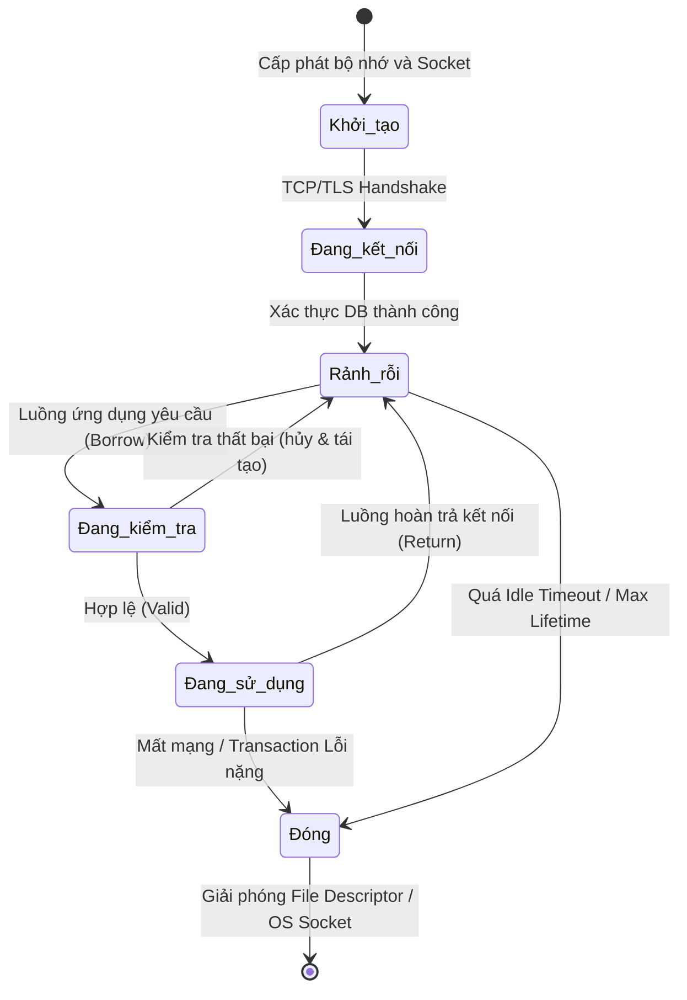
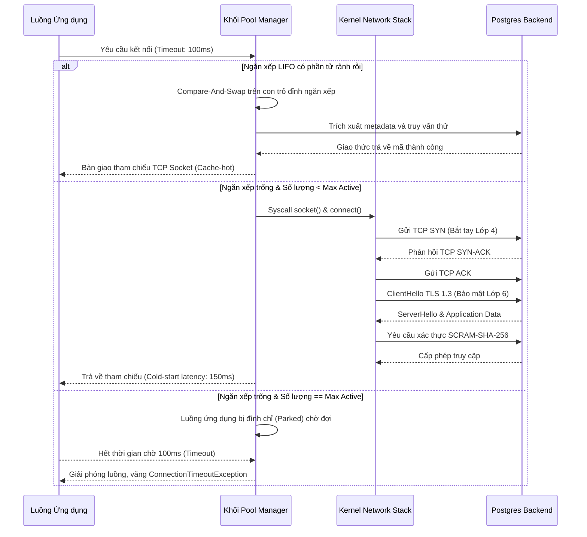

# Bản Chất Kỹ Thuật Của Database Connection Pooling: Vi Kiến Trúc, Mô Hình Toán Học Và Tương Tác Mức Hệ Điều Hành

## Tóm Tắt và Vấn Đề Cốt Lõi

Trong các hệ thống phân tán, kiến trúc microservices và ứng dụng web hiện đại, giao tiếp giữa tầng ứng dụng và tầng cơ sở dữ liệu thường là nút thắt cổ chai lớn nhất về hiệu năng.

**Vấn đề cốt lõi:** mở một kết nối mới tới database không đơn thuần là bật một đường truyền dữ liệu — đó là cả một chuỗi thủ tục tốn thời gian và tài nguyên:
1. Phân giải tên miền (DNS resolution).
2. Bắt tay ba bước TCP ở tầng transport.
3. Đàm phán TLS, trao đổi khóa mã hóa ở tầng session.
4. Xác thực người dùng, phân quyền, và cấp phát bộ nhớ ở tầng database engine.

Toàn bộ chuỗi này thường mất từ vài chục đến vài trăm mili-giây. Với hệ thống cần độ trễ thấp và thông lượng hàng chục nghìn giao dịch mỗi giây, con số đó là không thể chấp nhận. Nếu ứng dụng phải chịu độ trễ khởi tạo này cho *mỗi* yêu cầu, thời gian phản hồi trung bình sẽ tăng vọt, kéo theo tải tích tụ, cạn kiệt thread, và nguy cơ sập dây chuyền.

**Database connection pooling** ra đời để giải quyết đúng bài toán này: một lớp trung gian quản lý và tái sử dụng các kết nối đã mở sẵn. Thay vì mở rồi đóng liên tục, connection pool giữ một tập kết nối thường trực, sẵn sàng phục vụ ngay khi ứng dụng cần. Nó không chỉ loại bỏ độ trễ khởi tạo (cold-start latency) mà còn đóng vai trò như một van an toàn, giới hạn số kết nối đồng thời để tránh làm cạn kiệt tài nguyên hệ điều hành.

Bài viết này đi vào các cơ chế bên trong: thuật toán cấp phát (lock-free, LIFO/FIFO), mô hình toán học dựa trên lý thuyết hàng đợi, và cách connection pool tương tác với nhân hệ điều hành — những kiến thức nền cần thiết để thiết kế và tối ưu hệ thống dữ liệu quy mô lớn.

---

## Kiến Trúc Vi Mô và Quản Lý Trạng Thái Kết Nối

Bên dưới giao diện lập trình có vẻ đơn giản của một connection pool (HikariCP trong Java, `database/sql` trong Go, hay pool của `psycopg2` trong Python) là một kiến trúc khá tinh vi, được thiết kế để đảm bảo tính toàn vẹn dữ liệu và hiệu năng cao trong môi trường đa luồng cạnh tranh gay gắt.

### Máy Trạng Thái Của Một Kết Nối

Trung tâm của kiến trúc này là một máy trạng thái hữu hạn quản lý vòng đời từng kết nối vật lý. Một kết nối trong pool thường ở một trong các trạng thái sau:

1. **Uninitialized:** socket chưa mở, chưa cấp phát tài nguyên.
2. **Idle:** đã kết nối tới DB thành công, sạch sẽ, đang nằm trong hàng đợi/ngăn xếp chờ.
3. **In-Use / Borrowed:** một luồng ứng dụng đang mượn kết nối này để chạy truy vấn.
4. **Testing:** pool đang âm thầm gửi ping để xác nhận kết nối chưa bị đứt.
5. **Closed / Evicted:** kết nối bị đánh dấu quá hạn (max lifetime), đứt mạng, hoặc không còn cần và đang chờ được dọn dẹp.

Việc chuyển đổi giữa các trạng thái này phải diễn ra một cách nguyên tử để tránh race condition — trường hợp nhiều luồng cùng tranh một kết nối rảnh, hoặc tệ hơn, cố gửi dữ liệu qua một kết nối đã bị đóng ở tầng socket.



### Tránh Hiệu Ứng Đoàn Xe và Đồng Bộ Không Khóa

Các thư viện connection pool đời đầu (C3P0, DBCP) thường dùng một mutex toàn cục để bảo vệ toàn bộ mảng kết nối. Cách này gây suy giảm hiệu năng nghiêm trọng khi số luồng tranh chấp tăng lên — hiện tượng gọi là **hiệu ứng đoàn xe (convoy effect)**: hàng trăm luồng xếp hàng chỉ để cập nhật một biến boolean, tiêu tốn phần lớn năng lực hệ thống vào việc chuyển ngữ cảnh thay vì xử lý truy vấn thật sự.

Các pool hiện đại — HikariCP là ví dụ tiêu biểu, thường được coi là pool nhanh nhất trên JVM — từ bỏ hẳn khóa truyền thống, chuyển sang cấu trúc dữ liệu lock-free hoặc dùng biến nguyên tử với chỉ thị Compare-And-Swap (CAS) do CPU cung cấp trực tiếp (như lệnh `LOCK CMPXCHG` trên x86).

Thiết kế này cũng phải cẩn trọng với hiện tượng **false sharing** ở tầng cache CPU. Khi nhiều biến nguyên tử (như biến đếm số kết nối đang hoạt động) nằm chung một cache line (thường 64 byte), việc cập nhật ở lõi CPU 1 sẽ vô hiệu hóa toàn bộ cache line đó trên lõi CPU 2 do giao thức cache coherence MESI. Kỹ thuật **cache line padding** — chèn thêm byte đệm giữa các biến trạng thái để ép chúng nằm trên các cache line riêng — được dùng phổ biến để giải quyết nút thắt phần cứng này.

### Kết Nối Chết và Cơ Chế Keep-alive

Connection pool luôn phải đối mặt với câu hỏi kinh điển của hệ thống phân tán: làm sao biết đầu bên kia còn sống? Sự cố mạng tạm thời, firewall/NAT tự động cắt kết nối rảnh sau 5-10 phút (TCP half-open), hay việc DBA restart server ban đêm đều là nguyên nhân phổ biến. Một kết nối TCP có thể vẫn hiện `ESTABLISHED` phía client, trong khi server database đã âm thầm vứt bỏ nó từ lâu.

Cách làm truyền thống là "test-on-borrow" — chạy một câu lệnh nhẹ như `SELECT 1` hoặc gọi `ping()` mỗi lần mượn kết nối. Cách này đảm bảo ứng dụng không bao giờ nhận một kết nối chết, nhưng lại cộng thêm độ trễ vào *mọi* lần mượn kết nối. Với các ứng dụng giao dịch tần suất cao, độ trễ này là không chấp nhận được.

Các pool tối ưu ngày nay chuyển việc kiểm tra sang hai hướng:
1. **Background eviction thread:** một luồng nền định kỳ quét và kiểm tra ngẫu nhiên các kết nối rảnh.
2. **JDBC4 `isValid()`:** tận dụng gói tin ping ở tầng giao thức nhị phân của database (thay vì chạy câu SQL dạng chuỗi), hoặc dùng thẳng `SO_KEEPALIVE` ở tầng TCP/IP.

```rust
// Mô phỏng kiến trúc Lock-Free Connection Pool bằng Rust
use std::sync::atomic::{AtomicUsize, Ordering};
use std::sync::Arc;
use crossbeam_queue::ArrayQueue;

struct DbConnection {
    id: u32,
    is_valid: bool,
    created_at: u64,
}

struct ConnectionPool {
    connections: ArrayQueue<DbConnection>,
    active_count: AtomicUsize,
    max_size: usize,
}

impl ConnectionPool {
    fn new(max_size: usize) -> Arc<Self> {
        Arc::new(ConnectionPool {
            connections: ArrayQueue::new(max_size),
            active_count: AtomicUsize::new(0),
            max_size,
        })
    }

    fn acquire(&self) -> Result<DbConnection, String> {
        // Thuật toán lock-free: Lấy kết nối nhanh nhất có thể
        while let Some(conn) = self.connections.pop() {
            if self.test_connection(&conn) {
                self.active_count.fetch_add(1, Ordering::SeqCst);
                return Ok(conn);
            }
        }
        
        let current_active = self.active_count.load(Ordering::Relaxed);
        if current_active < self.max_size {
            // Đẩy logic mạng TCP Handshake siêu đắt đỏ ra khỏi ranh giới CAS
            let new_conn = self.create_physical_connection();
            self.active_count.fetch_add(1, Ordering::SeqCst);
            return Ok(new_conn);
        }
        
        Err("Pool exhausted: Hàng đợi chờ kết nối đã đạt ngưỡng tối đa".to_string())
    }

    fn release(&self, mut conn: DbConnection) {
        self.active_count.fetch_sub(1, Ordering::SeqCst);
        if conn.is_valid {
            // Cập nhật trạng thái và đẩy lại vào cấu trúc, kích hoạt cache L1/L2
            let _ = self.connections.push(conn);
        }
    }

    fn test_connection(&self, conn: &DbConnection) -> bool {
        // Có thể thực thi PING bất đồng bộ
        conn.is_valid
    }

    fn create_physical_connection(&self) -> DbConnection {
        // OS thao tác sys calls socket(), connect() ...
        DbConnection { id: 0, is_valid: true, created_at: 0 }
    }
}
```

---

## LIFO Đối Đầu FIFO Trên CPU Cache

Quyết định dùng hàng đợi (FIFO) hay ngăn xếp (LIFO) để tổ chức các kết nối rảnh tạo ra khác biệt đáng kể ở mức vi mạch.

Thoạt nhìn, **FIFO** có vẻ công bằng: mỗi kết nối lần lượt chia sẻ tải, không kết nối nào bị bỏ quên quá lâu đến mức bị firewall cắt. Nhưng lý tưởng công bằng này lại thua trước thực tế phần cứng.

Khi dùng **LIFO**, kết nối vừa được trả về pool nằm ngay trên đỉnh ngăn xếp, và rất có khả năng sẽ được một luồng khác lấy ra dùng ngay trong vài mili-giây tiếp theo. Điều này tạo ra một lợi thế vật lý rõ rệt: **tính cục bộ bộ nhớ (cache locality)**.
- Ở userspace, cấu trúc dữ liệu mô tả kết nối vẫn đang "nóng" trong L1/L2 cache của CPU.
- Ở kernel space, cấu trúc `struct socket`, khối `sk_buff` lưu luồng TCP, và các con trỏ ngữ cảnh cũng vẫn còn trong cache.

Nếu dùng FIFO, kết nối lấy ra là kết nối cũ nhất, dữ liệu mô tả nó nhiều khả năng đã bị đẩy khỏi cache CPU, buộc CPU phải truy xuất RAM — tốn hàng trăm chu kỳ xung nhịp. Ngoài ra, LIFO còn có tác dụng phụ hữu ích: nó cô lập tải vào một nhóm nhỏ kết nối ở đỉnh ngăn xếp, còn những kết nối nằm ở đáy sẽ nhanh chóng chạm ngưỡng `idle_timeout` và được thu hồi một cách tự nhiên, trả lại file descriptor và ephemeral port cho hệ thống.

Vì lý do này, phần lớn thư viện connection pool tốt hiện nay đều ưu tiên mô hình LIFO.

---

## Định Cỡ Pool Bằng Lý Thuyết Hàng Đợi

Định cỡ (sizing) một connection pool không phải trò chơi đoán mò kiểu đặt `Max_Connections = 1000` rồi hy vọng hệ thống chạy nhanh hơn. Trên thực tế, cấp phát thừa số lượng kết nối chính là nguyên nhân hàng đầu khiến database server chao đảo.

Mỗi kết nối TCP mở tới database tốn RAM (khoảng 2-10MB mỗi tiến trình xử lý trên PostgreSQL/Oracle), tốn tài nguyên của lock manager, và làm phân mảnh page table.

### Mô Hình M/M/c và Định Luật Little

Ta có thể mô hình hóa động lực này bằng lý thuyết hàng đợi, cụ thể là mô hình $M/M/c$:
- **M (Markovian):** yêu cầu đến theo phân phối Poisson.
- **M (Markovian):** thời gian phục vụ của database theo phân phối mũ.
- **c:** số kết nối tối đa trong pool.

**Định luật Little** cho một cái nhìn tổng quan:
$$ L = \lambda \times W $$
Trong đó:
- $L$: số lượng yêu cầu trung bình đang tồn tại trong hệ thống.
- $\lambda$: tốc độ yêu cầu (request/giây).
- $W$: thời gian phản hồi, bằng thời gian chờ xếp hàng lấy kết nối ($W_q$) cộng thời gian thực thi I/O ở database ($W_s$).

Khi hệ thống bị dội lưu lượng tăng đột biến, $\lambda$ tăng mạnh, tiến sát khả năng phục vụ của $c$ kết nối. Thời gian chờ ở pool ($W_q$) khi đó sẽ tăng theo hàm mũ chứ không tuyến tính.

### Universal Scalability Law (USL)

Nhiều người sẽ hỏi: vậy sao không tăng $c$ lên 5000 để không bao giờ phải chờ? Câu trả lời nằm ở Universal Scalability Law của Neil Gunther. Khả năng mở rộng của một hệ thống xử lý song song (như backend database) tuân theo phương trình:

$$ X(N) = \frac{\gamma N}{1 + \alpha(N - 1) + \beta N(N - 1)} $$

- $N$: số luồng/kết nối hoạt động song song.
- $\alpha$: chi phí tranh chấp — ví dụ nhiều luồng cùng khóa một dòng dữ liệu, hay tranh nhau ghi vào WAL.
- $\beta$: chi phí đồng bộ bộ nhớ đệm và chuyển ngữ cảnh liên tục.

Số hạng bậc hai $\beta N(N - 1)$ ở mẫu số mới là thứ đáng sợ nhất. Khi $N$ vượt xa số lõi CPU vật lý của database server, mẫu số phình lên rất nhanh, kéo thông lượng $X(N)$ rơi tự do — hiện tượng gọi là **thrashing**.

**Công thức kinh điển của PostgreSQL:**
> Kích thước pool tối ưu = (số lõi CPU vật lý × 2) + số đĩa cơ học (spindles)

Với thời SSD NVMe hiện nay, thời gian chờ đĩa gần như bằng không, nên số kết nối đang hoạt động chỉ nên nhỉnh hơn số lõi CPU vật lý một chút. Một server 32 lõi thường đạt TPS cao hơn hẳn nếu dùng pool `Max_Active` khoảng 60-80, so với việc cấu hình pool 1000 kết nối.



---

## Tương Tác Với Hệ Điều Hành và Khủng Hoảng Cạn Kiệt Cổng

Mọi cấu trúc logic ở tầng ứng dụng cuối cùng đều bám vào không gian kernel. Cấu trúc socket đại diện cho một liên kết TCP/IP đòi hỏi kernel Linux cấp phát buffer gửi `SO_SNDBUF` và buffer nhận `SO_RCVBUF`. Với TCP window scaling, một kết nối dù đang rảnh cũng chiếm vài chục KB bộ nhớ kernel không thể swap ra ngoài.

### Khủng Hoảng TIME_WAIT và Ephemeral Port

Một dạng khủng hoảng tinh vi hơn là cạn kiệt dải cổng ephemeral cục bộ. Trong TCP, khi connection pool (client) chủ động đóng một kết nối (do hết `Idle Timeout` hay `Max Lifetime`), kết nối đó *không biến mất ngay* — socket chuyển sang trạng thái `TIME_WAIT`.

Trạng thái này kéo dài $2 \times MSL$ (Maximum Segment Lifetime), mặc định 60 giây trên Linux. Lý do: TCP cần giữ cổng này lại để đảm bảo các gói tin đi lạc của kết nối cũ không vô tình lọt vào một kết nối mới tình cờ tái sử dụng đúng cổng đó.

Nếu một connection pool cấu hình tồi, liên tục mở/đóng hàng trăm kết nối mỗi giây, nó sẽ đẩy hàng chục nghìn cổng vào trạng thái `TIME_WAIT`. Dải cổng tự do của hệ điều hành (thường 32768-60999) sẽ cạn sạch. Lệnh `connect()` sẽ thất bại với lỗi `EADDRNOTAVAIL`, và hệ thống không thể mở thêm bất kỳ kết nối outbound nào tới Redis, Kafka hay Elasticsearch.

**Cách khắc phục:**
1. Giữ `max_lifetime` đủ dài (30 phút đến 1 giờ) để tránh churn rate quá cao.
2. Tinh chỉnh tham số kernel Linux cẩn thận: `net.ipv4.tcp_tw_reuse = 1` (cho phép tái sử dụng cổng an toàn dựa trên TCP timestamp).

### Tinh Chỉnh Socket Ở Tầng C/C++

Với hệ thống tầng thấp, kỹ sư có thể can thiệp trực tiếp vào hành vi socket của pool.

```cpp
#include <sys/socket.h>
#include <netinet/in.h>
#include <netinet/tcp.h>
#include <unistd.h>
#include <stdexcept>

class SocketTuner {
public:
    static void configure_database_socket(int socket_fd) {
        int keepalive = 1;
        int keepidle = 60;   // Ngưỡng rảnh rỗi trước khi gửi thăm dò (giây)
        int keepintvl = 10;  // Chu kỳ gửi tín hiệu báo sống (giây)
        int keepcnt = 3;     // Số lần lỗi trước khi đánh dấu kết nối chết
        int tcp_nodelay = 1; // Vô hiệu hóa Nagle Algorithm

        // Bật tính năng thăm dò độ sống ngầm tại tầng giao thức OS (Layer 4)
        if (setsockopt(socket_fd, SOL_SOCKET, SO_KEEPALIVE, &keepalive, sizeof(keepalive)) < 0) {
            throw std::runtime_error("Lỗi cấu hình SO_KEEPALIVE");
        }
        
        // Điều chỉnh biên độ thời gian thăm dò tối ưu để tránh Firewall (TCP KeepAlive)
        setsockopt(socket_fd, IPPROTO_TCP, TCP_KEEPIDLE, &keepidle, sizeof(keepidle));
        setsockopt(socket_fd, IPPROTO_TCP, TCP_KEEPINTVL, &keepintvl, sizeof(keepintvl));
        setsockopt(socket_fd, IPPROTO_TCP, TCP_KEEPCNT, &keepcnt, sizeof(keepcnt));

        // CRITICAL TỐI ƯU: Truy vấn SQL thường có kích thước rất nhỏ. 
        // Thuật toán Nagle (mặc định) sẽ làm chậm giao dịch vì nó cố gom các gói nhỏ. 
        // Bắt buộc loại bỏ Nagle để có độ trễ siêu thấp.
        setsockopt(socket_fd, IPPROTO_TCP, TCP_NODELAY, &tcp_nodelay, sizeof(tcp_nodelay));
    }
};
```

---

## Lớp Trung Gian: Transaction Pooler và Epoll

Ở tầng kiến trúc hạ tầng, các RDBMS cổ điển như PostgreSQL vận hành theo mô hình "một tiến trình cho mỗi kết nối". Khi hệ sinh thái microservices có hàng nghìn pod/container, mỗi cái mở một pool 20 kết nối, tổng cộng dồn 20.000 kết nối vào DB, server PostgreSQL sẽ tê liệt gần như ngay lập tức vì hệ điều hành cạn bộ nhớ và CPU ngập trong việc chuyển ngữ cảnh.

Cách giải quyết phổ biến trong ngành là dùng một lớp proxy trung gian gọi là **transaction pooler** — PgBouncer, Odyssey, hay ProxySQL là những cái tên quen thuộc.

Các phần mềm này dùng kiến trúc I/O bất đồng bộ qua vòng lặp sự kiện non-blocking như `epoll` trên Linux. Cơ chế **transaction-level multiplexing** hoạt động như sau:
1. Pooler cho phép hàng vạn client ứng dụng duy trì kết nối TCP phía frontend.
2. Ở phía sau, pooler chỉ giữ đúng số kết nối backend tương ứng với số lõi CPU của database.
3. Khi một client gửi `BEGIN`, pooler cấp một kết nối backend vật lý cho nó.
4. Ngay khi client gửi `COMMIT`, kết nối backend đó được thu hồi lập tức (dù client chưa ngắt kết nối) và cấp cho một giao dịch khác đang chờ.

Cơ chế multiplexing này cô lập triệt để áp lực lên phần cứng, cho phép database chỉ phải làm việc với một tập kết nối cố định, tận dụng tốt L3 cache của CPU, và giúp hệ thống chịu tải hàng tỷ request mà không sụp đổ.

---

## Bài Học Rút Ra Cho Kỹ Sư Hệ Thống

1. **Định cỡ theo hiệu năng, không theo lưu lượng:** kích thước pool lý tưởng tỷ lệ với số lõi CPU vật lý của DB server (thường theo công thức `số lõi × 2`), chứ không tỷ lệ với số request từ ứng dụng. Cấp dư thừa sẽ kích hoạt Universal Scalability Law và đẩy hệ thống vào vùng thrashing.
2. **Luôn cấu hình max lifetime:** thường 15-60 phút. Các driver ở tầng dưới đôi khi có rò rỉ bộ nhớ nhỏ và chậm. Đóng và mở lại kết nối định kỳ là cách đơn giản để làm sạch trạng thái heap của tiến trình DB.
3. **Luôn bật TCP_NODELAY:** tắt hẳn thuật toán Nagle — đừng để hệ điều hành cố tình trì hoãn các gói tin mang lệnh SQL chỉ để tiết kiệm băng thông.
4. **Theo dõi trạng thái TIME_WAIT:** nếu server web liên tục gặp lỗi "connection refused" hay timeout dù CPU vẫn rảnh, hãy chạy `netstat -nat | awk '{print $6}' | sort | uniq -c`. Nếu số lượng TIME_WAIT vượt 40.000, pool của bạn đang mở/đóng kết nối quá thường xuyên, dẫn tới cạn ephemeral port.
5. **Đừng lạm dụng SELECT 1:** tránh cơ chế test-on-borrow dựa trên truy vấn SQL mỗi lần mượn kết nối. Ưu tiên các pool hiện đại dùng keep-alive nền hoặc JDBC4 API để giảm overhead mạng.
