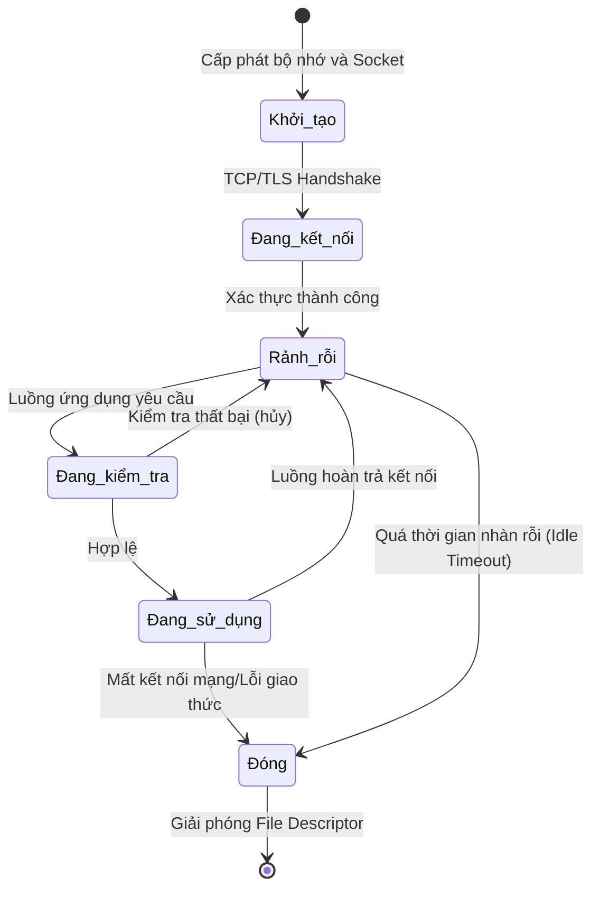
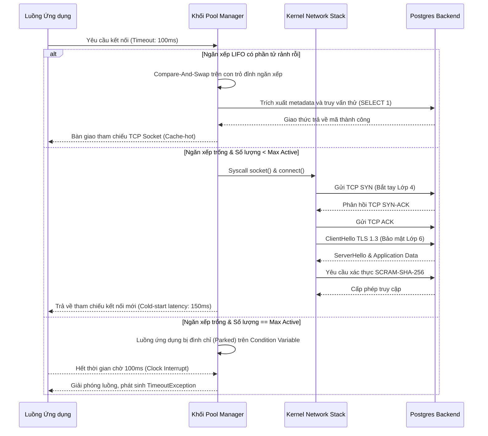

# 41: Bên dưới lớp vỏ của Database Connection Pooling

Trong các hệ thống phân tán và kiến trúc hướng dịch vụ hiện đại, giao tiếp giữa ứng dụng và cơ sở dữ liệu thường xuyên trở thành nút thắt cổ chai về mặt hiệu năng. Quá trình thiết lập một kết nối mới tới cơ sở dữ liệu không đơn thuần là việc mở một kênh truyền thông tin mà là một chuỗi các thủ tục phức tạp, tiêu tốn tài nguyên và thời gian. Quá trình này bao gồm việc phân giải tên miền, thực hiện bắt tay ba bước của giao thức Transmission Control Protocol, đàm phán các tham số bảo mật và mã hóa trong giao thức Transport Layer Security, và cuối cùng là quá trình xác thực thông tin người dùng tại mức hệ quản trị cơ sở dữ liệu. Tổng trở kháng thời gian cho chuỗi thao tác này thường dao động trong khoảng từ vài chục đến hàng trăm mili-giây, một con số không thể chấp nhận được đối với các hệ thống yêu cầu độ trễ thấp và thông lượng hàng chục nghìn giao dịch mỗi giây. Khi ứng dụng phải gánh chịu độ trễ khởi tạo mạng trên mỗi yêu cầu của người dùng, thời gian đáp ứng trung bình sẽ tăng đột biến, kéo theo sự tích tụ tải và nguy cơ sụp đổ dây chuyền (cascading failure). Để giải quyết triệt để vấn đề này, mô hình Database Connection Pooling được áp dụng như một lớp trung gian quản lý và tái sử dụng các kết nối đã được thiết lập. Thay vì khởi tạo và hủy bỏ kết nối cho mỗi yêu cầu, Connection Pool duy trì một tập hợp các kết nối thường trực, sẵn sàng phục vụ các luồng thực thi của ứng dụng. Cơ chế này không chỉ giảm thiểu độ trễ biên do quá trình khởi tạo kết nối gây ra mà còn đóng vai trò như một cơ chế kiểm soát giới hạn tài nguyên, ngăn chặn tình trạng cạn kiệt bộ nhớ hoặc quá tải bộ lập lịch của hệ điều hành do số lượng kết nối đồng thời vượt quá ngưỡng chịu đựng của phần cứng. Việc hiểu rõ các cơ chế nội tại, các thuật toán cấp phát và cách thức tương tác giữa Connection Pool với nhân hệ điều hành là nền tảng bắt buộc để thiết kế và tối ưu hóa các hệ thống xử lý dữ liệu quy mô lớn. 

## Kiến trúc vi mô và cơ chế quản lý trạng thái kết nối

Bên dưới lớp giao diện lập trình ứng dụng đơn giản của một Connection Pool là một kiến trúc vi mô tinh vi, được thiết kế để đảm bảo tính toàn vẹn dữ liệu và hiệu năng tối đa trong môi trường đa luồng có tính cạnh tranh cao. Thành phần cốt lõi của kiến trúc này là một bộ máy trạng thái hữu hạn quản lý vòng đời của từng kết nối vật lý. Một kết nối trong pool thường tồn tại ở một trong các trạng thái cơ bản: rảnh rỗi chờ phục vụ, đang được cấp phát cho một luồng ứng dụng, đang trong quá trình kiểm tra tính hợp lệ, hoặc đã bị đóng và chờ được thu gom rác. Sự chuyển đổi giữa các trạng thái này phải được thực thi một cách nguyên tử để tránh hiện tượng tương tranh (race conditions), nơi nhiều luồng ứng dụng cùng tranh giành một kết nối rảnh rỗi hoặc sử dụng một kết nối đã bị đóng. Các thư viện Connection Pool hiện đại thường từ bỏ việc sử dụng các khóa loại trừ lẫn nhau (mutexes) truyền thống trên toàn bộ tập hợp kết nối do sự suy giảm hiệu năng nghiêm trọng khi số lượng luồng tranh chấp tăng cao. Sự suy giảm này, thường được gọi là hiệu ứng hộ tống (convoy effect), có thể triệt tiêu hoàn toàn lợi ích của việc sử dụng pool. Thay vào đó, chúng áp dụng các cấu trúc dữ liệu không cần khóa (lock-free) hoặc phân chia khóa mịn (fine-grained locking). Cấu trúc dữ liệu hàng đợi đồng thời hoặc ngăn xếp dựa trên các chỉ thị nguyên tử Compare-And-Swap (CAS) của vi xử lý được sử dụng để duy trì danh sách các kết nối rảnh rỗi. Việc thiết kế mảng trạng thái cho các kết nối cũng phải cực kỳ cẩn trọng đối với hiện tượng chia sẻ sai (false sharing) tại mức kiến trúc bộ nhớ đệm CPU. Khi nhiều biến nguyên tử đếm số lượng tham chiếu của các kết nối khác nhau nằm trên cùng một dòng bộ nhớ đệm (cache line, thường là 64 bytes), việc cập nhật một kết nối sẽ làm vô hiệu hóa toàn bộ dòng bộ nhớ đệm trên các nhân CPU khác, gây ra sự suy giảm băng thông bộ nhớ. Kỹ thuật đệm dữ liệu (cache line padding) được sử dụng rộng rãi để căn chỉnh các cấu trúc điều khiển kết nối nhằm khắc phục vấn đề phần cứng tĩnh này.



Bên cạnh việc quản lý trạng thái, Connection Pool phải đối mặt với bài toán phát hiện và xử lý các kết nối chết (dead connections) hoặc zombie. Sự cố mạng, cấu hình tường lửa tự động cắt đứt các kết nối nhàn rỗi sau một ngưỡng thời gian (TCP half-open), hoặc việc hệ quản trị cơ sở dữ liệu chủ động khởi động lại, là những nguyên nhân phổ biến khiến một kết nối TCP vẫn được coi là mở ở phía bộ nhớ của client nhưng thực tế đã mất tính hợp lệ ở mức tín hiệu điện tử hoặc tại phía server. Để khắc phục sự bất đồng bộ trạng thái phân tán này, Connection Pool triển khai các cơ chế kiểm tra tính sống còn. Phương pháp truyền thống là thực thi một truy vấn kiểm tra chi phí thấp (test-on-borrow), chẳng hạn như câu lệnh lấy thời gian hệ thống hoặc một giá trị hằng số đơn giản (ví dụ `SELECT 1`), trước khi chính thức cấp phát kết nối cho ứng dụng. Mặc dù phương pháp này đảm bảo độ tin cậy cực cao bằng cách xác thực tính toàn vẹn của toàn bộ đường truyền dẫn từ mức L4 (Transport) đến L7 (Application), nó lại đưa thêm một độ trễ từ vài phần nghìn đến vài phần trăm giây vào quá trình thiết lập giao dịch. Đối với các ứng dụng giao dịch tần số cao (HFT) hoặc các proxy định tuyến dữ liệu, độ trễ này là vật cản lớn. Các mô hình pool tối ưu hơn chuyển việc kiểm tra này sang một luồng xử lý ngầm định kỳ (background eviction thread) hoặc dựa hoàn toàn vào các tính năng giám sát của ngăn xếp TCP/IP. Hơn nữa, việc quản lý thời gian sống tối đa của một kết nối (max lifetime) là yếu tố quyết định để ngăn chặn các rò rỉ bộ nhớ chậm chạp diễn ra bên trong các thư viện trình điều khiển cơ sở dữ liệu. Việc làm mới định kỳ toàn bộ nhóm kết nối đảm bảo cả tiến trình ứng dụng và tiến trình máy chủ luôn hoạt động với trạng thái heap memory sạch sẽ nhất, giải phóng không gian bộ nhớ phân mảnh.

```rust
use std::sync::atomic::{AtomicUsize, Ordering};
use std::sync::Arc;
use crossbeam_queue::ArrayQueue;

struct DbConnection {
    id: u32,
    is_valid: bool,
    created_at: u64,
}

struct ConnectionPool {
    connections: ArrayQueue<DbConnection>,
    active_count: AtomicUsize,
    max_size: usize,
}

impl ConnectionPool {
    fn new(max_size: usize) -> Arc<Self> {
        Arc::new(ConnectionPool {
            connections: ArrayQueue::new(max_size),
            active_count: AtomicUsize::new(0),
            max_size,
        })
    }

    fn acquire(&self) -> Result<DbConnection, String> {
        // Thuật toán lock-free cấp phát kết nối 
        while let Some(conn) = self.connections.pop() {
            if self.test_connection(&conn) {
                self.active_count.fetch_add(1, Ordering::SeqCst);
                return Ok(conn);
            }
        }
        
        let current_active = self.active_count.load(Ordering::Relaxed);
        if current_active < self.max_size {
            // Đẩy logic mạng đắt đỏ ra khỏi ranh giới CAS lock
            let new_conn = self.create_physical_connection();
            self.active_count.fetch_add(1, Ordering::SeqCst);
            return Ok(new_conn);
        }
        
        Err("Pool exhausted: Hàng đợi chờ kết nối đã đầy".to_string())
    }

    fn release(&self, mut conn: DbConnection) {
        self.active_count.fetch_sub(1, Ordering::SeqCst);
        if conn.is_valid {
            // Cập nhật trạng thái và trả về pool, kích hoạt cache line
            let _ = self.connections.push(conn);
        }
    }

    fn test_connection(&self, conn: &DbConnection) -> bool {
        // Thực hiện giao thức PING không đồng bộ hoặc kiểm tra trạng thái socket TCP
        conn.is_valid
    }

    fn create_physical_connection(&self) -> DbConnection {
        // Mô phỏng TCP handshake và mật mã hóa TLS đắt đỏ
        DbConnection { id: 0, is_valid: true, created_at: 0 }
    }
}
```

Sự lựa chọn giữa kiến trúc Hàng đợi (FIFO - First In First Out) và Ngăn xếp (LIFO - Last In First Out) trong việc cấu trúc dữ liệu lưu trữ các kết nối nhàn rỗi tạo ra ảnh hưởng đáng kể đến độ trễ hệ thống ở góc độ vi mạch vật lý. Thoạt nhìn, mô hình FIFO có vẻ công bằng nhất, đảm bảo tất cả các kết nối luân phiên chia sẻ tải mạng và không kết nối nào bị máy chủ cơ sở dữ liệu đóng sớm do quá hạn (timeout). Tuy nhiên, nguyên lý công bằng này thường xuyên sụp đổ trước thực tế kiến trúc của bộ nhớ máy tính hiện đại. Khi hệ thống sử dụng mô hình LIFO, kết nối vừa được một luồng trả về pool sẽ nằm ngay trên đỉnh ngăn xếp và có xác suất gần như 100% được luồng tiếp theo lấy ra sử dụng lập tức. Tại nhân hệ điều hành Linux, cấu trúc dữ liệu mô tả socket, các khối sk_buff chứa dữ liệu gửi/nhận, và các con trỏ trạng thái giao thức TCP đều đang nằm nóng rực trong bộ đệm L1/L2 của nhân CPU. CPU không phải tốn hàng trăm chu kỳ nhịp đồng hồ để trích xuất dữ liệu từ RAM. Sự hội tụ của tính cục bộ bộ nhớ (cache locality) giúp giảm thiểu mạnh mẽ độ trễ phân tán (tail latency). Bên cạnh đó, mô hình LIFO cô lập hoạt động vào một tập hợp tối thiểu các kết nối tại một thời điểm, phần lớn các kết nối dư thừa dưới đáy ngăn xếp sẽ nhanh chóng đạt ngưỡng nhàn rỗi và bị tiêu hủy. Cơ chế tự động đàn hồi này trả lại không gian file descriptor, bộ nhớ kernel, và cổng mạng (ephemeral ports) cho máy chủ, tối ưu hóa triệt để chi phí tài nguyên theo thời gian thực mà không cần sự can thiệp thủ công.

## Phân tích thuật toán cấp phát và mô hình toán học của Connection Pool

Việc xác định kích thước tối ưu của một Connection Pool không bao giờ là một phỏng đoán dựa trên cảm tính mà là một bài toán tối ưu hóa phức tạp, phụ thuộc vào bản chất vật lý của hệ lưu trữ bên dưới và mô hình xử lý đa luồng. Một lầm tưởng vô cùng phổ biến là tin rằng việc cấp phát một pool khổng lồ với hàng nghìn kết nối sẽ giải quyết được vấn đề tải cao. Ngược lại, việc quá cấp (over-provisioning) số lượng kết nối sẽ gây áp lực tàn khốc lên bộ nhớ và bộ lập lịch CPU của hệ quản trị cơ sở dữ liệu. Quá trình phân tích động lực học của hệ thống đa kết nối này có thể được mô hình hóa toán học bằng Lý thuyết Hàng đợi (Queueing Theory), cụ thể là mô hình hàng đợi $M/M/c$. Trong mô hình toán học này, quá trình đến của các luồng yêu cầu được mô phỏng theo phân phối Poisson (biểu thị bằng chữ $M$ đầu tiên), thời gian xử lý truy vấn tại cơ sở dữ liệu tuân theo phân phối mũ (chữ $M$ thứ hai), và $c$ đại diện cho giới hạn tối đa số lượng kết nối đang mở song song trong pool. Định luật Little cung cấp một lăng kính toàn cảnh về trạng thái cân bằng của hệ thống, định nghĩa mối quan hệ tuyệt đối giữa số lượng yêu cầu trung bình đang nằm trong hệ thống $L$, tốc độ xuất hiện yêu cầu mới $\lambda$, và tổng thời gian đáp ứng trung bình $W$:

$$ L = \lambda \times W $$

Trong một hệ thống được kết nối qua pool, tổng thời gian $W$ bao gồm thời gian chờ lấy kết nối khỏi ngăn xếp ($W_q$) cộng với thời gian thực thi các truy vấn I/O mạng và đĩa cứng ($W_s$). Khi tần suất các giao dịch tăng lên tiệm cận với tốc độ phục vụ tối đa của pool, giá trị $W_q$ sẽ bùng nổ theo hàm mũ. Để định lượng xác suất mà một tác vụ ứng dụng mới sẽ phải đi vào trạng thái ngủ do không còn kết nối rảnh rỗi trong pool, các kỹ sư thường sử dụng công thức Erlang C. Bằng việc định nghĩa cường độ lưu lượng $\rho = \frac{\lambda}{\mu}$ (với $\mu$ là nghịch đảo của thời gian phục vụ trung bình cho một truy vấn) và hệ số sử dụng của toàn hệ thống là $u = \frac{\rho}{c}$. Điều kiện tiên quyết để hệ thống không rơi vào trạng thái tê liệt là $u < 1$. Xác suất một tiến trình phải xếp hàng chờ đợi, $P_W$, là một biến số sinh tử cho các tính toán theo hợp đồng cam kết dịch vụ (Service Level Agreement):

$$ P_W = \frac{\frac{c^c u^c}{c!} \frac{1}{1 - u}}{\sum_{i=0}^{c-1} \frac{(c u)^i}{i!} + \frac{c^c u^c}{c!} \frac{1}{1 - u}} $$

Khả năng mở rộng thông lượng của toàn bộ kiến trúc cơ sở dữ liệu hoàn toàn không tuân theo quỹ đạo tuyến tính. Nếu việc tăng kích thước pool thực sự tăng hiệu năng một cách vô hạn, thì các giới hạn vật lý của bán dẫn sẽ trở nên vô nghĩa. Mô hình Luật Mở rộng Giới hạn (Universal Scalability Law - USL) đặc tả định lượng sự phân rã hiệu năng thông lượng $X(N)$ tương ứng với số lượng luồng thực thi song song $N$. Mô hình này bao gồm hai lực cản vật lý: tham số $\alpha$ đại diện cho sự suy biến do tranh chấp khóa (contention, điển hình như lock mutex trên cấu trúc dữ liệu index B-Tree) và tham số $\beta$ đại diện cho chi phí đồng bộ bộ nhớ đệm (coherency penalty) khi các lõi vi xử lý giao tiếp trạng thái với nhau qua bus liên kết:

$$ X(N) = \frac{\gamma N}{1 + \alpha(N - 1) + \beta N(N - 1)} $$

Sự hiện diện của thành phần bậc hai $\beta N(N - 1)$ ở phần mẫu số đóng vai trò như một lực hấp dẫn nghịch đảo phá hủy hiệu năng. Nó giải thích hoàn hảo hiện tượng tại sao khi kích thước Connection Pool vượt qua điểm uốn vật lý của biểu đồ, thông lượng hệ thống không những đi ngang mà còn rơi tự do (thrashing). Sự gia tăng khổng lồ số lượng luồng hoạt động song song trên máy chủ cơ sở dữ liệu làm tăng theo cấp số nhân các pha hoán đổi ngữ cảnh luồng (thread context switching), xóa sổ hiệu năng của bộ nhớ đệm luồng chỉ lệnh (TLB flush) và các kênh pipeline giải mã lệnh của CPU. Một công thức thực nghiệm kinh điển để định cỡ Connection Pool, ban đầu được PostgreSQL giới thiệu cho các hệ thống đĩa từ quay cơ học, là số lượng nhân bộ vi xử lý thực tế nhân với hệ số luân phiên thời gian chờ đĩa. Tuy nhiên, đối với phần cứng hiện đại được trang bị chuỗi lưu trữ thể rắn NVMe hoặc thiết kế In-Memory Database trực tiếp trên RAM, thời gian luồng nhàn rỗi chờ ngắt I/O tiệm cận giá trị 0. Điều này thu hẹp kích thước tối ưu của Connection Pool về mức gần như tương đương với số lượng luồng thực thi phần cứng của bộ vi xử lý máy chủ. Việc mở ra hàng nghìn kết nối từ máy khách tới một máy chủ chỉ có 64 nhân vi xử lý cho dữ liệu In-Memory là một thiết kế phi lý trí, và nó giải thích cho sự trỗi dậy của các hệ thống ghép kênh mạng ở tầng giữa.



## Tương tác mức hệ điều hành và giới hạn phần cứng trong quản lý socket

Việc nắm vững cơ chế mà Connection Pool tương tác với nhân hệ điều hành là một ranh giới phân biệt giữa các kỹ sư phần mềm hệ thống và lập trình viên ứng dụng. Mọi kết nối logic trên không gian địa chỉ bộ nhớ ứng dụng (userspace) đều được ánh xạ trực tiếp thành một cấu trúc file descriptor bên trong kernel space. Cấu trúc socket đại diện cho một điểm cuối giao tiếp TCP/IP yêu cầu nhân hệ điều hành phải liên tục cấp phát và duy trì các khối vùng đệm tĩnh và động, điển hình là bộ đệm dữ liệu truyền `SO_SNDBUF` và bộ đệm nhận `SO_RCVBUF`. Mặc định ở hệ điều hành Linux, giao thức TCP có khả năng tự động mở rộng vùng đệm (window scaling), đồng nghĩa với việc mỗi kết nối nhàn rỗi vẫn có thể nuốt chửng hàng chục đến hàng trăm kilobyte bộ nhớ nhân (kernel memory - vùng nhớ không thể bị hoán đổi xuống đĩa swap). Một Connection Pool cấu hình không kiểm soát, khi liên kết tới các kiến trúc microservices với hàng nghìn thực thể, sẽ tạo ra áp lực cấp phát bộ nhớ tàn khốc, dẫn tới sự kiện Out-Of-Memory Killer (OOM Killer) từ hệ điều hành. Hơn nữa, Linux thi hành sự giám sát chặt chẽ đối với số lượng tối đa file descriptor một quá trình được phép mở. Giới hạn mềm và cứng thông qua biến `ulimit -n` hoặc thông số cấu hình toàn cục `fs.file-max` là những bức tường rào vật lý; nếu nhóm kết nối vi phạm, các lệnh gọi hệ thống như `socket()` sẽ bị từ chối bằng lỗi `EMFILE` hoặc `ENFILE`. Điều này có nghĩa là ứng dụng không thể tiếp nhận thêm tín hiệu mạng, đọc tệp, hay ghi log, làm chết đứng toàn bộ quá trình thực thi hệ thống trên không gian phân tán.

Một cuộc khủng hoảng tinh vi khác mang tên là sự cạn kiệt dải cổng ngoại vi cục bộ (ephemeral port exhaustion). Trong giao thức định tuyến TCP, việc đóng một kết nối từ phía client (Connection Pool) hoàn toàn không tiêu hủy cấu trúc socket ngay lập tức. Thay vào đó, kết nối chuyển trạng thái sang một khoảng đệm an toàn mang tên `TIME_WAIT`. Trạng thái này có thời lượng kéo dài gấp đôi tham số Maximum Segment Lifetime, thường cấu hình mặc định là 60 giây trên nhân Linux hiện đại. Trạng thái `TIME_WAIT` đóng vai trò kiến trúc then chốt để đảm bảo rằng các gói tin trôi nổi (delayed packets) thuộc về liên kết vừa đóng sẽ không vô tình gây rối loạn cho một kết nối mới sẽ tái sử dụng cùng chuỗi định danh, bao gồm địa chỉ và cổng. Tuy nhiên, một thuật toán dọn dẹp Connection Pool thiếu tinh tế, khi nó liên tục tạo mới và hủy bỏ hàng trăm kết nối trong vài giây do biến động tải, sẽ đẩy hàng chục nghìn cổng vào trạng thái `TIME_WAIT`. Dải cổng tự do của hệ điều hành được quy định trong biến cục bộ bị vắt kiệt hoàn toàn. Ứng dụng rơi vào bế tắc không thể tạo kết nối TCP ngoại vi (outbound connection) đến bất kỳ dịch vụ nào, từ Redis, API Gateway, cho đến các luồng dữ liệu ElasticSearch. Can thiệp thô bạo vào kernel bằng cách cấu hình tái sử dụng an toàn có thể giúp OS tái chế khẩn cấp cổng cho các đường liên kết mới, nhưng giải pháp căn bản nhất nằm ở cơ chế giữ ấm mạng (Keep-alive) và giảm thiểu mức độ biến động trong biên độ cấp phát của Connection Pool để tránh rò rỉ socket vô tình.

```cpp
#include <sys/socket.h>
#include <netinet/in.h>
#include <netinet/tcp.h>
#include <unistd.h>
#include <iostream>
#include <stdexcept>

class SocketTuner {
public:
    // Tinh chỉnh trực tiếp hành vi vi mô của một Socket trong Connection Pool
    static void configure_database_socket(int socket_fd) {
        int keepalive = 1;
        int keepidle = 60;   // Ngưỡng thời gian nhàn rỗi tối đa trước khi gửi thăm dò (giây)
        int keepintvl = 10;  // Chu kỳ gửi tín hiệu báo sống (giây)
        int keepcnt = 3;     // Lưỡng lự tối đa số lần lỗi phản hồi trước khi kết thúc
        int tcp_nodelay = 1; // Vô hiệu hóa Nagle Algorithm, ưu tiên độ trễ mạng thấp

        // Bật tính năng thăm dò độ sống ngầm tại tầng giao thức OS (Layer 4)
        if (setsockopt(socket_fd, SOL_SOCKET, SO_KEEPALIVE, &keepalive, sizeof(keepalive)) < 0) {
            throw std::runtime_error("OS từ chối cấu hình SO_KEEPALIVE");
        }
        
        // Điều chỉnh biên độ thời gian thăm dò tối ưu để tránh bị Firewalls chém đứt kết nối
        if (setsockopt(socket_fd, IPPROTO_TCP, TCP_KEEPIDLE, &keepidle, sizeof(keepidle)) < 0) {
            throw std::runtime_error("OS từ chối cấu hình TCP_KEEPIDLE");
        }

        if (setsockopt(socket_fd, IPPROTO_TCP, TCP_KEEPINTVL, &keepintvl, sizeof(keepintvl)) < 0) {
            throw std::runtime_error("OS từ chối cấu hình TCP_KEEPINTVL");
        }

        if (setsockopt(socket_fd, IPPROTO_TCP, TCP_KEEPCNT, &keepcnt, sizeof(keepcnt)) < 0) {
            throw std::runtime_error("OS từ chối cấu hình TCP_KEEPCNT");
        }

        // Tối ưu hóa cho các truy vấn SQL: SQL statements có kích thước byte rất nhỏ, 
        // thuật toán Nagle sẽ tạo ra độ trễ đệm làm chậm giao dịch. Bắt buộc loại bỏ.
        if (setsockopt(socket_fd, IPPROTO_TCP, TCP_NODELAY, &tcp_nodelay, sizeof(tcp_nodelay)) < 0) {
            throw std::runtime_error("OS từ chối cấu hình TCP_NODELAY (Nagle disable)");
        }
    }
};
```

Ở bình diện thiết kế nền tảng (infrastructure architecture), các máy chủ cơ sở dữ liệu cổ điển như PostgreSQL và Oracle Data Guard vận hành thông qua quy trình tạo luồng xử lý riêng biệt trên mỗi kết nối khách (process-per-connection). Mỗi một socket khách được ánh xạ vật lý vào một quá trình làm việc độc lập của hệ điều hành, mang theo đầy đủ vùng nhớ dữ liệu tĩnh, cơ chế giao tiếp liên tiến trình (IPC), ngăn xếp bộ nhớ (stack frame), và ngữ cảnh quản lý khóa giao dịch. Khi các vi dịch vụ phân tán hàng nghìn Connection Pool quy mô nhỏ hội tụ lượng truy cập khổng lồ về một cụm dữ liệu duy nhất, hệ thống đối mặt với nghịch lý thắt cổ chai cấu trúc. Chục nghìn quá trình trên không gian backend sẽ tranh giành quyền sinh sát đối với số lượng chu kỳ CPU vật lý hạn chế. Để vô hiệu hóa nghịch lý này, ngành công nghiệp phần mềm áp dụng lớp trung gian (proxy middleware) được gọi là Transaction Poolers. PgBouncer hoặc Odyssey là các ứng dụng kinh điển cho kiến trúc này. Chúng từ bỏ mô hình một-kèm-một để theo đuổi cơ chế I/O bất đồng bộ dựa trên vòng lặp sự kiện phi phong tỏa (non-blocking event loops) như `epoll` trong Linux hoặc `kqueue` trong nền tảng Berkeley Software Distribution. Hàng vạn client từ các máy chủ ứng dụng kết nối tới hệ thống trung gian mà không hề hay biết rằng phía bên kia, lớp proxy chỉ duy trì chính xác vài chục kết nối lõi bằng đúng số nhân CPU tới thực thể máy chủ thực. Khả năng định tuyến tối ưu này được thực hiện bằng giải thuật ghép kênh đa điểm ở cấp độ truy vấn (transaction-level multiplexing): Một TCP kết nối lõi phía sau được bàn giao cho một luồng client duy nhất chỉ trong khoảng thời gian giữa lệnh khai báo bắt đầu và kết thúc giao dịch. Ngay khi giao dịch hoàn tất, kết nối lõi lập tức bị bóc tách khỏi client hiện tại và định tuyến phục vụ một giao dịch đang chờ của luồng client khác. Kiến trúc này giải mã sự bất cân xứng phần cứng, duy trì băng thông I/O lớn nhất có thể trong khi giữ cho các đường ống chỉ lệnh bên trong vi xử lý cơ sở dữ liệu làm việc ở hiệu suất cao tuyệt đối, cho phép các hệ thống xử lý giao dịch phân tán có thể chịu tải hàng tỷ yêu cầu mà không bị suy biến do cạnh tranh hệ thống đa luồng.

---

### SEO

- **Tối ưu hóa Database Connection Pool**: Khám phá kiến trúc vi mô, phân tích thuật toán cấp phát LIFO/FIFO trên bộ nhớ L1/L2 Cache, và mô hình toán học Queueing Theory giúp định cỡ Connection Pool chính xác.
- **Tương tác TCP Socket và Giới hạn Hệ Điều Hành**: Phân tích chuyên sâu sự tác động qua lại giữa Connection Pool và Linux Kernel, cơ chế bộ đệm SO_SNDBUF, SO_RCVBUF, giải quyết dứt điểm cạn kiệt cổng (ephemeral port exhaustion) và trạng thái khét tiếng TIME_WAIT.
- **Lý thuyết Hàng Đợi (Queueing Theory) trong System Design**: Áp dụng Định luật Little và Universal Scalability Law để lập mô hình hiệu năng của cơ sở dữ liệu (Database Performance Modeling).
- **Kiến trúc Transaction Pooler và I/O Bất Đồng Bộ**: Khám phá cơ chế Multiplexing qua Epoll, vòng lặp sự kiện phi phong tỏa giúp giải quyết vấn đề quá tải do mô hình Process-per-connection truyền thống gây ra.
